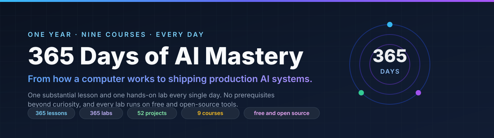

<p align="center">
  
</p>

<h1 align="center">📚 365 Days of AI Mastery</h1>

<p align="center">
  <b>📖 Read the course →
  <a href="https://ai-roadmap-365.github.io/">ai-roadmap-365.github.io</a></b>
</p>

<p align="center">
  <b>From how a computer works to shipping production AI systems — one lesson and one lab every day for a year.</b>
</p>

<p align="center">
  <i>Nine standalone courses. 365 hands-on labs that actually run. Every output on every page captured from a real execution.</i>
</p>

<!-- STATS:START — generated by npm run generate:section-nav; do not edit by hand -->
<p align="center">
  
  
  
  
  
  
  
</p>
<!-- STATS:END -->

<p align="center">
  
  
  
  
</p>

<p align="center">
  <a href="https://www.linkedin.com/in/sandeepbazar/"></a>
  
</p>

<p align="center">
  <a href="#vision-and-audience">✨ Why</a> ·
  <a href="https://ai-roadmap-365.github.io/">📖 Read</a> ·
  <a href="CURRICULUM.md">🗺️ Curriculum</a> ·
  <a href="#released-labs">🧪 Labs</a> ·
  <a href="#getting-started">🚀 Quickstart</a> ·
  <a href="#lab-structure">🔬 Lab anatomy</a> ·
  <a href="#tests-and-validation">✅ Validation</a>
</p>

---

## ⭐ Star this if you want others to find it

This course is free, open source, and has no marketing behind it. A star is
the only signal GitHub gives someone searching for a hands-on AI curriculum —
so if you find it useful, starring it is genuinely how the next person
discovers it.

No newsletter, no sign-up, nothing gated. Just read it.

## What this is

A complete, self-paced path from **"what is a computer, really?"** to
**designing, building, evaluating, securing and deploying production AI
systems** — delivered as nine standalone courses that together form one
365-day program.

|  | |
| --- | --- |
| 📖 **Read a lesson** | [ai-roadmap-365.github.io](https://ai-roadmap-365.github.io/) — the published blog, one page per day |
| 🧪 **Run a lab** | [`labs/sections/`](labs/sections/) — self-contained, offline, no API keys |
| 🗺️ **See the plan** | [CURRICULUM.md](CURRICULUM.md) — all 365 days, collapsible |

**Everything is in this one repository**: the lessons, the labs, the projects,
the instructor material, the site that renders them, and the validation
pipeline that refuses to let a day be called finished before it is.

### The rules this course holds itself to

- **Nothing is claimed that was not run.** Every captured output in every
  lesson came from a real execution on a real machine, and the lab that
  produced it ships beside it.
- **No placeholders, ever.** A day is complete only when all thirteen
  completion flags are true and 24 validation gates pass — checked in both
  directions, so the tracker cannot flatter itself.
- **Free and open source throughout.** Where a paid tool is worth naming, a
  free alternative is named beside it, and no price is quoted that was not
  verified.
- **When the evidence contradicts the textbook, the evidence wins** — and the
  lesson says so, with the measurement.

## Vision and audience

A motivated adult beginner spends roughly one hour a day — one substantial
lesson plus one hands-on exercise — and in 365 days goes from "what is a
computer, really?" to designing, building, evaluating, securing, and
deploying production AI systems, finishing with a two-week capstone.
Everything works on a normal laptop, offline, with free and open-source
tools; anything paid always has a free alternative listed.

## The nine courses (365-day structure)

See **[CURRICULUM.md](CURRICULUM.md)** for the full collapsible index — expand any course, then a subsection, to drill down to individual days.


Nine standalone courses → 52 subsections → 365 days. Each course directly
contains its day directories (flat structure); weeks/subsections are grouping
labels for categories and projects, not folders. Taken together the nine
courses are **365 Days of AI Mastery**; each can also be taken on its own:

| Course | Weeks | Focus |
| ------ | ----- | ----- |
| Course01 Computing Foundations | 1–6 | how computers, the terminal, networks, git, and tooling work |
| Course02 Programming with Python | 7–14 | Python from zero to tested, packaged, database-backed apps |
| Course03 Math, Statistics, and Data | 15–20 | linear algebra, calculus, probability, pandas, visualization |
| Course04 Machine Learning | 21–28 | classical ML, evaluation discipline, features, deployment |
| Course05 Deep Learning | 29–34 | neural nets from scratch, PyTorch, CNNs, transformers |
| Course06 LLMs and Generative AI | 35–41 | prompting, LLM APIs, embeddings, RAG, fine-tuning, multimodal |
| Course07 AI Engineering | 42–47 | agents, MCP, coding agents, evals, full-stack AI apps |
| Course08 Deployment, MLOps, Security | 48–50 | Docker, cloud, monitoring, AI security and governance |
| Course09 Capstone | 51–52 | a complete AI product, shipped and defended |

The full day-by-day plan is `curriculum/curriculum.yml` (generated from
`curriculum/curriculum.source.mjs` — edit the source, then run
`npm run generate:curriculum`).

## Released labs

The same "Released labs" view the public labs repo shows, plus a column that
links each released day to where its lesson is published (blog post or LMS
lesson) and each course to its landing page. This block is **generated** —
run `npm run generate:section-nav` after releasing days or after editing
`curriculum/published-urls.yml`. (This section is private-only; the public
repo never carries publishing URLs or any pointer back here.)

<!-- RELEASED-LABS:START -->

**350 of 365 days released.** Expand a course, then a subsection, to reach its lab and its published blog/course lesson URL. Fill URLs in `curriculum/published-urls.yml` (or set the deployment base with `npm run configure`), then re-run `npm run generate:section-nav`.

<details>
<summary><h3>Course01 · Computing Foundations — 42 lab(s)</h3></summary>

<details>
<summary>Days 1-7 · Inside the Machine</summary>

| Day | Lab | Blog / Course lesson |
| --- | --- | --- |
| 1 | [How a Computer Works: From Transistors to Programs](labs/sections/computing-foundations/day-001-how-a-computer-works-from-transistors/README.md) | [lesson](https://ai-roadmap-365.github.io/day-001-how-a-computer-works-from-transistors) |
| 2 | [The CPU: Fetch, Decode, Execute](labs/sections/computing-foundations/day-002-the-cpu-fetch-decode-execute/README.md) | [lesson](https://ai-roadmap-365.github.io/day-002-the-cpu-fetch-decode-execute) |
| 3 | [Memory Hierarchy: Registers, RAM, and Storage](labs/sections/computing-foundations/day-003-memory-hierarchy-registers-ram-and-storage/README.md) | [lesson](https://ai-roadmap-365.github.io/day-003-memory-hierarchy-registers-ram-and-storage) |
| 4 | [Binary and Data Representation: Bits, Bytes, and Numbers](labs/sections/computing-foundations/day-004-binary-and-data-representation-bits-bytes/README.md) | [lesson](https://ai-roadmap-365.github.io/day-004-binary-and-data-representation-bits-bytes) |
| 5 | [Text, Images, and Sound as Data](labs/sections/computing-foundations/day-005-text-images-and-sound-as-data/README.md) | [lesson](https://ai-roadmap-365.github.io/day-005-text-images-and-sound-as-data) |
| 6 | [Operating Systems: What They Do and Why](labs/sections/computing-foundations/day-006-operating-systems-what-they-do-and/README.md) | [lesson](https://ai-roadmap-365.github.io/day-006-operating-systems-what-they-do-and) |
| 7 | [Processes, Threads, and Scheduling](labs/sections/computing-foundations/day-007-processes-threads-and-scheduling/README.md) | [lesson](https://ai-roadmap-365.github.io/day-007-processes-threads-and-scheduling) |

</details>
<details>
<summary>Days 8-14 · The Command Line</summary>

| Day | Lab | Blog / Course lesson |
| --- | --- | --- |
| 8 | [Meet the Terminal: Shells, Prompts, and Commands](labs/sections/computing-foundations/day-008-meet-the-terminal-shells-prompts-and/README.md) | [lesson](https://ai-roadmap-365.github.io/day-008-meet-the-terminal-shells-prompts-and) |
| 9 | [Navigating the Filesystem: Paths, Files, and Permissions](labs/sections/computing-foundations/day-009-navigating-the-filesystem-paths-files-and/README.md) | [lesson](https://ai-roadmap-365.github.io/day-009-navigating-the-filesystem-paths-files-and) |
| 10 | [Working with Text: cat, grep, sed, and Pipes](labs/sections/computing-foundations/day-010-working-with-text-cat-grep-sed/README.md) | [lesson](https://ai-roadmap-365.github.io/day-010-working-with-text-cat-grep-sed) |
| 11 | [Environment Variables and Shell Configuration](labs/sections/computing-foundations/day-011-environment-variables-and-shell-configuration/README.md) | [lesson](https://ai-roadmap-365.github.io/day-011-environment-variables-and-shell-configuration) |
| 12 | [Shell Scripting: Variables, Loops, and Conditionals](labs/sections/computing-foundations/day-012-shell-scripting-variables-loops-and-conditionals/README.md) | [lesson](https://ai-roadmap-365.github.io/day-012-shell-scripting-variables-loops-and-conditionals) |
| 13 | [Package Managers: Homebrew, apt, and winget](labs/sections/computing-foundations/day-013-package-managers-homebrew-apt-and-winget/README.md) | [lesson](https://ai-roadmap-365.github.io/day-013-package-managers-homebrew-apt-and-winget) |
| 14 | [Automating Tasks with Shell Scripts and cron](labs/sections/computing-foundations/day-014-automating-tasks-with-shell-scripts-and/README.md) | [lesson](https://ai-roadmap-365.github.io/day-014-automating-tasks-with-shell-scripts-and) |

</details>
<details>
<summary>Days 15-21 · How the Internet Works</summary>

| Day | Lab | Blog / Course lesson |
| --- | --- | --- |
| 15 | [What Happens When You Load a Web Page](labs/sections/computing-foundations/day-015-what-happens-when-you-load-a/README.md) | [lesson](https://ai-roadmap-365.github.io/day-015-what-happens-when-you-load-a) |
| 16 | [IP Addresses, DNS, and Routing](labs/sections/computing-foundations/day-016-ip-addresses-dns-and-routing/README.md) | [lesson](https://ai-roadmap-365.github.io/day-016-ip-addresses-dns-and-routing) |
| 17 | [TCP, UDP, and Ports](labs/sections/computing-foundations/day-017-tcp-udp-and-ports/README.md) | [lesson](https://ai-roadmap-365.github.io/day-017-tcp-udp-and-ports) |
| 18 | [HTTP: Requests, Responses, and Methods](labs/sections/computing-foundations/day-018-http-requests-responses-and-methods/README.md) | [lesson](https://ai-roadmap-365.github.io/day-018-http-requests-responses-and-methods) |
| 19 | [HTTPS and TLS: Encryption on the Wire](labs/sections/computing-foundations/day-019-https-and-tls-encryption-on-the/README.md) | [lesson](https://ai-roadmap-365.github.io/day-019-https-and-tls-encryption-on-the) |
| 20 | [How Browsers Render: HTML, CSS, and JavaScript](labs/sections/computing-foundations/day-020-how-browsers-render-html-css-and/README.md) | [lesson](https://ai-roadmap-365.github.io/day-020-how-browsers-render-html-css-and) |
| 21 | [Inspecting Traffic with curl and Developer Tools](labs/sections/computing-foundations/day-021-inspecting-traffic-with-curl-and-developer/README.md) | [lesson](https://ai-roadmap-365.github.io/day-021-inspecting-traffic-with-curl-and-developer) |

</details>
<details>
<summary>Days 22-28 · APIs and the Web</summary>

| Day | Lab | Blog / Course lesson |
| --- | --- | --- |
| 22 | [What an API Is and Why Everything Has One](labs/sections/computing-foundations/day-022-what-an-api-is-and-why/README.md) | [lesson](https://ai-roadmap-365.github.io/day-022-what-an-api-is-and-why) |
| 23 | [REST Fundamentals: Resources and Verbs](labs/sections/computing-foundations/day-023-rest-fundamentals-resources-and-verbs/README.md) | [lesson](https://ai-roadmap-365.github.io/day-023-rest-fundamentals-resources-and-verbs) |
| 24 | [JSON and Data Serialization](labs/sections/computing-foundations/day-024-json-and-data-serialization/README.md) | [lesson](https://ai-roadmap-365.github.io/day-024-json-and-data-serialization) |
| 25 | [API Authentication: Keys, Tokens, and OAuth](labs/sections/computing-foundations/day-025-api-authentication-keys-tokens-and-oauth/README.md) | [lesson](https://ai-roadmap-365.github.io/day-025-api-authentication-keys-tokens-and-oauth) |
| 26 | [Webhooks and Event-Driven APIs](labs/sections/computing-foundations/day-026-webhooks-and-event-driven-apis/README.md) | [lesson](https://ai-roadmap-365.github.io/day-026-webhooks-and-event-driven-apis) |
| 27 | [Rate Limits, Pagination, and Error Handling](labs/sections/computing-foundations/day-027-rate-limits-pagination-and-error-handling/README.md) | [lesson](https://ai-roadmap-365.github.io/day-027-rate-limits-pagination-and-error-handling) |
| 28 | [Consuming a Public API from the Command Line](labs/sections/computing-foundations/day-028-consuming-a-public-api-from-the/README.md) | [lesson](https://ai-roadmap-365.github.io/day-028-consuming-a-public-api-from-the) |

</details>
<details>
<summary>Days 29-35 · Git and GitHub</summary>

| Day | Lab | Blog / Course lesson |
| --- | --- | --- |
| 29 | [Why Version Control Exists](labs/sections/computing-foundations/day-029-why-version-control-exists/README.md) | [lesson](https://ai-roadmap-365.github.io/day-029-why-version-control-exists) |
| 30 | [Git Fundamentals: Repositories, Staging, and Commits](labs/sections/computing-foundations/day-030-git-fundamentals-repositories-staging-and-commits/README.md) | [lesson](https://ai-roadmap-365.github.io/day-030-git-fundamentals-repositories-staging-and-commits) |
| 31 | [Branching and Merging](labs/sections/computing-foundations/day-031-branching-and-merging/README.md) | [lesson](https://ai-roadmap-365.github.io/day-031-branching-and-merging) |
| 32 | [Remotes and GitHub](labs/sections/computing-foundations/day-032-remotes-and-github/README.md) | [lesson](https://ai-roadmap-365.github.io/day-032-remotes-and-github) |
| 33 | [Pull Requests and Code Review](labs/sections/computing-foundations/day-033-pull-requests-and-code-review/README.md) | [lesson](https://ai-roadmap-365.github.io/day-033-pull-requests-and-code-review) |
| 34 | [Undoing Things: Reset, Revert, and Reflog](labs/sections/computing-foundations/day-034-undoing-things-reset-revert-and-reflog/README.md) | [lesson](https://ai-roadmap-365.github.io/day-034-undoing-things-reset-revert-and-reflog) |
| 35 | [Git Workflows for Real Projects](labs/sections/computing-foundations/day-035-git-workflows-for-real-projects/README.md) | [lesson](https://ai-roadmap-365.github.io/day-035-git-workflows-for-real-projects) |

</details>
<details>
<summary>Days 36-42 · Systems Foundations: Storage, Observability, and Tooling</summary>

| Day | Lab | Blog / Course lesson |
| --- | --- | --- |
| 36 | [Choosing and Configuring a Code Editor](labs/sections/computing-foundations/day-036-choosing-and-configuring-a-code-editor/README.md) | [lesson](https://ai-roadmap-365.github.io/day-036-choosing-and-configuring-a-code-editor) |
| 37 | [Debuggers, Linters, and Formatters](labs/sections/computing-foundations/day-037-debuggers-linters-and-formatters/README.md) | [lesson](https://ai-roadmap-365.github.io/day-037-debuggers-linters-and-formatters) |
| 38 | [Regular Expressions](labs/sections/computing-foundations/day-038-regular-expressions/README.md) | [lesson](https://ai-roadmap-365.github.io/day-038-regular-expressions) |
| 39 | [Data Storage: Files, Databases, Object Storage, and Caches](labs/sections/computing-foundations/day-039-data-storage-files-databases-object-storage/README.md) | [lesson](https://ai-roadmap-365.github.io/day-039-data-storage-files-databases-object-storage) |
| 40 | [Observability: Logs, Metrics, Traces, and Dashboards](labs/sections/computing-foundations/day-040-observability-logs-metrics-traces-and-dashboards/README.md) | [lesson](https://ai-roadmap-365.github.io/day-040-observability-logs-metrics-traces-and-dashboards) |
| 41 | [Thinking in Automation: Scripts, Hooks, and Pipelines](labs/sections/computing-foundations/day-041-thinking-in-automation-scripts-hooks-and/README.md) | [lesson](https://ai-roadmap-365.github.io/day-041-thinking-in-automation-scripts-hooks-and) |
| 42 | [Section Review: Your Computing Foundations Toolkit](labs/sections/computing-foundations/day-042-section-review-your-computing-foundations-toolkit/README.md) | [lesson](https://ai-roadmap-365.github.io/day-042-section-review-your-computing-foundations-toolkit) |

</details>

</details>

<details>
<summary><h3>Course02 · Programming with Python — 56 lab(s)</h3></summary>

<details>
<summary>Days 43-49 · Python Setup and First Programs</summary>

| Day | Lab | Blog / Course lesson |
| --- | --- | --- |
| 43 | [Installing Python and Virtual Environments](labs/sections/programming-with-python/day-043-installing-python-and-virtual-environments/README.md) | [lesson](https://ai-roadmap-365.github.io/day-043-installing-python-and-virtual-environments) |
| 44 | [Variables and Types](labs/sections/programming-with-python/day-044-variables-and-types/README.md) | [lesson](https://ai-roadmap-365.github.io/day-044-variables-and-types) |
| 45 | [Strings and Text Processing](labs/sections/programming-with-python/day-045-strings-and-text-processing/README.md) | [lesson](https://ai-roadmap-365.github.io/day-045-strings-and-text-processing) |
| 46 | [Numbers, Math, and Precision](labs/sections/programming-with-python/day-046-numbers-math-and-precision/README.md) | [lesson](https://ai-roadmap-365.github.io/day-046-numbers-math-and-precision) |
| 47 | [Input, Output, and f-strings](labs/sections/programming-with-python/day-047-input-output-and-f-strings/README.md) | [lesson](https://ai-roadmap-365.github.io/day-047-input-output-and-f-strings) |
| 48 | [Reading Error Messages and Debugging](labs/sections/programming-with-python/day-048-reading-error-messages-and-debugging/README.md) | [lesson](https://ai-roadmap-365.github.io/day-048-reading-error-messages-and-debugging) |
| 49 | [Your First Real Program](labs/sections/programming-with-python/day-049-your-first-real-program/README.md) | [lesson](https://ai-roadmap-365.github.io/day-049-your-first-real-program) |

</details>
<details>
<summary>Days 50-56 · Control Flow and Collections</summary>

| Day | Lab | Blog / Course lesson |
| --- | --- | --- |
| 50 | [Conditionals and Boolean Logic](labs/sections/programming-with-python/day-050-conditionals-and-boolean-logic/README.md) | [lesson](https://ai-roadmap-365.github.io/day-050-conditionals-and-boolean-logic) |
| 51 | [Loops: for, while, and Iteration Patterns](labs/sections/programming-with-python/day-051-loops-for-while-and-iteration-patterns/README.md) | [lesson](https://ai-roadmap-365.github.io/day-051-loops-for-while-and-iteration-patterns) |
| 52 | [Lists in Depth](labs/sections/programming-with-python/day-052-lists-in-depth/README.md) | [lesson](https://ai-roadmap-365.github.io/day-052-lists-in-depth) |
| 53 | [Dictionaries in Depth](labs/sections/programming-with-python/day-053-dictionaries-in-depth/README.md) | [lesson](https://ai-roadmap-365.github.io/day-053-dictionaries-in-depth) |
| 54 | [Tuples, Sets, and Choosing a Collection](labs/sections/programming-with-python/day-054-tuples-sets-and-choosing-a-collection/README.md) | [lesson](https://ai-roadmap-365.github.io/day-054-tuples-sets-and-choosing-a-collection) |
| 55 | [Comprehensions and Iterator Thinking](labs/sections/programming-with-python/day-055-comprehensions-and-iterator-thinking/README.md) | [lesson](https://ai-roadmap-365.github.io/day-055-comprehensions-and-iterator-thinking) |
| 56 | [Building a Data-Driven CLI](labs/sections/programming-with-python/day-056-building-a-data-driven-cli/README.md) | [lesson](https://ai-roadmap-365.github.io/day-056-building-a-data-driven-cli) |

</details>
<details>
<summary>Days 57-63 · Functions and Program Design</summary>

| Day | Lab | Blog / Course lesson |
| --- | --- | --- |
| 57 | [Functions: Definition, Arguments, and Return Values](labs/sections/programming-with-python/day-057-functions-definition-arguments-and-return-values/README.md) | [lesson](https://ai-roadmap-365.github.io/day-057-functions-definition-arguments-and-return-values) |
| 58 | [Scope, Closures, and *args/**kwargs](labs/sections/programming-with-python/day-058-scope-closures-and-args-kwargs/README.md) | [lesson](https://ai-roadmap-365.github.io/day-058-scope-closures-and-args-kwargs) |
| 59 | [Modules, Imports, and Project Layout](labs/sections/programming-with-python/day-059-modules-imports-and-project-layout/README.md) | [lesson](https://ai-roadmap-365.github.io/day-059-modules-imports-and-project-layout) |
| 60 | [A Tour of the Standard Library](labs/sections/programming-with-python/day-060-a-tour-of-the-standard-library/README.md) | [lesson](https://ai-roadmap-365.github.io/day-060-a-tour-of-the-standard-library) |
| 61 | [Writing Readable Code](labs/sections/programming-with-python/day-061-writing-readable-code/README.md) | [lesson](https://ai-roadmap-365.github.io/day-061-writing-readable-code) |
| 62 | [Recursion](labs/sections/programming-with-python/day-062-recursion/README.md) | [lesson](https://ai-roadmap-365.github.io/day-062-recursion) |
| 63 | [Designing a Small Program Well](labs/sections/programming-with-python/day-063-designing-a-small-program-well/README.md) | [lesson](https://ai-roadmap-365.github.io/day-063-designing-a-small-program-well) |

</details>
<details>
<summary>Days 64-70 · Files, Errors, and Object-Oriented Python</summary>

| Day | Lab | Blog / Course lesson |
| --- | --- | --- |
| 64 | [Reading and Writing Files](labs/sections/programming-with-python/day-064-reading-and-writing-files/README.md) | [lesson](https://ai-roadmap-365.github.io/day-064-reading-and-writing-files) |
| 65 | [CSV and JSON in the Real World](labs/sections/programming-with-python/day-065-csv-and-json-in-the-real/README.md) | [lesson](https://ai-roadmap-365.github.io/day-065-csv-and-json-in-the-real) |
| 66 | [Exceptions and Error Handling Strategy](labs/sections/programming-with-python/day-066-exceptions-and-error-handling-strategy/README.md) | [lesson](https://ai-roadmap-365.github.io/day-066-exceptions-and-error-handling-strategy) |
| 67 | [Classes and Objects](labs/sections/programming-with-python/day-067-classes-and-objects/README.md) | [lesson](https://ai-roadmap-365.github.io/day-067-classes-and-objects) |
| 68 | [Inheritance, Composition, and Dunder Methods](labs/sections/programming-with-python/day-068-inheritance-composition-and-dunder-methods/README.md) | [lesson](https://ai-roadmap-365.github.io/day-068-inheritance-composition-and-dunder-methods) |
| 69 | [Dataclasses and Type Hints](labs/sections/programming-with-python/day-069-dataclasses-and-type-hints/README.md) | [lesson](https://ai-roadmap-365.github.io/day-069-dataclasses-and-type-hints) |
| 70 | [Modeling a Domain with Objects](labs/sections/programming-with-python/day-070-modeling-a-domain-with-objects/README.md) | [lesson](https://ai-roadmap-365.github.io/day-070-modeling-a-domain-with-objects) |

</details>
<details>
<summary>Days 71-77 · Testing and Code Quality</summary>

| Day | Lab | Blog / Course lesson |
| --- | --- | --- |
| 71 | [Why Test, and pytest Basics](labs/sections/programming-with-python/day-071-why-test-and-pytest-basics/README.md) | [lesson](https://ai-roadmap-365.github.io/day-071-why-test-and-pytest-basics) |
| 72 | [Fixtures, Parametrization, and Test Design](labs/sections/programming-with-python/day-072-fixtures-parametrization-and-test-design/README.md) | [lesson](https://ai-roadmap-365.github.io/day-072-fixtures-parametrization-and-test-design) |
| 73 | [Test-Driven Development](labs/sections/programming-with-python/day-073-test-driven-development/README.md) | [lesson](https://ai-roadmap-365.github.io/day-073-test-driven-development) |
| 74 | [Mocking and Testing Boundaries](labs/sections/programming-with-python/day-074-mocking-and-testing-boundaries/README.md) | [lesson](https://ai-roadmap-365.github.io/day-074-mocking-and-testing-boundaries) |
| 75 | [Static Typing with mypy](labs/sections/programming-with-python/day-075-static-typing-with-mypy/README.md) | [lesson](https://ai-roadmap-365.github.io/day-075-static-typing-with-mypy) |
| 76 | [Linting and Formatting with Ruff](labs/sections/programming-with-python/day-076-linting-and-formatting-with-ruff/README.md) | [lesson](https://ai-roadmap-365.github.io/day-076-linting-and-formatting-with-ruff) |
| 77 | [Quality Gates for a Python Project](labs/sections/programming-with-python/day-077-quality-gates-for-a-python-project/README.md) | [lesson](https://ai-roadmap-365.github.io/day-077-quality-gates-for-a-python-project) |

</details>
<details>
<summary>Days 78-84 · Python for Automation and the Web</summary>

| Day | Lab | Blog / Course lesson |
| --- | --- | --- |
| 78 | [HTTP in Python with requests](labs/sections/programming-with-python/day-078-http-in-python-with-requests/README.md) | [lesson](https://ai-roadmap-365.github.io/day-078-http-in-python-with-requests) |
| 79 | [Web Scraping Responsibly](labs/sections/programming-with-python/day-079-web-scraping-responsibly/README.md) | [lesson](https://ai-roadmap-365.github.io/day-079-web-scraping-responsibly) |
| 80 | [Building CLIs with argparse](labs/sections/programming-with-python/day-080-building-clis-with-argparse/README.md) | [lesson](https://ai-roadmap-365.github.io/day-080-building-clis-with-argparse) |
| 81 | [Scheduling and Background Jobs](labs/sections/programming-with-python/day-081-scheduling-and-background-jobs/README.md) | [lesson](https://ai-roadmap-365.github.io/day-081-scheduling-and-background-jobs) |
| 82 | [A First Web API with FastAPI](labs/sections/programming-with-python/day-082-a-first-web-api-with-fastapi/README.md) | [lesson](https://ai-roadmap-365.github.io/day-082-a-first-web-api-with-fastapi) |
| 83 | [Packaging and Distributing Python Code](labs/sections/programming-with-python/day-083-packaging-and-distributing-python-code/README.md) | [lesson](https://ai-roadmap-365.github.io/day-083-packaging-and-distributing-python-code) |
| 84 | [Shipping an Automation Toolkit](labs/sections/programming-with-python/day-084-shipping-an-automation-toolkit/README.md) | [lesson](https://ai-roadmap-365.github.io/day-084-shipping-an-automation-toolkit) |

</details>
<details>
<summary>Days 85-91 · SQL and Relational Databases</summary>

| Day | Lab | Blog / Course lesson |
| --- | --- | --- |
| 85 | [Relational Databases and SQLite](labs/sections/programming-with-python/day-085-relational-databases-and-sqlite/README.md) | [lesson](https://ai-roadmap-365.github.io/day-085-relational-databases-and-sqlite) |
| 86 | [SELECT: Filtering, Sorting, and Aggregating](labs/sections/programming-with-python/day-086-select-filtering-sorting-and-aggregating/README.md) | [lesson](https://ai-roadmap-365.github.io/day-086-select-filtering-sorting-and-aggregating) |
| 87 | [Joins and Relationships](labs/sections/programming-with-python/day-087-joins-and-relationships/README.md) | [lesson](https://ai-roadmap-365.github.io/day-087-joins-and-relationships) |
| 88 | [Inserting, Updating, and Schema Design](labs/sections/programming-with-python/day-088-inserting-updating-and-schema-design/README.md) | [lesson](https://ai-roadmap-365.github.io/day-088-inserting-updating-and-schema-design) |
| 89 | [Indexes and Query Performance](labs/sections/programming-with-python/day-089-indexes-and-query-performance/README.md) | [lesson](https://ai-roadmap-365.github.io/day-089-indexes-and-query-performance) |
| 90 | [SQLite from Python](labs/sections/programming-with-python/day-090-sqlite-from-python/README.md) | [lesson](https://ai-roadmap-365.github.io/day-090-sqlite-from-python) |
| 91 | [Designing and Querying a Real Schema](labs/sections/programming-with-python/day-091-designing-and-querying-a-real-schema/README.md) | [lesson](https://ai-roadmap-365.github.io/day-091-designing-and-querying-a-real-schema) |

</details>
<details>
<summary>Days 92-98 · Data Formats and Pipelines</summary>

| Day | Lab | Blog / Course lesson |
| --- | --- | --- |
| 92 | [Beyond Tables: NoSQL and Key-Value Stores](labs/sections/programming-with-python/day-092-beyond-tables-nosql-and-key-value/README.md) | [lesson](https://ai-roadmap-365.github.io/day-092-beyond-tables-nosql-and-key-value) |
| 93 | [ORMs and SQLAlchemy](labs/sections/programming-with-python/day-093-orms-and-sqlalchemy/README.md) | [lesson](https://ai-roadmap-365.github.io/day-093-orms-and-sqlalchemy) |
| 94 | [Data Validation with pydantic](labs/sections/programming-with-python/day-094-data-validation-with-pydantic/README.md) | [lesson](https://ai-roadmap-365.github.io/day-094-data-validation-with-pydantic) |
| 95 | [Dates, Times, and Time Zones](labs/sections/programming-with-python/day-095-dates-times-and-time-zones/README.md) | [lesson](https://ai-roadmap-365.github.io/day-095-dates-times-and-time-zones) |
| 96 | [Concurrency and async Basics](labs/sections/programming-with-python/day-096-concurrency-and-async-basics/README.md) | [lesson](https://ai-roadmap-365.github.io/day-096-concurrency-and-async-basics) |
| 97 | [Logging and Configuration](labs/sections/programming-with-python/day-097-logging-and-configuration/README.md) | [lesson](https://ai-roadmap-365.github.io/day-097-logging-and-configuration) |
| 98 | [Section Project: A Complete Data Pipeline](labs/sections/programming-with-python/day-098-section-project-a-complete-data-pipeline/README.md) | [lesson](https://ai-roadmap-365.github.io/day-098-section-project-a-complete-data-pipeline) |

</details>

</details>

<details>
<summary><h3>Course03 · Math, Statistics, and Data — 42 lab(s)</h3></summary>

<details>
<summary>Days 99-105 · Linear Algebra I: Vectors and Matrices</summary>

| Day | Lab | Blog / Course lesson |
| --- | --- | --- |
| 99 | [Vectors: Direction, Magnitude, and Meaning](labs/sections/math-statistics-and-data/day-099-vectors-direction-magnitude-and-meaning/README.md) | [lesson](https://ai-roadmap-365.github.io/day-099-vectors-direction-magnitude-and-meaning) |
| 100 | [Matrices and What They Represent](labs/sections/math-statistics-and-data/day-100-matrices-and-what-they-represent/README.md) | [lesson](https://ai-roadmap-365.github.io/day-100-matrices-and-what-they-represent) |
| 101 | [Matrix Multiplication](labs/sections/math-statistics-and-data/day-101-matrix-multiplication/README.md) | [lesson](https://ai-roadmap-365.github.io/day-101-matrix-multiplication) |
| 102 | [Linear Transformations](labs/sections/math-statistics-and-data/day-102-linear-transformations/README.md) | [lesson](https://ai-roadmap-365.github.io/day-102-linear-transformations) |
| 103 | [Dot Products and Similarity](labs/sections/math-statistics-and-data/day-103-dot-products-and-similarity/README.md) | [lesson](https://ai-roadmap-365.github.io/day-103-dot-products-and-similarity) |
| 104 | [NumPy: Arrays and Vectorized Thinking](labs/sections/math-statistics-and-data/day-104-numpy-arrays-and-vectorized-thinking/README.md) | [lesson](https://ai-roadmap-365.github.io/day-104-numpy-arrays-and-vectorized-thinking) |
| 105 | [Transforming Images with Matrices](labs/sections/math-statistics-and-data/day-105-transforming-images-with-matrices/README.md) | [lesson](https://ai-roadmap-365.github.io/day-105-transforming-images-with-matrices) |

</details>
<details>
<summary>Days 106-112 · Linear Algebra II and Calculus</summary>

| Day | Lab | Blog / Course lesson |
| --- | --- | --- |
| 106 | [Eigenvalues and Eigenvectors, Intuitively](labs/sections/math-statistics-and-data/day-106-eigenvalues-and-eigenvectors-intuitively/README.md) | [lesson](https://ai-roadmap-365.github.io/day-106-eigenvalues-and-eigenvectors-intuitively) |
| 107 | [Norms, Distances, and Similarity Measures](labs/sections/math-statistics-and-data/day-107-norms-distances-and-similarity-measures/README.md) | [lesson](https://ai-roadmap-365.github.io/day-107-norms-distances-and-similarity-measures) |
| 108 | [Derivatives: Rates of Change](labs/sections/math-statistics-and-data/day-108-derivatives-rates-of-change/README.md) | [lesson](https://ai-roadmap-365.github.io/day-108-derivatives-rates-of-change) |
| 109 | [Partial Derivatives and Gradients](labs/sections/math-statistics-and-data/day-109-partial-derivatives-and-gradients/README.md) | [lesson](https://ai-roadmap-365.github.io/day-109-partial-derivatives-and-gradients) |
| 110 | [The Chain Rule](labs/sections/math-statistics-and-data/day-110-the-chain-rule/README.md) | [lesson](https://ai-roadmap-365.github.io/day-110-the-chain-rule) |
| 111 | [Gradient Descent from Scratch](labs/sections/math-statistics-and-data/day-111-gradient-descent-from-scratch/README.md) | [lesson](https://ai-roadmap-365.github.io/day-111-gradient-descent-from-scratch) |
| 112 | [Visualizing Optimization](labs/sections/math-statistics-and-data/day-112-visualizing-optimization/README.md) | [lesson](https://ai-roadmap-365.github.io/day-112-visualizing-optimization) |

</details>
<details>
<summary>Days 113-119 · Probability and Statistics</summary>

| Day | Lab | Blog / Course lesson |
| --- | --- | --- |
| 113 | [Probability: Events, Rules, and Intuition](labs/sections/math-statistics-and-data/day-113-probability-events-rules-and-intuition/README.md) | [lesson](https://ai-roadmap-365.github.io/day-113-probability-events-rules-and-intuition) |
| 114 | [Random Variables and Distributions](labs/sections/math-statistics-and-data/day-114-random-variables-and-distributions/README.md) | [lesson](https://ai-roadmap-365.github.io/day-114-random-variables-and-distributions) |
| 115 | [Bayes’ Theorem](labs/sections/math-statistics-and-data/day-115-bayes-theorem/README.md) | [lesson](https://ai-roadmap-365.github.io/day-115-bayes-theorem) |
| 116 | [Descriptive Statistics That Don’t Lie](labs/sections/math-statistics-and-data/day-116-descriptive-statistics-that-dont-lie/README.md) | [lesson](https://ai-roadmap-365.github.io/day-116-descriptive-statistics-that-dont-lie) |
| 117 | [Sampling and the Central Limit Theorem](labs/sections/math-statistics-and-data/day-117-sampling-and-the-central-limit-theorem/README.md) | [lesson](https://ai-roadmap-365.github.io/day-117-sampling-and-the-central-limit-theorem) |
| 118 | [Hypothesis Tests and Confidence Intervals](labs/sections/math-statistics-and-data/day-118-hypothesis-tests-and-confidence-intervals/README.md) | [lesson](https://ai-roadmap-365.github.io/day-118-hypothesis-tests-and-confidence-intervals) |
| 119 | [Analyzing an Experiment End to End](labs/sections/math-statistics-and-data/day-119-analyzing-an-experiment-end-to-end/README.md) | [lesson](https://ai-roadmap-365.github.io/day-119-analyzing-an-experiment-end-to-end) |

</details>
<details>
<summary>Days 120-126 · pandas and Data Wrangling</summary>

| Day | Lab | Blog / Course lesson |
| --- | --- | --- |
| 120 | [pandas: Series and DataFrames](labs/sections/math-statistics-and-data/day-120-pandas-series-and-dataframes/README.md) | [lesson](https://ai-roadmap-365.github.io/day-120-pandas-series-and-dataframes) |
| 121 | [Loading and Inspecting Data](labs/sections/math-statistics-and-data/day-121-loading-and-inspecting-data/README.md) | [lesson](https://ai-roadmap-365.github.io/day-121-loading-and-inspecting-data) |
| 122 | [Selecting and Filtering](labs/sections/math-statistics-and-data/day-122-selecting-and-filtering/README.md) | [lesson](https://ai-roadmap-365.github.io/day-122-selecting-and-filtering) |
| 123 | [Groupby and Aggregation](labs/sections/math-statistics-and-data/day-123-groupby-and-aggregation/README.md) | [lesson](https://ai-roadmap-365.github.io/day-123-groupby-and-aggregation) |
| 124 | [Merging and Reshaping](labs/sections/math-statistics-and-data/day-124-merging-and-reshaping/README.md) | [lesson](https://ai-roadmap-365.github.io/day-124-merging-and-reshaping) |
| 125 | [Cleaning Messy Data](labs/sections/math-statistics-and-data/day-125-cleaning-messy-data/README.md) | [lesson](https://ai-roadmap-365.github.io/day-125-cleaning-messy-data) |
| 126 | [A Reproducible Cleaning Pipeline](labs/sections/math-statistics-and-data/day-126-a-reproducible-cleaning-pipeline/README.md) | [lesson](https://ai-roadmap-365.github.io/day-126-a-reproducible-cleaning-pipeline) |

</details>
<details>
<summary>Days 127-133 · Data Visualization</summary>

| Day | Lab | Blog / Course lesson |
| --- | --- | --- |
| 127 | [Why We Visualize, and Choosing the Right Chart](labs/sections/math-statistics-and-data/day-127-why-we-visualize-and-choosing-the/README.md) | [lesson](https://ai-roadmap-365.github.io/day-127-why-we-visualize-and-choosing-the) |
| 128 | [Matplotlib Fundamentals](labs/sections/math-statistics-and-data/day-128-matplotlib-fundamentals/README.md) | [lesson](https://ai-roadmap-365.github.io/day-128-matplotlib-fundamentals) |
| 129 | [Statistical Plots with seaborn](labs/sections/math-statistics-and-data/day-129-statistical-plots-with-seaborn/README.md) | [lesson](https://ai-roadmap-365.github.io/day-129-statistical-plots-with-seaborn) |
| 130 | [Distributions and Relationships](labs/sections/math-statistics-and-data/day-130-distributions-and-relationships/README.md) | [lesson](https://ai-roadmap-365.github.io/day-130-distributions-and-relationships) |
| 131 | [Time Series Visualization](labs/sections/math-statistics-and-data/day-131-time-series-visualization/README.md) | [lesson](https://ai-roadmap-365.github.io/day-131-time-series-visualization) |
| 132 | [Visual Storytelling and Chart Honesty](labs/sections/math-statistics-and-data/day-132-visual-storytelling-and-chart-honesty/README.md) | [lesson](https://ai-roadmap-365.github.io/day-132-visual-storytelling-and-chart-honesty) |
| 133 | [Building an EDA Report](labs/sections/math-statistics-and-data/day-133-building-an-eda-report/README.md) | [lesson](https://ai-roadmap-365.github.io/day-133-building-an-eda-report) |

</details>
<details>
<summary>Days 134-140 · Working with Real Data</summary>

| Day | Lab | Blog / Course lesson |
| --- | --- | --- |
| 134 | [Finding Data: Open Datasets and APIs](labs/sections/math-statistics-and-data/day-134-finding-data-open-datasets-and-apis/README.md) | [lesson](https://ai-roadmap-365.github.io/day-134-finding-data-open-datasets-and-apis) |
| 135 | [From API to DataFrame](labs/sections/math-statistics-and-data/day-135-from-api-to-dataframe/README.md) | [lesson](https://ai-roadmap-365.github.io/day-135-from-api-to-dataframe) |
| 136 | [The Exploratory Data Analysis Process](labs/sections/math-statistics-and-data/day-136-the-exploratory-data-analysis-process/README.md) | [lesson](https://ai-roadmap-365.github.io/day-136-the-exploratory-data-analysis-process) |
| 137 | [Thinking in Features](labs/sections/math-statistics-and-data/day-137-thinking-in-features/README.md) | [lesson](https://ai-roadmap-365.github.io/day-137-thinking-in-features) |
| 138 | [Data Ethics, Bias, and Provenance](labs/sections/math-statistics-and-data/day-138-data-ethics-bias-and-provenance/README.md) | [lesson](https://ai-roadmap-365.github.io/day-138-data-ethics-bias-and-provenance) |
| 139 | [Reproducible Notebooks](labs/sections/math-statistics-and-data/day-139-reproducible-notebooks/README.md) | [lesson](https://ai-roadmap-365.github.io/day-139-reproducible-notebooks) |
| 140 | [Section Project: An Exploratory Study](labs/sections/math-statistics-and-data/day-140-section-project-an-exploratory-study/README.md) | [lesson](https://ai-roadmap-365.github.io/day-140-section-project-an-exploratory-study) |

</details>

</details>

<details>
<summary><h3>Course04 · Machine Learning — 56 lab(s)</h3></summary>

<details>
<summary>Days 141-147 · Machine Learning Fundamentals</summary>

| Day | Lab | Blog / Course lesson |
| --- | --- | --- |
| 141 | [What Machine Learning Is and Is Not](labs/sections/machine-learning/day-141-what-machine-learning-is-and-is/README.md) | [lesson](https://ai-roadmap-365.github.io/day-141-what-machine-learning-is-and-is) |
| 142 | [Supervised, Unsupervised, and Reinforcement Learning](labs/sections/machine-learning/day-142-supervised-unsupervised-and-reinforcement-learning/README.md) | [lesson](https://ai-roadmap-365.github.io/day-142-supervised-unsupervised-and-reinforcement-learning) |
| 143 | [The Machine Learning Workflow](labs/sections/machine-learning/day-143-the-machine-learning-workflow/README.md) | [lesson](https://ai-roadmap-365.github.io/day-143-the-machine-learning-workflow) |
| 144 | [Train, Validation, and Test Splits](labs/sections/machine-learning/day-144-train-validation-and-test-splits/README.md) | [lesson](https://ai-roadmap-365.github.io/day-144-train-validation-and-test-splits) |
| 145 | [Overfitting and Underfitting](labs/sections/machine-learning/day-145-overfitting-and-underfitting/README.md) | [lesson](https://ai-roadmap-365.github.io/day-145-overfitting-and-underfitting) |
| 146 | [Your First Model with scikit-learn](labs/sections/machine-learning/day-146-your-first-model-with-scikit-learn/README.md) | [lesson](https://ai-roadmap-365.github.io/day-146-your-first-model-with-scikit-learn) |
| 147 | [An End-to-End Classification Exercise](labs/sections/machine-learning/day-147-an-end-to-end-classification-exercise/README.md) | [lesson](https://ai-roadmap-365.github.io/day-147-an-end-to-end-classification-exercise) |

</details>
<details>
<summary>Days 148-154 · Regression</summary>

| Day | Lab | Blog / Course lesson |
| --- | --- | --- |
| 148 | [Linear Regression](labs/sections/machine-learning/day-148-linear-regression/README.md) | [lesson](https://ai-roadmap-365.github.io/day-148-linear-regression) |
| 149 | [Loss Functions and Least Squares](labs/sections/machine-learning/day-149-loss-functions-and-least-squares/README.md) | [lesson](https://ai-roadmap-365.github.io/day-149-loss-functions-and-least-squares) |
| 150 | [Multiple and Polynomial Regression](labs/sections/machine-learning/day-150-multiple-and-polynomial-regression/README.md) | [lesson](https://ai-roadmap-365.github.io/day-150-multiple-and-polynomial-regression) |
| 151 | [Regularization: Ridge and Lasso](labs/sections/machine-learning/day-151-regularization-ridge-and-lasso/README.md) | [lesson](https://ai-roadmap-365.github.io/day-151-regularization-ridge-and-lasso) |
| 152 | [Regression Metrics](labs/sections/machine-learning/day-152-regression-metrics/README.md) | [lesson](https://ai-roadmap-365.github.io/day-152-regression-metrics) |
| 153 | [Linear Regression from Scratch](labs/sections/machine-learning/day-153-linear-regression-from-scratch/README.md) | [lesson](https://ai-roadmap-365.github.io/day-153-linear-regression-from-scratch) |
| 154 | [A Complete Regression Project](labs/sections/machine-learning/day-154-a-complete-regression-project/README.md) | [lesson](https://ai-roadmap-365.github.io/day-154-a-complete-regression-project) |

</details>
<details>
<summary>Days 155-161 · Classification</summary>

| Day | Lab | Blog / Course lesson |
| --- | --- | --- |
| 155 | [Logistic Regression](labs/sections/machine-learning/day-155-logistic-regression/README.md) | [lesson](https://ai-roadmap-365.github.io/day-155-logistic-regression) |
| 156 | [Decision Boundaries](labs/sections/machine-learning/day-156-decision-boundaries/README.md) | [lesson](https://ai-roadmap-365.github.io/day-156-decision-boundaries) |
| 157 | [k-Nearest Neighbors](labs/sections/machine-learning/day-157-k-nearest-neighbors/README.md) | [lesson](https://ai-roadmap-365.github.io/day-157-k-nearest-neighbors) |
| 158 | [Naive Bayes and Text Classification](labs/sections/machine-learning/day-158-naive-bayes-and-text-classification/README.md) | [lesson](https://ai-roadmap-365.github.io/day-158-naive-bayes-and-text-classification) |
| 159 | [Precision, Recall, ROC, and Choosing Thresholds](labs/sections/machine-learning/day-159-precision-recall-roc-and-choosing-thresholds/README.md) | [lesson](https://ai-roadmap-365.github.io/day-159-precision-recall-roc-and-choosing-thresholds) |
| 160 | [Class Imbalance](labs/sections/machine-learning/day-160-class-imbalance/README.md) | [lesson](https://ai-roadmap-365.github.io/day-160-class-imbalance) |
| 161 | [A Complete Classification Project](labs/sections/machine-learning/day-161-a-complete-classification-project/README.md) | [lesson](https://ai-roadmap-365.github.io/day-161-a-complete-classification-project) |

</details>
<details>
<summary>Days 162-168 · Trees and Ensembles</summary>

| Day | Lab | Blog / Course lesson |
| --- | --- | --- |
| 162 | [Decision Trees](labs/sections/machine-learning/day-162-decision-trees/README.md) | [lesson](https://ai-roadmap-365.github.io/day-162-decision-trees) |
| 163 | [Random Forests](labs/sections/machine-learning/day-163-random-forests/README.md) | [lesson](https://ai-roadmap-365.github.io/day-163-random-forests) |
| 164 | [Gradient Boosting](labs/sections/machine-learning/day-164-gradient-boosting/README.md) | [lesson](https://ai-roadmap-365.github.io/day-164-gradient-boosting) |
| 165 | [XGBoost and LightGBM in Practice](labs/sections/machine-learning/day-165-xgboost-and-lightgbm-in-practice/README.md) | [lesson](https://ai-roadmap-365.github.io/day-165-xgboost-and-lightgbm-in-practice) |
| 166 | [Hyperparameter Tuning](labs/sections/machine-learning/day-166-hyperparameter-tuning/README.md) | [lesson](https://ai-roadmap-365.github.io/day-166-hyperparameter-tuning) |
| 167 | [Cross-Validation Done Right](labs/sections/machine-learning/day-167-cross-validation-done-right/README.md) | [lesson](https://ai-roadmap-365.github.io/day-167-cross-validation-done-right) |
| 168 | [Winning on Tabular Data](labs/sections/machine-learning/day-168-winning-on-tabular-data/README.md) | [lesson](https://ai-roadmap-365.github.io/day-168-winning-on-tabular-data) |

</details>
<details>
<summary>Days 169-175 · Features and Support Vector Machines</summary>

| Day | Lab | Blog / Course lesson |
| --- | --- | --- |
| 169 | [Support Vector Machines](labs/sections/machine-learning/day-169-support-vector-machines/README.md) | [lesson](https://ai-roadmap-365.github.io/day-169-support-vector-machines) |
| 170 | [Feature Scaling and Encoding](labs/sections/machine-learning/day-170-feature-scaling-and-encoding/README.md) | [lesson](https://ai-roadmap-365.github.io/day-170-feature-scaling-and-encoding) |
| 171 | [Feature Engineering](labs/sections/machine-learning/day-171-feature-engineering/README.md) | [lesson](https://ai-roadmap-365.github.io/day-171-feature-engineering) |
| 172 | [Feature Selection](labs/sections/machine-learning/day-172-feature-selection/README.md) | [lesson](https://ai-roadmap-365.github.io/day-172-feature-selection) |
| 173 | [scikit-learn Pipelines](labs/sections/machine-learning/day-173-scikit-learn-pipelines/README.md) | [lesson](https://ai-roadmap-365.github.io/day-173-scikit-learn-pipelines) |
| 174 | [Handling Missing Data](labs/sections/machine-learning/day-174-handling-missing-data/README.md) | [lesson](https://ai-roadmap-365.github.io/day-174-handling-missing-data) |
| 175 | [Features Beat Algorithms](labs/sections/machine-learning/day-175-features-beat-algorithms/README.md) | [lesson](https://ai-roadmap-365.github.io/day-175-features-beat-algorithms) |

</details>
<details>
<summary>Days 176-182 · Evaluation and Interpretation</summary>

| Day | Lab | Blog / Course lesson |
| --- | --- | --- |
| 176 | [Choosing the Right Metric](labs/sections/machine-learning/day-176-choosing-the-right-metric/README.md) | [lesson](https://ai-roadmap-365.github.io/day-176-choosing-the-right-metric) |
| 177 | [Learning Curves and Diagnostics](labs/sections/machine-learning/day-177-learning-curves-and-diagnostics/README.md) | [lesson](https://ai-roadmap-365.github.io/day-177-learning-curves-and-diagnostics) |
| 178 | [Interpreting Models: Importances and SHAP](labs/sections/machine-learning/day-178-interpreting-models-importances-and-shap/README.md) | [lesson](https://ai-roadmap-365.github.io/day-178-interpreting-models-importances-and-shap) |
| 179 | [Fairness and Bias in Models](labs/sections/machine-learning/day-179-fairness-and-bias-in-models/README.md) | [lesson](https://ai-roadmap-365.github.io/day-179-fairness-and-bias-in-models) |
| 180 | [Data Leakage](labs/sections/machine-learning/day-180-data-leakage/README.md) | [lesson](https://ai-roadmap-365.github.io/day-180-data-leakage) |
| 181 | [Baselines and Error Analysis](labs/sections/machine-learning/day-181-baselines-and-error-analysis/README.md) | [lesson](https://ai-roadmap-365.github.io/day-181-baselines-and-error-analysis) |
| 182 | [Writing a Model Report](labs/sections/machine-learning/day-182-writing-a-model-report/README.md) | [lesson](https://ai-roadmap-365.github.io/day-182-writing-a-model-report) |

</details>
<details>
<summary>Days 183-189 · Unsupervised Learning</summary>

| Day | Lab | Blog / Course lesson |
| --- | --- | --- |
| 183 | [Clustering with k-means](labs/sections/machine-learning/day-183-clustering-with-k-means/README.md) | [lesson](https://ai-roadmap-365.github.io/day-183-clustering-with-k-means) |
| 184 | [Hierarchical Clustering and DBSCAN](labs/sections/machine-learning/day-184-hierarchical-clustering-and-dbscan/README.md) | [lesson](https://ai-roadmap-365.github.io/day-184-hierarchical-clustering-and-dbscan) |
| 185 | [Principal Component Analysis](labs/sections/machine-learning/day-185-principal-component-analysis/README.md) | [lesson](https://ai-roadmap-365.github.io/day-185-principal-component-analysis) |
| 186 | [t-SNE and UMAP](labs/sections/machine-learning/day-186-t-sne-and-umap/README.md) | [lesson](https://ai-roadmap-365.github.io/day-186-t-sne-and-umap) |
| 187 | [Anomaly Detection](labs/sections/machine-learning/day-187-anomaly-detection/README.md) | [lesson](https://ai-roadmap-365.github.io/day-187-anomaly-detection) |
| 188 | [Recommender Systems](labs/sections/machine-learning/day-188-recommender-systems/README.md) | [lesson](https://ai-roadmap-365.github.io/day-188-recommender-systems) |
| 189 | [A Segmentation Study](labs/sections/machine-learning/day-189-a-segmentation-study/README.md) | [lesson](https://ai-roadmap-365.github.io/day-189-a-segmentation-study) |

</details>
<details>
<summary>Days 190-196 · Machine Learning in Practice</summary>

| Day | Lab | Blog / Course lesson |
| --- | --- | --- |
| 190 | [The ML Project Lifecycle](labs/sections/machine-learning/day-190-the-ml-project-lifecycle/README.md) | [lesson](https://ai-roadmap-365.github.io/day-190-the-ml-project-lifecycle) |
| 191 | [Building Datasets and Labeling](labs/sections/machine-learning/day-191-building-datasets-and-labeling/README.md) | [lesson](https://ai-roadmap-365.github.io/day-191-building-datasets-and-labeling) |
| 192 | [Time Series Forecasting Basics](labs/sections/machine-learning/day-192-time-series-forecasting-basics/README.md) | [lesson](https://ai-roadmap-365.github.io/day-192-time-series-forecasting-basics) |
| 193 | [Saving and Versioning Models](labs/sections/machine-learning/day-193-saving-and-versioning-models/README.md) | [lesson](https://ai-roadmap-365.github.io/day-193-saving-and-versioning-models) |
| 194 | [Serving a Model over an API](labs/sections/machine-learning/day-194-serving-a-model-over-an-api/README.md) | [lesson](https://ai-roadmap-365.github.io/day-194-serving-a-model-over-an-api) |
| 195 | [Monitoring Models in Production](labs/sections/machine-learning/day-195-monitoring-models-in-production/README.md) | [lesson](https://ai-roadmap-365.github.io/day-195-monitoring-models-in-production) |
| 196 | [Section Project: An ML Service](labs/sections/machine-learning/day-196-section-project-an-ml-service/README.md) | [lesson](https://ai-roadmap-365.github.io/day-196-section-project-an-ml-service) |

</details>

</details>

<details>
<summary><h3>Course05 · Deep Learning — 42 lab(s)</h3></summary>

<details>
<summary>Days 197-203 · Neural Network Foundations</summary>

| Day | Lab | Blog / Course lesson |
| --- | --- | --- |
| 197 | [The Perceptron](labs/sections/deep-learning/day-197-the-perceptron/README.md) | [lesson](https://ai-roadmap-365.github.io/day-197-the-perceptron) |
| 198 | [Activation Functions](labs/sections/deep-learning/day-198-activation-functions/README.md) | [lesson](https://ai-roadmap-365.github.io/day-198-activation-functions) |
| 199 | [Forward Propagation](labs/sections/deep-learning/day-199-forward-propagation/README.md) | [lesson](https://ai-roadmap-365.github.io/day-199-forward-propagation) |
| 200 | [Backpropagation](labs/sections/deep-learning/day-200-backpropagation/README.md) | [lesson](https://ai-roadmap-365.github.io/day-200-backpropagation) |
| 201 | [A Neural Network in Pure NumPy](labs/sections/deep-learning/day-201-a-neural-network-in-pure-numpy/README.md) | [lesson](https://ai-roadmap-365.github.io/day-201-a-neural-network-in-pure-numpy) |
| 202 | [PyTorch Tensors](labs/sections/deep-learning/day-202-pytorch-tensors/README.md) | [lesson](https://ai-roadmap-365.github.io/day-202-pytorch-tensors) |
| 203 | [Training MNIST from Scratch](labs/sections/deep-learning/day-203-training-mnist-from-scratch/README.md) | [lesson](https://ai-roadmap-365.github.io/day-203-training-mnist-from-scratch) |

</details>
<details>
<summary>Days 204-210 · Training Deep Networks</summary>

| Day | Lab | Blog / Course lesson |
| --- | --- | --- |
| 204 | [PyTorch: autograd and nn.Module](labs/sections/deep-learning/day-204-pytorch-autograd-and-nn-module/README.md) | [lesson](https://ai-roadmap-365.github.io/day-204-pytorch-autograd-and-nn-module) |
| 205 | [Datasets and DataLoaders](labs/sections/deep-learning/day-205-datasets-and-dataloaders/README.md) | [lesson](https://ai-roadmap-365.github.io/day-205-datasets-and-dataloaders) |
| 206 | [Optimizers: SGD to Adam](labs/sections/deep-learning/day-206-optimizers-sgd-to-adam/README.md) | [lesson](https://ai-roadmap-365.github.io/day-206-optimizers-sgd-to-adam) |
| 207 | [Learning Rate Schedules](labs/sections/deep-learning/day-207-learning-rate-schedules/README.md) | [lesson](https://ai-roadmap-365.github.io/day-207-learning-rate-schedules) |
| 208 | [Dropout, Batch Norm, and Regularization](labs/sections/deep-learning/day-208-dropout-batch-norm-and-regularization/README.md) | [lesson](https://ai-roadmap-365.github.io/day-208-dropout-batch-norm-and-regularization) |
| 209 | [Debugging Training Runs](labs/sections/deep-learning/day-209-debugging-training-runs/README.md) | [lesson](https://ai-roadmap-365.github.io/day-209-debugging-training-runs) |
| 210 | [A Disciplined Training Project](labs/sections/deep-learning/day-210-a-disciplined-training-project/README.md) | [lesson](https://ai-roadmap-365.github.io/day-210-a-disciplined-training-project) |

</details>
<details>
<summary>Days 211-217 · Convolutional Networks and Vision</summary>

| Day | Lab | Blog / Course lesson |
| --- | --- | --- |
| 211 | [Convolutions](labs/sections/deep-learning/day-211-convolutions/README.md) | [lesson](https://ai-roadmap-365.github.io/day-211-convolutions) |
| 212 | [CNN Architectures](labs/sections/deep-learning/day-212-cnn-architectures/README.md) | [lesson](https://ai-roadmap-365.github.io/day-212-cnn-architectures) |
| 213 | [Transfer Learning](labs/sections/deep-learning/day-213-transfer-learning/README.md) | [lesson](https://ai-roadmap-365.github.io/day-213-transfer-learning) |
| 214 | [Data Augmentation](labs/sections/deep-learning/day-214-data-augmentation/README.md) | [lesson](https://ai-roadmap-365.github.io/day-214-data-augmentation) |
| 215 | [Training a Vision Model End to End](labs/sections/deep-learning/day-215-training-a-vision-model-end-to/README.md) | [lesson](https://ai-roadmap-365.github.io/day-215-training-a-vision-model-end-to) |
| 216 | [Beyond Classification: Detection and Segmentation](labs/sections/deep-learning/day-216-beyond-classification-detection-and-segmentation/README.md) | [lesson](https://ai-roadmap-365.github.io/day-216-beyond-classification-detection-and-segmentation) |
| 217 | [Your Own Image Classifier](labs/sections/deep-learning/day-217-your-own-image-classifier/README.md) | [lesson](https://ai-roadmap-365.github.io/day-217-your-own-image-classifier) |

</details>
<details>
<summary>Days 218-224 · Sequences and Text</summary>

| Day | Lab | Blog / Course lesson |
| --- | --- | --- |
| 218 | [Text Preprocessing and Tokenization](labs/sections/deep-learning/day-218-text-preprocessing-and-tokenization/README.md) | [lesson](https://ai-roadmap-365.github.io/day-218-text-preprocessing-and-tokenization) |
| 219 | [Word Embeddings](labs/sections/deep-learning/day-219-word-embeddings/README.md) | [lesson](https://ai-roadmap-365.github.io/day-219-word-embeddings) |
| 220 | [Recurrent Neural Networks](labs/sections/deep-learning/day-220-recurrent-neural-networks/README.md) | [lesson](https://ai-roadmap-365.github.io/day-220-recurrent-neural-networks) |
| 221 | [LSTMs and GRUs](labs/sections/deep-learning/day-221-lstms-and-grus/README.md) | [lesson](https://ai-roadmap-365.github.io/day-221-lstms-and-grus) |
| 222 | [Sequence-to-Sequence and Early Attention](labs/sections/deep-learning/day-222-sequence-to-sequence-and-early-attention/README.md) | [lesson](https://ai-roadmap-365.github.io/day-222-sequence-to-sequence-and-early-attention) |
| 223 | [Text Classification with Embeddings](labs/sections/deep-learning/day-223-text-classification-with-embeddings/README.md) | [lesson](https://ai-roadmap-365.github.io/day-223-text-classification-with-embeddings) |
| 224 | [A Sentiment Analysis Project](labs/sections/deep-learning/day-224-a-sentiment-analysis-project/README.md) | [lesson](https://ai-roadmap-365.github.io/day-224-a-sentiment-analysis-project) |

</details>
<details>
<summary>Days 225-231 · Transformers</summary>

| Day | Lab | Blog / Course lesson |
| --- | --- | --- |
| 225 | [“Attention Is All You Need”](labs/sections/deep-learning/day-225-attention-is-all-you-need/README.md) | [lesson](https://ai-roadmap-365.github.io/day-225-attention-is-all-you-need) |
| 226 | [Self-Attention, Step by Step](labs/sections/deep-learning/day-226-self-attention-step-by-step/README.md) | [lesson](https://ai-roadmap-365.github.io/day-226-self-attention-step-by-step) |
| 227 | [The Transformer Architecture](labs/sections/deep-learning/day-227-the-transformer-architecture/README.md) | [lesson](https://ai-roadmap-365.github.io/day-227-the-transformer-architecture) |
| 228 | [Encoder Models: BERT and Friends](labs/sections/deep-learning/day-228-encoder-models-bert-and-friends/README.md) | [lesson](https://ai-roadmap-365.github.io/day-228-encoder-models-bert-and-friends) |
| 229 | [Decoder Models: The GPT Family](labs/sections/deep-learning/day-229-decoder-models-the-gpt-family/README.md) | [lesson](https://ai-roadmap-365.github.io/day-229-decoder-models-the-gpt-family) |
| 230 | [Hugging Face Transformers in Practice](labs/sections/deep-learning/day-230-hugging-face-transformers-in-practice/README.md) | [lesson](https://ai-roadmap-365.github.io/day-230-hugging-face-transformers-in-practice) |
| 231 | [Fine-Tuning a Small Transformer](labs/sections/deep-learning/day-231-fine-tuning-a-small-transformer/README.md) | [lesson](https://ai-roadmap-365.github.io/day-231-fine-tuning-a-small-transformer) |

</details>
<details>
<summary>Days 232-238 · Training at Scale</summary>

| Day | Lab | Blog / Course lesson |
| --- | --- | --- |
| 232 | [GPUs and AI Hardware](labs/sections/deep-learning/day-232-gpus-and-ai-hardware/README.md) | [lesson](https://ai-roadmap-365.github.io/day-232-gpus-and-ai-hardware) |
| 233 | [Mixed Precision and Performance](labs/sections/deep-learning/day-233-mixed-precision-and-performance/README.md) | [lesson](https://ai-roadmap-365.github.io/day-233-mixed-precision-and-performance) |
| 234 | [Distributed Training Concepts](labs/sections/deep-learning/day-234-distributed-training-concepts/README.md) | [lesson](https://ai-roadmap-365.github.io/day-234-distributed-training-concepts) |
| 235 | [Experiment Tracking](labs/sections/deep-learning/day-235-experiment-tracking/README.md) | [lesson](https://ai-roadmap-365.github.io/day-235-experiment-tracking) |
| 236 | [Quantization and Distillation](labs/sections/deep-learning/day-236-quantization-and-distillation/README.md) | [lesson](https://ai-roadmap-365.github.io/day-236-quantization-and-distillation) |
| 237 | [Scaling Laws and What They Bought Us](labs/sections/deep-learning/day-237-scaling-laws-and-what-they-bought/README.md) | [lesson](https://ai-roadmap-365.github.io/day-237-scaling-laws-and-what-they-bought) |
| 238 | [Section Project: Reproducing a Paper](labs/sections/deep-learning/day-238-section-project-reproducing-a-paper/README.md) | [lesson](https://ai-roadmap-365.github.io/day-238-section-project-reproducing-a-paper) |

</details>

</details>

<details>
<summary><h3>Course06 · LLMs and Generative AI — 49 lab(s)</h3></summary>

<details>
<summary>Days 239-245 · The LLM Landscape</summary>

| Day | Lab | Blog / Course lesson |
| --- | --- | --- |
| 239 | [How Large Language Models Are Trained](labs/sections/llms-and-generative-ai/day-239-how-large-language-models-are-trained/README.md) | [lesson](https://ai-roadmap-365.github.io/day-239-how-large-language-models-are-trained) |
| 240 | [Pretraining, Fine-Tuning, and RLHF](labs/sections/llms-and-generative-ai/day-240-pretraining-fine-tuning-and-rlhf/README.md) | [lesson](https://ai-roadmap-365.github.io/day-240-pretraining-fine-tuning-and-rlhf) |
| 241 | [The Model Landscape: Claude, GPT, Gemini, Llama](labs/sections/llms-and-generative-ai/day-241-the-model-landscape-claude-gpt-gemini/README.md) | [lesson](https://ai-roadmap-365.github.io/day-241-the-model-landscape-claude-gpt-gemini) |
| 242 | [Open Weights versus Closed APIs](labs/sections/llms-and-generative-ai/day-242-open-weights-versus-closed-apis/README.md) | [lesson](https://ai-roadmap-365.github.io/day-242-open-weights-versus-closed-apis) |
| 243 | [Tokens, Context Windows, and Sampling](labs/sections/llms-and-generative-ai/day-243-tokens-context-windows-and-sampling/README.md) | [lesson](https://ai-roadmap-365.github.io/day-243-tokens-context-windows-and-sampling) |
| 244 | [Capabilities, Limits, and Hallucination](labs/sections/llms-and-generative-ai/day-244-capabilities-limits-and-hallucination/README.md) | [lesson](https://ai-roadmap-365.github.io/day-244-capabilities-limits-and-hallucination) |
| 245 | [Benchmarking Models Yourself](labs/sections/llms-and-generative-ai/day-245-benchmarking-models-yourself/README.md) | [lesson](https://ai-roadmap-365.github.io/day-245-benchmarking-models-yourself) |

</details>
<details>
<summary>Days 246-252 · Prompt Engineering</summary>

| Day | Lab | Blog / Course lesson |
| --- | --- | --- |
| 246 | [Prompting Fundamentals](labs/sections/llms-and-generative-ai/day-246-prompting-fundamentals/README.md) | [lesson](https://ai-roadmap-365.github.io/day-246-prompting-fundamentals) |
| 247 | [System Prompts and Role Design](labs/sections/llms-and-generative-ai/day-247-system-prompts-and-role-design/README.md) | [lesson](https://ai-roadmap-365.github.io/day-247-system-prompts-and-role-design) |
| 248 | [Few-Shot Examples and Chain of Thought](labs/sections/llms-and-generative-ai/day-248-few-shot-examples-and-chain-of/README.md) | [lesson](https://ai-roadmap-365.github.io/day-248-few-shot-examples-and-chain-of) |
| 249 | [Structured Output: Getting Reliable JSON](labs/sections/llms-and-generative-ai/day-249-structured-output-getting-reliable-json/README.md) | [lesson](https://ai-roadmap-365.github.io/day-249-structured-output-getting-reliable-json) |
| 250 | [Prompt Patterns and Templates](labs/sections/llms-and-generative-ai/day-250-prompt-patterns-and-templates/README.md) | [lesson](https://ai-roadmap-365.github.io/day-250-prompt-patterns-and-templates) |
| 251 | [Prompt Injection and Safe Prompting](labs/sections/llms-and-generative-ai/day-251-prompt-injection-and-safe-prompting/README.md) | [lesson](https://ai-roadmap-365.github.io/day-251-prompt-injection-and-safe-prompting) |
| 252 | [A Tested Prompt Library](labs/sections/llms-and-generative-ai/day-252-a-tested-prompt-library/README.md) | [lesson](https://ai-roadmap-365.github.io/day-252-a-tested-prompt-library) |

</details>
<details>
<summary>Days 253-259 · LLM APIs</summary>

| Day | Lab | Blog / Course lesson |
| --- | --- | --- |
| 253 | [First Calls to the Claude API](labs/sections/llms-and-generative-ai/day-253-first-calls-to-the-claude-api/README.md) | [lesson](https://ai-roadmap-365.github.io/day-253-first-calls-to-the-claude-api) |
| 254 | [The OpenAI-Compatible Ecosystem](labs/sections/llms-and-generative-ai/day-254-the-openai-compatible-ecosystem/README.md) | [lesson](https://ai-roadmap-365.github.io/day-254-the-openai-compatible-ecosystem) |
| 255 | [Streaming Responses](labs/sections/llms-and-generative-ai/day-255-streaming-responses/README.md) | [lesson](https://ai-roadmap-365.github.io/day-255-streaming-responses) |
| 256 | [Tool Use and Function Calling](labs/sections/llms-and-generative-ai/day-256-tool-use-and-function-calling/README.md) | [lesson](https://ai-roadmap-365.github.io/day-256-tool-use-and-function-calling) |
| 257 | [Working with Images and Documents](labs/sections/llms-and-generative-ai/day-257-working-with-images-and-documents/README.md) | [lesson](https://ai-roadmap-365.github.io/day-257-working-with-images-and-documents) |
| 258 | [Cost, Caching, and Rate Limits](labs/sections/llms-and-generative-ai/day-258-cost-caching-and-rate-limits/README.md) | [lesson](https://ai-roadmap-365.github.io/day-258-cost-caching-and-rate-limits) |
| 259 | [Building a CLI Assistant](labs/sections/llms-and-generative-ai/day-259-building-a-cli-assistant/README.md) | [lesson](https://ai-roadmap-365.github.io/day-259-building-a-cli-assistant) |

</details>
<details>
<summary>Days 260-266 · Embeddings and Vector Search</summary>

| Day | Lab | Blog / Course lesson |
| --- | --- | --- |
| 260 | [What Embeddings Are](labs/sections/llms-and-generative-ai/day-260-what-embeddings-are/README.md) | [lesson](https://ai-roadmap-365.github.io/day-260-what-embeddings-are) |
| 261 | [Semantic Similarity Search](labs/sections/llms-and-generative-ai/day-261-semantic-similarity-search/README.md) | [lesson](https://ai-roadmap-365.github.io/day-261-semantic-similarity-search) |
| 262 | [Vector Databases](labs/sections/llms-and-generative-ai/day-262-vector-databases/README.md) | [lesson](https://ai-roadmap-365.github.io/day-262-vector-databases) |
| 263 | [Chunking Strategies](labs/sections/llms-and-generative-ai/day-263-chunking-strategies/README.md) | [lesson](https://ai-roadmap-365.github.io/day-263-chunking-strategies) |
| 264 | [Hybrid Search and Rerankers](labs/sections/llms-and-generative-ai/day-264-hybrid-search-and-rerankers/README.md) | [lesson](https://ai-roadmap-365.github.io/day-264-hybrid-search-and-rerankers) |
| 265 | [Evaluating Retrieval Quality](labs/sections/llms-and-generative-ai/day-265-evaluating-retrieval-quality/README.md) | [lesson](https://ai-roadmap-365.github.io/day-265-evaluating-retrieval-quality) |
| 266 | [Semantic Search over Your Own Notes](labs/sections/llms-and-generative-ai/day-266-semantic-search-over-your-own-notes/README.md) | [lesson](https://ai-roadmap-365.github.io/day-266-semantic-search-over-your-own-notes) |

</details>
<details>
<summary>Days 267-273 · Retrieval-Augmented Generation</summary>

| Day | Lab | Blog / Course lesson |
| --- | --- | --- |
| 267 | [The RAG Architecture](labs/sections/llms-and-generative-ai/day-267-the-rag-architecture/README.md) | [lesson](https://ai-roadmap-365.github.io/day-267-the-rag-architecture) |
| 268 | [A Minimal RAG System from Scratch](labs/sections/llms-and-generative-ai/day-268-a-minimal-rag-system-from-scratch/README.md) | [lesson](https://ai-roadmap-365.github.io/day-268-a-minimal-rag-system-from-scratch) |
| 269 | [RAG over PDFs and Messy Documents](labs/sections/llms-and-generative-ai/day-269-rag-over-pdfs-and-messy-documents/README.md) | [lesson](https://ai-roadmap-365.github.io/day-269-rag-over-pdfs-and-messy-documents) |
| 270 | [Citations and Grounded Answers](labs/sections/llms-and-generative-ai/day-270-citations-and-grounded-answers/README.md) | [lesson](https://ai-roadmap-365.github.io/day-270-citations-and-grounded-answers) |
| 271 | [Advanced RAG Patterns](labs/sections/llms-and-generative-ai/day-271-advanced-rag-patterns/README.md) | [lesson](https://ai-roadmap-365.github.io/day-271-advanced-rag-patterns) |
| 272 | [Evaluating RAG Systems](labs/sections/llms-and-generative-ai/day-272-evaluating-rag-systems/README.md) | [lesson](https://ai-roadmap-365.github.io/day-272-evaluating-rag-systems) |
| 273 | [A Documentation Assistant](labs/sections/llms-and-generative-ai/day-273-a-documentation-assistant/README.md) | [lesson](https://ai-roadmap-365.github.io/day-273-a-documentation-assistant) |

</details>
<details>
<summary>Days 274-280 · Customizing and Running Models</summary>

| Day | Lab | Blog / Course lesson |
| --- | --- | --- |
| 274 | [Prompting versus RAG versus Fine-Tuning](labs/sections/llms-and-generative-ai/day-274-prompting-versus-rag-versus-fine-tuning/README.md) | [lesson](https://ai-roadmap-365.github.io/day-274-prompting-versus-rag-versus-fine-tuning) |
| 275 | [Fine-Tuning with LoRA](labs/sections/llms-and-generative-ai/day-275-fine-tuning-with-lora/README.md) | [lesson](https://ai-roadmap-365.github.io/day-275-fine-tuning-with-lora) |
| 276 | [Building Fine-Tuning Datasets](labs/sections/llms-and-generative-ai/day-276-building-fine-tuning-datasets/README.md) | [lesson](https://ai-roadmap-365.github.io/day-276-building-fine-tuning-datasets) |
| 277 | [Running Local Models with Ollama](labs/sections/llms-and-generative-ai/day-277-running-local-models-with-ollama/README.md) | [lesson](https://ai-roadmap-365.github.io/day-277-running-local-models-with-ollama) |
| 278 | [Quantized Inference and llama.cpp](labs/sections/llms-and-generative-ai/day-278-quantized-inference-and-llama-cpp/README.md) | [lesson](https://ai-roadmap-365.github.io/day-278-quantized-inference-and-llama-cpp) |
| 279 | [Serving Open Models](labs/sections/llms-and-generative-ai/day-279-serving-open-models/README.md) | [lesson](https://ai-roadmap-365.github.io/day-279-serving-open-models) |
| 280 | [Fine-Tune and Serve Your Own Model](labs/sections/llms-and-generative-ai/day-280-fine-tune-and-serve-your-own/README.md) | [lesson](https://ai-roadmap-365.github.io/day-280-fine-tune-and-serve-your-own) |

</details>
<details>
<summary>Days 281-287 · Multimodal and Generative Media</summary>

| Day | Lab | Blog / Course lesson |
| --- | --- | --- |
| 281 | [How Diffusion Models Generate Images](labs/sections/llms-and-generative-ai/day-281-how-diffusion-models-generate-images/README.md) | [lesson](https://ai-roadmap-365.github.io/day-281-how-diffusion-models-generate-images) |
| 282 | [Image Generation in Practice](labs/sections/llms-and-generative-ai/day-282-image-generation-in-practice/README.md) | [lesson](https://ai-roadmap-365.github.io/day-282-image-generation-in-practice) |
| 283 | [Speech: Recognition and Synthesis](labs/sections/llms-and-generative-ai/day-283-speech-recognition-and-synthesis/README.md) | [lesson](https://ai-roadmap-365.github.io/day-283-speech-recognition-and-synthesis) |
| 284 | [Video and Music Generation](labs/sections/llms-and-generative-ai/day-284-video-and-music-generation/README.md) | [lesson](https://ai-roadmap-365.github.io/day-284-video-and-music-generation) |
| 285 | [Multimodal Models](labs/sections/llms-and-generative-ai/day-285-multimodal-models/README.md) | [lesson](https://ai-roadmap-365.github.io/day-285-multimodal-models) |
| 286 | [Generative AI Ethics and Copyright](labs/sections/llms-and-generative-ai/day-286-generative-ai-ethics-and-copyright/README.md) | [lesson](https://ai-roadmap-365.github.io/day-286-generative-ai-ethics-and-copyright) |
| 287 | [Section Project: A Multimodal Application](labs/sections/llms-and-generative-ai/day-287-section-project-a-multimodal-application/README.md) | [lesson](https://ai-roadmap-365.github.io/day-287-section-project-a-multimodal-application) |

</details>

</details>

<details>
<summary><h3>Course07 · AI Engineering: Agents and Applications — 35 lab(s)</h3></summary>

<details>
<summary>Days 288-294 · AI Agents</summary>

| Day | Lab | Blog / Course lesson |
| --- | --- | --- |
| 288 | [What an AI Agent Is](labs/sections/ai-engineering/day-288-what-an-ai-agent-is/README.md) | [lesson](https://ai-roadmap-365.github.io/day-288-what-an-ai-agent-is) |
| 289 | [The Agent Loop: Reason, Act, Observe](labs/sections/ai-engineering/day-289-the-agent-loop-reason-act-observe/README.md) | [lesson](https://ai-roadmap-365.github.io/day-289-the-agent-loop-reason-act-observe) |
| 290 | [Designing Tools for Agents](labs/sections/ai-engineering/day-290-designing-tools-for-agents/README.md) | [lesson](https://ai-roadmap-365.github.io/day-290-designing-tools-for-agents) |
| 291 | [An Agent from Scratch](labs/sections/ai-engineering/day-291-an-agent-from-scratch/README.md) | [lesson](https://ai-roadmap-365.github.io/day-291-an-agent-from-scratch) |
| 292 | [Agent Frameworks and When to Use Them](labs/sections/ai-engineering/day-292-agent-frameworks-and-when-to-use/README.md) | [lesson](https://ai-roadmap-365.github.io/day-292-agent-frameworks-and-when-to-use) |
| 293 | [Multi-Agent Systems](labs/sections/ai-engineering/day-293-multi-agent-systems/README.md) | [lesson](https://ai-roadmap-365.github.io/day-293-multi-agent-systems) |
| 294 | [Building a Research Agent](labs/sections/ai-engineering/day-294-building-a-research-agent/README.md) | [lesson](https://ai-roadmap-365.github.io/day-294-building-a-research-agent) |

</details>
<details>
<summary>Days 295-301 · The Model Context Protocol</summary>

| Day | Lab | Blog / Course lesson |
| --- | --- | --- |
| 295 | [What MCP Is and Why It Exists](labs/sections/ai-engineering/day-295-what-mcp-is-and-why-it/README.md) | [lesson](https://ai-roadmap-365.github.io/day-295-what-mcp-is-and-why-it) |
| 296 | [Using MCP Servers](labs/sections/ai-engineering/day-296-using-mcp-servers/README.md) | [lesson](https://ai-roadmap-365.github.io/day-296-using-mcp-servers) |
| 297 | [Building an MCP Server](labs/sections/ai-engineering/day-297-building-an-mcp-server/README.md) | [lesson](https://ai-roadmap-365.github.io/day-297-building-an-mcp-server) |
| 298 | [MCP Resources and Prompts](labs/sections/ai-engineering/day-298-mcp-resources-and-prompts/README.md) | [lesson](https://ai-roadmap-365.github.io/day-298-mcp-resources-and-prompts) |
| 299 | [Building an MCP Client](labs/sections/ai-engineering/day-299-building-an-mcp-client/README.md) | [lesson](https://ai-roadmap-365.github.io/day-299-building-an-mcp-client) |
| 300 | [MCP Security](labs/sections/ai-engineering/day-300-mcp-security/README.md) | [lesson](https://ai-roadmap-365.github.io/day-300-mcp-security) |
| 301 | [Your Personal MCP Server](labs/sections/ai-engineering/day-301-your-personal-mcp-server/README.md) | [lesson](https://ai-roadmap-365.github.io/day-301-your-personal-mcp-server) |

</details>
<details>
<summary>Days 302-308 · AI Coding Agents</summary>

| Day | Lab | Blog / Course lesson |
| --- | --- | --- |
| 302 | [The AI Coding Landscape](labs/sections/ai-engineering/day-302-the-ai-coding-landscape/README.md) | [lesson](https://ai-roadmap-365.github.io/day-302-the-ai-coding-landscape) |
| 303 | [Working with a Coding Agent](labs/sections/ai-engineering/day-303-working-with-a-coding-agent/README.md) | [lesson](https://ai-roadmap-365.github.io/day-303-working-with-a-coding-agent) |
| 304 | [Effective Agentic Coding Workflows](labs/sections/ai-engineering/day-304-effective-agentic-coding-workflows/README.md) | [lesson](https://ai-roadmap-365.github.io/day-304-effective-agentic-coding-workflows) |
| 305 | [Configuring Agents: Memory, Skills, and Rules](labs/sections/ai-engineering/day-305-configuring-agents-memory-skills-and-rules/README.md) | [lesson](https://ai-roadmap-365.github.io/day-305-configuring-agents-memory-skills-and-rules) |
| 306 | [Reviewing and Trusting AI-Written Code](labs/sections/ai-engineering/day-306-reviewing-and-trusting-ai-written-code/README.md) | [lesson](https://ai-roadmap-365.github.io/day-306-reviewing-and-trusting-ai-written-code) |
| 307 | [Coding Agents in CI and Automation](labs/sections/ai-engineering/day-307-coding-agents-in-ci-and-automation/README.md) | [lesson](https://ai-roadmap-365.github.io/day-307-coding-agents-in-ci-and-automation) |
| 308 | [Shipping a Feature with an Agent](labs/sections/ai-engineering/day-308-shipping-a-feature-with-an-agent/README.md) | [lesson](https://ai-roadmap-365.github.io/day-308-shipping-a-feature-with-an-agent) |

</details>
<details>
<summary>Days 309-315 · Evaluation and Reliability</summary>

| Day | Lab | Blog / Course lesson |
| --- | --- | --- |
| 309 | [Why Evals Are the Real Moat](labs/sections/ai-engineering/day-309-why-evals-are-the-real-moat/README.md) | [lesson](https://ai-roadmap-365.github.io/day-309-why-evals-are-the-real-moat) |
| 310 | [Building Evaluation Datasets](labs/sections/ai-engineering/day-310-building-evaluation-datasets/README.md) | [lesson](https://ai-roadmap-365.github.io/day-310-building-evaluation-datasets) |
| 311 | [LLM-as-Judge](labs/sections/ai-engineering/day-311-llm-as-judge/README.md) | [lesson](https://ai-roadmap-365.github.io/day-311-llm-as-judge) |
| 312 | [Regression Testing for Prompts and Models](labs/sections/ai-engineering/day-312-regression-testing-for-prompts-and-models/README.md) | [lesson](https://ai-roadmap-365.github.io/day-312-regression-testing-for-prompts-and-models) |
| 313 | [Guardrails and Content Moderation](labs/sections/ai-engineering/day-313-guardrails-and-content-moderation/README.md) | [lesson](https://ai-roadmap-365.github.io/day-313-guardrails-and-content-moderation) |
| 314 | [Observability and Tracing for AI](labs/sections/ai-engineering/day-314-observability-and-tracing-for-ai/README.md) | [lesson](https://ai-roadmap-365.github.io/day-314-observability-and-tracing-for-ai) |
| 315 | [An Evaluation Harness](labs/sections/ai-engineering/day-315-an-evaluation-harness/README.md) | [lesson](https://ai-roadmap-365.github.io/day-315-an-evaluation-harness) |

</details>
<details>
<summary>Days 316-322 · Full-Stack AI Applications</summary>

| Day | Lab | Blog / Course lesson |
| --- | --- | --- |
| 316 | [Architecture of an AI Product](labs/sections/ai-engineering/day-316-architecture-of-an-ai-product/README.md) | [lesson](https://ai-roadmap-365.github.io/day-316-architecture-of-an-ai-product) |
| 317 | [Backend Patterns for LLM Apps](labs/sections/ai-engineering/day-317-backend-patterns-for-llm-apps/README.md) | [lesson](https://ai-roadmap-365.github.io/day-317-backend-patterns-for-llm-apps) |
| 318 | [Chat UX and Streaming Frontends](labs/sections/ai-engineering/day-318-chat-ux-and-streaming-frontends/README.md) | [lesson](https://ai-roadmap-365.github.io/day-318-chat-ux-and-streaming-frontends) |
| 319 | [Auth, Quotas, and Billing](labs/sections/ai-engineering/day-319-auth-quotas-and-billing/README.md) | [lesson](https://ai-roadmap-365.github.io/day-319-auth-quotas-and-billing) |
| 320 | [Latency and Caching](labs/sections/ai-engineering/day-320-latency-and-caching/README.md) | [lesson](https://ai-roadmap-365.github.io/day-320-latency-and-caching) |
| 321 | [Vendor Abstraction and Fallbacks](labs/sections/ai-engineering/day-321-vendor-abstraction-and-fallbacks/README.md) | [lesson](https://ai-roadmap-365.github.io/day-321-vendor-abstraction-and-fallbacks) |
| 322 | [A Full-Stack AI Application](labs/sections/ai-engineering/day-322-a-full-stack-ai-application/README.md) | [lesson](https://ai-roadmap-365.github.io/day-322-a-full-stack-ai-application) |

</details>

</details>

<details>
<summary><h3>Course08 · Deployment, MLOps, and Security — 21 lab(s)</h3></summary>

<details>
<summary>Days 330-336 · Containers and Cloud</summary>

| Day | Lab | Blog / Course lesson |
| --- | --- | --- |
| 330 | [Docker Fundamentals](labs/sections/deployment-mlops-and-security/day-330-docker-fundamentals/README.md) | [lesson](https://ai-roadmap-365.github.io/day-330-docker-fundamentals) |
| 331 | [Dockerizing an AI Application](labs/sections/deployment-mlops-and-security/day-331-dockerizing-an-ai-application/README.md) | [lesson](https://ai-roadmap-365.github.io/day-331-dockerizing-an-ai-application) |
| 332 | [Docker Compose for Multi-Service Apps](labs/sections/deployment-mlops-and-security/day-332-docker-compose-for-multi-service-apps/README.md) | [lesson](https://ai-roadmap-365.github.io/day-332-docker-compose-for-multi-service-apps) |
| 333 | [Kubernetes Concepts](labs/sections/deployment-mlops-and-security/day-333-kubernetes-concepts/README.md) | [lesson](https://ai-roadmap-365.github.io/day-333-kubernetes-concepts) |
| 334 | [Cloud Options and Free Tiers](labs/sections/deployment-mlops-and-security/day-334-cloud-options-and-free-tiers/README.md) | [lesson](https://ai-roadmap-365.github.io/day-334-cloud-options-and-free-tiers) |
| 335 | [CI/CD with GitHub Actions](labs/sections/deployment-mlops-and-security/day-335-ci-cd-with-github-actions/README.md) | [lesson](https://ai-roadmap-365.github.io/day-335-ci-cd-with-github-actions) |
| 336 | [A Containerized AI Deployment](labs/sections/deployment-mlops-and-security/day-336-a-containerized-ai-deployment/README.md) | [lesson](https://ai-roadmap-365.github.io/day-336-a-containerized-ai-deployment) |

</details>
<details>
<summary>Days 337-343 · Operating AI in Production</summary>

| Day | Lab | Blog / Course lesson |
| --- | --- | --- |
| 337 | [Deploying to a Cloud Service](labs/sections/deployment-mlops-and-security/day-337-deploying-to-a-cloud-service/README.md) | [lesson](https://ai-roadmap-365.github.io/day-337-deploying-to-a-cloud-service) |
| 338 | [GPU Serving and Inference Infrastructure](labs/sections/deployment-mlops-and-security/day-338-gpu-serving-and-inference-infrastructure/README.md) | [lesson](https://ai-roadmap-365.github.io/day-338-gpu-serving-and-inference-infrastructure) |
| 339 | [Monitoring and Alerting](labs/sections/deployment-mlops-and-security/day-339-monitoring-and-alerting/README.md) | [lesson](https://ai-roadmap-365.github.io/day-339-monitoring-and-alerting) |
| 340 | [Logging and Analytics for AI Features](labs/sections/deployment-mlops-and-security/day-340-logging-and-analytics-for-ai-features/README.md) | [lesson](https://ai-roadmap-365.github.io/day-340-logging-and-analytics-for-ai-features) |
| 341 | [Rollouts, A/B Tests, and Feature Flags](labs/sections/deployment-mlops-and-security/day-341-rollouts-ab-tests-and-feature-flags/README.md) | [lesson](https://ai-roadmap-365.github.io/day-341-rollouts-ab-tests-and-feature-flags) |
| 342 | [Incidents and Rollbacks](labs/sections/deployment-mlops-and-security/day-342-incidents-and-rollbacks/README.md) | [lesson](https://ai-roadmap-365.github.io/day-342-incidents-and-rollbacks) |
| 343 | [A Monitored Production Deployment](labs/sections/deployment-mlops-and-security/day-343-a-monitored-production-deployment/README.md) | [lesson](https://ai-roadmap-365.github.io/day-343-a-monitored-production-deployment) |

</details>
<details>
<summary>Days 344-350 · AI Security and Privacy</summary>

| Day | Lab | Blog / Course lesson |
| --- | --- | --- |
| 344 | [Threat Modeling AI Systems](labs/sections/deployment-mlops-and-security/day-344-threat-modeling-ai-systems/README.md) | [lesson](https://ai-roadmap-365.github.io/day-344-threat-modeling-ai-systems) |
| 345 | [Defending Against Prompt Injection](labs/sections/deployment-mlops-and-security/day-345-defending-against-prompt-injection/README.md) | [lesson](https://ai-roadmap-365.github.io/day-345-defending-against-prompt-injection) |
| 346 | [Data Privacy and PII Handling](labs/sections/deployment-mlops-and-security/day-346-data-privacy-and-pii-handling/README.md) | [lesson](https://ai-roadmap-365.github.io/day-346-data-privacy-and-pii-handling) |
| 347 | [Model and Supply Chain Security](labs/sections/deployment-mlops-and-security/day-347-model-and-supply-chain-security/README.md) | [lesson](https://ai-roadmap-365.github.io/day-347-model-and-supply-chain-security) |
| 348 | [AI Governance and Regulation](labs/sections/deployment-mlops-and-security/day-348-ai-governance-and-regulation/README.md) | [lesson](https://ai-roadmap-365.github.io/day-348-ai-governance-and-regulation) |
| 349 | [Red Teaming Your Own Systems](labs/sections/deployment-mlops-and-security/day-349-red-teaming-your-own-systems/README.md) | [lesson](https://ai-roadmap-365.github.io/day-349-red-teaming-your-own-systems) |
| 350 | [Section Project: A Security Review](labs/sections/deployment-mlops-and-security/day-350-section-project-a-security-review/README.md) | [lesson](https://ai-roadmap-365.github.io/day-350-section-project-a-security-review) |

</details>

</details>

<details>
<summary><h3>Course09 · Capstone — 7 lab(s)</h3></summary>

<details>
<summary>Days 351-357 · Capstone Build I: Foundation</summary>

| Day | Lab | Blog / Course lesson |
| --- | --- | --- |
| 351 | [Choosing and Scoping Your Capstone](labs/sections/capstone/day-351-choosing-and-scoping-your-capstone/README.md) | [lesson](https://ai-roadmap-365.github.io/day-351-choosing-and-scoping-your-capstone) |
| 352 | [Architecture and Design Document](labs/sections/capstone/day-352-architecture-and-design-document/README.md) | [lesson](https://ai-roadmap-365.github.io/day-352-architecture-and-design-document) |
| 353 | [Data and Retrieval Layer](labs/sections/capstone/day-353-data-and-retrieval-layer/README.md) | [lesson](https://ai-roadmap-365.github.io/day-353-data-and-retrieval-layer) |
| 354 | [Core AI Features](labs/sections/capstone/day-354-core-ai-features/README.md) | [lesson](https://ai-roadmap-365.github.io/day-354-core-ai-features) |
| 355 | [Agent and Tool Integration](labs/sections/capstone/day-355-agent-and-tool-integration/README.md) | [lesson](https://ai-roadmap-365.github.io/day-355-agent-and-tool-integration) |
| 356 | [Tests and Evals for Your Capstone](labs/sections/capstone/day-356-tests-and-evals-for-your-capstone/README.md) | [lesson](https://ai-roadmap-365.github.io/day-356-tests-and-evals-for-your-capstone) |
| 357 | [Milestone Review and Course Correction](labs/sections/capstone/day-357-milestone-review-and-course-correction/README.md) | [lesson](https://ai-roadmap-365.github.io/day-357-milestone-review-and-course-correction) |

</details>

</details>

<!-- RELEASED-LABS:END -->

## Repository hierarchy

```text
config/course.config.yml   ← the ONLY place URLs/repos are configured
curriculum/                ← curriculum source, generated manifest, progress tracker
content/sections/...       ← lesson content: one directory per day (mdx + yaml + assets)
labs/sections/...          ← hands-on labs: one directory per day (mirrors content/)
catalog/                   ← tools/frameworks/models/projects/free-open-source data
src/                       ← the Astro website (a viewer — content never depends on it)
scripts/validate/          ← the validation framework (one script per gate)
scripts/release/           ← site publishing (build, verify, push to the site branch)
tests/                     ← unit tests (vitest)
docs/                      ← design documents
dist/                      ← build output (gitignored): the built site and the offline bundle
```

Content is deliberately **portable**: lessons are pure markdown plus YAML
sidecars. Any static-site generator or publishing system can consume the
exports without Astro.

## Getting started

Requires **Node.js 20 or newer** (install from https://nodejs.org or via
your package manager) and git. npm ships with Node.

### macOS and Linux

```bash
git clone git@github.com:sandeepbazar/ai-roadmap.git
cd ai-roadmap
corepack enable
npm install
cp .env.example .env.local
npm run dev
```

### Windows PowerShell

```powershell
git clone git@github.com:sandeepbazar/ai-roadmap.git
Set-Location ai-roadmap
corepack enable
npm install
Copy-Item .env.example .env.local
npm run dev
```

Then open **http://localhost:4321/ai-roadmap-365**.

Notes:

- **Cloning over SSH** needs an SSH key on your GitHub account; the HTTPS URL
  above needs nothing at all, because the repository is public.
- `.env.local` is optional overrides only; the site runs without it. Never
  commit it (gitignored).
- **Change the port:** `npx astro dev --port 4322` (update
  `config/course.config.yml` if you make it permanent).
- **Stop the server:** press `Ctrl+C` in the terminal running it.

## Development server

`npm run dev` — hot-reloading site at http://localhost:4321/courses/ai-roadmap
with the homepage, all sections (days grouped into collapsible
categories), every written daily
lesson, local lab pages, search, glossary, catalogs, reader progress,
a print-friendly view
(just print any lesson page), and the private status dashboard at
`/courses/ai-roadmap/admin/status`. No database, no API key, no paid service.

## Production build and preview

```bash
npm run build     # static site → dist/
npm run preview   # serve the production build locally
```

## Offline build

```bash
npm run build:offline    # self-contained copy → dist/offline/
npm run preview:offline  # or: node dist/offline/serve.mjs
```

The offline build includes every written page, search, diagrams, and lab
instructions, and serves with plain Node — no npm install, no network.

## Tests and validation

```bash
npm test                 # unit tests (vitest)
npm run verify:all       # every gate in §14 order; add -- --full for the 365/365 completion gate
```

Individual gates: `install:verify`, `lint`, `format:check`, `typecheck`,
`validate:{curriculum,readmes,lessons,labs,projects,sources,visuals,links,privacy,secrets}`,
`audit:{coverage,licenses,currency}`, `test:links -- --mode <local|repo|public-preview|public>`,
`test:e2e`, `test:accessibility`, `preview:smoke-test`.

## Content structure

Each day lives at `content/sections/<section>/day-<nnn>-<slug>/` (flat —
no subsection or week folders) with
`index.mdx` (pure markdown lesson, fixed heading contract), `lesson.yml`
(metadata), `quiz.yml`, `glossary.yml`, `sources.yml`, `visuals.yml`,
`README.md`, and `assets/` (SVG diagrams). The heading and schema contracts
are defined once in `scripts/lib/contracts.mjs` and enforced by
`validate:lessons`.

## Lab structure

Each day's lab mirrors the content path under `labs/` with `README.md`
(fixed heading contract), `metadata.yml` (commands + execution evidence),
`starter/`, `examples/`, `tests/`, `expected-output/` (real captured runs),
`requirements/`, `troubleshooting.md`, and `security.md`. Labs are
independently usable: cd in and follow the README, no website needed.

## Instructor content

solutions, model answers, and rubrics. The release pipeline never copies it,
and `validate:privacy` fails if learner-facing content references it.

## Repository and link strategy

**One repository, everything public.** `sandeepbazar/ai-roadmap-365` carries
the whole course on `main` — lesson content, labs, instructor material, the
site source, the curriculum, the scripts and this configuration. The rendered
site is published to the `site` branch as generated output and served from
there by GitHub Pages. There is no private repository and nothing is copied
between repositories.

Every URL comes from `config/course.config.yml` through the helpers in
`scripts/lib/links.mjs` — `getLessonUrl`, `getLocalLabUrl`, `getRepoLabUrl`,
`getBlogUrl` — with four link modes: `local`, `repo`, `public-preview` and
`public`. No lesson or lab file hard-codes a repository or site URL, and
`npm run update:links` regenerates every generated link block from config, so
changing a URL is a one-line edit rather than 365 of them.

The two links every day must have, and which point at each other:

| Link | Where it lives | Points at |
| --- | --- | --- |
| **Blog** | `website.public_base_url` + `/day-NNN-<slug>` | The published lesson page |
| **Lab** | `repository.url` + `/tree/main/labs/sections/<section>/day-NNN-<slug>` | The hands-on files in this repository |

`npm run test:links -- --mode all` verifies both, for all 365 days, in every
mode.

## Publishing one daily lesson

```bash
npm run generate:section-nav          # regenerate navigation and the week tables
npm run generate:social -- --day 1    # the LinkedIn post and its share card
npm run release:site                  # build, verify and publish to the site branch
```

Because labs and lessons live in the same repository, publishing a day is one
push plus one site build — there is no copy step that can leave the repository
and the site disagreeing. `release:site` refuses to publish if the built
output references localhost or an internal route, and the site build strips
`/admin` before pushing.

## Security controls

- `validate:secrets` scans every tracked file and every export for API keys,
  tokens, and private keys; `.env*` files are gitignored and their tracking
  is a failure.
- `validate:privacy` blocks private URLs, local paths, emails, and
  instructor references in published exports.
- Labs run as the normal user, declare `requires_network`/`requires_api_key`
  honestly in `metadata.yml`, and each ships a `security.md`.

## Contribution process

1. Branch from `main`.
2. Author or edit a day (content + lab + instructor notes). Follow the
   contracts in `scripts/lib/contracts.mjs`; no placeholder text — the
   validators enforce the forbidden-marker list.
3. Execute the lab and record it in `metadata.yml` (`last_executed`,
   `executed_on`) with real captured `expected-output/`.
4. Update `curriculum/progress.yml` honestly (a day is `complete` only when
   all 13 flags are true).
5. Run `npm run verify:all`; commit in logical units; merge.

## Troubleshooting

- **`npm install` fails** — check `node --version` (need ≥20); clear the
  cache with `npm cache clean --force`; delete `node_modules` and
  `package-lock.json` conflicts, then reinstall.
- **Port 4321 busy** — `npx astro dev --port 4322`, or find the process:
  `lsof -i :4321`.
- **Stale build artifacts** — `rm -rf dist .astro` and rebuild.
- **`astro check` type errors after pulling** — run `npm run sync` to
  regenerate content-collection types.
- **Windows line endings break lab scripts** — clone with
  `git config core.autocrlf input` or run labs under WSL.

## Current implementation status

Honest status (mirrors `curriculum/progress.yml` and the
`/admin/status` dashboard — run `npm run audit:coverage` for live numbers):

- ✅ Platform: website, validation framework, link modes, site publishing,
  release pipeline, offline build — all working and tested.
- ✅ Curriculum: all 365 days titled and structured with weekly projects.
- 🚧 Content: authored days are listed by `npm run audit:coverage`;
  remaining days show as **planned** on the site and are never presented as
  finished. Day 001 (lesson + executed lab + exports) is the architecture-
  proving reference implementation.

## Resuming content development

To write day N:

1. `node scripts/validate/coverage.mjs` — see the next incomplete day.
2. Create `content/.../day-NNN-<slug>/` following Day 001's structure (the
   slug comes from `curriculum/curriculum.yml`).
3. Create the matching lab under `labs/`, execute it, capture real
   `expected-output/`.
5. Set the day to `in-review` in `curriculum/progress.yml`, run
   `npm run verify:all`, fix failures, then flip flags to true and status to
   `complete` only when everything passes.
6. `npm run release:site` to publish the day to the course site.
