## Why this matters

In classical computer science, algorithms execute deterministic sequences of instructions compiled into machine bytecode. In modern AI engineering, an agent loop is a dynamic cybernetic feedback loop where the language model acts as a real-time stochastic controller. Rather than following a rigid script, the model must continuously inspect the environment, formulate deductive hypotheses, execute external tools, interpret unstructured observation signals, and self-correct when unexpected errors occur.

The foundational paradigm underpinning modern agents is **ReAct (Reasoning and Acting)**. Introduced by Yao et al. in 2022, ReAct established that decoupling an agent's internal deduction (`Thought:`) from its environmental actuation (`Action:`) dramatically enhances accuracy, mitigates hallucination, and enables robust multi-step problem solving. However, moving from an academic paper to an enterprise production agent requires engineering rigor: building high-throughput token stream parsers, handling malformed tool schemas, implementing exponential backoff retry handlers, and preventing runaway execution loops.

Understanding the ReAct loop mechanics allows AI engineers to construct resilient autonomous assistants that can reliably execute multi-file software refactorings, deep financial research investigations, and automated infrastructure incident triage.

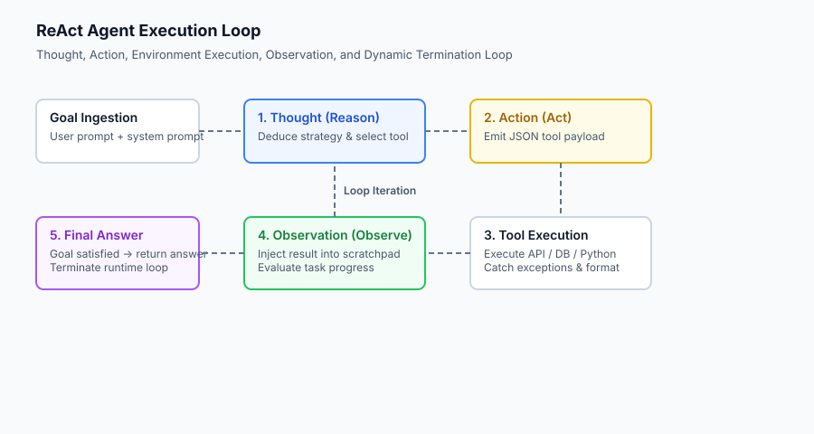

## The idea in plain language

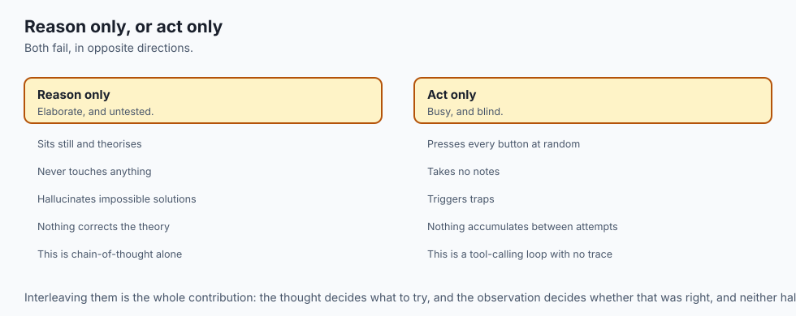

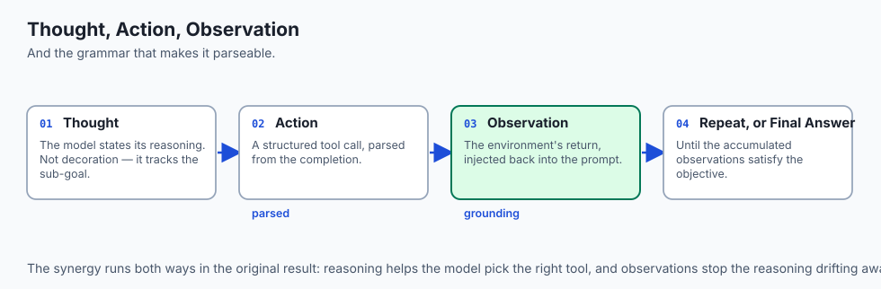

Imagine you are a detective investigating a complex puzzle in an escape room:

- **Without ReAct (Act Only — Blind Trial and Error):** You run around the room frantically pressing every button, flipping switches at random without thinking. You make no notes, trigger security traps, and run out of time.
- **Without ReAct (Reason Only — Armchair Theorizing):** You sit in the middle of the room with your eyes closed, spinning elaborate theories about where the key might be hidden, but you never physically touch anything. You hallucinate impossible solutions because you never test them against physical reality.
- **With ReAct (Interleaved Reason + Act + Observe):**
  1. **Thought:** *"I see a locked metal box with a four-digit dial. The painting on the wall mentions the year 1842. Let me try entering 1-8-4-2 into the lock."*
  2. **Action:** Rotate the dials to `1842` and pull the latch (`enter_code(box_id="metal_box", code="1842")`).
  3. **Observation:** The latch clicks and the box opens, revealing a brass key (`Result: {"status": "unlocked", "contents": ["brass_key"]}`).
  4. **Thought:** *"The box contained a brass key. The exit door has a brass keyhole. I should use this key on the exit door."*
  5. **Action:** `unlock_door(door_id="exit_door", key="brass_key")`.
  6. **Observation:** `Result: {"status": "door_opened"}`.
  7. **Final Answer:** *"The room is solved and the exit door is unlocked."*

The ReAct loop is this rigorous, alternating dance of thinking before doing, and reflecting after seeing the results.

## Historical background

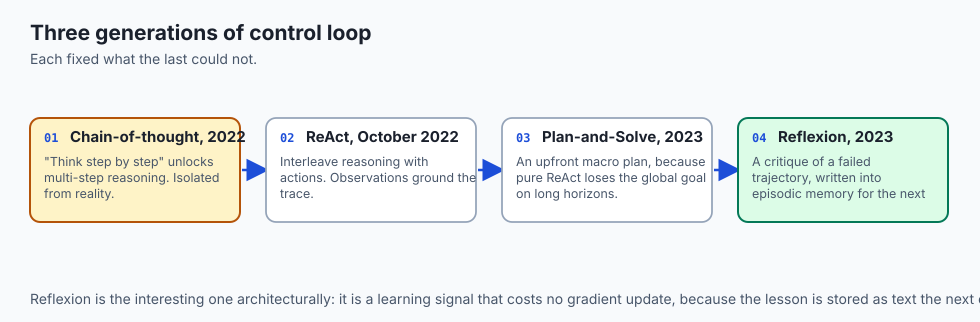

The evolution of agent execution control loops has traversed three distinct architectural generations:

### 1. Chain-of-Thought and Pure Reasoning (2022)
In January 2022, Wei et al. introduced **Chain-of-Thought (CoT) Prompting**, demonstrating that prompting models to *"think step-by-step"* unlocked emergent multi-step arithmetic and symbolic logic. However, CoT was completely isolated from external reality—the model could not verify its reasoning against external tools or fresh web data.

### 2. The ReAct Breakthrough (October 2022)
Shunyu Yao and colleagues at Princeton and Google Brain published **ReAct: Synergizing Reasoning and Acting in Language Models**. ReAct proved that interleaving explicit reasoning traces with action calls created a synergistic effect: reasoning traces helped the model track sub-goals and select tools, while external observations grounded the reasoning and prevented hallucination drift.

### 3. Plan-and-Solve and Reflexion (2023–2024)
As tasks grew more intricate, two key extensions emerged:

- **Plan-and-Solve (Wang et al., 2023):** For long-horizon tasks, pure ReAct can lose track of the global goal (greedy myopia). Plan-and-Solve introduces an upfront macro-planning stage that generates an explicit DAG of sub-tasks before executing the step-by-step ReAct loop.
- **Reflexion (Shinn et al., 2023):** Introduced verbal reinforcement learning. When an agent fails a task, an evaluator LLM critiques the trajectory, writes a structured post-mortem summary, and injects the lesson into the agent's episodic memory for the next attempt.

## What it is — and what it is not

Let us formalize the boundaries of agent execution loops:

### What the ReAct Loop Is:
- A stateful, alternating execution sequence: `Thought -> Action -> Observation -> Thought -> Action -> Observation -> Final Answer`.
- A resilient parsing engine that translates semi-structured model completions into validated schema calls.
- A closed-loop control system that uses real-world execution returns to update internal cognitive state.

### What the ReAct Loop Is Not:
- A simple zero-shot prompt with function definitions attached (the loop requires iterative multi-turn message management).
- A static linear pipeline that executes tools in a hardcoded order regardless of intermediate outcomes.
- An unconstrained infinite recursive function without step guards or budget constraints.

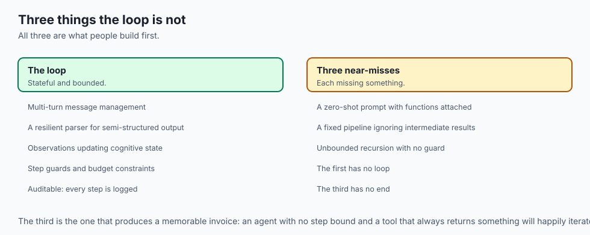

```text
+-------------------------------------------------------------------------------+
|                       AGENT CONTROL LOOP TAXONOMY                             |
+---------------------+-----------------------+---------------------------------+
| Strategy            | Planning Horizon      | Error Recovery Mechanism        |
+---------------------+-----------------------+---------------------------------+
| Single-Step Prompt  | Immediate Next Token  | None                            |
| Chain-of-Thought    | Unrolled in Prompt    | Purely Internal Deduction       |
| Pure ReAct          | 1-Step Lookahead      | Immediate Observation Feedback  |
| Plan-and-Solve      | Global Task DAG       | Dynamic Re-Planning on Failure  |
| Reflexion           | Multi-Episode Memory  | Verbal Post-Mortem Reflection   |
+---------------------+-----------------------+---------------------------------+
```

## Why it was created and what problems it solves

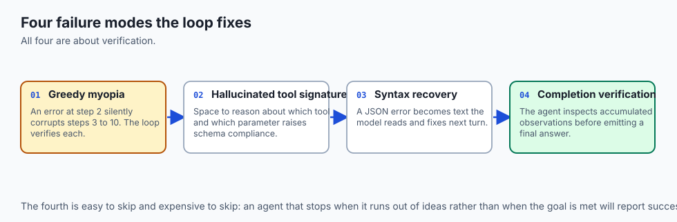

The ReAct loop resolves four universal failure modes in autonomous software execution:

### 1. The Greedy Myopia Problem
When an LLM attempts to solve a 10-step problem in a single generation, errors in step 2 silently cascade and corrupt all subsequent steps. ReAct isolates each step into a distinct turn: the model executes step 1, verifies the real-world output, and only then formulates step 2 conditioned on ground truth.

### 2. Hallucinated Tool Signatures
Without an explicit reasoning buffer, language models frequently hallucinate non-existent API parameters or invent fictional tool names. Giving the model space to think (`"I need to call search_users with email parameter"`) dramatically increases schema compliance.

### 3. Syntax Error Recovery (Self-Healing JSON)
If an agent generates malformed JSON (`{"query": "data",}` with a trailing comma), a naive runtime crashes. A ReAct engine catches the `json.JSONDecodeError`, formats an observation: `"Observation: Error - invalid JSON: trailing comma at line 1 column 18"`, allowing the model to correct its syntax on the next step.

### 4. Convergence and Goal Completion Verification
A ReAct agent explicitly evaluates when the objective has been fully satisfied. Rather than guessing when to stop, the agent inspects the accumulated observations and determines whether sufficient evidence exists to emit the `Final Answer:`.

## How it works

Let us dissect the mechanics of prompt construction, token stream parsing, and action execution:

```text
[System Prompt: Available Tools + ReAct Instructions]
[User Goal: "Find the population of Tokyo and calculate 15% of it"]
                        │
                        ▼
      [LLM Inference Call (Temperature = 0.0)]
                        │
                        ▼
  [Generated Output Stream: Thought + Action]
  "Thought: I need to search for Tokyo's population.
   Action: search_kb({"query": "Tokyo population 2024"})"
                        │
                        ▼
            [Deterministic Regex / JSON Parser]
                        │
         ┌──────────────┴──────────────┐
         ▼ (Valid Action)              ▼ (Syntax Error)
[Tool Sandbox Dispatch]         [Inject Syntax Error Obs]
         │                             │
         ▼                             │
[Observation Returned]                 │
"Observation: Tokyo pop: 14M"          │
         │                             │
         └──────────────┬──────────────┘
                        ▼
      [Append Step to Trajectory Scratchpad]
                        │
                        ▼
      [Stopping Condition Check: Step <= 10]
                        │
                        ▼
             (Loop to LLM Inference)
```

### 1. The ReAct Prompt Format Contract
A standard zero-dependency ReAct prompt establishes a strict grammar:
```text
Answer the user's request using the following tools:
- {tool_name}: {tool_description} - Parameters: {json_schema}

Use the following strict format:
Thought: Describe your reasoning about what to do next.
Action: tool_name({"param": "value"})
Observation: The result will be provided by the environment.
... (this Thought/Action/Observation can repeat N times)
Thought: I have gathered all necessary information to answer.
Final Answer: The final response to the user.
```

### 2. Action Parsing & Grammar Extraction
In production, extracting tool calls from raw model text requires robust regex pattern matching. A robust parser handles both single-line JSON and multi-line fenced code blocks:
```python
import re, json

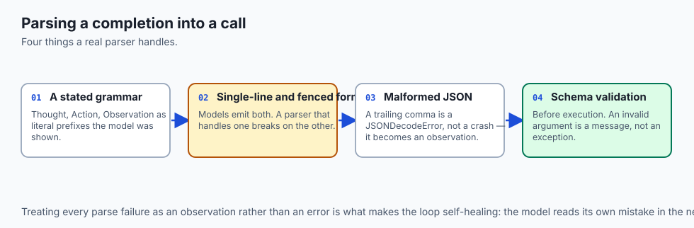

ACTION_REGEX = re.compile(r"Action:\s*([a-zA-Z0-9_]+)\((.*)\)", re.DOTALL)

def parse_action_string(text: str):
    match = ACTION_REGEX.search(text)
    if not match:
        return None
    tool_name = match.group(1).strip()
    raw_args = match.group(2).strip()
    try:
        args = json.loads(raw_args)
        return tool_name, args
    except json.JSONDecodeError as e:
        return tool_name, f"JSON_PARSE_ERROR: {str(e)}"
```

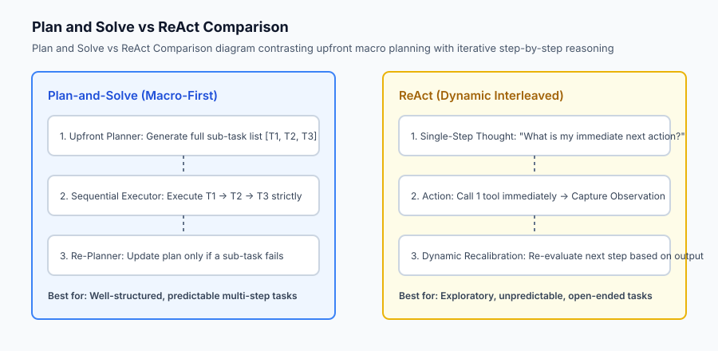

### 3. Self-Correction via Observation Feedback
When the parser encounters a `JSON_PARSE_ERROR`, the runtime does not crash. It immediately appends an observation to the prompt:
`Observation: Tool execution failed. JSON syntax error: Expecting property name enclosed in double quotes. Please re-emit Action with valid JSON.`
On the next cycle, the model adjusts its formatting and emits valid syntax.

## An everyday analogy

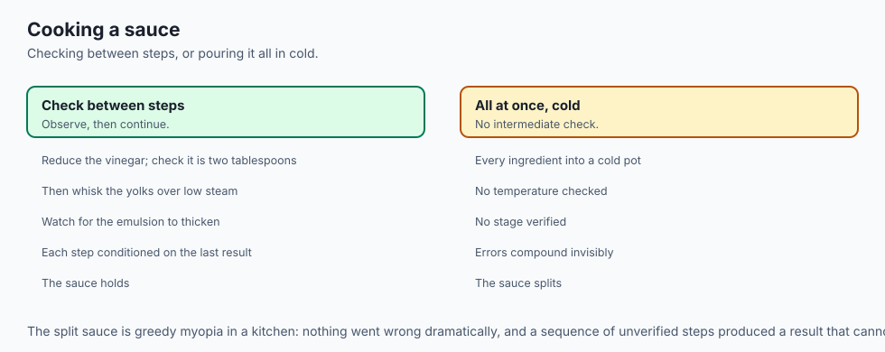

Think of the ReAct loop like **a chef cooking a complex gourmet dish**:

- **Thought:** *"I am preparing a béarnaise sauce. I need to reduce the tarragon vinegar with shallots until two tablespoons remain."*
- **Action:** Place saucepan over medium heat and set timer for 4 minutes (`simmer_saucepan(heat="medium", minutes=4)`).
- **Observation:** The liquid has reduced to approximately two tablespoons and smells fragrant.
- **Thought:** *"The reduction is ready. Now I must whisk in egg yolks over a double boiler without scrambling them."*
- **Action:** Whisk vigorously over low steam (`whisk_emulsion(speed="high", temp="warm")`).
- **Observation:** The sauce thickens into a glossy, velvety emulsion.
- **Final Answer:** *"The béarnaise sauce is finished and ready for plating."*

If the chef tried to pour all ingredients into a cold pot at once without checking intermediate temperatures (blind execution), the sauce would split and fail.

## Examples in practice

Let us inspect a complete, zero-dependency ReAct Execution Engine in Python:

```python
import re
import json
from typing import Dict, Any, Tuple, Optional

class ReActEngine:
    def __init__(self, tools: Dict[str, Any], max_iterations: int = 6):
        self.tools = tools
        self.max_iterations = max_iterations
        self.trajectory = []
        
    def parse_generation(self, text: str) -> Tuple[str, Optional[str], Optional[Dict[str, Any]], Optional[str]]:
        # Extract Thought
        thought_match = re.search(r"Thought:\s*(.*?)(?=
Action:|
Final Answer:|$)", text, re.DOTALL)
        thought = thought_match.group(1).strip() if thought_match else ""
        
        # Check for Final Answer
        if "Final Answer:" in text:
            final_match = re.search(r"Final Answer:\s*(.*)", text, re.DOTALL)
            final_answer = final_match.group(1).strip() if final_match else text
            return "FINAL", thought, None, final_answer
            
        # Extract Action
        action_match = re.search(r"Action:\s*([a-zA-Z0-9_]+)\s*\((.*)\)", text, re.DOTALL)
        if action_match:
            tool_name = action_match.group(1).strip()
            args_raw = action_match.group(2).strip()
            try:
                args = json.loads(args_raw) if args_raw else {}
                return "ACTION", thought, {"tool": tool_name, "args": args}, None
            except json.JSONDecodeError as err:
                return "SYNTAX_ERROR", thought, {"tool": tool_name, "raw": args_raw, "error": str(err)}, None
                
        return "UNKNOWN", thought, None, None
        
    def execute_step(self, mock_llm_response: str) -> Dict[str, Any]:
        step_type, thought, action_data, final_ans = self.parse_generation(mock_llm_response)
        
        if step_type == "FINAL":
            return {"status": "COMPLETE", "final_answer": final_ans, "thought": thought}
        elif step_type == "ACTION":
            tool = action_data["tool"]
            args = action_data["args"]
            if tool in self.tools:
                try:
                    res = self.tools[tool](**args)
                    obs = f"Observation: {res}"
                except Exception as e:
                    obs = f"Observation: Error executing tool {tool}: {str(e)}"
            else:
                obs = f"Observation: Tool '{tool}' does not exist in registry."
            return {"status": "CONTINUE", "thought": thought, "tool": tool, "observation": obs}
        elif step_type == "SYNTAX_ERROR":
            obs = f"Observation: JSON parse error in action parameters: {action_data['error']}. Please retry with valid JSON."
            return {"status": "CONTINUE", "thought": thought, "observation": obs}
        else:
            obs = "Observation: Format error. Expected 'Action: tool_name(args)' or 'Final Answer: answer'."
            return {"status": "CONTINUE", "thought": thought, "observation": obs}
```

## Implications: security, privacy, performance, scalability, and cost

### 1. Infinite Token Expansion in ReAct Loops
Every iteration in a ReAct loop appends `(Thought + Action + Observation)` to the prompt context. By step 8, the prompt context contains the entire historical transcript, scaling input token processing quadratically:
`\text(Total Tokens) = sum_(k=1)^K (\text(Base Prompt) + k cdot \text(Step Tokens))`
To optimize cost and latency, production engines implement **Scratchpad Truncation**, summarizing older observations while preserving atomic fact extractions.

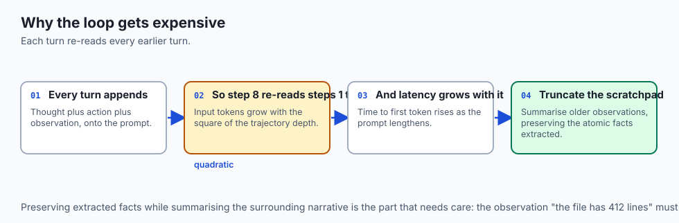

### 2. Tool Execution Sandboxing
Because actions execute real Python code, shell commands, or database queries, tool executors must be isolated within restricted Docker containers or WebAssembly sandboxes with strict execution timeouts (e.g. max 3.0 seconds per tool call).

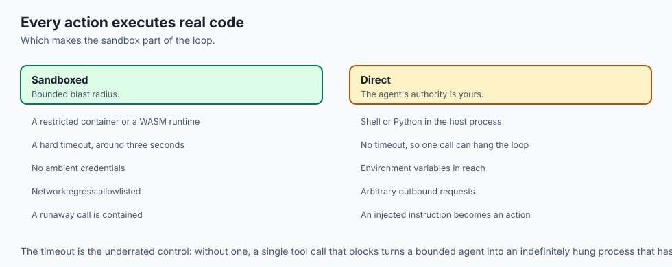

```text
Component                Latency Budget    Timeout Limit    Security Sandbox
-----------------------------------------------------------------------------
Local Python Math Tool   < 5 ms            50 ms            In-process eval (__builtins__: None)
Database Query Tool      < 50 ms           1000 ms          Read-only connection pool
Web Search / Scraper     < 400 ms          3000 ms          Isolated HTTP worker with domain allowlist
Shell Command Exec       < 200 ms          5000 ms          Rootless Docker container
```

## Alternatives: free, open source, and commercial

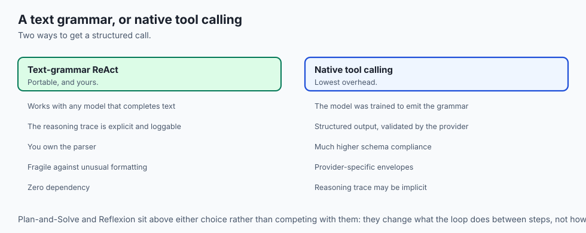

| Approach | Loop Pattern | Overhead | Best Suited For |
| :--- | :--- | :--- | :--- |
| **Vanilla ReAct** | Iterative 1-Step | Minimal | General problem solving, search agents |
| **Plan-and-Solve** | Macro DAG + Sub-tasks | Moderate | Complex multi-stage workflows, data pipelines |
| **Reflexion** | Multi-Trial Reflection | High (Multiple episodes)| Code generation, competitive programming |
| **Tool Calling API** | Native Token Grammar | Lowest | OpenAI / Anthropic native tool use |

## Comparison with related concepts

```text
+-----------------------+-----------------------+-----------------------+
| Feature               | Chain-of-Thought (CoT)| ReAct Loop            |
+-----------------------+-----------------------+-----------------------+
| External Tools        | No                    | Yes                   |
| Grounding Feedback    | None (Pure Internal)  | Real-Time Environment |
| Latency               | 1 Inference Pass      | N Inference Turns     |
| Self-Correction       | Weak                  | High (via Observations|
| Determinism           | Low                   | Verified by Tools     |
+-----------------------+-----------------------+-----------------------+
```

## When to use it — and when not to

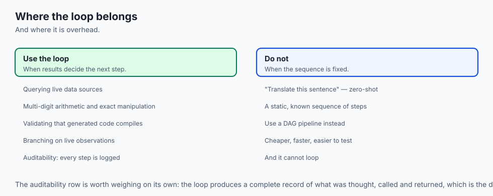

### Choose the ReAct Loop when:
- Solving queries that require querying live data sources, performing multi-digit math, or validating code compilation.
- You need clear auditability—every thought, tool call, and observation is recorded in the execution log.
- Intermediate results dictate the subsequent course of action (branching logic based on live observations).

### Do NOT use the ReAct Loop when:
- The task is a simple single-turn query (e.g. *"Translate this sentence to French"*—use zero-shot completion).
- The workflow has a static, fixed sequence of steps (use a hardcoded Directed Acyclic Graph pipeline).

## The AI connection

- **ReAct is the smallest change that made agents work.** Interleaving a reasoning
  trace with an action call reduced hallucination without any model change.

- **The reasoning trace is not decoration** — it is what lets the model track sub-goals
  and select the right tool, and removing it measurably degrades schema compliance.

- **An error is an observation.** A malformed JSON payload becomes text the model reads
  and corrects, which is self-healing built out of the loop rather than bolted on.

- **Context grows quadratically with steps**, since each turn appends thought, action
  and observation, which is why scratchpad truncation is a production requirement.

- **Every tool call executes real code**, so the sandbox and the timeout are part of
  the loop's definition rather than an operational detail.

## Knowledge check

1. **What are the three core steps in a ReAct loop?** Reason (Thought), Act (Action tool execution), and Observe (capturing environment feedback).
2. **How does an agent recover from a malformed JSON tool call?** The runtime catches the parsing exception and injects the error back into the scratchpad as an `Observation`, enabling the agent to re-emit valid syntax.
3. **What is the primary difference between ReAct and Reflexion?** ReAct operates within a single episode loop, while Reflexion evaluates entire completed episodes, generates verbal critiques, and updates episodic memory across multiple attempts.

## Hands-on exercise

In this lab, you will implement a **Production ReAct Execution Engine with Token Stream Parsing and Self-Correction in Python**. Your implementation will:

1. Construct a regex token stream parser that extracts `Thought:`, `Action: tool(json_args)`, and `Final Answer:`.
2. Build an isolated Tool Execution Dispatcher handling math, knowledge search, and string manipulation.
3. Implement self-correcting error handling for invalid tool names and malformed JSON payloads.
4. Execute simulated multi-step reasoning trajectories and verify termination predicates against unit tests.

### Expected output

```text
============================= test session starts ==============================
collected 5 items

tests/test_react_engine.py .....                                         [100%]

============================== 5 passed in 0.04s ===============================
[REACT ENGINE] Goal: "Find population of Seattle and calculate 20% growth"
[STEP 1] THOUGHT: I need to query Seattle's population.
         ACTION: search_kb({"query": "Seattle population"})
         OBSERVATION: "Seattle population: 750,000"
[STEP 2] THOUGHT: Now calculating 750000 * 1.20
         ACTION: calculate({"expr": "750000 * 1.20"})
         OBSERVATION: "900000.0"
[STEP 3] THOUGHT: I have all required data.
         FINAL_ANSWER: "The projected population is 900,000."
[SUMMARY] Completed in 3 steps with 100% test validation.
```

### Validate your work

Run the pytest test suite:

```bash
pytest tests/run_tests.sh
```

### Troubleshooting

1. **Regex parsing fails on multi-line JSON:** Ensure your regex uses the `re.DOTALL` flag when capturing arguments.
2. **Tool execution parameter mismatch:** Unpack dictionary arguments with `**args` safely or validate against expected signatures.

### Common mistakes

- Crashing the agent when a tool raises a Python exception instead of converting it into a formatted error `Observation`.
- Failing to strip leading and trailing whitespace from extracted action strings.

## Practice assignment

Add a **Plan-and-Solve Preprocessor** that generates an initial 3-step checklist and marks items as completed after each observation.

## Extension challenge

Implement a **Sliding Window Scratchpad Compactor** that retains only the last 3 turns in full detail while replacing earlier turns with an automated 1-sentence summary.
