## Why this matters

In an autonomous agent architecture, the foundation model acts as the cognitive cortex, but external tools are its physical hands, eyes, and sensory organs. An agent without tools is locked inside its static training weights, unable to query fresh databases, inspect live production servers, or write code to the local filesystem. However, building reliable tools for non-deterministic AI agents is vastly different from building traditional REST APIs or microservice libraries for human developers.

When human engineers consume an API, they read comprehensive documentation portals, inspect interactive Swagger UIs, and debug type errors with static compilers. An LLM agent, by contrast, perceives a tool exclusively through a compact JSON Schema embedded within its dynamic system prompt. If parameter names are vague, if descriptions lack semantic clarity, or if error responses fail to explain formatting discrepancies, the model will hallucinate invalid arguments, enter repetitive failure loops, and corrupt downstream application state.

Mastering production tool design—defining strict JSON Schemas, implementing parameter coercion, separating read-only queries from side-effecting mutations, enforcing idempotency keys, and establishing execution sandboxes—is the hallmark of senior AI systems engineering.

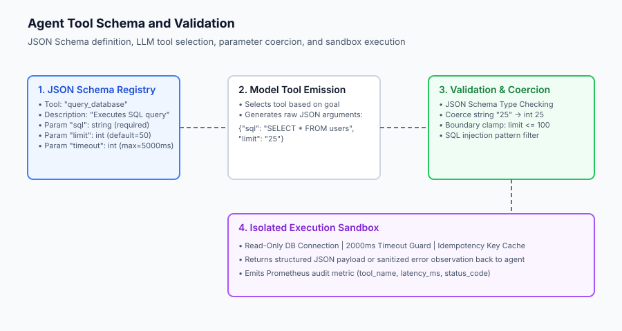

## The idea in plain language

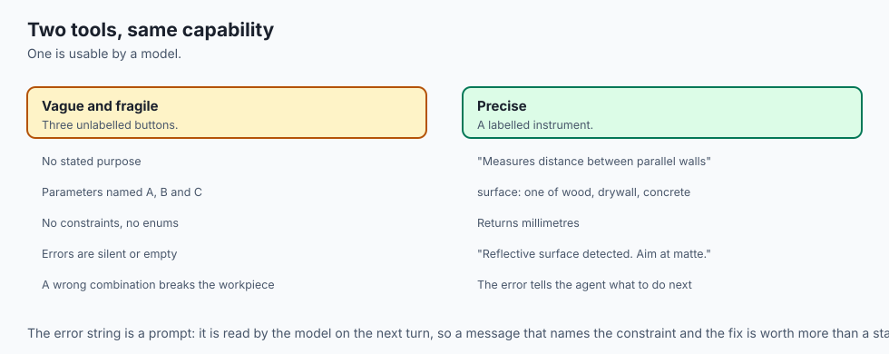

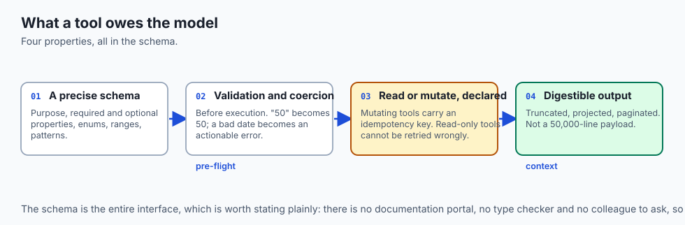

Imagine handing a set of specialized tools to an apprentice carpenter:

- **A Poorly Designed Tool (Vague & Fragile):** You hand them an unlabeled steel cylinder with three buttons labeled `A`, `B`, and `C`. There is no instruction manual. If they press `A` while holding `C`, the device explodes and shatters the workpiece.
- **A Production-Grade Tool (Clear, Documented & Foolproof):** You hand them a calibrated digital laser measurement tool. On the casing, a clear label states:
  - **Function:** Measures distance between two parallel walls.
  - **Required Parameter:** Target surface material (must be one of: `wood`, `drywall`, `concrete`).
  - **Output:** Returns exact distance in millimeters.
  - **Safety Interlock:** If the laser is aimed at a reflective mirror, it safely shuts off and displays: `"Error: Reflective surface detected. Please aim at a matte surface."`

In agentic systems, well-designed tools provide clear descriptions, strict type validation, safe default parameters, and actionable error messages that guide the agent back to success.

## Historical background

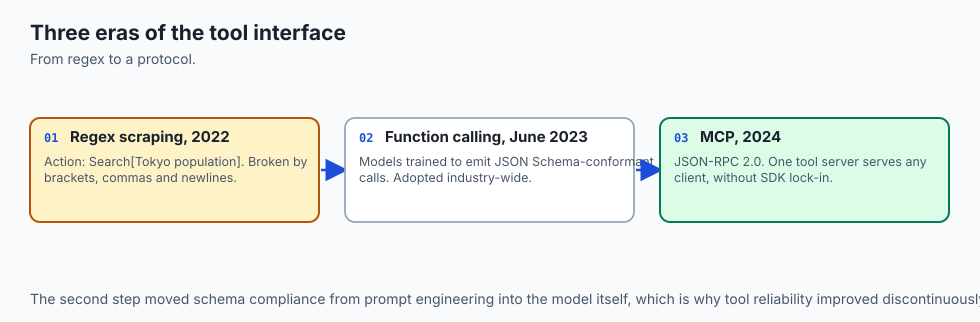

The evolution of agent-tool interfaces has evolved through three distinct phases:

### 1. The Raw Text & Regex Scraping Era (2022)
In early ReAct experiments, tools were defined as unstructured text snippets in the system prompt. Models were instructed to emit arbitrary strings like `Action: Search[Tokyo population]`. The runtime relied on fragile regular expressions to extract arguments. Unescaped brackets, commas in queries, or multi-line strings frequently broke parsing pipelines.

### 2. OpenAI Function Calling & Native JSON Schema (June 2023)
In June 2023, OpenAI introduced fine-tuned **Function Calling** support in GPT-4 and GPT-3.5. Instead of relying on prompt hacking, models were trained specifically to output structured JSON adhering to standard JSON Schema specifications. This was rapidly adopted across the industry by Anthropic (Tool Use), Google Gemini, and open-source models (Hermes, Mistral, Qwen).

### 3. The Model Context Protocol (MCP) Standard (2024–Present)
In late 2024, Anthropic open-sourced the **Model Context Protocol (MCP)**, standardizing how tools, database resources, and system prompts are exposed to LLM clients over JSON-RPC 2.0. MCP eliminated proprietary SDK lock-in, enabling a single tool server (such as a GitHub or PostgreSQL connector) to serve Claude, Gemini, and local coding agents interchangeably.

## What it is — and what it is not

Let us establish strict technical criteria for agent tool architecture:

### What an Agent Tool Is:
- A strongly-typed callable interface backed by a machine-readable JSON Schema.
- A sandboxed operational boundary that validates, sanitizes, and coerces arguments before execution.
- A deterministic or side-effecting function that returns structured, LLM-digestible text or JSON observations.

### What an Agent Tool Is Not:
- A generic dump of your entire REST API backend (exposing 100+ uncurated endpoints degrades model tool-selection accuracy).
- An unmonitored raw shell execution bridge running with root administrative privileges.
- A silent failure sink that suppresses exceptions and returns empty strings.

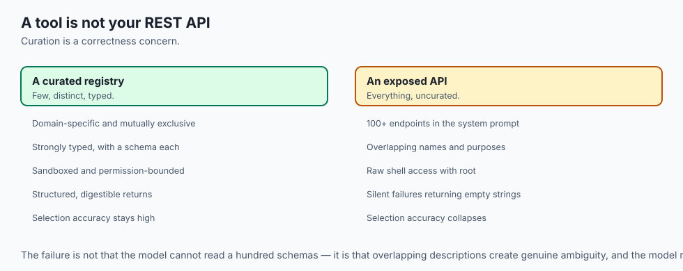

```text
+-------------------------------------------------------------------------------+
|                       TOOL DESIGN CRITERIA MATRIX                             |
+---------------------+-----------------------+---------------------------------+
| Dimension           | Anti-Pattern          | Production Best Practice        |
+---------------------+-----------------------+---------------------------------+
| Description Length  | "Searches db"         | Comprehensive semantic purpose  |
| Parameter Types     | Any / Object          | Strict Enums, Ints, ISO Dates   |
| Error Handling      | Returns 500 / Stacktrace| Returns Actionable Guidance   |
| Side Effects        | Unsafe Mutations      | Idempotency Key Required        |
| Return Size         | 50MB raw dump         | Compact Summaries / Paginated   |
+---------------------+-----------------------+---------------------------------+
```

## Why it was created and what problems it solves

Production tool engineering resolves four systemic reliability hazards:

### 1. Tool Selection Confusion (Semantic Overlap)
When an agent is equipped with multiple tools featuring overlapping descriptions (e.g. `search_database`, `query_sql`, and `find_records`), the model suffers from cognitive interference, selecting suboptimal tools or hallucinating hybrid signatures. Explicit, mutually exclusive tool descriptions eliminate ambiguity.

### 2. Parameter Hallucination and Format Mismatches
Language models frequently emit dates as `08/30/2026` when an API expects `2026-08-30` (ISO-8601), or pass strings `"50"` where integers `50` are required. Production tool wrappers perform automated parameter coercion and schema pre-validation.

### 3. Accidental State Mutation (The Double-Charge Problem)
If an agent calls `charge_credit_card(amount=50)` and the network connection drops before receiving the response, the agent may retry the call three times, billing the customer $150. Production side-effecting tools enforce **Idempotency Keys**, ensuring duplicate requests return cached results without re-executing transactions.

### 4. Context Window Bloat
If a search tool returns a 50,000-line JSON payload, it saturates the model's context window, degrading attention performance and multiplying token billing. Production tools implement automatic truncation, schema projection, and pagination.

## How it works

Let us inspect the JSON Schema structure, parameter validation pipeline, and idempotency key caching mechanics:

```text
[System Prompt Tool Registration: JSON Schema]
{
  "name": "fetch_user_profile",
  "description": "Retrieves verified user profile data by ID or email.",
  "parameters": {
    "type": "object",
    "properties": {
      "user_id": {"type": "string", "description": "Unique UUID of user"},
      "include_billing": {"type": "boolean", "default": false}
    },
    "required": ["user_id"]
  }
}
                        │
                        ▼
      [Model Generates Structured Tool Call]
      {"name": "fetch_user_profile", "arguments": "{\"user_id\": \"u-123\"}"}
                        │
                        ▼
      [Parameter Validator & Type Coercer]
      - Validates required properties present
      - Coerces string booleans ("true" -> True)
      - Enforces boundary limits
                        │
                        ▼
       [Idempotency & Execution Guard]
      - Read-only? Direct Execution
      - Mutating? Check Idempotency Key Cache
                        │
                        ▼
         [Sandbox Execution & Return]
      - Execute Python / SQL with 2000ms timeout
      - Return compact JSON observation to Agent
```

### 1. Writing High-Accuracy JSON Schemas
A production JSON Schema must specify:

1. Clear high-level purpose and expected operational preconditions.
2. Required vs optional properties with deterministic default values.
3. Explicit constraints (`enum`, `minimum`, `maximum`, `pattern`).

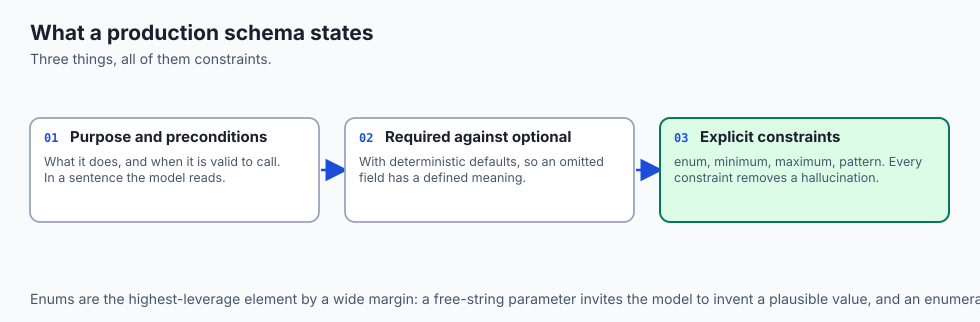

```json
{
  "name": "create_calendar_event",
  "description": "Schedules a new meeting in the user's primary calendar. Returns the created event ID and conference URL.",
  "parameters": {
    "type": "object",
    "properties": {
      "title": {
        "type": "string",
        "description": "The concise meeting title or subject line."
      },
      "start_time": {
        "type": "string",
        "description": "Start timestamp in ISO-8601 format (e.g. '2026-08-30T14:00:00Z')."
      },
      "duration_minutes": {
        "type": "integer",
        "description": "Duration in minutes (must be between 5 and 480).",
        "minimum": 5,
        "maximum": 480
      },
      "attendees": {
        "type": "array",
        "items": {"type": "string"},
        "description": "List of attendee email addresses."
      }
    },
    "required": ["title", "start_time", "duration_minutes"]
  }
}
```


### 2. Idempotency Key Enforcement
For mutating actions (`POST`, `PUT`, `DELETE`), every tool call signature accepts an optional `idempotency_key: str`. If omitted by the model, the runtime computes a deterministic hash of the tool name and sorted arguments:
`\text(Key) = \text(SHA256)(\text(tool_name) + \text(canonical_json)(\text(args)))`
If the key exists in the short-term cache, the cached response is returned immediately without re-executing the side effect.

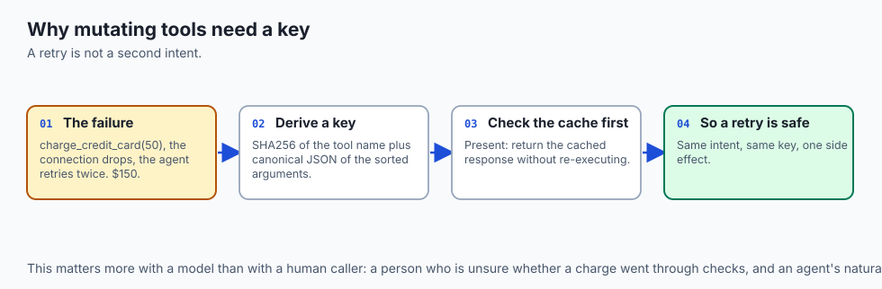

## An everyday analogy

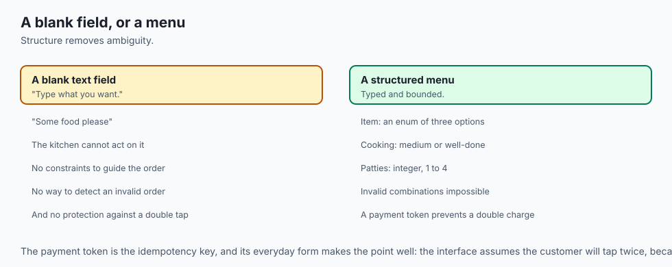

Think of designing agent tools like **creating an electronic ordering kiosk at a fast-food restaurant**:

- **Poor Tool Design:** A blank text field asking the customer: *"Type what you want."* The customer types *"some food please"*, and the kitchen has no idea what to prepare.
- **Production Tool Design:** A touchscreen menu with structured options:
  - Select item: Burger (Enum: Single, Double, Veggie).
  - Select cooking temperature: Medium, Well-done.
  - Number of patties: Integer (Min: 1, Max: 4).
  - Payment Token (Idempotency Key): Prevents your credit card from being swiped twice if you tap the screen impatiently.

Structured schemas remove ambiguity and guarantee the kitchen (the backend) receives valid, executable orders every time.

## Examples in practice

Let us inspect a Python implementation of a Tool Registry with JSON Schema validation, parameter coercion, and idempotency key caching:

```python
import hashlib
import json
import time
from typing import Dict, Any, Callable, Optional, List

class ToolDefinition:
    def __init__(self, name: str, description: str, schema: Dict[str, Any], func: Callable, is_mutating: bool = False):
        self.name = name
        self.description = description
        self.schema = schema
        self.func = func
        self.is_mutating = is_mutating

class ProductionToolRegistry:
    def __init__(self, cache_ttl_seconds: int = 300):
        self.tools: Dict[str, ToolDefinition] = {}
        self.idempotency_cache: Dict[str, Dict[str, Any]] = {}
        self.cache_ttl = cache_ttl_seconds
        
    def register(self, tool: ToolDefinition):
        self.tools[tool.name] = tool
        
    def get_schemas(self) -> List[Dict[str, Any]]:
        return [
            {
                "name": t.name,
                "description": t.description,
                "parameters": t.schema
            }
            for t in self.tools.values()
        ]
        
    def validate_and_coerce(self, tool: ToolDefinition, args: Dict[str, Any]) -> Tuple[bool, Dict[str, Any], str]:
        schema = tool.schema
        properties = schema.get("properties", {})
        required = schema.get("required", [])
        
        # Check required fields
        for req in required:
            if req not in args:
                return False, {}, f"Missing required parameter: '{req}'"
                
        coerced = {}
        for k, v in args.items():
            if k not in properties:
                continue # Ignore undefined params or return error
            target_type = properties[k].get("type")
            try:
                if target_type == "integer":
                    coerced[k] = int(v)
                elif target_type == "number":
                    coerced[k] = float(v)
                elif target_type == "boolean":
                    if isinstance(v, str):
                        coerced[k] = v.lower() in ("true", "1", "yes")
                    else:
                        coerced[k] = bool(v)
                elif target_type == "string":
                    coerced[k] = str(v)
                else:
                    coerced[k] = v
            except (ValueError, TypeError) as err:
                return False, {}, f"Type coercion failed for parameter '{k}': expected {target_type}, got {type(v).__name__}"
                
        return True, coerced, "OK"
        
    def execute(self, tool_name: str, raw_args: Dict[str, Any], idempotency_key: Optional[str] = None) -> Dict[str, Any]:
        if tool_name not in self.tools:
            return {"success": False, "error": f"Tool '{tool_name}' not registered."}
            
        tool = self.tools[tool_name]
        valid, clean_args, err_msg = self.validate_and_coerce(tool, raw_args)
        if not valid:
            return {"success": False, "error": err_msg}
            
        # Idempotency Check for Mutating Actions
        if tool.is_mutating:
            if not idempotency_key:
                # Generate key from canonical hash
                canon_str = f"{tool_name}:{json.dumps(clean_args, sort_keys=True)}"
                idempotency_key = hashlib.sha256(canon_str.encode()).hexdigest()
                
            now = time.time()
            if idempotency_key in self.idempotency_cache:
                cached = self.idempotency_cache[idempotency_key]
                if now - cached["timestamp"] < self.cache_ttl:
                    return {"success": True, "result": cached["result"], "cached": True}
                    
        # Execute in sandbox
        try:
            res = tool.func(**clean_args)
            if tool.is_mutating and idempotency_key:
                self.idempotency_cache[idempotency_key] = {"result": res, "timestamp": time.time()}
            return {"success": True, "result": res, "cached": False}
        except Exception as e:
            return {"success": False, "error": f"Execution error in {tool_name}: {str(e)}"}
```

## Implications: security, privacy, performance, scalability, and cost

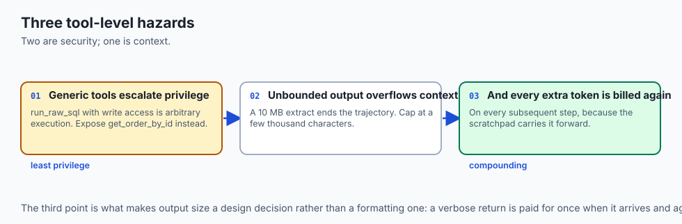

### 1. Tool-Level Privilege Escalation
Never give an agent a tool named `run_raw_sql` that accepts arbitrary SQL strings with write access to production databases. Instead, expose parameterized domain-specific tools like `get_order_by_id(order_id: str)` or `update_customer_address(...)` with strict permission validation.

### 2. Output Payload Truncation
If a document retrieval tool returns a 10MB PDF extract, the agent's context window will instantly overflow. Production tool runners enforce a maximum output character ceiling (e.g. max 4,000 characters), summarizing or chunking larger returns.

```text
Tool Category            Permitted Methods    Timeout Ceiling    Max Output Characters
---------------------------------------------------------------------------------------
Read-Only Query          SELECT / GET         1,500 ms           8,000 chars
File System Reader       cat / read_file      500 ms             4,000 chars
Side-Effecting Action    INSERT / POST        3,000 ms           1,000 chars (Status + ID)
Shell Execution Sandbox  Isolated CLI         5,000 ms           2,500 chars (Tail log)
```

## Alternatives: free, open source, and commercial

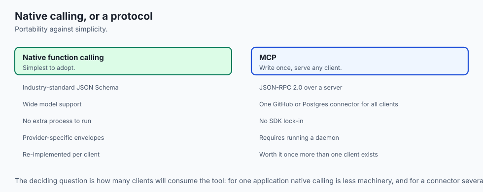

| Standard / Tool System | Protocol | Strengths | Tradeoffs |
| :--- | :--- | :--- | :--- |
| **OpenAI Function Calling** | Native JSON Schema | Industry standard, wide model support | Vendor-specific payload envelopes |
| **Model Context Protocol (MCP)**| JSON-RPC 2.0 | Universal cross-client portability | Requires running MCP server daemon |
| **LangChain Tools** | Python Pydantic BaseTool | Rich ecosystem of community connectors | Heavy dependency footprint |
| **Custom Schema Registry** | Pure Python JSON Schema | Zero dependencies, instant auditing | Requires custom client serialization |

## Comparison with related concepts

```text
+-----------------------+-----------------------+-----------------------+
| Feature               | Traditional REST API  | Agent Tool            |
+-----------------------+-----------------------+-----------------------+
| Primary Consumer      | Human Developer       | Stochastic Language Model|
| Documentation         | Markdown / Swagger UI | In-Prompt JSON Schema |
| Parameter Tolerance   | Strict (Throws 400)   | Coercive + Explanatory|
| Response Format       | Large JSON Payloads   | Compact Semantic Text |
| Mutation Safety       | Manual Idempotency    | Automated Idempotency |
+-----------------------+-----------------------+-----------------------+
```

## When to use it — and when not to

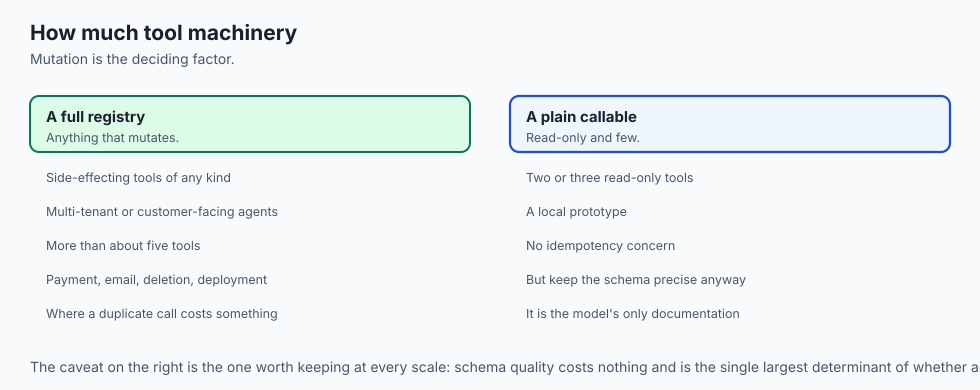

### Choose Production Tool Registries when:
- Equipping autonomous agents with external APIs, database lookups, or local computational functions.
- Deploying mutating actions (creating orders, updating databases) where duplicate execution causes business damage.
- You need central auditing, latency monitoring, and token budget management across all agent tool calls.

### Do NOT use Complex Tool Registries when:
- Building simple single-prompt scripts that only require formatting text or translating languages.
- You have only 1 hardcoded function that is always called deterministically.

## The AI connection

- **A model perceives your API only through its schema.** There is no documentation
  portal, no type checker and no Swagger UI — a vague description is the whole interface.

- **Tool descriptions compete with each other.** Overlapping names degrade selection
  accuracy, which makes curation a correctness concern rather than tidiness.

- **Idempotency matters more with a non-deterministic caller.** A model that retries a
  charge is a model that bills the customer three times.

- **Error messages are prompts.** An actionable failure string is what lets the agent
  correct itself; a silent empty return is a loop that never converges.

- **Output size is a context budget.** A 50,000-line payload saturates the window,
  degrades attention and multiplies the bill for every subsequent step.

## Knowledge check

1. **Why is parameter coercion essential in agent tool registries?** Because language models frequently emit numeric or boolean arguments as strings; coercion normalizes types without rejecting the call.
2. **What does an idempotency key prevent during network retries?** It prevents duplicate execution of side-effecting operations (such as multiple credit card charges or duplicate database records).
3. **What are the key elements of a production JSON Schema for an agent tool?** Name, clear semantic description, typed property definitions with constraints, and an explicit list of required fields.

## Hands-on exercise

In this lab, you will implement a **Production Tool Registry with JSON Schema Validation, Parameter Coercion, and Idempotency Key Caching in Python**. Your implementation will:

1. Define a `ToolDefinition` dataclass supporting both read-only and mutating actions.
2. Implement schema validation and type coercion (converting strings to integers, booleans, and floats).
3. Build an Idempotency Cache that suppresses duplicate side-effect calls within a configurable TTL window.
4. Verify execution safety and error handling across a suite of unit tests.

### Expected output

```text
============================= test session starts ==============================
collected 5 items

tests/test_tool_registry.py .....                                        [100%]

============================== 5 passed in 0.05s ===============================
[TOOL REGISTRY] Registered 3 tools: ['calculate', 'query_db', 'create_order']
[VALIDATION] Parameter 'count' successfully coerced from "5" to int(5).
[IDEMPOTENCY] First call to create_order(order_id="101") executed successfully.
[IDEMPOTENCY] Duplicate call to create_order(order_id="101") suppressed -> CACHED RESULT RETURNED.
[ERROR HANDLING] Missing required parameter 'sql' returned actionable schema error.
```

### Validate your work

Run the pytest test suite:

```bash
pytest tests/run_tests.sh
```

### Troubleshooting

1. **Type coercion error on boolean values:** Handle string literals like `"true"`, `"false"`, `"1"`, and `"0"` explicitly.
2. **Idempotency cache collision:** Ensure canonical JSON serialization uses `sort_keys=True`.

### Common mistakes

- Exposing mutating tools without idempotency protection.
- Returning unhandled raw Python exception stack traces instead of clean error dictionaries.

## Practice assignment

Extend the Tool Registry to support **Rate Limiting** per tool (e.g. max 5 calls per minute for external API scrapers).

## Extension challenge

Implement a **Schema Generator** that uses Python type annotations and docstrings (`inspect.signature`) to automatically generate valid JSON Schema definitions from vanilla Python functions.
