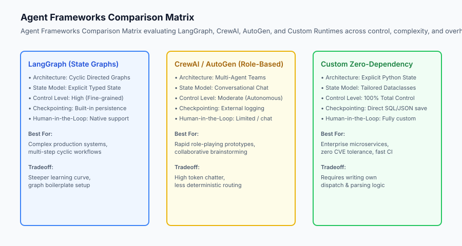

## Why this matters

As the AI ecosystem matured, open-source and enterprise frameworks emerged to simplify the orchestration of complex agentic workflows. Developers face a bewildering landscape of competing options: LangChain, LangGraph, CrewAI, AutoGen, Semantic Kernel, LlamaIndex Workflows, and custom in-house runtimes. Choosing the wrong framework introduces severe architectural liabilities: brittle abstractions that fight your domain model, high latency from excessive token chatter, and difficult debugging when execution state is hidden within framework callbacks.

To make rigorous architectural decisions, AI engineers must understand the core design philosophies of major frameworks. State-graph architectures (such as LangGraph) treat agent computation as explicit directed graphs with durable checkpointing and human-in-the-loop approval gates. Role-playing frameworks (such as CrewAI) organize agents into collaborative organizational personas. Custom micro-runtimes prioritize absolute control, zero dependencies, and deterministic testing.

Mastering framework evaluation allows teams to match the right tool to the problem: selecting lightweight custom loops for low-latency production microservices, and utilizing graph engines when managing complex multi-actor workflows requiring persistent state pause-and-resume capabilities.



## The idea in plain language

Think of choosing an agent framework like **choosing transportation for a delivery logistics fleet**:

- **CrewAI / AutoGen (The Public Bus Tour):** A pre-configured team of passengers (agents with assigned roles like *"Researcher"*, *"Writer"*, *"Editor"*). They talk to each other in conversational circles. It is great for collaborative brainstorming and quick mockups, but difficult to steer with pinpoint precision when you need an exact 5-minute delivery SLA.
- **LangGraph (The Automated Railroad Network):** You lay down explicit steel tracks (graph edges), switches (conditional routers), and train stations (execution nodes). Every train's position is recorded in a central dispatch database (checkpointing). You can stop a train at a red light for a human conductor to inspect the cargo before pulling into the station.
- **Custom Zero-Dependency Runtime (The Custom Delivery Drone):** You build a lightweight carbon-fiber drone designed solely to fly from Point A to Point B in 90 seconds. It carries zero dead weight, incurs zero subscription licensing costs, and delivers with sub-millisecond precision.

## Historical background

The evolution of agent frameworks mirrors the history of web application frameworks:

### 1. The Prompt-Chaining Era (2022–2023)
Early frameworks focused on linear pipelines: `PromptTemplate | LLM | OutputParser`. While effective for simple RAG, these linear chains could not represent cycles, loops, or dynamic error recovery without unwieldy recursion.

### 2. Multi-Agent Role-Playing (2023)
In 2023, Microsoft released **AutoGen** and João Moura released **CrewAI**. These frameworks introduced conversational multi-agent collaboration: agents conversed in a shared group chat, critiquing each other's outputs. While visually impressive, enterprise developers found them difficult to control in production—agents frequently entered infinite conversational chatter and consumed thousands of tokens without making progress.

### 3. State Graphs and Cyclic Runtimes (2024–Present)
In 2024, LangChain launched **LangGraph**, formalizing agents as **State Graphs**. LangGraph separated state definition, node execution, and conditional edge transitions into explicit code, bringing the reliability of state machines and workflow orchestrators (like Temporal and Airflow) to AI agents.

## What it is — and what it is not

Let us define the core concepts of state-graph agent architectures:

### What a State Graph Is:
- A directed graph `mathcal(G) = (mathcal(V), mathcal(E))` where vertices `mathcal(V)` are Python execution nodes and edges `mathcal(E)` define state transitions.
- A central, immutable typed State object that is updated via explicit State Reducers.
- A durable runtime that snapshots state to a database after every node execution, enabling pause, resume, and rewind capabilities.

### What a State Graph Is Not:
- An uncontrolled conversational group chat where models talk indefinitely.
- A black-box proprietary platform (graphs are defined entirely in standard Python code).
- A replacement for foundational domain logic (nodes contain your own Python code).

```text
+-------------------------------------------------------------------------------+
|                       FRAMEWORK SELECTION MATRIX                              |
+---------------------+-----------------------+---------------------------------+
| Project Need        | Recommended Approach  | Architectural Rationale         |
+---------------------+-----------------------+---------------------------------+
| Fast Prototyping    | CrewAI / AutoGen      | Out-of-the-box role templates   |
| Complex Multi-Step  | LangGraph / Graph SDK | Durable state, cyclic loops     |
| Low-Latency API     | Custom Zero-Dependency| Zero overhead, sub-ms execution |
| Human Approval Gate | LangGraph Checkpointer| Native pause-and-resume gates   |
| Production RAG      | LlamaIndex Workflows  | Native vector index primitives  |
+---------------------+-----------------------+---------------------------------+
```

## Why it was created and what problems it solves

State graph architectures resolve four critical failure modes of naive agent loops:

### 1. Uncontrollable Cyclic Drift
In unstructured agent loops, models often diverge into infinite loops when receiving unexpected tool observations. In a state graph, edges enforce explicit transition rules: if a tool node fails twice, a conditional edge automatically diverts execution to an error-recovery fallback node.

### 2. Human-in-the-Loop (HITL) Checkpoints
When an agent is about to execute a high-risk operation (e.g. `delete_production_database` or `transfer_funds($10,000)`), the system must pause and await human verification. Graph checkpointers save the state snapshot to disk and suspend the thread. When a human approves the action via a dashboard API, execution resumes seamlessly from the exact checkpoint.

### 3. Time-Travel Debugging and Trajectory Rewind
When debugging a 20-step failure in production, running the entire agent from step 1 is expensive and slow. With state checkpointing, developers can load checkpoint #14, modify the state or prompt, and re-execute solely from the point of failure.

### 4. Deterministic Multi-Actor Orchestration
Complex workflows involve distinct specialized roles (e.g. a `SQL_Generator` node followed by a `SQL_Validator` node). Graphs enforce strict data contracts between nodes, preventing communication chaos.

## How it works

Let us inspect the lifecycle of a State Graph execution engine:

```text
               +----------------------------------+
               |        Initial State Input       |
               |     {"goal": "Migrate DB Schema"}|
               +-----------------+----------------+
                                 |
                                 v
               +-----------------+----------------+
               |        Node 1: Planner           |
               | (Generates migration SQL script) |
               +-----------------+----------------+
                                 |
                                 v
               +-----------------+----------------+
               |       State Reducer & Save       |
               |   (Checkpoint #1 saved to DB)    |
               +-----------------+----------------+
                                 |
                                 v
               +-----------------+----------------+
               |      Conditional Edge Router     |
               |      Is SQL syntax valid?        |
               +--------+----------------+--------+
                        |                |
             (Valid)    |                | (Syntax Error)
                        v                v
          +-------------+--+     +-------+--------+
          | Node 2: Linter |     | Node 1: Planner|
          +-------+--------+     | (Retry Prompt) |
                  |              +----------------+
                  v
          +-------+--------+
          | Checkpoint #2  |
          | (Human Review) |
          +-------+--------+
                  |
                  v (Approved)
          +-------+--------+
          | Node 3: Apply  |
          +----------------+
```

### 1. Defining the Typed State and Reducer
In Python, graph state is structured using typed dictionaries or dataclasses:
```python
from typing import TypedDict, Annotated, List
import operator

class AgentState(TypedDict):
    goal: str
    steps_taken: int
    messages: Annotated[List[str], operator.add] # Reducer: appends new items
    is_approved: bool
    final_output: Optional[str]
```



In production state graph deployments, durable state persistence is paired with **Thread Isolation and Multi-Tenancy**. Each unique user interaction or background job is assigned a globally unique `thread_id`. When a node writes a state checkpoint, the checkpointer namespaces the state snapshot under `(thread_id, checkpoint_ns, checkpoint_id)`, ensuring that concurrent agent executions never corrupt each other's memory or leak sensitive session data across organizational boundaries.

### 2. State Checkpointing and Persistence
Every time a node returns a partial update, the reducer combines it with the existing state and writes the snapshot to a persistent store keyed by `(thread_id, checkpoint_id)`.

## An everyday analogy

Think of a State Graph like **an airport automated baggage handling conveyor system**:

- Baggage (State) enters the system on a conveyor belt.
- Sensor Scanners (Nodes) read the barcode tag.
- Pneumatic Diverters (Conditional Edges) route the bag down Conveyor Belt A (domestic) or Conveyor Belt B (international).
- Security Inspection Gate (Human-in-the-Loop): If an X-ray scanner flags an anomaly, the bag is pushed into a holding bay until a human TSA officer physically inspects the contents and unlocks the latch.

The entire system is deterministic, auditable, and capable of holding items safely at any point.

### Deep Dive: Distributed State Graphs & Event-Driven Architecture

In large-scale enterprise microservice topologies, coordinating distributed state graphs across multi-region cloud environments requires formal event-driven architectures. While an in-memory Python graph suffices for localized CLI tools, mission-critical business processes (such as automated insurance claim adjudication or multi-day legal document discovery) require distributed orchestrators backed by transactional messaging backbones (such as Apache Kafka, Amazon SQS, or Redis Streams).

```text
+-------------------------------------------------------------------------------+
|                     DISTRIBUTED GRAPH ORCHESTRATION TOPOLOGY                  |
+-------------------+-----------------------+--------------------+--------------+
| Component         | Primary Function      | Backend Technology | SLA Target   |
+-------------------+-----------------------+--------------------+--------------+
| Graph State Store | Durable Checkpoints   | PostgreSQL (WAL)   | 99.999% Dur  |
| Message Broker    | Inter-Node Routing    | Redis Streams      | < 5 ms PubSub|
| Worker Nodes      | LLM Execution Pods    | Kubernetes (KEDA)  | Auto-scale   |
| Human Review Gate | WebSocket Admin UI    | Next.js / FastAPI  | Async Pause  |
+-------------------+-----------------------+--------------------+--------------+
```

When designing state graph checkpoints for distributed execution, state objects must strictly adhere to serializable data contracts. Any unpicklable objects—such as open database connection handles, active SSL sockets, or live thread pools—must be stripped from the state dictionary prior to invoking the state reducer. Instead, nodes instantiate lightweight connection pools on demand or retrieve credentials from secure environment variable vaults.

## Examples in practice

Let us inspect a pure Python implementation of a Directed Cyclic State Graph engine:

```python
from typing import Dict, Any, Callable, List, Optional, Tuple

class StateGraphEngine:
    def __init__(self):
        self.nodes: Dict[str, Callable[[Dict[str, Any]], Dict[str, Any]]] = {}
        self.edges: Dict[str, str] = {}
        self.conditional_edges: Dict[str, Tuple[Callable[[Dict[str, Any]], str], Dict[str, str]]] = {}
        self.entry_point: Optional[str] = None
        self.checkpoints: List[Dict[str, Any]] = []
        
    def add_node(self, name: str, func: Callable[[Dict[str, Any]], Dict[str, Any]]):
        self.nodes[name] = func
        
    def set_entry_point(self, name: str):
        self.entry_point = name
        
    def add_edge(self, start_node: str, end_node: str):
        self.edges[start_node] = end_node
        
    def add_conditional_edges(self, source_node: str, router_fn: Callable[[Dict[str, Any]], str], route_map: Dict[str, str]):
        self.conditional_edges[source_node] = (router_fn, route_map)
        
    def run(self, initial_state: Dict[str, Any], max_steps: int = 10) -> Dict[str, Any]:
        state = dict(initial_state)
        current_node = self.entry_point
        step = 0
        
        while current_node and current_node != "END":
            step += 1
            if step > max_steps:
                state["error"] = "Max graph execution steps exceeded."
                break
                
            # Execute node
            node_fn = self.nodes[current_node]
            update = node_fn(state)
            state.update(update)
            
            # Record checkpoint
            self.checkpoints.append({
                "step": step,
                "node": current_node,
                "state_snapshot": dict(state)
            })
            
            # Check for human pause gate
            if state.get("requires_human_approval", False) and not state.get("is_approved", False):
                state["status"] = "PAUSED_FOR_HUMAN_APPROVAL"
                break
                
            # Determine next node
            if current_node in self.conditional_edges:
                router, rmap = self.conditional_edges[current_node]
                decision = router(state)
                current_node = rmap.get(decision, "END")
            elif current_node in self.edges:
                current_node = self.edges[current_node]
            else:
                current_node = "END"
                
        return state
```

## Implications: security, privacy, performance, scalability, and cost

### 1. State Checkpoint Privacy & Compliance (GDPR)
Because state graph checkpoints capture the complete conversation history and tool returns, persisting checkpoints to disk requires compliance auditing. If a user exercises their GDPR *"Right to be Forgotten"*, all historical graph checkpoints containing their PII must be purged.

### 2. Overhead Considerations
A lightweight in-memory State Graph adds less than **0.5 milliseconds** of execution overhead per node. However, saving checkpoints to remote distributed databases (e.g. Postgres or Redis) adds network roundtrip latency (`5	ext( ms) - 25	ext( ms)`).

## Alternatives: free, open source, and commercial

| Framework | Architecture | Checkpointing | Best Fit |
| :--- | :--- | :--- | :--- |
| **LangGraph** | Cyclic Directed Graphs | SQLite, Postgres, Redis | Complex enterprise agent graphs |
| **CrewAI** | Role-Based Agents | File / Local memory | Rapid prototyping, content pipelines |
| **Temporal.io + LLMs** | Distributed Workflows | Full durable event sourcing | Multi-day mission-critical orchestration |
| **Custom Graph Engine** | Pure Python State Graph | In-memory / Custom DB | Low-latency microservices |

## Comparison with related concepts

```text
+-----------------------+-----------------------+-----------------------+
| Dimension             | Linear Chain (DAG)    | State Graph (Cyclic)  |
+-----------------------+-----------------------+-----------------------+
| Cycles / Loops        | Not Supported         | Native First-Class    |
| Checkpoint Persistence| Difficult             | Automatic per Node    |
| Human-in-the-Loop     | Hard to Resume        | Seamless Pause/Resume |
| Branching Logic       | Static If/Else        | Dynamic Routers       |
+-----------------------+-----------------------+-----------------------+
```

## When to use it — and when not to

### Choose State Graph Frameworks when:
- Workflows require dynamic retry loops, reflection gates, or multi-step error recovery.
- High-risk actions require human approval gates before proceeding.
- You need time-travel debugging and long-term state resumption.

### Do NOT use State Graph Frameworks when:
- The task is a simple single-turn API call or linear 2-step prompt chain.
- You are writing a simple CLI script with standard Python control flow (`for` loops and `if` statements are simpler).

## Knowledge check

1. **What is the difference between a static edge and a conditional edge in a state graph?** A static edge always transitions to a fixed downstream node, while a conditional edge evaluates a router function over the current state to dynamically decide the next destination.
2. **How does human-in-the-loop work in a state graph?** The runtime detects a pause condition, saves the current state snapshot to a persistent checkpointer, and halts. When approval is submitted, execution resumes directly from the saved checkpoint.
3. **What is a state reducer?** A function that determines how partial updates emitted by a node are merged into the global shared state.

## Hands-on exercise

In this lab, you will implement a **Directed Cyclic State Graph Engine with Checkpointing and Human-in-the-Loop Approval Gates in Python**. Your implementation will:
1. Build a `StateGraphEngine` supporting nodes, static edges, conditional router edges, and state checkpointing.
2. Construct a multi-node workflow (`Planner` $	o$ `Validator` $	o$ `ApprovalGate` $	o$ `Executor`).
3. Enforce conditional looping: if validation fails, route back to `Planner` up to 2 times.
4. Verify execution pause, state persistence, and resumption across unit tests.

### Expected output

```text
============================= test session starts ==============================
collected 5 items

tests/test_state_graph.py .....                                          [100%]

============================== 5 passed in 0.04s ===============================
[STATE GRAPH] Initializing workflow with 4 nodes: ['planner', 'validator', 'approval_gate', 'executor']
[STEP 1] Executed node: planner -> Emitted plan: "ALTER TABLE users ADD COLUMN age INT;"
[STEP 2] Executed node: validator -> Router check: "SQL_VALID" -> Transition to approval_gate
[STEP 3] Checkpoint #3 saved -> PAUSED FOR HUMAN APPROVAL.
[RESUMPTION] Admin approval granted -> Resuming from Checkpoint #3.
[STEP 4] Executed node: executor -> Final State: "SUCCESS"
```

### Validate your work

Run the pytest test suite:

```bash
pytest tests/run_tests.sh
```

### Troubleshooting

1. **Conditional edge KeyError:** Ensure router return values match keys in `route_map`.
2. **Infinite loop in validation:** Ensure the retry counter increments on every iteration.

### Common mistakes

- Mutating the shared state dictionary directly without capturing distinct checkpoint snapshots.
- Forgetting to define an explicit `"END"` terminal node.

## Practice assignment

Add a **Time-Travel Rewind Function** `rewind_to_checkpoint(step_num: int)` that resets the active state to an earlier step and resumes execution down an alternative branch.

## Extension challenge

Implement a **Parallel Node Executor** that runs multiple independent sibling nodes concurrently using Python's `concurrent.futures.ThreadPoolExecutor` before merging results via a state reducer.


### Advanced State Graph Checkpointing Patterns

In mission-critical enterprise deployments, state checkpointing must accommodate complex operational topologies including cross-region disaster recovery, database point-in-time recovery, and multi-tenant audit isolation. By maintaining an immutable append-only event log of every node invocation and state reduction, the state graph runtime can replay historical trajectories deterministically. This guarantees that operational audits can inspect exact intermediate representations, token costs, and tool execution logs for any decision made by the autonomous agent fleet.

