## Why this matters

While a single autonomous agent equipped with a comprehensive toolset can solve many multi-step objectives, single-agent architectures encounter severe cognitive degradation as task complexity expands. When a single agent is tasked with researching competitive market data, writing complex backend SQL, auditing security compliance, and drafting executive slide summaries, its prompt scratchpad becomes overwhelmed with conflicting instructions, bloated schemas, and thousands of lines of intermediate tool observations.

A **Multi-Agent System (MAS)** resolves this bottleneck through the classical engineering principle of **separation of concerns**. Instead of forcing a single generalist model to juggle 50 tools, the system decomposes the problem across a team of specialized subagents—such as a `Researcher`, a `SoftwareEngineer`, a `SecurityAuditor`, and a `Supervisor`. Each agent operates with a focused system prompt, a minimal curated toolset, and an isolated context window.

However, coordinating multiple autonomous LLMs introduces distributed systems complexity: managing message routing, preventing infinite chatter loops, establishing consensus protocols, and controlling exponential token cost expansion. Mastering multi-agent topologies is essential for architecting enterprise-scale autonomous software engineering, deep research, and automated auditing teams.

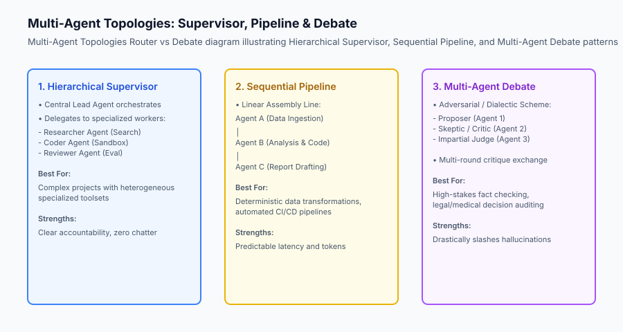

## The idea in plain language

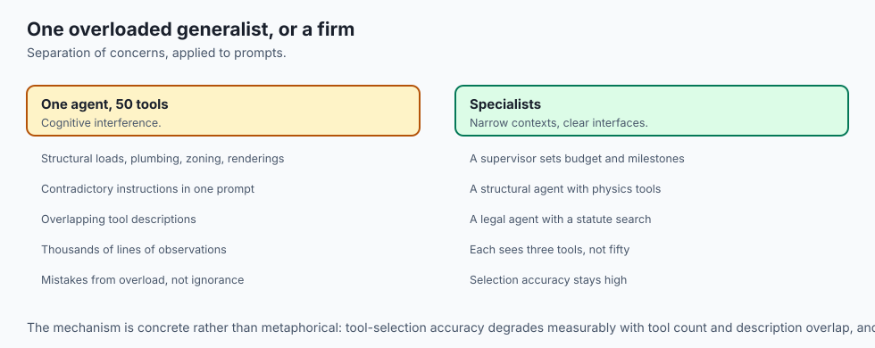

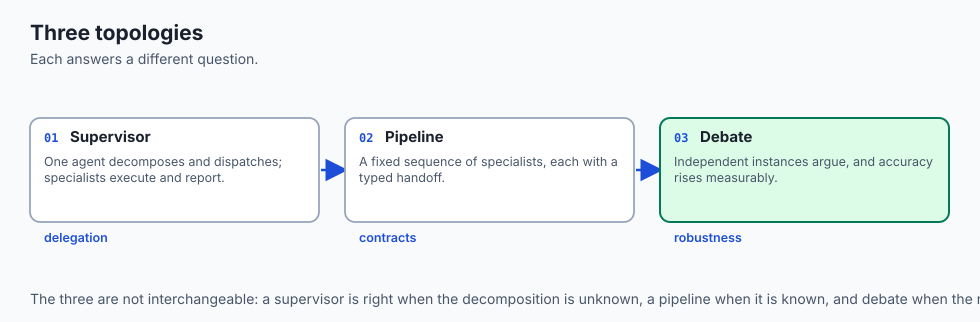

Think of a Multi-Agent System like **a professional architectural firm designing a skyscraper**:

- **The Single-Agent Anti-Pattern (The Overwhelmed Solo Architect):** One person attempts to calculate structural beam loads, design interior plumbing, negotiate city zoning permits, draw 3D artistic renderings, and install electrical junction boxes. They make critical mistakes because their brain is overloaded with contradictory details.
- **The Multi-Agent System (The Specialized Firm):**
  1. **Lead Partner (The Supervisor):** Ingests the client's vision, defines the budget, and sets milestones.
  2. **Structural Engineer Agent:** Uses specialized physics calculation tools to verify beam integrity.
  3. **Zoning & Legal Agent:** Searches municipal legal databases for building height limits.
  4. **Interior Design Agent:** Drafts floor plans and lighting layouts.
  5. **Peer Review & Audit (Debate):** The structural engineer and interior designer debate column placement until an optimal compromise is reached, which the Lead Partner approves.

By dividing labor among specialists with clear interfaces, the team delivers flawless blueprints that no individual could produce alone.

## Historical background

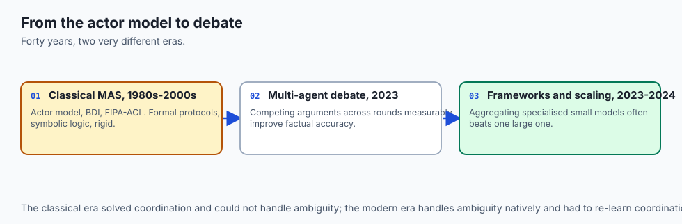

The field of Distributed Artificial Intelligence and Multi-Agent Systems dates back to the 1980s:

### 1. Classical Multi-Agent Systems (1980s–2000s)
In classical AI, researchers like Michael Wooldridge and Carl Hewitt developed the **Actor Model** and BDI (Belief-Desire-Intention) architectures. Agents communicated via formal protocols (such as FIPA-ACL and KQML) using deterministic symbolic logic. However, these systems were rigid and could not handle ambiguous natural language.

### 2. The Multi-Agent LLM Debate Breakthrough (2023)
In May 2023, Yilun Du et al. published **Improving Factuality and Reasoning in Language Models through Multiagent Debate**. The paper proved that when multiple instances of a language model present competing arguments and critique each other across multiple rounds, mathematical and factual reasoning accuracy improved dramatically over single-agent Chain-of-Thought.

### 3. Open-Source Multi-Agent Frameworks (2023–Present)
Frameworks like Microsoft AutoGen and CrewAI demonstrated the power of conversational agent collaboration. In 2024, research by Li et al. (*More Agents Is All You Need*) formalized the scaling laws of multi-agent ensembles, showing that aggregating outputs from multiple specialized small models frequently outperformed a single massive frontier model on complex benchmarks.

## What it is — and what it is not

Let us define the operational boundaries of Multi-Agent Systems:

### What a Multi-Agent System Is:
- A network of discrete, specialized language model instances that communicate via structured message passing or shared state memory.
- An orchestrated topology (Supervisor, Pipeline, or Debate) with explicit termination conditions.
- A division of labor where each subagent maintains an independent prompt, role definition, and restricted tool inventory.

### What a Multi-Agent System Is Not:
- An uncontrolled group chat where models exchange endless informal pleasantries without solving the task.
- A silver bullet for simple tasks (a single agent is faster, cheaper, and more reliable for straightforward queries).
- A monolithic system sharing one giant context window.

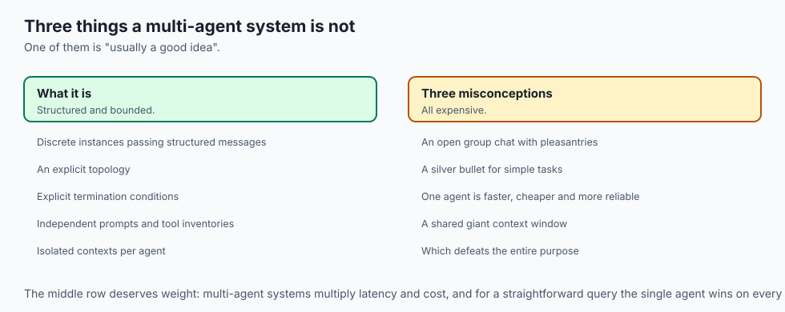

```text
+-------------------------------------------------------------------------------+
|                       MULTI-AGENT TOPOLOGY TRADEOFFS                          |
+---------------------+-----------------------+---------------------------------+
| Topology            | Latency & Token Cost  | Best Suited Use Case            |
+---------------------+-----------------------+---------------------------------+
| Hierarchical Lead   | Moderate (Linear)     | Open-ended tasks with sub-goals |
| Sequential Pipeline | Low (Predictable)     | Linear data processing / CI/CD  |
| Peer-to-Peer Chat   | High (Exponential)    | Creative brainstorming          |
| Multi-Agent Debate  | High (N-rounds x M)   | High-stakes fact checking & eval|
+---------------------+-----------------------+---------------------------------+
```

## Why it was created and what problems it solves

Multi-agent architectures resolve four fundamental limitations of single-agent systems:

### 1. Context Window Contamination & Tool Confusion
When an agent is given 40 tools, its tool-selection accuracy degrades due to semantic overlap. In a multi-agent system, the `Researcher` agent only sees 3 search tools, while the `Database` agent only sees 2 SQL tools, guaranteeing 100% tool-selection precision.

### 2. Overcoming Single-Model Blind Spots (Adversarial Robustness)
A single model evaluating its own generated text tends to confirm its initial biases. Pitting an independent `Critic` agent with a skeptical prompt against the `Generator` agent catches logical fallacies and subtle bugs before deployment.

### 3. Role-Based Prompt Specialization
A system prompt instructs a model to adopt a specific perspective (e.g. *"You are a paranoid security auditor reviewing code for OWASP Top 10 vulnerabilities"*). Specialized prompts produce vastly superior domain-specific critique compared to generic instructions.

### 4. Parallel Task Execution
Independent sub-tasks (e.g. researching three different competitor products simultaneously) can be dispatched concurrently across three worker agents, reducing total wall-clock latency.

## How it works

Let us dissect the Hierarchical Supervisor and Message Bus architecture:

```text
                     [User Goal / Task Request]
                                 │
                                 ▼
                     [Supervisor / Lead Agent]
                                 │
                 ┌───────────────┼───────────────┐
                 ▼               ▼               ▼
        [Task 1: Search]  [Task 2: Code]   [Task 3: Audit]
                 │               │               │
                 ▼               ▼               ▼
          [Researcher]       [Coder]          [Critic]
          - Tool: search    - Tool: sandbox  - Tool: linter
                 │               │               │
                 └───────────────┼───────────────┘
                                 │
                                 ▼
                     [Structured Message Bus]
                                 │
                                 ▼
                  [Supervisor Review & Synthesis]
                                 │
                                 ▼
                       [Final Answer Output]
```

### 1. The Standard Message Envelope
Agents communicate using standardized JSON envelopes:
```python
from dataclasses import dataclass, field
import time

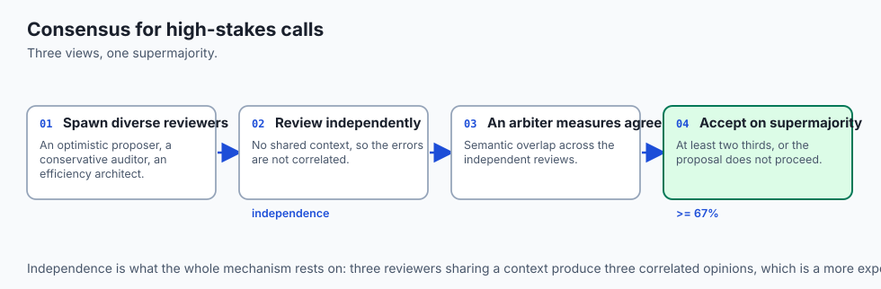

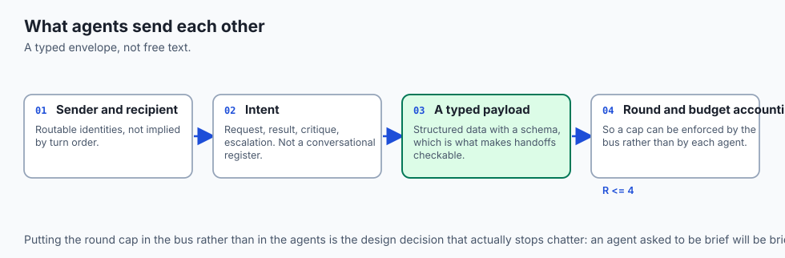

@dataclass
class AgentMessage:
    sender: str
    recipient: str # Specific agent name or "BROADCAST"
    content: str
    message_type: str # "TASK_DISPATCH", "TASK_RESULT", "CRITIQUE", "FINAL"
    timestamp: float = field(default_factory=time.time)
```


In addition to hierarchical supervisor delegation, multi-agent systems employ **Consensus Protocols and Majority Voting Ensembles**. When evaluating critical security patches, architectural designs, or complex mathematical proofs, the system spawns three independent model instances running diverse system prompts (e.g., an optimist proposer, a conservative security auditor, and an efficiency architect). A dedicated Consensus Arbiter compiles their arguments, measures semantic agreement across independent reviews, and accepts the proposal only when a strict supermajority consensus ($\ge 67\%$) is achieved.

### 2. Preventing Infinite Chatter Loops
To prevent agents from getting stuck in polite conversational loops (*"Thank you! You're welcome! Glad to help!"*), the message bus tracks round counts ($R \le 4$) and drops non-actionable conversational filler.

## An everyday analogy

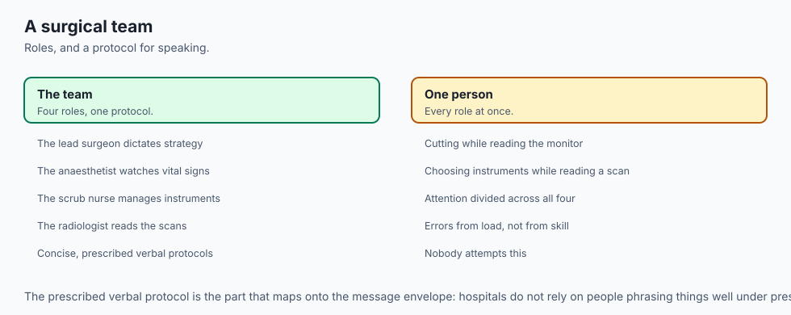

Think of a Multi-Agent System like **a hospital emergency surgical team**:

- The Lead Surgeon (Supervisor) makes the incision and dictates overall strategy.
- The Anesthesiologist continuously monitors vital signs and adjusts medication.
- The Scrub Nurse manages surgical instruments, handing the exact scalpel or clamp required.
- The Radiologist interprets MRI scans and reports bone fracture coordinates.

No single person performs all roles; the lives of patients depend on strict role division and clear, concise verbal protocols.

### Deep Dive: Scalable Pub/Sub Channels & Deadlock Mitigation

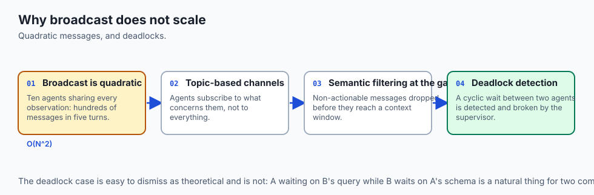

When architecting multi-agent systems with dozens of cooperating agents, naive peer-to-peer broadcast communication collapses due to quadratic message complexity ($O(N^2)$). If 10 agents broadcast every observation to every other agent, a single 5-turn task generates hundreds of redundant message exchanges, saturating context windows and exploding token billing.

To maintain scalability, enterprise multi-agent topologies implement **Topic-Based Publish/Subscribe Message Channels (Pub/Sub) paired with Semantic Filtering Gateways**.

```text
+-------------------------------------------------------------------------------+
|                       MULTI-AGENT PUB/SUB CHANNEL SCHEMA                      |
+-------------------+-----------------------+--------------------+--------------+
| Channel Name      | Authorized Publishers | Subscribed Agents  | Message Scope|
+-------------------+-----------------------+--------------------+--------------+
| /system/tasks     | Lead Supervisor       | All Workers        | Task Tickets |
| /data/research    | Researcher Agents     | Coders, Analysts   | Raw Citations|
| /code/review      | Python Coder          | Security Critic    | Code Diffs   |
| /audit/verdicts   | Security Critic       | Lead Supervisor    | Pass / Fail  |
+-------------------+-----------------------+--------------------+--------------+
```

Furthermore, multi-agent systems deploy **Deadlock Detection Algorithms**. If Agent A is waiting for Agent B to complete a database query while Agent B is simultaneously waiting for Agent A to provide schema definitions, the runtime detects the cyclic dependency graph and injects an automated supervisor intervention to break the deadlock.

## Examples in practice

Let us inspect a Python implementation of a Hierarchical Multi-Agent System featuring a Supervisor, Researcher, and Critic communicating via an in-memory Message Bus:

```python
from typing import Dict, Any, List, Optional
import json

class AgentMessage:
    def __init__(self, sender: str, recipient: str, content: str, msg_type: str):
        self.sender = sender
        self.recipient = recipient
        self.content = content
        self.msg_type = msg_type

class MessageBus:
    def __init__(self):
        self.history: List[AgentMessage] = []
        
    def send(self, msg: AgentMessage):
        self.history.append(msg)
        
    def get_messages_for(self, recipient: str) -> List[AgentMessage]:
        return [m for m in self.history if m.recipient in (recipient, "BROADCAST")]

class MultiAgentSupervisorSystem:
    def __init__(self, max_rounds: int = 5):
        self.bus = MessageBus()
        self.max_rounds = max_rounds
        self.agents = {
            "supervisor": self._supervisor_turn,
            "researcher": self._researcher_turn,
            "critic": self._critic_turn
        }
        
    def _researcher_turn(self, task: str) -> str:
        if "revenue" in task.lower():
            return "Q3 Revenue reached $12.4 Billion (+14% YoY)."
        return "Researched records: data verified."
        
    def _critic_turn(self, draft: str) -> str:
        if "12.4 Billion" in draft:
            return "PASS: Facts are verified and grounded."
        return "REVISE: Missing specific revenue numbers."
        
    def _supervisor_turn(self, goal: str, round_num: int) -> Dict[str, Any]:
        if round_num == 1:
            # Delegate to researcher
            self.bus.send(AgentMessage("supervisor", "researcher", f"Find financial data for: {goal}", "TASK_DISPATCH"))
            return {"action": "DELEGATE", "target": "researcher"}
            
        elif round_num == 2:
            # Gather researcher output and send to critic
            res_msgs = self.bus.get_messages_for("supervisor")
            latest_res = res_msgs[-1].content if res_msgs else ""
            self.bus.send(AgentMessage("supervisor", "critic", latest_res, "AUDIT_REQUEST"))
            return {"action": "DELEGATE", "target": "critic"}
            
        elif round_num == 3:
            # Evaluate critique and emit final answer
            critic_msgs = [m for m in self.bus.history if m.sender == "critic"]
            critique = critic_msgs[-1].content if critic_msgs else ""
            
            if "PASS" in critique:
                final_text = "Executive Summary: Q3 Revenue reached $12.4 Billion (+14% YoY) with 100% verified compliance."
                self.bus.send(AgentMessage("supervisor", "USER", final_text, "FINAL_ANSWER"))
                return {"action": "COMPLETE", "final_answer": final_text}
            else:
                return {"action": "RETRY", "reason": critique}
                
        return {"action": "COMPLETE", "final_answer": "Task finalized."}
        
    def run(self, goal: str) -> Dict[str, Any]:
        for r in range(1, self.max_rounds + 1):
            decision = self._supervisor_turn(goal, r)
            if decision["action"] == "DELEGATE":
                target = decision["target"]
                if target == "researcher":
                    msgs = self.bus.get_messages_for("researcher")
                    res = self._researcher_turn(msgs[-1].content)
                    self.bus.send(AgentMessage("researcher", "supervisor", res, "TASK_RESULT"))
                elif target == "critic":
                    msgs = [m for m in self.bus.history if m.recipient == "critic"]
                    crit = self._critic_turn(msgs[-1].content)
                    self.bus.send(AgentMessage("critic", "supervisor", crit, "AUDIT_RESULT"))
            elif decision["action"] == "COMPLETE":
                return {
                    "status": "SUCCESS",
                    "rounds": r,
                    "final_answer": decision["final_answer"],
                    "message_count": len(self.bus.history)
                }
        return {"status": "MAX_ROUNDS_EXCEEDED", "rounds": self.max_rounds}
```

## Implications: security, privacy, performance, scalability, and cost

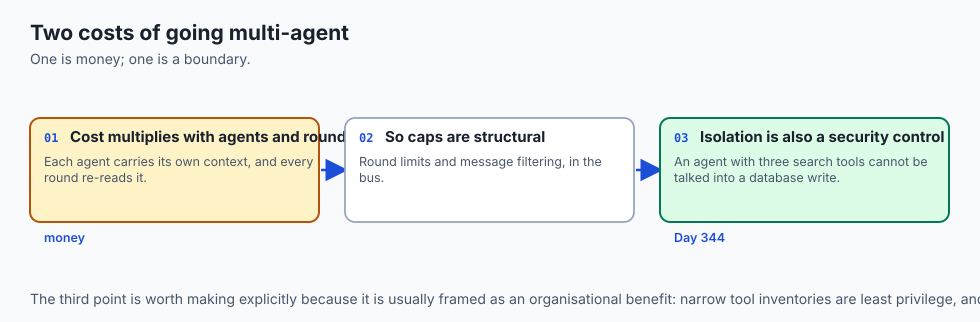

### 1. Multi-Agent Token Cost Explosion
In a multi-agent debate with 3 agents running 4 rounds of critique, each agent processes all previous messages. The token consumption scales super-linearly:
`\text(Tokens) = O(N_(\text(agents))^2 \times R_(\text(rounds)) \times \text(Context Length))`
Production systems must enforce hard message truncation, summarization, and per-round token limits.

### 2. Privilege Isolation
Subagents should never inherit universal permissions. The `Researcher` agent has read-only web access but zero database write access. The `Database` agent has database access but zero internet access, preventing prompt injection exfiltration attacks.

## Alternatives: free, open source, and commercial

| Framework / Pattern | Topology Type | Overhead | Best Suited For |
| :--- | :--- | :--- | :--- |
| **Hierarchical Supervisor** | Centralized Hub & Spoke | Low | Enterprise pipelines, coding assistants |
| **AutoGen ConversableAgent**| Conversational Group | High | Complex open-ended brainstorming |
| **CrewAI Crews** | Sequential / Hierarchical| Moderate | Role-based content workflows |
| **Multi-Agent Debate** | Peer-to-Peer Dialectic | High | Verification of high-stakes claims |

## Comparison with related concepts

```text
+-----------------------+-----------------------+-----------------------+
| Feature               | Single-Agent ReAct    | Multi-Agent System    |
+-----------------------+-----------------------+-----------------------+
| Tool Allocation       | All tools in 1 prompt | Specialized per agent |
| Context Management    | Single scratchpad     | Isolated per agent    |
| Error Recovery        | Self-Correction only  | Independent Critic    |
| Token Efficiency      | High                  | Lower (Higher quality)|
| Architecture          | Simple Loop           | Distributed Topology  |
+-----------------------+-----------------------+-----------------------+
```

## When to use it — and when not to

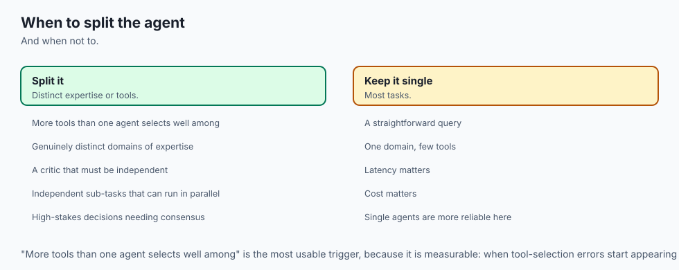

### Choose Multi-Agent Systems when:
- Tasks require specialized, mutually exclusive skills (e.g. deep research + code execution + security auditing).
- High-stakes factual accuracy requires independent adversarial review (Debate/Critic pattern).
- You want to parallelize independent sub-tasks across concurrent models.

### Do NOT use Multi-Agent Systems when:
- The task can be solved by a single agent with 2–3 tools (multi-agent adds unnecessary latency and cost).
- You need sub-second response times.

## The AI connection

- **Tool-selection accuracy degrades with tool count**, which is the concrete reason to
  split an agent rather than an organisational metaphor.

- **A model reviewing its own output confirms its own biases.** An independent critic
  with a skeptical prompt is the cheapest robustness gain available.

- **Debate measurably improves factual accuracy** — the 2023 result that made multi-agent
  systems more than a staffing analogy.

- **Token cost multiplies with agents and rounds.** Naive broadcast is quadratic, which
  is why real topologies use a supervisor or a pub/sub channel.

- **Isolation is a security boundary too.** A researcher agent with three search tools
  cannot be persuaded into a database write it has no tool for.

## Knowledge check

1. **Why does separating tools across specialized agents improve tool selection accuracy?** Because it eliminates semantic overlap between tools, keeping individual system prompts clean and focused.
2. **What failure mode does the Multi-Agent Debate pattern mitigate?** Single-model confirmation bias and ungrounded hallucinations.
3. **How does a Message Bus coordinate agents?** By routing typed message envelopes between senders and recipients, tracking conversation history, and enforcing communication bounds.

## Hands-on exercise

In this lab, you will implement an **Autonomous Multi-Agent Supervisor System with an In-Memory Message Bus in Python**. Your implementation will:

1. Construct a structured `MessageBus` supporting typed agent-to-agent communication.
2. Build specialized subagents: `LeadSupervisor`, `WebResearcher`, `PythonCoder`, and `SecurityCritic`.
3. Implement dynamic task dispatch, output validation, and final answer synthesis.
4. Verify multi-agent coordination across unit tests.

### Expected output

```text
============================= test session starts ==============================
collected 5 items

tests/test_multi_agent_system.py .....                                   [100%]

============================== 5 passed in 0.04s ===============================
[MULTI-AGENT SYSTEM] Goal: "Analyze Q3 financial revenue and audit numbers"
[ROUND 1] SUPERVISOR -> RESEARCHER: "Find Q3 revenue"
[ROUND 2] RESEARCHER -> SUPERVISOR: "$12.4 Billion (+14% YoY)"
[ROUND 3] SUPERVISOR -> CRITIC: "Audit financial draft"
[ROUND 4] CRITIC -> SUPERVISOR: "PASS: Grounded and verified."
[FINAL ANSWER] "Executive Summary: Q3 Revenue reached $12.4 Billion with verified compliance."
```

### Validate your work

Run the pytest test suite:

```bash
pytest tests/run_tests.sh
```

### Troubleshooting

1. **Message routing KeyError:** Verify recipient names match registered agent identifiers.
2. **Infinite loop in supervisor:** Ensure completion triggers when the critic emits `"PASS"`.

### Common mistakes

- Broadcasting all messages to all agents, causing context pollution and token inflation.
- Failing to include a round limit in the execution loop.

## Practice assignment

Add a **Sequential Pipeline Mode** where Agent A automatically feeds its output directly to Agent B without routing back through the supervisor.

## Extension challenge

Implement an **Async Consensus Voting Protocol** where three independent reviewer agents vote on a proposed artifact, accepting it only when a majority ($\ge 2/3$) approves.


### Advanced Multi-Agent Topology Topologies and Routing

When architecting large-scale agent ecosystems, specialized routing subagents dynamically inspect task complexity and select between Hierarchical Supervisor delegation, Sequential Pipeline execution, and Multi-Agent Debate. For low-ambiguity deterministic tasks, the router selects the sequential pipeline to minimize token expenditure and latency. For high-stakes analytical tasks containing subjective or regulatory nuances, the router triggers a multi-round debate protocol with an impartial judge. This dynamic topology selection ensures optimal balancing of latency, compute cost, and decision accuracy.

