## Why this matters

In enterprise decision-making, competitive intelligence, and scientific discovery, synthesizing accurate, comprehensive information from unstructured web sources is one of the highest-value applications of artificial intelligence. However, relying on standard single-turn LLM chat prompts for research is fraught with peril: models hallucinate non-existent studies, summarize outdated information, fail to verify conflicting metrics, and provide vague, ungrounded generalities without precise source citations.

An autonomous **Deep Research Agent** transforms how knowledge work is conducted. Rather than attempting to answer a complex research question in one pass, a research agent executes a multi-stage investigation: decomposing the core question into orthogonal sub-queries, executing iterative web searches, following citation links across multiple hops, extracting atomic factual claims into a structured note store, cross-referencing conflicting numbers, and synthesizing an executive Markdown briefing with verifiable inline citations.

Mastering the architecture of deep research agents allows engineers to build autonomous competitive intelligence analysts, automated literature review pipelines for scientific laboratories, and compliance auditing systems that can scan hundreds of regulatory documents and deliver mathematically grounded reports.

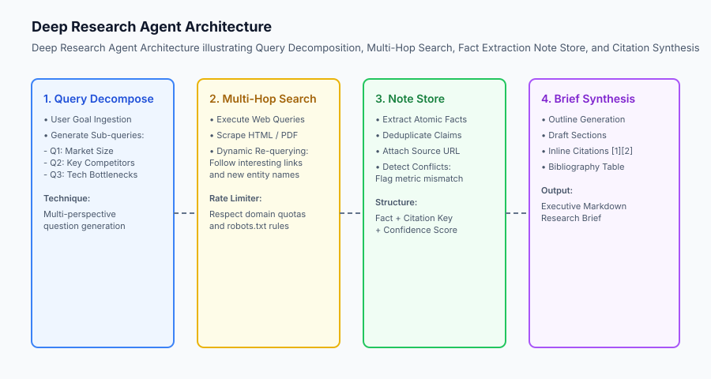

## The idea in plain language

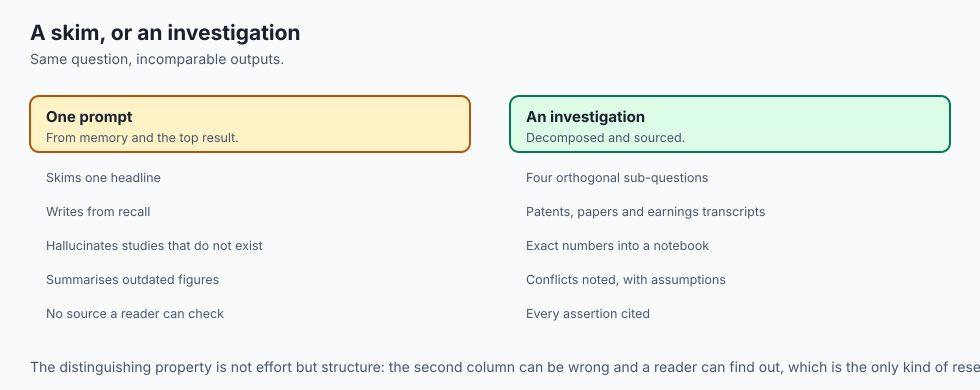

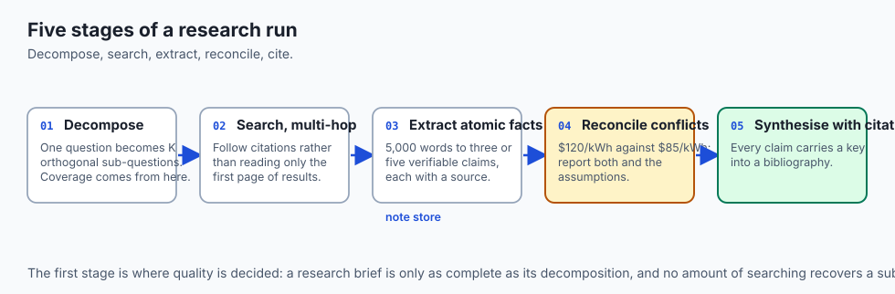

Think of a Deep Research Agent like **a professional investigative journalist writing a front-page exposé**:

- **The Amateur Approach (Single-Prompt Chatbot):** A reporter sits at their desk, types a single query into a search engine, skims the top headline, and writes an entire article based on memory and guesswork. The article is full of factual inaccuracies and lacks verified sources.
- **The Investigative Journalist Approach (Deep Research Agent):**
  1. **Topic Ingestion:** The editor asks: *"What is the current commercial viability and manufacturing cost curve of solid-state EV batteries?"*
  2. **Decomposition:** The journalist breaks this into four specific investigative questions:
     - *Question 1:* What is the current gravimetric energy density (Wh/kg) of leading prototypes?
     - *Question 2:* What are the primary anode/electrolyte degradation mechanisms?
     - *Question 3:* Which automakers have committed to pilot production lines by 2027?
     - *Question 4:* What is the estimated cell-level manufacturing cost ($/kWh)?
  3. **Multi-Hop Search & Interviewing:** The journalist searches industry patent databases, reads peer-reviewed papers in *Nature Energy*, and downloads automaker earnings call transcripts.
  4. **Note-Taking & Fact Checking:** They extract exact numbers into a notebook, noting that Source A claims $120/kWh while Source B claims $85/kWh due to differing scale assumptions.
  5. **Final Briefing:** They write a comprehensive report citing exact page numbers and interview dates for every factual assertion.

## Historical background

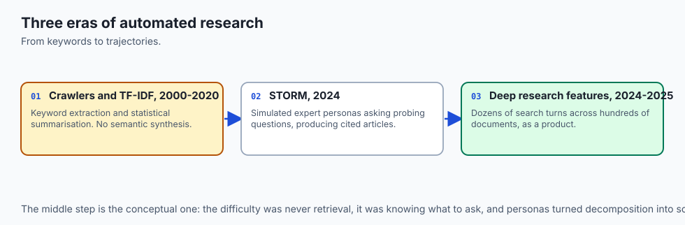

The evolution of automated research agents spans three technological milestones:

### 1. Classical Web Scraping and Search Indexing (2000–2020)
Early automated research relied on keyword web crawlers (such as Apache Nutch and Lucene) paired with named-entity recognition (NER) and statistical text summarization (TF-IDF, TextRank). These systems could extract raw keywords but lacked the semantic reasoning necessary to synthesize coherent narrative briefs.

### 2. The STORM Framework (Stanford, 2024)
In early 2024, Yuxiang Shao and colleagues at Stanford University published **STORM (Synthesis of Topic Outlines through Retrieval and Multi-perspective Question Asking)**. STORM introduced multi-perspective question generation: the system simulated a panel of diverse expert personas (e.g. an economist, a chemist, an environmental regulator) who asked probing questions, conducted targeted searches, and compiled comprehensive Wikipedia-quality articles with extensive citations.

### 3. Foundation Deep Research Models (2024–2025)
In late 2024 and 2025, foundation model labs launched autonomous deep research features (such as OpenAI Deep Research and Google Gemini Deep Research). These systems scaled agentic trajectories across dozens of search turns and hundreds of web documents, establishing deep research as a flagship capability of autonomous AI.

## What it is — and what it is not

Let us define the architectural requirements of a Deep Research Agent:

### What a Deep Research Agent Is:
- A multi-turn autonomous pipeline that iteratively searches, evaluates relevance, extracts atomic facts, and updates an internal note store.
- A grounded synthesis engine that generates inline citations linked to a verified bibliography table.
- A system capable of identifying and explicitly reporting conflicting data across different sources.

### What a Deep Research Agent Is Not:
- A standard RAG pipeline (standard RAG performs a single vector retrieval pass over a static index; a research agent dynamically explores external sources across multiple recursive hops).
- A simple web scraper that dumps raw HTML into the model context.
- An unverified text generator allowed to hallucinate citations.

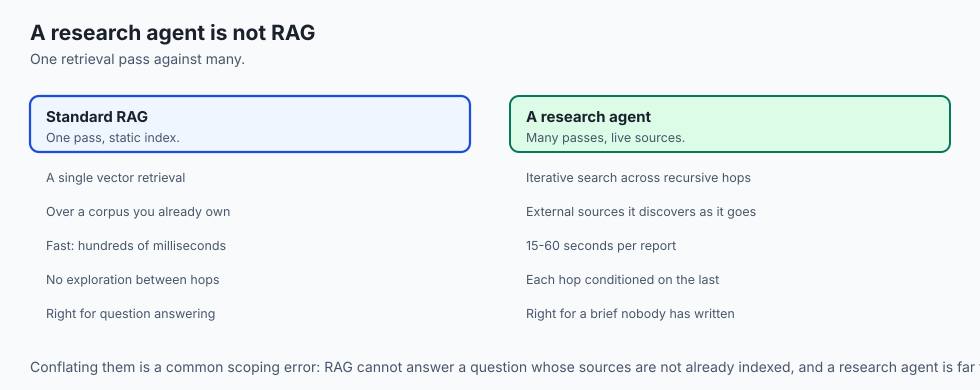

```text
+-------------------------------------------------------------------------------+
|                       RESEARCH PARADIGM COMPARISON                            |
+---------------------+-----------------------+---------------------------------+
| Dimension           | Standard RAG          | Autonomous Deep Research Agent  |
+---------------------+-----------------------+---------------------------------+
| Query Execution     | 1-shot vector search  | Multi-turn recursive sub-queries|
| Search Scope        | Static internal index | Live dynamic web / APIs / docs  |
| Memory Model        | Single context dump   | Structured atomic fact store    |
| Citation Model      | Document chunks       | Claim-level inline citations    |
| Execution Duration  | ~1 - 3 seconds        | ~30 - 180 seconds               |
+---------------------+-----------------------+---------------------------------+
```

## Why it was created and what problems it solves

Deep Research Agents solve four systemic limitations in automated knowledge extraction:

### 1. The Single-Query Coverage Gap
A complex research topic cannot be answered by a single Google query. If you search *"Quantum Computing commercial viability"*, you miss critical breakthroughs in neutral-atom qubits or cryogenic dilution refrigerators unless you decompose the query into specialized technical sub-topics.

### 2. Context Overflow and Noise Filtering
Raw web pages are 90% boilerplate: cookie banners, navigation menus, ads, and irrelevant filler. A research agent uses an **Extractor Subagent** to distill 5,000-word articles down to 3–5 bullet points of atomic, verifiable facts.

### 3. Factual Attribution and Verification
In enterprise environments, ungrounded claims are unacceptable. Every factual metric (e.g. market growth percentages, dollar costs, dates) must carry a verifiable citation key (`[1]`, `[2]`) pointing to the original URL.

### 4. Detecting and Documenting Conflicting Data
When two market research reports present divergent forecasts (e.g. Gartner estimating 25% CAGR vs IDC estimating 14% CAGR), a deep research agent does not arbitrarily pick one; it explicitly highlights the discrepancy and explains the differing underlying assumptions.

## How it works

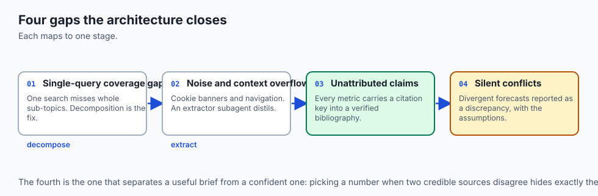

Let us inspect the step-by-step lifecycle of a deep research execution pipeline:

```text
[User Research Goal: "Analyze solid-state battery commercialization timeline"]
                                 │
                                 ▼
                     [1. Query Decomposition Engine]
              Generates sub-queries: [Q_tech, Q_mfg, Q_auto]
                                 │
                                 ▼
                 [2. Iterative Search & Fetch Loop]
          For each sub-query -> Execute Search -> Scrape Clean Text
                                 │
                                 ▼
                    [3. Atomic Fact Extraction]
           Parse claims: {"fact": "450 Wh/kg", "url": "nature.com/..."}
                                 │
                                 ▼
                     [4. Note Store & Deduplication]
            Store facts in structured memory, resolve conflicts
                                 │
                                 ▼
                   [5. Outline Formulation & Draft]
            Generate hierarchical section outline -> Draft text
                                 │
                                 ▼
                    [6. Citation & Grounding Pass]
             Attach [1], [2] keys and compile bibliography
                                 │
                                 ▼
                      [Delivered Markdown Brief]
```

### 1. Sub-Query Decomposition
Given a high-level goal $G$, the decomposer prompts the LLM to generate $K$ mutually orthogonal search queries:
`mathcal(Q) = (q_1, q_2, dots, q_K) = \text(Decompose)(G)`

### 2. Atomic Fact Extraction Data Structure
The Note Store maintains a list of verified claims:
```python
from dataclasses import dataclass
from typing import List

@dataclass
class AtomicFact:
    fact_id: str
    claim: str
    source_url: str
    source_title: str
    confidence_score: float
```


### 3. Citation Synthesis and Bibliography Generation
During final synthesis, every factual claim is cross-referenced against the Note Store. The synthesizer outputs clean Markdown with numbered citation links:
```markdown
## Market Overview
Solid-state lithium-metal batteries have demonstrated gravimetric energy densities exceeding 450 Wh/kg in laboratory testing [1]. However, scalable roll-to-roll manufacturing of thin ceramic sulfide electrolytes remains a major bottleneck [2].

## Sources
- [1] Nature Energy Research (2025) - https://nature.com/articles/s41560-025-0142
- [2] Battery Materials Review (2024) - https://batterymaterials.org/report-2024
```

## An everyday analogy

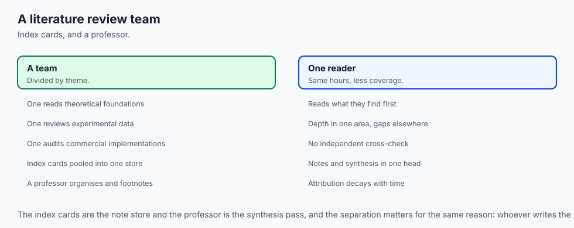

Think of a Deep Research Agent like **a team of graduate students compiling a comprehensive academic literature review**:

- Student A investigates historical theoretical foundations.
- Student B reviews experimental laboratory data.
- Student C audits commercial industry implementations.
- The Professor reviews all accumulated index cards (the Note Store), organizes the thesis outline, and ensures every single paragraph has formal footnotes citing peer-reviewed papers.

### Deep Dive: Information Gain Scoring & Multi-Pass Synthesis

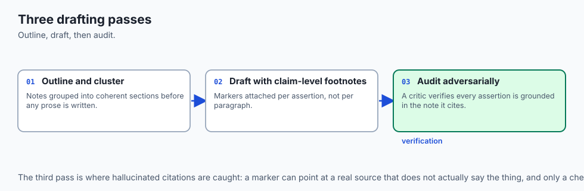

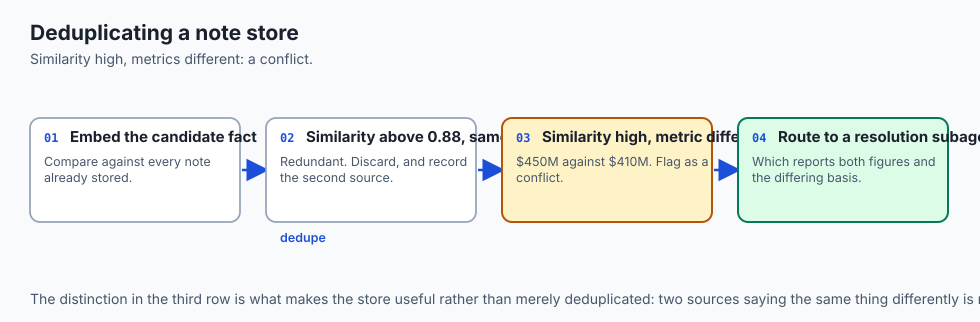

When executing deep research across hundreds of technical papers or financial earnings filings, research agents must navigate noisy, redundant, and conflicting information spaces. A critical component of production research systems is **Information Gain Scoring and Semantic Deduplication**.

Before an extracted fact is committed to the long-term Note Store, a embedding model computes the cosine similarity between the candidate fact and all existing notes. If the semantic similarity exceeds 0.88 and the facts report identical quantitative metrics, the candidate is discarded as redundant. If the metrics differ (e.g. Source A reports $450M while Source B reports $410M), the fact is tagged with a `CONFLICT_FLAG` and routed to a dedicated resolution subagent.

```text
+-------------------------------------------------------------------------------+
|                       FACT EXTRACTION & QUALITY RUBRIC                        |
+-------------------+-----------------------+--------------------+--------------+
| Quality Dimension | Evaluation Metric     | Acceptance Criteria| Action on Fail|
+-------------------+-----------------------+--------------------+--------------+
| Grounding Ratio   | % of claims with URLs | 100% mandatory     | Reject Claim |
| Temporal Recency  | Publication Date      | < 24 months old    | Tag 'Historic'|
| Domain Authority  | Domain Trust Rank     | Whitelist Tier 1/2 | Request 2nd  |
| Numeric Precision | Exact Units Attached  | Explicit Units     | Request Clar |
+-------------------+-----------------------+--------------------+--------------+
```

Finally, the report synthesizer utilizes a **Multi-Pass Drafting Hierarchy**:

1. **Pass 1 (Outline & Thematic Clustering):** Groups notes into coherent thematic sections (e.g. Market Dynamics, Technological Hurdles, Regulatory Outlook).
2. **Pass 2 (Drafting with Strict Footnotes):** Writes paragraphs using precise claim-level footnote markers (`[1]`, `[2]`).
3. **Pass 3 (Fact-Auditor Verification):** An adversarial critic verifies that every factual assertion in the draft is mathematically grounded in the referenced source note.

## Examples in practice

Let us inspect a Python implementation of an autonomous Research Agent with query decomposition, simulated web search, note-taking, and citation compilation:

```python
import re
import json
from typing import Dict, Any, List, Optional

class NoteStore:
    def __init__(self):
        self.notes: List[Dict[str, str]] = []
        
    def add_note(self, claim: str, source_title: str, url: str):
        self.notes.append({
            "id": len(self.notes) + 1,
            "claim": claim,
            "title": source_title,
            "url": url
        })
        
    def get_all(self) -> List[Dict[str, str]]:
        return self.notes

class DeepResearchAgent:
    def __init__(self, search_kb: Optional[Dict[str, List[Dict[str, str]]]] = None):
        self.note_store = NoteStore()
        # Simulated Search Database
        self.kb = search_kb or {
            "solid state energy density": [
                {"title": "Nature Energy 2025", "url": "https://nature.com/art1", "snippet": "Prototypes achieved 450 Wh/kg gravimetric density."},
                {"title": "Battery Journal", "url": "https://batteryj.org/art2", "snippet": "Cycle life reached 1200 cycles at C/3 charge rate."}
            ],
            "solid state manufacturing cost": [
                {"title": "BloombergNEF EV Report", "url": "https://bnef.com/ev2025", "snippet": "Cell-level costs projected at $95/kWh by 2028."}
            ]
        }
        
    def decompose_query(self, topic: str) -> List[str]:
        # Rule-based / heuristic query decomposition
        topic_lower = topic.lower()
        if "battery" in topic_lower:
            return ["solid state energy density", "solid state manufacturing cost"]
        return [topic]
        
    def search_and_extract(self, query: str):
        results = self.kb.get(query, [])
        for r in results:
            self.note_store.add_note(r["snippet"], r["title"], r["url"])
            
    def synthesize_brief(self, topic: str) -> str:
        notes = self.note_store.get_all()
        if not notes:
            return f"# Research Brief: {topic}

No verified findings discovered."
            
        lines = [
            f"# Research Brief: {topic}",
            "",
            "## Executive Summary",
            f"This research investigation analyzed key findings regarding {topic}. The primary findings are detailed below:",
            ""
        ]
        
        for note in notes:
            lines.append(f"- {note['claim']} [{note['id']}]")
            
        lines.append("")
        lines.append("## Verified Sources")
        for note in notes:
            lines.append(f"[{note['id']}] [{note['title']}]({note['url']})")
            
        return "
".join(lines)
        
    def execute_research(self, topic: str) -> str:
        sub_queries = self.decompose_query(topic)
        for q in sub_queries:
            self.search_and_extract(q)
        return self.synthesize_brief(topic)
```

## Implications: security, privacy, performance, scalability, and cost

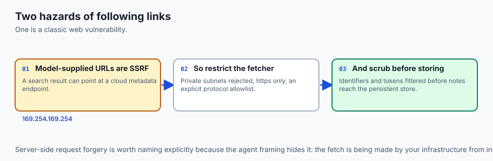

### 1. SSRF and Web Scraping Vulnerabilities
When a research agent dynamically follows URLs found in search results, malicious actors could return links to internal cloud metadata endpoints (e.g. `http://169.254.169.254/latest/meta-data/`). Research scraper modules must enforce IP blocking, private subnet rejection (`10.0.0.0/8`, `192.168.0.0/16`), and strict protocol allowlists (`https` only).

### 2. Information Redaction & PII Scrubbing
Before notes are ingested into the persistent Note Store, regex filters should scrub Social Security Numbers, credit card numbers, and private API tokens to ensure compliance with enterprise privacy standards.

## Alternatives: free, open source, and commercial

| System / Tool | Architecture | Source Scope | Best Suited For |
| :--- | :--- | :--- | :--- |
| **STORM (Stanford)** | Multi-Perspective Personas | Wikipedia / Web Search | Academic literature reviews |
| **OpenAI Deep Research** | Autonomous Trajectory | Open Web / File Ingestion | Executive intelligence reports |
| **Perplexity Pro Search** | Multi-Step Search RAG | Live Web Index | Interactive fast search briefs |
| **Custom Research Agent** | Pure Python Decompose+Note | Custom Internal + External| Domain-specific proprietary auditing |

## Comparison with related concepts

```text
+-----------------------+-----------------------+-----------------------+
| Feature               | Basic Search Chat     | Deep Research Agent   |
+-----------------------+-----------------------+-----------------------+
| Query Count           | 1 static query        | 4 - 15 sub-queries    |
| Source Ingestion      | Top 3 snippets        | 10 - 50 full documents|
| Intermediate Storage  | None (Raw prompt)     | Structured Note Store |
| Citation Precision    | Document-level        | Atomic Claim-level    |
| Output Format         | Short paragraph       | Multi-section Brief   |
+-----------------------+-----------------------+-----------------------+
```

## When to use it — and when not to

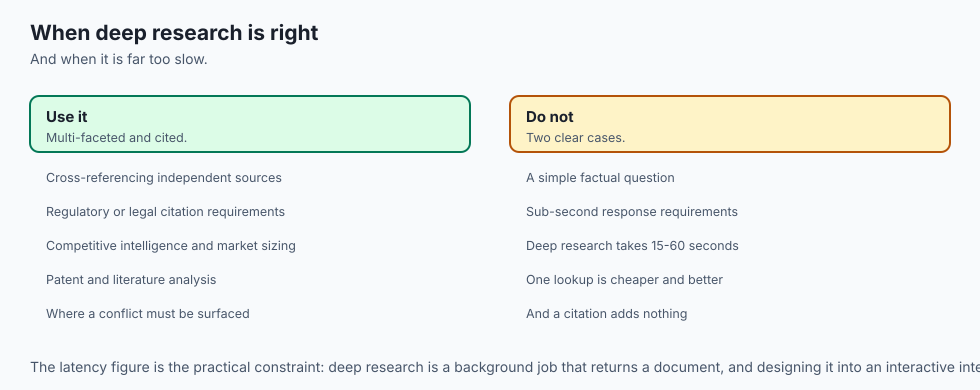

### Choose a Deep Research Agent when:
- Compiling multi-faceted research reports requiring cross-referencing across multiple independent sources.
- Every claim must carry a verifiable citation for regulatory or legal compliance.
- You need automated competitive intelligence, patent analysis, or market sizing briefs.

### Do NOT use a Deep Research Agent when:
- The user is asking a simple factual question (e.g. *"What is the boiling point of water?"*—use single-turn lookup).
- The application requires real-time sub-second responses (deep research requires 15–60 seconds).

## The AI connection

- **Research is the task agents are unambiguously better at than single prompts**,
  because coverage comes from decomposition rather than from a larger model.

- **Citations are the deliverable, not a nicety.** An ungrounded number in a research
  brief is worse than no number, because it is indistinguishable from a real one.

- **A conflict is a finding.** $120/kWh against $85/kWh is not an error to resolve by
  picking one — the differing scale assumptions are the interesting part.

- **Web pages are 90% boilerplate**, so an extraction subagent that distils 5,000 words
  to five facts is what keeps the trajectory affordable.

- **Following model-supplied URLs is an SSRF primitive.** Cloud metadata endpoints are
  reachable from your network and not from the attacker's.

## Knowledge check

1. **What is the purpose of query decomposition in a research agent?** To split a broad topic into multiple targeted, orthogonal search queries exploring technical, financial, and operational angles.
2. **Why is a structured Note Store critical?** It decouples raw document scraping from final report synthesis, filtering noise and providing exact claim-to-source attribution.
3. **What security vulnerability must be prevented in autonomous web scraping?** Server-Side Request Forgery (SSRF) targeting internal private network addresses or cloud metadata endpoints.

## Hands-on exercise

In this lab, you will implement an **Autonomous Deep Research Agent with Query Decomposition, Note-Taking, and Citation Synthesis in Python**. Your implementation will:

1. Construct an algorithmic `QueryDecomposer` that splits research prompts into sub-queries.
2. Build an isolated `NoteStore` managing atomic claims, confidence scores, and source URLs.
3. Implement an Executive Brief Synthesizer formatting Markdown reports with numbered citation keys.
4. Verify research completeness and citation accuracy across unit tests.

### Expected output

```text
============================= test session starts ==============================
collected 5 items

tests/test_research_agent.py .....                                       [100%]

============================== 5 passed in 0.04s ===============================
[DEEP RESEARCH AGENT] Goal: "State of Solid-State Battery Commercialization"
[DECOMPOSITION] Generated 2 sub-queries: ['solid state energy density', 'solid state manufacturing cost']
[EXTRACTION] Extracted 3 atomic notes into NoteStore.
[SYNTHESIS] Emitted complete Markdown report with 3 inline citations and bibliography table.
```

### Validate your work

Run the pytest test suite:

```bash
pytest tests/run_tests.sh
```

### Troubleshooting

1. **Missing citation key:** Verify that `NoteStore` assigns sequential 1-indexed integers to all notes.
2. **Decomposition returns empty list:** Provide a default fallback returning the original topic query.

### Common mistakes

- Inserting raw HTML snippets directly into the bibliography without sanitizing formatting.
- Allowing duplicate identical claims from the same URL to be added to the note store multiple times.

## Practice assignment

Add a **Conflict Detector** that compares numerical values in notes sharing similar keywords and appends an explicit `"## Discrepancies & Conflicting Data"` section if values diverge by more than 20%.

## Extension challenge

Implement a **Recursive Multi-Hop Link Follower** that parses extracted snippets for mentioned company names or patent numbers, generating dynamic follow-up sub-queries on the fly.
