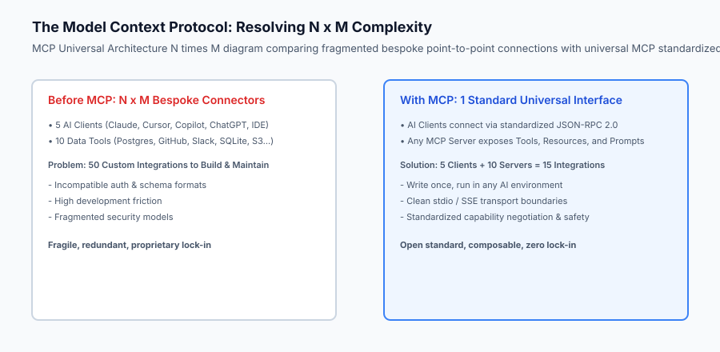

## Why this matters

Before the advent of standard open protocols, connecting an AI model to enterprise infrastructure was a painful, highly fragmented engineering effort. If an organization wanted to give an AI assistant access to PostgreSQL databases, Jira issue trackers, GitHub repositories, and internal Slack channels, developers had to write custom API wrappers for every individual client application (such as Claude Desktop, VS Code plugins, custom chat frontends, and terminal tools).

This created the classic **$N 	imes M$ integration problem**: $N$ AI client applications multiplied by $M$ enterprise tools required maintaining $N 	imes M$ separate point-to-point connectors. Every time a database schema changed or a new model launched, engineering teams faced cascading code rewrites.

In late 2024, Anthropic open-sourced the **Model Context Protocol (MCP)** to solve this architectural crisis. MCP is to AI tool integration what **LSP (Language Server Protocol)** was to code editors and compilers. By establishing an open, universal standard based on JSON-RPC 2.0, MCP allows any data provider, SaaS platform, or developer to write a single MCP server that seamlessly exposes **Tools**, **Resources**, and **Prompts** to any compatible AI client without modifying a single line of client code.



## The idea in plain language

Think of the Model Context Protocol like **USB-C for artificial intelligence**:

- **The Proprietary Past (Pre-MCP):** In the early 2000s, every cell phone manufacturer used a proprietary charging cable. Nokia had a circular pin, Sony Ericsson had a wide ribbon, Motorola had a mini-plug, and Apple had a 30-pin connector. If you bought a new phone, all your old chargers, docks, and car adapters were instantly useless.
- **The Standardized Present (MCP as USB-C):** USB-C created a universal physical and electrical specification. Now, whether you connect a smartphone, an external SSD, a 4K monitor, or a studio microphone, any USB-C port negotiates power and data protocols automatically.

MCP does exactly this for AI software: an MCP server exposes its capabilities over a universal interface, and any MCP client (Claude Desktop, Cursor, Zed, Windsurf, or custom enterprise agents) plugs into it instantly.

## Historical background

The technological evolution toward standardized agent communication occurred across three key stages:

### 1. The Language Server Protocol (LSP) Paradigm (Microsoft, 2016)
In 2016, Microsoft introduced LSP for Visual Studio Code. Prior to LSP, adding auto-complete and syntax highlighting for 10 programming languages across 5 different text editors required 50 bespoke extensions. LSP standardized editor-compiler communication over JSON-RPC, reducing 50 integrations to $10 + 5 = 15$.

### 2. Ad-Hoc Function Calling and Plugins (2023–2024)
In 2023, OpenAI introduced ChatGPT Plugins and Function Calling APIs. While groundbreaking, every ecosystem created proprietary JSON formats and isolated hosting environments. An OpenAPI plugin written for ChatGPT could not be used inside Claude Desktop or a local VS Code coding assistant without manual rewriting.

### 3. The Open MCP Standard (Anthropic, November 2024)
Anthropic released the Model Context Protocol as an open-source specification under the MIT license, accompanied by official SDKs in TypeScript, Python, and Kotlin. Within months, dozens of major developer tools—including PostgreSQL, GitHub, Brave Search, Slack, and Google Drive—released official MCP servers, making MCP the de facto industry standard for AI tool and data interoperability.

## What it is — and what it is not

Let us define the strict architectural boundaries of the Model Context Protocol:

### What MCP Is:
- An open, bidirectional protocol using JSON-RPC 2.0 framing over standard I/O (stdio) or Server-Sent Events (SSE).
- A client-server architecture cleanly separating AI host applications (clients) from data/tool providers (servers).
- A unified abstraction for three distinct primitives: **Tools** (executable actions), **Resources** (data/files), and **Prompts** (slash command templates).

### What MCP Is Not:
- A proprietary Anthropic-only lock-in (MCP is fully open-source and model-agnostic; it works with OpenAI, Gemini, Claude, Ollama, and custom local models).
- A runtime LLM framework like LangChain or LlamaIndex (MCP is a wire protocol; frameworks can use MCP servers as tool backends).
- A direct replacement for raw REST APIs (MCP wraps backend APIs with standardized agent discovery metadata).

```text
+-------------------------------------------------------------------------------+
|                       MCP PRIMITIVES TAXONOMY                                 |
+-------------------+-----------------------+-----------------------------------+
| Primitive Name    | Control Model         | Primary Purpose                   |
+-------------------+-----------------------+-----------------------------------+
| Tools             | Model-Controlled      | Executable functions with side    |
|                   |                       | effects and argument validation   |
| Resources         | Application-Controlled| Passive read-only data (logs,     |
|                   |                       | files, database rows, schemas)    |
| Prompts           | User-Controlled       | Reusable slash commands and       |
|                   |                       | structured multi-turn templates   |
+-------------------+-----------------------+-----------------------------------+
```

## Why it was created and what problems it solves

The Model Context Protocol resolves four systemic pain points in AI engineering:

### 1. Elimination of Bespoke Integration Glue Code
Instead of writing and maintaining hundreds of custom API wrapper classes, engineers write a single MCP server per backend service. Any compliant AI application immediately gains access.

### 2. Dynamic Tool and Resource Discovery
MCP clients do not need hardcoded tool lists at compile time. During initialization, the client queries `tools/list` and `resources/list`, dynamically adapting its system prompt and tool declarations to whatever servers are active.

### 3. Strict Process and Security Isolation
Local MCP servers run as isolated child processes communicating over `stdio`. The AI host application does not need to load untrusted third-party Python or Node.js code into its own memory space, preventing memory corruption and isolating crashes.

### 4. Human-in-the-Loop Approval by Design
The protocol standardizes structured tool call requests, allowing host clients to inspect arguments and render interactive approval dialogs to users before dangerous operations (such as SQL mutations or file deletions) are dispatched.

## How it works

### Deep Dive: JSON-RPC 2.0 Framing & Transport Topologies

Under the hood, the Model Context Protocol strictly mandates **JSON-RPC 2.0 (RFC standard)** for all message exchanges. Every packet transmitted across the wire must belong to one of three categories:

1. **Request Object:**
   A request must contain `"jsonrpc": "2.0"`, a unique numerical or string `"id"`, a `"method"` string, and an optional `"params"` object.
   ```json
   {
     "jsonrpc": "2.0",
     "id": 101,
     "method": "tools/call",
     "params": {
       "name": "query_database",
       "arguments": {
         "query": "SELECT count(*) FROM telemetry"
       }
     }
   }
   ```

2. **Response Object:**
   A response echoes the caller's `"id"` and provides either a `"result"` object (on success) or an `"error"` object (on transport/protocol failure). Notice that tool execution failures (like SQL syntax errors) do NOT return JSON-RPC errors; they return `"result": {"isError": true}` so the model can inspect the error message directly.
   ```json
   {
     "jsonrpc": "2.0",
     "id": 101,
     "result": {
       "content": [
         {"type": "text", "text": "sqlite3.OperationalError: no such table: telemetry"}
       ],
       "isError": true
     }
   }
   ```

3. **Notification Object:**
   A one-way message without an `"id"` field, used for state updates and streaming events. The receiver must not reply:
   ```json
   {
     "jsonrpc": "2.0",
     "method": "notifications/resources/updated",
     "params": {
       "uri": "postgres://analytics/schema"
     }
   }
   ```

### Transport Mechanisms: Stdio vs Server-Sent Events (SSE)

MCP standardizes two primary transport layers:
- **Standard Input/Output (stdio):** The host client spawns the server as a local child subprocess and writes JSON lines to `stdin` while reading from `stdout`. This provides near-zero latency ($< 0.5ms$), zero network attack surface, and automatic lifecycle coupling (when the host closes, the subprocess exits).
- **Server-Sent Events (SSE) over HTTP:** Used for remote servers running on different machines or cloud containers. The client opens an HTTP GET connection to `/sse` to receive streaming notifications from the server, and issues HTTP POST requests to `/messages` to send client-to-server RPC requests.

```text
+-------------------------------------------------------------------------------+
|                       MCP TRANSPORT COMPARISON MATRIX                         |
+-------------------+---------------------------+-------------------------------+
| Feature           | Standard I/O (stdio)      | SSE over HTTP                 |
+-------------------+---------------------------+-------------------------------+
| Deployment Scope  | Local Workstation         | Remote Cloud / Docker Network |
| Process Model     | Child Subprocess          | Independent Daemon / Service  |
| Latency Overhead  | < 0.5 ms                  | 5 ms - 50 ms (Network hop)    |
| Authentication    | OS-level user permissions | Bearer Tokens / mTLS          |
| Multiplexing      | Single client to server   | Multiple clients to one server|
+-------------------+---------------------------+-------------------------------+
```


The Model Context Protocol operates as a stateful client-server session governed by JSON-RPC 2.0:

```text
+-----------------------+                         +-----------------------+
|      MCP Client       |                         |      MCP Server       |
| (e.g. Claude Desktop) |                         |  (e.g. SQLite Server) |
+-----------------------+                         +-----------------------+
           │                                                  │
           │  1. Request: "initialize" (protocolVersion)      │
           ├─────────────────────────────────────────────────>│
           │  2. Response: capabilities {tools, resources}    │
           │<─────────────────────────────────────────────────┤
           │                                                  │
           │  3. Notification: "notifications/initialized"    │
           ├─────────────────────────────────────────────────>│
           │                                                  │
           │  4. Request: "tools/list"                        │
           ├─────────────────────────────────────────────────>│
           │  5. Response: [read_query, list_tables]          │
           │<─────────────────────────────────────────────────┤
           │                                                  │
           │  6. Request: "tools/call" {"name": "read_query"} │
           ├─────────────────────────────────────────────────>│
           │  7. Response: {"content": [{"type": "text"...}]} │
           │<─────────────────────────────────────────────────┤
           │                                                  │
```

### 1. Transport Mechanisms
MCP specifies two official transport mechanisms:
1. **Standard I/O (`stdio`):** The client spawns the server as a child subprocess (`python -m my_server`). Communication flows over stdin/stdout using newline-delimited JSON-RPC messages. This is the gold standard for local development and desktop tools.
2. **Server-Sent Events (`SSE`):** For remote network architectures, the client establishes an HTTP connection receiving streaming SSE messages from the server and posts requests back over standard HTTP POST endpoints.



### 2. JSON-RPC 2.0 Message Formatting
Every message exchanged across the transport conforms to JSON-RPC 2.0:
```json
{
  "jsonrpc": "2.0",
  "id": 1,
  "method": "tools/call",
  "params": {
    "name": "query_database",
    "arguments": {
      "sql": "SELECT COUNT(*) FROM users;"
    }
  }
}
```

## An everyday analogy

Think of MCP like **the HDMI standard for audiovisual electronics**:

- Before HDMI, connecting a home theater required a jungle of specialized cables: VGA for video, RCA yellow/red/white for composite audio/video, S-Video for high resolution, and Optical TOSLINK for digital surround sound.
- HDMI unified digital video, multi-channel audio, device power, and remote-control signaling (CEC) into a single plug.

MCP is the HDMI cable connecting AI language models to databases, filesystems, and web APIs.

## Examples in practice

Let us inspect a pure-Python implementation of a lightweight JSON-RPC 2.0 MCP Protocol Parser and Stdio Dispatcher:

```python
import sys
import json
from typing import Dict, Any, Optional

class MCPProtocolHandler:
    def __init__(self, server_name: str = "demo-server", server_version: str = "1.0.0"):
        self.server_name = server_name
        self.server_version = server_version
        self.tools: Dict[str, Dict[str, Any]] = {}
        
    def register_tool(self, name: str, description: str, input_schema: Dict[str, Any], handler_fn):
        self.tools[name] = {
            "definition": {
                "name": name,
                "description": description,
                "inputSchema": input_schema
            },
            "handler": handler_fn
        }
        
    def handle_message(self, raw_message: str) -> Optional[str]:
        try:
            msg = json.loads(raw_message.strip())
        except json.JSONDecodeError:
            return json.dumps({
                "jsonrpc": "2.0",
                "id": None,
                "error": {"code": -32700, "message": "Parse error"}
            })
            
        method = msg.get("method")
        msg_id = msg.get("id")
        
        # 1. Handle initialize request
        if method == "initialize":
            return json.dumps({
                "jsonrpc": "2.0",
                "id": msg_id,
                "result": {
                    "protocolVersion": "2024-11-05",
                    "capabilities": {
                        "tools": {"listChanged": False}
                    },
                    "serverInfo": {
                        "name": self.server_name,
                        "version": self.server_version
                    }
                }
            })
            
        # 2. Handle notifications/initialized (no response needed for notifications)
        elif method == "notifications/initialized":
            return None
            
        # 3. Handle tools/list
        elif method == "tools/list":
            tool_list = [t["definition"] for t in self.tools.values()]
            return json.dumps({
                "jsonrpc": "2.0",
                "id": msg_id,
                "result": {
                    "tools": tool_list
                }
            })
            
        # 4. Handle tools/call
        elif method == "tools/call":
            params = msg.get("params", {})
            tool_name = params.get("name")
            tool_args = params.get("arguments", {})
            
            if tool_name not in self.tools:
                return json.dumps({
                    "jsonrpc": "2.0",
                    "id": msg_id,
                    "error": {"code": -32601, "message": f"Tool not found: {tool_name}"}
                })
                
            try:
                handler = self.tools[tool_name]["handler"]
                result_text = handler(tool_args)
                return json.dumps({
                    "jsonrpc": "2.0",
                    "id": msg_id,
                    "result": {
                        "content": [
                            {"type": "text", "text": str(result_text)}
                        ],
                        "isError": False
                    }
                })
            except Exception as e:
                return json.dumps({
                    "jsonrpc": "2.0",
                    "id": msg_id,
                    "result": {
                        "content": [
                            {"type": "text", "text": f"Execution error: {str(e)}"}
                        ],
                        "isError": True
                    }
                })
                
        # Unknown method
        if msg_id is not None:
            return json.dumps({
                "jsonrpc": "2.0",
                "id": msg_id,
                "error": {"code": -32601, "message": f"Method not found: {method}"}
            })
        return None
```

## Implications: security, privacy, performance, scalability, and cost

### 1. Process Sandboxing & Secret Exposure
Because MCP servers execute on the local machine with the user's shell privileges, a vulnerable or malicious MCP server could read SSH keys, delete directories, or exfiltrate environment variables. Production deployments must restrict child process working directories and sanitize environment variables.

### 2. Latency Overhead of JSON-RPC
JSON-RPC serialization over stdio pipes adds sub-millisecond overhead (~0.2ms per call), which is negligible compared to LLM generation latency (typically 500ms–3000ms).

## Alternatives: free, open source, and commercial

| Protocol / Standard | Framing Mechanism | Open Standard | Ecosystem Support |
| :--- | :--- | :--- | :--- |
| **Model Context Protocol (MCP)** | JSON-RPC 2.0 (stdio / SSE) | Yes (MIT License) | Claude, Cursor, Zed, Windsurf, LangChain |
| **OpenAI Plugins / Actions** | HTTP REST + OpenAPI | Proprietary / Web | ChatGPT Web only |
| **Custom Function Calling** | Model-specific JSON | No | Direct SDK implementations |
| **gRPC Microservices** | Binary Protobuf / HTTP2 | Yes | Enterprise backend clusters |

## Comparison with related concepts

```text
+-----------------------+-----------------------+-----------------------+
| Dimension             | Language Server (LSP) | Model Context (MCP)   |
+-----------------------+-----------------------+-----------------------+
| Target Consumer       | Text Editor IDE       | AI Language Model     |
| Protocol Basis        | JSON-RPC 2.0          | JSON-RPC 2.0          |
| Core Primitives       | Hover, Definition, Lint| Tools, Resources, Prompt|
| Execution Model       | AST / Compiler analysis| Function invocation & data|
+-----------------------+-----------------------+-----------------------+
```

## When to use it — and when not to

### Choose MCP when:
- You want your database, internal API, or filesystem tools to be usable across multiple AI clients (Claude Desktop, Cursor, IDEs) with zero vendor lock-in.
- You are architecting enterprise developer platforms where data integrations must be modular and decoupled from the active LLM.

### Do NOT use MCP when:
- You are building a single monolithic web application where an embedded Python function call has zero external integration requirements.

## Knowledge check

1. **How does MCP solve the $N 	imes M$ integration problem?** By establishing a single open protocol bus: clients implement 1 MCP client interface, and servers implement 1 MCP server interface.
2. **What are the three core primitives of MCP?** Tools (model actions), Resources (context data), and Prompts (workflow templates).
3. **Why is stdio preferred for local MCP execution?** It eliminates port collisions, avoids localhost network security risks, and terminates cleanly with the parent process.

## Hands-on exercise

In this lab, you will implement a **Pure-Python JSON-RPC 2.0 Model Context Protocol Engine**. Your implementation will:
1. Parse and validate JSON-RPC 2.0 messages (`initialize`, `tools/list`, `tools/call`).
2. Implement schema validation and dispatch for registered mathematical and string tools.
3. Return compliant MCP result payloads with `content` and `isError` flags.
4. Verify handshake parity and error handling across automated pytest suites.

### Expected output

```text
============================= test session starts ==============================
collected 5 items

tests/test_mcp_protocol.py .....                                         [100%]

============================== 5 passed in 0.02s ===============================
[MCP SERVER] Initialized 'math-mcp-server' v1.0.0
[HANDSHAKE] Handshake verified with protocolVersion: 2024-11-05
[DISCOVERY] Exposed 2 tools: ['calculate_add', 'calculate_multiply']
[EXECUTION] tools/call calculate_add (a=15, b=27) -> Result: 42
```

### Validate your work

Run the pytest test suite:

```bash
pytest tests/run_tests.sh
```

### Troubleshooting

1. **Parse error code -32700:** Verify incoming string is valid JSON without trailing characters.
2. **Missing protocolVersion:** Ensure `initialize` result includes `"protocolVersion": "2024-11-05"`.

### Common mistakes

- Responding to JSON-RPC notifications (notifications have no `id` and must not receive responses).
- Returning raw strings instead of the required `content: [{"type": "text", "text": "..."}]` array.

## Practice assignment

Add support for a dynamic `resources/list` and `resources/read` handler returning file contents keyed by URI `file:///workspace/data.txt`.

## Extension challenge

Implement an asynchronous stdio event loop using `asyncio` that handles concurrent `tools/call` requests in parallel.