## Why this matters

While pre-built community Model Context Protocol (MCP) servers allow AI assistants to interact with standard software (like GitHub, PostgreSQL, and Slack), the true power of MCP for software engineers and enterprise architects lies in **building custom MCP servers**. Custom servers enable you to expose proprietary internal databases, domain-specific physics simulators, private deployment APIs, and specialized CLI tools directly into AI host environments like Claude Desktop, Cursor, and autonomous agent loops.

Writing an MCP server from scratch does not require manually assembling raw JSON strings or managing low-level TCP socket buffers. Modern development relies on high-level Python abstractions (such as **FastMCP**) that transform ordinary, type-annotated Python functions into fully compliant MCP tools with automatic JSON Schema generation, docstring extraction, input validation, and structured error handling.

Mastering the architecture of building MCP servers empowers you to bridge the gap between foundation models and your organization's unique data, workflows, and infrastructure.

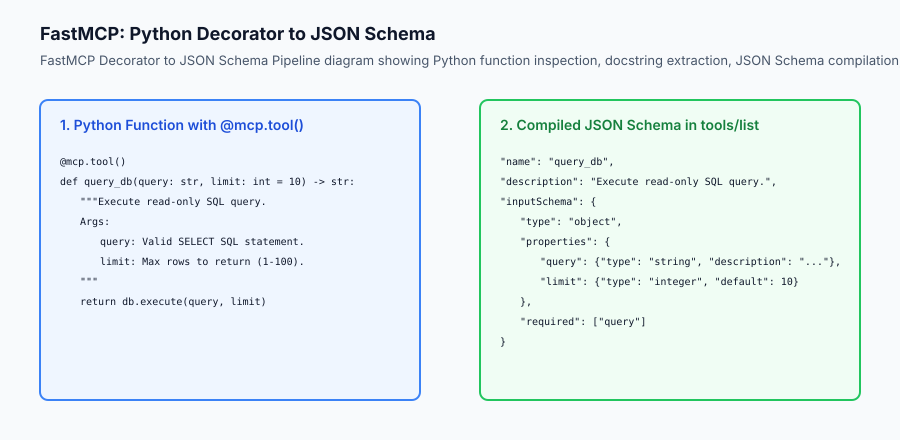

## The idea in plain language

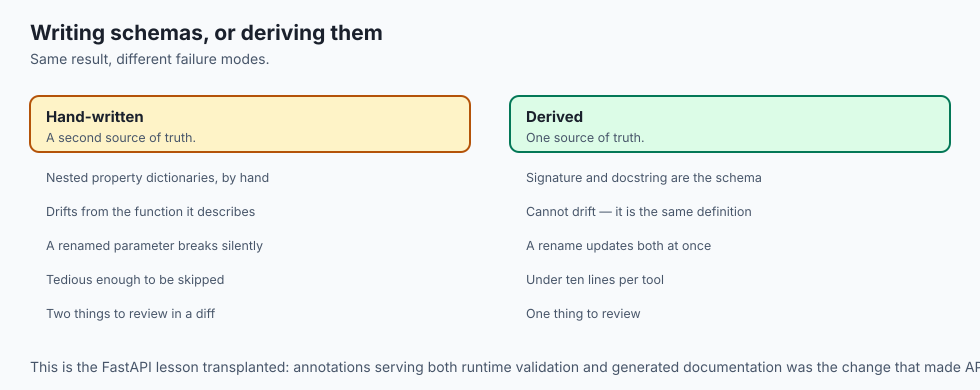

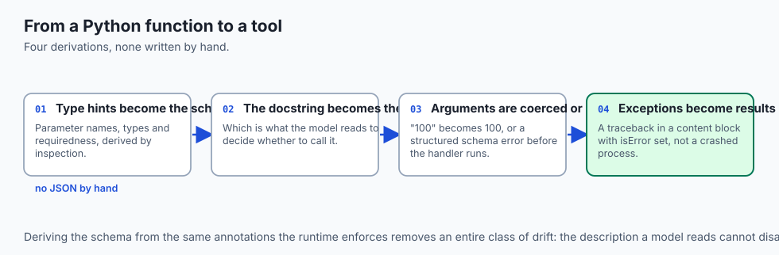

Think of building an MCP server like **creating a custom plugin for a universal game controller**:

- You have a specialized custom robot with two wheels, a gripper arm, and a laser distance sensor.
- Instead of building a bespoke smartphone app with custom Bluetooth code to control the robot, you implement a standard driver interface.
- You decorate your Python functions:
  - `@mcp.tool() def move_forward(meters: float)`
  - `@mcp.tool() def grab_object(pressure_psi: int)`
  - `@mcp.tool() def read_laser_distance() -> float`
- Immediately, any universal AI controller plugs into your robot, reads the available actions, and operates the machine flawlessly.

## Historical background

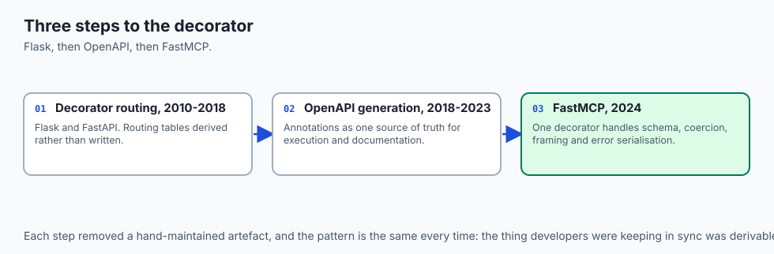

The developer ergonomics of server-side tool frameworks developed through three key phases:

### 1. Flask & FastAPI Decorator Revolution (2010–2018)
Armin Ronacher (Flask) and Tiangolo (FastAPI) revolutionized backend Python development by introducing decorator-based routing (`@app.route`, `@app.get`) paired with Python type hints (Pydantic). Developers no longer wrote manual request routing tables; schemas were automatically derived from code.

### 2. OpenAPI and Swagger Generation (2018–2023)
FastAPI's automated OpenAPI generation demonstrated that type annotations could serve as a single source of truth for both runtime execution and API documentation.

### 3. FastMCP for AI Tools (2024–Present)
When Anthropic released the MCP specification in late 2024, the official Python SDK introduced **FastMCP**. FastMCP brought FastAPI-grade simplicity to Model Context Protocol development: a single `@mcp.tool()` decorator handles JSON Schema reflection, parameter coercion, stdio framing, and error serialization in fewer than 10 lines of code.

## What it is — and what it is not

Let us define the core architecture of an MCP Server:

### What an MCP Server Is:
- A standalone process that registers functions using type annotations and docstrings.
- An engine that automatically generates JSON Schema parameter definitions.
- An execution sandbox that intercepts runtime exceptions, formats structured content blocks, and sets `isError` flags for model self-correction.

### What an MCP Server Is Not:
- A monolithic web server requiring complex Nginx reverse proxies (local stdio servers require zero network setup).
- A stateful database engine (MCP servers act as lightweight gateways to data).
- A prompt engineering script.

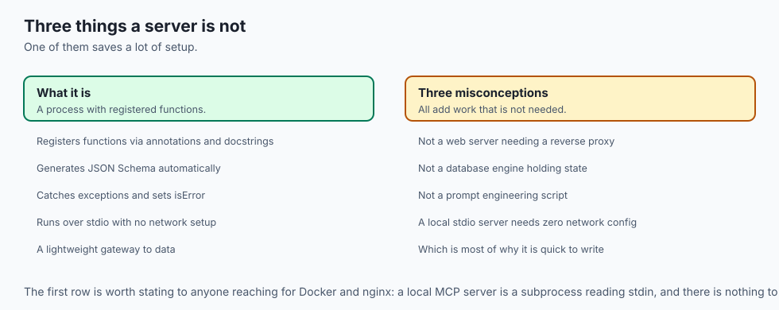

```text
+-------------------------------------------------------------------------------+
|                       FASTMCP TYPE MAPPING TABLE                              |
+-------------------+-----------------------+-----------------------------------+
| Python Type Hint  | JSON Schema Type      | Example Value                     |
+-------------------+-----------------------+-----------------------------------+
| `str`             | `"type": "string"`    | `"SELECT * FROM users"`           |
| `int`             | `"type": "integer"`   | `42`                              |
| `float`           | `"type": "number"`    | `3.14159`                         |
| `bool`            | `"type": "boolean"`   | `true`                            |
| `List[str]`       | `"type": "array"`     | `["item1", "item2"]`              |
| `Optional[int]`   | `"type": "integer"`   | `null` (Field is not required)    |
+-------------------+-----------------------+-----------------------------------+
```

## Why it was created and what problems it solves

Building tools with FastMCP solves four fundamental developer challenges:

### 1. Manual Schema Maintenance Elimination
Manually writing JSON Schema dictionaries with nested properties, types, and descriptions is tedious and error-prone. FastMCP derives 100% of the schema from native Python type hints and docstrings.

### 2. Automated Type Coercion & Validation
If an AI model provides a string `"100"` for an integer parameter `limit: int`, FastMCP coerces the type automatically or emits a structured schema error before executing the handler.

### 3. Graceful Error Recovery vs Process Crashes
Uncaught Python exceptions in standard scripts crash the process. An MCP server catches exceptions, encapsulates the traceback into a `content` text block with `isError: true`, and returns it cleanly to the LLM so the agent can retry.

### 4. Zero-Boilerplate Stdio Execution
Running `mcp.run(transport='stdio')` configures unbuffered stdin/stdout pipes, JSON-RPC 2.0 message dispatch, and capability handshakes with zero custom network code.

## How it works

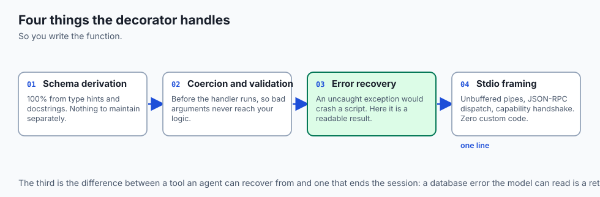

### Deep Dive: Automated JSON Schema Derivation with FastMCP

FastMCP leverages Python type annotations and the `inspect` module to automatically compile function signatures into standard JSON Schema specifications. Consider this comprehensive tool definition:

```python
from mcp.server.fastmcp import FastMCP
from typing import List, Optional
from pydantic import BaseModel, Field

mcp = FastMCP("Infrastructure-Server")

class ServerDeploySpec(BaseModel):
    service_name: str = Field(description="Target microservice identifier (e.g. auth-service)")
    replicas: int = Field(default=3, ge=1, le=20, description="Target replica container count")
    environment: str = Field(default="staging", description="Target deployment stage: staging or prod")

@mcp.tool()
def deploy_microservice(spec: ServerDeploySpec) -> str:
    '''Deploy a containerized microservice to the Kubernetes cluster.
    
    Args:
        spec: Detailed container orchestration parameters.
    '''
    # Kubernetes deployment logic here
    return f"Successfully dispatched deployment for '{spec.service_name}' with {spec.replicas} replicas to {spec.environment}."
```

When an MCP client queries `tools/list`, FastMCP outputs:
```json
{
  "name": "deploy_microservice",
  "description": "Deploy a containerized microservice to the Kubernetes cluster.",
  "inputSchema": {
    "type": "object",
    "properties": {
      "spec": {
        "type": "object",
        "properties": {
          "service_name": {"type": "string", "description": "Target microservice identifier (e.g. auth-service)"},
          "replicas": {"type": "integer", "minimum": 1, "maximum": 20, "default": 3, "description": "Target replica container count"},
          "environment": {"type": "string", "default": "staging", "description": "Target deployment stage: staging or prod"}
        },
        "required": ["service_name"]
      }
    },
    "required": ["spec"]
  }
}
```

### Stdio Buffering and Non-Blocking Event Loops

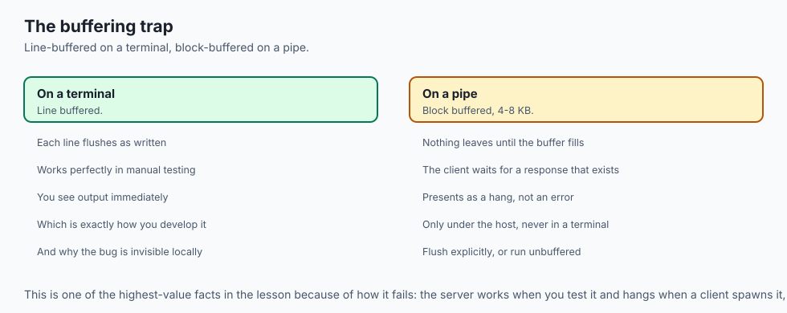

A common failure mode in custom MCP servers is standard output buffer deadlocks. In Python, `print()` and `sys.stdout.write()` are line-buffered when attached to a terminal, but block-buffered (4KB-8KB) when attached to a pipe. If your server does not explicitly flush stdout after writing a JSON frame, the host client will hang waiting for an EOF.

Always ensure non-blocking stream flushing:
```python
import sys
import json

def emit_json_frame(payload: dict):
    line = json.dumps(payload) + "\n"
    sys.stdout.write(line)
    sys.stdout.flush() # CRITICAL: Force pipe flush immediately
```


Let us inspect the complete lifecycle of a FastMCP tool execution:

```text
[AI Host Client: Claude Desktop / Agent]
                  │
                  ▼  1. JSON-RPC Request: tools/call {"name": "calculate_bmi"}
          [MCP Stdio Server]
                  │
                  ▼  2. Inspect Registered Tool Registry
         [Pydantic Type Validation]
                  │
        ┌─────────┴─────────┐
        ▼                   ▼
 [Valid Parameters]   [Validation Error]
        │                   │
        ▼                   ▼
 [Execute Handler]   [Emit isError: true]
        │                   │
        ▼                   │
 [Success Result]           │
        │                   │
        └─────────┬─────────┘
                  │
                  ▼  3. JSON-RPC Response: {"result": {"content": [...], "isError": ...}}
[AI Host Client Receives Output]
```

### 1. FastMCP Server Code Example
```python
from mcp.server.fastmcp import FastMCP

# Initialize FastMCP Server
mcp = FastMCP("Database-Tools")

@mcp.tool()
def search_customer(email: str, active_only: bool = True) -> str:
    '''Search for customer records by email address.
    
    Args:
        email: The customer's primary contact email.
        active_only: Whether to filter out suspended accounts.
    '''
    # Tool execution logic
    return f"Customer record found for {email} (Status: Active)"

if __name__ == "__main__":
    mcp.run(transport="stdio")
```

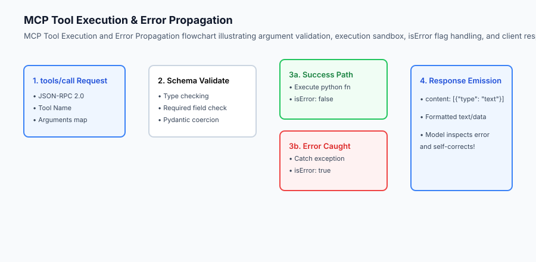

### 2. Error Propagation Contract
When a database query fails (e.g. `Table not found`), returning `isError: true` allows the agent to inspect the schema and fix its query:
```json
{
  "jsonrpc": "2.0",
  "id": 2,
  "result": {
    "content": [
      {
        "type": "text",
        "text": "sqlite3.OperationalError: no such table: user_accounts"
      }
    ],
    "isError": true
  }
}
```

## An everyday analogy

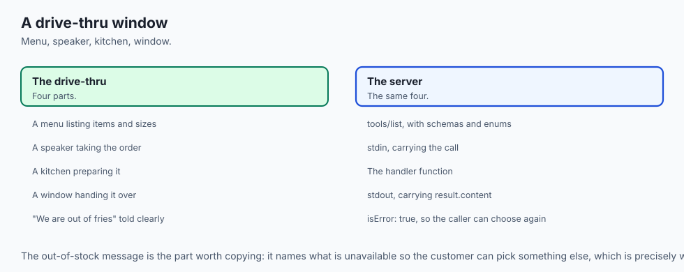

Think of building an MCP server like **setting up a drive-thru window at a restaurant**:

- The Drive-Thru Menu (`tools/list`): Clearly lists each item (Burger, Fries, Drink), the available sizes (`small`, `large`), and the price.
- The Order Speaker (`stdin`): The customer (AI Model) orders: *"I want 1 Cheeseburger with no onions"*.
- The Kitchen (`Handler Function`): Prepares the meal according to the order specification.
- The Delivery Window (`stdout`): Hands the packaged meal (`result.content`) to the driver. If the kitchen is out of fries, they communicate the issue clearly (`isError: true`) so the customer can pick an alternative.

## Examples in practice

### Dynamic Return Types and Multimodal Content Blocks

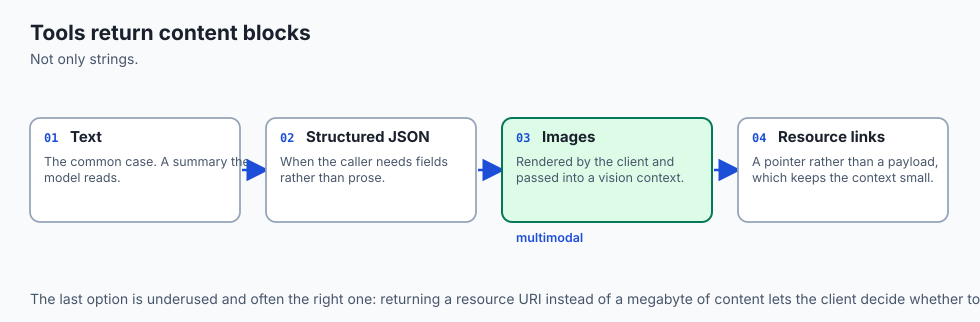

MCP tools are not restricted to returning plain text strings. The Model Context Protocol specification allows tools to return rich arrays of structured **Content Blocks**, including text, JSON objects, images, and embedded resource links.

```python
from mcp.server.fastmcp import FastMCP
import io
import base64

mcp = FastMCP("Data-Visualization-Server")

@mcp.tool()
def generate_metric_chart(title: str, x_values: list, y_values: list) -> list:
    '''Generate a PNG chart visualization of numerical telemetry and return as image content block.
    
    Args:
        title: Chart heading title string.
        x_values: List of horizontal axis labels.
        y_values: List of numerical metric points.
    '''
    # In a full setup, render via matplotlib
    # For demonstration, generate a standard 1x1 transparent PNG base64 block
    fake_png_base64 = "iVBORw0KGgoAAAANSUhEUgAAAAEAAAABCAYAAAAfFcSJAAAADUlEQVR42mNk+M9QDwADhgGAWjR9awAAAABJRU5ErkJggg=="
    
    return [
        {
            "type": "text",
            "text": f"Generated chart '{title}' containing {len(x_values)} data points."
        },
        {
            "type": "image",
            "data": fake_png_base64,
            "mimeType": "image/png"
        }
    ]
```

When an AI model invokes `generate_metric_chart`, the client renders both the text summary and the visual graphic directly in the user interface, enabling seamless multimodal reasoning.


Let us inspect a pure-Python implementation of a lightweight FastMCP-style Server Builder with decorator registration, docstring inspection, and JSON-RPC dispatch:

```python
import inspect
import json
from typing import Dict, Any, Callable, get_type_hints

class MiniFastMCP:
    def __init__(self, name: str):
        self.name = name
        self.tools: Dict[str, Dict[str, Any]] = {}
        
    def tool(self, name: str = None, description: str = None):
        def decorator(fn: Callable):
            tool_name = name or fn.__name__
            tool_desc = description or (inspect.getdoc(fn) or "No description provided.")
            
            # Inspect parameter types
            sig = inspect.signature(fn)
            type_hints = get_type_hints(fn)
            
            properties = {}
            required = []
            
            for param_name, param in sig.parameters.items():
                p_type = type_hints.get(param_name, str)
                json_type = "string"
                if p_type == int:
                    json_type = "integer"
                elif p_type == float:
                    json_type = "number"
                elif p_type == bool:
                    json_type = "boolean"
                elif p_type == list:
                    json_type = "array"
                    
                properties[param_name] = {"type": json_type}
                if param.default == inspect.Parameter.empty:
                    required.append(param_name)
                    
            input_schema = {
                "type": "object",
                "properties": properties,
                "required": required
            }
            
            self.tools[tool_name] = {
                "name": tool_name,
                "description": tool_desc,
                "inputSchema": input_schema,
                "handler": fn
            }
            return fn
        return decorator
        
    def execute_tool(self, tool_name: str, arguments: Dict[str, Any]) -> Dict[str, Any]:
        if tool_name not in self.tools:
            return {
                "content": [{"type": "text", "text": f"Tool '{tool_name}' not found."}],
                "isError": True
            }
            
        tool = self.tools[tool_name]
        fn = tool["handler"]
        
        try:
            res = fn(**arguments)
            return {
                "content": [{"type": "text", "text": str(res)}],
                "isError": False
            }
        except Exception as e:
            return {
                "content": [{"type": "text", "text": f"Error executing {tool_name}: {str(e)}"}],
                "isError": True
            }
```

## Implications: security, privacy, performance, scalability, and cost

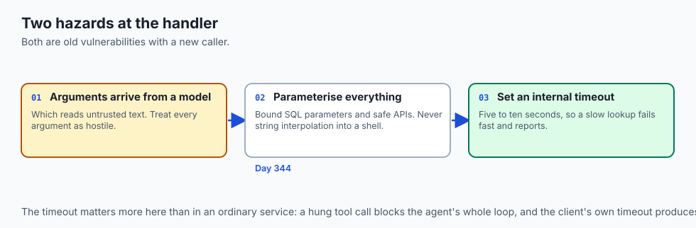

### Advanced Tool Decorator Patterns: Middleware and Telemetry Hooks

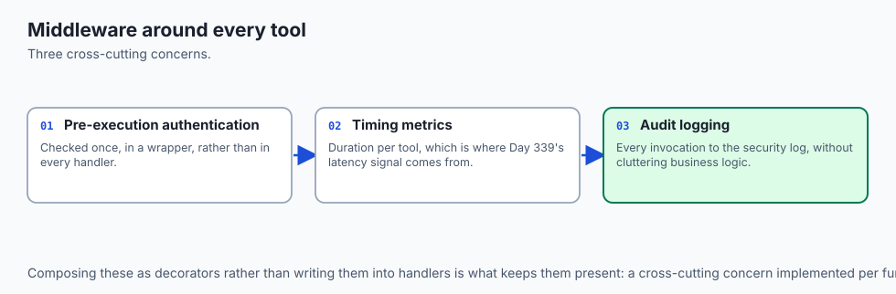

In enterprise-grade MCP servers, production tools require pre-execution authentication checks, execution timing metrics, and automatic audit logging. FastMCP supports wrapping tool handler functions with composable decorators:

```python
import functools
import time
import sys

def instrument_tool(func):
    '''Decorator that logs execution latency and argument parameters to stderr.'''
    @functools.wraps(func)
    def wrapper(*args, **kwargs):
        start_time = time.perf_counter()
        sys.stderr.write(f"[AUDIT] Invoking tool '{func.__name__}' with kwargs: {kwargs}\n")
        sys.stderr.flush()
        try:
            result = func(*args, **kwargs)
            elapsed = (time.perf_counter() - start_time) * 1000.0
            sys.stderr.write(f"[AUDIT] Tool '{func.__name__}' completed in {elapsed:.2f}ms\n")
            sys.stderr.flush()
            return result
        except Exception as e:
            elapsed = (time.perf_counter() - start_time) * 1000.0
            sys.stderr.write(f"[AUDIT ERROR] Tool '{func.__name__}' failed after {elapsed:.2f}ms: {e}\n")
            sys.stderr.flush()
            raise e
    return wrapper

@mcp.tool()
@instrument_tool
def query_financial_metrics(fiscal_year: int, metric_name: str) -> dict:
    '''Retrieve quarterly financial performance indicators from the data warehouse.'''
    # High-precision database query logic
    return {"year": fiscal_year, "metric": metric_name, "value": "$4.2M"}
```

This pattern ensures that every model invocation is systematically logged to the corporate SIEM (Security Information and Event Management) system without cluttering individual business logic functions.


### 1. Parameter Injection & Sanitization
Never pass raw string arguments from an MCP tool call directly into OS shell commands (`os.system`) or unparameterized SQL queries (`f"SELECT * FROM table_name"`). Always use parameterized SQL bindings (`cursor.execute(sql, (arg1,))`) and safe APIs to prevent SQL injection and shell escape attacks.

### 2. Execution Timeouts
If an MCP tool performs a heavy network lookup or long database query, the AI client may time out. Set internal socket timeouts (e.g. 5–10 seconds) within tool handlers to ensure fast failure and error reporting.

## Alternatives: free, open source, and commercial

| Tool Authoring Framework | Language | Abstraction Level | Best Suited For |
| :--- | :--- | :--- | :--- |
| **FastMCP (Official SDK)** | Python | High (Decorators + Type Hints) | Rapid server development |
| **TypeScript MCP SDK** | TypeScript | High (Zod Schema Builders) | Node.js / Web backend tools |
| **Low-Level JSON-RPC** | Any Language | Low (Raw JSON parsing) | Embedded C/Rust microservices |
| **OpenAPI Auto-Wrapper**| Python / Node | Automated (Wraps REST OpenAPI)| Bridging existing REST services |

## Comparison with related concepts

```text
+-----------------------+-----------------------+-----------------------+
| Dimension             | Raw Python Function   | FastMCP Tool Server   |
+-----------------------+-----------------------+-----------------------+
| Client Compatibility  | Python only           | Any MCP Client / Lang |
| Schema Generation     | Manual dictionary     | Automated Reflection  |
| Error Handling        | Unhandled exception   | Structured isError    |
| Transport             | In-memory function    | Stdio / SSE JSON-RPC  |
+-----------------------+-----------------------+-----------------------+
```

## When to use it — and when not to

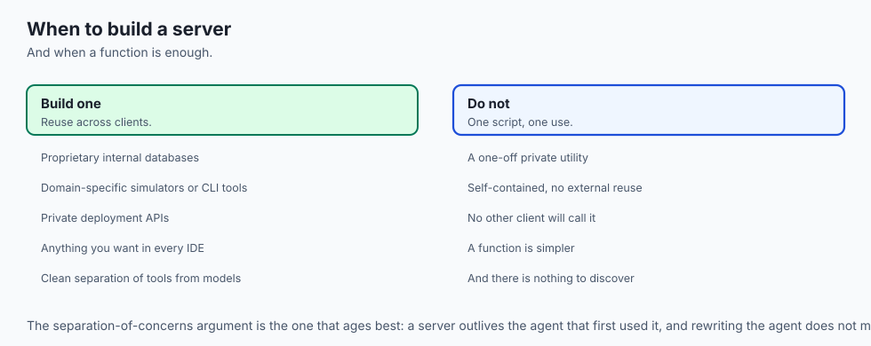

### Choose Building an MCP Server when:
- You have custom business logic, proprietary internal databases, or local development utilities you want AI agents to use across any IDE or client.
- You want clean separation of concerns between your backend tools and front-end AI models.

### Do NOT build an MCP Server when:
- The function is a one-off private utility inside a single self-contained script with no external reuse.

## The AI connection

- **Type hints become the tool schema**, which means the model's only documentation is
  derived from the same source as the runtime behaviour and cannot drift from it.

- **An exception is a result here.** A traceback returned as content with `isError: true`
  is what lets an agent fix its own query instead of the process dying.

- **Docstrings are prompt engineering.** The description a model reads to choose a tool
  is the docstring, which makes writing them a correctness activity.

- **Custom servers are how proprietary systems reach AI clients** without any client
  ever knowing your internal API exists.

- **Every argument arrives from a model**, so parameterised SQL and safe APIs are the
  baseline rather than a hardening step — Day 344's boundary, at the handler.

## Knowledge check

1. **How does FastMCP generate JSON Schemas?** By reflecting on function type annotations and docstring parameters.
2. **What does setting `isError: true` achieve?** It informs the LLM that the tool failed and provides the error text so the model can retry with corrected parameters.
3. **What transport is standard for local child process execution?** `stdio`.

## Hands-on exercise

In this lab, you will implement a **Production MCP Server Builder with Type Inspection and Error Handling in Python**. Your implementation will:

1. Implement a `@mcp.tool()` decorator that automatically extracts JSON Schemas from Python type annotations.
2. Build an execution dispatcher validating required arguments and catching runtime exceptions.
3. Expose tools for mathematical calculations, string manipulations, and dictionary lookups.
4. Verify schema generation and execution compliance across automated test suites.

### Expected output

```text
============================= test session starts ==============================
collected 5 items

tests/test_custom_mcp_server.py .....                                    [100%]

============================== 5 passed in 0.02s ===============================
[FASTMCP BUILDER] Registered tool: 'calculate_discount' (Schema properties: 2)
[FASTMCP BUILDER] Registered tool: 'lookup_user' (Schema properties: 1)
[EXECUTION SUCCESS] calculate_discount(price=100.0, discount_pct=0.15) -> $85.0
[EXECUTION ERROR CAUGHT] lookup_user(user_id=999) -> isError: True ("User not found")
```

### Validate your work

Run the pytest test suite:

```bash
pytest tests/run_tests.sh
```

### Troubleshooting

1. **Required fields mismatch:** Verify parameters without default values are added to the `"required"` array.
2. **Exception crashes server:** Wrap the handler invocation in a `try...except` block returning `isError: True`.

### Common mistakes

- Failing to map Python `int` to JSON Schema `"integer"` and `float` to `"number"`.
- Omitting docstrings, resulting in blank tool descriptions.

## Practice assignment

Add support for `Pydantic` model arguments, converting nested Pydantic classes into complex JSON Schema object properties.

## Extension challenge

Implement an asynchronous `@mcp.tool(async_execution=True)` decorator that runs long-running blocking tasks in a background thread pool without stalling the main stdio event loop.