## Why this matters

While **Tools** allow AI models to take active, state-mutating actions (such as executing SQL statements or creating GitHub pull requests), modern AI applications require more than just functions. Complex workflows demand direct access to rich contextual data (such as database schemas, application logs, documentation trees, and live memory notes) as well as standardized, parameterized interactive prompts (such as `/code-review`, `/explain-bug`, or `/audit-security`).

The Model Context Protocol establishes two non-tool primitives to handle these needs cleanly:

1. **Resources:** Read-only, URI-addressable data sources (e.g. `postgres://analytics/schema` or `file:///workspace/config.json`) with MIME types and real-time update push notifications.
2. **Prompts:** Parameterized, user-controlled conversational templates that define reusable prompt engineering workflows.

Mastering Resources and Prompts ensures your MCP servers provide complete, ergonomic context ecosystems for both AI models and human users.

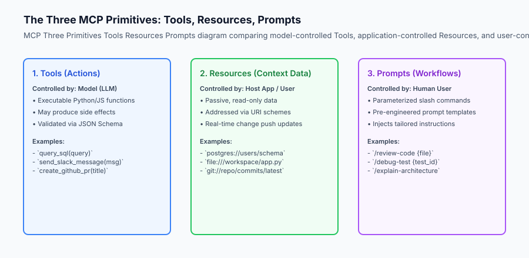

## The idea in plain language

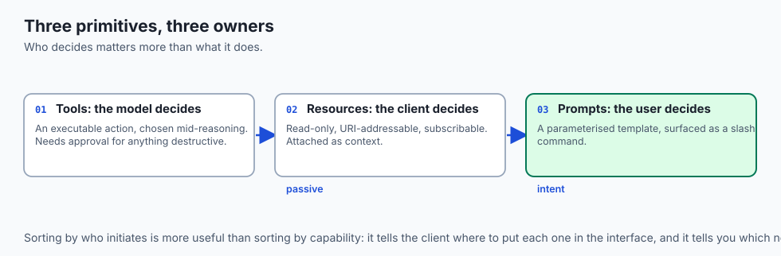

Think of the three MCP primitives like **the resources in a modern university library**:

- **Tools (The Laboratory Equipment):** Centrifuges, 3D printers, and chemical spectrometers. The researcher (LLM) chooses when to turn them on to produce a new measurement.
- **Resources (The Books & Reference Manuscripts):** Encyclopedias, historical census logs, and scientific journals sitting on numbered shelves (`URI: shelf://science/journal-42`). The student pulls them off the shelf to read the facts passively.
- **Prompts (The Standardized Research Assignment Sheets):** Structured assignment prompts prepared by the professor (e.g. *"Analyze the economic causes of the 1929 market crash using Census Book A and Trade Record B"*). The human student clicks the template to start their study session.

## Historical background

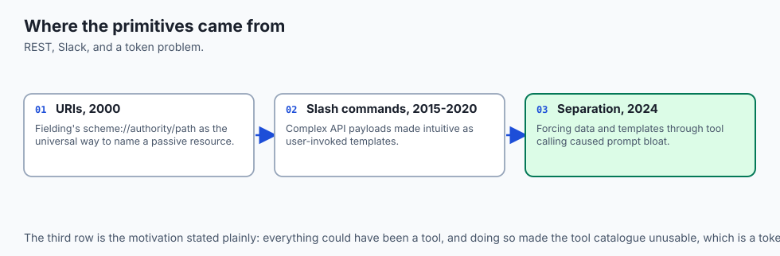

The formalization of Resources and Prompts originated from distinct software paradigms:

### 1. REST and URI Schemes (Roy Fielding, 2000)
Fielding's REST architecture established Uniform Resource Identifiers (URIs) as the universal standard for locating passive web resources (`scheme://authority/path`). MCP adopted URIs directly for resource discovery.

### 2. Slash Commands in Messaging Apps (Slack & Discord, 2015–2020)
Slack popularized `/remind` and `/deploy` slash commands, turning complex API payloads into intuitive user-driven templates.

### 3. MCP Primitive Unification (Anthropic, 2024)
Anthropic recognized that forcing all data and templates through function calling (Tools) resulted in prompt bloat and token inefficiency. Standardizing **Resources** (`resources/list`, `resources/read`) and **Prompts** (`prompts/list`, `prompts/get`) created a clean, three-pillar architecture.

## What it is — and what it is not

Let us define the operational boundaries of Resources and Prompts:

### What Resources and Prompts Are:
- **Resources:** Passive read-only data streams addressed by URIs with explicit MIME types (`text/markdown`, `application/json`).
- **Prompts:** Parameterized prompt templates that accept arguments and return multi-role message arrays (`system`, `user`, `assistant`).
- A clean separation between model decisions (Tools), passive background data (Resources), and user intentions (Prompts).

### What Resources and Prompts Are Not:
- Resources are not executable functions (they cannot take dynamic arguments or cause database writes).
- Prompts are not hardcoded system prompts locked inside client binaries (they are dynamically discovered from servers).

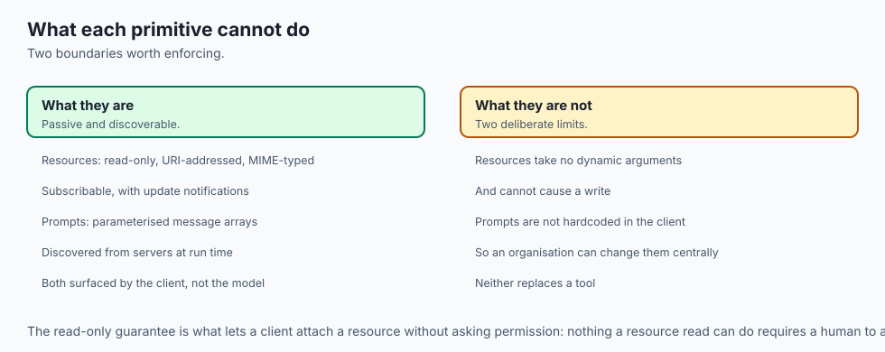

```text
+-------------------------------------------------------------------------------+
|                       MCP PRIMITIVES COMPARISON MATRIX                        |
+-------------------+-----------------------+-------------------+---------------+
| Dimension         | Tools                 | Resources         | Prompts       |
+-------------------+-----------------------+-------------------+---------------+
| Initiator         | AI Model (Autonomous) | Host / User UI    | Human User    |
| Addressing        | Function Name (string)| URI Scheme String | Template Name |
| Mutability        | Can have side effects | Read-only passive | Static / Dyn  |
| Output Format     | Result Content Blocks | Resource Contents | Message Array |
| Push Notifications| No                    | Yes (live sync)   | No            |
+-------------------+-----------------------+-------------------+---------------+
```

## Why it was created and what problems it solves

Separating Resources and Prompts from Tools solves three critical problems:

### 1. Context Window Hygiene
If an agent needs access to 50 server log files, exposing 50 separate tool functions (`read_log_1`, `read_log_2`) pollutes the tool schema catalog. Exposing a single resource template `log://service_name` keeps tool selection razor-sharp.

### 2. Real-Time Data Synchronization
When a database table or local file is updated, an MCP server sends `notifications/resources/updated`. The client re-fetches only the modified data without querying every tool.

### 3. Reusable Enterprise Prompt Standards
Companies can distribute standardized prompt templates (e.g. compliance auditing, style guides) from a central MCP server rather than manually copying prompt text across developer teams.

## How it works

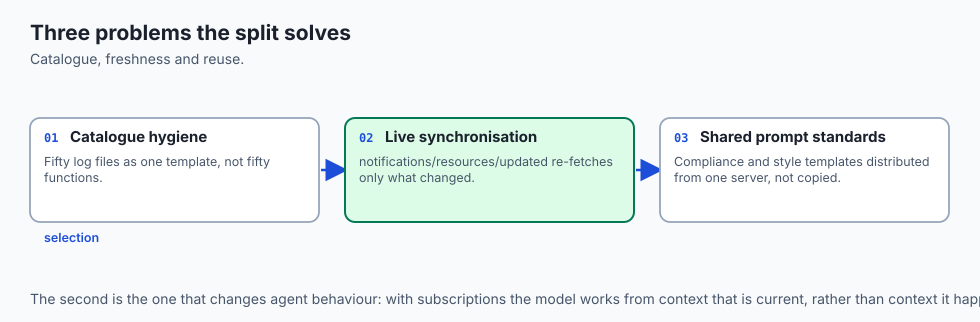

### Deep Dive: Binary Resource Streaming and MIME Type Negotiation

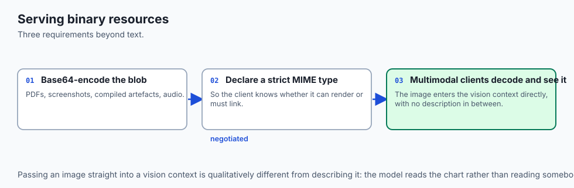

MCP Resources support both human-readable text (source code, markdown, logs) and raw binary data (PDF reports, PNG screenshots, compiled binaries, audio recordings). When serving binary resources, the server returns base64-encoded blobs with strict MIME type headers:

```json
{
  "jsonrpc": "2.0",
  "id": 4,
  "result": {
    "contents": [
      {
        "uri": "screenshot://display-0/latest",
        "mimeType": "image/png",
        "blob": "iVBORw0KGgoAAAANSUhEUgAAAAEAAAABCAYAAAAfFcSJAAAADUlEQVR42mNk+M9QDwADhgGAWjR9awAAAABJRU5ErkJggg=="
      }
    ]
  }
}
```

Clients that support multimodal foundation models (like Claude 3.5 Sonnet or GPT-4o) decode the base64 blob and pass the visual image directly into the vision context window.

### Dynamic Resource URI Templates with Wildcards

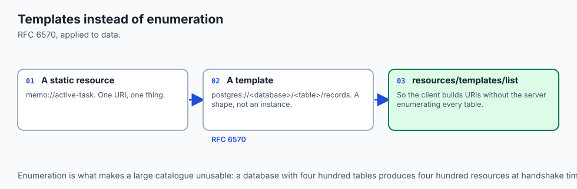

In addition to static resources (`memo://active-task`), MCP servers can register **Resource Templates** using RFC 6570 URI template syntax (`postgres://<database>/<table>/records` or `jira://issues/issue_key`).

When a client queries `resources/templates/list`:
```json
{
  "jsonrpc": "2.0",
  "id": 5,
  "result": {
    "resourceTemplates": [
      {
        "uriTemplate": "postgres://database/schema/table/schema",
        "name": "Database Table Schema Inspector",
        "mimeType": "application/json",
        "description": "Inspect dynamic column definitions and foreign key constraints for any relational table."
      }
    ]
  }
}
```
This enables the client to dynamically construct URIs without needing the server to enumerate every individual table in the system catalog during initial handshake.


Let us inspect the Resource subscription lifecycle and Prompt template compilation:

```text
[Client requests resources/list]
              │
              ▼
[Server returns: {"uri": "memo://daily-goals", "mimeType": "text/markdown"}]
              │
              ▼
[Client executes resources/subscribe: {"uri": "memo://daily-goals"}]
              │
              ▼
    ... file modified on disk ...
              │
              ▼
[Server emits notification: "notifications/resources/updated", uri: "memo://daily-goals"]
              │
              ▼
[Client re-fetches resources/read and updates active context memory]
```

### 1. FastMCP Resource Registration
In FastMCP Python SDK, registering resources is straightforward:
```python
from mcp.server.fastmcp import FastMCP

mcp = FastMCP("Knowledge-Base")

@mcp.resource("memo://current-task")
def get_current_task() -> str:
    '''Return the active in-memory task status.'''
    return "Refactoring database migration scripts for PostgreSQL 17."
```

### 2. FastMCP Prompt Registration
```python
@mcp.prompt()
def review_code(code_snippet: str, strict_mode: bool = True) -> list:
    '''Generate a structured code review prompt template.'''
    instructions = "Focus on security vulnerabilities and OWASP Top 10." if strict_mode else "Focus on readability."
    return [
        {"role": "user", "content": {"type": "text", "text": f"Review this code.
Guidelines: {instructions}

```
`{code_snippet}`
```"}}
    ]
```


## An everyday analogy

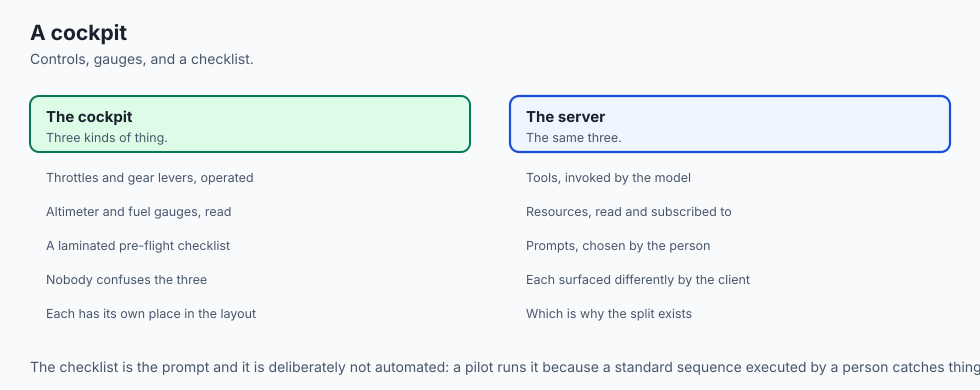

Think of Resources and Prompts like **a pilot's cockpit setup**:

- **The Controls & Throttles (Tools):** Flaps, landing gear, and engine thrust levers. The pilot operates them to change flight state.
- **The Instrument Gauges & Altimeter (Resources):** Passive screens displaying current altitude, fuel pressure, and wind speed. They update in real-time.
- **The Pre-Flight Checklist (Prompts):** A laminated template sheet with standardized steps to follow before takeoff.

## Examples in practice

### Complete Multi-Turn Prompt Engineering Workflows

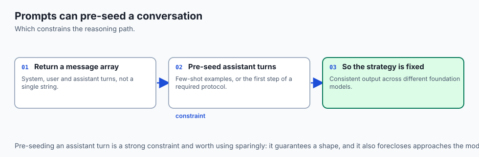

Prompt templates in MCP can orchestrate complex multi-turn dialog structures by pre-populating both `user` and `assistant` messages in the returned array. This allows servers to demonstrate few-shot examples or guide the model through rigid chain-of-thought protocols:

```python
@mcp.prompt()
def generate_unit_tests(function_code: str, test_framework: str = "pytest") -> list:
    '''Construct a guided chain-of-thought prompt for unit test generation with few-shot demonstration.'''
    return [
        {
            "role": "user",
            "content": {
                "type": "text",
                "text": "Write exhaustive unit tests covering edge cases, happy paths, and error conditions."
            }
        },
        {
            "role": "assistant",
            "content": {
                "type": "text",
                "text": "I will analyze the function's boundary conditions, parameter types, and potential exceptions before writing parameterized tests."
            }
        },
        {
            "role": "user",
            "content": {
                "type": "text",
                "text": f"Target Framework: {test_framework}\nFunction Source:\n```python\n{function_code}\n```"
            }
        }
    ]
```

By structuring prompts with pre-seeded assistant turns, the server constrains the model's reasoning strategy, guaranteeing consistent code quality across diverse foundation models.


Let us build a complete Python **MCP Resource and Prompt Engine** supporting URI routing, dynamic resource reading, and parameterized prompt synthesis:

```python
import json
from typing import Dict, Any, List, Optional, Callable

class MCPResourcePromptEngine:
    def __init__(self, server_name: str = "doc-server"):
        self.server_name = server_name
        self.resources: Dict[str, Dict[str, Any]] = {}
        self.prompts: Dict[str, Dict[str, Any]] = {}
        self.subscribers: Dict[str, List[str]] = {} # uri -> list of client_ids
        
    def register_resource(self, uri: str, name: str, mime_type: str, reader_fn: Callable[[], str]):
        self.resources[uri] = {
            "uri": uri,
            "name": name,
            "mimeType": mime_type,
            "reader": reader_fn
        }
        
    def register_prompt(self, name: str, description: str, arguments: List[Dict[str, Any]], template_fn: Callable[..., List[Dict[str, Any]]]):
        self.prompts[name] = {
            "name": name,
            "description": description,
            "arguments": arguments,
            "template": template_fn
        }
        
    def handle_request(self, method: str, params: Optional[Dict[str, Any]] = None) -> Dict[str, Any]:
        params = params or {}
        
        # 1. List Resources
        if method == "resources/list":
            res_list = [
                {"uri": r["uri"], "name": r["name"], "mimeType": r["mimeType"]}
                for r in self.resources.values()
            ]
            return {"resources": res_list}
            
        # 2. Read Resource
        elif method == "resources/read":
            uri = params.get("uri")
            if uri not in self.resources:
                raise ValueError(f"Resource URI not found: {uri}")
            r = self.resources[uri]
            text_content = r["reader"]()
            return {
                "contents": [
                    {"uri": uri, "mimeType": r["mimeType"], "text": text_content}
                ]
            }
            
        # 3. List Prompts
        elif method == "prompts/list":
            p_list = [
                {"name": p["name"], "description": p["description"], "arguments": p["arguments"]}
                for p in self.prompts.values()
            ]
            return {"prompts": p_list}
            
        # 4. Get Prompt
        elif method == "prompts/get":
            name = params.get("name")
            if name not in self.prompts:
                raise ValueError(f"Prompt not found: {name}")
            p = self.prompts[name]
            args = params.get("arguments", {})
            messages = p["template"](**args)
            return {
                "description": p["description"],
                "messages": messages
            }
            
        raise ValueError(f"Unsupported method: {method}")
```

## Implications: security, privacy, performance, scalability, and cost

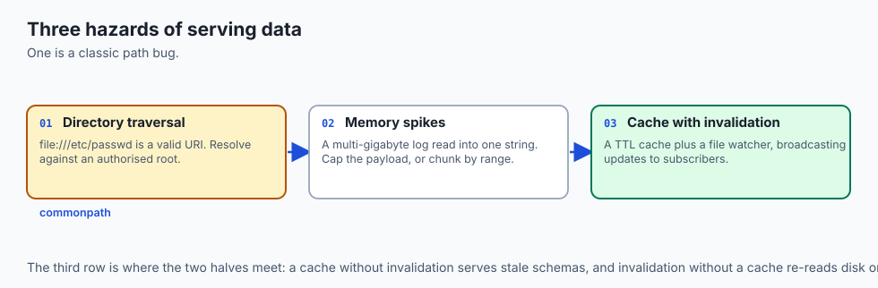

### High-Performance In-Memory Resource Caching

When exposing frequently requested resources (such as active database table schemas or git commit trees), reading the underlying data source from disk or network on every `resources/read` request introduces unnecessary latency.

Implement an asynchronous Time-To-Live (TTL) cache wrapper:

```python
import time
from typing import Dict, Any, Tuple

class CachedResourceStore:
    def __init__(self, ttl_seconds: float = 30.0):
        self.ttl = ttl_seconds
        self._cache: Dict[str, Tuple[float, str]] = {} # uri -> (timestamp, content)
        
    def get_resource(self, uri: str, fetcher_fn) -> str:
        now = time.time()
        if uri in self._cache:
            cached_time, content = self._cache[uri]
            if now - cached_time < self.ttl:
                return content
                
        fresh_content = fetcher_fn()
        self._cache[uri] = (now, fresh_content)
        return fresh_content
        
    def invalidate(self, uri: str):
        if uri in self._cache:
            del self._cache[uri]
```

By pairing TTL caching with file watcher notifications (`watchdog`), the server immediately invalidates cached entries when files change and broadcasts `notifications/resources/updated` to all subscribed clients, achieving sub-millisecond read responses while guaranteeing fresh data.


### 1. Directory Traversal via Resource URIs
When exposing files via `file:///` resource URIs, never pass raw user-controlled paths directly to `open()`. A malicious client could request `file:///etc/passwd` or `file:///home/user/.ssh/id_rsa`. Validate that all requested paths resolve within an authorized root directory using `os.path.commonpath`.

### 2. Large Resource Memory Spikes
Reading multi-gigabyte log files into memory as a single string inside `resources/read` can cause Out-Of-Memory crashes. Restrict resource payload sizes (e.g. max 1MB) or implement byte-range chunking.

## Alternatives: free, open source, and commercial

| Concept | Addressing Scheme | Real-Time Sync | Best Suited For |
| :--- | :--- | :--- | :--- |
| **MCP Resources** | Standard URI (`scheme://`) | Yes (`resources/updated`)| Passive data streaming & logs |
| **RAG Embeddings** | Vector similarity lookup | Periodic re-indexing | Semantic search over large corpuses |
| **MCP Prompts** | Template Name | No | User-facing slash commands |
| **Static System Prompts**| Hardcoded in code | No | Fixed agent personas |

## Comparison with related concepts

```text
+-----------------------+-----------------------+-----------------------+
| Dimension             | MCP Tool              | MCP Resource          |
+-----------------------+-----------------------+-----------------------+
| Invocation Model      | Model-triggered action| Client-triggered read |
| Side Effects          | Permitted             | Strictly prohibited   |
| Parameters            | Complex JSON schema   | URI string identifier |
| Real-time Push        | No                    | Supported via Pub/Sub |
+-----------------------+-----------------------+-----------------------+
```

## When to use it — and when not to

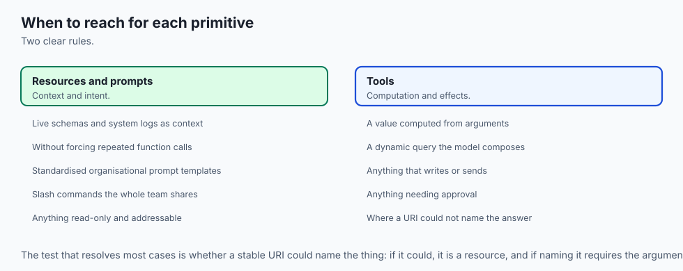

### Practical Comparison: When to Model Data as Resources vs Tools

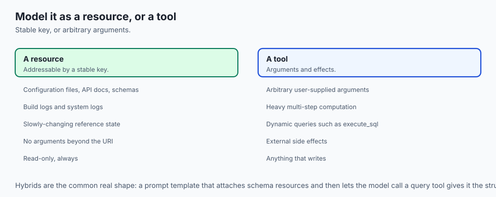

Architecting an MCP server requires deciding whether to expose data via URI-addressable Resources or functional Tools. Consider the following decision framework:

1. **Deterministic, Queryable State (Use Resources):**
   When data represents static or slowly-changing reference state that can be identified by a stable key (such as configuration files, API documentation, database schemas, or build logs), model it as a Resource (`schema://tables/users` or `file:///var/log/build.log`). This keeps the tool registry uncluttered and allows clients to subscribe to updates without calling functions.

2. **Dynamic Computations or State-Mutating Actions (Use Tools):**
   When the operation requires arbitrary user-supplied arguments, involves heavy multi-step computation, generates dynamic database queries (`execute_sql`), or produces external side effects (sending notifications, mutating records), model it as a Tool.

3. **Hybrid Workflow Pipelines:**
   Many advanced workflows combine both primitives: a user invokes a Prompt template (`/analyze-schema`), which passively attaches database table Resources (`db://schema`), allowing the model to inspect table foreign keys before deciding which specialized analytical Tools (`calculate_retention_metrics`) to execute.


### Choose Resources and Prompts when:
- You want to provide live, synchronized context (like database schemas or system logs) without forcing the model to constantly call functions.
- You want to standardize reusable prompt engineering workflows across an organization via slash commands.

### Do NOT use Resources when:
- You need the AI model to dynamically calculate or generate a new value based on complex input arguments (use Tools instead).

## The AI connection

- **Not everything should be a tool.** Fifty log files as fifty functions destroys tool
  selection; one resource template keeps the catalogue sharp.

- **Resources give the model live context without a call.** A schema that updates by
  notification is fresher than one the agent has to remember to re-query.

- **Prompts are the user's intent, not the model's.** Separating them is what makes a
  slash command a shared organisational asset rather than copied text.

- **Binary resources feed vision models directly**, which is how a chart or a screenshot
  reaches a multimodal context window without an intermediate description.

- **A URI is an attack surface.** `file:///etc/passwd` is a valid URI, so path resolution
  against an authorised root is mandatory rather than defensive.

## Knowledge check

1. **What is the difference between a Tool and a Resource in MCP?** Tools are active executable functions called by the model; Resources are read-only data sources addressed by URIs.
2. **What notification method announces a resource update?** `notifications/resources/updated`.
3. **What does the `prompts/get` endpoint return?** A structured array of multi-role messages ready to populate an LLM conversation.

## Hands-on exercise

In this lab, you will implement an **MCP Resources and Prompts Engine in Python**. Your implementation will:

1. Register URI-addressable resources with MIME types.
2. Implement dynamic resource reading and subscription tracking.
3. Build parameterized prompt templates that compile user arguments into structured message arrays.
4. Verify resource reading, prompt synthesis, and error handling across automated pytest tests.

### Expected output

```text
============================= test session starts ==============================
collected 5 items

tests/test_mcp_resources_prompts.py .....                                [100%]

============================== 5 passed in 0.02s ===============================
[MCP RESOURCE ENGINE] Registered resource: 'memo://active-task' (text/markdown)
[MCP PROMPT ENGINE] Registered prompt: 'review_pr' (2 arguments)
[RESOURCE READ] URI 'memo://active-task' -> Contents length: 48 bytes
[PROMPT GET] Synthesized prompt 'review_pr' with 1 user message.
```

### Validate your work

Run the pytest test suite:

```bash
pytest tests/run_tests.sh
```

### Troubleshooting

1. **URI not found error:** Ensure the URI requested in `resources/read` exactly matches the registered URI string.
2. **Missing required argument in prompt:** Check that all non-default arguments in the prompt template function are supplied.

### Common mistakes

- Returning raw strings from `prompts/get` instead of the required `messages: [{"role": "user", "content": {"type": "text", "text": "..."}}]` structure.

## Practice assignment

To deepen your understanding of resource routing and parameter extraction:

1. Construct a dynamic URI parser utilizing regular expressions (`^postgres://(?P<db>[a-zA-Z0-9_]+)/(?P<table>[a-zA-Z0-9_]+)/schema$`).
2. When a matching URI is requested via `resources/read`, extract the named capture groups and pass them into a table schema introspection query.
3. Validate that attempting to read non-existent database tables returns a structured `ResourceNotFoundError` rather than an unhandled server crash.
4. Benchmark the retrieval latency of cached in-memory resources versus dynamic database schema queries across 1,000 requests.


Add a **Dynamic Resource Template Pattern** that matches URIs like `db://tables/table_name` and routes to a single parameterized reader function.

## Extension challenge

Implement a **Resource Change Watcher** using file system event listeners (`watchdog`) that automatically emits `notifications/resources/updated` whenever a monitored directory changes.