## Why this matters

While many developers use standard desktop AI applications (like Claude Desktop or Cursor) as their MCP client, production AI engineering frequently requires building **custom MCP host clients**. When building autonomous backend agents, CLI development assistants, CI/CD automation bots, or domain-specific research pipelines, your Python application itself must act as the MCP client: spawning child server processes, aggregating tool schemas from diverse backends, injecting them into model prompts, and dispatching tool executions across standard I/O pipes.

Building an MCP client gives you complete programmatic control over the execution lifecycle. You decide how many servers to run concurrently, how tool routing tables are maintained, how rate limits and timeout errors are handled, and how observations are fed back into autonomous reasoning loops (like ReAct).

Mastering MCP client development transforms you from a passive consumer of AI tools into an architect capable of building modular, multi-server enterprise agent systems.

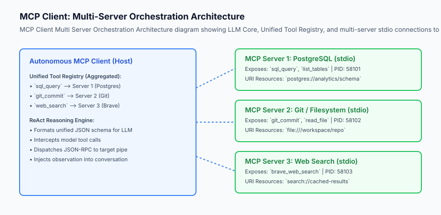

## The idea in plain language

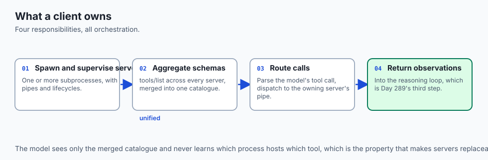

Think of an MCP Client like **the operating system's device manager inside a computer**:

- **The Applications & User (The AI Model & User):** Wants to print a document, read a flash drive, and record microphone audio.
- **The Device Drivers (MCP Servers):** A Canon printer driver, a SanDisk USB driver, and a Blue Yeti microphone driver.
- **The Operating System Core (The MCP Client):**
  1. Detects newly plugged-in hardware (`initialize` + `tools/list`).
  2. Creates a unified device list for applications (`Unified Tool Registry`).
  3. When an app asks to print (`tools/call`), the OS routes the print job to the exact printer driver pipe.
  4. Collects the paper status observation and reports it back.

The AI model doesn't need to know operating system internals; the MCP client orchestrates everything behind the scenes.

## Historical background

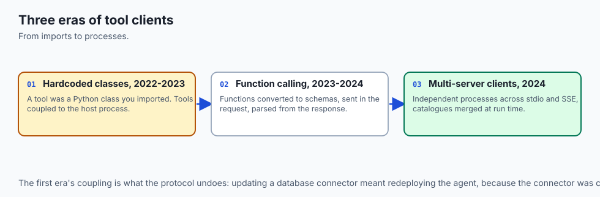

The evolution of agent-tool client architecture developed across three major milestones:

### 1. Hardcoded API Clients (2022–2023)
Early LangChain and AutoGen agents used hardcoded Python tool wrapper classes. If you wanted to add a new tool, you had to write a Python class, instantiate it in memory, and import it into the agent script. This tightly coupled tools to the host process.

### 2. OpenAI Function Calling Clients (2023–2024)
OpenAI introduced client-side function calling schemas. Clients converted functions into JSON schemas, sent them in the `tools` array of the API request, and parsed `tool_calls` in the response.

### 3. Open Multi-Server MCP Clients (2024–Present)
The Model Context Protocol standardized client-server tool aggregation. Modern MCP clients connect to multiple independent server processes across stdio and SSE, dynamically merging their tool definitions into a single runtime toolset.

## What it is — and what it is not

Let us define what an MCP Client is:

### What an MCP Client Is:
- A host controller that spawns and manages one or more MCP server subprocesses.
- A schema aggregator that queries `tools/list` across all connected servers and merges them into a unified catalog.
- A dynamic router that parses LLM tool calls and directs JSON-RPC requests to the appropriate server pipe.

### What an MCP Client Is Not:
- An MCP Server (it consumes tools rather than providing them).
- A standalone language model (it interfaces with foundation models like Claude, GPT-4, or local Ollama instances).

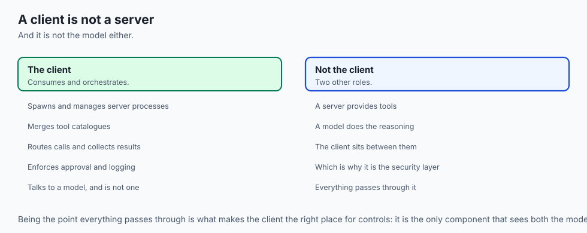

```text
+-------------------------------------------------------------------------------+
|                       MCP CLIENT RESPONSIBILITY MATRIX                        |
+-------------------+-----------------------+-----------------------------------+
| Lifecycle Stage   | Action Required       | Wire Protocol Method              |
+-------------------+-----------------------+-----------------------------------+
| 1. Startup        | Spawn child process   | `subprocess.Popen`                |
| 2. Handshake      | Negotiate version     | `initialize` request              |
| 3. Confirmation   | Acknowledge init      | `notifications/initialized`       |
| 4. Discovery      | Retrieve tool schemas | `tools/list` request              |
| 5. Reasoning      | Pass tools to LLM     | Chat Completion API call          |
| 6. Execution      | Route tool call       | `tools/call` request              |
| 7. Teardown       | Terminate subprocess  | SIGTERM / Pipe close              |
+-------------------+-----------------------+-----------------------------------+
```

## Why it was created and what problems it solves

Building custom MCP clients solves four fundamental architectural problems:

### 1. Decoupled Tool Infrastructure
You can update, patch, or replace your PostgreSQL MCP server without touching your AI agent's reasoning code.

### 2. Multi-Language Tool Aggregation
A Python agent client can seamlessly invoke tools written in TypeScript, Go, or Rust running inside child MCP subprocesses.

### 3. Enterprise Safety & Audit Logging
The client acts as a security firewall between the LLM and the server, logging every payload, inspecting arguments, and enforcing approval gates before dispatch.

### 4. Dynamic Capability Expansion
An agent can dynamically discover new tools at runtime based on user configuration without code recompilation.

## How it works

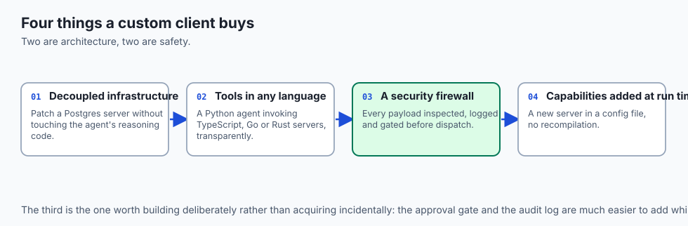

### Deep Dive: Building Asynchronous Multi-Server Connection Pools

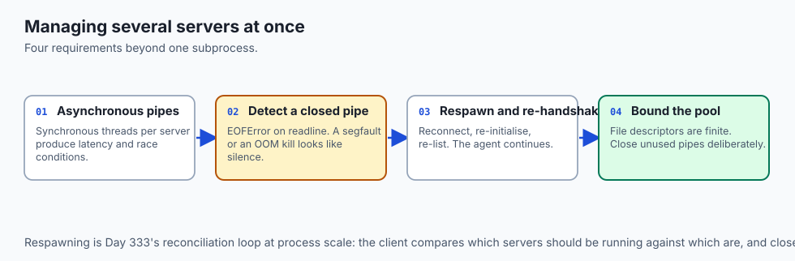

When an autonomous agent connects to 5+ MCP servers simultaneously, managing individual synchronous subprocess threads causes latency bottlenecks and race conditions. Modern production clients implement **Asynchronous Connection Pools** using Python's `asyncio.subprocess` and `asyncio.StreamReader`:

```python
import asyncio
import json
from typing import Dict, Any, List

class AsyncMCPConnection:
    def __init__(self, name: str, command: str, args: List[str]):
        self.name = name
        self.command = command
        self.args = args
        self.process: asyncio.subprocess.Process = None
        self.req_id = 0
        self.lock = asyncio.Lock()
        
    async def start(self):
        self.process = await asyncio.create_subprocess_exec(
            self.command, *self.args,
            stdin=asyncio.subprocess.PIPE,
            stdout=asyncio.subprocess.PIPE,
            stderr=asyncio.subprocess.PIPE
        )
        # Perform async handshake
        await self.send_request("initialize", {"protocolVersion": "2024-11-05"})
        
    async def send_request(self, method: str, params: Dict[str, Any] = None) -> Dict[str, Any]:
        async with self.lock:
            self.req_id += 1
            payload = {"jsonrpc": "2.0", "id": self.req_id, "method": method}
            if params is not None:
                payload["params"] = params
            data = (json.dumps(payload) + "\n").encode("utf-8")
            self.process.stdin.write(data)
            await self.process.stdin.drain()
            
            line = await self.process.stdout.readline()
            return json.loads(line.decode("utf-8").strip())

class ParallelMCPClientPool:
    def __init__(self):
        self.connections: Dict[str, AsyncMCPConnection] = {}
        
    async def call_tools_in_parallel(self, tool_invocations: List[dict]) -> List[dict]:
        # Execute tool calls across distinct servers simultaneously using asyncio.gather
        tasks = []
        for inv in tool_invocations:
            conn = self.connections[inv["server_name"]]
            tasks.append(conn.send_request("tools/call", {"name": inv["tool_name"], "arguments": inv["arguments"]}))
        return await asyncio.gather(*tasks)
```

### Handling Server Crashes and Subprocess Respawning

If an external MCP server crashes (due to segmentation fault, OOM killer, or unhandled exception), a resilient client must:

1. Detect closed pipes (`EOFError` on `readline()`).
2. Log the crash event and captured `stderr` buffer.
3. Automatically respawn the subprocess up to `max_retries` (e.g. 3 attempts with exponential backoff).
4. Inform the reasoning loop with a descriptive observation: `"System Notification: Server 'git-mcp' was restarted after a crash. Retrying tool call."`.


Let us trace the complete execution flow of an MCP Client running an autonomous ReAct loop:

```text
[User Task Request: "Find inactive users in DB and summarize"]
                         │
                         ▼
        [MCP Client: Unified Tool Registry]
     Discovers: {"sql_query": Server1, "send_email": Server2}
                         │
                         ▼
             [LLM Model Reasoning Turn]
      Thought: "I need to query the database for inactive users."
      Action: sql_query(query="SELECT * FROM users WHERE active=false")
                         │
                         ▼
           [MCP Client Routing & Dispatch]
      Routes to Server 1 -> sends tools/call over stdio
                         │
                         ▼
            [Server 1 Returns Result]
      Content: [{"type": "text", "text": "Found 3 users: Bob, Charlie, Dan"}]
                         │
                         ▼
          [MCP Client Injects Observation]
      Observation: "Found 3 users: Bob, Charlie, Dan"
                         │
                         ▼
             [LLM Next Reasoning Turn]
      Thought: "I have the data. I will emit the final answer."
      Final Answer: "There are 3 inactive users: Bob, Charlie, and Dan."
```


## An everyday analogy

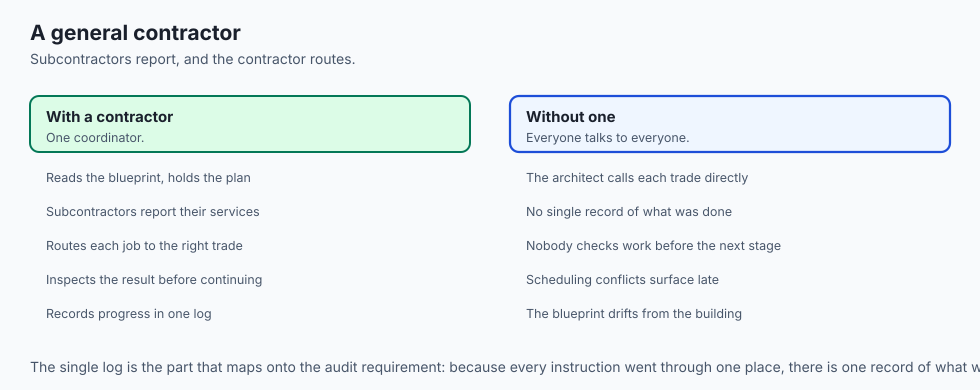

Think of an MCP Client like **a general contractor managing specialized subcontractors on a construction site**:

- The Client (General Contractor) reads the architectural blueprint (User Goal).
- Subcontractor 1 (Plumbing MCP Server) and Subcontractor 2 (Electrical MCP Server) report their available services (`tools/list`).
- When the architect decides a pipe needs installing (`tool_call`), the contractor instructs the plumber to do the work, inspects the result (`observation`), and records progress in the project log.

## Examples in practice

### Graceful Degradation and Dynamic Tool Pruning

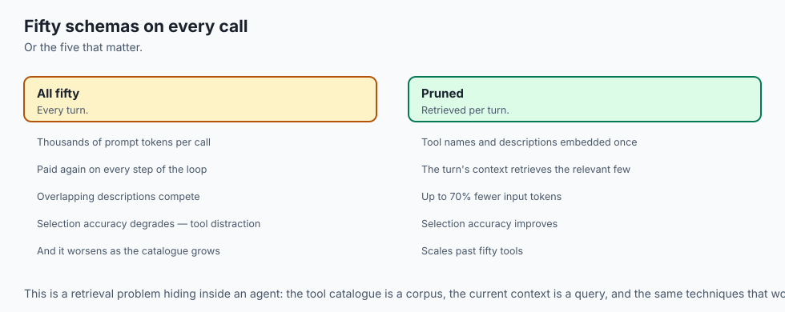

When connecting an autonomous agent to a large server pool exposing 50+ total tools, passing the complete tool schema catalog on every LLM call consumes thousands of prompt tokens and degrades model reasoning accuracy (a phenomenon known as *tool distraction*).

A production MCP client implements **Semantic Tool Retrieval & Dynamic Pruning**:

1. **Tool Schema Embedding:** At client startup, embed each tool name and description using a lightweight local embedding model (e.g. `all-MiniLM-L6-v2`).
2. **Contextual Retrieval:** On each user turn, perform cosine similarity between the user's prompt and the tool vector catalog.
3. **Top-K Injection:** Dynamically pass only the top 5–8 most relevant tool schemas in the model API call.
4. **Fallback Recovery:** If the model's response indicates a missing capability, expand the tool window to include secondary server tools.

This optimization reduces per-turn input token costs by up to 70% while improving the model's tool selection accuracy.


Let us build a complete Python **Autonomous Agent with Multi-Server MCP Client Integration**:

```python
import json
import subprocess
import os
from typing import Dict, Any, List, Optional

class MCPClientConnection:
    def __init__(self, name: str, command: str, args: List[str]):
        self.name = name
        self.process = subprocess.Popen(
            [command] + args,
            stdin=subprocess.PIPE,
            stdout=subprocess.PIPE,
            stderr=subprocess.PIPE,
            text=True,
            bufsize=1
        )
        self.req_id = 0
        self._initialize()
        
    def _send(self, method: str, params: Optional[Dict[str, Any]] = None) -> Dict[str, Any]:
        self.req_id += 1
        payload = {"jsonrpc": "2.0", "id": self.req_id, "method": method}
        if params is not None:
            payload["params"] = params
        self.process.stdin.write(json.dumps(payload) + "
")
        self.process.stdin.flush()
        line = self.process.stdout.readline()
        return json.loads(line.strip())
        
    def _initialize(self):
        self._send("initialize", {"protocolVersion": "2024-11-05"})
        # Send initialized notification
        notif = {"jsonrpc": "2.0", "method": "notifications/initialized"}
        self.process.stdin.write(json.dumps(notif) + "
")
        self.process.stdin.flush()
        
    def list_tools(self) -> List[Dict[str, Any]]:
        res = self._send("tools/list")
        return res.get("result", {}).get("tools", [])
        
    def call_tool(self, name: str, arguments: Dict[str, Any]) -> Dict[str, Any]:
        res = self._send("tools/call", {"name": name, "arguments": arguments})
        return res.get("result", {})
        
    def close(self):
        if self.process.poll() is None:
            self.process.terminate()
            self.process.wait()

class AutonomousMCPAgent:
    def __init__(self):
        self.servers: Dict[str, MCPClientConnection] = {}
        self.tool_routing: Dict[str, MCPClientConnection] = {} # tool_name -> connection
        self.unified_tools: List[Dict[str, Any]] = []
        
    def connect_server(self, name: str, command: str, args: List[str]):
        conn = MCPClientConnection(name, command, args)
        self.servers[name] = conn
        tools = conn.list_tools()
        for t in tools:
            self.tool_routing[t["name"]] = conn
            self.unified_tools.append(t)
            
    def execute_tool(self, tool_name: str, arguments: Dict[str, Any]) -> str:
        if tool_name not in self.tool_routing:
            return f"Error: Tool '{tool_name}' not found on any connected MCP server."
        conn = self.tool_routing[tool_name]
        result = conn.call_tool(tool_name, arguments)
        content_list = result.get("content", [])
        return "
".join([c.get("text", "") for c in content_list])
        
    def close_all(self):
        for conn in self.servers.values():
            conn.close()
```

## Implications: security, privacy, performance, scalability, and cost

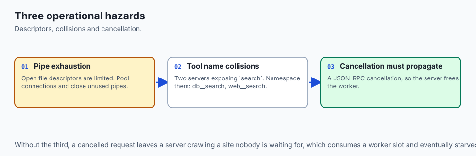

### Resilient Tool Execution and Dynamic Schema Translation

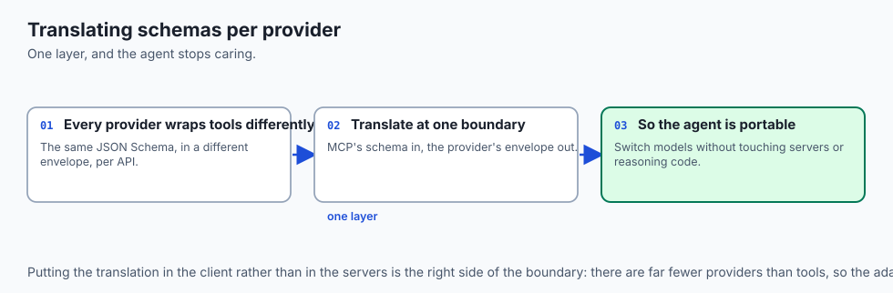

When routing tool calls across multiple distinct AI model providers (OpenAI, Anthropic Claude, Google Gemini, local Ollama), each API expects slightly different tool schema wrappers. A robust MCP client implements a universal schema transformer:

```python
def mcp_to_openai_tool(mcp_tool: dict) -> dict:
    '''Convert an MCP tool definition into OpenAI function calling format.'''
    return {
        "type": "function",
        "function": {
            "name": mcp_tool["name"],
            "description": mcp_tool.get("description", ""),
            "parameters": mcp_tool.get("inputSchema", {"type": "object", "properties": {}})
        }
    }

def mcp_to_anthropic_tool(mcp_tool: dict) -> dict:
    '''Convert an MCP tool definition into Anthropic Claude tool format.'''
    return {
        "name": mcp_tool["name"],
        "description": mcp_tool.get("description", ""),
        "input_schema": mcp_tool.get("inputSchema", {"type": "object", "properties": {}})
    }
```

This translation layer decouples your autonomous agent logic from foundation model SDK changes. Whether your agent uses Claude 3.5 Sonnet or Gemini 1.5 Pro, the underlying MCP servers execute identically.


### 1. Subprocess Pipe Exhaustion
Operating systems enforce limits on the maximum number of open file descriptors. A client connecting to dozens of servers must manage connection pools and close unused pipes cleanly.

### 2. Tool Name Collision
If Server A and Server B both expose a tool named `search`, the client must implement namespacing (e.g. `db__search` vs `web__search`) to prevent routing ambiguity.

## Alternatives: free, open source, and commercial

| Client Architecture | Implementation | Routing Model | Best Suited For |
| :--- | :--- | :--- | :--- |
| **Custom Python MCP Client** | Direct Subprocess stdio | In-Memory Registry | Backend autonomous agents |
| **Claude Desktop** | Native Electron App | UI Managed | Personal interactive chat |
| **Cursor / Zed IDE** | Rust / C++ Host Engine | Editor Managed | AI Coding assistants |
| **LangChain MCP Adapter** | Python Framework Plugin | LangChain Tools | LangGraph state graph pipelines |

## Comparison with related concepts

```text
+-----------------------+-----------------------+-----------------------+
| Dimension             | MCP Server            | MCP Client            |
+-----------------------+-----------------------+-----------------------+
| Role                  | Service Provider      | Service Consumer      |
| IO Streams            | Reads stdin/Writes out| Writes in/Reads stdout|
| State Responsibility  | Tool execution logic  | Multi-server routing  |
| Initiates Connections | Passive (Spawned)     | Active (Spawner)      |
+-----------------------+-----------------------+-----------------------+
```

## When to use it — and when not to

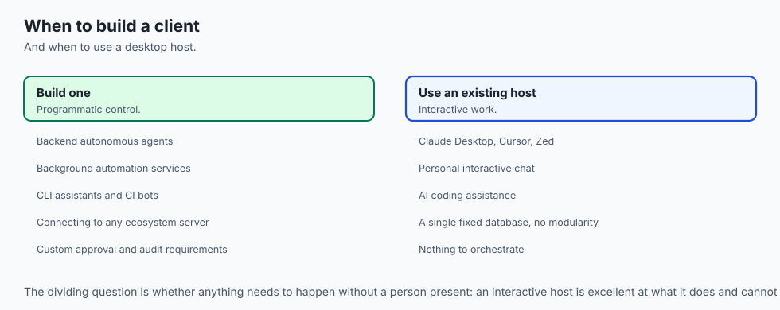

### Protocol Timeout and Cancellation Handling

In production agent deployments, tools that interact with slow external systems (such as large database migrations or web crawlers) may take tens of seconds to complete. If a user cancels an ongoing request in the UI, or if a tool exceeds an execution deadline, the client must transmit a JSON-RPC cancellation notice:

```json
{
  "jsonrpc": "2.0",
  "method": "notifications/cancelled",
  "params": {
    "requestId": 101,
    "reason": "User aborted execution in web UI"
  }
}
```

The child MCP server intercepts the cancellation notification, terminates the active worker thread or network request, and releases allocated system resources immediately, preventing server worker starvation.


### Choose Building an MCP Client when:
- You are developing custom autonomous agents, background automation services, or CLI assistants that need modular tool capabilities.
- You want your agent to easily connect to any standard MCP server in the open-source ecosystem.

### Do NOT build a custom MCP client when:
- Your application only uses a single fixed database with no need for modularity.

## The AI connection

- **The client is where the safety controls belong.** It sees every payload before
  dispatch, which makes it the natural place for approval gates and audit logging.

- **Tool distraction is measurable.** Fifty schemas on every call costs thousands of
  tokens and degrades selection, which is why dynamic pruning pays for itself.

- **Schema translation decouples you from provider SDKs** — the same MCP servers serve
  whichever model you switch to next quarter.

- **Servers crash, and a resilient client respawns them** rather than failing the run,
  which is Day 333's reconciliation idea at the process level.

- **Cancellation has to reach the server.** Without it a cancelled user request leaves a
  worker crawling a website nobody is waiting for.

## Knowledge check

1. **What is the function of the unified tool registry in an MCP client?** To aggregate tool definitions from all connected servers and map tool names to server connections.
2. **How does the client execute a tool on a child process?** By sending a `tools/call` JSON-RPC message over the server's stdin pipe and reading the response from stdout.
3. **What happens during capability negotiation?** The client and server exchange supported protocol versions and feature sets via `initialize`.

## Hands-on exercise

In this lab, you will implement an **Autonomous MCP Client with Multi-Server Management in Python**. Your implementation will:

1. Construct an `MCPClientConnection` manager handling subprocess handshakes.
2. Build an `AutonomousMCPAgent` aggregating tools across multiple mock servers.
3. Dispatch dynamic tool calls with automated routing and observation capture.
4. Verify multi-server coordination and error recovery across automated pytest tests.

### Expected output

```text
============================= test session starts ==============================
collected 5 items

tests/test_mcp_client.py .....                                           [100%]

============================== 5 passed in 0.02s ===============================
[MCP CLIENT] Connected to 'database-server' (1 tool: 'sql_select')
[MCP CLIENT] Connected to 'filesystem-server' (1 tool: 'read_file')
[ROUTING] Dispatched 'sql_select' -> Server 'database-server'
[ROUTING] Dispatched 'read_file' -> Server 'filesystem-server'
[EXECUTION SUCCESS] Both multi-server actions executed successfully.
```

### Validate your work

Run the pytest test suite:

```bash
pytest tests/run_tests.sh
```

### Troubleshooting

1. **Subprocess hangs on readline:** Ensure the server flushes its standard output after writing each line.
2. **Tool routing KeyError:** Verify the tool name exists in `self.tool_routing`.

### Common mistakes

- Forgetting to send the `notifications/initialized` notification after receiving the `initialize` response.
- Leaving orphan subprocesses running after test execution.

## Practice assignment

Add **Tool Namespacing** support to the client, automatically prefixing tool names with the server name (e.g. `sqlite__query` vs `postgres__query`) to resolve naming collisions.

## Extension challenge

Implement an asynchronous `AsyncMCPClientPool` utilizing `asyncio.subprocess` that executes tool calls across multiple servers concurrently in parallel.