## Why this matters

Over the past week, you have mastered the foundational mechanics of the Model Context Protocol: JSON-RPC 2.0 transport, schema negotiation, FastMCP server development, non-tool Resources and Prompts, multi-server client orchestration, and defense-in-depth security. Today, you will synthesize all of these concepts into a production-ready **Personal MCP Server** tailored to your daily developer environment.

A Personal MCP Server acts as an intelligent operating system daemon for your machine. It provides any MCP-compliant client (such as Claude Desktop, Cursor, Zed, or your custom autonomous scripts) with instant, structured access to:

1. **Persistent Developer Memory:** An embedded SQLite database for storing, searching, and managing project memos and active tasks.
2. **Real-Time Workspace Resources:** Live URI-addressable streams (`git://status`, `memo://notes`, `sys://telemetry`) with change synchronization.
3. **Automated Daily Workflows:** Parameterized prompt templates (like `/standup` and `/code-audit`) that aggregate git logs and database tasks to generate professional executive summaries with a single click.

Building and packaging your personal server marks the transition from learning protocol specifications to deploying real-world AI engineering infrastructure.

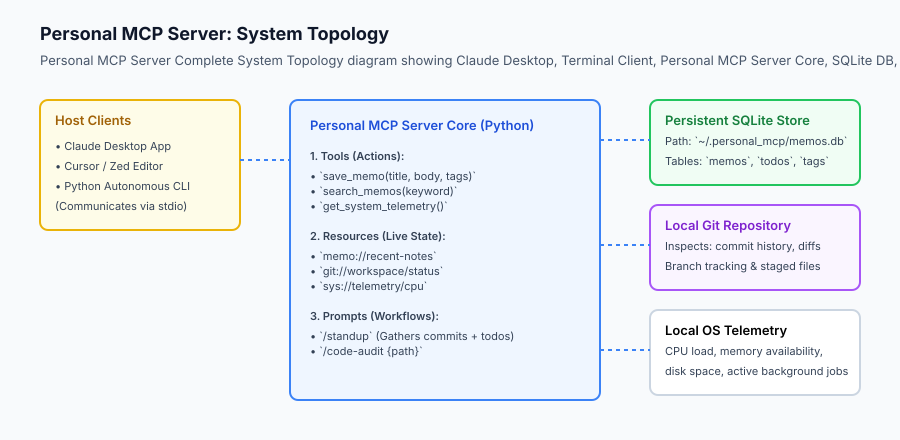

## The idea in plain language

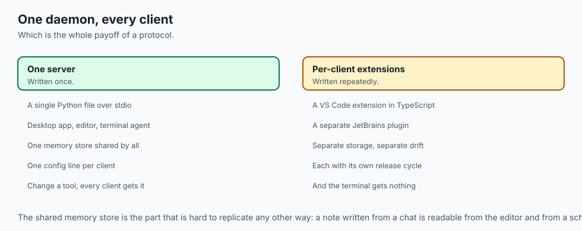

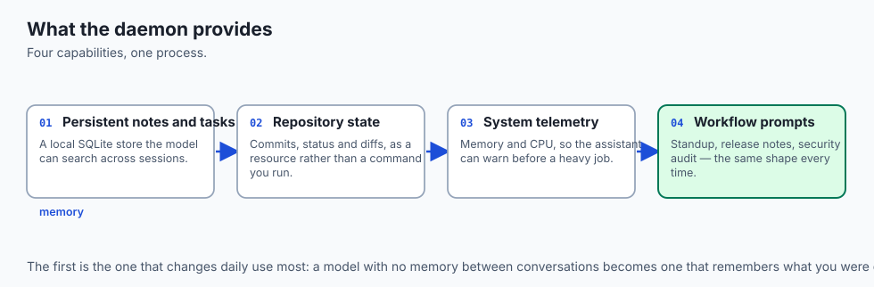

Think of your Personal MCP Server like **a bespoke executive assistant who sits right next to your workstation**:

- When you tell your AI chat *"What was I working on yesterday afternoon?"*, the assistant queries the personal SQLite memo database (`search_memos`).
- When you ask *"Give me a status report for my standup meeting"*, the assistant pulls the latest 24 hours of Git commits (`git://status`), checks the uncompleted tasks in your local task list, and drafts a crisp bulleted summary (`/standup`).
- When you ask *"Check if our test server is out of memory"*, the assistant queries local system metrics (`get_system_telemetry`) and reports available RAM.

Your AI model doesn't need to guess or hallucinate; it queries your personal server directly.

## Historical background

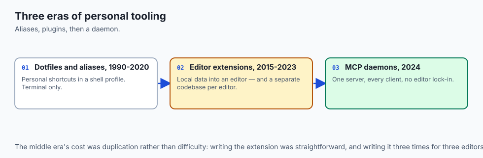

The journey toward personal developer context servers evolved across three distinct eras:

### 1. The Dotfiles and Shell Alias Era (1990–2020)
Developers maintained personalized `~/.bashrc` and `~/.zshrc` files with custom shell aliases (`alias gs="git status"`, `task.sh`) to streamline personal workflows.

### 2. Custom IDE Extensions & Plugins (2015–2023)
Developers wrote bespoke VS Code or IntelliJ extensions to inject local data into editors. However, each editor required a separate codebase.

### 3. Unified MCP Developer Daemons (2024–Present)
The Model Context Protocol created a universal, editor-agnostic standard. A single Python or Node.js server now works simultaneously across Claude Desktop, Cursor, Zed, Neovim, and autonomous terminal agents.

## What it is — and what it is not

Let us define the scope of a Personal MCP Server:

### What a Personal MCP Server Is:
- A local daemon running on your workstation providing tools, resources, and prompts over stdio.
- An integrated service backed by embedded persistent storage (SQLite).
- A standardized plugin configured in `claude_desktop_config.json`.

### What a Personal MCP Server Is Not:
- A public cloud web service (it is private, secure, and runs locally on your machine).
- A heavy framework requiring cloud container orchestration.

```text
+-------------------------------------------------------------------------------+
|                      PERSONAL MCP SERVER COMPONENT ARCHITECTURE               |
+-------------------+-----------------------+-----------------------------------+
| Component         | Type                  | Description                       |
+-------------------+-----------------------+-----------------------------------+
| Memo Database     | Persistent SQLite     | Store and retrieve dev notes/tasks|
| Git Telemetry     | Subprocess Reader     | Inspect commit logs, diffs, branch|
| System Monitor    | OS Telemetry          | Measure CPU, Memory, Disk usage   |
| Live Resources    | URI Addressable Stream| `memo://notes`, `git://status`    |
| Standup Prompt    | Workflow Template     | Automated daily status compiler   |
+-------------------+-----------------------+-----------------------------------+
```

## Why it was created and what problems it solves

Deploying a personal MCP server solves four major developer pain points:

### 1. Eliminating Context Switching
You no longer need to leave your AI conversation to run `git log`, look up a database schema, or check a past memo. The AI retrieves it automatically.

### 2. Cross-Tool Consistency
Whether you are writing code in Cursor, brainstorming in Claude Desktop, or running a background terminal agent, all interfaces share the exact same local memory and tools.

### 3. Offline Privacy
All data is stored locally in SQLite (`~/.personal_mcp/memos.db`). No personal notes or git diffs are sent to third-party SaaS databases.

### 4. Workflow Repeatability
Standardized prompt templates ensure daily routines (standup reports, release notes, security audits) follow identical, high-quality structures every time.

## How it works

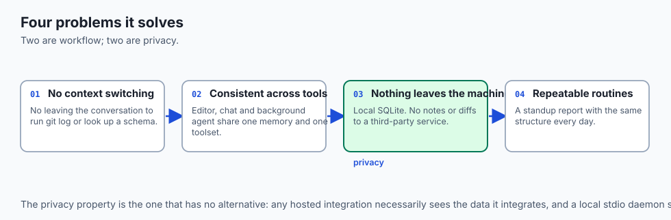

### Deep Dive: Packaging and Deploying as a Standalone Executable

To make your Personal MCP Server portable across developer workstations without manual virtual environment configuration, package it using `uv`, `pipx`, or standard `pyproject.toml` console scripts:

```toml
[build-system]
requires = ["setuptools>=61.0"]
build-backend = "setuptools.build_meta"

[project]
name = "personal-mcp-server"
version = "1.0.0"
description = "Personal Developer MCP Server with SQLite Persistence"
readme = "README.md"
requires-python = ">=3.10"
dependencies = [
    "mcp>=1.0.0",
    "pydantic>=2.0.0",
]

[project.scripts]
personal-mcp = "personal_mcp_server.server:main"
```

Once installed via `pipx install .` or `uv tool install .`, configure Claude Desktop with the clean binary command:
```json
{
  "mcpServers": {
    "personal-mcp": {
      "command": "personal-mcp",
      "args": ["--db-path", "/Users/username/.personal_mcp/data.db"]
    }
  }
}
```

### Performance Optimization: SQLite WAL Mode and Prepared Statements

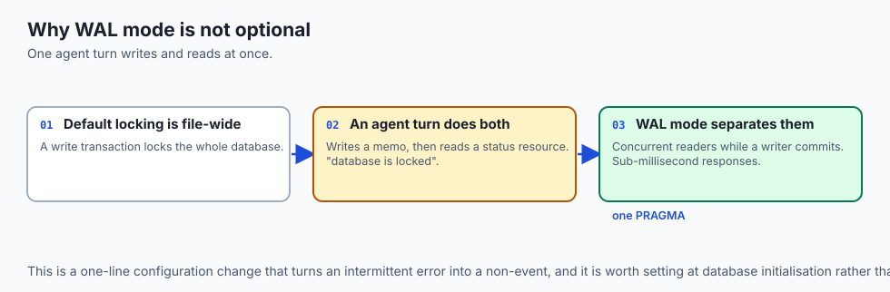

By default, SQLite locks the entire database file during write transactions. In a multi-turn agent interaction where the model writes multiple memos and tasks while simultaneously reading status resources, standard locking can cause `sqlite3.OperationalError: database is locked`.

Always configure **Write-Ahead Logging (WAL)**:
```python
def configure_sqlite_wal(conn: sqlite3.Connection):
    conn.execute("PRAGMA journal_mode = WAL;")
    conn.execute("PRAGMA synchronous = NORMAL;")
    conn.execute("PRAGMA foreign_keys = ON;")
    conn.execute("PRAGMA busy_timeout = 5000;") # 5 second wait before timeout
```
WAL mode allows multiple concurrent reader connections while a background writer process commits changes, delivering sub-millisecond database response times.


Let us trace the complete lifecycle of an automated `/standup` workflow:

```text
[Human User triggers: "/standup" in Claude Desktop]
                         │
                         ▼
        [Claude Desktop sends: prompts/get ("standup")]
                         │
                         ▼
        [Personal MCP Server Compiles Standup]
  1. Executes `git log --since="24h" --oneline` -> "feat: add sqlite memo store"
  2. Queries SQLite -> "SELECT * FROM tasks WHERE status='pending'" -> "Write unit tests"
  3. Synthesizes prompt: "Summarize the following git commits and active tasks..."
                         │
                         ▼
        [Server returns structured message array to Claude]
                         │
                         ▼
        [Claude generates executive standup report]
  "Yesterday: Implemented SQLite memo store. Today: Write unit tests."
```

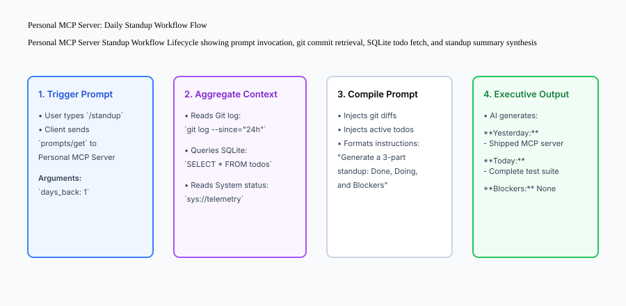

## An everyday analogy

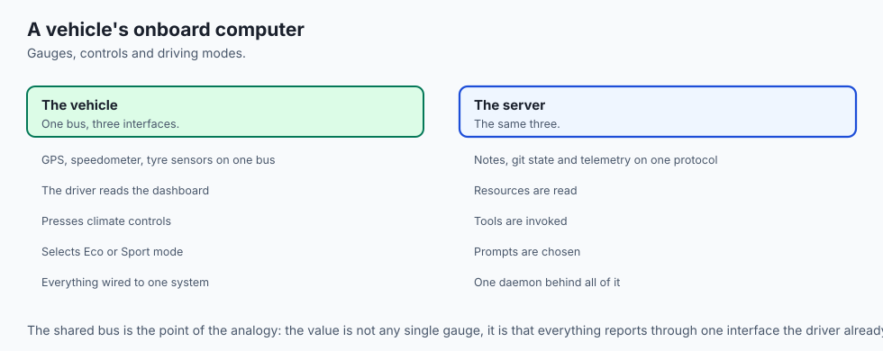

Think of your Personal MCP Server like **the dashboard and onboard computer of a modern vehicle**:

- The GPS, speedometer, tire pressure sensors, and maintenance log are all wired into a central CAN bus (the Model Context Protocol).
- The driver (the AI Model) looks at the digital dashboard (Resources), presses the climate control buttons (Tools), and selects pre-programmed driving modes like "Eco" or "Sport" (Prompts).

## Examples in practice

### Cross-Project Workspace Auto-Detection

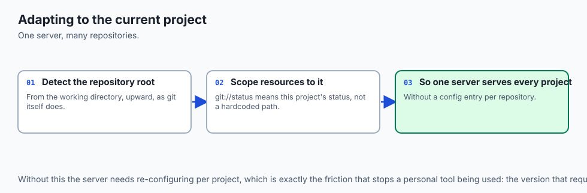

To make your Personal MCP Server truly dynamic across multiple repositories, configure the server to auto-detect the active Git repository root based on the current working directory:

```python
import subprocess
import os

class WorkspaceContextDetector:
    @staticmethod
    def get_current_git_root() -> str:
        try:
            result = subprocess.run(
                ["git", "rev-parse", "--show-toplevel"],
                capture_output=True, text=True, check=True
            )
            return result.stdout.strip()
        except Exception:
            return os.getcwd()
            
    @staticmethod
    def get_active_branch() -> str:
        try:
            result = subprocess.run(
                ["git", "rev-parse", "--abbrev-ref", "HEAD"],
                capture_output=True, text=True, check=True
            )
            return result.stdout.strip()
        except Exception:
            return "unknown"
```

By querying `WorkspaceContextDetector` inside your resources and prompts, the server automatically adapts its responses depending on which project directory you are currently working in.


Let us inspect the production architecture of `PersonalMCPServer`:

```python
import sqlite3
import os
import json
from typing import Dict, Any, List

class PersonalMCPServer:
    def __init__(self, db_path: str = ":memory:"):
        self.db_path = db_path
        self.conn = sqlite3.connect(self.db_path, check_same_thread=False)
        self._init_db()
        
    def _init_db(self):
        self.conn.execute('''
            CREATE TABLE IF NOT EXISTS memos (
                id INTEGER PRIMARY KEY AUTOINCREMENT,
                title TEXT NOT NULL,
                content TEXT NOT NULL,
                tags TEXT,
                created_at TIMESTAMP DEFAULT CURRENT_TIMESTAMP
            )
        ''')
        self.conn.execute('''
            CREATE TABLE IF NOT EXISTS tasks (
                id INTEGER PRIMARY KEY AUTOINCREMENT,
                task TEXT NOT NULL,
                completed BOOLEAN DEFAULT 0
            )
        ''')
        self.conn.commit()
            
    # Tool: Save Memo
    def save_memo(self, title: str, content: str, tags: str = "") -> str:
        cur = self.conn.cursor()
        cur.execute("INSERT INTO memos (title, content, tags) VALUES (?, ?, ?)", (title, content, tags))
        self.conn.commit()
        return f"Saved memo '{title}' with ID {cur.lastrowid}."
            
    # Tool: Search Memos
    def search_memos(self, keyword: str) -> List[Dict[str, Any]]:
        self.conn.row_factory = sqlite3.Row
        cur = self.conn.cursor()
        cur.execute("SELECT id, title, content, tags FROM memos WHERE title LIKE ? OR content LIKE ?", (f"%{keyword}%", f"%{keyword}%"))
        rows = cur.fetchall()
        return [dict(r) for r in rows]
            
    # Tool: Add task
    def add_task(self, task: str) -> str:
        cur = self.conn.cursor()
        cur.execute("INSERT INTO tasks (task, completed) VALUES (?, 0)", (task,))
        self.conn.commit()
        return f"Added task '{task}' with ID {cur.lastrowid}."
            
    # Resource: Read all pending tasks
    def get_pending_tasks_resource(self) -> str:
        cur = self.conn.cursor()
        cur.execute("SELECT id, task FROM tasks WHERE completed = 0")
        rows = cur.fetchall()
        if not rows:
            return "No pending tasks."
        return "
".join([f"- [{r[0]}] {r[1]}" for r in rows])
            
    # Prompt: Daily Standup Template
    def generate_standup_prompt(self, recent_commits: str) -> List[Dict[str, Any]]:
        pending = self.get_pending_tasks_resource()
        prompt_text = (
            "Please generate a concise 3-part daily standup report using the following data:

"
            f"### Recent Git Commits:
{recent_commits}

"
            f"### Active Pending tasks:
{pending}

"
            "Format with sections: **1. Completed Yesterday**, **2. Planned Today**, **3. Blockers**."
        )
        return [{"role": "user", "content": {"type": "text", "text": prompt_text}}]
```

## Configuring in Claude Desktop

To register your personal server in Claude Desktop, edit `~/Library/Application Support/Claude/claude_desktop_config.json`:

```json
{
  "mcpServers": {
    "personal-dev": {
      "command": "python3",
      "args": [
        "/Users/username/projects/personal-mcp-server/server.py"
      ],
      "env": {
        "MCP_DB_PATH": "/Users/username/.personal_mcp/data.db"
      }
    }
  }
}
```

## Implications: security, privacy, performance, scalability, and cost

### Automated System Telemetry and Hardware Metrics Tooling

A complete Personal MCP Server should expose real-time hardware telemetry so AI coding assistants can monitor memory pressure and CPU utilization during intensive compilation or model fine-tuning jobs.

```python
import psutil
import platform

class SystemTelemetryEngine:
    @staticmethod
    def get_metrics() -> dict:
        cpu_pct = psutil.cpu_percent(interval=0.1)
        mem = psutil.virtual_memory()
        disk = psutil.disk_usage("/")
        return {
            "platform": platform.platform(),
            "cpu_cores": psutil.cpu_count(logical=True),
            "cpu_usage_percent": cpu_pct,
            "memory_total_gb": round(mem.total / (1024**3), 2),
            "memory_available_gb": round(mem.available / (1024**3), 2),
            "memory_used_percent": mem.percent,
            "disk_free_gb": round(disk.free / (1024**3), 2)
        }
```

Exposing `get_metrics` as both a callable Tool (`get_system_telemetry`) and a streaming Resource (`sys://telemetry/live`) allows your AI assistant to warn you before running memory-heavy scripts: *"Warning: Only 1.2GB of RAM is currently available on your machine. Running this local 7B model may trigger OOM swap thrashing."*.


### 1. Database Locking under Concurrency
SQLite handles concurrent readers easily, but simultaneous writes require WAL mode (`PRAGMA journal_mode=WAL;`). Enable WAL mode in your database initialization script.

### 2. Local Privacy Assurance
Because the server executes locally over stdio and stores data in local SQLite files, zero telemetry or proprietary code snippets leave your workstation without your explicit configuration.

## Alternatives: free, open source, and commercial

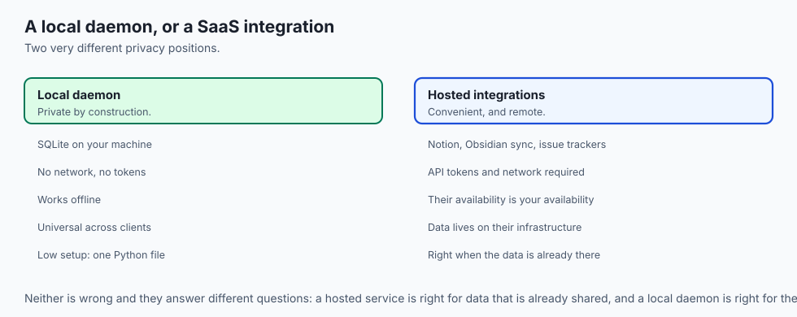

| Approach | Setup Effort | Modularity | Cross-Client Support |
| :--- | :--- | :--- | :--- |
| **Personal MCP Server** | Low (Python/FastMCP) | High (Standardized) | Universal (Claude, Cursor, CLI) |
| **Custom Shell Scripts** | Low | Low (Ad-hoc) | Terminal only |
| **Notion / Obsidian API** | Medium | Medium (SaaS dependent)| Requires API tokens & network |
| **Custom VS Code Extension**| High (TypeScript/VSC API)| Low (Editor specific)| VS Code only |

## Comparison with related concepts

```text
+-----------------------+-----------------------+-----------------------+
| Dimension             | Ad-Hoc Scripts        | Personal MCP Server   |
+-----------------------+-----------------------+-----------------------+
| Protocol              | None (CLI text)       | Standard JSON-RPC 2.0 |
| AI Discoverability    | Invisible to LLM      | Dynamic `tools/list`  |
| State Persistence     | Ephemeral             | SQLite WAL Database   |
| Interactive Prompts   | Not supported         | Parameterized Prompts |
+-----------------------+-----------------------+-----------------------+
```

## When to use it — and when not to

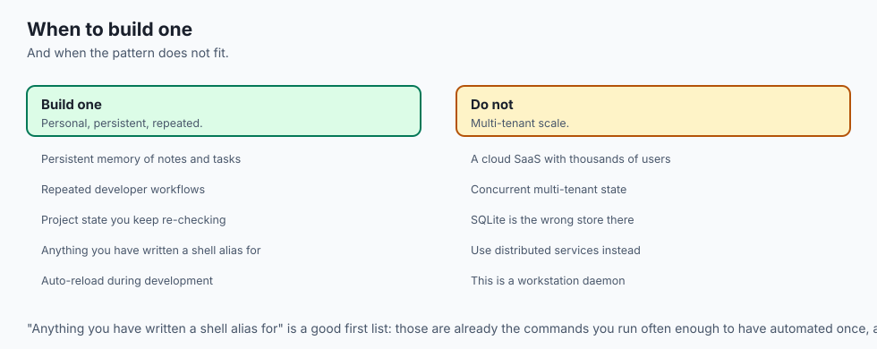

### Production Deployment and Continuous Auto-Reload

During local development of your Personal MCP Server, modifying Python code usually requires restarting Claude Desktop to reload the server subprocess. You can streamline this workflow by using an auto-reloading runner like `watchfiles` or `nodemon`:

```json
{
  "mcpServers": {
    "personal-dev": {
      "command": "python3",
      "args": [
        "-m", "watchfiles",
        "python3 /Users/username/projects/personal-mcp-server/server.py",
        "/Users/username/projects/personal-mcp-server"
      ]
    }
  }
}
```

Whenever you edit tool definitions or prompt templates in your code editor, `watchfiles` automatically respawns the server process, allowing you to test new features in your AI chat interface instantly with zero downtime or manual restarts.


### Choose a Personal MCP Server when:
- You want your daily AI assistants to have persistent memory of your notes, tasks, and project states.
- You want to automate repetitive developer workflows with standardized prompt templates.

### Do NOT use a Personal MCP Server when:
- You are deploying a multi-tenant cloud SaaS with thousands of concurrent users (use distributed gRPC/REST microservices instead).

## The AI connection

- **A personal server is persistent memory for a stateless model** — notes, tasks and
  repository state that survive between conversations.

- **The same daemon serves every client**, which is the payoff of the protocol: one
  Python file works in a desktop app, an editor and a terminal agent simultaneously.

- **Local storage is a privacy decision.** Notes and diffs in a local SQLite file never
  reach a third-party service, which no SaaS integration can offer.

- **Prompt templates make a routine repeatable.** A standup report generated the same way
  every day is Day 362's documentation argument applied to your own workflow.

- **Telemetry as a resource lets the assistant warn you** before it suggests running a
  7B model on a machine with 1.2 GB free.

## Knowledge check

1. **What persistent storage engine is ideal for a local personal MCP server?** SQLite (stored in `~/.personal_mcp/data.db`).
2. **Why must debug logs be written to `stderr` in stdio MCP servers?** To prevent plain text from corrupting the JSON-RPC wire frames on `stdout`.
3. **Where is Claude Desktop configured to launch an MCP server?** In `claude_desktop_config.json` under the `mcpServers` object.

## Hands-on exercise

In this lab, you will implement a complete **Personal Developer MCP Server in Python**. Your implementation will:

1. Initialize an embedded SQLite memo and task database with WAL mode.
2. Implement memo storage, keyword search, and task management tools.
3. Expose live URI resources (`memo://pending-tasks`, `memo://all-memos`).
4. Generate structured workflow prompt templates (`/standup`).
5. Verify complete end-to-end functionality across automated pytest tests.

### Expected output

```text
============================= test session starts ==============================
collected 4 items

tests/test_personal_mcp_server.py ....                                   [100%]

============================== 4 passed in 0.03s ===============================
[PERSONAL MCP SERVER] Initialized SQLite store at ':memory:'
[TOOL EXEC] Saved memo 'Architecture Notes' -> ID: 1
[TOOL EXEC] Saved task 'Deploy Postgres migration' -> ID: 1
[RESOURCE READ] URI 'memo://pending-tasks' -> 1 pending task found.
[PROMPT SYNTHESIS] Synthesized '/standup' prompt template with 1 user message.
```

### Validate your work

Run the pytest test suite:

```bash
pytest tests/run_tests.sh
```

### Troubleshooting

1. **Database locked error:** Ensure database connections are closed using Python context managers or WAL mode.
2. **Empty search results:** Verify keyword queries wrap search terms in `%` wildcards for SQL `LIKE`.

### Common mistakes

- Hardcoding absolute file paths instead of using environment variables or home directory expansions (`os.path.expanduser`).

## Practice assignment

To cement your personal MCP server implementation into your daily developer routine:

1. Configure your personal server inside `claude_desktop_config.json` with an absolute path to your local SQLite database.
2. Execute three end-to-end conversational workflows in Claude Desktop: saving notes during code review, querying past architecture memos, and generating an automated `/standup` report from your real Git commit history.
3. Add a specialized `/code-audit` prompt template that inspects the latest modified files in your workspace and flags security vulnerabilities or missing unit tests.
4. Implement a backup script that automatically copies your `memos.db` SQLite database to an encrypted local backup directory daily.


Add a **System Telemetry Tool** (`get_telemetry`) using `psutil` or standard library calls that returns CPU count, memory load, and current platform details.

## Extension challenge

Implement a **Git Diff Resource** (`git://diff/staged`) that executes `git diff --cached` and streams staged code changes directly into the AI context window.