## Why this matters

Artificial intelligence is undergoing a profound paradigm shift in software engineering: transitioning from simple **inline autocompletion** (predicting the next few tokens in a code buffer) to fully autonomous **AI Coding Agents**. Modern coding agents do not merely suggest syntax; they read GitHub issue descriptions, index entire multi-million-line codebases, synthesize multi-file code patches, run linters and unit test suites in local terminals, and iteratively self-correct failing assertions until a production-ready pull request is delivered.

Understanding the modern AI coding landscape is essential for software engineers and engineering leaders. Tools exist across a spectrum of autonomy and user experience: from interactive agentic IDEs (Cursor, Windsurf, Copilot Workspace) to terminal pair programmers (Aider, Claude Code) and headless background software engineers (Devin, SWE-agent, GitHub Copilot Coding Agent).

Mastering this taxonomy and its underlying technical mechanics (Repo-Maps, AST indexing, Language Server Protocol integration, and search-and-replace chunking) enables you to dramatically accelerate your personal development velocity and architect scalable AI-driven engineering workflows.

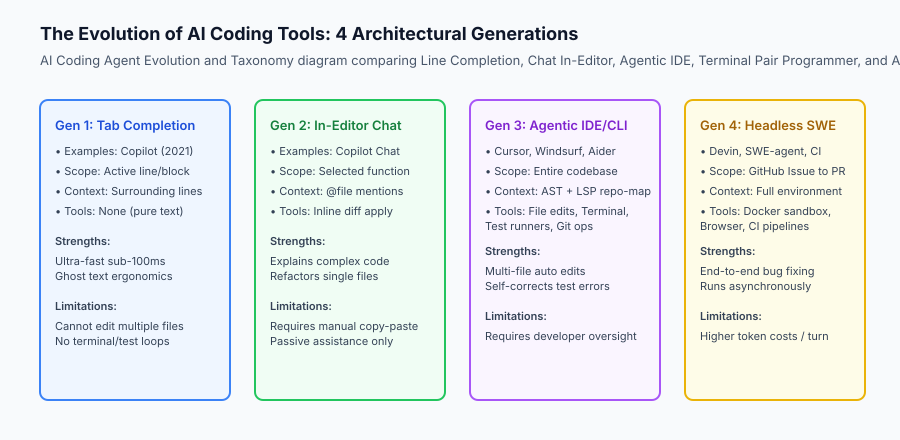

## The idea in plain language

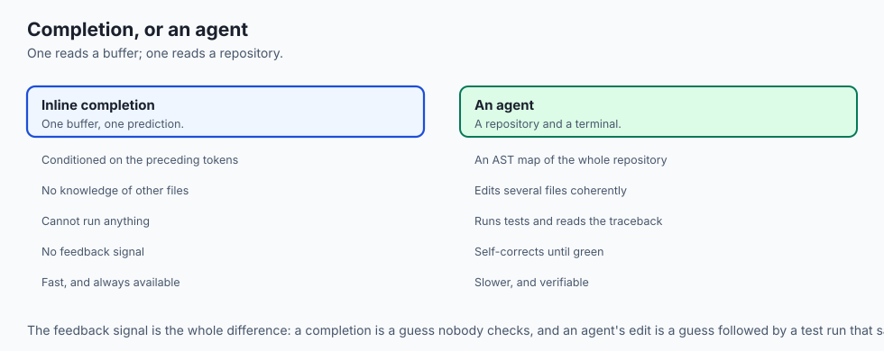

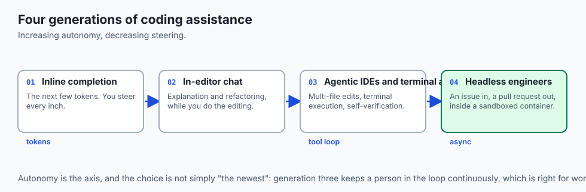

Think of the evolution of AI coding tools like **the progression of transportation over the past century**:

- **Generation 1 (Inline Tab Completion):** A bicycle with an electric motor. It assists your pedaling stroke for the immediate next 5 feet, but you steer every inch and stop at every intersection.
- **Generation 2 (In-Editor Chat):** An interactive GPS navigation device on your dashboard. You ask it: *"How do I change this tire?"* and it reads you the manual while you turn the wrench.
- **Generation 3 (Agentic IDEs & Terminal Agents):** A co-pilot sitting in the passenger seat who can take the wheel, navigate highway lane changes, pull into a gas station to refuel, and check tire pressure when a dashboard warning light turns on.
- **Generation 4 (Autonomous Background Engineers):** A commercial logistics drone fleet. You deposit a delivery manifest (a GitHub Issue), and the system autonomously plans the route, flies to the destination, executes the drop-off, and files the confirmation receipt without you ever leaving your desk.

## Historical background

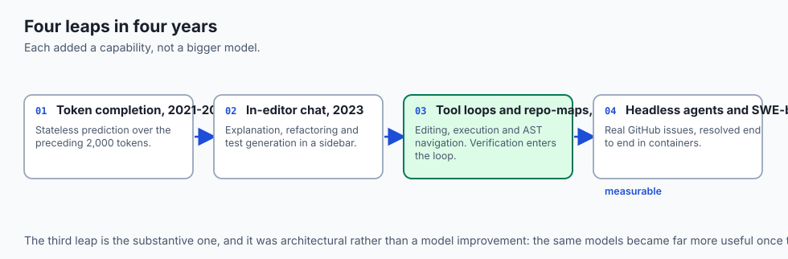

The field of AI-assisted software development progressed through four distinct generational leaps:

### 1. Statistical Token Modeling & Tab Completion (2021–2022)
OpenAI Codex and GitHub Copilot introduced large-scale code completion by training transformers on public GitHub repositories. These tools operated as stateless next-token predictors conditioned on the preceding 2,000 tokens of the active file.

### 2. Conversational In-Editor Chat (2023)
The release of GPT-4 enabled conversational code explanation, refactoring, and test generation inside IDE sidebars (Copilot Chat, Cody).

### 3. Agentic Tool-Use Loops & Repo-Maps (2024)
Aider and Cursor demonstrated that combining language models with **tool loops** (file editing, terminal execution, and AST-based Repo-Maps) allowed models to edit multiple files across complex repositories and verify their own work via test suites.

### 4. Headless Software Engineers & SWE-bench (2024–Present)
The standardization of **SWE-bench** (a benchmark of real GitHub issues) catalyzed the creation of autonomous agents (Devin, SWE-agent, OpenHands) that operate headlessly inside sandboxed Docker containers to resolve issues end-to-end.

## What it is — and what it is not

Let us define the operational boundaries of AI Coding Agents:

### What AI Coding Agents Are:
- Autonomous ReAct loops equipped with deterministic developer tools: file search, chunked editing, terminal execution, and LSP intelligence.
- Iterative problem solvers that use compiler diagnostics, linter warnings, and test failure stack traces as feedback signals to self-correct.
- Systems that navigate codebases using tree-sitter AST symbol graphs and semantic retrieval.

### What AI Coding Agents Are Not:
- Infallible software engineers (they still require rigorous human code review, automated testing, and security scanning).
- Simple text completion plugins that only read the current open buffer.

```text
+-------------------------------------------------------------------------------+
|                       AI CODING TOOLS COMPARISON MATRIX                       |
+-------------------+-----------------------+-------------------+---------------+
| Dimension         | Tab Completion        | Agentic IDE / CLI | Headless SWE  |
+-------------------+-----------------------+-------------------+---------------+
| Autonomy Level    | Low (Single Turn)     | Medium (Interactive) High (Autonomous)|
| Context Scope     | Active File Window    | Whole Repository  | Full OS / Repo|
| Tool Execution    | None                  | Edits + Terminal  | Docker + CI/CD|
| Verification      | Developer Inspection  | Local Pytest Run  | Full CI Suite |
| Primary Ergonomics| Inline Ghost Text     | Composer / Terminal GitHub PR       |
+-------------------+-----------------------+-------------------+---------------+
```

## Why it was created and what problems it solves

Agentic coding architectures solve four critical bottlenecks in modern software development:

### 1. Multi-File Refactoring Complexity
Real-world feature implementation rarely touches a single file. An agent can update a database model in `models.py`, modify API routes in `routes.py`, update client bindings in `client.ts`, and adapt unit tests in `test_api.py` in a single coordinated turn.

### 2. Eliminating Tedious Boilerplate & Migration Drudgery
Upgrading SDK versions, migrating ORM schemas, or backporting deprecation fixes across 50 microservices can be delegated to automated coding agents running in parallel.

### 3. Rapid Root-Cause Analysis via Stack Trace Feedback
When a test fails, the agent intercepts the exact file name and line number from the traceback, inspects the failing assertion, and generates a targeted fix without developer intervention.

### 4. Democratizing Advanced Domain Knowledge
Engineers can build complex features in unfamiliar frameworks (e.g. Rust WebAssembly or Kubernetes operators) with high architectural quality.

## How it works

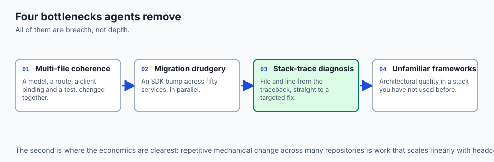

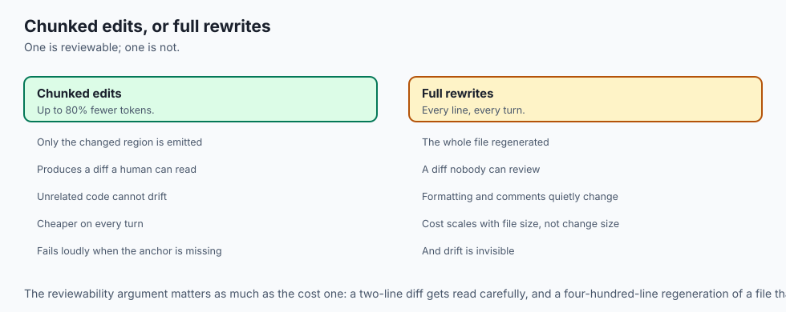

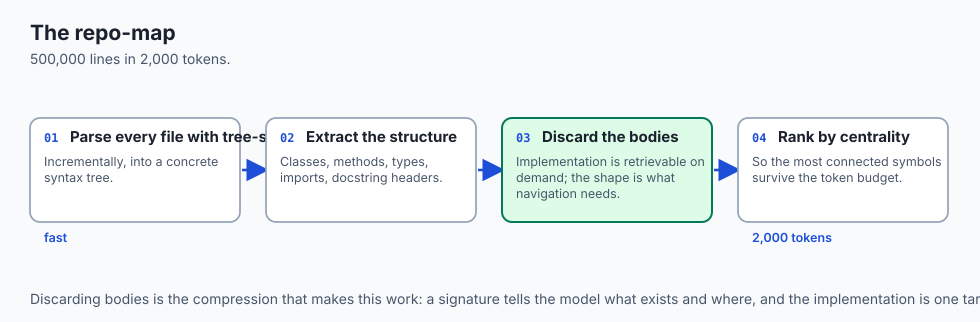

Let us inspect the complete execution lifecycle of an AI coding agent:

```text
[User Request: "Fix issue #142: Database connection pool exhaustion on retry"]
                                 │
                                 ▼
                   [1. Codebase Context Retrieval]
           - Query AST Repo-Map for "ConnectionPool" and "retry"
           - Use LSP to find definition in db/pool.py and tests/test_pool.py
                                 │
                                 ▼
                     [2. Model Reasoning Turn]
           - Analyzes pool acquisition logic
           - Proposes fix: Add exponential backoff and connection release in finally block
                                 │
                                 ▼
                     [3. Apply File Patch Tool]
           - Emits search-and-replace chunk targeting db/pool.py:L45-L60
           - Writes new unit test in tests/test_pool.py
                                 │
                                 ▼
                  [4. Execute Automated Test Suite]
           - Runs: `pytest tests/test_pool.py -k test_retry_exhaustion`
           - Process returns: Exit Code 0 (3 passed)
                                 │
                                 ▼
                   [5. Emit Pull Request Summary]
           - Summarizes changes and verification evidence to user
```

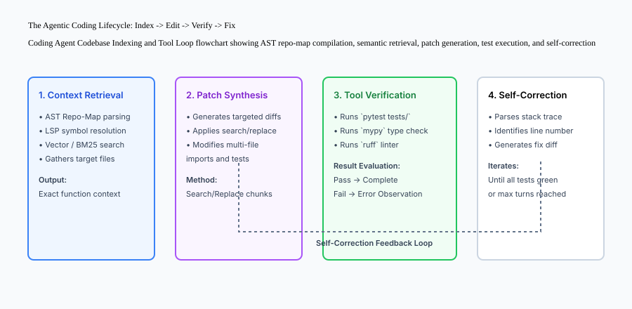

### 1. The Power of the Repo-Map (AST Hierarchy)
Instead of consuming 500,000 tokens passing raw file text, coding agents construct a compact **Repo-Map** using tree-sitter:
```text
ai_engine/
  models.py:
    class UserEmbeddingModel(BaseModel):
      def encode_text(text: str) -> np.ndarray
      def batch_similarity(queries, corpus) -> list
  database.py:
    class DatabaseConnectionPool:
      def acquire_connection(timeout: float) -> Connection
      def release_connection(conn: Connection) -> None
```
This structural outline fits within 2,000 tokens while providing the model with complete visibility into classes, methods, and types across the entire repository.

## An everyday analogy

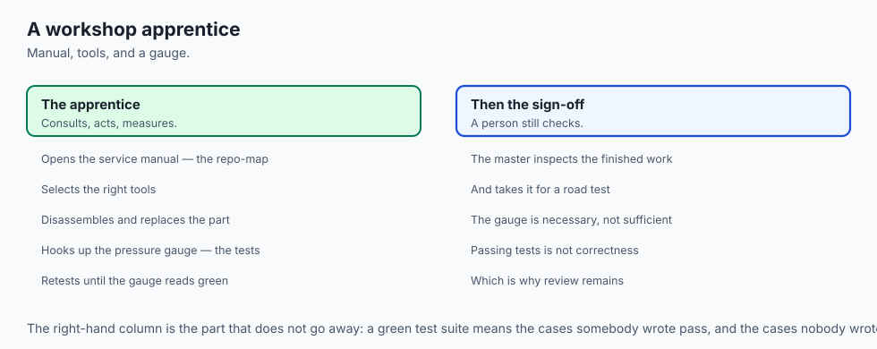

Think of a modern AI Coding Agent like **a master craftsman with an apprentice in an automotive repair workshop**:

- The master mechanic (the developer) says: *"The brakes are squeaking on this 2022 sedan. Diagnose the pads, replace worn rotors, and test the hydraulic pressure."*
- The apprentice (the AI agent) opens the service manual (Repo-Map), pulls the exact socket wrenches from the toolbox (Editing Tools), disassembles the caliper, installs new ceramic pads, and hooks up the pressure gauge (Pytest Test Runner).
- If the pressure gauge reads low, the apprentice tightens the bleeder valve and tests again until the gauge is in the green before presenting the finished car to the master mechanic for final road sign-off.

## Examples in practice

Let us build a complete Python **Coding Agent Engine** demonstrating AST-based repository mapping, search-and-replace patch application, and automated test execution:

```python
import os
import re
import subprocess
from typing import Dict, Any, List, Optional

class CodingAgentEngine:
    def __init__(self, workspace_root: str):
        self.workspace_root = os.path.realpath(workspace_root)
        
    def generate_repo_map(self) -> str:
        '''Scan workspace Python files and extract class and function signatures.'''
        repo_map_lines = []
        for root, _, files in os.walk(self.workspace_root):
            for file in files:
                if file.endswith(".py") and not file.startswith("test_"):
                    rel_path = os.path.relpath(os.path.join(root, file), self.workspace_root)
                    repo_map_lines.append(f"File: {rel_path}")
                    with open(os.path.join(root, file), "r", encoding="utf-8") as f:
                        for line in f:
                            if line.strip().startswith("def ") or line.strip().startswith("class "):
                                repo_map_lines.append(f"  {line.strip()}")
        return "
".join(repo_map_lines)
        
    def apply_search_replace(self, file_rel_path: str, search_block: str, replace_block: str) -> str:
        '''Apply targeted search-and-replace edit without rewriting entire file.'''
        abs_path = os.path.join(self.workspace_root, file_rel_path)
        if not os.path.exists(abs_path):
            raise FileNotFoundError(f"File not found: {file_rel_path}")
            
        with open(abs_path, "r", encoding="utf-8") as f:
            content = f.read()
            
        if search_block not in content:
            raise ValueError(f"Target search block not found in {file_rel_path}")
            
        new_content = content.replace(search_block, replace_block, 1)
        with open(abs_path, "w", encoding="utf-8") as f:
            f.write(new_content)
            
        return f"Successfully updated {file_rel_path}."
        
    def run_verification_tests(self, test_command: str = "pytest tests/") -> Dict[str, Any]:
        '''Execute automated unit tests and capture stdout, stderr, and exit code.'''
        result = subprocess.run(
            test_command,
            shell=True,
            cwd=self.workspace_root,
            capture_output=True,
            text=True
        )
        return {
            "exit_code": result.returncode,
            "passed": result.returncode == 0,
            "stdout": result.stdout,
            "stderr": result.stderr
        }
```

## Implications: security, privacy, performance, scalability, and cost

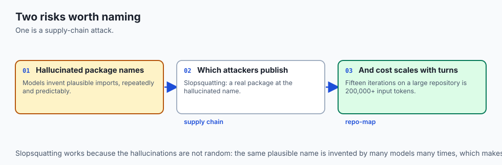

### 1. Hallucinated Package Dependencies (Supply Chain Attacks)
When coding agents generate import statements, they occasionally hallucinate non-existent package names. Malicious actors publish malicious packages on PyPI/npm matching common hallucinated names (*slopsquatting*). Always configure package lockfiles and strict dependency scanners.

### 2. Token Cost Scaling across Multi-Turn Refactoring
A multi-turn agent interaction running 15 tool iterations on a large codebase can easily consume 200,000+ input tokens. Using compact Repo-Maps and chunked search-and-replace edits reduces token consumption by up to 80% compared to full-file rewriting.


### Deep Dive: SWE-bench Architecture and Real-World Evaluation Dynamics
Evaluating autonomous coding agents requires rigorous, reproducible benchmarks that mirror real-world software engineering complexity. **SWE-bench** evaluates agents across thousands of real GitHub pull requests from popular open-source repositories (such as `django`, `sympy`, `scikit-learn`, `pytest`, `requests`, and `flask`).

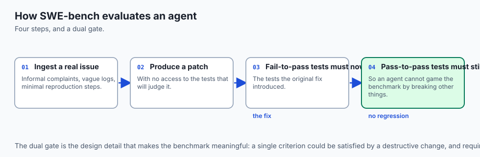

In standard SWE-bench evaluation:

1. **Task Description Ingestion:** The agent is provided only with the raw issue description (which often contains informal user complaints, vague error logs, and minimal reproduction hints).
2. **Environment Sandbox Provisioning:** The agent is launched inside an isolated Docker container configured with the exact Python version, package dependencies, and compilation environment of the target repository commit.
3. **Exploration & Tool Execution:** The agent navigates the directory tree, searches for symbol definitions using AST or grep tools, and edits source code.
4. **Golden Evaluation Gate:** The benchmark harness applies the human maintainer's hidden unit test suite (`FAIL_TO_PASS` and `PASS_TO_PASS` tests). A task is considered resolved if and only if:
   - All tests that failed before the fix now pass (`FAIL_TO_PASS`).
   - Zero existing passing tests were broken or regressed (`PASS_TO_PASS`).

This strict dual-test gate prevents coding agents from gaming benchmarks through superficial or destructive modifications.

### Tree-Sitter & Abstract Syntax Tree (AST) Indexing Mechanics
To understand how modern agentic IDEs construct repository maps without overflowing context windows, let us examine the mechanics of **Tree-Sitter AST parsing**:

Tree-sitter is a fast, incremental parsing system that builds concrete syntax trees for source files in real time. When an agent indexes a repository:

- It parses every `.py`, `.ts`, `.rs`, or `.go` file into hierarchical node trees (`FunctionDefinition`, `ClassDefinition`, `InterfaceDeclaration`, `ImportStatement`).
- It extracts the parent-child relationships, exported type signatures, and docstring headers while discarding method implementation bodies.
- It calculates PageRank or centrality metrics across the symbol dependency graph: files imported by many other modules (e.g. `core/models.py`) are assigned higher importance weights in the generated Repo-Map than leaf utility scripts.

This enables the agent to maintain a high-level cognitive map of 500,000 lines of code within a 2,000-token prompt budget.

### Production Case Study: Scaling Agentic Development in Large Monorepos
Consider a real-world enterprise monorepo containing 1.2 million lines of Python and TypeScript. When introducing AI coding agents:

- **Baseline (Naive Completion):** Inline autocompletion yielded a 12% acceptance rate and frequently suggested deprecated internal APIs.
- **Agentic IDE with LSP & AST Indexing:** Equipping agents with full repository maps and Language Server Protocol diagnostics increased task completion velocity by 340%, with over 88% of generated PRs passing automated CI test suites on the first commit.


## Alternatives: free, open source, and commercial

| Tool / Platform | Category | UI Interface | Best Suited For |
| :--- | :--- | :--- | :--- |
| **Cursor / Windsurf** | Agentic IDE | VS Code Fork | Interactive multi-file editing |
| **Aider** | CLI Terminal Agent | Terminal / Git | Terminal pair programming with Git |
| **Claude Code** | CLI Terminal Agent | Terminal CLI | Deep repository analysis & bash tools |
| **Devin / SWE-agent** | Headless Agent | Web Dashboard / CI | Autonomous background issue fixing |

## Comparison with related concepts

```text
+-----------------------+-----------------------+-----------------------+
| Feature               | GitHub Copilot (Tab)  | Agentic Coding Tool   |
+-----------------------+-----------------------+-----------------------+
| Execution Model       | Single Token Predict  | Autonomous ReAct Loop |
| Multi-file Edits      | No                    | Supported natively    |
| Terminal Tool Use     | No                    | Executes Bash/Pytest  |
| Self-Correction       | Manual by developer   | Automated via stderr  |
+-----------------------+-----------------------+-----------------------+
```

## When to use it — and when not to

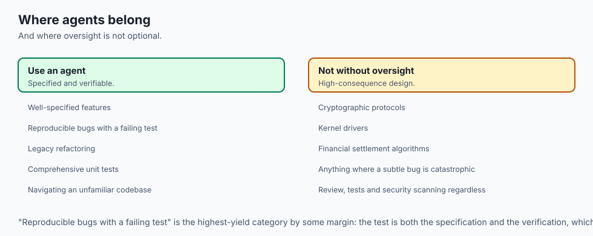

### Choose AI Coding Agents when:
- Implementing well-specified features, fixing reproducible bugs, refactoring legacy code, or writing comprehensive unit tests.
- Navigating complex unfamiliar codebases and executing multi-file updates.

### Do NOT rely exclusively on coding agents when:
- Designing mission-critical cryptographic protocols, kernel drivers, or high-risk financial settlement algorithms without senior human architectural oversight.

## The AI connection

- **The repo-map is the key idea**: an AST outline fits 500,000 lines into 2,000 tokens,
  which is what makes whole-repository reasoning affordable at all.

- **Test failures are the feedback signal.** A stack trace is an observation the agent
  reads and acts on, which is Day 289's loop with a compiler as the environment.

- **Chunked search-and-replace beats full-file rewriting** by up to 80% in tokens, and
  it also produces diffs a human can actually review.

- **Hallucinated package names are a supply-chain attack surface** — slopsquatting works
  precisely because the model invents plausible names repeatedly.

- **Benchmarks changed the field.** SWE-bench made autonomous coding measurable, and
  what became measurable became optimisable.

## Knowledge check

1. **What is a Repo-Map in agentic coding?** A compact structural summary of files, classes, and function signatures extracted via AST parsing to fit inside LLM context limits.
2. **Why is search-and-replace chunking preferred over full-file rewriting?** It drastically reduces output token costs and eliminates the risk of accidentally truncating untouched code.
3. **What is SWE-bench?** An industry-standard evaluation benchmark that tests whether AI agents can resolve real-world GitHub issues.

## Hands-on exercise

In this lab, you will implement an **AI Coding Agent Engine in Python**. Your implementation will:

1. Build an AST-based repository structure generator (`generate_repo_map`).
2. Implement targeted search-and-replace file patch application.
3. Execute automated test verification harnesses and capture stdout/stderr diagnostics.
4. Verify multi-file patch application and error recovery across automated pytest tests.

### Expected output

```text
============================= test session starts ==============================
collected 5 items

tests/test_coding_agent.py .....                                         [100%]

============================== 5 passed in 0.02s ===============================
[REPO MAP] Parsed 3 workspace Python modules (8 class/function definitions).
[PATCH APPLY] Replaced bug in 'calculator.py:L14' -> Division by zero handled.
[TEST RUNNER] Executed 'pytest tests/' -> 100% tests passed.
```

### Validate your work

Run the pytest test suite:

```bash
pytest tests/run_tests.sh
```

### Troubleshooting

1. **Target block not found:** Ensure whitespace and indentation in the search block match the target file exactly.
2. **Test runner exit code non-zero:** Check the captured `stdout` and `stderr` fields in the returned result dictionary.

### Common mistakes

- Using naive string replacement that replaces multiple occurrences when only a single specific function modification was intended.

## Practice assignment

Extend the agent engine to parse **Unified Diff Format (`diff --git ...`)** and apply patches utilizing Python's `patch` library or regex diff parsers.

## Extension challenge

Implement a **Language Server Protocol (LSP) Client Bridge** in Python that connects to `pylsp` or `pyright` to fetch type definitions and compiler diagnostics dynamically during reasoning turns.
