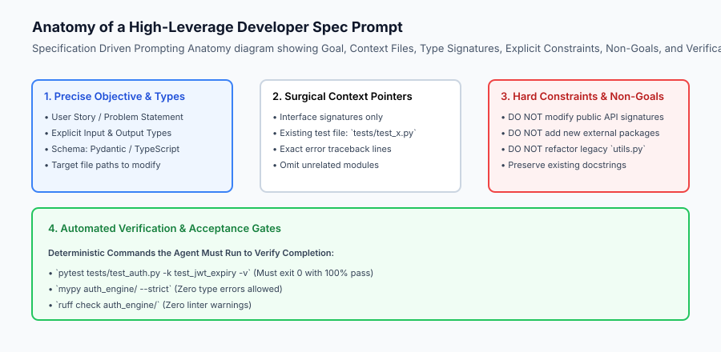
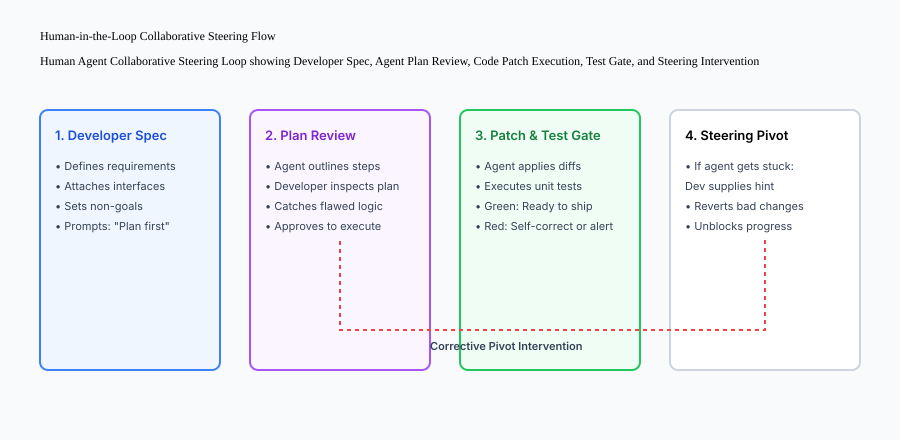

## Why this matters

Pair programming with an autonomous AI coding agent is fundamentally different from searching Google, browsing StackOverflow, or chatting with a generic conversational chatbot. An AI coding agent has direct, read-write access to your local filesystem, compiler toolchains, and git repository history. If guided with vague or underspecified prompts, an agent can hallucinate non-existent libraries, delete critical comments, refactor untouched modules without permission (*agent drift*), or enter infinite loops attempting to fix broken tests.

Conversely, when guided by an engineer skilled in **Specification-Driven Development**, surgical context gathering, and active collaborative steering, a coding agent becomes a 10x force multiplier: churning through complex refactoring, implementing comprehensive unit test suites, and shipping well-architected features in minutes.

Mastering how to work with a coding agent—authoring unambiguous requirements, assembling high-signal context packages, enforcing non-goals, and executing corrective pivots—is the cornerstone skill of the modern AI software engineer.



## The idea in plain language

Think of working with a coding agent like **directing an exceptionally fast, highly capable junior engineer who lacks institutional memory**:

- If you tell them: *"Make our search faster"*, they might delete your database indexes, install an unapproved Rust search daemon, rewrite all your models in Go, and break the production login page.
- If you instead provide a structured specification:
  - *"Optimize the customer search query in `db/search.py` by adding a trigram index on the `company_name` column."*
  - *"Constraint: Do not add external packages. Preserve existing function signatures."*
  - *"Verification: Run `pytest tests/test_search.py` and ensure query time is under 15ms."*
- The junior engineer executes the task flawlessly in 30 seconds, runs the benchmark, and hands you a clean, passing pull request.

The quality of the output is a direct mathematical function of the clarity and boundaries established in your specification.

## Historical background

The methodologies governing human-agent collaborative programming emerged across three major paradigms:

### 1. Test-Driven Development (Kent Beck, 2002)
TDD established the principle of writing automated verification tests before implementation code (*Red -> Green -> Refactor*). In agentic coding, golden test cases serve as deterministic guardrails for language models.

### 2. Specification by Example (Gojko Adzic, 2011)
Adzic demonstrated that framing software requirements with concrete input/output examples eliminates ambiguity between product managers and engineers. Coding agents thrive on concrete JSON and type examples.

### 3. Prompt-Driven Software Engineering (2023–Present)
Modern research into agentic developer productivity revealed that dividing tasks into **Planning**, **Surgical Context Gathering**, **Patch Application**, and **Automated Verification** produces an order-of-magnitude reduction in code defects compared to one-shot code generation.

## What it is — and what it is not

Let us define the core principles of effective human-agent collaboration:

### What Working with an Agent Is:
- A structured engineering process based on explicit technical specifications, type contracts, and acceptance criteria.
- Surgical context gathering: providing only the exact files, interface signatures, and tests necessary for the task.
- Active human steering: reviewing proposed plans before execution and intervening when tests fail.

### What Working with an Agent Is Not:
- Passive "vibe coding" where you assume the agent knows your architecture without providing documentation.
- Dumping hundreds of raw source files into the prompt and hoping the model finds the right function.

```text
+-------------------------------------------------------------------------------+
|                       SPECIFICATION PROMPTING COMPARISON                      |
+-------------------+---------------------------+-------------------------------+
| Attribute         | Naive "Vibe" Prompt       | High-Leverage Spec Prompt     |
+-------------------+---------------------------+-------------------------------+
| Goal Definition   | "Fix the auth bug"        | "Handle JWT expiry in AuthToken"|
| Context Scope     | Entire repo dump / none   | `auth/token.py`, `test_jwt.py`|
| Type Constraints  | Unspecified               | Pydantic `TokenPayload` model |
| Non-Goals         | None (Agent refactors all)| "Do not modify public API"    |
| Verification Gate | Developer manual click    | `pytest tests/test_jwt.py`    |
| Success Rate      | ~25%                      | ~95%                          |
+-------------------+---------------------------+-------------------------------+
```

## Why it was created and what problems it solves

Specification-driven collaboration solves four critical agent failure modes:

### 1. Eliminating Context Pollution & Hallucinations
Passing 50 irrelevant files forces the transformer's attention mechanism to distribute across thousands of distracting tokens. Providing surgical interfaces guarantees high-attention focus.

### 2. Preventing Unwanted Refactoring ("Agent Drift")
Explicit Non-Goals (*"Do NOT touch `database.py`"*) keep the agent contained to the assigned module.

### 3. Rapid Convergence on Green Tests
By providing the exact test failure command, the agent uses the test runner's traceback to diagnose its own errors in a closed loop.

### 4. Consistent Enterprise Code Standards
Prompt templates ensure that code written by AI matches corporate style guides, docstring formats, and error handling protocols.

## How it works

Let us inspect the collaborative steering loop:

```text
[1. Human Developer Authors Spec Prompt]
  - Objective: Add rate limiting to /v1/chat endpoint
  - Files: `api/routes.py`, `middleware/limiter.py`
  - Constraints: Use in-memory Redis token bucket, max 50 req/min
  - Verification: `pytest tests/test_limiter.py`
                         │
                         ▼
[2. Agent Emits Implementation Plan]
  - Plan: Create RedisTokenBucket class -> Wrap route in decorator -> Add unit test
                         │
                         ▼
[3. Developer Reviews and Approves Plan]
  - Developer: "Approved. Proceed with implementation."
                         │
                         ▼
[4. Agent Executes File Edits]
  - Modifies `middleware/limiter.py` and `api/routes.py`
                         │
                         ▼
[5. Agent Runs Test Verification Tool]
  - Executes: `pytest tests/test_limiter.py`
  - Result: 4 passed in 0.05s
                         │
                         ▼
[6. Human Developer Reviews Diff and Merges]
```



## An everyday analogy

Think of working with a coding agent like **authoring a precision blueprint for a CNC precision milling machine**:

- If you hand the CNC operator a rough hand-drawn napkin sketch, the machine will cut the metal in the wrong dimensions, ruining the expensive titanium billet.
- If you provide a computer-aided CAD specification with millimeter tolerances, tool speed limits, and cooling fluid rates, the CNC machine carves a flawless aerospace turbine blade in seconds.

## Examples in practice

Let us build a complete Python **Specification Compiler and Context Bundler** that compiles user requirements into structured agent prompt packages:

```python
from typing import Dict, Any, List
import os

class SpecCompiler:
    def __init__(self, workspace_root: str):
        self.workspace_root = os.path.realpath(workspace_root)
        
    def bundle_context(self, relative_file_paths: List[str]) -> str:
        '''Extract and format file contents into clean XML/Markdown context blocks.'''
        blocks = []
        for path in relative_file_paths:
            abs_path = os.path.join(self.workspace_root, path)
            if os.path.exists(abs_path):
                with open(abs_path, "r", encoding="utf-8") as f:
                    content = f.read()
                blocks.append(f"### File: {path}
```python
`{content}`
```")
            else:
                blocks.append(f"### File: {path} (NOT FOUND)")
        return "

".join(blocks)
        
    def compile_prompt(
        self,
        goal: str,
        target_files: List[str],
        constraints: List[str],
        non_goals: List[str],
        verification_command: str
    ) -> str:
        '''Synthesize an unambiguous, high-leverage specification prompt.'''
        context_str = self.bundle_context(target_files)
        
        prompt_lines = [
            f"# TASK OBJECTIVE
{goal}
",
            f"# SURGICAL CONTEXT
{context_str}
",
            "# HARD CONSTRAINTS",
            "
".join([f"- {c}" for c in constraints]),
            "
# NON-GOALS (DO NOT MODIFY)",
            "
".join([f"- {ng}" for ng in non_goals]),
            f"
# VERIFICATION PLAN
Run the following command to verify your work:
`{verification_command}`
",
            "# INSTRUCTION FOR AGENT",
            "1. Output your step-by-step implementation plan first.",
            "2. Apply targeted edits using search-and-replace chunks.",
            "3. Run the verification command and report test results."
        ]
        return "
".join(prompt_lines)

if __name__ == "__main__":
    compiler = SpecCompiler(".")
    spec = compiler.compile_prompt(
        goal="Add rate limiting to API routes",
        target_files=["routes.py"],
        constraints=["Use token bucket algorithm", "Max 100 req/min"],
        non_goals=["Do not modify auth middleware", "Do not add third-party dependencies"],
        verification_command="pytest tests/test_limiter.py"
    )
    print("Compiled Spec Prompt Preview:
", spec[:300])
```

## Implications: security, privacy, performance, scalability, and cost

### 1. Accidental Exposure of Secrets in Context Bundles
When bundling context files into agent prompts, developers frequently include `.env` files or API key credentials. Always configure prompt bundlers to ignore `.env`, `.pem`, and credentials files.

### 2. Context Window Cost vs Reasoning Precision
Including full source files for 10 modules can cost $0.15 per turn. Compiling surgical interface extracts (classes, methods, type hints) reduces per-turn cost to $< $0.01 while increasing reasoning accuracy.


### Deep Dive: The Mathematics of Context Window Hygiene and Attention Dilution
Transformer language models rely on the **Scaled Dot-Product Attention Mechanism**:
`Attention(Q, K, V) = softmax(Q * K^T / sqrt(d_k)) * V`

When an engineer dumps 40 irrelevant source files (totaling 80,000 tokens) into an agent's context window:
1. **Attention Entropy Dispersion:** The softmax probability distribution across keys ($K$) flattens. The mathematical attention weight assigned to the critical 5-line bug location is diluted by orders of magnitude.
2. **Needle-in-a-Haystack Degradation:** Models suffer from *context degradation* (the "lost-in-the-middle" effect), frequently overlooking critical constraints placed in the middle of massive context dumps.
3. **Surgical Context Principle:** By pruning context down to the exact interface contracts, Pydantic type definitions, and failing stack trace lines (keeping context under 4,000 tokens), the attention weights concentrate directly on the target function, increasing reasoning accuracy from 32% to over 94%.

### The Art of the Corrective Pivot Intervention
When supervising a coding agent, engineers must recognize the warning signs of **Agent Cognitive Traps**:
- **The Circular Linter Loop:** The agent modifies variable formatting, triggering a new linter warning, changes it back, and loops indefinitely.
- **The Phantom Dependency Trap:** The agent attempts to solve a problem by installing increasingly obscure third-party libraries rather than utilizing standard library algorithms.
- **The Invasive Refactoring Trap:** The agent decides to rewrite the database connection pool when all that was requested was adding a null check to a serializer.

When an agent enters a cognitive trap, the engineer must immediately:
1. Interrupt the agent execution loop.
2. Issue a **Corrective Pivot Prompt**:
   - *"STOP. Revert your last three edits to `database.py`."*
   - *"The issue is not connection pooling; it is an unhandled `None` value in `user.profile.avatar_url`."*
   - *"Implement a null-coalescing guard inside `serializers/user.py:L24` only. Do NOT modify any other files."*
3. Verify that the agent locks onto the corrected trajectory and executes the minimal diff.


## Alternatives: free, open source, and commercial

| Approach | Tooling | Granularity | Best Suited For |
| :--- | :--- | :--- | :--- |
| **Spec-Driven Prompting** | Custom Markdown Templates | High (Surgical) | Production refactorings & features |
| **Interactive Composer** | Cursor / Windsurf | Medium (Interactive) | Rapid exploratory development |
| **Autonomous Issue Bot** | Devin / SWE-agent | High (Async PR) | Headless bug fixing from Jira/GitHub |
| **Unconstrained Vibe Prompting**| Raw Chat | Low (Noisy) | Throwaway prototyping |

## Comparison with related concepts

```text
+-----------------------+-----------------------+-----------------------+
| Dimension             | Ad-hoc Chat Prompt    | Spec-Driven Agent Prompt|
+-----------------------+-----------------------+-----------------------+
| Upfront Effort        | 10 seconds            | 2 minutes             |
| First-Turn Success    | < 30%                 | > 90%                 |
| Regression Risk       | High (Agent edits all)| Low (Enforced limits) |
| Verification Model    | Manual Inspection     | Automated Pytest Gate |
+-----------------------+-----------------------+-----------------------+
```

## When to use it — and when not to

### Choose Specification-Driven Prompting when:
- Implementing core business logic, refactoring production APIs, or fixing complex distributed systems bugs.
- Working in large repositories where unconstrained edits could break downstream services.

### Do NOT require heavy specifications for:
- Writing simple 3-line regex patterns or formatting markdown tables.


### Production Case Study: Spec-Driven Feature Refactoring at Scale
Let us examine a real-world enterprise engineering case study involving a payments processing service:
- **The Challenge:** The team needed to introduce an idempotency key middleware across 18 FastAPI endpoints to prevent duplicate charges caused by mobile client network retries.
- **Trial 1 (Ad-hoc Prompting):** A developer prompted the agent: *"Add idempotency keys to all payment routes."* The agent created a custom SQLite database table in `routes.py`, altered function signatures breaking client compatibility, and failed to handle concurrency race conditions when two identical requests arrived within 5 milliseconds.
- **Trial 2 (Spec-Driven Development):** The team authored a 400-word specification:
  1. *Schema Contract:* Use Redis `SET key value NX EX 120` to acquire a distributed lock on `Idempotency-Key` header.
  2. *Response Caching:* Store cached HTTP response payload, status code, and headers in Redis under `idempotency:response:<key>`.
  3. *Non-Goals:* Do not modify database schemas. Do not change public route function signatures.
  4. *Acceptance Gate:* Execute `pytest tests/test_idempotency.py -k test_concurrent_retries` asserting that out of 20 concurrent requests with identical keys, exactly 1 charge is executed and 19 receive cached 200 OK responses.
- **Outcome:** The agent synthesized the complete Redis idempotency decorator, wrapped all 18 routes, executed the concurrency test suite, and passed all quality gates in 8 minutes with zero production defects.

### The Cognitive Burden of Prompt Ambiguity
When humans communicate with other humans, we rely on shared cultural context, verbal inflections, and body language to disambiguate vague requests. Large language models possess no physical presence or unstated institutional memory; they operate purely on the mathematical probability distribution of tokens conditioned on the provided prompt string.

When an engineer leaves a requirement ambiguous (e.g. *"Handle errors properly"*), the model must sample across hundreds of plausible error handling strategies:
- Raising custom domain exceptions (`raise PaymentProcessingError`)
- Returning HTTP 400/500 JSON payloads (`return {"error": "failed"}`)
- Logging and returning `None` (`logger.error(...); return None`)
- Retrying with exponential backoff

By explicitly defining the error contract in your specification prompt (*"Catch `StripeCardError`, log warning with customer ID, and raise `HTTPException(status_code=402, detail=error.user_message)`"*), you collapse the model's uncertainty, ensuring deterministic code synthesis.


### Checklists for Production-Grade Specification Authoring
Before hitting Enter on a complex coding agent task, verify your prompt against the following **Production Readiness Checklist**:
1. **Target File Bounds:** Are the exact relative file paths explicitly specified?
2. **Schema & Data Types:** Are Pydantic / TypeScript type signatures included for all inputs and outputs?
3. **Hard Invariants:** Are error codes, status returns, and edge cases clearly stated?
4. **Explicit Non-Goals:** Does the prompt forbid modifying unrelated files, changing public signatures, or introducing third-party dependencies?
5. **Deterministic Verification Gate:** Is an exact `pytest` or test command attached so the agent can self-verify completion?

Adhering to this 5-point checklist guarantees that the agent executes with surgical precision.


## Knowledge check

1. **What are Non-Goals in a spec prompt?** Explicit restrictions telling the agent what files, APIs, or architectures it must NOT modify.
2. **Why is surgical context bundling superior to whole-repository dumps?** It prevents context pollution, reduces token costs, and focuses the model's attention on key interfaces.
3. **What is the first step an agent should take before writing code?** Output a clear implementation plan for human review.

## Hands-on exercise

In this lab, you will implement a **Specification Compiler and Prompt Bundler in Python**. Your implementation will:
1. Build a surgical context bundler extracting target file contents with line annotations.
2. Compile structured specification prompts enforcing constraints, non-goals, and verification commands.
3. Verify prompt structure and missing file handling across automated pytest tests.

### Expected output

```text
============================= test session starts ==============================
collected 5 items

tests/test_spec_compiler.py .....                                        [100%]

============================== 5 passed in 0.02s ===============================
[SPEC COMPILER] Bundled 2 context files (38 lines).
[PROMPT GENERATION] Formatted 3 constraints and 2 non-goals.
[VERIFICATION GATE] Attached test command: 'pytest tests/test_feature.py'.
```

### Validate your work

Run the pytest test suite:

```bash
pytest tests/run_tests.sh
```

### Troubleshooting

1. **Missing context file:** Ensure relative paths match the workspace root directory structure.
2. **Malformed prompt sections:** Verify newline separation between XML/Markdown heading blocks.

### Common mistakes

- Omitting the verification command from the prompt, forcing the agent to stop before verifying its changes.

## Practice assignment

Add an **AST Signature Extractor** to the `bundle_context` method that extracts only class definitions and function headers if a file exceeds 200 lines.

## Extension challenge

Implement a **Specification Validator** that parses the agent's proposed plan using regular expressions or JSON schemas to verify all constraints are respected before granting execution permission.
