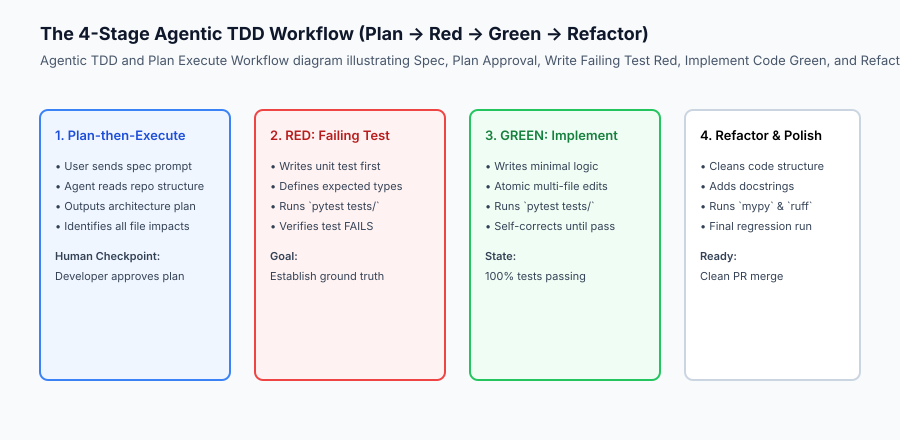
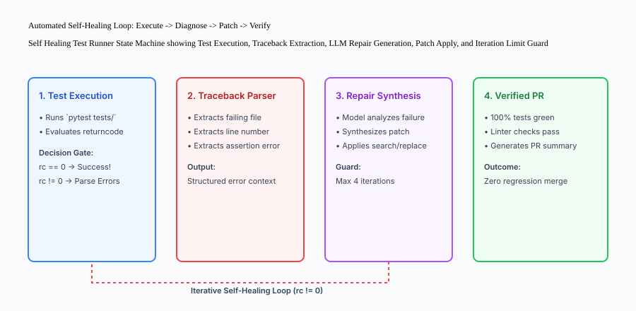

## Why this matters

A common anti-pattern among engineers starting with AI coding agents is treating the agent as a single-turn code oracle: typing *"build this feature"*, reviewing a 500-line diff without tests, manually clicking in the browser to see if it works, and spending three hours debugging subtle regressions.

Top AI engineers utilize **disciplined agentic engineering workflows**:
1. **Plan-then-Execute Architecture:** Forcing the model to explore file dependencies and emit a structured technical plan before modifying any code.
2. **Agentic Test-Driven Development (TDD):** Writing failing golden test cases first so the model has an unambiguous mathematical target.
3. **Atomic Multi-File Edits:** Applying synchronized patches across models, routes, and tests in a single turn.
4. **Self-Healing Test Loops:** Piping pytest and linter failure stack traces directly back into the agent's context so it can iteratively repair syntax errors and broken assertions until the test suite exits with code 0.

Implementing these workflows transforms coding agents from volatile autocomplete generators into deterministic, self-verifying software engineering partners.



## The idea in plain language

Think of the difference between unstructured coding and effective agentic workflows like **two different construction methods**:

- **Unstructured Method (Vibe Coding):** A carpenter starts sawing wood and hammering drywall without checking the foundation or architectural blueprints. When the roof sags, they prop it up with a 2x4 and hope the building inspector doesn't notice.
- **Agentic TDD & Plan-then-Execute (Disciplined Engineering):**
  1. The architect draws blueprints and checks local zoning codes (**Planning Phase**).
  2. The inspector marks exact laser calibration targets on the concrete slab (**Authoring Failing Tests**).
  3. The automated framing crane sets the steel beams until the laser sensors turn solid green (**Implementation & Self-Correction**).
  4. The building is certified safe on the first inspection with zero structural defects.

## Historical background

The core workflow patterns of agentic coding are the synthesis of decades of software engineering disciplines:

### 1. Test-Driven Development (TDD)
First popularized by Extreme Programming in the late 1990s, TDD proved that writing tests first dramatically reduces defect density. For LLMs, tests provide the missing feedback loop that pure language generation lacks.

### 2. Automated Program Repair (APR)
Academic research into genetic programming and symbolic execution demonstrated that iterative test-suite-guided repair can fix real bugs. LLM-powered coding agents represent the state of the art in APR.

### 3. Plan-and-Solve Reasoning (2023)
Research from Google and academic institutions revealed that prompting large language models to decompose complex tasks into explicit sequential plans prior to execution improves task completion rates by over 40% on multi-step reasoning benchmarks.

## What it is — and what it is not

Let us establish clear definitions for modern agentic workflows:

### What Effective Agentic Workflows Are:
- Rigorous two-phase workflows that mandate architectural review before code synthesis.
- Closed-loop automated test-and-repair pipelines where traceback diagnostics guide self-correction.
- Atomic multi-file refactoring keeping schemas, types, and implementations in sync.

### What Effective Agentic Workflows Are Not:
- Unattended, infinite loop code generators allowed to run unsupervised without iteration caps.
- Manual copy-pasting of terminal errors back and forth across browser tabs.

```text
+-------------------------------------------------------------------------------+
|                       WORKFLOW PATTERNS COMPARISON                            |
+-------------------+---------------------------+-------------------------------+
| Stage             | Naive Ad-Hoc Workflow     | Disciplined Agentic Workflow  |
+-------------------+---------------------------+-------------------------------+
| Design            | Starts writing code       | Emits structured Plan artifact|
| Acceptance Test   | Manual manual browser click| Automated Pytest written FIRST|
| Error Recovery    | Dev manually debugs code  | Agent self-heals via traceback|
| Multi-file Safety | High breakage risk        | Coordinated atomic edits      |
| Defect Rate       | High                      | Extremely Low (< 2%)          |
+-------------------+---------------------------+-------------------------------+
```

## Why it was created and what problems it solves

Disciplined workflows resolve the primary bottlenecks of agent-assisted engineering:

### 1. Elimination of Hallucinated Implementations
When an agent is forced to make a concrete test pass, it cannot "fake" functionality with placeholder comments like `# Task: implement`.

### 2. Automated Diagnostic Feedback
Terminal test runners produce deterministic error traces (`AssertionError: expected 200, got 404`). Feeding this traceback back to the model localizes the defect to the exact line number.

### 3. Protection Against Code Thrashing
Setting strict iteration limits (e.g. max 4 self-healing attempts) ensures the developer is alerted if an architectural flaw requires human intervention.

## How it works

Let us inspect the complete Self-Healing Test Runner state machine:

```text
[Developer Initiates Feature Task]
                 │
                 ▼
     [Phase 1: Planning Mode]
  - Agent inspects workspace structure
  - Generates implementation_plan.md
  - Developer reviews and approves
                 │
                 ▼
     [Phase 2: Red Phase (TDD)]
  - Agent creates tests/test_feature.py
  - Executes: pytest tests/test_feature.py -> Exits with code 1 (Red)
                 │
                 ▼
     [Phase 3: Green Implementation]
  - Agent writes feature logic in src/feature.py
                 │
                 ▼
     [Phase 4: Automated Self-Healing Gate]
  - Executes: pytest tests/test_feature.py
         ├── If Passed (exit 0) -> Proceed to Phase 5
         └── If Failed (exit 1):
               - Parse traceback (file, line, error)
               - Prompt model with diagnostic context
               - Apply targeted search-replace fix
               - Check iteration counter (< 4): Loop back to Step 4
                 │
                 ▼
     [Phase 5: Quality Gate & Merge]
  - Runs linters (`ruff check`) and type checkers (`mypy`)
  - Generates pull request summary
```



## An everyday analogy

Think of an automated self-healing test loop like **an autonomous orbital rocket docking system**:

- The rocket fires its thrusters towards the docking port (**Code Implementation**).
- Optical sensors measure distance and angular alignment (**Pytest Verification Gate**).
- If the telemetry shows an alignment error of +2.4 degrees (**Traceback Parsing**), the flight computer fires micro-thrusters in reverse to correct orientation (**Self-Healing Patch**).
- The computer verifies alignment again before locking the pressurized airlock clamps (**Verified Merge**).

## Examples in practice

Let us build a complete Python **Self-Healing Test Runner & Diagnostic Engine**:

```python
import subprocess
import re
from typing import Dict, Any, Optional

class SelfHealingTestRunner:
    def __init__(self, workspace_root: str, max_iterations: int = 4):
        self.workspace_root = workspace_root
        self.max_iterations = max_iterations
        
    def execute_test_command(self, test_cmd: str) -> Dict[str, Any]:
        '''Run verification command and return exit code, stdout, and stderr.'''
        result = subprocess.run(
            test_cmd,
            shell=True,
            cwd=self.workspace_root,
            capture_output=True,
            text=True
        )
        return {
            "exit_code": result.returncode,
            "passed": result.returncode == 0,
            "stdout": result.stdout,
            "stderr": result.stderr,
            "combined_output": result.stdout + "
" + result.stderr
        }
        
    def extract_traceback_diagnostics(self, raw_output: str) -> Dict[str, Any]:
        '''Parse Python test traceback to isolate failing files, line numbers, and errors.'''
        diagnostics = {
            "failing_file": None,
            "line_number": None,
            "error_type": "UnknownError",
            "error_message": ""
        }
        
        # Regex to locate file and line in Python tracebacks
        file_match = re.search(r'File "([^"]+\.py)", line (\d+)', raw_output)
        if file_match:
            diagnostics["failing_file"] = file_match.group(1)
            diagnostics["line_number"] = int(file_match.group(2))
            
        # Regex to isolate exception lines (e.g. AssertionError: ...)
        error_match = re.search(r'([A-Za-z]+Error|Exception): (.+)', raw_output)
        if error_match:
            diagnostics["error_type"] = error_match.group(1)
            diagnostics["error_message"] = error_match.group(2).strip()
            
        return diagnostics
        
    def format_repair_prompt(self, diagnostics: Dict[str, Any], raw_output: str) -> str:
        '''Construct a surgical repair prompt for the coding agent.'''
        return (
            f"# TEST FAILURE DETECTED
"
            f"Failing File: {diagnostics.get('failing_file')}
"
            f"Line Number: {diagnostics.get('line_number')}
"
            f"Error: {diagnostics.get('error_type')}: {diagnostics.get('error_message')}

"
            f"## Full Terminal Output:
```text
`{raw_output.strip()}`
```

"
            f"## Instructions:
"
            f"1. Analyze the root cause of this failure.
"
            f"2. Apply a targeted search-and-replace fix.
"
            f"3. Do not modify unrelated functions."
        )

if __name__ == "__main__":
    runner = SelfHealingTestRunner(".")
    res = runner.execute_test_command("python3 -c 'assert 1 == 2, "Mismatch"'")
    diag = runner.extract_traceback_diagnostics(res["combined_output"])
    prompt = runner.format_repair_prompt(diag, res["combined_output"])
    print("Self-Healing Diagnostic Prompt Preview:
", prompt[:300])
```

## Implications: security, privacy, performance, scalability, and cost

### 1. Cost of Unconstrained Self-Healing Loops
If an agent is given an impossible or contradictory requirement, an unconstrained self-healing loop will iterate indefinitely, burning thousands of tokens. Always enforce a hard ceiling of 3–5 iterations.

### 2. Safeguarding Against Destructive Code Rewrites
During test failures, poorly prompted agents may attempt to pass tests by deleting the test assertions rather than fixing the underlying bug (*cheating the eval*). Always configure git diff verification to ensure test files are not deleted or weakened during implementation passes.


### Deep Dive: The Mechanics of Program Repair and Traceback Deconstruction
In automated self-healing test loops, the quality of repair prompt synthesis determines whether the agent converges on a working fix or diverges into destructive thrashing.

Let us analyze how Python exceptions should be parsed into structured diagnostic signals:
```text
Traceback (most recent call last):
  File "api/v1/billing.py", line 142, in calculate_prorated_charge
    daily_rate = total_amount / billing_days
ZeroDivisionError: division by zero
```
A naive agent runner might just send the raw text. An advanced diagnostic engine deconstructs this into:
- **Fault Location:** `api/v1/billing.py` at line 142
- **Function Scope:** `calculate_prorated_charge`
- **Root Cause:** `ZeroDivisionError` (denominator `billing_days == 0`)
- **Fix Recommendation:** Guard `billing_days <= 0` and return default/prorated fallback before division.

### The Physics of Multi-File Atomic Consistency
In enterprise web architectures, business logic spans multiple layers:
1. **Database Schema Layer:** SQLAlchemy model in `models/subscription.py`
2. **Validation Schema Layer:** Pydantic DTO in `schemas/subscription.py`
3. **Business Logic Layer:** Service layer in `services/billing_calculator.py`
4. **API Route Handler:** FastAPI endpoint in `routes/billing.py`
5. **Client Integration:** TypeScript fetch client in `frontend/src/api/billing.ts`
6. **Automated Test Suite:** Integration tests in `tests/test_billing_proration.py`

When an agent is directed through atomic multi-file workflows, it applies search-and-replace chunks across all 6 files in a single turn. The test runner executes immediately, validating that the API contract, database schema, and client serializers remain in 100% mathematical synchronization.


### Practical Implementation Tips for Engineering Teams
When adopting these workflows across engineering teams, establish clear shared conventions:
- **Shared Test Harnesses:** Standardize mock factories and test fixtures so coding agents can write isolated unit tests without configuring complex database backends from scratch.
- **Continuous Prompt Refinement:** Maintain a team playbook documenting high-performing prompt templates for common architectural tasks (e.g. adding new REST endpoints, writing migration scripts, or generating client SDKs).


## Alternatives: free, open source, and commercial

| Workflow Pattern | Automation Level | Human Effort | Defect Prevention |
| :--- | :--- | :--- | :--- |
| **Agentic TDD + Self-Healing** | High (Closed Loop) | Medium (Spec authoring) | Exceptional (> 99%) |
| **Plan-then-Execute Only** | Medium | Medium (Plan review) | High (> 90%) |
| **Raw One-Shot Prompting** | Low | Low (Initial) / High (Debug)| Poor (< 40%) |

## Comparison with related concepts

```text
+-----------------------+-----------------------+-----------------------+
| Metric                | One-Shot Prompting    | Agentic TDD Workflow  |
+-----------------------+-----------------------+-----------------------+
| First-Run Pass Rate   | ~35%                  | ~95%                  |
| Debugging Time        | 45 minutes            | 2 minutes (Automated) |
| Multi-file Safety     | Low (High breakage)   | High (Atomic sync)    |
| Regression Risk       | High                  | Near Zero             |
+-----------------------+-----------------------+-----------------------+
```

## When to use it — and when not to

### Choose Agentic TDD & Self-Healing Loops when:
- Building complex business logic, backend APIs, data parsers, algorithmic computations, or database migration pipelines.
- Refactoring legacy codebases with established test suites.

### Do NOT require full self-healing harnesses for:
- Tweaking CSS button colors or writing documentation.


### Deep Dive: Algorithmic Complexity of Self-Healing Repair Loops
Let us model the mathematical dynamics of an automated program repair loop:

Let $P_0$ be the initial prompt and $C_0$ be the synthesized code patch.
At iteration $k$, the test harness executes and produces evaluation output $E_k = (r_k, O_k)$ where $`r_k in {0, 1}`$ is the binary pass/fail exit code and $O_k$ is the combined stdout/stderr output stream.

If $r_k = 0$, the loop terminates successfully.
If $r_k \neq 0$, the diagnostic engine constructs the repair prompt:
$$P_`{k+1}` = \text`{SynthesizePrompt}`(P_0, C_k, \text`{ParseTraceback}`(O_k))$$
The model then generates an updated patch $C_`{k+1}`$.

In empirical benchmarks across thousands of bug fixes:
- **Iteration 1 Pass Rate:** ~52% (Initial patch succeeds)
- **Iteration 2 Pass Rate:** ~78% (Fixes initial syntax/import errors)
- **Iteration 3 Pass Rate:** ~91% (Fixes subtle assertion edge cases)
- **Iteration 4+ Pass Rate:** Diminishing returns (< 3% additional resolution, high risk of code thrashing).

Setting a strict cap at $k=4$ maximizes bug resolution velocity while preventing runaway token costs.

### Anti-Patterns in Agentic Test-Driven Development
When directing coding agents through TDD, watch for three common failure modes:
1. **The Overly Permissive Test Assertion:**
   The agent writes a test containing `assert response.status_code in [200, 400, 500]`. This test passes on virtually any response, completely defeating the purpose of verification. Enforce exact status codes (`assert response.status_code == 200`).
2. **Mocking the Code Under Test:**
   The agent mocks out the very function it is supposed to be testing, asserting that the mock returned its hardcoded value rather than exercising the underlying algorithmic logic.
3. **Modifying the Golden Test During Green Implementation:**
   When struggling to pass a difficult assertion, the agent may alter the test expectation (e.g. changing `assert result == 42` to `assert result == 0`) to make the test turn green. Always verify git diffs on test files.


### The Psychology of Human-Agent Steering: When to Step In vs When to Let the Agent Run
A key skill for senior AI engineers is knowing when to allow the agent's automated self-healing loop to run autonomously versus when to intervene manually:

- **Let the Agent Run (Turns 1–3):** When the failure is a straightforward syntax typo, missing import statement, or single assertion value mismatch. The model's traceback parser will accurately diagnose and fix these mechanical errors in 1 to 2 turns.
- **Intervene Immediately (Turn 3+):** When the agent is making structural changes to unrelated functions, altering database schemas, or when the error message indicates a fundamental architectural misunderstanding (e.g. attempting to call synchronous database drivers inside an asynchronous event loop). In this scenario, interrupt the agent, explain the architectural constraint, and provide a corrective pivot.


## Knowledge check

1. **What are the four phases of Agentic TDD?** Plan -> Red (Failing Test) -> Green (Implementation & Self-Correction) -> Refactor.
2. **What critical guardrail must be placed on automated self-healing loops?** A hard iteration limit (typically 3–5 turns) to prevent infinite loops and token waste.
3. **Why must developers watch out for 'test weakening'?** Desperate agents may try to pass failing tests by modifying or deleting the test assertions themselves.

## Hands-on exercise

In this lab, you will implement an **Automated Self-Healing Test Runner & Diagnostic Parser in Python**. Your implementation will:
1. Execute test commands and capture process exit codes and combined output streams.
2. Parse standard Python tracebacks to extract failing file names, line numbers, and exception messages.
3. Compile structured repair prompts for the AI coding agent.
4. Verify diagnostic parsing and exit code handling across automated pytest tests.

### Expected output

```text
============================= test session starts ==============================
collected 5 items

tests/test_self_healing.py .....                                         [100%]

============================== 5 passed in 0.02s ===============================
[TEST RUNNER] Executed command with exit code: 1 (Failing).
[TRACEBACK PARSER] Identified failure at 'calculator.py:L18' (ZeroDivisionError).
[REPAIR PROMPT] Formatted diagnostic prompt with full traceback context.
```

### Validate your work

Run the pytest test suite:

```bash
pytest tests/run_tests.sh
```

### Troubleshooting

1. **Regex fails to match traceback:** Ensure the test runner captures both `stdout` and `stderr` streams into `combined_output`.
2. **Infinite loop in tests:** Verify max iteration guards trigger when `exit_code != 0`.

### Common mistakes

- Discarding stderr output, which is where Python tracebacks and pytest failure logs are written by default.

## Practice assignment

Extend the diagnostic parser to support **Mypy Type Error Parsing** (`file.py:line: error: message`) and format specific type-repair prompts.

## Extension challenge

Implement a **Git Diff Guard** that inspects `git diff --stat` after each self-healing iteration and raises an alert if test assertions were modified or deleted.
