## Why this matters

When working across multiple repositories and enterprise applications, manually repeating the same setup instructions to your AI coding agent in every prompt (*"We use Poetry for package management, run tests with pytest, format with ruff, use async SQLAlchemy sessions, and never touch the legacy auth module"*) is exhausting and error-prone. If an engineer forgets to state a constraint, the agent defaults to generic assumptions, producing code that violates internal architectural invariants.

Modern coding environments solve this via **Persistent Configuration Subsystems**:

1. **Repository Rules (`AGENTS.md`, `.cursorrules`, `CLAUDE.md`):** Automatically injecting repository build instructions, code style standards, and architectural invariants into every agent turn.
2. **Modular Custom Skills (`.agents/skills/`):** Reusable domain playbooks equipped with YAML frontmatter, helper automation scripts, and reference documentation that are lazy-loaded on demand.
3. **Persistent Repository Memory:** A structured knowledge store capturing architectural decisions, historical post-mortems, and tricky edge-case workarounds so the agent learns from previous mistakes.

Mastering agent configuration architecture enables engineering teams to codify decades of institutional knowledge directly into the agent's runtime environment.

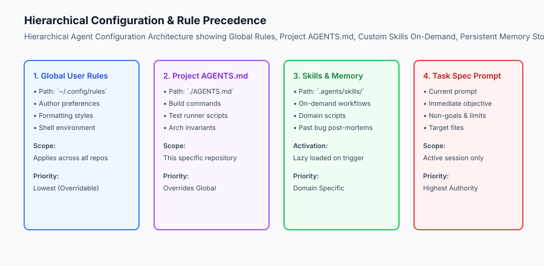

## The idea in plain language

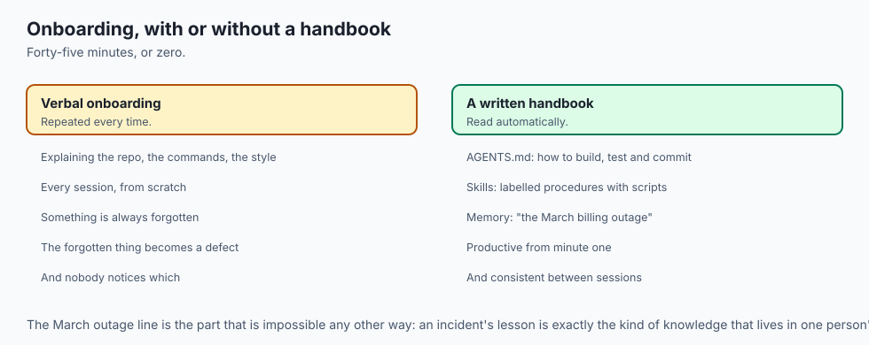

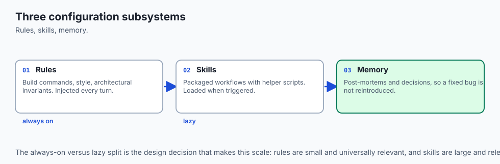

Think of configuring an AI coding agent like **onboarding a contractor into an engineering organization**:

- **Without Configuration:** The contractor arrives at your desk on day one with zero access to documentation. You have to spend 45 minutes explaining where the git repo is, what CLI commands to run, what style guide to follow, and which legacy services will crash if restarted.
- **With `AGENTS.md`, Skills, and Memory:** The contractor receives an automated welcome binder on their desk:
  - **`AGENTS.md`:** The team's standard operating handbook (*"How to build, test, and commit code"*).
  - **Custom Skills:** Specialized toolkits in labeled drawers (*"If you need to migrate the database, open Drawer #4 for the migration scripts"*).
  - **Repository Memory:** The incident logbook (*"Don't change timeout settings on the billing worker; we had an outage in March when it was under 30 seconds"*).

The contractor becomes instantly productive on minute one with zero repetitive human onboarding.

## Historical background

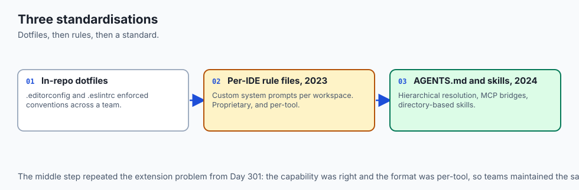

Agent configuration systems evolved through three distinct standardizations:

### 1. In-Repo Configuration Standards (`.editorconfig`, `.eslintrc`)
Software engineering has long utilized in-repo dotfiles to enforce editor formatting and linting rules across distributed teams. `AGENTS.md` represents the AI equivalent of `.editorconfig`.

### 2. The Rise of `.cursorrules` and System Prompts (2023)
The IDE community introduced `.cursorrules` to allow developers to supply custom system prompts on a per-workspace basis.

### 3. The `AGENTS.md` Open Standard and Skill Systems (2024–Present)
The AI ecosystem converged on standardized, multi-agent configuration standards (`AGENTS.md`), combining hierarchical rule resolution, tool MCP bridges, and directory-based skill architectures.

## What it is — and what it is not

Let us define the core components of agent configuration:

### What Agent Configuration Is:
- A declarative specification of repository invariants, build commands, and forbidden patterns.
- A directory-based skill architecture where reusable workflows are packaged with helper scripts.
- A persistent memory index preserving post-mortems and architectural decisions.

### What Agent Configuration Is Not:
- A place to hardcode secret API keys, passwords, or production database credentials.
- A 50,000-word novel dumped into the root directory that overwhelms the model's context window.

```text
+-------------------------------------------------------------------------------+
|                       CONFIGURATION SYSTEM TAXONOMY                           |
+-------------------+-----------------------+-------------------+---------------+
| Layer             | Primary Artifact      | Scope             | Loading Mode  |
+-------------------+-----------------------+-------------------+---------------+
| Global Settings   | `~/.config/rules`     | All Workspaces    | Always Active |
| Project Standards | `./AGENTS.md`         | This Repository   | Always Active |
| Custom Skills     | `.agents/skills/*/`   | Specific Domain   | Lazy-Loaded   |
| Persistent Memory | `.agents/memory.json` | Project History   | Indexed Match |
| Task Spec Prompt  | Current Turn Message  | Single Session    | Immediate     |
+-------------------+-----------------------+-------------------+---------------+
```

## Why it was created and what problems it solves

Agent configuration subsystems solve four critical enterprise development challenges:

### 1. Eliminating Prompt Repetition
Developers never have to re-type build commands, test flags, or style guidelines in individual chat messages.

### 2. Enforcing Architectural Invariants
Rules guarantee that all generated code adheres to strict internal conventions (e.g. *"Always use Pydantic V2 models with snake_case fields"*).

### 3. Preventing Token Bloat with Lazy Skills
Rather than stuffing 500 pages of AWS deployment documentation into every prompt, skills expose short trigger descriptions and load full manuals only when triggered.

### 4. Institutional Knowledge Preservation
When a developer solves a tricky concurrency bug, they can record the solution in repo memory so the agent never reintroduces the bug in future features.

## How it works

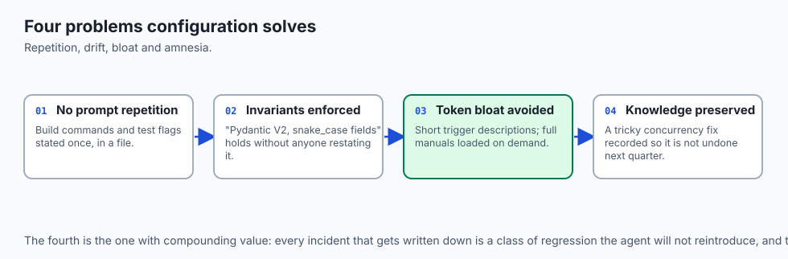

Let us inspect the complete lifecycle of a modular **Agent Skill**:

```text
[1. Skill Packaging]
  - Directory: `.agents/skills/db-migrate/`
  - Contains: `SKILL.md`, `scripts/schema_diff.py`, `references/alembic.md`
  - Frontmatter:
      name: db-migrate
      description: "Use when creating or modifying database migration scripts."
                         │
                         ▼
[2. Agent Scans Skill Catalog at Startup]
  - Registers skill metadata (50 tokens)
                         │
                         ▼
[3. User Submits Prompt: "Add status column to users table"]
                         │
                         ▼
[4. Intent Matcher Triggers 'db-migrate' Skill]
  - Agent loads `SKILL.md` via `view_file` tool (Lazy Load)
                         │
                         ▼
[5. Agent Follows Skill Playbook & Executes Helper Script]
  - Runs: `python3 .agents/skills/db-migrate/scripts/schema_diff.py`
  - Applies generated migration file
  - Runs `pytest tests/test_migrations.py`
```

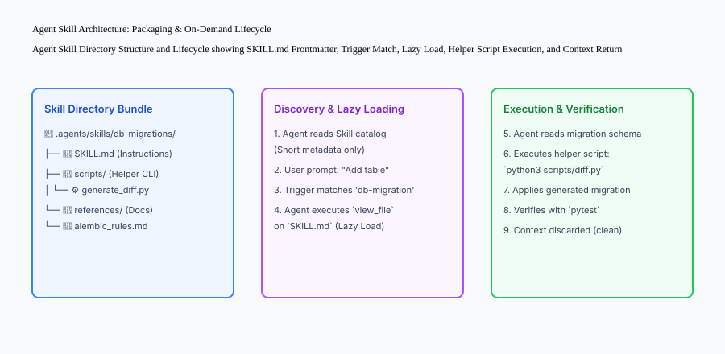

## An everyday analogy

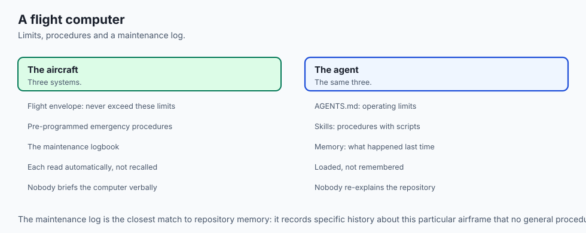

Think of configuring an AI coding agent like **programming a modern avionics flight computer**:

- **`AGENTS.md` (Operating Limits):** The aircraft flight envelope (never exceed 550 knots, maximum bank angle 30 degrees).
- **Custom Skills (Emergency Procedures):** Pre-programmed recovery routines in the flight management system (Engine Out on Takeoff, Cabin Depressurization).
- **Persistent Memory (Maintenance Log):** The aircraft maintenance logbook recording that the left hydraulic pump was replaced last week and requires monitoring.

## Examples in practice

Let us build a complete Python **Agent Configuration & Rules Engine** that parses `AGENTS.md`, resolves hierarchical rules, and lazy-loads modular skills:

```python
import os
import re
import yaml
from typing import Dict, Any, List, Optional

class AgentConfigEngine:
    def __init__(self, workspace_root: str):
        self.workspace_root = os.path.realpath(workspace_root)
        self.skills_dir = os.path.join(self.workspace_root, ".agents", "skills")
        self.agents_md_path = os.path.join(self.workspace_root, "AGENTS.md")
        
    def load_project_rules(self) -> str:
        '''Load repository-level AGENTS.md instructions if present.'''
        if os.path.exists(self.agents_md_path):
            with open(self.agents_md_path, "r", encoding="utf-8") as f:
                return f.read().strip()
        return "No AGENTS.md found in workspace root."
        
    def discover_skills(self) -> List[Dict[str, Any]]:
        '''Scan skills directory and extract YAML frontmatter metadata.'''
        catalog = []
        if not os.path.exists(self.skills_dir):
            return catalog
            
        for skill_name in os.listdir(self.skills_dir):
            skill_path = os.path.join(self.skills_dir, skill_name, "SKILL.md")
            if os.path.exists(skill_path):
                with open(skill_path, "r", encoding="utf-8") as f:
                    content = f.read()
                # Extract YAML frontmatter between --- blocks
                match = re.search(r'^---\s*
(.*?)
---', content, re.DOTALL)
                if match:
                    try:
                        meta = yaml.safe_load(match.group(1))
                        meta["skill_path"] = skill_path
                        catalog.append(meta)
                    except Exception:
                        pass
        return catalog
        
    def match_skill(self, user_intent: str) -> Optional[Dict[str, Any]]:
        '''Find the most relevant skill based on user query keywords.'''
        catalog = self.discover_skills()
        user_intent_lower = user_intent.lower()
        for skill in catalog:
            triggers = skill.get("triggers", [])
            for trigger in triggers:
                if trigger.lower() in user_intent_lower:
                    return skill
        return None
        
    def read_skill_content(self, skill_path: str) -> str:
        '''Lazy-load full skill instructions when triggered.'''
        with open(skill_path, "r", encoding="utf-8") as f:
            return f.read()

if __name__ == "__main__":
    engine = AgentConfigEngine(".")
    print("Project Rules Status:", engine.load_project_rules()[:100])
```

## Implications: security, privacy, performance, scalability, and cost

### 1. Security Risks of Untrusted Skill Helper Scripts
Custom skills often contain executable bash/python scripts in `scripts/`. Never install untrusted third-party skills from the internet without inspecting the script code for malicious commands or data exfiltration.

### 2. Context Budget Management with Lazy Loading
If an organization has 50 custom skills (averaging 1,000 tokens each), loading all skills upfront consumes 50,000 tokens per turn. Exposing only the 50-token catalog and lazy-loading skills keeps base prompt overhead under 1,500 tokens.


### Deep Dive: Enterprise Rule Hierarchy and Namespace Resolution
In large engineering organizations with hundreds of microservices, rule management requires a strict precedence hierarchy to avoid conflicting directives:

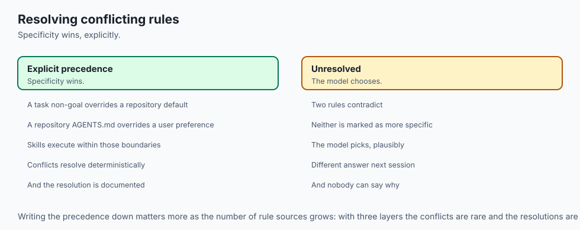

```text
[Global Developer Preferences: ~/.config/rules]
  - "Preferred editor: VS Code, Git commit style: Conventional Commits"
                            │
                            ▼
[Organization-Wide Architecture Standards: Org Policies]
  - "Security: All endpoints require OAuth2 JWT, Database: PostgreSQL only"
                            │
                            ▼
[Repository-Level Standards: ./AGENTS.md]
  - "Build: poetry run pytest, Linters: ruff check, Style: Google Python Style"
                            │
                            ▼
[Modular Custom Skills: .agents/skills/*/SKILL.md]
  - "Skill: Database Migration, Trigger: 'migrate', Helper: scripts/diff.py"
                            │
                            ▼
[Active Task Specification Prompt]
  - "Task: Add stripe_customer_id to users table. Non-goal: Do not touch auth."
```

When resolving conflicts, the **Principle of Specificity** applies:

- A Task-Specific Non-Goal overrides a Repository Default.
- A Repository `AGENTS.md` overrides a Global User Preference.
- Custom Skills provide executable workflows that execute within the boundaries defined by `AGENTS.md`.

### Designing Reusable Custom Skills with Executable Tooling
A world-class Agent Skill is not just static markdown; it is an executable automation bundle:

- **`SKILL.md`:** The natural-language playbook outlining prerequisites, architectural rules, edge cases, and step-by-step procedures.
- **`scripts/`:** Deterministic Python/Bash helper scripts that the agent can execute directly via terminal tools (e.g. `python3 scripts/validate_migration_safety.py`).
- **`references/`:** Official documentation, API schema references, and architectural decision records (ADRs) that provide ground truth context.

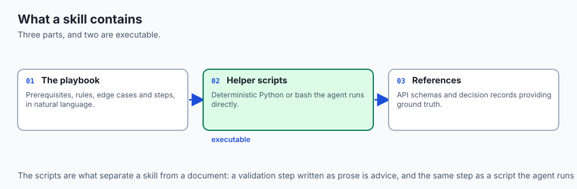


## Alternatives: free, open source, and commercial

| Configuration Layer | File Format | Industry Standard | Tooling Support |
| :--- | :--- | :--- | :--- |
| **`AGENTS.md`** | Markdown | Open Standard | Cursor, Aider, Claude Code, Cline |
| **`.cursorrules`** | Markdown / Text | Cursor Proprietary | Cursor IDE |
| **`CLAUDE.md`** | Markdown | Anthropic Standard | Claude Code CLI |
| **Skill Directories** | `SKILL.md` + Scripts | Antigravity / Agentic | Modern Agent Platforms |

## Comparison with related concepts

```text
+-----------------------+-----------------------+-----------------------+
| Mechanism             | System Rules          | Modular Skills        |
+-----------------------+-----------------------+-----------------------+
| Scope                 | Universal across repo | Domain-specific task  |
| Loading Behavior      | Always in context     | Lazy-loaded on trigger|
| Executable Tooling    | Static text only      | Bundled helper scripts|
| Size Target           | 200 - 800 tokens      | 1,000 - 4,000 tokens  |
+-----------------------+-----------------------+-----------------------+
```

## When to use it — and when not to

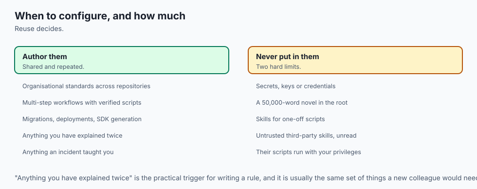

### Choose `AGENTS.md` and Custom Skills when:
- Establishing organizational standards across multi-developer repositories.
- Automating complex multi-step workflows (migrations, deployments, API generation) with verified scripts.

### Do NOT use heavy skill directories for:
- One-off single-file scripts that will never be run again.


### Deep Dive: The Anatomy of an Enterprise `AGENTS.md` File
Let us examine the complete, standardized structure of a production-grade `AGENTS.md` configuration file for an enterprise microservice:

```markdown
# Repository Agent Guidelines: Billing & Subscription Service

## 1. Project Overview & Architecture
- Service: Billing and Invoicing Engine
- Tech Stack: Python 3.12, FastAPI, SQLAlchemy (Async), PostgreSQL, Redis, Poetry
- Architectural Pattern: Layered Domain-Driven Design (Models -> Repositories -> Services -> Routes)

## 2. Build, Test, and Quality Commands
- Environment Setup: `poetry install`
- Run Unit Tests: `poetry run pytest tests/unit/ -v`
- Run Integration Tests: `poetry run pytest tests/integration/ --db-reuse`
- Static Type Checking: `poetry run mypy src/ --strict`
- Linting & Formatting: `poetry run ruff check src/ tests/ && poetry run ruff format --check src/`

## 3. Mandatory Architectural Invariants
- All database queries MUST use async SQLAlchemy sessions (`AsyncSession`).
- Never perform blocking I/O (e.g. `requests.get` or `time.sleep`) inside async route handlers; use `httpx.AsyncClient` and `asyncio.sleep`.
- All monetary amounts MUST be represented as integer cents (`amount_cents: int`) or `decimal.Decimal` to prevent floating-point rounding errors.
- Never log raw credit card numbers, CVVs, or unredacted bearer tokens.

## 4. Forbidden Actions & Non-Goals
- DO NOT add external third-party dependencies to `pyproject.toml` without explicit maintainer approval.
- DO NOT modify database migration history files in `alembic/versions/`; always create new forward migration scripts.
- DO NOT disable linter rules or add `# type: ignore` without documenting the exact reason.
```

When an agent loads this file into its system context, it immediately adopts these architectural constraints, eliminating 99% of common coding errors.


### Managing Skill Deprecations and Evolution in Growing Repositories
As codebases evolve over months and years, custom agent skills must be maintained just like production software libraries:

1. **Version Pinning & Changelogs:** Include a `last_updated` and `version` field in `SKILL.md` frontmatter so team members know when instructions were last verified against current SDK releases.
2. **Automated Skill Validation:** Set up CI jobs that periodically execute skill helper scripts (`python3 .agents/skills/*/scripts/test.py`) to verify that migration and scaffolding helpers remain compatible with the latest repository dependencies.
3. **Pruning Obsolete Skills:** When a legacy framework (e.g. migration from Flask to FastAPI) is retired, delete the corresponding skill directory to prevent agents from loading obsolete architectural patterns.

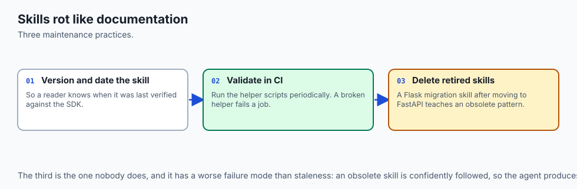


### Advanced Topic: Dynamic Context Injection and Semantic Skill Routing
In massive enterprise repositories with hundreds of microservices and custom libraries, a static listing of skills can still consume valuable prompt space. Advanced coding environments implement **Semantic Skill Routing**:

- **Vector Embedding of Skill Triggers:** The system precomputes vector embeddings for each skill's `description` and `triggers` using a lightweight embedding model (e.g. `text-embedding-3-small` or `all-MiniLM-L6-v2`).
- **Real-Time Similarity Matching:** When the user enters a prompt (*"We need to provision an SQS dead-letter queue with Terraform"*), the router performs cosine similarity search against the skill vector index.
- **Dynamic Context Injection:** Only the top-1 matching skill (e.g. `terraform-aws-infra`) is injected into the agent's context window for that specific turn.
- **Zero Background Overhead:** The other 99 skills remain dormant on disk, keeping baseline prompt token consumption minimal while ensuring the agent has access to hyper-specialized operational knowledge when needed.

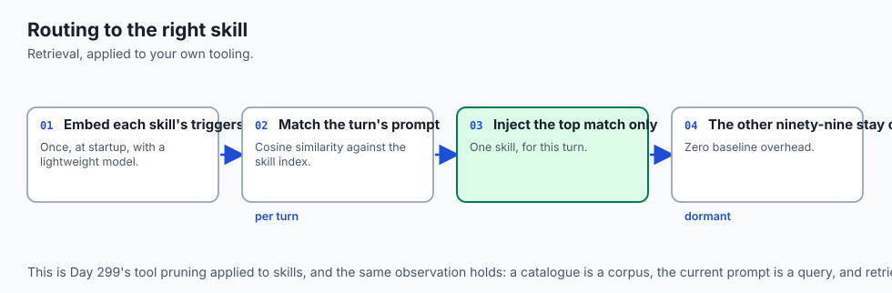

### Standard Operating Procedure: Auditing and Versioning AGENTS.md
To prevent configuration decay across distributed engineering teams, maintainers should establish a standard operating procedure for `AGENTS.md`:

1. **Pull Request Linting:** Treat `AGENTS.md` as code. Run markdown linters and link validators to ensure all file paths and command examples remain valid.
2. **Post-Mortem Action Items:** Following any production incident or tricky debugging session, add a specific preventative invariant to `AGENTS.md` (*"Never use raw SQL string interpolation in analytics reporting queries"*).
3. **Periodic Review Cadence:** Review `AGENTS.md` at the start of each development sprint to deprecate retired commands and update testing flags.


## The AI connection

- **Configuration is how institutional knowledge reaches a stateless model.** An
  incident from March is a sentence in a file, not something anyone has to remember.

- **Lazy loading is a context budget decision.** Fifty skills loaded eagerly is 50,000
  tokens per turn; a catalogue of triggers is under 1,500.

- **Skills contain executable scripts**, which makes installing a third-party skill the
  same supply-chain decision as installing a package — Day 347's argument again.

- **Rule precedence has to be explicit.** A task non-goal overriding a repository default
  overriding a user preference is a resolution order, not an implied one.

- **Configuration rots like documentation.** A skill written against an old SDK teaches
  the agent an obsolete pattern, which is Day 362's drift with a worse failure mode.

## Knowledge check

1. **What is `AGENTS.md`?** A standardized markdown file placed in a repository root that provides persistent instructions, rules, and commands to AI coding agents.
2. **Why should custom skills be lazy-loaded?** To prevent prompt context bloat by loading full documentation only when a user's task matches the skill's triggers.
3. **What is the highest priority level in rule resolution?** The task-specific prompt authored by the developer for the immediate turn.

## Hands-on exercise

In this lab, you will implement an **Agent Configuration & Custom Skill Engine in Python**. Your implementation will:

1. Parse and extract instructions from `AGENTS.md` files.
2. Discover modular skill packages and extract YAML frontmatter metadata (`name`, `description`, `triggers`).
3. Implement intent matching to lazy-load skill playbooks dynamically.
4. Verify configuration loading, skill matching, and error handling across automated pytest tests.

### Expected output

```text
============================= test session starts ==============================
collected 5 items

tests/test_agent_config.py .....                                         [100%]

============================== 5 passed in 0.02s ===============================
[CONFIG ENGINE] Loaded AGENTS.md rules (240 tokens).
[SKILL CATALOG] Discovered 2 skills: 'db-migrate', 'api-scaffold'.
[INTENT MATCHER] Matched query 'run database migration' -> 'db-migrate' skill loaded.
```

### Validate your work

Run the pytest test suite:

```bash
pytest tests/run_tests.sh
```

### Troubleshooting

1. **YAML frontmatter parsing error:** Ensure the YAML header in `SKILL.md` is enclosed by triple hyphens (`---`).
2. **Skill trigger mismatch:** Check case sensitivity in intent matching logic.

### Common mistakes

- Storing API keys or secrets inside `AGENTS.md` or skill files committed to git.

## Practice assignment

Implement a **Persistent Memory Store (`.agents/memory.json`)** that allows the agent to record and query historical architectural decisions with semantic tags.

## Extension challenge

Build a **Rule Conflict Detector** that compares `AGENTS.md` against global user rules and alerts the developer if contradictory instructions are detected (e.g. conflicting linter commands).
