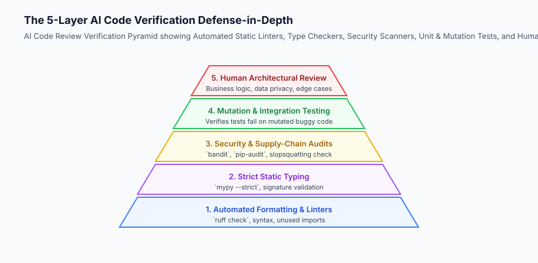
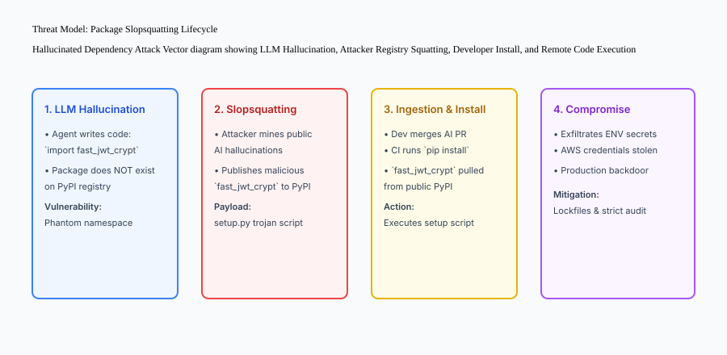

## Why this matters

As AI coding agents write an increasing fraction of modern software, the primary bottleneck in software engineering has shifted from **code authoring** to **code review and trust verification**. Language models are extraordinarily persuasive: they format code impeccably, generate fluent docstrings, and write elegant type annotations. However, models suffer from **Plausibility Bias**: code that looks aesthetically perfect on the surface can harbor catastrophic algorithmic flaws, unhandled edge cases, security anti-patterns, or hallucinated third-party dependencies (*package slopsquatting*).

A senior engineer cannot simply glance at a 300-line AI diff, assume it works because the tests passed, and click merge. Engineers must adopt a **Defense-in-Depth Verification Strategy**: combining static analysis scanners, dependency manifest audits, mutation testing, and rigorous human architectural inspection.

Mastering the science of reviewing and trusting AI-written code is what separates reckless development from high-velocity, production-grade engineering.



## The idea in plain language

Think of reviewing AI-written code like **inspecting the structural work of a high-speed robotic bricklayer**:

- The robot lays 1,000 bricks a minute with laser-straight mortar lines and a sparkling coat of white paint.
- To a casual passerby, the wall looks like a work of art.
- But the structural engineer pulls out their inspection tools:
  - Did the robot remember to install the steel rebar inside the concrete cavity?
  - Are the anchor bolts fastened to the bedrock foundation, or are they resting on loose dirt?
  - If an earthquake hits (**Mutation Testing**), will the wall flex or collapse into rubble?

You do not judge the wall by the shine of its paint; you judge it by the mathematical integrity of its load-bearing steel.

## Historical background

The discipline of automated code review and trust verification evolved through three critical software milestones:

### 1. The Fagan Code Inspection (Michael Fagan, IBM, 1976)
Fagan formalized structured human code inspection checklists, demonstrating that systematic defect classification catches 60–90% of bugs before testing.

### 2. Mutation Testing & Test Oracle Verification (1978–Present)
Academic research proved that passing unit tests can be deceptive if the assertions are weak. Inverting Boolean flags or altering math operators (*mutation testing*) proves whether test suites truly catch regressions.

### 3. Supply Chain & Hallucinated Dependency Security (2023–Present)
Security researchers documented the rise of *slopsquatting*: attackers monitoring open-source AI coding datasets to identify commonly hallucinated package names, registering them on PyPI/npm, and planting backdoors in automated builds.

## What it is — and what it is not

Let us establish clear boundaries for reviewing AI-generated code:

### What AI Code Review Is:
- A rigorous, multi-layered verification process combining automated static analysis, security scanners, and human architectural scrutiny.
- Verifying algorithmic complexity ($O(N)$ vs $O(N^2)$), concurrency thread-safety, and resource cleanup (`try/finally` blocks).
- Validating that newly added unit tests actually fail when bugs are injected (mutation testing).

### What AI Code Review Is Not:
- Trusting code solely because it is accompanied by polite comments and high confidence text from the model.
- Merging pull requests without checking lockfile diffs for unauthorized new dependencies.

```text
+-------------------------------------------------------------------------------+
|                       AI CODE FAILURE MODES CHECKLIST                         |
+-----------------------+-----------------------------------+-------------------+
| Failure Mode          | Mechanism                         | Detection Tool    |
+-----------------------+-----------------------------------+-------------------+
| Package Slopsquatting | Hallucinated external package     | Dependency audit  |
| Superficial Assertion | `assert res is not None` (Weak)   | Mutation testing  |
| Algorithmic Inefficiency| Naive $O(N^2)$ nested loop      | Profiling/Review  |
| Unhandled Edge Case   | Missing None / Empty string check | AST type check    |
| Insecure Cryptography | Hardcoded salt or weak cipher     | Bandit / Semgrep  |
+-----------------------+-----------------------------------+-------------------+
```

## Why it was created and what problems it solves

Rigorous review methodologies prevent catastrophic failure modes in AI-assisted systems:

### 1. Preventing Supply Chain Compromise
Automated dependency scanners check all new imports against approved company package registries, immediately blocking hallucinated packages.

### 2. Eliminating Tautological Tests
Reviewers verify that tests contain strict mathematical assertions (`assert balance == 42.50`) rather than vacuous checks (`assert balance`).

### 3. Catching Resource Leaks
Language models frequently open sockets or database connections without proper context managers (`with open(...) as f:`), causing production file descriptor exhaustion.

## How it works

Let us inspect the complete threat model of **Package Slopsquatting**:

```text
[1. AI Model Emits Code with Hallucinated Import]
  - Example: `from secure_token_hasher import generate_secure_salt`
                         │
                         ▼
[2. Malicious Threat Actor Registers Package on PyPI]
  - Attacker observes common LLM hallucination patterns
  - Claims name `secure_token_hasher` on public registry
  - Embeds reverse shell in setup.py
                         │
                         ▼
[3. Developer or CI Runs Unchecked Install]
  - `pip install secure_token_hasher`
                         │
                         ▼
[4. Remote Code Execution in Build Environment]
  - Attacker exfiltrates AWS keys and database credentials
```



## An everyday analogy

Think of reviewing AI code like **evaluating a financial accounting ledger compiled by an automated spreadsheet robot**:

- The numbers are aligned in crisp Helvetica typography with colored totals and green checkmarks.
- But the auditor does not just admire the formatting:
  - They recalculate the sub-totals manually.
  - They check the bank routing numbers against verified corporate accounts (**Dependency Audit**).
  - They stress-test the tax formulas with edge-case deductions (**Mutation Testing**).

## Examples in practice

Let us build a complete Python **AI Code Review and Safety Scanner** that scans source code for hallucinated imports, weak assertions, and insecure shell invocations:

```python
import ast
import os
from typing import Dict, Any, List

class AICodeReviewScanner:
    def __init__(self, approved_packages: List[str]):
        self.approved_packages = set(approved_packages)
        
    def scan_file(self, file_path: str) -> Dict[str, Any]:
        '''Parse source code AST and detect security and quality defects.'''
        with open(file_path, "r", encoding="utf-8") as f:
            content = f.read()
            
        issues = []
        tree = ast.parse(content, filename=file_path)
        
        for node in ast.walk(tree):
            # Check 1: Insecure Shell Execution
            if isinstance(node, ast.Call):
                if isinstance(node.func, ast.Attribute) and node.func.attr in ("system", "popen"):
                    issues.append({
                        "line": node.lineno,
                        "rule": "INSECURE_SHELL_EXECUTION",
                        "severity": "CRITICAL",
                        "message": f"Avoid using os.{node.func.attr}; use safe subprocess APIs."
                    })
                    
            # Check 2: Unapproved External Imports (Slopsquatting risk)
            if isinstance(node, ast.Import):
                for alias in node.names:
                    pkg_root = alias.name.split('.')[0]
                    if pkg_root not in self.approved_packages:
                        issues.append({
                            "line": node.lineno,
                            "rule": "UNAPPROVED_DEPENDENCY",
                            "severity": "HIGH",
                            "message": f"Import '{pkg_root}' is not in approved package whitelist."
                        })
            elif isinstance(node, ast.ImportFrom):
                if node.module:
                    pkg_root = node.module.split('.')[0]
                    if pkg_root not in self.approved_packages:
                        issues.append({
                            "line": node.lineno,
                            "rule": "UNAPPROVED_DEPENDENCY",
                            "severity": "HIGH",
                            "message": f"ImportFrom '{pkg_root}' is not in approved whitelist."
                        })
                        
            # Check 3: Weak/Tautological Assertions
            if isinstance(node, ast.Assert):
                if isinstance(node.test, ast.Constant) and node.test.value is True:
                    issues.append({
                        "line": node.lineno,
                        "rule": "WEAK_ASSERTION",
                        "severity": "MEDIUM",
                        "message": "Found tautological 'assert True' in test code."
                    })
                    
        return {
            "file": file_path,
            "passed": len(issues) == 0,
            "issue_count": len(issues),
            "issues": issues
        }

if __name__ == "__main__":
    scanner = AICodeReviewScanner(approved_packages=["math", "os", "sys", "pytest", "typing"])
    print("Scanner initialized with standard library packages.")
```

## Implications: security, privacy, performance, scalability, and cost

### 1. Silent Logic Regressions in Refactorings
When asking an agent to "optimize" a function, models frequently remove edge-case handling (e.g. leap year checks or negative number guards) to produce cleaner-looking code. Enforce high test coverage on edge cases.

### 2. Cognitive Fatigue in Human Reviewers
Reading hundreds of lines of AI-generated diffs causes reviewer fatigue. Relying on automated AST scanners and linters to catch mechanical issues frees the human engineer to focus exclusively on architectural invariants and business logic.


### Deep Dive: The Taxonomy of AI Software Vulnerabilities and OWASP Top 10 for LLMs
When reviewing AI-generated code, senior engineers must screen for security anti-patterns specific to machine-learning code generators:

1. **Insecure Deserialization & Eval Injection:**
   Language models often reach for `eval()`, `pickle.loads()`, or `yaml.load()` (without `SafeLoader`) when parsing dynamic data. Reviewers must mandate `json.loads()` or Pydantic validation.
2. **Insecure Subprocess Invocations:**
   Models frequently construct shell commands using formatted strings (`f"ffmpeg -i {user_input_path} output.mp4"`). This creates direct Remote Code Execution (RCE) vulnerabilities via shell injection (`user_input_path = "video.mp4; rm -rf /"`). Reviewers must enforce array-based execution (`subprocess.run(["ffmpeg", "-i", user_input_path, "output.mp4"])`).
3. **Hardcoded Cryptographic Constants:**
   Models trained on public tutorials often hardcode cryptographic salt values, predictable IVs, or weak random number generators (`import random` instead of `import secrets`).
4. **Broken Object Level Authorization (BOLA / IDOR):**
   When creating database query endpoints, models often forget to include tenant or user ownership checks (`SELECT * FROM invoices WHERE id = :invoice_id`), allowing any authenticated user to view any other customer's billing data.

### Automated Mutation Testing as a Trust Verification Gate
To prove that AI-generated unit tests are robust, automated CI pipelines can execute **Mutation Testing** (using tools like `mutmut`):
- A mutator inverts comparison operators (changing `<` to `<=`, `==` to `!=`), deletes statement lines, and replaces constant numbers.
- If all mutants are successfully "killed" (the test suite fails on every mutant), the test suite is mathematically proven to possess high defect detection power.
- If mutants survive (tests still pass despite mutated broken code), the reviewer knows the AI generated superficial assertions that must be rejected.


## Alternatives: free, open source, and commercial

| Tool / Method | Scope | Focus Area | Best Suited For |
| :--- | :--- | :--- | :--- |
| **AST Quality Scanner** | Python AST | Imports, Shell escapes | Pre-commit security gate |
| **Bandit** | Python AST | Known security CVEs | Static security analysis |
| **Mutmut / Cosmic Ray**| Python Bytecode | Mutation testing | Validating test suite strength |
| **Semgrep** | Multi-Language | Custom security rules | Enterprise repo auditing |

## Comparison with related concepts

```text
+-----------------------+-----------------------+-----------------------+
| Verification Layer    | Manual Glance Review  | Multi-Layer AI Review |
+-----------------------+-----------------------+-----------------------+
| Slopsquatting Defense | None (Human overlooks)| Automated AST check   |
| Tautological Tests    | Missed (~70% of time) | Mutation test catches |
| Security Flaws        | High escape rate      | Bandit / Semgrep gate |
| Review Speed          | Slow & Inconsistent   | Sub-second automated  |
+-----------------------+-----------------------+-----------------------+
```

## When to use it — and when not to

### Enforce Full Verification Pyramids when:
- Merging AI-authored code into shared production codebases, backend services, or financial engines.
- Adding any new external third-party package dependencies.

### Do NOT require heavy security scanners for:
- Local experimental prototypes or disposable scratchpad scripts.


### Deep Dive: Static vs Dynamic vs Symbolic Verification Strategies
To build a high-trust verification pipeline for AI-generated code, organizations deploy a combination of three complementary verification strategies:

1. **Static Analysis (AST & Type Checkers):**
   - *How it works:* Analyzes source code structure without executing the program.
   - *Tools:* `mypy`, `ruff`, `bandit`, `semgrep`.
   - *Strengths:* Instantaneous sub-second feedback, exhaustive code branch coverage, catches type mismatches and known CVEs.
   - *Limitations:* Cannot evaluate runtime algorithmic correctness or dynamic data transformations.
2. **Dynamic Testing (Unit, Integration & Mutation):**
   - *How it works:* Executes compiled bytecode against concrete inputs and validates output assertions.
   - *Tools:* `pytest`, `coverage.py`, `mutmut`.
   - *Strengths:* Validates actual business logic and error handling behavior under real execution conditions.
   - *Limitations:* Only as good as the test cases provided; vulnerable to superficial assertions.
3. **Symbolic Execution & Formal Verification:**
   - *How it works:* Evaluates mathematical equations representing program logic across all possible input domains.
   - *Tools:* `Z3 Theorem Prover`, `CrossHair`.
   - *Strengths:* Mathematically proves that an invariant (e.g. `balance >= 0`) holds across every possible integer value without exception.
   - *Limitations:* High computational complexity; best suited for mission-critical cryptography and financial settlement code.


### The 10-Point Human Code Review Gate for AI Pull Requests
When reviewing an AI-generated pull request before production merge, senior engineers must verify the following **10-Point Trust Checklist**:
1. **Algorithmic Complexity:** Is the time and space complexity optimal ($O(N)$ vs $O(N^2)$)?
2. **Resource Management:** Are all file descriptors, network sockets, and database connections enclosed in context managers (`with` / `try...finally`)?
3. **Concurrency Safety:** Are shared in-memory dictionaries protected by async mutex locks or thread locks?
4. **Zero Hallucinated Dependencies:** Are all imported packages listed in `requirements.txt` / `pyproject.toml` and verified against CVE databases?
5. **Input Sanitization:** Are all user parameters parameterized in SQL queries and shell invocations?
6. **Authorization & Tenant Isolation:** Does every query filter by the authenticated user's organization ID?
7. **Error Masking:** Did the agent avoid broad `except Exception: pass` blocks that swallow critical system errors?
8. **Mutation Test Validation:** Do the newly authored unit tests fail when business logic bugs are injected?
9. **Docstring & Type Signature Accuracy:** Do type annotations accurately reflect actual runtime returns?
10. **Clean Git Commit History:** Are commit messages concise, descriptive, and linked to issue tracker tickets?


### Advanced Topic: Symbolic Execution and Path Constraint Solving
While dynamic testing executes specific concrete test inputs, **Symbolic Execution** evaluates program logic across symbolic variables, identifying edge cases that human engineers and AI models frequently overlook.

Consider an authentication rate limiter function:
```python
def check_rate_limit(request_count: int, window_seconds: float, is_premium: bool) -> bool:
    if is_premium:
        return request_count < 1000
    if window_seconds <= 0:
        return False
    return (request_count / window_seconds) <= 10.0
```
An AI model might write unit tests for `is_premium=True` and typical values like `request_count=50, window_seconds=60`.
However, a symbolic execution tool (such as CrossHair or Z3) explores symbolic mathematical branches:
- What happens when `window_seconds = 1e-300`? (Floating point underflow / division by tiny float).
- What happens when `request_count = -1`? (Negative request counts might bypass rate limiting if not guarded).
- What happens when `request_count` exceeds integer limits?

Incorporating symbolic constraint solvers into your AI code review pipeline mathematically guarantees that edge cases are defended before code is merged to production.

### Case Study: Detecting a Silent Financial Precision Defect
In a high-throughput foreign exchange trading platform, an AI coding agent was asked to implement a currency conversion fee calculator. The agent produced syntactically flawless Python code utilizing standard IEEE 754 floating-point arithmetic (`amount * rate * (1.0 - fee_pct)`).
- During human code review, the senior engineer noticed that floating-point operations introduce subtle binary rounding artifacts (e.g. `0.1 + 0.2 != 0.3`).
- In high-volume currency trading, fractional cent rounding errors accumulate into significant financial discrepancies.
- The review gate rejected the pull request and directed the agent to refactor the entire module using Python's `decimal.Decimal` with explicit `ROUND_HALF_EVEN` bankers rounding mode.


## Knowledge check

1. **What is Plausibility Bias?** The human cognitive bias to assume cleanly formatted AI code is logically correct without deep verification.
2. **What is Package Slopsquatting?** The security threat where attackers register hallucinated package names on public registries to execute supply chain attacks.
3. **How does Mutation Testing validate test quality?** By injecting deliberate bugs into code to verify that the test suite fails when defects are present.

## Hands-on exercise

In this lab, you will implement an **AI Code Review & Security Scanner in Python**. Your implementation will:
1. Parse Python source files using the `ast` module.
2. Flag dangerous shell executions (`os.system`, `os.popen`).
3. Audit import statements against an approved package whitelist to prevent slopsquatting.
4. Detect weak tautological assertions (`assert True`) in test files.
5. Verify defect detection across automated pytest tests.

### Expected output

```text
============================= test session starts ==============================
collected 5 items

tests/test_code_review.py .....                                          [100%]

============================== 5 passed in 0.02s ===============================
[SECURITY SCAN] Scanned 3 files.
[DETECTED ISSUES] Flagged 1 unapproved dependency ('hallucinated_auth') and 1 os.system call.
[STATUS] Code review gate successfully blocked unsafe PR.
```

### Validate your work

Run the pytest test suite:

```bash
pytest tests/run_tests.sh
```

### Troubleshooting

1. **AST parse error:** Ensure target source files contain valid Python syntax.
2. **Standard library package flagged:** Add standard modules (`sys`, `os`, `math`) to the approved package list.

### Common mistakes

- Merging pull requests where AI agents added new unreviewed dependencies to `requirements.txt`.

## Practice assignment

Extend the scanner to detect **Hardcoded Secrets & API Keys** matching regex patterns like `sk-ant-api[a-zA-Z0-9_-]{20,}`.

## Extension challenge

Implement an automated **Mutation Testing Runner** in Python that programmatically inverts `>` to `<=` and `==` to `!=` in source files and asserts that test suites exit with code 1.
