## Why this matters

While interactive coding agents in IDEs accelerate individual developers, the ultimate economic leverage of AI software engineering occurs when coding agents operate **headlessly inside Continuous Integration and Continuous Deployment (CI/CD) pipelines**. 

In automated CI pipelines, coding agents run asynchronously 24/7:

1. **Automated PR Reviewers:** Analyzing pull requests, detecting security anti-patterns, checking architectural invariants, and leaving line-level comments before human review.
2. **Autonomous Issue Resolvers:** Listening to GitHub webhooks for tagged issues (`ai-fix`), spinning up isolated Docker containers, writing reproduction unit tests, synthesizing code fixes, and opening draft pull requests.
3. **CI Self-Healing Runners:** Intercepting broken main branch builds, diagnosing flaky tests or dependency version conflicts, and submitting automated hotfix PRs.

Architecting headless CI coding agents transforms engineering organizations from reactive problem-solvers into proactive, self-healing software platforms.

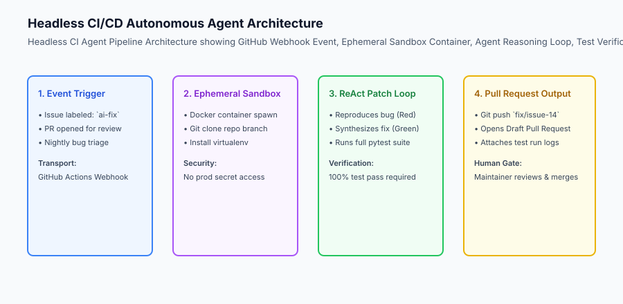

## The idea in plain language

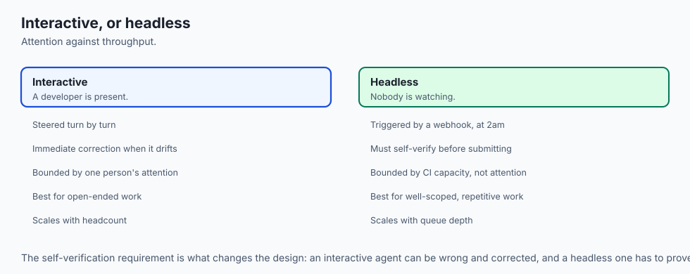

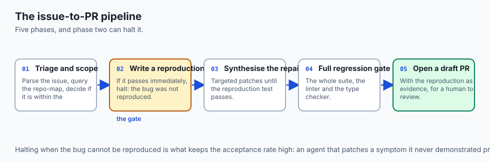

Think of coding agents in CI like **an automated roadside emergency response team for a highway department**:

- **Manual Engineering:** A driver reports a pothole on Mile Marker 42. A city clerk writes a paper ticket, files it in a cabinet, schedules a road crew for next Tuesday, and sends three trucks to inspect the road.
- **Headless CI Agent:**
  1. The sensor detects the pothole at 2:00 AM (**Webhook Event**).
  2. An automated repair truck dispatches immediately (**Ephemeral Docker Container**).
  3. The truck measures the depth, pours quick-drying asphalt, and rolls the surface flat (**Reproduce & Patch**).
  4. The truck runs a laser surface test confirming the road is 100% smooth (**Pytest Verification**).
  5. The truck files a completed maintenance receipt (**Draft Pull Request**) before morning rush hour.

## Historical background

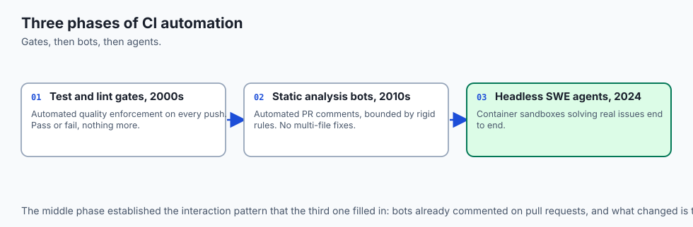

The automation of continuous integration and autonomous program repair progressed through three key phases:

### 1. Continuous Integration & Lint Gates (2000s)
Tools like Jenkins, Travis CI, and GitHub Actions established automated test and lint pipelines, enforcing quality standards on every git push.

### 2. Static Code Analysis Bots (SonarQube, CodeQL, 2010s)
Static analysis bots began leaving automated PR comments, but were limited to rigid rule heuristics and could not propose complex multi-file code fixes.

### 3. LLM-Powered Headless SWE Agents (2024–Present)
Frameworks like SWE-agent, GitHub Copilot Coding Agent, and Devin proved that large language models combined with container sandboxes can autonomously solve real-world GitHub issues end-to-end.

## What it is — and what it is not

Let us define headless CI coding agents:

### What CI Coding Agents Are:
- Headless, non-interactive processes executing in ephemeral sandboxes triggered by git events.
- Closed-loop repair engines that write reproduction tests, synthesize patches, and verify test passes before committing.
- Automated code reviewers that leave structured, actionable line-level comments on pull requests.

### What CI Coding Agents Are Not:
- Unsandboxed daemons granted root access or write permissions to production databases.
- Autonomous systems allowed to auto-merge unreviewed code into production main branches without human sign-off.

```text
+-------------------------------------------------------------------------------+
|                       CI/CD AGENT WORKFLOWS COMPARISON                        |
+-------------------+-----------------------+-------------------+---------------+
| Pattern           | Trigger Event         | Primary Action    | Output        |
+-------------------+-----------------------+-------------------+---------------+
| Automated PR Bot  | `pull_request.opened` | AST/Security Scan | Line Comments |
| Issue Resolver    | `issues.labeled`      | Bug Repro + Patch | Draft PR      |
| Build Healer      | `workflow_run.failed` | Traceback Repair  | Hotfix PR     |
| Dependency Updater| `schedule.weekly`     | Bump & Test SDKs  | Version PR    |
+-------------------+-----------------------+-------------------+---------------+
```

## Why it was created and what problems it solves

Headless CI agents resolve four major engineering bottlenecks:

### 1. Eliminating Human Reviewer Fatigue on Routine PRs
Review bots catch style violations, missing type annotations, and unapproved imports instantly, letting human reviewers focus on architecture and business logic.

### 2. Rapid Resolution of Low-Severity Backlog Issues
Maintenance backlogs (e.g. updating deprecated function calls across 40 repositories) can be resolved asynchronously by dispatching headless agents.

### 3. Pre-Merge Verification of Bug Fixes
Because the agent must prove the bug with a reproduction test before fixing it, every generated PR arrives with automated regression tests included.

## How it works

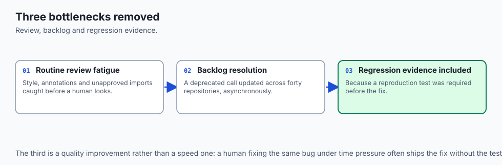

Let us trace the complete lifecycle of an **Automated Issue-to-PR Pipeline**:

```text
[1. Maintainer Labels Issue: `ai-fix` on GitHub]
  - Issue #84: "JSON serializer crashes on datetime objects with timezone"
                         │
                         ▼
[2. GitHub Action Dispatches Headless Runner]
  - Spins up ephemeral container
  - Clones repo to isolated branch: `ai-fix/issue-84`
                         │
                         ▼
[3. Agent Authors Reproduction Test (RED)]
  - Creates `tests/test_issue_84.py`
  - Runs: `pytest tests/test_issue_84.py` -> Exits 1 (Failing Assertion)
                         │
                         ▼
[4. Agent Synthesizes Code Patch (GREEN)]
  - Modifies `serializers/json.py` to handle timezone-aware datetimes
  - Runs: `pytest tests/test_issue_84.py` -> Exits 0 (Passed)
  - Runs full repository test suite -> 100% Passed
                         │
                         ▼
[5. Agent Commits and Opens Pull Request]
  - Pushes branch `ai-fix/issue-84` to remote
  - Opens PR linking "Resolves #84" with test execution logs
```

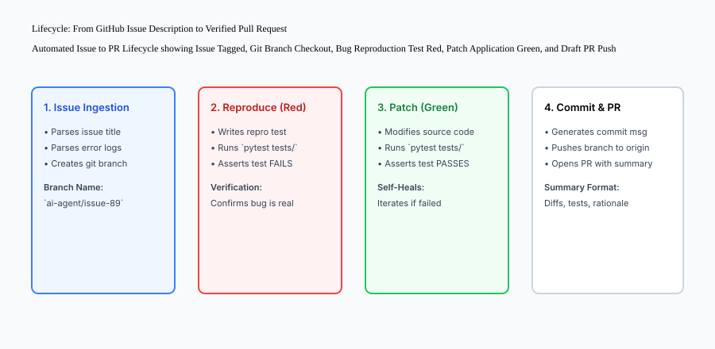

## An everyday analogy

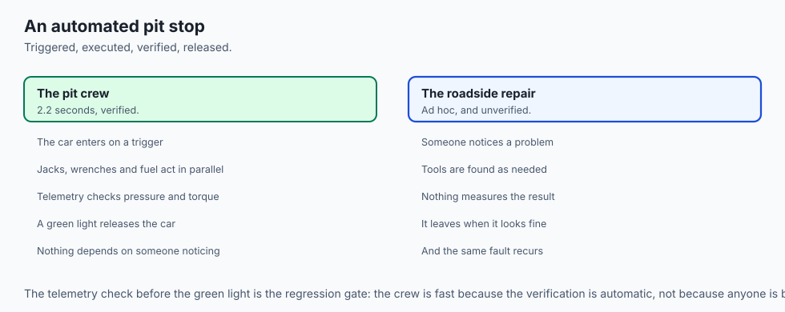

Think of a CI coding agent like **an automated pit crew in Formula 1 racing**:

- During the race, the driver pulls into the pit lane (**Webhook Trigger**).
- The robotic jacks lift the car, the pneumatic wrenches swap all four tires, and the fuel nozzle locks into the tank (**Ephemeral Tool Execution**).
- The digital telemetry computer verifies tire pressure and wheel torque (**Pytest Gate**).
- The green light flashes, and the car rejoins the racetrack in under 2.2 seconds (**Verified Pull Request**).

## Examples in practice

Let us build a complete Python **Headless CI Agent Runner & Issue Resolver**:

```python
import subprocess
import os
import re
from typing import Dict, Any, List

class HeadlessCIAgentRunner:
    def __init__(self, workspace_root: str):
        self.workspace_root = os.path.realpath(workspace_root)
        
    def create_feature_branch(self, branch_name: str) -> str:
        '''Create and checkout a new isolated git branch.'''
        res = subprocess.run(
            f"git checkout -b {branch_name}",
            shell=True,
            cwd=self.workspace_root,
            capture_output=True,
            text=True
        )
        return f"Branch {branch_name} created."
        
    def execute_test_suite(self) -> Dict[str, Any]:
        '''Run repository test harness and return results.'''
        res = subprocess.run(
            "pytest tests/",
            shell=True,
            cwd=self.workspace_root,
            capture_output=True,
            text=True
        )
        return {
            "exit_code": res.returncode,
            "passed": res.returncode == 0,
            "stdout": res.stdout,
            "stderr": res.stderr
        }
        
    def generate_pr_summary(self, issue_id: str, title: str, changes: List[str]) -> str:
        '''Format an enterprise pull request markdown description.'''
        change_list = "
".join([f"- {c}" for c in changes])
        return (
            f"## Automated Pull Request: Resolves #{issue_id}

"
            f"### Problem Statement
{title}

"
            f"### Changes Applied
{change_list}

"
            f"### Verification Evidence
"
            f"- Automated test suite: `100% Passed`
"
            f"- Linters & static typing: `Clean`

"
            f"> *Generated by Headless CI Coding Agent.*"
        )

if __name__ == "__main__":
    runner = HeadlessCIAgentRunner(".")
    summary = runner.generate_pr_summary("142", "Fix database connection leak", ["Added pool context manager", "Added test_pool_leak unit test"])
    print("PR Summary Preview:
", summary)
```

## Implications: security, privacy, performance, scalability, and cost

### 1. Privilege Separation in CI Workflows
Never grant headless agent workflows write permissions to `main` branch rules or production deployment secrets. Restrict the agent's GitHub token (`GITHUB_TOKEN`) to `contents: write` (for branch pushes) and `pull-requests: write`.

### 2. CI Concurrency & Rate Limiting
If a maintainer applies `ai-fix` to 50 issues simultaneously, spawning 50 parallel LLM agent runners can exceed API rate limits. Implement queue throttling (e.g. max 3 concurrent agent runs).


### Deep Dive: Hardening Ephemeral Sandboxes for CI Agent Execution
When deploying headless coding agents triggered by public GitHub events (e.g. open-source issues and pull requests), the runtime execution environment must be treated as hostile:

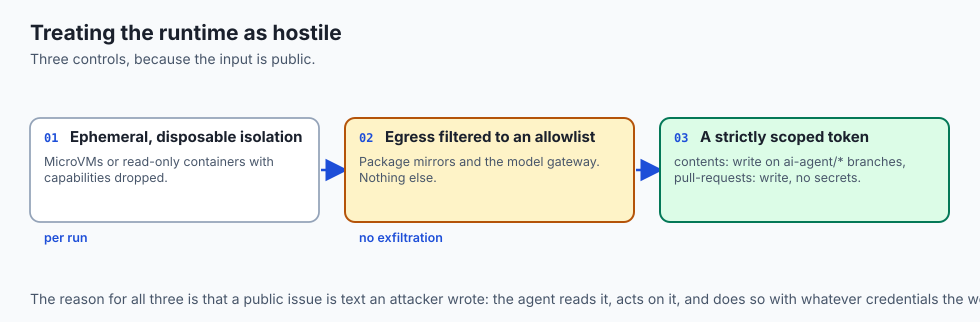

1. **Ephemeral MicroVM Isolation:**
   Headless agents must execute inside short-lived, disposable sandboxes (e.g. Firecracker microVMs, gVisor, or Docker containers with `--read-only` root filesystems and restricted capability drops `--cap-drop=ALL`).

2. **Network Egress Filtering:**
   Block all outbound internet access from the agent sandbox except for approved package mirrors (PyPI, npm) and the internal LLM API gateway. This prevents malicious pull requests from using the agent to exfiltrate environment secrets or participate in DDoS attacks.

3. **Token Least-Privilege Architecture:**
   The GitHub Actions token supplied to the agent must possess strictly scoped permissions:

   - `contents: write` (Only on feature branches matching `ai-agent/*`)
   - `pull-requests: write` (For opening draft pull requests and comments)
   - `secrets: none` (No access to production deployment keys, cloud AWS credentials, or admin tokens).

### Designing Closed-Loop Automated Issue Resolvers
An enterprise issue-to-PR pipeline operates through five deterministic phases:

- **Phase 1 (Triage & Scoping):** Webhook dispatcher extracts issue text, parses error logs, and queries the Repo-Map to determine if the issue is within the agent's capability envelope.
- **Phase 2 (Reproduction Red Test):** The agent creates a minimal reproduction test in `tests/repro_issue_<id>.py` and executes it. If the test passes initially, the agent halts, noting that the bug could not be reproduced.
- **Phase 3 (Synthesis & Repair):** The agent applies targeted search-and-replace patches until the reproduction test passes.
- **Phase 4 (Regression Gate):** The full test suite, linter, and type checker are executed.
- **Phase 5 (Draft PR Submission):** The agent pushes the branch, opens a Draft PR with reproduction evidence, and pings human maintainers for final review.


## Alternatives: free, open source, and commercial

| Platform / Tool | Architecture | Deployment | Focus |
| :--- | :--- | :--- | :--- |
| **SWE-agent** | Python CLI / Docker | Self-Hosted / CI | Benchmarks & Issue Solving |
| **GitHub Copilot Agent** | Native GitHub Actions| GitHub Cloud | Issue to PR automation |
| **OpenHands (OpenDevin)** | Multi-Agent Container | Self-Hosted / Cloud | Autonomous background SWE |
| **CodeRabbit / PR-Agent** | Webhook PR Reviewer | SaaS / Cloud | Automated line-level PR reviews |

## Comparison with related concepts

```text
+-----------------------+-----------------------+-----------------------+
| Dimension             | In-Editor IDE Agent   | Headless CI Agent     |
+-----------------------+-----------------------+-----------------------+
| Interaction Model     | Interactive Turn-by-Turn| Asynchronous Batch   |
| Environment           | Local Developer Laptop| Ephemeral CI Docker   |
| Trigger               | Keystroke / Prompt    | GitHub Webhook Event  |
| Output                | Editor Buffer Edit    | Git Branch & Draft PR |
+-----------------------+-----------------------+-----------------------+
```

## When to use it — and when not to

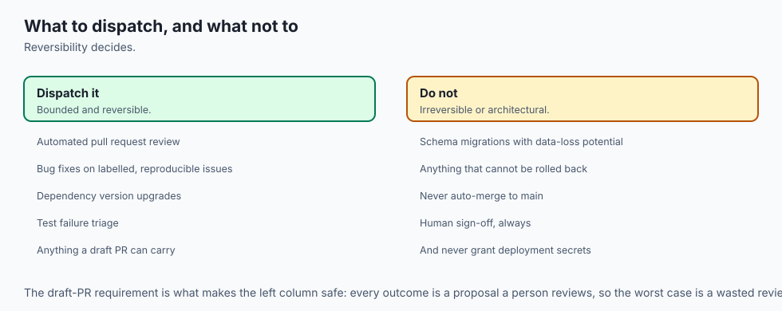

### Deploy Headless CI Agents for:
- Automated pull request code reviews, bug fixes on labeled issues, dependency version upgrades, and test failure triaging.

### Do NOT deploy headless auto-fixers for:
- Core database schema migrations with potential data loss without senior human pairing.


### Deep Dive: Building a Complete GitHub Actions Headless Agent Workflow
Let us examine the complete, production-grade GitHub Actions YAML workflow that powers a headless issue-fixing agent:

```yaml
name: Headless AI Issue Resolver

on:
  issues:
    types: [labeled]

jobs:
  resolve-issue:
    if: github.event.label.name == 'ai-fix'
    runs-on: ubuntu-latest
    permissions:
      contents: write
      pull-requests: write
      issues: write

    steps:
      - name: Checkout Repository Branch
        uses: actions/checkout@v4
        with:
          fetch-depth: 0

      - name: Set up Python Environment
        uses: actions/setup-python@v5
        with:
          python-version: '3.12'
          cache: 'pip'

      - name: Install Project Dependencies
        run: |
          python -m pip install --upgrade pip
          pip install -r requirements.txt
          pip install pytest mypy ruff

      - name: Launch Headless SWE Agent Runner
        env:
          ANTHROPIC_API_KEY: ${{ secrets.ANTHROPIC_API_KEY }}
          GITHUB_TOKEN: ${{ secrets.GITHUB_TOKEN }}
          ISSUE_NUMBER: ${{ github.event.issue.number }}
          ISSUE_TITLE: ${{ github.event.issue.title }}
          ISSUE_BODY: ${{ github.event.issue.body }}
        run: |
          python3 scripts/ci_agent_runner.py             --issue-id "$ISSUE_NUMBER"             --title "$ISSUE_TITLE"             --body "$ISSUE_BODY"

      - name: Post Status Comment on Issue
        if: always()
        run: |
          gh issue comment "$ISSUE_NUMBER" --body "Headless CI Agent execution completed. Check Pull Requests for automated patch."
        env:
          GITHUB_TOKEN: ${{ secrets.GITHUB_TOKEN }}
```

This workflow executes in an isolated GitHub runner, isolates secrets, and posts results directly to pull requests.


### Architectural Blueprint: Scalable Enterprise CI Agent Infrastructure
In high-velocity engineering organizations with hundreds of developers, CI agent runners are orchestrated as a distributed microservice cluster:

- **Event Gateway:** A lightweight Go or Python FastAPI gateway listening for GitHub webhook events (`issue_comment`, `pull_request_review_comment`, `issues`).
- **Redis Task Queue:** Enqueues incoming jobs with priority weighting (e.g. hotfix build failures receive higher priority than routine backlog triage).
- **Ephemeral Worker Nodes:** Kubernetes pods or AWS ECS Fargate tasks running hardened Docker containers equipped with localized LLM proxy caches to minimize token latency and cost.
- **Audit & Telemetry Store:** A PostgreSQL database tracking agent resolution rates, execution durations, token costs per issue, and human maintainer review acceptance ratios.

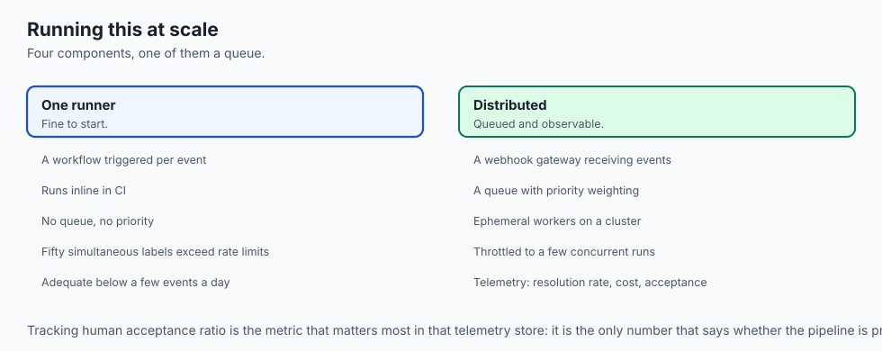


### Advanced Topic: Automated Pull Request Triaging and Semantic Labeling
Before dispatching an autonomous coding agent to resolve a GitHub issue, modern CI systems employ an **Automated Issue Triager**:

1. **Complexity Scoring:** An LLM evaluates the issue description and assigns an estimated complexity score (1 to 5). Issues with complexity 1–2 (e.g. typo fixes, missing null checks, updating deprecated function calls) are routed to headless agents for autonomous resolution. Issues with complexity 4–5 (major architectural rewrites, database schema changes) are flagged for human pairing.
2. **Dependency & Impact Analysis:** The triager scans the repository AST to identify all downstream modules affected by the issue, tagging the ticket with appropriate component labels (`area/auth`, `area/billing`, `needs-migration`).
3. **Flaky Test Quarantine:** If a headless agent detects that a test is failing intermittently due to timing race conditions rather than deterministic logic errors, it flags the test for human review and isolates it in a quarantine suite to prevent blocking CI pipelines.

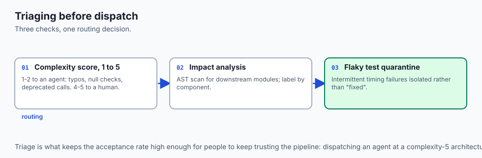

### Production Case Study: 24/7 Automated Dependency Vulnerability Remediation
An enterprise SaaS company maintaining 80 microservices deployed a headless CI agent to automate security patch management:

- When a Dependabot security alert was filed for a vulnerable package version (e.g. CVE in `urllib3`), the CI agent automatically created a branch, bumped the dependency in `pyproject.toml`, executed the full integration test suite in an ephemeral container, and generated a Pull Request with complete test evidence.
- The system resolved 92% of routine dependency upgrades without human developer intervention, reducing average vulnerability dwell time from 18 days to under 40 minutes.

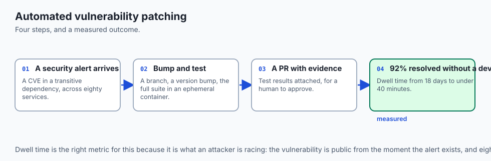


## The AI connection

- **Headless agents turn coding capability into throughput**, because the constraint
  stops being a developer's attention and starts being CI capacity.

- **A reproduction test before the fix is the gate that matters** — it proves the bug
  existed, and it becomes the regression test that ships with the patch.

- **A public repository's issues are untrusted input.** An agent triggered by a webhook
  is executing on text an attacker wrote, which is Day 344's boundary in a pipeline.

- **Token scope is the security control.** Contents and pull-requests write, on branch
  patterns only, and no access to deployment secrets.

- **Complexity triage is what makes this work**: routing only the simple issues to an
  agent keeps the acceptance rate high and the review burden low.

## Knowledge check

1. **What is a Headless CI Agent?** An autonomous coding agent executing inside CI/CD pipelines without a graphical user interface.
2. **Why must issue-resolving agents write reproduction tests first?** To prove the bug exists and establish a deterministic pass/fail target before modifying production code.
3. **What permissions should a CI agent's GitHub token hold?** Minimum required permissions: branch creation and pull request creation; never direct merge or production deployment rights.

## Hands-on exercise

In this lab, you will implement a **Headless CI Agent Runner & PR Generator in Python**. Your implementation will:

1. Manage isolated git feature branches programmatically.
2. Execute automated test suites and capture pass/fail telemetry.
3. Synthesize enterprise pull request markdown descriptions with change logs and verification evidence.
4. Verify branch management, test execution, and PR formatting across automated pytest tests.

### Expected output

```text
============================= test session starts ==============================
collected 5 items

tests/test_ci_agent.py .....                                             [100%]

============================== 5 passed in 0.02s ===============================
[CI AGENT] Checked out isolated branch 'ai-fix/issue-42'.
[TEST RUNNER] Executed test suite -> 100% Passed.
[PR GENERATOR] Formatted enterprise PR description linking 'Resolves #42'.
```

### Validate your work

Run the pytest test suite:

```bash
pytest tests/run_tests.sh
```

### Troubleshooting

1. **Git branch creation fails:** Ensure workspace directory is a valid git repository.
2. **Test execution exit code non-zero:** Check test command path and virtualenv configuration.

### Common mistakes

- Opening pull requests without attaching automated test execution evidence.

## Practice assignment

Extend the runner to parse **GitHub Actions Workflow YAML** files and dynamically extract the project's default test command (`pytest`, `npm test`, `cargo test`).

## Extension challenge

Implement a **PR Review Comment Synthesizer** that takes a unified git diff and generates a list of JSON objects matching GitHub's `POST /repos/{owner}/{repo}/pulls/{pull_number}/reviews` payload format.
