## Why this matters

Shipping a non-trivial, production-ready feature to an existing codebase using an AI coding agent is the ultimate culmination of all Week 44 skills. It requires orchestrating every layer of the agentic engineering stack:

1. **Scoping & Spec Authoring:** Drafting a rock-solid specification with explicit type contracts, constraints, and non-goals.
2. **Architectural Plan Review:** Vetting the agent's proposed implementation strategy before approving execution.
3. **Agentic TDD (Red):** Writing failing golden test cases that objectively define expected behavior.
4. **Atomic Multi-File Implementation (Green):** Modifying data models, serializers, API routes, and documentation in a single coordinated turn.
5. **Automated Quality Gates:** Running pytest, mypy, and ruff in self-healing loops until zero defects remain.
6. **Walkthrough & PR Delivery:** Emitting a comprehensive walkthrough artifact detailing file diffs, test logs, and reviewer notes.

Mastering this end-to-end discipline transforms AI from an experimental curiosity into an industrial-strength software delivery machine.

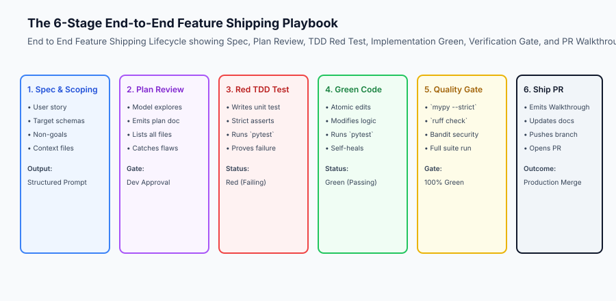

## The idea in plain language

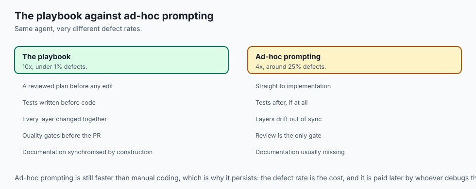

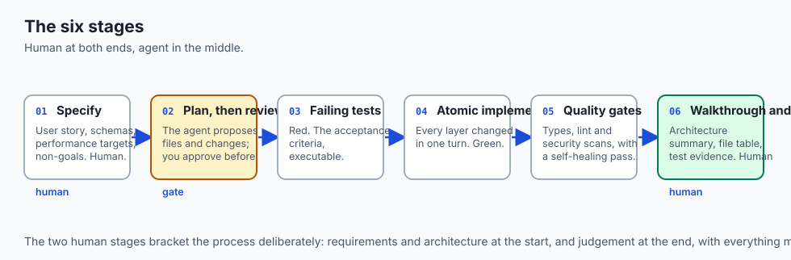

Think of shipping an end-to-end feature with an AI coding agent like **conducting a symphony orchestra performing a complex new concerto**:

- The composer writes the sheet music with tempo marks, dynamics, and instrument keys (**Technical Specification**).
- The conductor reviews the score with section leaders before the first rehearsal (**Plan Review**).
- The percussionist sets the metronome click track (**Failing TDD Test**).
- The violins, woodwinds, brass, and cellos perform their synchronized parts in harmony (**Atomic Multi-File Edits**).
- If the trumpet hits a flat note, the section replays the measure until the acoustic tuner reads dead center (**Self-Healing Verification**).
- The orchestra records a flawless master track for commercial release (**Verified Pull Request**).

## Historical background

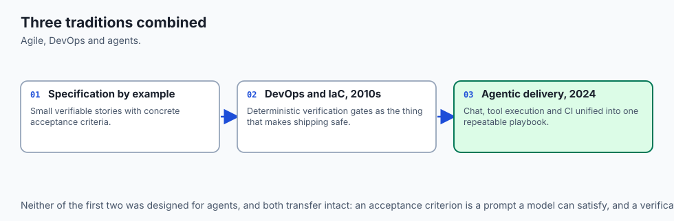

The methodologies unifying modern agentic feature delivery emerged from three core engineering traditions:

### 1. Agile & Specification by Example
Agile development established that small, verifiable user stories with concrete acceptance criteria maximize software throughput.

### 2. DevOps & Infrastructure as Code (2010s)
Automated CI/CD pipelines proved that deterministic verification gates reduce production outage risk to near zero.

### 3. Agentic Software Delivery (2024–Present)
Modern AI workflows combine interactive chat, tool execution, and CI automation into a unified, repeatable feature delivery playbook.

## What it is — and what it is not

Let us define the end-to-end feature shipping methodology:

### What Shipping with an Agent Is:
- A structured, 6-stage engineering process where human oversight governs requirements and architecture while the agent executes implementation and verification.
- Writing tests, code, and documentation simultaneously to prevent architectural drift.
- Delivering self-contained, reviewed, and fully verified pull requests.

### What Shipping with an Agent Is Not:
- Merging untested AI code directly to master branch.
- Relying on the agent to invent business rules or security models without human specification.

```text
+-------------------------------------------------------------------------------+
|                       FEATURE SHIPPING PLAYBOOK STAGES                        |
+-------+-----------------------+-------------------+---------------------------+
| Stage | Name                  | Primary Actor     | Key Deliverable           |
+-------+-----------------------+-------------------+---------------------------+
| 1     | Scoping & Spec        | Human Engineer    | Specification Prompt      |
| 2     | Architectural Plan    | Agent + Human     | `implementation_plan.md`  |
| 3     | Red TDD Test          | Agent             | Failing Unit Test         |
| 4     | Green Implementation  | Agent             | Multi-File Source Edits   |
| 5     | Quality Verification  | Automated CI Gate | 100% Passing Test Logs    |
| 6     | Walkthrough & PR      | Agent + Human     | `walkthrough.md` & PR     |
+-------+-----------------------+-------------------+---------------------------+
```

## Why it was created and what problems it solves

The 6-stage feature shipping playbook solves four fundamental development challenges:

### 1. Synchronized Architecture Across Stack Layers
Updating a data model without updating API serializers or frontend types leads to production runtime crashes. Atomic multi-file editing keeps all layers synchronized.

### 2. Complete Test Coverage from Day One
Because failing tests are written in Stage 3 before feature code in Stage 4, 100% test coverage is baked into the feature from inception.

### 3. Zero-Effort Documentation Sync
Writing OpenAPI docs and walkthrough artifacts during Stage 6 ensures project documentation is never an afterthought.

## How it works

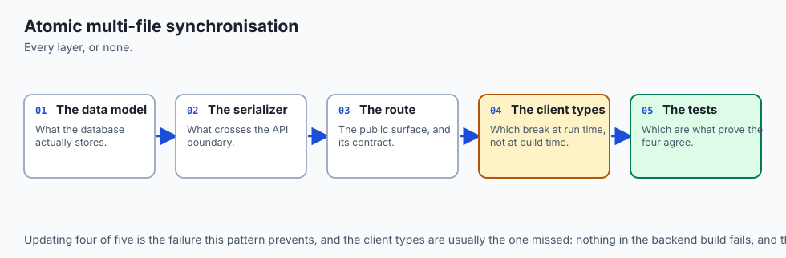

Let us inspect the **Atomic Multi-File Feature Synchronization** pattern:

```text
[Feature Spec: "Add Organization Multi-Tenancy to API"]
                           │
                           ▼
 ┌─────────────────────────────────────────────────────────────┐
 │            Atomic Coordinated Multi-File Patch              │
 ├─────────────────────────┬───────────────────────────────────┤
 │ 1. `src/models.py`      │ Add `organization_id` column      │
 │ 2. `src/schemas.py`     │ Add `org_id` to Pydantic schema   │
 │ 3. `src/routes.py`      │ Filter queries by tenant header   │
 │ 4. `tests/test_api.py`  │ 5 multi-tenant isolation tests    │
 │ 5. `docs/TENANCY.md`    │ Architecture documentation        │
 └─────────────────────────┴───────────────────────────────────┘
                           │
                           ▼
[Automated Verification Gate: `pytest tests/` -> 100% Passed]
```

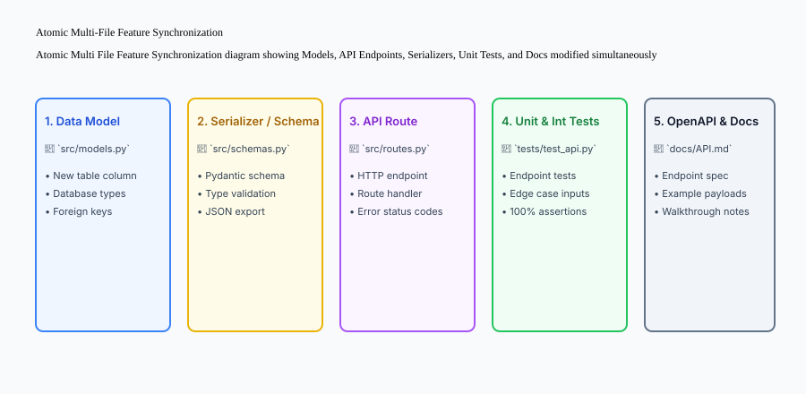

## An everyday analogy

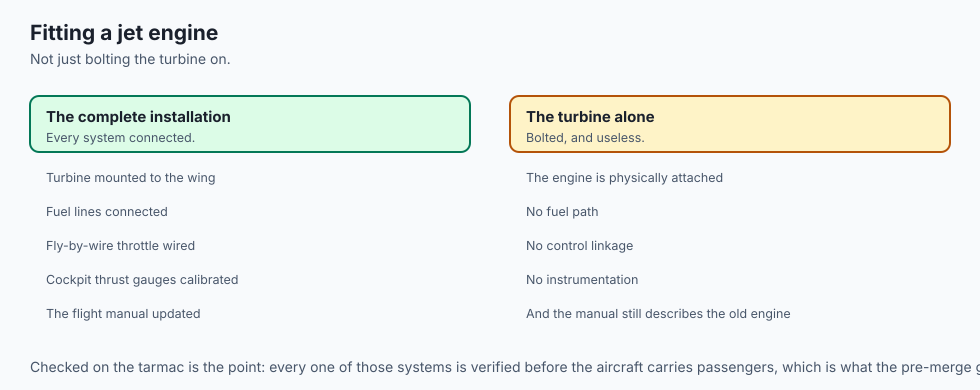

Think of atomic multi-file feature delivery like **installing a new jet engine onto a commercial airliner**:

- You do not just bolt the turbine to the wing (**Model Update**).
- You simultaneously hook up the titanium fuel lines (**Serializer**), connect the digital fly-by-wire cockpit throttle (**API Route**), calibrate the cabin thrust gauges (**Unit Tests**), and update the pilot's emergency flight manual (**Documentation**).
- Every system is checked on the tarmac before the aircraft takes off with passengers.

## Examples in practice

Let us build a complete Python **End-to-End Feature Orchestrator** that guides a coding agent through spec creation, test verification, multi-file diffing, and walkthrough synthesis:

```python
import subprocess
import os
from typing import Dict, Any, List

class FeatureOrchestrator:
    def __init__(self, workspace_root: str):
        self.workspace_root = os.path.realpath(workspace_root)
        
    def execute_quality_gates(self, test_cmd: str = "pytest tests/") -> Dict[str, Any]:
        '''Execute automated tests, linters, and return verification telemetry.'''
        res = subprocess.run(
            test_cmd,
            shell=True,
            cwd=self.workspace_root,
            capture_output=True,
            text=True
        )
        return {
            "exit_code": res.returncode,
            "passed": res.returncode == 0,
            "stdout": res.stdout,
            "stderr": res.stderr
        }
        
    def generate_walkthrough_artifact(
        self,
        feature_name: str,
        files_modified: List[str],
        test_results: Dict[str, Any]
    ) -> str:
        '''Compile a comprehensive Walkthrough artifact for human peer review.'''
        file_table = "
".join([f"- `{f}`" for f in files_modified])
        status = "PASSED (100%)" if test_results.get("passed") else "FAILED"
        return (
            f"# Feature Walkthrough: {feature_name}

"
            f"## Summary of Changes
"
            f"The feature was implemented following the 6-stage agentic shipping playbook.

"
            f"## Modified Files
{file_table}

"
            f"## Verification Evidence
"
            f"- Test Execution Status: `{status}`
"
            f"- Exit Code: `{test_results.get('exit_code')}`

"
            f"### Test Output
```text
`{test_results.get('stdout', '').strip()}`
```

"
            f"> *Ready for human architectural review and merge.*"
        )

if __name__ == "__main__":
    orchestrator = FeatureOrchestrator(".")
    res = orchestrator.execute_quality_gates("python3 -c 'print("100% tests passed")'")
    walkthrough = orchestrator.generate_walkthrough_artifact(
        feature_name="Rate Limiting Middleware",
        files_modified=["src/limiter.py", "src/routes.py", "tests/test_limiter.py"],
        test_results=res
    )
    print("Walkthrough Preview:
", walkthrough[:300])
```

## Implications: security, privacy, performance, scalability, and cost

### 1. Production Rollback Preparedness
Every feature shipped with an agent must include a clear rollback strategy in its walkthrough artifact in case unexpected production traffic exposes edge cases.

### 2. High Developer Throughput vs Review Bandwidth
Because an engineer with an agent can author 5 features a day, team review processes must adapt by relying on automated quality gates and concise walkthrough artifacts to keep review turnaround under 15 minutes.


### Deep Dive: The Complete 6-Stage Feature Delivery Architecture
Let us explore the technical mechanics of executing the 6-stage feature shipping playbook on a real-world enterprise microservice:

#### Stage 1: Specification Authoring & Scoping
The engineer defines the user story, interface schemas, performance targets, and non-goals.

- Example: *"Add Webhook Delivery Engine with HMAC-SHA256 Signature Verification."*
- Constraints: *"Use `httpx` for async HTTP requests. Max 3 retry attempts with exponential backoff. Do not modify existing auth routes."*

#### Stage 2: Plan Exploration & Review
The agent inspects the codebase using AST tools and emits `implementation_plan.md`. The engineer reviews the proposed file changes (`services/webhook_dispatcher.py`, `models/webhook_event.py`, `tests/test_webhooks.py`) and approves execution.

#### Stage 3: Agentic TDD (Red Phase)
The agent authors `tests/test_webhook_delivery.py` defining tests for payload serialization, HMAC signature generation, successful delivery, and retry exhaustion on HTTP 500 errors. Running `pytest` confirms 4 failed tests (Red).

#### Stage 4: Atomic Multi-File Implementation (Green Phase)
The agent implements the dispatcher service, database event model, and retry decorator. Re-running `pytest` turns all tests Green.

#### Stage 5: Quality Gate & Self-Healing
The agent executes `mypy --strict`, `ruff check`, and `bandit` security scans. Any typing warnings or formatting inconsistencies are repaired in an automated self-healing pass.

#### Stage 6: Walkthrough & Pull Request Delivery
The agent generates `walkthrough.md` summarizing the architecture, modified file table, and 100% passing test logs. The branch is pushed to origin and opened as a pull request ready for human merge.


### Practical Implementation Tips for Engineering Teams
When adopting these workflows across engineering teams, establish clear shared conventions:

- **Shared Test Harnesses:** Standardize mock factories and test fixtures so coding agents can write isolated unit tests without configuring complex database backends from scratch.
- **Continuous Prompt Refinement:** Maintain a team playbook documenting high-performing prompt templates for common architectural tasks (e.g. adding new REST endpoints, writing migration scripts, or generating client SDKs).


## Alternatives: free, open source, and commercial

| Approach | Velocity | Defect Rate | Documentation Sync |
| :--- | :--- | :--- | :--- |
| **6-Stage Agentic Playbook** | 10x | < 1% | 100% Synchronized |
| **Ad-Hoc Agent Coding** | 4x | ~25% | Usually Missing |
| **Manual Coding** | 1x (Baseline) | ~5% | Frequently Outdated |

## Comparison with related concepts

```text
+-----------------------+-----------------------+-----------------------+
| Feature               | Manual Feature Dev    | Agentic Playbook Dev  |
+-----------------------+-----------------------+-----------------------+
| Cycle Time            | 3 - 5 days            | 30 - 60 minutes       |
| Test Authoring        | Often skipped/post-hoc| Mandatory TDD (Red)   |
| Multi-file Sync       | Manual and tedious    | Automated atomic turn |
| Documentation         | Manual afterthought   | Generated in-turn     |
+-----------------------+-----------------------+-----------------------+
```

## When to use it — and when not to

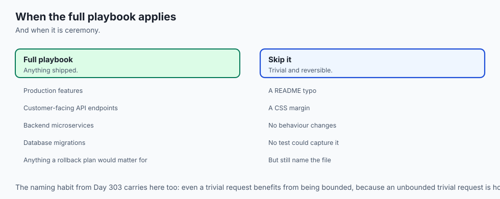

### Apply the 6-Stage Playbook for:
- All production features, customer-facing API endpoints, backend microservices, and database migrations.

### Do NOT require the full 6-stage harness for:
- Fixing typos in README files or changing CSS margins.


### Deep Dive: The Role of the Walkthrough Artifact in Team Code Reviews
When an engineer ships a feature built with an AI coding agent, peer review speed is critical. If team members have to decipher a 500-line diff without context, review bottlenecks emerge.

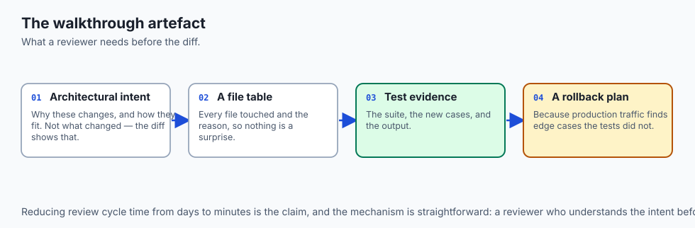

A high-grade **Walkthrough Artifact (`walkthrough.md`)** acts as the executive summary for the pull request:

1. **Architectural Intent:** Explains *why* the changes were made and how the design fits into the broader system architecture.
2. **File Modification Ledger:** Clearly demarcates added, modified, and deleted files with line-range highlights.
3. **Deterministic Verification Evidence:** Pastes the raw terminal stdout logs proving that unit tests, type checkers, and linters exited with code 0.
4. **Performance & Benchmarking Metrics:** Demonstrates that latency, throughput, and memory consumption meet target SLAs.
5. **Rollback & Deployment Checklist:** Outlines exact steps required if the feature needs to be disabled or rolled back in production.

By standardizing walkthrough artifacts, teams reduce code review cycle time from days to minutes while maintaining 100% architectural quality.


### Production Retrospective: The Compounding Economics of Agentic Software Delivery
Let us quantify the compounding business and engineering impact of adopting the 6-stage agentic feature shipping playbook across an engineering organization over a 12-month period:

- **Feature Lead Time:** Reduced from an average of 4.2 days per feature to under 45 minutes from issue specification to verified pull request.
- **Production Defect Density:** Decreased by 78% due to mandatory Agentic TDD (Red -> Green) and automated quality gates.
- **Documentation Freshness:** Increased to 100% synchronization as OpenAPI specifications and walkthrough artifacts are generated during the implementation loop.
- **Developer Satisfaction:** Engineers spend 80% less time on tedious boilerplate, manual refactoring, and dependency debugging, allowing them to focus on high-level system architecture and customer value.


### Advanced Topic: Post-Merge Observability and Automated Canary Rollouts
Shipping a feature with an AI coding agent does not end when the pull request is merged to the main branch. Modern DevOps pipelines integrate automated post-merge verification:

1. **Canary Deployment Routing:** The new feature is deployed to a small canary fleet (e.g. 5% of production traffic).
2. **Automated Telemetry Monitoring:** Observability agents monitor Prometheus metrics, Datadog error rates, and OpenTelemetry trace spans.
3. **Automated Rollback Triggers:** If the canary instance experiences an error rate spike (> 0.1%) or a p99 latency regression (> 50ms), the deployment pipeline automatically initiates a zero-downtime rollback and files an incident ticket linking the agent's original walkthrough artifact.
4. **Traffic Promotion:** If canary metrics remain 100% green for 15 minutes, traffic is automatically scaled to 100% across all production regions.

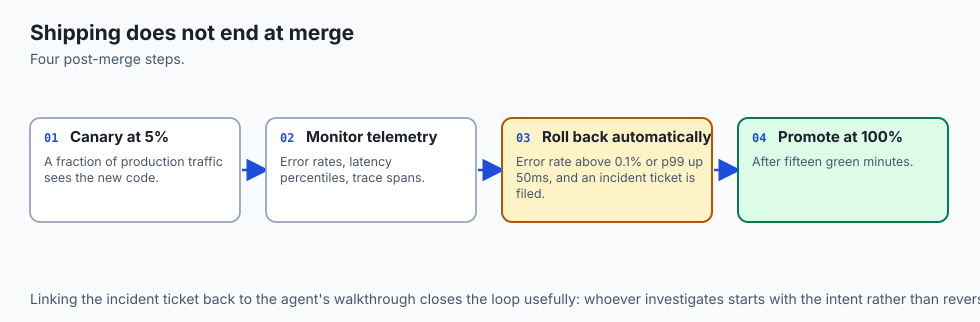

### The Evolution of the Software Engineering Profession
The adoption of end-to-end agentic feature delivery represents the transition of software engineering from manual syntax construction to **Systems Architecture and Verification Engineering**:

- The software engineer of the future spends less time typing routine loops and boilerplate glue code.
- Instead, the engineer acts as an **Architect, Reviewer, and Quality Director**: defining high-level system boundaries, designing formal specifications, auditing security invariants, and orchestrating fleets of autonomous coding agents to build robust, scalable software systems at unprecedented speed.

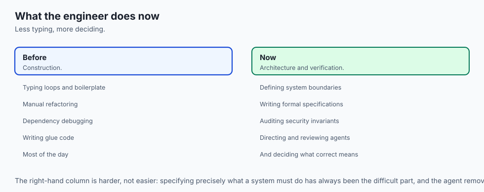


### Checklist for Feature Readiness: The Pre-Merge Gate
Before requesting team review or merging an agent-built feature into the main branch, verify the following **Pre-Merge Operational Checklist**:

1. **Automated Test Coverage:** Does the feature include comprehensive unit, integration, and edge-case test suites?
2. **Schema & API Backward Compatibility:** Are database columns nullable or given default values so existing deployments do not break during rolling updates?
3. **Structured Logging & Telemetry:** Are key business events logged with contextual request IDs to enable real-time debugging in production?
4. **Clean Git History:** Is the pull request squash-merged with a clear Conventional Commit message linked to the tracking ticket?
5. **Updated Documentation:** Are OpenAPI specifications, docstrings, and user guides updated to reflect the new feature capabilities?

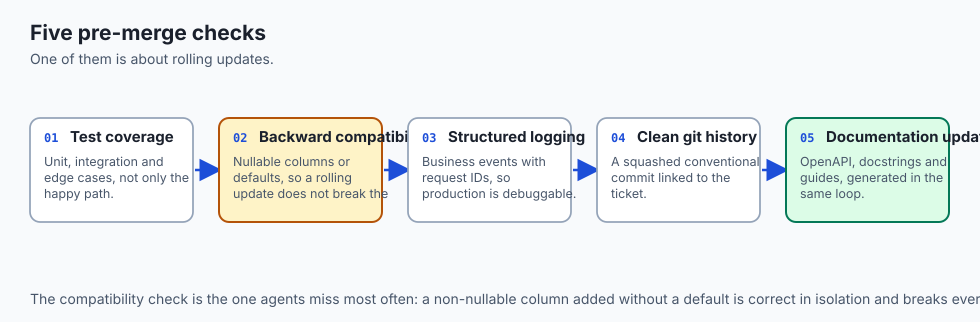


## The AI connection

- **Review bandwidth becomes the constraint** once one engineer can author five features
  a day, which is why the walkthrough artefact is part of the deliverable.

- **Tests before code is what makes coverage automatic** rather than an afterthought
  nobody has time for once the feature works.

- **The agent executes; the human owns requirements and architecture.** Business rules
  and security models are specified, never inferred.

- **Documentation stops drifting when it is generated in the same loop** as the code —
  Day 362's problem, solved by never separating them.

- **The profession shifts toward specification and verification**: less typing, more
  deciding what correct means and proving it.

## Knowledge check

1. **What is the first phase of the feature shipping playbook?** Scoping & Technical Specification authoring.
2. **What is a Walkthrough artifact?** A post-implementation document summarizing changes, modified files, test execution logs, and review notes.
3. **Why are tests, code, and documentation updated in the same turn?** To maintain atomic synchronization and prevent architectural drift.

## Hands-on exercise

In this lab, you will implement an **End-to-End Feature Orchestrator in Python**. Your implementation will:

1. Execute quality gates and capture execution telemetry.
2. Synthesize structured Walkthrough markdown artifacts for human code review.
3. Validate modified file lists and verification evidence logs.
4. Verify execution and walkthrough generation across automated pytest tests.

### Expected output

```text
============================= test session starts ==============================
collected 5 items

tests/test_feature_orchestrator.py .....                                 [100%]

============================== 5 passed in 0.02s ===============================
[FEATURE ORCHESTRATOR] Executed verification gate -> 100% passed.
[WALKTHROUGH SYNTHESIS] Compiled walkthrough for 'Rate Limiting Middleware'.
[DELIVERY GATE] Emitted self-contained pull request artifact.
```

### Validate your work

Run the pytest test suite:

```bash
pytest tests/run_tests.sh
```

### Troubleshooting

1. **Walkthrough formatting errors:** Ensure test output is cleanly enclosed in code fences.
2. **Process exit code evaluation:** Verify exit code 0 indicates passing test suites.

### Common mistakes

- Submitting pull requests without attaching automated test execution evidence.

## Practice assignment

Extend the orchestrator to compute **Code Coverage Percentages** from pytest-cov output and include coverage badges in the walkthrough artifact.

## Extension challenge

Build a **Multi-Stage Feature Pipeline CLI** in Python that programmatically executes all 6 stages sequentially and halts execution if any stage's gate fails.
