## Why this matters

In the early days of prototyping an AI application, developers rely on **"Vibe Checks"**: entering three sample prompts into a ChatGPT or Claude window, looking at the generated text, nodding approvingly, and declaring the feature "ready for production."

In production, vibe checks fail catastrophically. When an application serves 50,000 real users a day:

- A prompt tweak intended to fix customer support tone causes the model to stop parsing refund order numbers.
- Switching to a newer, cheaper model breaks structured JSON formatting in 4% of edge cases.
- Without automated evaluation harnesses, developers are terrified of updating prompts or changing model providers because they have no mathematical way to detect silent regressions.

**Evaluation Harnesses (Evals)** are the true competitive moat of production AI engineering. Foundation model weights and prompting templates are rapidly commoditized. A proprietary, rigorous evaluation dataset reflecting years of domain edge cases, user failure modes, and calibrated scoring rubrics is an irreproducible engineering asset that enables high-velocity, regression-free innovation.

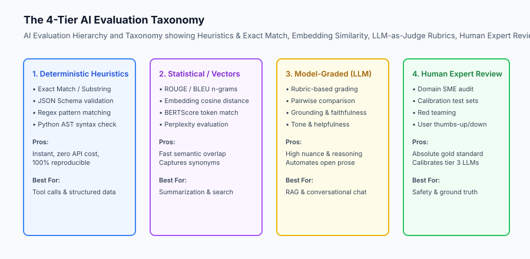

## The idea in plain language

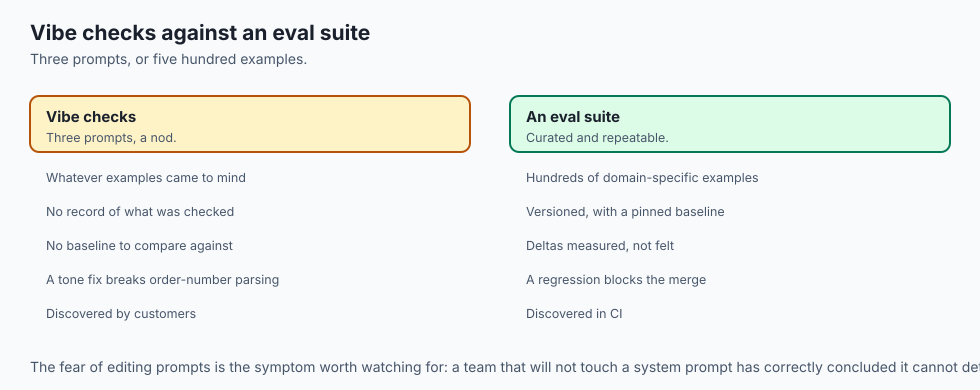

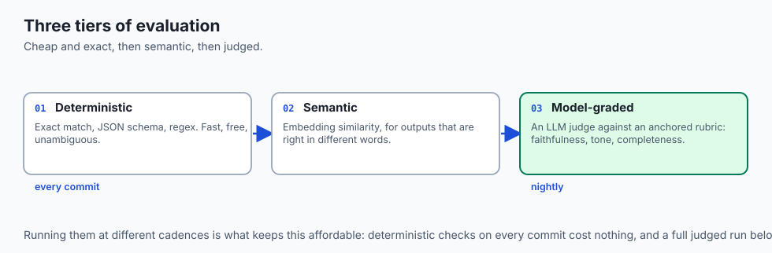

Think of building an AI product without an evaluation harness like **tuning a race car engine without a speedometer, tachometer, or dynamometer**:

- **The Vibe Check Method:** The mechanic revs the engine in the garage, listens to the exhaust note, and says: *"Sounds pretty loud and fast to me! Take it out on the track."* On the first turn, the engine overheats and stalls because the air-to-fuel ratio was completely uncalibrated.
- **The Evaluation-Driven Method:**
  1. The car is strapped to a computerized dynamometer test bench (**The Eval Dataset**).
  2. Sensors measure torque, RPM, exhaust temperature, and brake thermal dissipation across 50 simulated race conditions (**Deterministic & Model-Graded Metrics**).
  3. The engineer tweaks the fuel injector map (**Prompt / Model Optimization**).
  4. The dynamometer proves that horsepower increased by 14% while fuel consumption dropped by 6% with zero knocking (**Regression Gate**).
  5. The car enters the race with absolute mathematical confidence.

## Historical background

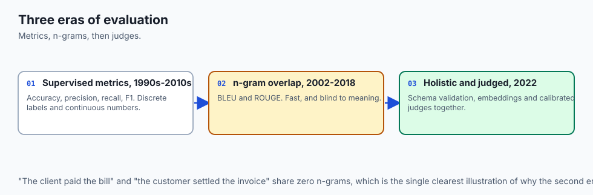

The evolution of machine learning evaluation progressed through three distinct eras:

### 1. Traditional Supervised Learning Metrics (1990s–2010s)
Machine learning relied on deterministic mathematical metrics on fixed test splits: Accuracy, Precision, Recall, F1-Score, and Mean Squared Error (MSE). These metrics worked because output spaces were discrete classification labels or continuous regression numbers.

### 2. Natural Language Generation Metrics (BLEU, ROUGE, 2002–2018)
As NLP models generated open text (machine translation and summarization), researchers developed n-gram overlap metrics:

- **BLEU (Papineni et al., 2002):** Evaluates precision of generated n-grams against reference texts.
- **ROUGE (Lin, 2004):** Evaluates recall of reference n-grams in generated summaries.
While fast, n-gram metrics fail to account for semantics (e.g. *"The client paid the bill"* and *"The customer settled the invoice"* share zero n-grams despite having identical meaning).

### 3. Holistic Evaluation & LLM-as-Judge (2022–Present)
Stanford's HELM benchmark and OpenAI Evals established modern multi-dimensional evaluation: combining deterministic JSON schema validation, embedding cosine similarity, and model-graded LLM judges evaluating faithfulness, tone, and safety.

## What it is — and what it is not

Let us establish clear definitions for production AI evaluation:

### What AI Evaluation Is:
- A systematic, repeatable test harness that executes a target model/prompt against a curated dataset of inputs and evaluates outputs against defined criteria.
- A multi-tier combination of deterministic heuristics (regex, JSON, exact match), semantic embeddings, and calibrated LLM-as-Judge rubrics.
- An automated CI/CD quality gate preventing regressions during prompt updates or model migrations.

### What AI Evaluation Is Not:
- A subjective manual review of 3 prompts in a web interface.
- A one-time academic benchmark (e.g. MMLU) that has no relevance to your company's proprietary domain workflows.

```text
+-------------------------------------------------------------------------------+
|                       EVALUATION METHODOLOGIES MATRIX                         |
+-------------------+-----------------------+-------------------+---------------+
| Evaluation Tier   | Speed / Cost          | Determinism       | Best Suited For|
+-------------------+-----------------------+-------------------+---------------+
| Deterministic     | Ultra-Fast / $0.00    | 100% Deterministic| JSON schemas, |
| (Regex / Code)    |                       |                   | tool arguments|
| Statistical /     | Fast / < $0.0001      | High              | RAG retrieval,|
| Embeddings        |                       |                   | semantic search|
| Model-Graded      | Medium / $0.002       | Medium-High       | Open prose,   |
| (LLM-as-Judge)    |                       | (Calibrated)      | summarization |
| Human Annotation  | Very Slow / $$$$      | Gold Standard     | Calibration,  |
|                   |                       |                   | safety audits |
+-------------------+-----------------------+-------------------+---------------+
```

## Why it was created and what problems it solves

Evaluation harnesses resolve the four fundamental risks of deploying generative AI to production:

### 1. Eliminating the "Fear of Prompt Editing"
In un-evaluated codebases, engineers are terrified to modify system prompts because fixing one customer complaint often introduces three silent regressions elsewhere. Evals turn prompt engineering into a deterministic science.

### 2. Painless Model Vendor Migrations
When Anthropic, OpenAI, or Google releases a newer or 70% cheaper model, you can run your 500-example eval suite in 2 minutes, verify that accuracy meets or exceeds your baseline, and switch production traffic with zero downtime.

### 3. Continuous Improvement via Production Telemetry
Failed production user interactions (thumbs-down ratings, customer support escalations) can be converted directly into new test cases in your eval dataset, creating a self-improving flywheel.

## How it works

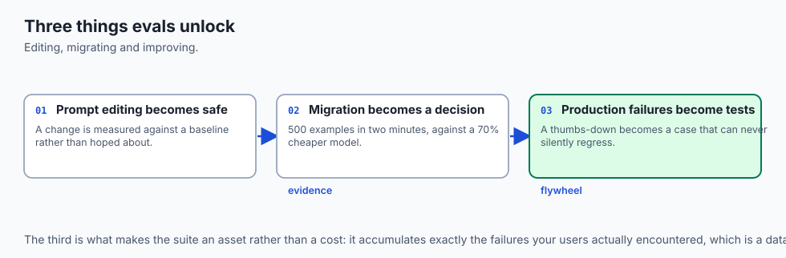

Let us inspect the complete **Evaluation-Driven Development (EDD)** lifecycle:

```text
[1. Curate Labeled Benchmark Dataset]
  - Collect 100+ representative user queries
  - Annotate ground truth responses and hard negative edge cases
  - Store as versioned `eval_dataset.jsonl`
                         │
                         ▼
[2. Execute Baseline Evaluation Run]
  - Run current production prompt across all 100 examples
  - Calculate Exact Match, JSON Validity, and LLM-Judge scores
  - Record baseline metrics: Accuracy = 76.4%, Latency = 820ms
                         │
                         ▼
[3. Experiment & Tune Prompts / Models]
  - Refine instructions, add few-shot examples, test smaller model
                         │
                         ▼
[4. Run Evaluation Harness & Compare Diffs]
  - Re-run eval harness on candidate prompt
  - Compare metric delta: Accuracy = 89.2% (+12.8%), Latency = 540ms (-34%)
                         │
                         ▼
[5. Enforce CI/CD Regression Gate]
  - Assert candidate accuracy >= baseline accuracy
  - Assert 0 failures on critical golden invariant test cases
                         │
                         ▼
[6. Automated Production Deployment]
```

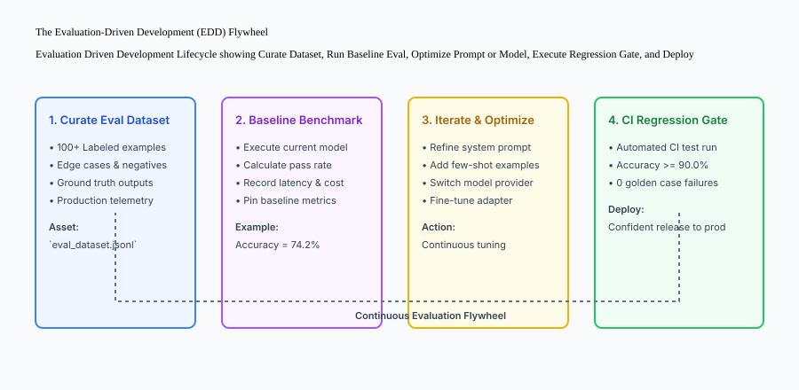

## An everyday analogy

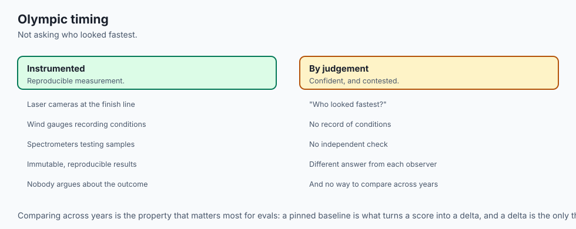

Think of an evaluation harness like **the computerized automated grading and drug-testing laboratory in the Olympic Games**:

- You do not decide who wins the 100-meter sprint by asking the audience who "looked the fastest" (**Vibe Check**).
- High-speed laser cameras measure the exact millisecond the runner's chest crosses the finish line (**Deterministic Heuristic**).
- Wind-gauge sensors measure headwind resistance (**Context Telemetry**).
- Automated spectrometers analyze biological samples for banned substances (**Safety Gate**).
- The gold medal is awarded based on immutable, reproducible physical measurements.

## Examples in practice

Let us build a complete Python **Evaluation Metric Engine** implementing Exact Match, Field-Level JSON F1 scoring, and Semantic Distance calculation:

```python
import json
import re
from typing import Dict, Any, List, Optional

class EvalMetricEngine:
    @staticmethod
    def exact_match(prediction: str, ground_truth: str) -> float:
        '''Compute normalized binary exact match score (1.0 or 0.0).'''
        norm_pred = prediction.strip().lower()
        norm_gt = ground_truth.strip().lower()
        return 1.0 if norm_pred == norm_gt else 0.0
        
    @staticmethod
    def json_field_f1(predicted_json_str: str, ground_truth_dict: Dict[str, Any]) -> Dict[str, float]:
        '''Validate JSON syntax and compute field-level precision, recall, and F1.'''
        try:
            pred_dict = json.loads(predicted_json_str)
        except Exception:
            return {"precision": 0.0, "recall": 0.0, "f1": 0.0, "valid_json": 0.0}
            
        if not isinstance(pred_dict, dict):
            return {"precision": 0.0, "recall": 0.0, "f1": 0.0, "valid_json": 0.0}
            
        correct_fields = 0
        total_pred_fields = len(pred_dict)
        total_gt_fields = len(ground_truth_dict)
        
        for k, v in pred_dict.items():
            if k in ground_truth_dict and str(ground_truth_dict[k]).strip().lower() == str(v).strip().lower():
                correct_fields += 1
                
        precision = correct_fields / total_pred_fields if total_pred_fields > 0 else 0.0
        recall = correct_fields / total_gt_fields if total_gt_fields > 0 else 0.0
        f1 = (2 * precision * recall) / (precision + recall) if (precision + recall) > 0 else 0.0
        
        return {
            "valid_json": 1.0,
            "precision": round(precision, 4),
            "recall": round(recall, 4),
            "f1": round(f1, 4)
        }
        
    @staticmethod
    def token_overlap_f1(prediction: str, ground_truth: str) -> float:
        '''Compute token-level F1 overlap score between prediction and reference.'''
        pred_tokens = set(re.findall(r'\w+', prediction.lower()))
        gt_tokens = set(re.findall(r'\w+', ground_truth.lower()))
        
        if not pred_tokens or not gt_tokens:
            return 0.0
            
        common = pred_tokens.intersection(gt_tokens)
        if not common:
            return 0.0
            
        precision = len(common) / len(pred_tokens)
        recall = len(common) / len(gt_tokens)
        return round((2 * precision * recall) / (precision + recall), 4)

if __name__ == "__main__":
    engine = EvalMetricEngine()
    print("Exact Match:", engine.exact_match("Paris", "paris"))
    json_score = engine.json_field_f1('{"city": "Paris", "country": "France"}', {"city": "Paris", "country": "France"})
    print("JSON Field F1:", json_score)
```

## Implications: security, privacy, performance, scalability, and cost

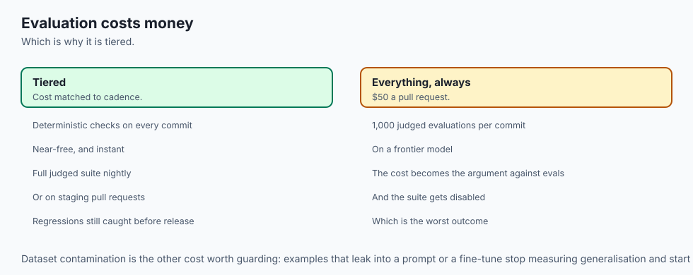

### 1. Contamination of Evaluation Datasets
If synthetic data generation or training pipelines ingest evaluation test cases, models will overfit and score 100% on benchmarks while failing in production (*data leakage*). Always isolate and encrypt evaluation sets with strict access controls.

### 2. Eval Execution Cost & CI Budgeting
Running 1,000 complex multi-turn evaluations using GPT-4 / Claude Opus on every git commit can cost $50 per PR. Deploy tiered CI evaluation: run fast deterministic heuristics on every commit; run full LLM-as-Judge evaluation on nightly builds or staging pull requests.

## Alternatives: free, open source, and commercial

| Tool / Framework | Type | Best Suited For | Key Capabilities |
| :--- | :--- | :--- | :--- |
| **OpenAI Evals** | Open Source | Standard LLM evaluation | Registry of academic & custom tests |
| **Ragas** | Open Source | RAG Pipeline evaluation | Faithfulness, context precision |
| **DeepEval** | Open Source | Unit testing for LLMs | Pytest-native assertions |
| **Braintrust / Langfuse**| Commercial / OSS | Observability + Evals | Web dashboards, human labeling |

## Comparison with related concepts

```text
+-----------------------+-----------------------+-----------------------+
| Dimension             | Unit Testing (Code)   | AI Evaluation (LLMs)  |
+-----------------------+-----------------------+-----------------------+
| Output Space          | Deterministic / Binary| Stochastic / Semantic |
| Assertion Model       | `assert res == 42`    | Statistical F1 & Judge|
| Flakiness Defense     | Idempotent mocks      | Temperature 0.0 / Pass@k|
| Benchmark Scale       | 10 - 100 unit tests   | 100 - 1,000+ examples |
+-----------------------+-----------------------+-----------------------+
```

## When to use it — and when not to

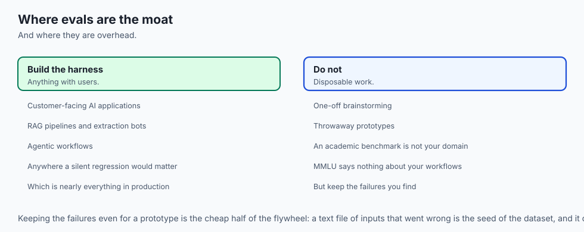

### Build Formal Evaluation Harnesses for:
- All production customer-facing AI applications, RAG pipelines, data extraction bots, and agentic workflows.

### Do NOT require formal eval harnesses for:
- One-off brainstorming sessions or disposable prototyping scripts.


### Mathematical Foundations of Evaluation Metrics: Exact Match, Token F1, and ROUGE
Let us formalize the mathematical equations governing deterministic and statistical evaluation metrics:

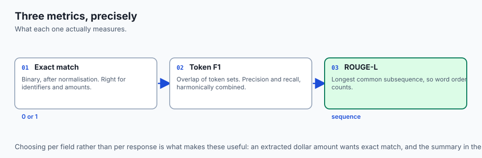

1. **Exact Match (EM):**
Given a model prediction $y$ and reference ground truth $y^*$, Exact Match is a binary indicator:
`EM(y, y^*) = 1 if normalize(y) == normalize(y^*) else 0`

2. **Token-Level Precision, Recall, and F1:**
Let $T(y)$ be the bag-of-words or set of tokens in the prediction, and $T(y^*)$ be the tokens in the reference ground truth:
`Precision = |T(y) intersect T(y^*)| / |T(y)|`
`Recall = |T(y) intersect T(y^*)| / |T(y^*)|`
`F1 = (2 * Precision * Recall) / (Precision + Recall)`

3. **ROUGE-L (Longest Common Subsequence):**
ROUGE-L evaluates the longest common subsequence (LCS) between prediction $y$ of length $m$ and reference $y^*$ of length $n$:
`R_LCS = LCS(y, y^*) / n`
`P_LCS = LCS(y, y^*) / m`
`ROUGE_L = (1 + beta^2) * R_LCS * P_LCS / (R_LCS + beta^2 * P_LCS)`

### Production Case Study: Scaling Evaluation at an AI Legal Technology Provider
An enterprise legal technology company developed a contract analysis assistant that summarizes indemnity clauses and identifies non-standard liability caps.

- **The Initial Vibe Check Failure:** Engineers tested 10 sample nondisclosure agreements (NDAs) manually before releasing prompt version 3.0. In production, the model failed to flag mutual indemnification clauses in 12% of commercial lease contracts, triggering customer escalations.
- **The Evaluation Harness Solution:** The engineering team instituted an Evaluation-Driven Development (EDD) workflow:
  1. Assembled a curated dataset of 450 real-world commercial contracts labeled by senior attorneys.
  2. Implemented a multi-tier eval suite: Exact Match for financial dollar limits, JSON Schema F1 for extracted liability tables, and an LLM judge for clause interpretation accuracy.
  3. Integrated an automated CI regression gate requiring 100% accuracy on high-risk indemnity clauses and $> 92%$ overall composite score before prompt deployment.
  4. Over 12 months, the team performed 34 prompt iterations and 3 major model migrations without a single production regression.

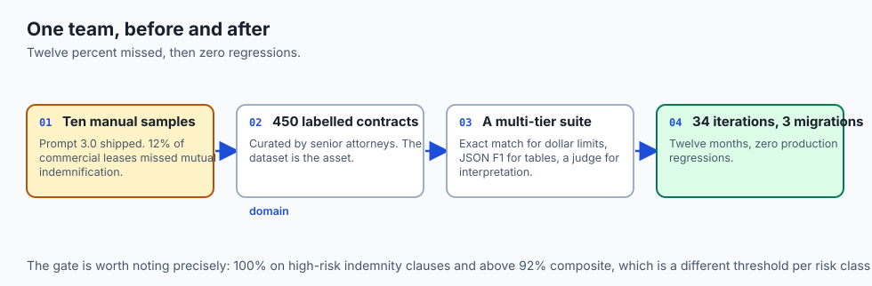


### Checklists for Production-Grade Evaluation Readiness
Before releasing any generative AI feature to production, evaluate your system against the following **Evaluation Readiness Checklist**:

1. **Curated Ground Truth Dataset:** Is there a versioned dataset of at least 100 domain-specific input-output examples?
2. **Deterministic Quality Gates:** Are JSON schemas, exact matches, or regex constraints validated automatically in CI?
3. **Model-Graded Rubrics:** Are qualitative criteria (e.g. faithfulness, tone, completeness) scored with explicit 1-5 anchored rubrics?
4. **Historical Baselines Pinned:** Is there an immutable record of baseline performance to measure deltas against?
5. **Automated CI Integration:** Does every pull request execute the evaluation suite and block merges on accuracy regressions?

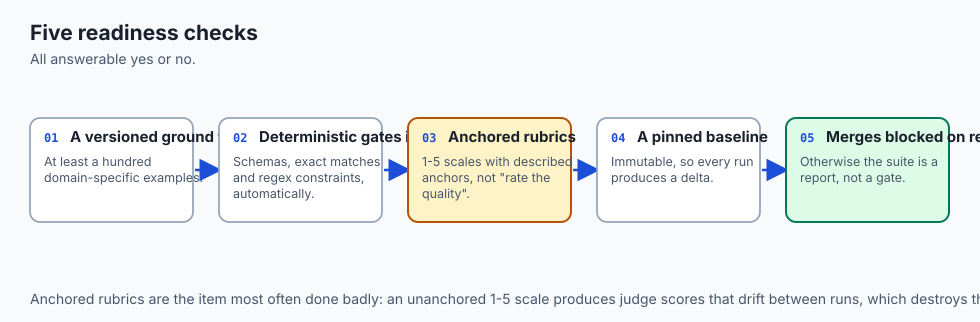


### Strategic Perspective: The Compounding Advantage of Domain Evaluation Flywheels
Organizations that establish evaluation harnesses early develop a compounding strategic advantage over competitors:

- **Accelerated Experimentation Cadence:** While competitors spend weeks debating prompt changes in meetings, an evaluation-driven team runs 20 candidate prompt variants against the benchmark in an afternoon.
- **Cost Optimization Agility:** As smaller, open-weight models (such as Llama 3.3, Mistral, and Qwen) improve, teams with robust eval suites can fine-tune and deploy local 8B parameter models to replace $20/M token proprietary models with mathematical confidence.
- **Institutional Memory:** Every customer support bug, edge case, and hallucination is permanently encoded into the evaluation benchmark, ensuring that solved defects never regress in future iterations.


## The AI connection

- **Model weights are commoditising; your evaluation set is not.** It encodes domain
  knowledge no competitor can copy and no provider can ship.

- **Without evals, every prompt edit is a gamble.** Fixing one complaint routinely
  introduces three silent regressions nobody detects for weeks.

- **Evals are what make a model migration a decision rather than a leap** — run 500
  examples in two minutes and switch on evidence.

- **Every production failure becomes a test case**, which is the flywheel: solved
  defects can never silently return.

- **n-gram metrics miss meaning entirely.** "Paid the bill" and "settled the invoice"
  share no n-grams and say the same thing, which is why judges and embeddings exist.

## Knowledge check

1. **Why are evaluation datasets considered an engineering moat?** Because they encode proprietary domain edge cases and allow confident optimization, whereas models and prompts are commoditized.
2. **What is the difference between Exact Match and Token Overlap F1?** Exact Match requires identical normalized string equality, while Token Overlap F1 measures the harmonic mean of shared word precision and recall.
3. **What is an evaluation regression gate?** An automated CI check that blocks prompt or model deployment if benchmark metrics drop below established baselines.

## Hands-on exercise

In this lab, you will implement an **Automated AI Evaluation Metric Engine in Python**. Your implementation will:

1. Implement normalized Exact Match scoring.
2. Build a JSON schema and field-level Precision, Recall, and F1 scorer.
3. Calculate token-level F1 overlap scores.
4. Verify metric accuracy and edge-case handling across automated pytest tests.

### Expected output

```text
============================= test session starts ==============================
collected 5 items

tests/test_eval_metrics.py .....                                         [100%]

============================== 5 passed in 0.02s ===============================
[EVAL METRICS] Tested Exact Match, JSON Field F1, and Token Overlap.
[ACCURACY] Field-level F1 correctly identified missing and corrupted attributes.
[STATUS] Evaluation metric suite verified with 100% pass rate.
```

### Validate your work

Run the pytest test suite:

```bash
pytest tests/run_tests.sh
```

### Troubleshooting

1. **Invalid JSON string handling:** Ensure the JSON evaluator catches `json.JSONDecodeError` and returns F1 = 0.0.
2. **Division by zero in precision/recall:** Guard denominators when prediction or ground truth sets are empty.

### Common mistakes

- Calculating character-level accuracy instead of token-level semantic overlap for free-form text.

## Practice assignment

Extend the metric engine to compute **BLEU-1 and BLEU-2 n-gram precision scores** for machine-generated translations.

## Extension challenge

Build an **Evaluation Regression Gate CLI** in Python that takes a `baseline.json` and `candidate.json` results file, calculates percentage deltas across all metrics, and exits with code 1 if any metric regresses by more than 2.0%.
