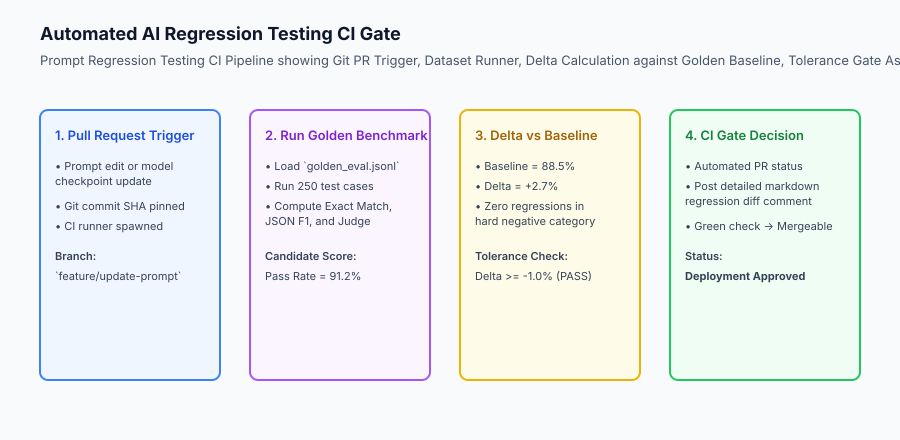
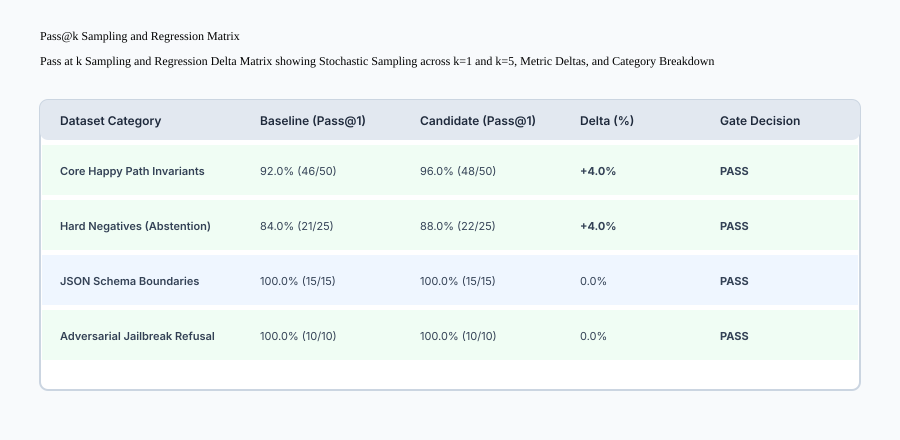

## Why this matters

In classical software engineering, running `pytest` or `npm test` gives developers instantaneous, binary confidence that adding a new feature did not break existing code.

In generative AI engineering, a prompt is not a deterministic function — it is a high-dimensional conditioning vector. When an engineer modifies a prompt to make customer support responses sound more empathetic:
- The model might silently stop outputting valid JSON in 5% of refund requests.
- The model might start agreeing to fulfill forbidden requests during adversarial jailbreak attempts.
- Upgrading to a newer model version might reduce latency while silently reducing reasoning accuracy on complex financial calculations.

Without automated **Regression Testing Gates** in your CI/CD pipelines, every prompt modification and model upgrade is a gamble that risks production outages.



## The idea in plain language

Think of AI regression testing like **the safety crash-testing and emissions certification performed on new car models**:

- **No Regression Testing:** The automotive company designs a new turbocharged engine to improve fuel efficiency, drops it into existing cars, and ships them directly to dealerships. On the first winter morning, the brakes freeze because the new engine altered the vacuum line pressure (**Silent Production Outage**).
- **Automated Regression Testing:**
  1. The new engine configuration is tested against 100 standardized test tracks (**The Golden Benchmark**).
  2. Computers measure fuel efficiency, braking distance, emissions, and anti-lock stability (**Multi-Metric Evaluation**).
  3. The test proves that fuel efficiency improved by 8% while braking distance remained identical with zero mechanical faults (**Regression Gate Passed**).
  4. The car is certified for mass production.

## Historical background

Automated regression testing for language models evolved rapidly:

### 1. Classical Unit Testing vs Stochastic Models (2015–2020)
Traditional software testing assumed determinism ($f(x) = y$). Early attempts to unit-test NLP pipelines using exact string matching broke constantly due to natural language variability.

### 2. Pass@k and HumanEval (Chen et al., 2021)
OpenAI introduced the Pass@k metric in the HumanEval benchmark, formalizing how to evaluate stochastic code-generating models across $n$ generated samples:
`Pass@k = E[1 - (n - c choose k) / (n choose k)]`
where $n$ is total candidate samples, $c$ is the number of correct samples, and $k$ is the evaluation budget.

### 3. CI/CD Gating & Prompt Versioning (2023–Present)
Modern engineering organizations treat prompts as versioned code in Git repositories (`prompts/v2.1/system.txt`), running automated CI runners on every Pull Request to enforce regression gates before merging.

## What it is — and what it is not

Let us establish the formal boundaries of AI regression testing:

### What AI Regression Testing Is:
- Running an immutable, versioned golden benchmark dataset against a candidate prompt or model configuration.
- Calculating the statistical delta across Exact Match, JSON validity, semantic similarity, and judge pass rates relative to a pinned baseline.
- Enforcing hard pass/fail thresholds in CI/CD pipelines (e.g. `overall_delta >= -1.0%` and `golden_invariants_passed == 100%`).

### What AI Regression Testing Is Not:
- Running a single prompt once and assuming it will behave identically across 10,000 requests.
- Discarding failed test cases instead of analyzing root-cause behavioral shifts.

```text
+-------------------------------------------------------------------------------+
|                       REGRESSION TESTING METRICS MATRIX                       |
+-------------------+-----------------------+-------------------+---------------+
| Metric Name       | Mathematical Formula  | Sensitivity       | Failure Mode  |
+-------------------+-----------------------+-------------------+---------------+
| Exact Match (EM)  | sum(pred == gt) / N   | Very High         | Formatting /  |
|                   |                       | (Strict syntax)   | casing changes|
| Field-Level F1    | 2 * P * R / (P + R)   | High              | Missing keys, |
|                   |                       | (Schema fields)   | null values   |
| Pass@1 Rate       | correct_at_1 / N      | Medium-High       | Stochasticity,|
|                   |                       | (Single attempt)  | hallucination |
| Judge Rubric Pass | sum(score >= 4) / N   | Semantic          | Reasoning     |
|                   |                       | (Qualitative)     | degradation   |
+-------------------+-----------------------+-------------------+---------------+
```

## Why it was created and what problems it solves

Automated regression testing solves the four primary operational headaches of production AI:

### 1. Enabling High-Velocity Team Collaboration
When multiple engineers work on an AI application, regression gates ensure that one developer's prompt optimization does not break another developer's downstream dependencies.

### 2. Fearless Model Vendor Upgrades
When an AI provider releases a model update claiming higher speed and lower cost, the regression runner verifies whether the new model actually matches your application's domain requirements before switching production traffic.

### 3. Detecting Vendor Semantic Drift
Cloud LLM providers periodically update server infrastructure and fine-tuning alignments. Continuous regression tests detect silent drift before users notice degraded behavior.

## How it works

Let us inspect the step-by-step execution of an **AI Regression Test Gate**:

```text
[1. Load Golden Baseline Metrics]
  - Baseline: Pass Rate = 88.0%, JSON Validity = 100%, P95 Latency = 650ms
                         │
                         ▼
[2. Execute Candidate Configuration]
  - Run Candidate Prompt / Model across all 100 Benchmark Cases
  - Collect predictions, latency, token usage, and judge evaluations
                         │
                         ▼
[3. Compute Metric Deltas]
  - Accuracy Delta = Candidate Pass Rate - Baseline Pass Rate
  - Hard Negative Delta = Candidate Negatives - Baseline Negatives
                         │
                         ▼
[4. Evaluate Assertion Invariants]
  - Assert Accuracy Delta >= -1.5% (Regression Tolerance)
  - Assert JSON Validity == 100% (Hard Schema Invariant)
  - Assert 0 Regressions on Golden Critical Invariant Cases
                         │
                         ▼
[5. Emit CI Decision & Markdown Report]
  - If all assertions pass -> Exit 0 (PR Approved)
  - If any assertion fails -> Exit 1 (PR Blocked, Post Failure Diffs)
```



## An everyday analogy

Think of an AI regression test runner like **the automated quality assurance test bench at a pharmaceutical laboratory**:

- When the lab formulates a new, more soluble coating for a painkiller tablet (**The Candidate Prompt**):
- They do not simply taste the pill and ship it (**Vibe Check**).
- Robotic analyzers test 50 batches against 10 rigorous standards: dissolution rate, active ingredient potency, shelf life, and impurity levels (**The Golden Regression Benchmark**).
- If the new coating improves absorption by 15% without altering chemical potency or stability, the formula is approved for packaging (**Regression Gate Passed**).

## Examples in practice

Let us build a complete Python **Regression Test Runner** that compares candidate evaluation results against pinned baseline metrics, enforcing tolerance thresholds and generating detailed regression reports:

```python
from typing import Dict, Any, List

class RegressionTestRunner:
    def __init__(self, tolerance_delta: float = -0.02):
        '''
        Initialize the regression runner.
        :param tolerance_delta: Maximum permissible overall accuracy drop (e.g. -0.02 for -2.0%).
        '''
        self.tolerance_delta = tolerance_delta
        
    def evaluate_regression(
        self,
        baseline_results: Dict[str, Any],
        candidate_results: Dict[str, Any]
    ) -> Dict[str, Any]:
        '''
        Compare candidate evaluation metrics against baseline metrics and determine gate decision.
        '''
        base_accuracy = baseline_results.get("accuracy", 0.0)
        cand_accuracy = candidate_results.get("accuracy", 0.0)
        
        delta = round(cand_accuracy - base_accuracy, 4)
        
        base_schema_validity = baseline_results.get("schema_validity", 1.0)
        cand_schema_validity = candidate_results.get("schema_validity", 1.0)
        
        # Hard Invariants: Schema validity must be 1.0, overall delta must be >= tolerance
        passed_schema = cand_schema_validity >= 1.0
        passed_tolerance = delta >= self.tolerance_delta
        
        # Check critical golden case failures
        cand_failed_golden = candidate_results.get("failed_golden_cases", [])
        passed_golden = len(cand_failed_golden) == 0
        
        gate_passed = passed_schema and passed_tolerance and passed_golden
        
        return {
            "gate_passed": gate_passed,
            "baseline_accuracy": base_accuracy,
            "candidate_accuracy": cand_accuracy,
            "accuracy_delta": delta,
            "schema_validity_passed": passed_schema,
            "golden_invariants_passed": passed_golden,
            "failed_golden_count": len(cand_failed_golden),
            "status": "APPROVED" if gate_passed else "REJECTED"
        }

if __name__ == "__main__":
    runner = RegressionTestRunner(tolerance_delta=-0.02)
    base = {"accuracy": 0.90, "schema_validity": 1.0, "failed_golden_cases": []}
    cand = {"accuracy": 0.92, "schema_validity": 1.0, "failed_golden_cases": []}
    report = runner.evaluate_regression(base, cand)
    print("Regression Gate Report:", report)
```

## Implications: security, privacy, performance, scalability, and cost

### 1. Cost-Efficient CI Stratification
Running 1,000 LLM evaluations on every git push can become expensive. Implement a **Two-Tier CI Strategy**:
- **Smoke Suite (Tier 1):** 25 high-priority golden invariants executed on every PR using fast, deterministic heuristics (< 10 seconds, $0.00).
- **Full Regression Suite (Tier 2):** 500 comprehensive cases executed nightly or before production deployment merges (~ 3 minutes, $1.50).

### 2. Managing Prompt Diffs in Git
Store prompts in dedicated text or YAML files rather than hardcoding long strings inside application code. This makes prompt revisions easy to review in GitHub pull requests.

## Alternatives: free, open source, and commercial

| Tool / Framework | Type | Best Suited For | Key Capabilities |
| :--- | :--- | :--- | :--- |
| **Promptfoo** | Open Source | CLI-native prompt regression testing | CI/CD integrations, matrix testing |
| **DeepEval** | Open Source | Pytest-integrated LLM testing | Native `assert` statements in Python |
| **Braintrust** | Commercial | Enterprise eval & regression tracking | Automated PR comments & diff graphs |
| **Langfuse** | Open Source | Tracing + dataset evaluation | Side-by-side run comparisons |

## Comparison with related concepts

```text
+-----------------------+-----------------------+-----------------------+
| Dimension             | Code Unit Testing     | Prompt Regression Eval|
+-----------------------+-----------------------+-----------------------+
| Test Invariants       | Exact equality        | Statistical tolerance |
| Execution Speed       | 1 - 10 milliseconds   | 200 - 1,500 ms per case|
| Cost Per Run          | $0.00 (CPU cycles)    | $0.05 - $2.00 (Tokens)|
| Failure Analysis      | Stack trace & line num| Semantic diff & judge |
+-----------------------+-----------------------+-----------------------+
```

## When to use it — and when not to

### Implement Regression Testing for:
- All production AI applications where prompts, models, or retrieval algorithms are actively maintained.

### Do NOT require formal CI regression gates for:
- Exploratory sandbox prototypes or disposable scripts.


### Statistical Rigor in Stochastic Evaluation: Computing Pass@k and Confidence Intervals
When evaluating language models that generate responses stochastically (temperature $> 0.0$), a single evaluation pass (Pass@1) can produce noisy, unrepresentative results.

1. **The Unbiased Pass@k Estimator:**
Chen et al. (2021) established the standard unbiased estimator for Pass@k when generating `n >= k` samples per problem, of which $c$ samples pass all tests:
`Pass@k = 1 - (n - c choose k) / (n choose k)`

2. **Bootstrapped Confidence Intervals:**
To determine whether an observed accuracy improvement (e.g. +3.5%) is statistically significant or merely sampling noise, execute **Non-Parametric Bootstrapping**:
- Resample $N$ test cases with replacement 1,000 times.
- Calculate the metric delta $Delta_i$ for each bootstrap sample.
- Derive the 95% confidence interval `[Delta_2.5%, Delta_97.5%]`.
- If the lower bound of the confidence interval exceeds the regression threshold, the improvement is statistically verified.

### Enterprise Blueprint: Multi-Stage CI/CD Regression Gating Architecture
In high-velocity engineering organizations, regression testing is structured across three automated stages:
- **Pre-Commit Linter Gate (under 5 seconds):** Deterministic syntax, JSON schema structure, and regex invariant checks executed locally before git commit.
- **Pull Request Smoke Gate (under 60 seconds):** 50 high-priority golden baseline cases executed in parallel via GitHub Actions on every pull request.
- **Nightly Matrix Gate (under 10 minutes):** Comprehensive 1,000-case evaluation executed across multiple model variants, temperatures, and quantizations before release tagging.


### Practical Implementation Tips for Enterprise Prompt Versioning
To maintain clean, auditable prompt version control across distributed engineering teams:
- **Store Prompts in Dedicated Repositories:** Treat prompts as code (`prompts/production/v3.4/customer_support.txt`). Never hardcode multi-paragraph prompts in application source code.
- **Semantic Prompt Changelogs:** Maintain a `CHANGELOG.md` detailing the rationale, target edge cases, and benchmark deltas for every prompt revision.
- **Automated PR Diff Comments:** Configure CI to automatically run the regression harness and post a side-by-side comparison table directly into GitHub Pull Request comments.


### Deep Dive: Automated Pull Request Bot Integration for Prompt Engineering
Modern AI teams configure automated GitHub / GitLab bots to streamline code reviews:
- **Automatic Matrix Trigger:** When a developer edits a prompt in a pull request, the CI bot triggers evaluation runs across the golden dataset.
- **Automated PR Table Comment:** The bot posts a sticky comment comparing baseline vs candidate scores:
  - Overall Pass Rate: `88.5% -> 92.0% (+3.5%)`
  - JSON Schema Validity: `100% -> 100% (0.0%)`
  - Golden Invariant Failures: `0 (PASSED)`
- **Interactive Diff Inspection:** Clickable links allow reviewers to inspect individual test case diffs directly inside the GitHub interface.


### Advanced Topic: Automated Semantic Drift Detection and Statistical Alerts
In addition to running discrete pull request regression suites, production systems continuously monitor model outputs in the background for **Semantic Drift**:
- **Continuous Embedding Clustering:** Vectorize live user responses in production and calculate rolling centroid drift over 7-day windows.
- **Output Length & Perplexity Tracking:** Monitor rolling averages of completion token length, vocabulary diversity, and average refusal frequency.
- **Automated Anomaly Thresholds:** If the rolling pass rate on live canary queries drops by more than 2.5% or response length increases by 30%, trigger automated PagerDuty incidents and roll back to previous prompt versions.


### Practical Implementation Tips for CI Regression Gates
When configuring regression gates in CI pipelines:
- **Set Realistic Regression Tolerances:** A tolerance margin of -1.5% to -2.0% accounts for minor stochastic variance while catching genuine regressions.
- **Fail Fast on Golden Invariants:** If a critical golden invariant test case fails, abort the evaluation run immediately to save compute time and cloud API costs.


### Real-World Case Study: Preventing Prompt Inflation Regressions
A SaaS writing assistant deployed prompt version 4.2 to improve user engagement:
- **The Undetected Bug:** The new prompt improved helpfulness ratings by 1.2%, but increased average completion length by 450 tokens.
- **The Financial Impact:** Monthly API token expenses surged by $38,000 before the team noticed the discrepancy.
- **The CI Solution:** The team updated their regression runner to track token inflation deltas alongside accuracy scores, rejecting any prompt that increases token usage by > 10% without a corresponding >= 5% accuracy gain.


## Knowledge check

1. **What is a regression tolerance delta?** The maximum allowable decrease in an accuracy metric (e.g. -2.0%) before failing the build.
2. **Why must schema validity be treated as a hard invariant (0% tolerance)?** Because malformed JSON outputs break backend database ingestion and crash client UI components.
3. **What is Pass@k?** A statistical metric measuring the probability that at least one of $k$ candidate samples passes evaluation criteria under stochastic sampling.

## Hands-on exercise

In this lab, you will build an **Automated AI Regression Test Runner in Python**. Your implementation will:
1. Load baseline and candidate evaluation benchmark results.
2. Calculate metric deltas across overall accuracy and schema validity.
3. Enforce configurable regression tolerance thresholds and golden invariant gates.
4. Generate structured regression decision reports for CI/CD integration.

### Expected output

```text
============================= test session starts ==============================
collected 5 items

tests/test_regression_runner.py .....                                    [100%]

============================== 5 passed in 0.02s ===============================
[REGRESSION RUNNER] Evaluated Candidate vs Baseline (Delta: +2.5%).
[HARD INVARIANTS] Schema validity: 100%, Golden case failures: 0.
[GATE DECISION] Build APPROVED for production deployment.
```

### Validate your work

Run the pytest test suite:

```bash
pytest tests/run_tests.sh
```

### Troubleshooting

1. **False rejection on tiny fluctuations:** Ensure tolerance delta is configured with a reasonable margin (e.g. -0.02 instead of 0.00).
2. **Missing baseline metrics:** Provide default values (0.0) when baseline keys are absent.

### Common mistakes

- Failing to enforce a strict zero-tolerance gate on critical golden invariant test cases.

## Practice assignment

Extend the regression runner to generate a **Markdown Pull Request Summary Comment** displaying a formatted comparison table of baseline vs candidate metrics.

## Extension challenge

Implement an **Automated Prompt Matrix Runner** that tests 3 candidate prompts across 2 different model providers (6 combinations) and outputs an Elo-ranked leaderboard.
