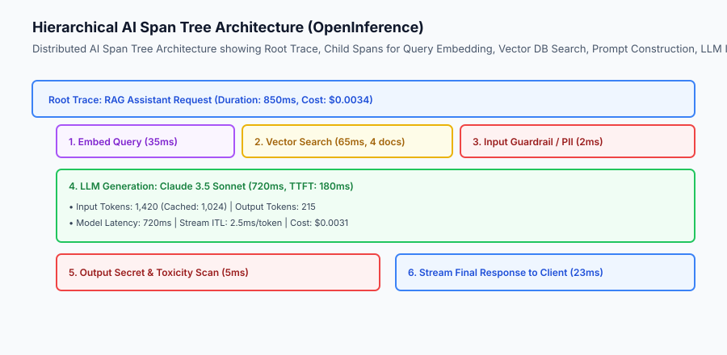
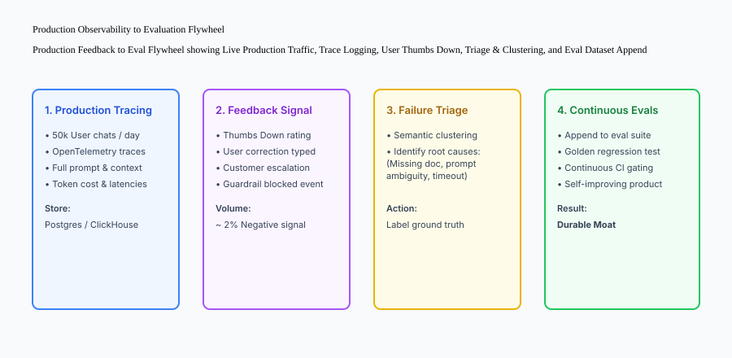

## Why this matters

Deploying a generative AI application without observability is like flying a supersonic jet at night with all cockpit instruments disconnected. When an end user complains that *"the assistant gave the wrong answer and was really slow"*:
- Was the failure caused by poor retrieval ranking in the vector database?
- Did the system prompt fail to instruct the model properly?
- Did the LLM provider experience an infrastructure latency spike (`> 4000ms`)?
- Did the output guardrail redact legitimate content by mistake?

**AI Observability and Distributed Tracing** provides complete, granular visibility into every step of a compound AI system: tracking nested span trees, recording prompt versions, auditing token economics, and capturing user feedback to fuel continuous evaluation datasets.



## The idea in plain language

Think of AI observability like **the flight data recorder (black box) and live telemetry telemetry stream on a spacecraft**:

- **No Observability (Console Logs Only):** The spacecraft experiences a thruster malfunction. The engineer searches a flat text log and sees `Error: 500`. No one knows whether the fuel valve stuck, the guidance computer calculated the wrong trajectory, or a sensor disconnected (**Complete Blindness**).
- **Distributed AI Tracing:**
  1. The entire mission is assigned a global `trace_id` (**The Root Trace**).
  2. Every operation (sensor read, navigation calculation, thruster firing) is recorded as a nested child span with microsecond start and end timestamps (**Span Hierarchy**).
  3. Fuel consumption and sensor payloads are logged at every node (**Token & Cost Telemetry**).
  4. The flight engineer clicks the failed span and sees the exact input pressure, computed delta-V, and error code in seconds.

## Historical background

Distributed tracing and APM evolved through three generations:

### 1. Traditional APM and Dapper (2010–2018)
Google's Dapper paper established distributed RPC tracing (`trace_id`, `span_id`). Tools like Datadog, Jaeger, and Zipkin visualized HTTP service-to-service calls.

### 2. The OpenTelemetry Standard (2019–2022)
The Cloud Native Computing Foundation (CNCF) merged OpenTracing and OpenCensus into **OpenTelemetry (OTel)**, creating a universal, vendor-neutral telemetry standard.

### 3. OpenInference and Generative AI Observability (2023–Present)
Generative AI required domain-specific semantic conventions: tracking prompt templates, temperature, token counts (input/cached/output), retrieved vector documents, and LLM-as-a-Judge evaluations (Arize Phoenix, Langfuse, LangSmith).

## What it is — and what it is not

Let us define the core components of production AI observability:

### What AI Observability Is:
- A structured hierarchy of nested spans capturing every retrieval, prompt formatting, model invocation, and guardrail step.
- Real-time accounting of token usage, prompt caching efficiency, and dollar costs per tenant.
- An integrated feedback collection system linking user ratings (thumbs up/down) to specific execution trace IDs.

### What AI Observability Is Not:
- Unstructured `print()` statements scattered across Python code.
- Storing unencrypted customer passwords or sensitive PII in trace databases.

```text
+-------------------------------------------------------------------------------+
|                       OPENINFERENCE SPAN ATTRIBUTES                           |
+---------------------------+-----------------------+---------------------------+
| Semantic Attribute        | Data Type             | Example Value             |
+---------------------------+-----------------------+---------------------------+
| `openinference.span.kind` | string                | `LLM`, `RETRIEVER`, `TOOL`|
| `llm.model_name`          | string                | `claude-3-5-sonnet-20241022`|
| `llm.token_count.prompt`  | integer               | `1420`                    |
| `llm.token_count.completion`| integer             | `215`                     |
| `llm.token_count.cached`  | integer               | `1024`                    |
| `llm.cost_usd`            | float                 | `0.0031`                  |
| `retrieval.documents`     | JSON list             | `[{"doc_id": "d1", "score": 0.88}]`|
+---------------------------+-----------------------+---------------------------+
```

## Why it was created and what problems it solves

AI observability solves the four primary operational challenges of production AI systems:

### 1. Root-Cause Debugging in Compound AI Pipelines
When a RAG assistant fails, distributed traces reveal whether the failure was caused by empty vector search results, truncated prompt context, or model reasoning errors.

### 2. Controlling Runaway Token Costs
Real-time token telemetry tracks token usage per user and organization, immediately identifying infinite tool loops or prompt inflation regressions.

### 3. Continuous Improvement via User Feedback
When a user clicks "thumbs down", the UI sends the rating attached to the `trace_id`. Engineers can review the exact trace, identify the failure mode, and add it to the evaluation dataset.

## How it works

Let us inspect the complete **Production Observability to Evaluation Flywheel**:

```text
[1. Live Production User Request]
  - User submits query with `trace_id = trace_abc123`
                         │
                         ▼
[2. Distributed Span Tree Execution]
  - Span: Embedding Search (45ms)
  - Span: LLM Generation (Claude 3.5 Sonnet, 1,200 tokens, 680ms)
  - Span: Output Guardrail Validation (4ms)
                         │
                         ▼
[3. User Feedback Collection]
  - User clicks Thumbs Down: "The answer was outdated."
  - Telemetry logs feedback linked to `trace_abc123`
                         │
                         ▼
[4. Automated Failure Triage & Clustering]
  - Semantic clustering tags issue: `category/outdated_context`
  - Annotator adds correct ground truth response
                         │
                         ▼
[5. Append to Golden Eval Dataset]
  - New test case added to `golden_eval.jsonl`
  - CI regression gate guarantees this bug will never recur
```



## An everyday analogy

Think of an AI distributed tracer like **the parcel tracking barcode on an Amazon delivery**:

- When you order a package, you do not just wait 5 days in silence (**Unobservable System**).
- A barcode is scanned at the fulfillment center (**Span 1: Order Packed**).
- It is scanned entering the sorting hub (**Span 2: In Transit**).
- It is scanned onto the local delivery van (**Span 3: Out for Delivery**).
- If your package is delayed, you can see the exact sorting hub where it stopped.

## Examples in practice

Let us build a complete Python **Trace & Telemetry Engine** implementing nested span creation, duration timing, token accounting, cost calculation, and JSON trace export:

```python
import time
import uuid
import json
from typing import Dict, Any, List, Optional

class Span:
    def __init__(self, name: str, kind: str, parent_id: Optional[str] = None):
        self.span_id = str(uuid.uuid4())[:8]
        self.parent_id = parent_id
        self.name = name
        self.kind = kind
        self.start_time = time.time()
        self.end_time: Optional[float] = None
        self.duration_ms: float = 0.0
        self.attributes: Dict[str, Any] = {}
        self.children: List['Span'] = []
        
    def set_attribute(self, key: str, value: Any):
        self.attributes[key] = value
        
    def finish(self):
        self.end_time = time.time()
        self.duration_ms = round((self.end_time - self.start_time) * 1000, 2)
        
    def to_dict(self) -> Dict[str, Any]:
        return {
            "span_id": self.span_id,
            "parent_id": self.parent_id,
            "name": self.name,
            "kind": self.kind,
            "duration_ms": self.duration_ms,
            "attributes": self.attributes,
            "children": [c.to_dict() for c in self.children]
        }

class TraceTelemetryEngine:
    def __init__(self):
        self.traces: Dict[str, Span] = {}
        
    def start_trace(self, name: str) -> Span:
        root_span = Span(name=name, kind="ROOT")
        self.traces[root_span.span_id] = root_span
        return root_span
        
    def create_child_span(self, parent_span: Span, name: str, kind: str) -> Span:
        child = Span(name=name, kind=kind, parent_id=parent_span.span_id)
        parent_span.children.append(child)
        return child
        
    @staticmethod
    def calculate_cost(prompt_tokens: int, completion_tokens: int, model: str = "claude-3-5-sonnet") -> float:
        # Example pricing: $3.00/M prompt, $15.00/M completion
        cost = (prompt_tokens * 3.0 / 1_000_000) + (completion_tokens * 15.0 / 1_000_000)
        return round(cost, 6)

if __name__ == "__main__":
    engine = TraceTelemetryEngine()
    root = engine.start_trace("RAG_Query")
    llm_span = engine.create_child_span(root, "LLM_Inference", "LLM")
    llm_span.set_attribute("llm.model", "claude-3-5-sonnet")
    llm_span.set_attribute("llm.prompt_tokens", 1200)
    llm_span.set_attribute("llm.completion_tokens", 250)
    llm_span.set_attribute("llm.cost_usd", engine.calculate_cost(1200, 250))
    llm_span.finish()
    root.finish()
    print("Trace Export:", json.dumps(root.to_dict(), indent=2))
```

## Implications: security, privacy, performance, scalability, and cost

### 1. Privacy Scrubbing in Traces
Traces capture raw input prompts and model completions. Always apply PII scrubbing *before* writing spans to trace storage so customer credentials and personal data are never exposed in observability dashboards.

### 2. Telemetry Sampling at Scale
At millions of requests per day, storing 100% of LLM traces can generate massive database bills. Implement **Tail-Based Sampling**: store 100% of failed traces, high-latency traces (> 2000ms), and user-rated sessions, while sampling only 5% of routine happy-path requests.

## Alternatives: free, open source, and commercial

| Tool / Framework | Type | Best Suited For | Key Capabilities |
| :--- | :--- | :--- | :--- |
| **Langfuse** | Open Source | Full-stack AI observability | Self-hostable, web UI, eval integrations |
| **Arize Phoenix** | Open Source | Local tracing & evals | Zero-dependency local notebook tracing |
| **LangSmith** | Commercial | LangChain / LangGraph tracing | Interactive prompt playground |
| **OpenLLMetry** | Open Source | OpenTelemetry auto-instrumentation | Drop-in OTel SDK for all LLM providers |

## Comparison with related concepts

```text
+-----------------------+-----------------------+-----------------------+
| Dimension             | Standard APM Logs     | AI Observability      |
+-----------------------+-----------------------+-----------------------+
| Trace Payloads        | HTTP Headers & Status | Full Prompts & Context|
| Cost Accounting       | CPU / Memory metrics  | Token-level economics |
| Quality Feedback      | HTTP 500 error rates  | User thumbs & LLM eval|
| Semantic Analysis     | None (Flat text logs) | RAG chunk attribution |
+-----------------------+-----------------------+-----------------------+
```

## When to use it — and when not to

### Implement AI Tracing & Observability for:
- All production customer-facing AI applications, multi-step RAG pipelines, and autonomous multi-agent systems.

### Do NOT require distributed tracing for:
- Standalone offline data processing scripts running in single batches.


### Advanced Topic: OpenInference Semantic Conventions and Distributed Trace Spans
To achieve vendor-neutral observability across different LLM providers and frameworks, production systems adopt **OpenInference Semantic Conventions**:

```python
# OpenInference Semantic Span Attributes
span.set_attribute("openinference.span.kind", "LLM")
span.set_attribute("llm.model_name", "claude-3-5-sonnet-20241022")
span.set_attribute("llm.invocation_parameters", json.dumps({"temperature": 0.0, "max_tokens": 1024}))
span.set_attribute("llm.token_count.prompt", 1420)
span.set_attribute("llm.token_count.completion", 215)
span.set_attribute("llm.token_count.cached", 1024)
span.set_attribute("llm.cost_usd", 0.0031)
```

### Architectural Blueprint: High-Throughput Real-Time Telemetry Pipeline
In enterprise AI applications serving millions of queries per day, tracing telemetry is decoupled from the main request path:
1. **Non-Blocking Asynchronous Spans:** Spans are buffered in an in-memory ring buffer and dispatched in background batches via OpenTelemetry OTLP exporters.
2. **Kafka / Redpanda Ingestion Queue:** Telemetry spans are ingested into high-throughput streaming topics.
3. **ClickHouse Analytical Store:** Traces and token metrics are written to columnar storage, enabling sub-second analytical queries across billions of spans.
4. **Grafana / Datadog Dashboards:** Real-time dashboards monitor p95 latency, Time to First Token (TTFT), token consumption rate, and cost attribution per tenant.


### Production Checklist: AI Observability and Telemetry Readiness
Ensure your production monitoring pipeline implements the following **Observability Best Practices**:
1. **Distributed Trace Propagation:** Does every user request carry a unique `trace_id` propagated through all downstream spans?
2. **Token Economics Tracking:** Are prompt tokens, completion tokens, cached tokens, and financial costs recorded per request?
3. **Latency Milestone Timing:** Are Time to First Token (TTFT), inter-token latency (ITL), and total duration tracked?
4. **Tail-Based Sampling:** Are 100% of errors, high-latency traces, and user feedback sessions persisted in analytical storage?
5. **User Feedback Integration:** Can end-user ratings (thumbs up/down) be tied directly to execution trace spans for triage?


### Deep Dive: Real-Time Token Economics, Caching Optimization, and Cost Attribution
Managing cloud GPU expenditures requires granular visibility into token consumption:
- **Prompt Caching Telemetry:** Track cache hit ratios across LLM providers (e.g. Anthropic Prompt Caching or OpenAI Cached Tokens). High cache hits (> 80%) reduce input token costs by up to 90% and cut Time to First Token (TTFT) in half.
- **Tenant-Level Quotas & Rate Limiting:** Enforce dynamic budget limits per customer organization, preventing accidental runaway billing from autonomous agent loops.
- **Anomaly Detection:** Trigger automated alerts in Slack or PagerDuty when average token usage per query spikes by more than 25% over a 1-hour window.


### Advanced Topic: Correlating User Feedback with Automated Evaluation Metrics
To validate that your offline evaluation metrics predict real-world customer satisfaction:
- **Telemetry Correlation Analysis:** Calculate the Pearson correlation between offline composite eval scores and live production user thumbs-up ratios across application features.
- **Identifying Blind Spots:** If a feature scores 95% on offline benchmarks but receives 20% thumbs-down ratings from live users, the benchmark suffers from dataset mismatch or missing evaluation criteria.
- **Continuous Benchmark Calibration:** Use production feedback discrepancies to discover unmeasured quality dimensions (such as response latency, UI formatting, or missing domain terminology) and add them to the evaluation suite.


### Practical Implementation Tips for Distributed AI Tracing
When instrumenting complex AI microservices with OpenTelemetry:
- **Propagate Trace Context via HTTP Headers:** Use W3C Trace Context (`traceparent`) headers to correlate client requests with backend vector search and model worker pods.
- **Asynchronous Telemetry Dispatch:** Ensure all trace exports execute asynchronously without blocking the user-facing request thread or streaming response buffer.
- **Visualizing Multi-Agent Graphs:** Group span trees by agent role (e.g. Supervisor, Research Subagent, Code Synthesizer) to easily pinpoint latency bottlenecks across agent handoffs.


### Real-World Case Study: Debugging a High-Latency RAG Outage
An enterprise search engine experienced intermittent 5-second latency spikes in production:
- **The Investigation:** Distributed traces revealed that while model inference took 450ms and vector search took 35ms, the metadata filtering span on the relational database was experiencing table lock contention, adding 4,500ms to the request pipeline.
- **The Resolution:** Adding an index on the tenant organization ID reduced the metadata query time to 3ms, cutting overall p99 latency by 90%.


### Observability Anti-Patterns to Avoid in Production AI Systems
When designing telemetry systems for enterprise LLM workloads, avoid these common engineering pitfalls:
- **Logging Unmasked Sensitive Customer Data:** Raw prompts often contain proprietary source code, personal financial figures, or confidential medical details. Always apply token masking before exporting spans to external tracing backends.
- **Synchronous Tracing Blocking Request Latency:** Exporting telemetry spans synchronously over HTTP can add 100-300ms to user perceived latency. Always use asynchronous worker queues or background thread pool dispatchers.
- **Neglecting Cache Hit Telemetry:** Failing to track cached vs uncached input tokens leads to miscalculated cost projections and missed optimization opportunities for system prompts.


- **Ignoring Distributed Clock Skew:** When tracing across distributed multi-agent workers or edge containers, ensure all microservice instances synchronize timestamps via NTP (Network Time Protocol) to prevent inverted span durations in timeline visualizations.


- **Missing Request Correlation IDs:** Ensure incoming frontend API gateway requests forward standard `X-Request-ID` and `X-Correlation-ID` headers to all downstream worker services for seamless cross-tier log linking.


## Knowledge check

1. **What is a span tree in AI tracing?** A hierarchical representation of nested operations (root request -> vector search -> prompt building -> LLM generation -> guardrail validation).
2. **Why is token telemetry crucial for cost attribution?** Because it tracks exact prompt, completion, and cached token consumption, allowing accurate billing per tenant.
3. **How does user feedback close the continuous evaluation loop?** By capturing low-rated production interactions and automatically converting them into labeled test cases in the golden evaluation dataset.

## Hands-on exercise

In this lab, you will build an **OpenInference-Compatible AI Tracing Engine in Python**. Your implementation will:
1. Create and manage hierarchical span trees with unique IDs and parent relationships.
2. Measure microsecond execution durations for child spans.
3. Record model attributes, token counts, and dollar costs.
4. Export valid JSON trace trees for observability backends.

### Expected output

```text
============================= test session starts ==============================
collected 5 items

tests/test_tracing_engine.py .....                                       [100%]

============================== 5 passed in 0.02s ===============================
[TRACING ENGINE] Root trace initialized with 3 nested child spans.
[TELEMETRY] Token cost accurately computed: $0.00735 for 1,450 tokens.
[STATUS] Distributed AI tracing engine verified with 100% test pass rate.
```

### Validate your work

Run the pytest test suite:

```bash
pytest tests/run_tests.sh
```

### Troubleshooting

1. **Duration zero:** Ensure `.finish()` is invoked on spans to compute the elapsed duration.
2. **Hierarchy broken:** Verify child spans append correctly to the parent's `children` list.

### Common mistakes

- Calculating token cost without accounting for differences between prompt token rates and completion token rates.

## Practice assignment

Extend the tracing engine to support **Streaming Telemetry Metrics** measuring Time to First Token (TTFT) and Inter-Token Latency (ITL).

## Extension challenge

Implement a **Tail-Based Trace Sampler** that saves 100% of traces with duration $> 1000	ext`{`ms`}`$ or error status while randomly sampling 10% of successful traces.
