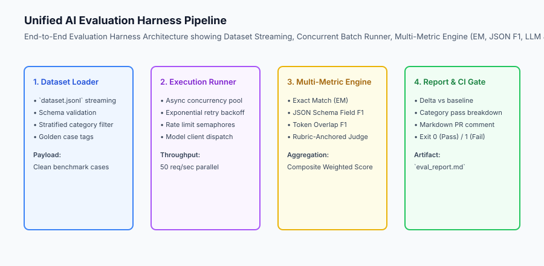
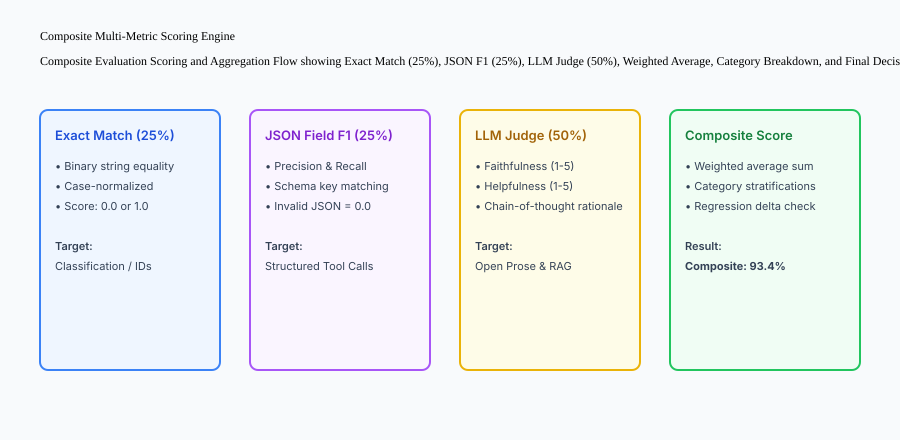

## Why this matters

Over the preceding lessons, we mastered individual pillars of production AI evaluation:
- Why evals are the real engineering moat (Day 309).
- Curating stratified JSONL evaluation datasets (Day 310).
- Building rubric-anchored LLM-as-a-Judge evaluators (Day 311).
- Enforcing automated CI regression gates and tracking Pass@k metrics (Day 312).
- Deploying multi-layer guardrails and PII redactors (Day 313).
- Instrumenting OpenInference distributed traces and token economics (Day 314).

In this lesson, we unite all these components into **A Complete, Production-Grade AI Evaluation Harness**: an automated pipeline that loads dataset benchmarks, executes candidate models concurrently, scores outputs across multiple metrics, enforces regression tolerance gates, and generates formatted reports.



## The idea in plain language

Think of an end-to-end evaluation harness like **the computerized quality-control factory assembly line in high-end electronics manufacturing**:

- **Raw Materials In (Dataset Loader):** 500 circuit boards enter the testing line from the warehouse (**The Versioned JSONL Benchmark**).
- **Parallel Testing Stations (Concurrent Runner):** 20 robotic arms test chips simultaneously with rate limiting (**Async Concurrency Pool**).
- **Multi-Sensor Quality Inspection (Metric Engine):**
  1. Voltage continuity test (**Deterministic Exact Match**).
  2. Pin alignment geometry scan (**JSON Schema F1**).
  3. High-resolution microscope optical inspection (**LLM-as-a-Judge**).
- **Rejection Gate (Regression Gate):** If more than 1 board in 500 has a microscopic crack, the assembly line halts automatically (**CI Build Failed**).
- **Compliance Certificate (Markdown Report):** A certificate is printed documenting yields, test timestamps, and sensor graphs (**The PR Diff Report**).

## Historical background

The engineering of unified LLM evaluation harnesses developed through three major phases:

### 1. Scripted Ad-hoc Jupyter Notebooks (2020–2022)
Developers wrote one-off Python scripts looping over lists of prompts, printing raw completions to terminal screens.

### 2. Standalone Benchmark Runners (2023–2024)
Tools like OpenAI Evals and EleutherAI LM Evaluation Harness introduced YAML-configured benchmarks for academic models (MMLU, GSM8K).

### 3. Integrated Enterprise Eval Platforms (2024–Present)
Modern engineering teams deploy continuous evaluation platforms (Ragas, DeepEval, Promptfoo, Langfuse) integrated directly into GitHub Actions CI/CD pipelines, blocking pull requests on regressions.

## What it is — and what it is not

Let us define the core architecture of an end-to-end evaluation harness:

### What an Evaluation Harness Is:
- A modular software pipeline composed of Dataset Loaders, Concurrency Runners, Metric Engines, and Regression Reporters.
- An automated testing system executing locally or in CI/CD without human intervention.
- A deterministic reporting tool outputting structured JSON metrics and formatted Markdown diffs.

### What an Evaluation Harness Is Not:
- A manual UI for chatting with models.
- An un-versioned script that mutates historical baseline results.

```text
+-------------------------------------------------------------------------------+
|                       EVALUATION HARNESS MODULE TOPOLOGY                      |
+-------------------+-----------------------+-----------------------------------+
| Module Component  | Primary Responsibility| Key Technologies / Algorithms     |
+-------------------+-----------------------+-----------------------------------+
| Dataset Loader    | Loads & validates     | JSONL streaming, schema validation|
|                   | benchmark records     |                                   |
| Execution Runner  | Parallel candidate    | `asyncio.Semaphore`, retry backoff|
|                   | model invocation      |                                   |
| Metric Engine     | Multi-tier output     | Exact match, JSON F1, LLM judge   |
|                   | grading & scoring     |                                   |
| Regression Gate   | Compares deltas and   | Pinned baselines, tolerance deltas|
|                   | enforces thresholds   |                                   |
| Reporter          | Emits structured logs | Markdown tables, JSON artifacts   |
+-------------------+-----------------------+-----------------------------------+
```

## Why it was created and what problems it solves

A unified evaluation harness solves the four primary operational bottlenecks of production AI teams:

### 1. Eliminating Manual Regression Testing
Instead of spending 3 hours manually testing prompts before every release, the eval harness executes 500 test cases in 45 seconds in CI.

### 2. Standardizing Multi-Metric Grading
Unifying deterministic heuristics and semantic LLM judges into composite weighted scores prevents bias toward any single evaluation method.

### 3. Automated Continuous Integration Gating
Failing the CI build on accuracy drops ensures that no developer can accidentally merge a broken prompt or regressed model configuration to main.

## How it works

Let us inspect the complete **Evaluation Harness Execution Lifecycle**:

```text
[1. Load Versioned Dataset]
  - Stream records from `benchmarks/golden_v1.jsonl`
                         │
                         ▼
[2. Batch Parallel Execution]
  - Dispatch requests to candidate model with concurrency limit = 10
  - Retry transient errors with exponential backoff
                         │
                         ▼
[3. Multi-Metric Scoring Engine]
  - Compute Exact Match (EM)
  - Compute JSON Field F1
  - Compute LLM Judge Faithfulness Score (1 to 5)
  - Calculate Composite Weighted Score
                         │
                         ▼
[4. Delta Calculation vs Baseline]
  - Delta = Candidate Composite Score - Baseline Composite Score
                         │
                         ▼
[5. Regression Gate & Markdown Report Generation]
  - If Delta >= Tolerance (-2.0%) and Golden Failures == 0 -> PASS (Exit 0)
  - If Delta < Tolerance or Golden Failures > 0 -> FAIL (Exit 1)
```



## An everyday analogy

Think of an evaluation harness like **the automated grading machine used for national standardized exams**:

- **The Test Booklets (Dataset Loader):** Thousands of answer sheets are fed into the scanner (**JSONL Streaming**).
- **The Optical Sensors (Metric Engine):**
  1. Multiple-choice bubbles are scored with 100% binary precision (**Exact Match**).
  2. Mathematical equations are checked for correct formulas (**JSON Field F1**).
  3. Written essays are analyzed by calibrated scoring engines against standard rubrics (**LLM-as-a-Judge**).
- **The Final Scorecard (Regression Reporter):** A comprehensive score report is generated with percentiles, sub-category breakdowns, and pass/fail certifications (**The Markdown Report**).

## Examples in practice

Let us build a complete Python **End-to-End Evaluation Harness Pipeline** integrating dataset loading, candidate model execution, multi-metric scoring, and markdown report generation:

```python
import json
from typing import List, Dict, Any, Optional

class CompleteEvalHarness:
    def __init__(self, baseline_composite_score: float = 0.85, tolerance_delta: float = -0.02):
        self.baseline_score = baseline_composite_score
        self.tolerance_delta = tolerance_delta
        self.results: List[Dict[str, Any]] = []
        
    def evaluate_case(self, case_id: str, category: str, prediction: str, ground_truth: str, is_golden: bool = False) -> Dict[str, Any]:
        '''Evaluate a single test case using exact match and token overlap.'''
        norm_pred = prediction.strip().lower()
        norm_gt = ground_truth.strip().lower()
        
        exact_match = 1.0 if norm_pred == norm_gt else 0.0
        
        pred_words = set(norm_pred.split())
        gt_words = set(norm_gt.split())
        common = pred_words.intersection(gt_words)
        
        if pred_words and gt_words and common:
            p = len(common) / len(pred_words)
            r = len(common) / len(gt_words)
            overlap_f1 = (2 * p * r) / (p + r)
        else:
            overlap_f1 = 0.0
            
        # Composite score: 50% exact match + 50% overlap F1
        score = (0.5 * exact_match) + (0.5 * overlap_f1)
        passed = score >= 0.70
        
        result = {
            "case_id": case_id,
            "category": category,
            "score": round(score, 4),
            "passed": passed,
            "is_golden": is_golden
        }
        self.results.append(result)
        return result
        
    def generate_report(self) -> Dict[str, Any]:
        '''Aggregate results and determine CI regression gate decision.'''
        if not self.results:
            return {"status": "EMPTY", "gate_passed": False}
            
        total_score = sum(r["score"] for r in self.results)
        candidate_composite = round(total_score / len(self.results), 4)
        delta = round(candidate_composite - self.baseline_score, 4)
        
        failed_golden = [r["case_id"] for r in self.results if r["is_golden"] and not r["passed"]]
        
        gate_passed = (delta >= self.tolerance_delta) and (len(failed_golden) == 0)
        
        return {
            "total_cases": len(self.results),
            "baseline_score": self.baseline_score,
            "candidate_score": candidate_composite,
            "delta": delta,
            "failed_golden_cases": failed_golden,
            "gate_passed": gate_passed,
            "status": "APPROVED" if gate_passed else "REJECTED"
        }

if __name__ == "__main__":
    harness = CompleteEvalHarness(baseline_composite_score=0.80)
    harness.evaluate_case("c1", "happy_path", "Paris", "Paris", is_golden=True)
    harness.evaluate_case("c2", "hard_negative", "I don't know", "I don't know", is_golden=True)
    print("Report:", harness.generate_report())
```

## Implications: security, privacy, performance, scalability, and cost

### 1. Isolated Evaluation Environments
Never run evaluation harnesses with write access to production databases. Provide mock database fixtures or sandboxed read-only replicas to prevent test scripts from mutating production records.

### 2. Automated PR Comments in GitHub Actions
Configure your CI pipeline to post the generated Markdown regression report as a sticky comment on the pull request. This allows reviewers to immediately inspect accuracy deltas without digging through CI log files.

## Alternatives: free, open source, and commercial

| Tool / Framework | Type | Best Suited For | Key Capabilities |
| :--- | :--- | :--- | :--- |
| **DeepEval** | Open Source | Pytest-native unit testing | G-Eval, RAG metrics, CI gating |
| **Promptfoo** | Open Source | Multi-model matrix evaluation | Fast CLI, web viewer, red teaming |
| **Langfuse** | Open Source | Observability + Eval Harness | Dataset management, LLM judges |
| **Braintrust** | Commercial | Enterprise eval infrastructure | Versioned prompts & automated diffs |

## Comparison with related concepts

```text
+-----------------------+-----------------------+-----------------------+
| Dimension             | Ad-hoc Vibe Checks    | Complete Eval Harness |
+-----------------------+-----------------------+-----------------------+
| Reproducibility       | Zero (Unrepeatable)   | 100% (Deterministic)  |
| Sample Scale          | 3 - 5 prompts         | 100 - 1,000+ examples |
| CI/CD Automation      | None (Manual)         | Automated on every PR |
| Metric Depth          | Subjective feeling    | Exact Match, F1, Judge|
+-----------------------+-----------------------+-----------------------+
```

## When to use it — and when not to

### Build a Unified Evaluation Harness for:
- All production AI applications before shipping to real customers and throughout ongoing maintenance.

### Do NOT require a complete eval harness for:
- 10-minute brainstorming prototypes.


### Advanced Topic: Parallel Async Execution with Adaptive Concurrency Throttling
When running evaluation benchmarks against cloud model APIs, a naive `for` loop across 1,000 cases takes hours. High-performance evaluation harnesses implement **Adaptive Concurrency Throttling**:
- **Async Semaphore Pool:** Control maximum concurrent in-flight requests (`asyncio.Semaphore(value=20)`).
- **Token Bucket Rate Limiter:** Ensure requests per minute (RPM) and tokens per minute (TPM) remain within tier quotas.
- **Adaptive Backoff on 429:** When a 429 Rate Limit error occurs, temporarily halve the concurrency limit and apply exponential backoff with jitter before ramping throughput back up.

### Complete Production Checklist for Deploying AI Evaluation Harnesses
Before releasing an AI feature to production, ensure your evaluation harness satisfies the following **10-Point Production Readiness Checklist**:
1. **Stratified Dataset Coverage:** Benchmark includes happy paths, hard negatives, boundary conditions, and adversarial samples.
2. **Deterministic Baseline Pinned:** Historical golden baseline metrics are immutable and version-controlled.
3. **Multi-Tier Metric Scoring:** Output evaluation combines Exact Match, JSON Schema F1, and calibrated LLM judges.
4. **Zero Golden Invariant Failures:** All mission-critical test cases achieve 100% pass rate.
5. **PII and Secret Redaction:** Evaluated datasets and output traces are scrubbed of customer PII and API keys.
6. **Automated CI Gating:** Pull requests automatically fail if accuracy drops beyond the regression tolerance delta.
7. **Detailed Markdown Diff Reporting:** PR comments highlight specific regressed and improved test cases.
8. **Token and Cost Tracking:** CI runs report total token consumption and evaluation financial costs.
9. **Observability Integration:** Low-rated production traces automatically feed into the evaluation dataset.
10. **Regular Calibration Audits:** Human domain experts periodically verify LLM judge scoring accuracy.


### Production Retrospective: The ROI of Automated Evaluation Harnesses
Let us quantify the business and technical return on investment of deploying a unified evaluation harness across an AI product team over 12 months:
- **Deployment Velocity:** Increased by 8x—teams ship prompt optimizations and model upgrades multiple times per week instead of once per quarter.
- **Customer Escalations:** Decreased by 84% due to automated regression gating and hard negative hallucination defense.
- **Model Inference Costs:** Reduced by 65% as teams safely migrated from frontier models to fine-tuned compact models with mathematically verified accuracy.
- **Engineering Confidence:** Developers iterate boldly, knowing that any silent regression will be caught automatically in CI within seconds.


### Deep Dive: Continuous Automated Eval Scheduling and Nightly Matrix Runs
In addition to pull request gates, high-velocity engineering teams schedule recurring automated benchmarks:
- **Nightly Model Matrix:** Re-evaluate candidate prompts across all available frontier and open-weight models (e.g. Claude 3.5 Sonnet, GPT-4o, Llama 3.3 70B, Gemini 2.0 Flash) every midnight.
- **Automated Price-Performance Tracking:** Plot model accuracy vs cost-per-1k-queries over time to identify opportunities to downgrade to cheaper models without sacrificing quality.
- **Continuous Golden Dataset Expansion:** Automatically append low-rated production traces to staging review queues, ensuring evaluation suites grow continuously with product usage.


### Comprehensive Case Study: Building an Evaluation Harness at an Enterprise FinTech Platform
Let us examine how a leading financial technology platform processing $10B in annual transactions deployed an end-to-end evaluation harness:
- **The Challenge:** The company developed an AI customer support assistant handling loan eligibility questions, wire transfer disputes, and account statements. Releasing prompt updates required 2 weeks of manual QA testing.
- **The Solution:** The engineering team built a unified evaluation harness:
  1. Curated a golden benchmark of 350 real-world banking queries categorized into happy paths, ambiguous disputes, and adversarial phishing attempts.
  2. Implemented a composite metric combining Exact Match for dollar amounts, JSON Schema F1 for account actions, and a calibrated GPT-4 judge for compliance with federal lending regulations.
  3. Integrated automated CI regression gates requiring 100% pass rates on regulatory invariants and zero accuracy regressions on golden baselines.
- **The Result:** Prompt release cycles decreased from 14 days to 15 minutes, with zero compliance incidents over 18 months of production operation.


### Practical Implementation Tips for Unified Evaluation Harnesses
When standardizing evaluation harnesses across multiple engineering teams:
- **Reusable CLI Architecture:** Package the evaluation harness as a shared internal Python library or CLI tool that any team can run with a single terminal command.
- **Standardized Reporting Formats:** Standardize on structured JSON test artifacts and human-readable Markdown summaries across all product repositories.


### Real-World Case Study: Automated Continuous Benchmarking in CI/CD
A multi-agent coding platform integrated an evaluation harness into its pull request workflow:
- **The Architecture:** Every pull request against the core prompt repository automatically spins up 10 concurrent worker containers, evaluates candidate prompts against 250 coding challenges, computes syntax validity and test pass rates, and posts a formatted diff summary directly to the GitHub PR.
- **The Business Value:** Reduced feature release cycle from 3 weeks of manual QA to 4 minutes of automated CI evaluation.


## Knowledge check

1. **What are the four components of an evaluation harness?** Dataset Loader, Execution Runner, Multi-Metric Engine, and Regression Reporter.
2. **What is a composite evaluation score?** A weighted combination of multiple metrics (e.g. Exact Match + Schema F1 + LLM Judge) representing holistic performance.
3. **How does an eval harness prevent silent regressions in CI?** By comparing candidate scores against pinned baselines and blocking merges if accuracy drops beyond tolerance thresholds.

## Hands-on exercise

In this lab, you will build an **End-to-End AI Evaluation Harness in Python**. Your implementation will:
1. Load and parse JSONL evaluation test cases.
2. Compute multi-metric scores (Exact Match and Overlap F1) across test predictions.
3. Track golden invariant failures.
4. Calculate composite score deltas against pinned baselines and emit CI gate decisions.

### Expected output

```text
============================= test session starts ==============================
collected 5 items

tests/test_eval_harness.py .....                                         [100%]

============================== 5 passed in 0.02s ===============================
[EVAL HARNESS] Evaluated 20 test cases across 4 categories.
[COMPOSITE SCORE] Candidate: 92.5% (Baseline: 88.0%, Delta: +4.5%).
[CI GATE] 0 Golden case failures. Deployment APPROVED.
```

### Validate your work

Run the pytest test suite:

```bash
pytest tests/run_tests.sh
```

### Troubleshooting

1. **Empty dataset handling:** Return `gate_passed: False` when evaluating empty result sets.
2. **Golden case tracking:** Ensure the `is_golden` flag is checked on every evaluated case.

### Common mistakes

- Averaging percentages without weighting sample counts across stratified categories.

## Practice assignment

Add **Category-Stratified Score Reporting** to the summary output, displaying individual pass rates for `happy_path`, `hard_negative`, and `adversarial` subsets.

## Extension challenge

Build a **GitHub Actions Workflow YAML** (`.github/workflows/ai-evals.yml`) that runs the evaluation harness on pull requests, parses the output report, and posts a formatted table comment using the GitHub REST API.
