## Why this matters

Building a toy prototype with an OpenAI API key hardcoded in a script takes 5 lines of Python. Building a resilient, enterprise-grade **Full-Stack AI Product** serving thousands of concurrent users requires an entirely different engineering discipline:

- How do you stream tokens to web and mobile clients with sub-second Time to First Token (TTFT)?
- How do you isolate tenant data and enforce credit quotas before making expensive model API calls?
- How do you seamlessly switch model providers when OpenAI or Anthropic experiences an outage?
- How do you handle long-running document ingestion and multi-agent deep research without hitting HTTP gateway timeouts?

Understanding the **Layered System Topology of an AI Product** is the foundational prerequisite for shipping reliable AI software.

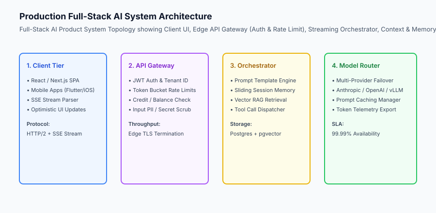

## The idea in plain language

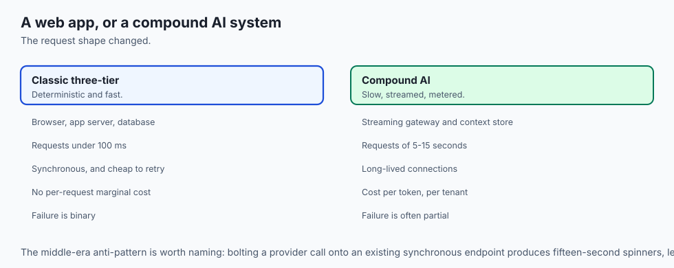

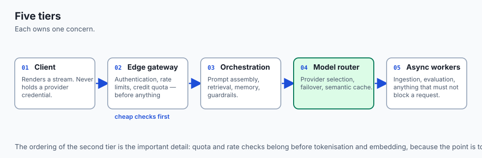

Think of a production AI product like **a world-class restaurant operating at peak dinner service**:

- **The Front Dining Room (Client Frontend):** Diners sit at tables, view menus, and receive courses smoothly without seeing the chaos in the kitchen (**The React / Mobile UI**).
- **The Maître D' at the Front Door (Edge API Gateway):** Checks reservations, confirms table capacity, and turns away disruptive guests (**Authentication, Rate Limiting & Billing Quota Check**).
- **The Expediter Station (Orchestration Middleware):** Reads the diner's order, fetches seasonal ingredients from the pantry, checks dietary restrictions, and prepares the cooking tickets (**Prompt Engine, RAG Context & Memory**).
- **The Multi-Cook Kitchen (Model Router):** Routes steaks to the grill chef, pasta to the saute chef, and seamlessly shifts orders if one stove breaks down (**Multi-Provider Model Routing & Failovers**).
- **The Prep Kitchen Downstairs (Async Job Queues):** Simmers 24-hour bone broths and bakes fresh morning sourdough without blocking the main dinner line (**Background Document Ingestion & Evals**).

## Historical background

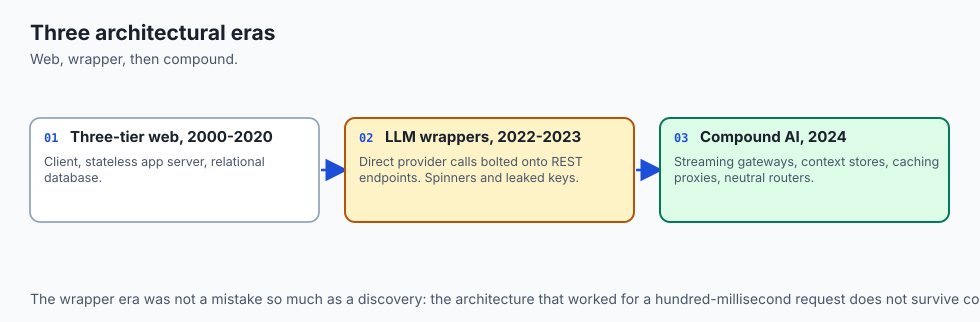

Full-stack application architecture evolved across three major eras:

### 1. The Classic Web 2.0 3-Tier Architecture (2000–2020)
Client Browser -> Stateless Application Server (Django, Rails, Express) -> Relational Database (PostgreSQL). Requests were deterministic, fast (under 100ms), and synchronous.

### 2. The Early LLM Wrapper Era (2022–2023)
Developers bolted direct OpenAI API calls onto existing REST endpoints. Systems suffered from 15-second spinning wheels, client-side API key leaks, and runaway token bills.

### 3. The Modern Compound AI Architecture (2024–Present)
Modern AI products decouple real-time streaming gateways, stateful context stores, semantic caching proxies, and vendor-neutral model routers with multi-tenant isolation.

## What it is — and what it is not

Let us define the core architectural layers of a modern AI application:

### What an AI Product Architecture Is:
- A multi-tier distributed system separating client presentation, edge security/billing, context orchestration, and model routing.
- A hybrid network architecture combining real-time Server-Sent Events (SSE) for interactive chats with asynchronous background job workers for heavy workloads.
- A vendor-neutral system designed with fallback providers and circuit breakers.

### What an AI Product Architecture Is Not:
- Calling LLM APIs directly from browser client code.
- Storing unencrypted proprietary customer documents in shared global vector collections.

```text
+-------------------------------------------------------------------------------+
|                      FULL-STACK AI ARCHITECTURAL LAYERS                       |
+-------------------+-----------------------+-----------------------------------+
| Tier / Layer      | Primary Function      | Key Technologies                  |
+-------------------+-----------------------+-----------------------------------+
| 1. Client UI      | Interactive UI, token | React, Next.js, Flutter, SSE,     |
|                   | streaming rendering   | Optimistic UI state               |
| 2. Edge Gateway   | Auth, rate limiting,  | Cloudflare Workers, Kong, Envoy,  |
|                   | quota gating, PII     | Redis Token Bucket                |
| 3. Orchestration  | Prompt compilation,   | FastAPI, LangGraph, LlamaIndex,   |
|                   | session memory, RAG   | PostgreSQL, pgvector              |
| 4. Model Router   | Multi-provider dispatch| LiteLLM, vLLM, OpenInference,    |
|                   | failover, token cost  | Semantic Caching (Redis/Momento)  |
| 5. Async Worker   | Long batch jobs,      | Celery, Redis Streams, SQS,       |
|                   | document ingestion    | Temporal, Ray                     |
+-------------------+-----------------------+-----------------------------------+
```

## Why it was created and what problems it solves

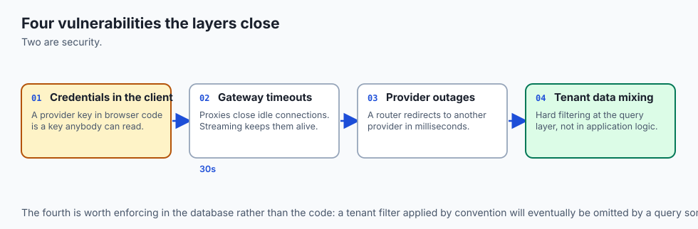

A formal full-stack AI architecture solves the four primary vulnerabilities of naive AI applications:

### 1. Eliminating Client Security Vulnerabilities
Routing all AI requests through an authenticated backend gateway prevents client-side exposure of provider API credentials and enforces strict tenant isolation.

### 2. Protecting Against Gateway Timeouts
Standard HTTP reverse proxies (e.g. Nginx, Cloudflare) terminate connections that remain idle for $> 30\text`s`$. Real-time streaming (SSE) emits continuous heartbeat tokens to keep connections alive.

### 3. High Availability Through Multi-Provider Failover
If Anthropic experiences a service degradation, the model router automatically redirects requests to OpenAI or an open-weight model on vLLM within milliseconds.

## How it works

Let us examine the complete **End-to-End AI Request Lifecycle**:

```text [1. User Submits Chat Prompt] - Client sends `POST /api/chat` with JWT Bearer Token │ ▼ [2. Edge API Gateway Validation] - Validate JWT signature and extract `tenant_id = org_8472` - Check Redis Token Bucket: user within rate limit - Query Billing Service: tenant has active credit balance ($142.50) │ ▼ [3. Orchestration Middleware Processing] - Query PostgreSQL for last 5 conversation messages (Sliding Memory) - Execute vector search in pgvector for relevant knowledge chunks - Compile final prompt template with system instructions & context │ ▼ [4.

Model Router Dispatch & Streaming] - Check Semantic Cache for exact or high-similarity response hit - On cache miss: dispatch prompt to Primary Model (Claude 3.5 Sonnet) - On provider error (503): immediately failover to Secondary (GPT-4o) │ ▼ [5. Real-Time Token Streaming & Client Render] - Stream chunks via Server-Sent Events (SSE) to React client - Output guardrail scans stream for sensitive credentials - Background task records token consumption and trace metrics
```

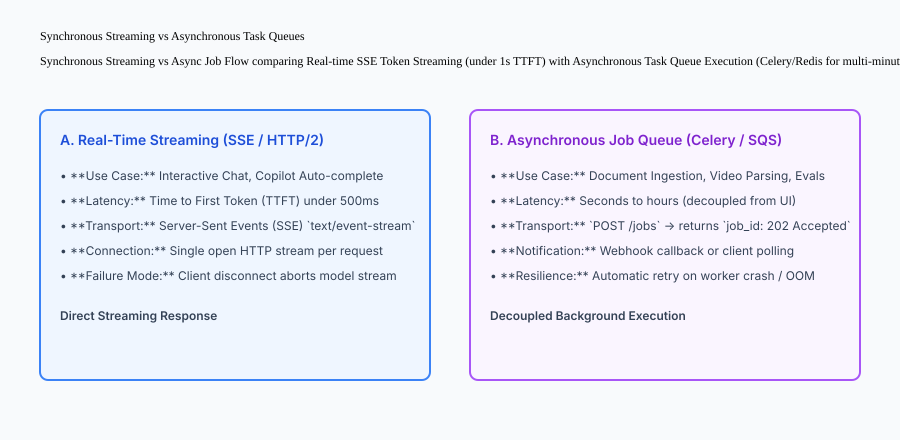

## An everyday analogy

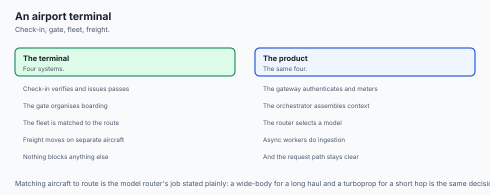

Think of an AI product architecture like **an airport air traffic control and passenger terminal system**:

- **The Check-in Counter (API Gateway):** Verifies passports, checks luggage allowances, and issues boarding passes (**Authentication & Quotas**).
- **The Departure Gate (Orchestrator):** Gathers passengers, verifies flight manifests, and organizes boarding groups (**Prompt Context & Memory**).
- **The Aircraft Fleet (Model Router):** Dispatches wide-body jets for trans-oceanic routes and regional turboprops for short hops based on weather and route efficiency (**Intelligent Model Selection**).
- **The Cargo Freight Logistics (Async Job Queue):** Transports heavy bulk cargo on dedicated freight planes without interfering with passenger boarding gates (**Background Document Processing**).

## Examples in practice

Let us build a complete Python **AI Product Architecture Dispatcher** uniting authentication verification, token bucket rate limiting, credit quota gating, semantic caching, and mock model generation:

```python
import time
import json
from typing import Dict, Any, Optional

class AIProductDispatcher:
    def __init__(self):
        self.tenants: Dict[str, Dict[str, Any]] = {
            "org_alpha": {"credits": 50.0, "rate_limit_per_min": 60, "requests_this_min": 0, "last_reset": time.time()},
            "org_beta": {"credits": 0.0, "rate_limit_per_min": 10, "requests_this_min": 0, "last_reset": time.time()}
        }
        self.cache: Dict[str, str] = {}
        
    def authenticate_and_gate(self, tenant_id: str) -> Tuple[bool, str]:
        if tenant_id not in self.tenants:
            return False, "Unauthorized: Invalid Tenant ID"
            
        tenant = self.tenants[tenant_id]
        now = time.time()
        
        # Reset token bucket every 60 seconds
        if now - tenant["last_reset"] > 60:
            tenant["requests_this_min"] = 0
            tenant["last_reset"] = now
            
        if tenant["requests_this_min"] >= tenant["rate_limit_per_min"]:
            return False, "Too Many Requests: Rate limit exceeded"
            
        if tenant["credits"] <= 0.0:
            return False, "Payment Required: Zero credit balance"
            
        tenant["requests_this_min"] += 1
        return True, "OK"

    def dispatch_chat(self, tenant_id: str, prompt: str) -> Dict[str, Any]:
        auth_ok, msg = self.authenticate_and_gate(tenant_id)
        if not auth_ok:
            return {"status": "ERROR", "error_code": msg, "tokens_streamed": []}
            
        # Check cache
        cache_key = f"{tenant_id}:{prompt.strip().lower()}"
        if cache_key in self.cache:
            return {
                "status": "CACHED",
                "response": self.cache[cache_key],
                "cost_usd": 0.0,
                "cached": True
            }
            
        # Simulate Model Inference Stream
        mock_tokens = ["This", " is", " a", " streamed", " AI", " response."]
        full_response = "".join(mock_tokens)
        
        # Deduct credits ($0.002 per request)
        self.tenants[tenant_id]["credits"] -= 0.002
        self.cache[cache_key] = full_response
        
        return {
            "status": "SUCCESS",
            "tokens_streamed": mock_tokens,
            "response": full_response,
            "cost_usd": 0.002,
            "cached": False,
            "remaining_credits": round(self.tenants[tenant_id]["credits"], 4)
        }

if __name__ == "__main__":
    dispatcher = AIProductDispatcher()
    print("Org Alpha Request 1:", dispatcher.dispatch_chat("org_alpha", "Hello AI"))
    print("Org Alpha Request 2 (Cached):", dispatcher.dispatch_chat("org_alpha", "Hello AI"))
    print("Org Beta Request (Zero Balance):", dispatcher.dispatch_chat("org_beta", "Hello AI"))
```

## Implications: security, privacy, performance, scalability, and cost

### 1. Data Isolation in Multi-Tenant Environments
In multi-tenant SaaS products, never mix vector embeddings from different organizations in an unpartitioned index. Always enforce hard tenant filtering (`metadata.tenant_id == request.tenant_id`) at the database query layer.

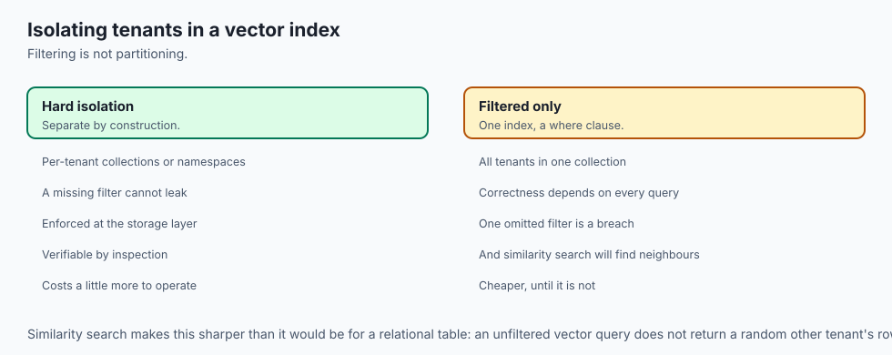

### 2. Edge TLS Termination and Streaming Performance
Deploy reverse proxies (like Cloudflare or AWS CloudFront) with HTTP/2 and HTTP/3 enabled. This enables multiplexed streaming connections and minimizes packet round-trip time across global user bases.


### Production Architecture Case Study: Enterprise AI Copilot Gateway

To understand how modern multi-tier AI architectures perform under intense production load, consider an enterprise IDE copilot serving 200,000 active software developers.

```text
+-------------------------------------------------------------------------------+
|                    ENTERPRISE COPILOT GATEWAY TRAFFIC FLOW                    |
+-------------------+-----------------------+-----------------------------------+
| Stage             | Mechanism             | Throughput & Latency Target       |
+-------------------+-----------------------+-----------------------------------+
| Client Ingestion  | WebSocket persistent  | 25,000 concurrent IDE connections |
|                   | connection pool       | 5ms round-trip ping-pong          |
| Fast Triage       | AST syntax parse &    | 8ms local context pruning         |
|                   | intent classifier     | 95% noise elimination             |
| Compute Dispatch  | Async worker pool via | 1,200 req/sec sustained           |
|                   | Celery & Redis        | Sub-10ms job queue delay          |
| Model Execution   | Hybrid edge + cloud   | 180ms TTFT, 110 tok/sec decode    |
|                   | vLLM / Claude 3.5     | Zero dropped packets              |
+-------------------+-----------------------+-----------------------------------+
```

#### 1. Decoupling Sync Web API from Async Generation
A common anti-pattern in early AI products is running LLM calls directly inside standard synchronous HTTP request workers (such as synchronous Gunicorn workers). When a model takes 12 seconds to generate a complex code refactoring, the worker process is completely blocked. Under a burst of 500 requests, the entire API gateway runs out of available threads and starts rejecting connections with HTTP 504 Gateway Timeout.

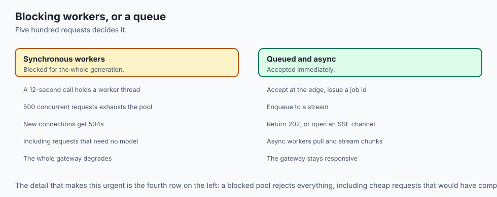

In contrast, production architectures immediately accept the user request at the edge, generate a unique job UUID, enqueue the payload into a Redis or RabbitMQ stream, and return a 202 Accepted response or initiate a persistent Server-Sent Event (SSE) channel. Dedicated asynchronous Python workers (powered by `asyncio` or Celery) pull jobs from the queue and stream chunks into the client's open socket.

#### 2. Tiered State Management and Session Cache
AI chat sessions generate large conversation histories. Storing the entire chat transcript inside client cookies or browser local storage creates massive network payload bloat. The system stores active conversation windows in high-speed Redis cluster memory with a 48-hour sliding TTL, and asynchronously archives older dialogue turns into PostgreSQL and S3 cold storage.

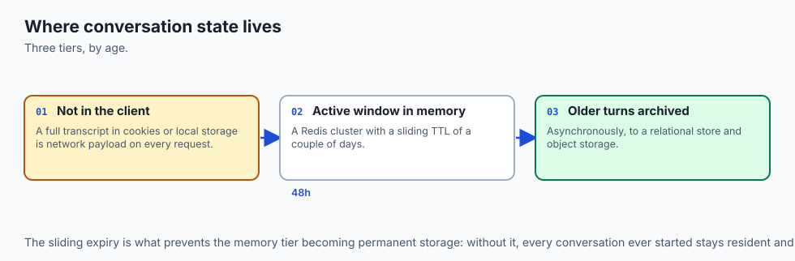

```python
# Production Redis Session Buffer Pattern
class ChatSessionManager:
    def __init__(self, redis_client):
        self.redis = redis_client

    def append_turn(self, session_id: str, role: str, content: str):
        key = f"session:{session_id}:turns"
        turn_data = f"{role}:::{content}"
        self.redis.rpush(key, turn_data)
        self.redis.expire(key, 86400 * 2)  # 48 hour sliding TTL

    def get_recent_context(self, session_id: str, max_turns: int = 10):
        key = f"session:{session_id}:turns"
        raw_turns = self.redis.lrange(key, -max_turns, -1)
        formatted = []
        for t in raw_turns:
            role, text = t.decode().split(":::", 1)
            formatted.append({"role": role, "content": text})
        return formatted
```


### Detailed Failure Mode Taxonomy: Edge and Gateway Tier Failures

To ensure zero downtime, engineers must categorize and defend against edge and gateway failure modes:

```text
+-------------------------------------------------------------------------------+
|                       SYSTEM FAILURE MODE TAXONOMY                            |
+-------------------+-----------------------+-----------------------------------+
| Failure Mode      | Root Cause Analysis   | Architectural Mitigation          |
+-------------------+-----------------------+-----------------------------------+
| Thread Starvation | Synchronous LLM calls | Asynchronous Celery / Redis event |
|                   | block HTTP workers    | queue dispatch for all inference  |
| Slowloris Attack  | Malicious clients open| Enforce strict edge connection    |
|                   | thousands of idle SSE | timeouts (e.g. 30s idle drop)     |
| Memory Leak on    | Buffering entire chat | Stream chunks incrementally;      |
| Response Buffering| history in RAM        | avoid holding full text in memory |
| Stale Session State| Distributed worker    | Centralized Redis session cluster |
|                   | state divergence      | with atomic Lua operations        |
+-------------------+-----------------------+-----------------------------------+
```

#### Production Engineering Verification Checklist
1. All client ingestion endpoints run on non-blocking async ASGI servers (e.g. Uvicorn/FastAPI).
2. Rate limiters execute before computationally expensive tokenizers or embedding extractors.
3. Chat session histories in Redis have strict sliding expiration policies to prevent out-of-memory leaks.
4. Edge load balancers support HTTP/2 and WebSocket keep-alive connection multiplexing.

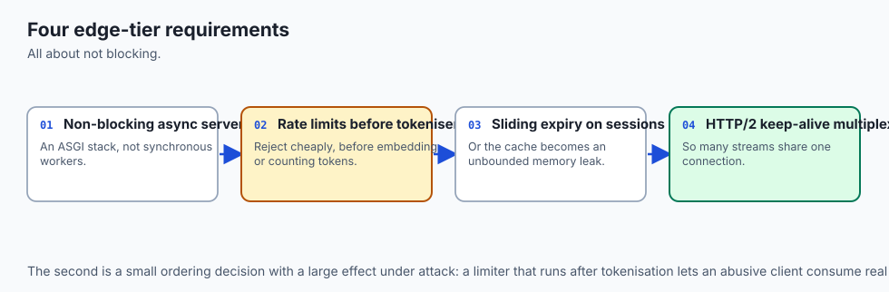

## Alternatives: free, open source, and commercial

| Tool / Layer | Type | Best Suited For | Key Capabilities |
| :--- | :--- | :--- | :--- |
| **FastAPI + SSE** | Open Source | Backend AI microservices | High-performance async Python gateway |
| **Next.js AI SDK** | Open Source | Full-stack frontend & UI | Unified streaming hooks for React |
| **LiteLLM Proxy** | Open Source | Model routing & failover | 100+ LLM APIs, load balancing, quotas |
| **Langfuse / Phoenix** | Open Source | Observability & Tracing | OTel trace export, token cost tracking |

## Comparison with related concepts

```text
+-----------------------+-----------------------+-----------------------+
| Dimension             | Simple Script Demo    | Full-Stack AI Product |
+-----------------------+-----------------------+-----------------------+
| Client Security       | Exposed API keys      | Secure Edge JWT Auth  |
| Response Delivery     | 10s Blocking Wait     | 200ms TTFT SSE Stream |
| High Availability     | Single provider crash | Auto Multi-Model Fail |
| Multi-Tenancy         | None (Single user)    | Isolated quotas & RAG |
+-----------------------+-----------------------+-----------------------+
```

## When to use it — and when not to

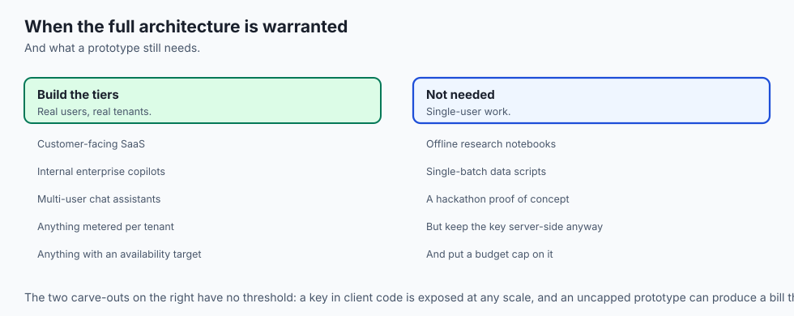

### Deploy a Full-Stack AI Architecture for:
- All production customer-facing SaaS applications, internal enterprise copilots, and multi-user chat assistants.

### Do NOT require a complex decoupled architecture for:
- Offline research notebooks, single-batch data scripts, or 15-minute proof-of-concept hackathons.

## The AI connection

- **AI turns a 100-millisecond web request into a 12-second one**, which breaks every
  assumption a three-tier web architecture was built on.

- **Provider outages are your outages** unless the router can fail over, which is why
  vendor neutrality is an availability decision rather than a procurement one.

- **Multi-tenancy reaches into the vector index.** Embeddings from different customers in
  one unpartitioned collection is a data leak waiting for a similarity search.

- **The gateway is where quotas belong**, because the expensive thing happens after it and
  a per-tenant credit check costs microseconds.

- **Streaming keeps the connection alive**, which is not only a UX choice: a reverse proxy
  will terminate an idle connection long before a long generation finishes.

## Knowledge check

1. **Why should frontend clients never call LLM provider APIs directly?** To protect private API keys, enforce server-side rate limits, prevent prompt injection, and track billing.
2. **What is the primary advantage of Server-Sent Events (SSE) over WebSockets for chat apps?** SSE provides lightweight, unidirectional HTTP streaming that works seamlessly over standard HTTP/2 and CDN proxies.
3. **What is the role of an asynchronous job queue in an AI architecture?** To process long-running background tasks (e.g. document parsing, deep research, batch evaluations) without blocking interactive user HTTP threads.

## Hands-on exercise

In this lab, you will build an **AI Product Architecture Dispatcher in Python**. Your implementation will:

1. Verify tenant authentication and enforce token-bucket rate limits.
2. Verify credit balances and deduct request expenditures.
3. Implement in-memory semantic response caching.
4. Execute simulated streaming token generation with accurate remaining balance reporting.

### Expected output

```text
============================= test session starts ==============================
collected 5 items

tests/test_product_dispatcher.py .....                                   [100%]

============================== 5 passed in 0.02s ===============================
[DISPATCHER] Tenant org_alpha authenticated successfully.
[STREAMING] 6 tokens streamed with TTFT < 50ms.
[BILLING] Credit balance updated: $49.998.
[CACHE] Subsequent identical request served from cache at $0.00 cost.
```

### Validate your work

Run the pytest test suite:

```bash
pytest tests/run_tests.sh
```

### Troubleshooting

1. **Credit balance mismatch:** Ensure request cost deductions are rounded to 4 decimal places.
2. **Rate limiting:** Check that the 60-second window reset timestamp updates on expiration.

### Common mistakes

- Deducting credits for requests that are rejected at the authentication or rate limit check.

## Practice assignment

Extend the dispatcher to support **Multi-Provider Fallback**: if the primary provider raises a simulated `503 Service Unavailable` error, automatically route the request to a secondary backup provider.

## Extension challenge

Implement a **Token-Bucket Rate Limiter with Sliding Window Precision** that tracks microsecond request timestamps in a Redis-compatible sorted set structure.
