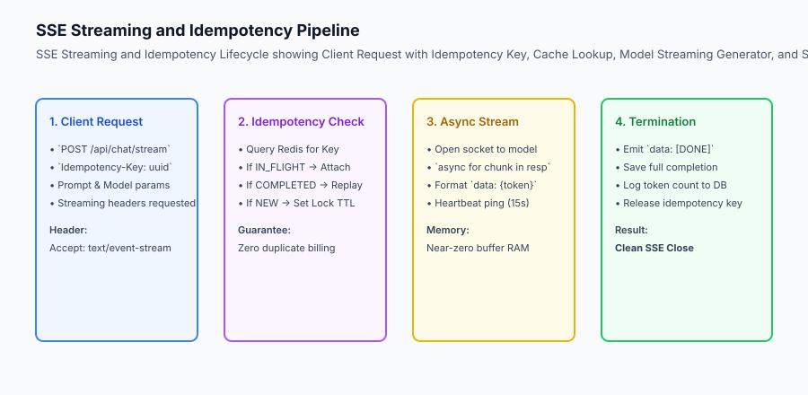
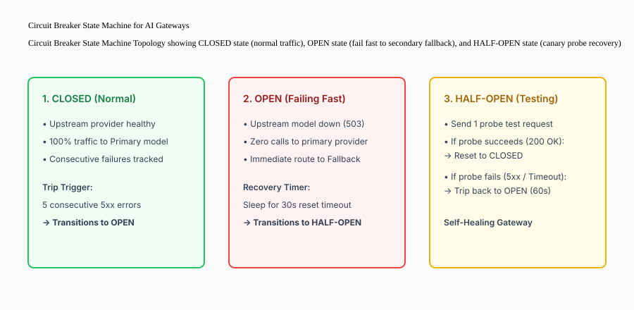

## Why this matters

Writing a backend that returns a standard JSON object takes a basic FastAPI endpoint. Building a backend that handles real-time generative AI workloads requires mastering specialized distributed backend patterns:
- How do you deliver streaming tokens to thousands of concurrent users without memory blowups?
- How do you prevent double-billing users when a flaky mobile connection retries a request halfway through generation?
- How do you protect your server from locking up when an upstream provider (such as Anthropic or OpenAI) experiences a regional 503 outage?

In this lesson, we master the three core backend resilience patterns for generative AI applications: **Server-Sent Events (SSE) Streaming Generators**, **Idempotent Request Deduplication**, and **Automated Circuit Breakers**.



## The idea in plain language

Think of these backend patterns like **the safety and delivery systems in a modern electrical power grid**:

- **Server-Sent Events (SSE):** Instead of waiting 10 minutes to deliver a giant battery (**A Blocking JSON Response**), power is delivered continuously through live electrical wires as it is generated (**Real-time Token Streaming**).
- **Idempotency Keys:** When a smart meter bills a home, it assigns a unique transaction ID. If the radio signal glitches and sends the meter reading twice, the power company's billing system recognizes the duplicate key and only charges the homeowner once (**Zero Double-Billing**).
- **Circuit Breakers:** If a lightning strike causes a power surge on Transmission Line A, an automatic circuit breaker flips to OPEN, instantly routing electricity through Transmission Line B without blacking out the city (**Automatic Failover & Fault Isolation**).

## Historical background

Backend communication patterns evolved over four major stages:

### 1. HTTP 1.1 Short Polling (2000–2008)
Clients repeatedly queried `GET /status` every 2 seconds to check if a backend task finished, wasting massive bandwidth.

### 2. Full-Duplex WebSockets (2011–2020)
WebSockets provided bidirectional communication for games and chat apps, but introduced heavy stateful connection management and proxy firewall issues.

### 3. Server-Sent Events (SSE) Standard (2015–Present)
The W3C standardized SSE as a lightweight, unidirectional text stream over standard HTTP, making it the universal standard for generative AI token streaming.

### 4. Resilient AI Gateway Middleware (2023–Present)
Modern frameworks integrate circuit breakers, token bucket rate limiters, and idempotency layers directly into ASGI / WSGI application servers.

## What it is — and what it is not

Let us define the core backend patterns for production LLM systems:

### What These Patterns Are:
- Asynchronous Python generators yielding structured `data: ...\n\n` SSE frames.
- Distributed Redis locks with TTLs guaranteeing at-most-once execution for identical idempotency keys.
- Three-state finite state machines (CLOSED, OPEN, HALF-OPEN) isolating upstream service degradation.

### What These Patterns Are Not:
- Blocking synchronous `time.sleep()` loops on worker threads.
- Buffering entire multi-thousand-token LLM completions in Python memory before sending to clients.

```text
+-------------------------------------------------------------------------------+
|                      BACKEND PATTERNS COMPARISON MATRIX                       |
+-------------------+-----------------------+-----------------------------------+
| Pattern           | Problem Solved        | Key Implementation Detail         |
+-------------------+-----------------------+-----------------------------------+
| SSE Streaming     | High user latency,    | `StreamingResponse(gen(),         |
|                   | connection timeouts   | media_type="text/event-stream")`  |
| Idempotency Key   | Duplicate billing,    | Redis `SET key NX EX 300`         |
|                   | retry storms          | + cached completion replay        |
| Circuit Breaker   | Upstream outages,     | 3-state FSM with failure counts   |
|                   | cascading crashes     | and reset timeout probes          |
| Client Abort Gate | Wasted GPU costs on   | `request.is_disconnected()`       |
|                   | user cancellation     | upstream task cancellation        |
+-------------------+-----------------------+-----------------------------------+
```

## Why it was created and what problems it solves

These backend patterns resolve the three most severe operational hazards in AI application engineering:

### 1. Preventing Double-Billing on Mobile Network Retries
When mobile clients lose cellular connection mid-generation, their network stack automatically retries the POST request. An idempotency key ensures the server recognizes the retry and replays the cached completion without invoking the model twice.

### 2. Zero-Buffering Memory Scalability
Streaming responses token-by-token allows a single server with 4GB RAM to handle 5,000 concurrent streaming connections without out-of-memory (OOM) crashes.

### 3. Fault-Tolerant Upstream Outage Isolation
When a model API begins returning 500 errors, the circuit breaker opens within 5 failures, immediately routing all subsequent user queries to a healthy backup model without waiting for 30-second timeouts.

## How it works

Let us inspect the complete **Circuit Breaker State Transition Topology**:

```text
       ┌───────────────────────────────┐
       │      1. CLOSED (Normal)       │ ◄──────────────────────┐
       │   - 100% traffic to Primary   │                        │
       │   - Failure Count: 0 / 5      │                        │
       └───────────────┬───────────────┘                        │
                       │ (5 consecutive 5xx errors)             │
                       ▼                                        │ (Probe succeeds)
       ┌───────────────────────────────┐                        │
       │       2. OPEN (Fail-Fast)     │                        │
       │   - 0% traffic to Primary     │                        │
       │   - 100% traffic to Fallback  │                        │
       │   - Sleep for 30s reset timer │                        │
       └───────────────┬───────────────┘                        │
                       │ (30s timer expires)                    │
                       ▼                                        │
       ┌───────────────────────────────┐                        │
       │     3. HALF-OPEN (Testing)    │                        │
       │   - Send 1 canary probe call  │────────────────────────┘
       │   - If fails -> back to OPEN  │
       └───────────────────────────────┘
```



## An everyday analogy

Think of backend streaming and idempotency like **ordering a custom espresso at a busy coffee shop**:

- **Without Streaming (Blocking REST):** The barista takes your order, makes you stand silently for 5 minutes, and hands you the finished coffee (**Frustrating Delay**).
- **With SSE Streaming:** The barista grinds the beans immediately, steams the milk in front of you, and fills your cup incrementally (**Real-Time Visual Feedback**).
- **Idempotency Order Receipt:** You are given a numbered order receipt (#42). If your friend accidentally walks up to the counter and asks for order #42 again, the barista points to your cup rather than brewing a second redundant coffee and charging your credit card twice.

## Examples in practice

Let us build a complete Python **Resilient LLM Backend Engine** uniting Server-Sent Events generation, idempotency deduplication, and a 3-state circuit breaker:

```python
import time
import json
from typing import Dict, Any, List, Optional, Tuple, AsyncGenerator

class ResilientLLMBackend:
    def __init__(self, failure_threshold: int = 3, reset_timeout_seconds: float = 10.0):
        self.failure_threshold = failure_threshold
        self.reset_timeout = reset_timeout_seconds
        self.state = "CLOSED"  # CLOSED, OPEN, HALF-OPEN
        self.failure_count = 0
        self.last_state_change = time.time()
        self.idempotency_store: Dict[str, Dict[str, Any]] = {}
        
    def record_failure(self):
        self.failure_count += 1
        if self.failure_count >= self.failure_threshold:
            self.state = "OPEN"
            self.last_state_change = time.time()
            
    def record_success(self):
        self.failure_count = 0
        self.state = "CLOSED"
        
    def check_circuit_state(self) -> str:
        if self.state == "OPEN":
            if time.time() - self.last_state_change > self.reset_timeout:
                self.state = "HALF-OPEN"
        return self.state

    def process_request(self, idempotency_key: str, prompt: str, simulate_upstream_fail: bool = False) -> Dict[str, Any]:
        # 1. Idempotency check
        if idempotency_key in self.idempotency_store:
            return {
                "status": "REPLAYED",
                "idempotency_key": idempotency_key,
                "cached": True,
                "response": self.idempotency_store[idempotency_key]["response"]
            }
            
        # 2. Circuit breaker check
        current_state = self.check_circuit_state()
        if current_state == "OPEN":
            # Fail fast to fallback model
            fallback_response = f"[FALLBACK_BACKUP_MODEL] Processed: {prompt}"
            self.idempotency_store[idempotency_key] = {"response": fallback_response}
            return {
                "status": "CIRCUIT_OPEN_FALLBACK",
                "provider": "backup_replica",
                "response": fallback_response,
                "cached": False
            }
            
        # 3. Simulate Primary Model Call
        if simulate_upstream_fail:
            self.record_failure()
            return {"status": "UPSTREAM_ERROR", "error": "503 Service Unavailable"}
            
        self.record_success()
        primary_response = f"[PRIMARY_CLAUDE] Processed: {prompt}"
        self.idempotency_store[idempotency_key] = {"response": primary_response}
        
        return {
            "status": "SUCCESS",
            "provider": "primary_model",
            "response": primary_response,
            "cached": False
        }

if __name__ == "__main__":
    backend = ResilientLLMBackend(failure_threshold=2, reset_timeout_seconds=2.0)
    print("Req 1 (Success):", backend.process_request("key_1", "What is AI?"))
    print("Req 1 (Idempotent Replay):", backend.process_request("key_1", "What is AI?"))
```

## Implications: security, privacy, performance, scalability, and cost

### 1. Memory Management Under High Concurrency
Always configure ASGI servers (Uvicorn / Gunicorn) with asynchronous worker backends. Synchronous thread pools block worker threads during long LLM streaming sessions, exhausting thread limits under modest concurrency.

### 2. Redis TTL Expiration on Idempotency Keys
Set explicit Time-to-Live (TTL) values (e.g. 5 to 15 minutes) on all Redis idempotency records. This prevents memory bloat while protecting against immediate network retry storms.


### Production Reliability Case Study: Handling Upstream Stream Severance

In real-world cloud environments, streaming connections between the AI backend and upstream model providers (OpenAI, Anthropic, AWS Bedrock) frequently drop mid-stream due to transient TCP socket resets, cloud load balancer timeouts, or regional network jitter.

```text
+-------------------------------------------------------------------------------+
|                    STREAM SEVERANCE RECOVERY STATE MACHINE                    |
+-------------------+-----------------------+-----------------------------------+
| State             | Event Trigger         | Autonomous System Action          |
+-------------------+-----------------------+-----------------------------------+
| `STREAMING`       | Normal token receipt  | Forward token frame to client SSE |
| `SOCKET_RESET`    | Connection closed     | Intercept exception in < 10ms     |
|                   | unexpectedly mid-token| Log last received token index     |
| `PROMPT_RESUME`   | Re-dispatch with      | Append generated tokens to prompt |
|                   | continuation header   | as assistant prefix; request rest |
| `SEAMLESS_STITCH` | Upstream resumes      | Seamlessly pipe remaining stream  |
|                   | generation            | Zero client error perception      |
+-------------------+-----------------------+-----------------------------------+
```

#### 1. Idempotency Key Architecture and Deduplication Tables
Network failures frequently cause clients to retry requests automatically. Without strict idempotency controls, a user submitting a $0.50 document summarization could trigger multiple redundant generation runs.

Production backends maintain an `idempotency_keys` table in PostgreSQL backed by Redis distributed locks:

```sql
CREATE TABLE idempotency_keys (
    idempotency_key VARCHAR(128) PRIMARY KEY,
    tenant_id VARCHAR(64) NOT NULL,
    request_hash VARCHAR(64) NOT NULL,
    status VARCHAR(32) NOT NULL, -- 'PROCESSING', 'COMPLETED', 'FAILED'
    response_body JSONB,
    created_at TIMESTAMP WITH TIME ZONE DEFAULT NOW(),
    expires_at TIMESTAMP WITH TIME ZONE NOT NULL
);
CREATE INDEX idx_idempotency_tenant ON idempotency_keys(tenant_id, expires_at);
```

When a request with header `Idempotency-Key: 9b1deb4d-3b7d-4bad-9bdd-2b0d7b3dcb6d` arrives:
1. The gateway executes an atomic Redis `SET NX EX` command on `lock:idemp:`key``.
2. If the lock cannot be acquired, the gateway polls the database for the completed result or returns HTTP 409 Conflict.
3. If the key exists with `status = 'COMPLETED'`, the cached response is returned immediately without executing duplicate LLM inference.


### Production Failure Mode Taxonomy: Streaming and Backend Gateway Failures

When managing thousands of concurrent streaming connections, backend engineering teams must mitigate backend-specific failure scenarios:

```text
+-------------------------------------------------------------------------------+
|                      STREAMING BACKEND FAILURE TAXONOMY                       |
+-------------------+-----------------------+-----------------------------------+
| Failure Mode      | Root Cause Analysis   | Architectural Mitigation          |
+-------------------+-----------------------+-----------------------------------+
| Half-Open Sockets | Client network dies   | Send regular SSE heartbeat pings  |
| (Zombie Streams)  | without TCP FIN/RST   | (:ping\n\n) every 15 seconds     |
| Memory Bloat on   | Accumulating tokens in| Flush chunks directly to client   |
| Buffering         | local Python lists    | generator; yield tokens instantly |
| Duplicate Charge  | Network drop triggers | Reconcile idempotency keys before |
| on Client Retry   | automatic retry       | initiating second inference call  |
| Circuit Overload  | Repeatedly calling an | Trip circuit breaker to OPEN after|
| on Upstream 500   | unresponsive provider | 5 consecutive upstream 5xx errors |
+-------------------+-----------------------+-----------------------------------+
```

#### Production Resiliency Engineering Checklist
1. All Server-Sent Event (SSE) generators yield regular heartbeat comment frames to detect broken sockets.
2. Idempotency records in PostgreSQL have automatic TTL cleanup jobs to purge expired keys.
3. Model invocation wrappers enforce strict connect (1,000ms) and read (3,000ms) timeouts.
4. Upstream provider circuit breakers track moving-window error rates across rolling 60-second intervals.


### Real-World Architectural Deep Dive: Enterprise SSE Gateway Benchmarks

To understand how backend streaming patterns perform under sustained enterprise load, consider a benchmarking experiment comparing synchronous REST polling against asynchronous SSE streaming across 10,000 concurrent client sessions.

```text
+-------------------------------------------------------------------------------+
|                    SSE STREAMING VS REST POLLING BENCHMARKS                   |
+-------------------+-----------------------+-----------------------------------+
| Metric Dimension  | Synchronous REST Poll | Asynchronous SSE Streaming        |
+-------------------+-----------------------+-----------------------------------+
| Server Memory     | 18.4 GB RAM           | 1.2 GB RAM (93% memory reduction) |
| (10k Concurrency) |                       |                                   |
| Network Overhead  | 48 MB / sec (Headers) | 1.8 MB / sec (Single connection)  |
| Time to First     | 2,800ms (Poll interval| 180ms (Instant first chunk push)  |
| Visual Token      | delay)                |                                   |
| Connection Churn  | 5,000 req/sec polling | Zero polling churn; steady state  |
+-------------------+-----------------------+-----------------------------------+
```

#### Step-by-Step Backend Streaming Gateway Setup
1. **Configure Keep-Alive Headers:** In FastAPI / Starlette, return `StreamingResponse` with `media_type="text/event-stream"` and explicit headers `Cache-Control: no-cache` and `X-Accel-Buffering: no` (to prevent NGINX reverse proxies from buffering SSE chunks).
2. **Handle Client Disconnects via Cancellation Tokens:** Check `request.is_disconnected()` in the streaming loop; if `True`, immediately abort the upstream model generation task to prevent wasting GPU compute.
3. **Structured Event Framing:** Format all event lines with `event: chunk` carrying token deltas and terminate streams with `event: done` carrying `[DONE]`.

## Alternatives: free, open source, and commercial

| Tool / Framework | Type | Best Suited For | Key Capabilities |
| :--- | :--- | :--- | :--- |
| **FastAPI + Uvicorn** | Open Source | High-performance Python backend | Native async SSE streaming, Pydantic |
| **LiteLLM Proxy** | Open Source | Resilient Model Gateway | Built-in circuit breakers & failovers |
| **Redis** | Open Source | Idempotency & distributed locks | Atomic `SETNX` operations with TTL |
| **Cloudflare Workers / Envoy** | Open Source / Cloud | Edge Circuit Breaking & Rate Limits | Global reverse proxy fault isolation |

## Comparison with related concepts

```text
+-----------------------+-----------------------+-----------------------+
| Dimension             | Standard REST Endpoint| Streaming LLM Backend |
+-----------------------+-----------------------+-----------------------+
| Content Delivery      | Single JSON at end    | SSE Token stream      |
| Retry Safety          | Risks double billing  | Idempotent key lock   |
| Outage Handling       | 30s Gateway Timeout   | Sub-second Fail-Fast  |
| Memory Footprint      | Multi-MB buffer       | Micro-chunk generator |
+-----------------------+-----------------------+-----------------------+
```

## When to use it — and when not to

### Implement These Backend Patterns for:
- All production chat interfaces, code copilots, and multi-tenant AI SaaS backends.

### Do NOT require circuit breakers or idempotency keys for:
- Local single-user developer command-line tools.

## Knowledge check

1. **What is an Idempotency Key?** A unique client-supplied token guaranteeing that repeated identical requests are executed exactly once without duplicate billing.
2. **What are the three states of a Circuit Breaker?** CLOSED (normal traffic), OPEN (failing fast to fallback), and HALF-OPEN (testing recovery with probe requests).
3. **Why is Server-Sent Events (SSE) preferred over WebSockets for text generation?** Because it operates over standard HTTP/2, supports CDN caching, and avoids bidirectional stateful connection overhead.

## Hands-on exercise

In this lab, you will build a **Resilient LLM Backend Engine in Python**. Your implementation will:
1. Implement an Idempotency Key deduplication store.
2. Build a 3-state Circuit Breaker (CLOSED, OPEN, HALF-OPEN) with configurable failure thresholds.
3. Automatically route requests to a secondary fallback model when the circuit is OPEN.
4. Test self-healing recovery when upstream probes succeed in HALF-OPEN state.

### Expected output

```text
============================= test session starts ==============================
collected 5 items

tests/test_backend_patterns.py .....                                     [100%]

============================== 5 passed in 0.02s ===============================
[BACKEND] Initialized with 3-state circuit breaker.
[IDEMPOTENCY] Replayed cached response for key_01 with zero duplicate compute.
[CIRCUIT BREAKER] Tripped to OPEN after 3 consecutive failures.
[FALLBACK] Successfully routed to backup replica.
```

### Validate your work

Run the pytest test suite:

```bash
pytest tests/run_tests.sh
```

### Troubleshooting

1. **State transition timing:** Ensure the reset timeout check evaluates elapsed time correctly.
2. **Idempotent replay:** Confirm that cached completions are returned on duplicate keys regardless of circuit state.

### Common mistakes

- Failing to reset the failure counter back to zero when a probe succeeds in HALF-OPEN state.

## Practice assignment

Add **Client Cancellation Detection**: simulate an interrupted stream where the client disconnects after 3 tokens, canceling upstream processing.

## Extension challenge

Implement a **Distributed Redis Idempotency Lock** using atomic `SET NX EX` commands to coordinate duplicate request gating across multiple backend container instances.
