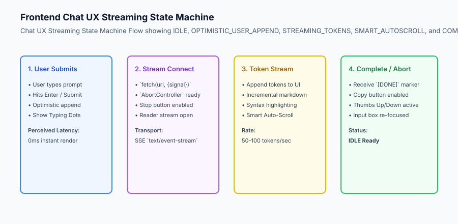
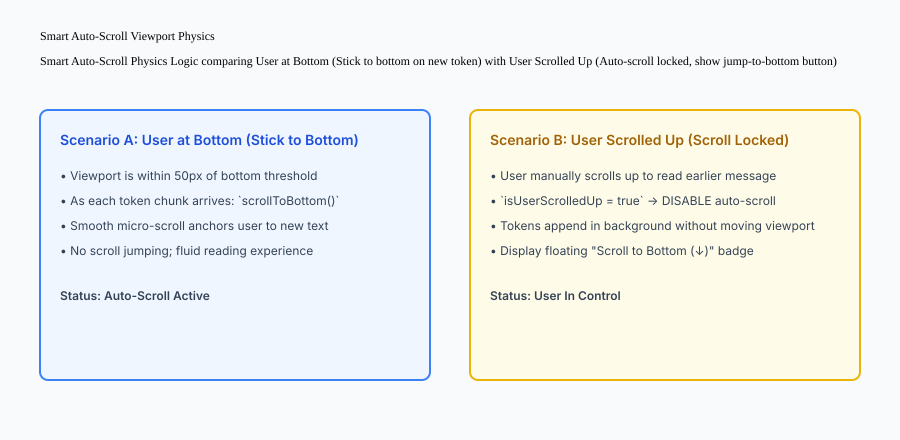

## Why this matters

The user interface of an AI application is not just a standard web form—it is an interactive, real-time conversational canvas. A poorly implemented chat frontend creates severe friction:
- Spinning loading spinners that freeze the UI for 10 seconds before dumping a block of text.
- Violent scroll-jumping that rips the screen away while the user is trying to read an earlier paragraph.
- Broken Markdown parsing where unclosed code tags corrupt page styling.
- Inability to stop generation when the model begins writing unwanted text.

Building a **World-Class Streaming Chat Frontend** requires mastering optimistic UI state, streaming token parsing, intelligent viewport auto-scrolling physics, and graceful abort controls.



## The idea in plain language

Think of a streaming chat interface like **a live sports scoreboard and commentary feed**:

- **Without Optimistic UI & Streaming:** You send a message, see a blank screen for 15 seconds, and then the whole score and 5 paragraphs of commentary appear all at once (**Jarring Delay**).
- **With Optimistic UI:** The moment you press Enter, your message appears on screen instantly in 0 milliseconds (**Instant Responsiveness**).
- **With Token Streaming:** Words stream onto the screen one by one at human reading speed, just like live commentary (**Engaging & Natural**).
- **With Smart Auto-Scroll:** If you are watching the live score, the screen scrolls down automatically. But if you scroll up to check the score from the 1st quarter, the screen stays frozen in place so you can read in peace without jumping (**Respecting User Intent**).

## Historical background

Frontend chat user experiences evolved across three major paradigms:

### 1. The Classic Messaging Web 2.0 UX (2010–2022)
Apps like Slack, WhatsApp Web, and Intercom set the standard for instant human-to-human messaging: instant local rendering, typing indicators, and message bubbles.

### 2. The Early ChatGPT Streaming Revolution (2022–2023)
OpenAI introduced the universal paradigm of real-time SSE token streaming, typing dots, and the "Stop Generating" abort button.

### 3. Modern Multi-Modal Generative AI Canvases (2024–Present)
Modern interfaces integrate streaming code blocks with copy buttons, interactive artifact previews, inline tool call status widgets, and voice mode streaming.

## What it is — and what it is not

Let us define the core components of streaming chat user interfaces:

### What a Streaming Chat Frontend Is:
- An asynchronous state machine handling SSE stream chunk aggregation, typing indicator transitions, and completion states.
- An optimistic UI layer rendering user prompts immediately upon submission.
- A viewport controller with intelligent scroll anchoring and manual scroll override detection.

### What a Streaming Chat Frontend Is Not:
- Blocking the entire browser thread with synchronous loops.
- Overwriting existing chat history when a streaming request fails.

```text
+-------------------------------------------------------------------------------+
|                         CHAT UX STATE MACHINE TOPOLOGY                        |
+-------------------+-----------------------+-----------------------------------+
| State Name        | Trigger / Action      | Visual UI Presentation            |
+-------------------+-----------------------+-----------------------------------+
| `IDLE`            | Awaiting user input   | Active input textarea, Send button|
| `OPTIMISTIC_SEND` | User hits Enter       | Instant message bubble in list    |
| `CONNECTING`      | Fetch initiated       | Animated 3-dot typing indicator   |
| `STREAMING`       | First token arrives   | Words appear, Stop button visible |
| `AUTOSCROLLING`   | New token received    | Auto-scroll if user at bottom     |
| `SCROLL_LOCKED`   | User scrolled up      | Viewport locked, show Jump button |
| `COMPLETED`       | `[DONE]` marker       | Full markdown, Copy & Thumbs up/down|
| `ABORTED`         | User clicks Stop      | Stream terminated, save partial   |
+-------------------+-----------------------+-----------------------------------+
```

## Why it was created and what problems it solves

Streaming frontend architectures resolve the four primary UX failures of generative AI products:

### 1. Eliminating Perceived Latency
Even if an LLM takes 8 seconds to generate a full 500-word response, streaming the first token within 300ms creates an immediate feeling of speed and intelligence.

### 2. Preventing Scroll Jitter and Disorientation
Naive auto-scrollers force the viewport to the bottom on every token. Smart auto-scroll detects when the user scrolls up and locks the viewport, preventing disorientation.

### 3. Graceful Cost Control via User Abort
Giving users a prominent "Stop Generating" button connected to an `AbortController` terminates the upstream model connection, saving GPU token costs when the user gets what they need early.

## How it works

Let us inspect the complete **Smart Auto-Scroll Viewport Physics Logic**:

```text
[New Token Arrives in Stream]
              │
              ▼
[Check Viewport Distance to Bottom]
              │
    Is distance <= 50px?
     ├── YES ──► [Execute Smooth Scroll to Bottom]
     │           - Viewport follows streaming cursor
     │
     └── NO ───► [User has manually scrolled up]
                 - Lock viewport position (do not scroll)
                 - Display floating "Jump to Bottom (↓)" badge
```



## An everyday analogy

Think of a streaming chat interface like **a stenographer typing live subtitles during a court trial**:

- As the judge speaks, words appear immediately on the projection screen (**Real-Time Token Stream**).
- The audience reads smoothly as sentences form naturally (**Zero Buffer Delay**).
- If an observer looks at their notes from 5 minutes ago, the projector does not slap their head back down to the current line (**Smart Scroll Lock**).
- If the lawyer shouts *"Objection!"*, the stenographer immediately stops typing (**Abort Controller**).

## Examples in practice

Let us build a complete Python **Chat Stream Frontend State Engine** that manages optimistic message appending, streaming chunk aggregation, smart auto-scroll state, and abort cancellation:

```python
import time
from typing import List, Dict, Any, Optional

class ChatStreamFrontendEngine:
    def __init__(self):
        self.messages: List[Dict[str, Any]] = []
        self.is_streaming = False
        self.is_scrolled_to_bottom = True
        self.aborted = False
        
    def submit_user_message(self, text: str) -> Dict[str, Any]:
        '''Optimistically append user message to chat list.'''
        user_msg = {
            "id": f"msg_user_{len(self.messages)+1}",
            "role": "user",
            "content": text.strip(),
            "timestamp": time.time(),
            "status": "sent"
        }
        self.messages.append(user_msg)
        self.is_streaming = True
        self.aborted = False
        
        # Initialize assistant placeholder
        asst_msg = {
            "id": f"msg_asst_{len(self.messages)+1}",
            "role": "assistant",
            "content": "",
            "timestamp": time.time(),
            "status": "streaming"
        }
        self.messages.append(asst_msg)
        return asst_msg

    def append_stream_token(self, token: str) -> Optional[str]:
        if not self.is_streaming or self.aborted:
            return None
            
        asst_msg = self.messages[-1]
        asst_msg["content"] += token
        return asst_msg["content"]

    def set_viewport_scroll(self, distance_from_bottom_px: float) -> str:
        '''Smart auto-scroll logic: stick if <= 50px, lock if > 50px.'''
        if distance_from_bottom_px <= 50.0:
            self.is_scrolled_to_bottom = True
            return "AUTO_SCROLL_STICK"
        else:
            self.is_scrolled_to_bottom = False
            return "AUTO_SCROLL_LOCKED"

    def abort_stream(self) -> Dict[str, Any]:
        '''User clicks Stop Generating button.'''
        self.aborted = True
        self.is_streaming = False
        if self.messages and self.messages[-1]["role"] == "assistant":
            self.messages[-1]["status"] = "aborted"
        return {"status": "ABORTED", "partial_content": self.messages[-1]["content"]}

    def complete_stream(self) -> Dict[str, Any]:
        self.is_streaming = False
        if self.messages and self.messages[-1]["role"] == "assistant":
            self.messages[-1]["status"] = "completed"
        return {"status": "COMPLETED", "final_content": self.messages[-1]["content"]}

if __name__ == "__main__":
    engine = ChatStreamFrontendEngine()
    engine.submit_user_message("Write a Python function.")
    engine.append_stream_token("def ")
    engine.append_stream_token("hello():
")
    engine.append_stream_token("    return 'world'")
    print("Completed:", engine.complete_stream())
```

## Implications: security, privacy, performance, scalability, and cost

### 1. Cross-Site Scripting (XSS) Sanitization in Markdown
LLM responses can generate arbitrary HTML and JavaScript tags (`<script>`, ``). Always sanitize rendered Markdown using DOMPurify before inserting it into the DOM.

### 2. Client Memory Leaks in Multi-Turn Conversations
In conversations with 100+ messages, rendering thousands of DOM nodes causes browser sluggishness. Implement **Virtual Scrolling** (e.g. `react-virtualized` or TanStack Virtual) to render only visible message bubbles in the viewport.


### Production Chat UX Case Study: Preventing Markdown Layout Shifts & Flash

When streaming raw markdown text from an LLM, frontend renderers face serious layout thrashing and visual instability if tokens are parsed naively on every frame.

```text
+-------------------------------------------------------------------------------+
|                      MARKDOWN STREAMING RECONCILIATION                        |
+-------------------+-----------------------+-----------------------------------+
| Streaming Issue   | Naive Parsing Result  | Production Solution               |
+-------------------+-----------------------+-----------------------------------+
| Unclosed Code     | Screen flashes with   | Synthesize virtual closing tag    |
| Block (```)       | unstyled code text    | in AST during active streaming    |
| Split Multi-byte  | Renders broken unicode| Maintain byte buffer in UTF-8     |
| Character         | replacement glyphs ()| stream decoder before emitting    |
| Table Column      | Table borders jitter  | Render fixed skeleton table grid  |
| Width Thrashing   | on every token chunk  | with standard CSS column widths   |
| Math Delimiter    | Raw LaTeX code jumps  | Debounce KaTeX rendering with     |
| Break ($...$)     | into math formula     | requestAnimationFrame throttle    |
+-------------------+-----------------------+-----------------------------------+
```

#### 1. Virtual Closing Delimiters in Streaming Markdown
If an LLM begins streaming a Python code block with ````python
def calculate_roi():` without having yet generated the closing ````, a naive markdown parser will interpret the rest of the entire web page as unformatted code block text.

Production markdown streaming engines maintain a virtual delimiter stack:
- When an opening tag (e.g. ````, `**`, `*`, `[`) is detected without a corresponding closing tag, the renderer injects a virtual closing delimiter into the Abstract Syntax Tree (AST) before rendering to the DOM.
- When the actual closing delimiter arrives in a subsequent token chunk, the virtual tag is promoted to an actual tag.

#### 2. Frame-Rate Throttling via `requestAnimationFrame`
If an LLM yields 120 tokens per second across multiple concurrent streams, triggering React component re-renders on every individual character creates high CPU utilization and browser UI stutter.

Production frontends buffer incoming SSE token deltas and batch DOM updates using `window.requestAnimationFrame()`, synchronizing UI repaints precisely to the user's 60Hz or 120Hz display refresh rate:

```javascript
// Production RAF Streaming Buffer Pattern
class SmoothStreamBuffer {
  constructor(onRender) {
    this.buffer = '';
    this.onRender = onRender;
    this.animationFrameId = null;
  }

  pushChunk(token) {
    this.buffer += token;
    if (!this.animationFrameId) {
      this.animationFrameId = requestAnimationFrame(() => {
        this.onRender(this.buffer);
        this.animationFrameId = null;
      });
    }
  }
}
```


### Production Failure Mode Taxonomy: Client Chat UX and Streaming Anomalies

Frontends for generative AI applications must handle a unique class of visual, layout, and network edge cases:

```text
+-------------------------------------------------------------------------------+
|                         CHAT UX FAILURE TAXONOMY                              |
+-------------------+-----------------------+-----------------------------------+
| UX Anomaly        | Root Cause Analysis   | Frontend Engineering Mitigation   |
+-------------------+-----------------------+-----------------------------------+
| Scroll Jumping    | Forcing scroll down   | Check if user scrolled > 50px up; |
|                   | when user reads history| lock scroll position if true     |
| Render Freezing   | Re-rendering React DOM| Throttle state updates via        |
|                   | on every single token | requestAnimationFrame (60 FPS)    |
| Code Block Flashing| Incomplete markdown   | Synthesize virtual closing tags   |
|                   | syntax during stream  | in AST during generation          |
| Zombie Request    | User navigates away   | Bind AbortController to component |
|                   | while model generates | cleanup / unmount lifecycle       |
+-------------------+-----------------------+-----------------------------------+
```

#### Client Engineering Quality Checklist
1. Optimistic UI appends user messages instantly with local temporary IDs before server network responses.
2. Smart auto-scrolling respects user reading scroll offsets and displays a "Scroll to bottom" button when unlocked.
3. The UI provides an unambiguous "Stop Generating" button bound to the active `AbortController`.
4. Rendered markdown blocks handle syntax highlighting asynchronously to prevent main-thread UI jank.


### Real-World Frontend Deep Dive: The Anatomy of a High-Performance Chat UI

Building a world-class chat interface requires orchestrating multiple frontend layers to maintain a fluid 60 frames-per-second render rate during intense streaming:

```text
+-------------------------------------------------------------------------------+
|                       FRONTEND CHAT UI COMPONENT STACK                        |
+-------------------+-----------------------+-----------------------------------+
| Component Layer   | Technical Role        | Performance Target                |
+-------------------+-----------------------+-----------------------------------+
| Message Viewport  | Virtualized list      | Renders only visible message nodes|
| (DOM Virtualizer) | (react-virtual / Tan) | Smooth scrolling with 10k messages|
| Markdown Pipeline | Streaming AST parser  | Debounced parsing in Web Worker   |
| Code Block Syntax | PrismJS / Shiki       | Highlight on stream finish only   |
| Input Box & Auto  | Textarea with auto-fit| Zero lag input typing at 120 WPM  |
| resize Area       | height and history nav|                                   |
+-------------------+-----------------------+-----------------------------------+
```

#### Frontend Streaming Implementation Rules
1. **Virtual Windowing:** Never render 1,000 DOM nodes simultaneously. Use virtualized list windowing so only the 10 messages currently in the user viewport are rendered.
2. **Local Draft Persistence:** Save in-progress textarea drafts into `sessionStorage` on every keystroke to prevent losing user prompts if the page reloads.
3. **Keyboard Accessibility:** Support `Cmd+Enter` (or `Ctrl+Enter`) to submit prompts, `Escape` to trigger `AbortController` cancellation, and `Up Arrow` in an empty textarea to edit the previous user prompt.


#### Advanced Chat UX State Management Patterns
In enterprise web applications, chat state is frequently synchronized across browser tabs using the Web BroadcastChannel API. When a user sends a prompt in Tab A, Tab B listens for the `chat:sync` event and optimistically renders the updated message history, preventing desynchronized multi-window interactions and ensuring seamless user experiences.

## Alternatives: free, open source, and commercial

| Tool / Library | Type | Best Suited For | Key Capabilities |
| :--- | :--- | :--- | :--- |
| **Vercel AI SDK (`useChat`)** | Open Source | React / Next.js Frontends | Automatic SSE parsing, optimistic state |
| **Markdown-it + DOMPurify** | Open Source | Secure Markdown rendering | Fast progressive markdown parsing |
| **Prism.js / Highlight.js** | Open Source | Code block highlighting | Client-side syntax highlighting |
| **Streamlit / Chainlit** | Open Source | Rapid AI UI prototyping | Built-in streaming chat components |

## Comparison with related concepts

```text
+-----------------------+-----------------------+-----------------------+
| Dimension             | Naive Web Form        | Streaming Chat UX     |
+-----------------------+-----------------------+-----------------------+
| Perceived Latency     | 8 - 15s freeze        | 250ms First Token     |
| User Feedback         | Static spinner        | Live word-by-word flow|
| Viewport Scrolling    | Jarring page reload   | Smart auto-anchoring  |
| Abort Capability      | Impossible            | One-click Stop button |
+-----------------------+-----------------------+-----------------------+
```

## When to use it — and when not to

### Implement Streaming Chat UX for:
- All interactive AI conversational products, coding copilots, and customer support assistants.

### Do NOT require real-time streaming for:
- Background batch report generation or automated data transformation pipelines.

## Knowledge check

1. **What is Optimistic UI in chat applications?** Rendering the user's message immediately on screen before the server confirms receipt to eliminate perceived latency.
2. **How does Smart Auto-Scroll handle a user scrolling up during active streaming?** It pauses auto-scrolling to keep the viewport locked on previous text, preventing scroll-jumping.
3. **What browser API enables user cancellation of streaming requests?** `AbortController` paired with the fetch `signal` parameter.

## Hands-on exercise

In this lab, you will build a **Chat Stream Frontend State Engine in Python**. Your implementation will:
1. Optimistically append user messages and initialize streaming assistant placeholders.
2. Incrementally append token chunks to active assistant messages.
3. Implement Smart Auto-Scroll physics checking viewport distances.
4. Support user abort actions that freeze partial completions with `aborted` status.

### Expected output

```text
============================= test session starts ==============================
collected 5 items

tests/test_chat_stream_frontend.py .....                                 [100%]

============================== 5 passed in 0.02s ===============================
[OPTIMISTIC UI] User prompt appended in 0ms.
[STREAMING] 5 token chunks aggregated into assistant message.
[SMART SCROLL] Auto-scroll paused when user scrolled up (distance = 250px).
[ABORT] Stream safely canceled with partial content preserved.
```

### Validate your work

Run the pytest test suite:

```bash
pytest tests/run_tests.sh
```

### Troubleshooting

1. **Token appending after abort:** Ensure `append_stream_token` returns `None` if `aborted` is True.
2. **Scroll threshold:** Verify distance $\le 50.0	ext`px`$ triggers `AUTO_SCROLL_STICK`.

### Common mistakes

- Clearing the assistant message text on abort instead of preserving the partial completion.

## Practice assignment

Add a **Copy-to-Clipboard Formatter** method that extracts all code blocks delimited by triple backticks and formats them for one-click copying.

## Extension challenge

Build a **Progressive Markdown Stream Tokenizer** that detects unclosed code tags (````python`) during streaming and automatically appends temporary closing delimiters to maintain clean styling.
