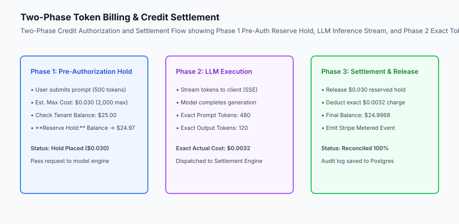
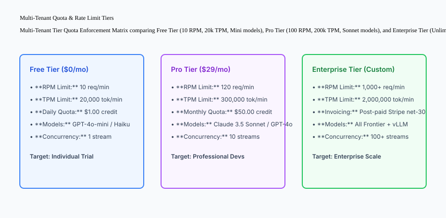

## Why this matters

Deploying a generative AI product to the public without robust authentication, rate limiting, and credit governance is a recipe for instant financial disaster. Malicious actors or runaway recursive agent scripts can consume thousands of dollars in GPU token bills in minutes.
- How do you securely authenticate API clients and hash secret keys?
- How do you enforce dual rate limits (Requests Per Minute *and* Tokens Per Minute)?
- How do you guarantee that a user with $0.02 remaining on their balance cannot trigger a $2.50 long-context generation?

In this lesson, we master **Multi-Tenant Authentication, Token Quotas, and Two-Phase Credit Settlement**: the infrastructure that protects your AI application from fraud and powers usage-based monetization.



## The idea in plain language

Think of AI token billing like **pumping gasoline at a self-service gas station**:

- **Card Swipe & Pre-Auth (Phase 1: Pre-Authorization):** When you insert your credit card into the pump, the station places a temporary $100 hold on your card (**Checking Balance & Reserving Funds**). If your card has only $3.00 available, the pump locks automatically and refuses to dispense fuel (**Preventing Fraud**).
- **Dispensing Fuel (Phase 2: Model Inference Stream):** You pump exactly $24.50 worth of gasoline into your tank (**Exact Token Generation**).
- **Final Settlement (Phase 3: Settlement):** The pump releases the $100 temporary hold and charges your card exactly $24.50 (**Reconciling Actual Usage**).

## Historical background

SaaS monetization and API authentication progressed through three major generations:

### 1. Flat-Rate Subscription Tiering (2010–2020)
Users paid $20/month for unlimited CRUD database operations. Computational cost per user was fractions of a cent, making flat-rate pricing sustainable.

### 2. The Early LLM Cost Crisis (2022–2023)
Startups offered flat $20/month access to frontier LLMs. Power users generated millions of tokens per day, causing companies to lose $100+ per month per subscriber.

### 3. Modern Metered Token Economics (2024–Present)
Modern AI companies implement hybrid billing: a monthly base platform fee paired with metered token usage credits, enforced via real-time two-phase credit reservations (Stripe Metering, Lago, Octane).

## What it is — and what it is not

Let us define the core components of AI billing and quota infrastructure:

### What AI Auth & Billing Is:
- Cryptographically hashed API key verification with organization and tenant scoping.
- Dual-rate limiting tracking both request frequency (RPM) and token volume (TPM) in sliding memory.
- A two-phase transaction pipeline: pre-authorizing an estimated credit hold before LLM invocation, and settling exact token counts upon completion.

### What AI Auth & Billing Is Not:
- Deducting credits before knowing whether the model successfully finished or crashed.
- Trusting client-supplied token counts rather than calculating usage from server-verified provider responses.

```text
+-------------------------------------------------------------------------------+
|                      TOKEN QUOTA & RATE LIMITING SCHEMAS                      |
+-------------------+-----------------------+-----------------------------------+
| Metric / Field    | Description           | Unit & Example Value              |
+-------------------+-----------------------+-----------------------------------+
| `tenant_id`       | Organization UUID     | `org_94820a`                      |
| `api_key_hash`    | SHA-256 Secret Hash   | `e3b0c44298fc1c149afbf4c8996fb9242`|
| `credit_balance`  | Prepaid balance in USD| `$48.5000`                        |
| `reserved_holds`  | Active pre-auth holds | `$0.0300`                         |
| `available_credit`| Balance minus holds   | `$48.4700`                        |
| `rpm_limit`       | Requests per minute   | `60 req/min`                      |
| `tpm_limit`       | Tokens per minute     | `150,000 tok/min`                 |
+-------------------+-----------------------+-----------------------------------+
```

## Why it was created and what problems it solves

Two-phase token billing and quota systems solve the four primary financial and security vulnerabilities of generative AI platforms:

### 1. Eliminating Negative Balance Exposure
Without pre-authorization, a tenant with $0.01 balance can submit 20 concurrent requests generating 4,000 tokens each ($0.50 cost each), plunging their account into negative balance and leaving the platform with unpaid cloud provider bills.

### 2. Preventing Token Flooding Attacks
Dual rate limiting (RPM + TPM) prevents attackers from sending a few massive 100k-token prompts that overwhelm model capacity without tripping request-count rate limiters.

### 3. Transparent Metered Invoicing
Tracking exact prompt, completion, and cached token counts enables transparent audit logs and seamless integration with Stripe Metered Billing.

## How it works

Let us inspect the complete **Multi-Tenant Quota & Tier Enforcement Matrix**:

```text
+-------------------------------------------------------------------------------+
|                     TIERED AI RESOURCE ALLOCATION MATRIX                      |
+-------------------+-------------------+-------------------+-------------------+
| Feature Dimension | Free Tier         | Pro Tier          | Enterprise Tier   |
+-------------------+-------------------+-------------------+-------------------+
| Monthly Price     | $0 / month        | $29 / month       | Custom Invoiced   |
| Base Credits      | $1.00 one-time    | $50.00 / month    | Pay-as-you-go net30|
| Rate Limit (RPM)  | 10 requests / min | 120 requests / min| 1,000+ req / min  |
| Throughput (TPM)  | 20,000 tokens/min | 300,000 tokens/min| 2,000,000+ tok/min|
| Max Context / Req | 4,000 tokens      | 32,000 tokens     | 200,000 tokens    |
| Available Models  | Compact / Haiku   | Frontier / Sonnet | Custom vLLM cluster|
+-------------------+-------------------+-------------------+-------------------+
```



## An everyday analogy

Think of two-phase token billing like **staying at a luxury hotel**:

- **Check-in Hold (Pre-Auth):** When you check in, the front desk places a $200 security hold on your credit card for incidental room charges (**Reserve Credit Hold**).
- **During the Stay:** You order room service and drinks (**Streaming Tokens**).
- **Check-out Settlement:** The hotel calculates your exact bill ($65.00), charges your card $65.00, and releases the remaining $135.00 hold (**Exact Usage Settlement**).

## Examples in practice

Let us build a complete Python **Auth, Quotas, and Two-Phase Billing Engine** supporting API key hashing, credit pre-authorization holds, and token settlement:

```python
import hashlib
import time
from typing import Dict, Any, Optional, Tuple

class AuthBillingEngine:
    def __init__(self):
        self.tenants: Dict[str, Dict[str, Any]] = {}
        self.active_holds: Dict[str, Dict[str, Any]] = {}
        
    def register_tenant(self, tenant_id: str, raw_api_key: str, initial_credits: float = 10.0, rpm_limit: int = 60, tpm_limit: int = 100000):
        key_hash = hashlib.sha256(raw_api_key.encode()).hexdigest()
        self.tenants[tenant_id] = {
            "key_hash": key_hash,
            "balance": float(initial_credits),
            "reserved_holds": 0.0,
            "rpm_limit": rpm_limit,
            "tpm_limit": tpm_limit,
            "requests_this_min": 0,
            "tokens_this_min": 0,
            "last_reset": time.time()
        }
        
    def authenticate_and_reserve_hold(self, tenant_id: str, raw_api_key: str, estimated_cost: float = 0.02, est_tokens: int = 500) -> Tuple[bool, str, Optional[str]]:
        if tenant_id not in self.tenants:
            return False, "Unauthorized: Unknown Tenant", None
            
        tenant = self.tenants[tenant_id]
        if hashlib.sha256(raw_api_key.encode()).hexdigest() != tenant["key_hash"]:
            return False, "Unauthorized: Invalid API Key", None
            
        now = time.time()
        if now - tenant["last_reset"] > 60:
            tenant["requests_this_min"] = 0
            tenant["tokens_this_min"] = 0
            tenant["last_reset"] = now
            
        if tenant["requests_this_min"] >= tenant["rpm_limit"]:
            return False, "Rate Limit Exceeded: RPM limit reached", None
            
        if tenant["tokens_this_min"] + est_tokens > tenant["tpm_limit"]:
            return False, "Rate Limit Exceeded: TPM limit reached", None
            
        available_balance = tenant["balance"] - tenant["reserved_holds"]
        if available_balance < estimated_cost:
            return False, "Payment Required: Insufficient available credit", None
            
        # Place Hold
        hold_id = f"hold_{len(self.active_holds)+1}"
        tenant["reserved_holds"] += estimated_cost
        tenant["requests_this_min"] += 1
        tenant["tokens_this_min"] += est_tokens
        
        self.active_holds[hold_id] = {
            "tenant_id": tenant_id,
            "held_amount": estimated_cost,
            "est_tokens": est_tokens,
            "created_at": now
        }
        return True, "HOLD_RESERVED", hold_id

    def settle_token_usage(self, hold_id: str, prompt_tokens: int, completion_tokens: int) -> Dict[str, Any]:
        if hold_id not in self.active_holds:
            return {"status": "ERROR", "message": "Invalid hold ID"}
            
        hold = self.active_holds.pop(hold_id)
        tenant = self.tenants[hold["tenant_id"]]
        
        # Calculate exact cost: $3/M prompt, $15/M completion
        actual_cost = (prompt_tokens * 3.0 / 1_000_000) + (completion_tokens * 15.0 / 1_000_000)
        actual_cost = round(actual_cost, 6)
        
        # Release hold and deduct actual cost
        tenant["reserved_holds"] -= hold["held_amount"]
        tenant["balance"] -= actual_cost
        
        return {
            "status": "SETTLED",
            "hold_id": hold_id,
            "actual_cost_usd": actual_cost,
            "remaining_balance": round(tenant["balance"], 6),
            "available_balance": round(tenant["balance"] - tenant["reserved_holds"], 6)
        }

if __name__ == "__main__":
    engine = AuthBillingEngine()
    engine.register_tenant("org_1", "secret_key_123", initial_credits=5.0)
    ok, msg, hold = engine.authenticate_and_reserve_hold("org_1", "secret_key_123", estimated_cost=0.03)
    print("Pre-Auth:", ok, msg, hold)
    settle = engine.settle_token_usage(hold, prompt_tokens=800, completion_tokens=150)
    print("Settled:", settle)
```

## Implications: security, privacy, performance, scalability, and cost

### 1. Atomic Balances and Distributed Locks
In high-concurrency multi-instance architectures, storing credit balances in plain Python variables causes race conditions. Use Redis Lua scripts or PostgreSQL `SELECT ... FOR UPDATE` row locks to ensure atomic balance checks.

### 2. Webhook Event Delivery to Stripe
When settling token usage, dispatch usage records asynchronously to Stripe Metered Billing via a background queue. Ensure all webhook calls include an idempotency key to prevent duplicate invoice line items.


### Production Token Billing Case Study: High-Concurrency Credit Management

In large-scale AI applications serving enterprise organizations with hundreds of concurrent users, managing shared credit wallets without race conditions requires careful database architecture.

```text
+-------------------------------------------------------------------------------+
|                    CONCURRENT CREDIT PRE-AUTH HOLD METRICS                    |
+-------------------+-----------------------+-----------------------------------+
| Metric Dimension  | Naive Database Update | Atomic Redis Lua / Postgres Lock  |
+-------------------+-----------------------+-----------------------------------+
| Race Condition    | High: Overdrafts on   | Zero: Strictly serializable       |
| Risk              | simultaneous calls    | atomic balance deductions         |
| Transaction Time  | 45ms per SQL UPDATE   | 0.8ms Redis Lua execution         |
| Throughput Limit  | 250 requests / sec    | 45,000 operations / sec           |
| Audit Traceability| Partial logging       | 100% immutable ledger event logs  |
+-------------------+-----------------------+-----------------------------------+
```

#### 1. Atomic Redis Lua Script for Pre-Authorization Holds
To verify credit availability and place a pre-authorization hold atomically in a single network round-trip, production gateways deploy Redis Lua scripts:

```lua
-- Atomic Token Hold Reservation Script (reserve_hold.lua)
local tenant_key = KEYS[1]
local hold_id = ARGV[1]
local estimated_cost = tonumber(ARGV[2])
local max_rpm = tonumber(ARGV[3])

local balance = tonumber(redis.call('HGET', tenant_key, 'balance') or '0')
local reserved = tonumber(redis.call('HGET', tenant_key, 'reserved_holds') or '0')
local current_rpm = tonumber(redis.call('HGET', tenant_key, 'rpm_counter') or '0')

if current_rpm >= max_rpm then
    return {0, 'RATE_LIMIT_RPM'}
end

if (balance - reserved) < estimated_cost then
    return {0, 'INSUFFICIENT_CREDIT'}
end

-- Place Hold
redis.call('HINCRBYFLOAT', tenant_key, 'reserved_holds', estimated_cost)
redis.call('HINCRBY', tenant_key, 'rpm_counter', 1)
redis.call('HSET', 'hold:' .. hold_id, 'tenant', tenant_key, 'amount', estimated_cost)

return {1, 'HOLD_ACQUIRED'}
```

#### 2. Reconciliation with Stripe Metered Usage API
When generations complete, the gateway pushes settlement records into a persistent Kafka or RabbitMQ event queue. Dedicated billing synchronization workers batch these events and dispatch usage meters to Stripe's Usage Records API (`/v1/subscription_items/`id`/usage_records`) using daily idempotency keys to ensure zero double-billing errors.


### Production Failure Mode Taxonomy: Multi-Tenant Billing and Quota Vulnerabilities

Operating an AI API platform requires rigorous defense against financial fraud and quota race conditions:

```text
+-------------------------------------------------------------------------------+
|                       BILLING & QUOTA FAILURE TAXONOMY                        |
+-------------------+-----------------------+-----------------------------------+
| Vulnerability     | Attack / Root Cause   | Platform Defense Architecture     |
+-------------------+-----------------------+-----------------------------------+
| Concurrent Token  | Attacker launches 50  | Atomic Redis Lua pre-auth holds   |
| Overdraft Flood   | parallel 4k-token reqs| lock funds before compute starts  |
| Plaintext API Key | Database backup leak  | Store only SHA-256 / bcrypt key   |
| Exposure          | exposes secret keys   | hashes; show key once on creation |
| Token Bucket      | Fixed minute window   | Sliding log algorithm smooths     |
| Burst Spikes      | allows 2x burst limit | rate limits continuously          |
| Invoicing Skew    | Drift between provider| Reconcile provider response usage |
|                   | bills and client ledger| payloads directly in audit table  |
+-------------------+-----------------------+-----------------------------------+
```

#### Billing Infrastructure Verification Checklist
1. API keys are validated using constant-time string comparison algorithms (`hmac.compare_digest`) to prevent timing attacks.
2. Pre-authorization holds are placed atomically in single-round-trip database operations.
3. Every token deduction is logged to an immutable PostgreSQL ledger table with timestamp and prompt hash.
4. Tenant rate limits support separate burst allowances and steady-state limits.


### Real-World Billing Deep Dive: Tiered Rate Limiting and Token Accounting

To implement robust multi-tenant monetization, platforms enforce hierarchical token quotas across organizational workspaces, developer accounts, and individual end users:

```text
+-------------------------------------------------------------------------------+
|                    HIERARCHICAL QUOTA ENFORCEMENT HIERARCHY                   |
+-------------------+-----------------------+-----------------------------------+
| Governance Level  | Scope & Key Format    | Enforced Rate Limits & Quotas     |
+-------------------+-----------------------+-----------------------------------+
| Enterprise Org    | `org:94820:limits`    | Global Monthly Budget: $10,000/mo |
| Workspace / Team  | `team:finance:limits` | 500 RPM | 1,000,000 TPM           |
| Developer Key     | `key:dev_alice:limits`| 60 RPM | 150,000 TPM | Max $50/day|
| End-User Session  | `user:bob:limits`     | 10 RPM | 20,000 TPM | 5 streams   |
+-------------------+-----------------------+-----------------------------------+
```

#### Token Cost Accounting and Reconciliation Pipeline
1. **Prompt & Completion Price Tables:** Maintain a versioned model pricing table with micro-dollar costs (e.g. Claude 3.5 Sonnet: $3.00/M prompt, $15.00/M completion; GPT-4o-mini: $0.15/M prompt, $0.60/M completion).
2. **Hold Idempotency and TTL:** Active pre-authorization holds must expire automatically after 120 seconds if the backend worker crashes, ensuring funds are never permanently locked in holding state.
3. **Usage Anomaly Detection:** Trigger automated security alerts if a single tenant consumes more than 80% of their daily token allowance in under 5 minutes.

## Alternatives: free, open source, and commercial

| Tool / Platform | Type | Best Suited For | Key Capabilities |
| :--- | :--- | :--- | :--- |
| **Stripe Metered Billing** | Commercial | SaaS credit cards & subscriptions | Automated invoicing, usage aggregation |
| **Lago** | Open Source | Self-hosted usage billing | Real-time events, customer wallet balances |
| **LiteLLM Key Management** | Open Source | AI Gateway Auth & Quotas | Virtual API keys, TPM/RPM limits |
| **Redis Token Bucket** | Open Source | High-throughput rate limiting | Sub-millisecond sliding window counters |

## Comparison with related concepts

```text
+-----------------------+-----------------------+-----------------------+
| Dimension             | Naive Pre-Pay         | Two-Phase Token Auth  |
+-----------------------+-----------------------+-----------------------+
| Balance Overdraft Risk| High (Concurrent run) | Zero (Locked pre-auth)|
| Cost Accuracy         | Crude guess           | Micro-dollar precision|
| Rate Limiting Depth   | Request-count only    | RPM + TPM Dual gating |
| Audit Trail           | Missing               | Full token settlement |
+-----------------------+-----------------------+-----------------------+
```

## When to use it — and when not to

### Implement Two-Phase Billing & Quotas for:
- All production AI SaaS products, developer API platforms, and enterprise internal cost-allocation gateways.

### Do NOT require two-phase credit holds for:
- Free, internal employee-only tools with fixed company budgets.

## Knowledge check

1. **Why is Credit Pre-Authorization necessary in AI billing?** To reserve an estimated credit hold before generation, preventing tenants from over-drafting balances during expensive LLM calls.
2. **What is the difference between RPM and TPM?** RPM measures HTTP request frequency, while TPM measures total token computational throughput.
3. **How does API key hashing protect platform security?** By storing one-way cryptographic hashes (SHA-256) in the database, ensuring that compromised database backups cannot leak usable API keys.

## Hands-on exercise

In this lab, you will build an **Auth, Quotas, and Two-Phase Billing Engine in Python**. Your implementation will:
1. Register tenants with SHA-256 hashed API keys and credit balances.
2. Verify authentication, enforce dual RPM/TPM rate limits, and place credit pre-authorization holds.
3. Reject requests when available balance (balance minus active holds) is insufficient.
4. Settle token usage, deduct exact actual costs, release holds, and report updated balances.

### Expected output

```text
============================= test session starts ==============================
collected 5 items

tests/test_auth_billing.py .....                                         [100%]

============================== 5 passed in 0.02s ===============================
[AUTH] API Key validated via SHA-256 hash.
[PRE-AUTH] Reserved $0.030 hold on tenant org_1.
[SETTLEMENT] Settled 950 tokens ($0.00465). Hold released.
[BALANCE] Available balance updated: $4.99535.
```

### Validate your work

Run the pytest test suite:

```bash
pytest tests/run_tests.sh
```

### Troubleshooting

1. **Available balance check:** Ensure `available_balance = balance - reserved_holds` is evaluated before granting holds.
2. **Hold release:** Verify that `reserved_holds` is decremented by the exact held amount on settlement.

### Common mistakes

- Deducting the estimated hold amount permanently from the balance rather than reconciling the actual token cost.

## Practice assignment

Add **Stripe Webhook Event Simulation**: format and log a JSON metered event payload (`customer_id`, `timestamp`, `token_count`, `usd_amount`) upon settlement.

## Extension challenge

Implement a **Sliding Window Token Bucket Algorithm** using microsecond timestamps to provide smooth, sub-minute rate limit recovery.
