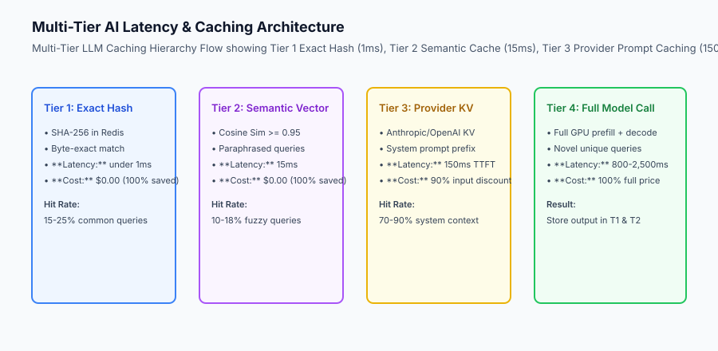
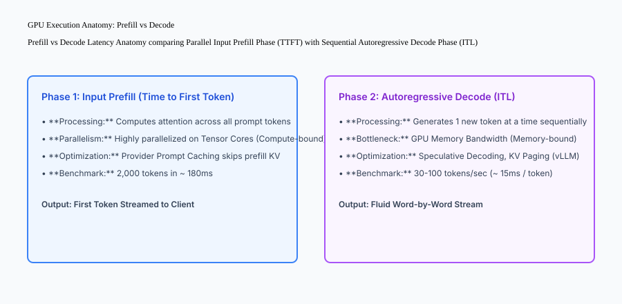

## Why this matters

In interactive software products, latency is the single greatest determinant of user engagement and retention. While traditional web APIs return responses in 30ms, large language model generation requires:
- 300ms to 2,000ms just to process the input prompt (**Time to First Token / Prefill Latency**).
- 10ms to 30ms per output token (**Inter-Token Decode Latency**).
- A 500-word response takes 5 to 10 seconds of continuous GPU computation.

Deploying a **Multi-Tier Latency & Caching Architecture** (Exact Redis Hashing, Semantic Vector Caching, and Provider Prompt Caching) slashes p95 latency by up to 80% and reduces API billing expenses by over 60%.



## The idea in plain language

Think of multi-tier LLM caching like **a professional chef preparing dishes during dinner rush**:

- **Tier 1: Ready-Made Dishes on the Pass (Exact Hash Cache):** If a customer orders the daily soup, the chef ladles a hot bowl in 2 seconds without turning on the stove (**1ms Redis Cache Hit, $0.00 Cost**).
- **Tier 2: Assembled Cold Prep (Semantic Cache):** If a customer asks for *"a green salad"* vs *"house tossed greens"*, the chef recognizes they are the same dish and serves the prepped bowl in 10 seconds (**15ms Vector Cache Hit, $0.00 Cost**).
- **Tier 3: Pre-Simmered Master Stock (Provider Prompt Cache):** If a customer orders a complex risotto, the chef scoops from a giant simmering pot of 24-hour stock, cooking the dish in 3 minutes instead of starting from raw bones (**150ms TTFT, 90% Cost Discount**).
- **Tier 4: Cooking from Scratch (Full Model Inference):** A completely novel custom order requires firing all burners from scratch (**800ms+ Full GPU Inference**).

## Historical background

Application caching strategies evolved through three key generations:

### 1. HTTP Reverse Proxy Caching (2000–2020)
Varnish, Squid, and CDNs cached identical HTTP GET URLs with `Cache-Control: max-age=3600`. Responses were 100% deterministic.

### 2. The LLM Non-Determinism Dilemma (2022–2023)
Because LLMs generate text stochastically and take dynamic prompts, traditional HTTP URL caching failed completely. Every single user query incurred full model execution costs.

### 3. Multi-Tier Semantic & KV Caching (2024–Present)
Modern systems combine exact prompt hashing in Redis, embedding vector semantic caching (GPTCache), and GPU Key-Value (KV) activation caching at model providers (Anthropic Prompt Caching, vLLM PagedAttention).

## What it is — and what it is not

Let us define the core components of modern generative AI caching:

### What Multi-Tier AI Caching Is:
- Tier 1: Sub-millisecond exact string matching via SHA-256 hashes in Redis.
- Tier 2: Embedding vector similarity search matching paraphrased queries above a strict threshold (`similarity >= 0.95`).
- Tier 3: GPU KV cache reuse across static system prompt prefixes at cloud model providers.

### What Multi-Tier AI Caching Is Not:
- Setting loose similarity thresholds (e.g. 0.70) that return inaccurate answers to distinct questions.
- Caching private, user-specific data across organizational tenant boundaries.

```text
+-------------------------------------------------------------------------------+
|                        MULTI-TIER CACHE SPECIFICATIONS                        |
+-------------------+-------------------+-------------------+-------------------+
| Tier Name         | Lookup Latency    | Hit Criteria      | Cost Reduction    |
+-------------------+-------------------+-------------------+-------------------+
| 1. Exact Hash     | under 1ms         | Exact SHA-256     | 100% ($0.00 cost) |
| 2. Semantic Cache | 10 - 20ms         | Cosine Sim >= 0.95| 100% ($0.00 cost) |
| 3. Provider KV    | 100 - 200ms TTFT  | Static Prefix KV  | 90% Input Discount|
| 4. Full GPU Infer | 800 - 3,000ms     | None (Cache Miss) | 0% (Full Price)   |
+-------------------+-------------------+-------------------+-------------------+
```

## Why it was created and what problems it solves

Multi-tier caching resolves the three primary performance and cost bottlenecks of generative AI products:

### 1. Slashing Time to First Token (TTFT)
Serving common queries from exact or semantic cache drops TTFT from 1,500ms down to under 15ms, creating an instantly responsive application.

### 2. Drastic Cloud GPU Cost Reductions
In customer support and knowledge retrieval applications, 30% to 50% of user questions are paraphrased variations of frequent inquiries. Caching these queries saves thousands of dollars monthly in API expenses.

### 3. Mitigating Upstream Rate Limit Throttle
Serving cached responses requires zero downstream provider API calls, protecting your application from hitting provider Requests-Per-Minute (RPM) and Tokens-Per-Minute (TPM) rate limits during traffic spikes.

## How it works

Let us inspect the complete **GPU Execution Anatomy: Prefill vs Autoregressive Decode**:

```text
User Submits Prompt: "Explain photosynthesis in 200 words" (500 tokens context)
                                │
                                ▼
┌───────────────────────────────────────────────────────────────────────────────┐
│                      PHASE 1: PREFILL PHASE (Parallel)                        │
│ - GPU computes self-attention across all 500 prompt tokens in parallel       │
│ - Compute-bound on Tensor Cores                                               │
│ - Generates Key-Value (KV) cache for prompt context                           │
│ - Duration: 150ms -> Produces First Token: "Photosynthesis"                   │
└───────────────────────────────────────┬───────────────────────────────────────┘
                                        │ (First token streamed to client)
                                        ▼
┌───────────────────────────────────────────────────────────────────────────────┐
│                   PHASE 2: AUTOREGRESSIVE DECODE PHASE (Sequential)           │
│ - GPU generates Token 2: " is" (attending to KV cache)                        │
│ - GPU generates Token 3: " the"                                               │
│ - GPU generates Token 4: " process..."                                        │
│ - Memory-bandwidth bound (15ms per token)                                     │
│ - Duration: 200 tokens * 15ms = 3,000ms total streaming time                  │
└───────────────────────────────────────────────────────────────────────────────┘
```



## An everyday analogy

Think of prompt caching like **a mathematician answering math questions with a whiteboard**:

- **Without Prompt Caching:** Every time you ask a question, the mathematician erases the entire board, re-derives 50 pages of calculus proofs from scratch, and then solves your problem (**Recomputing the entire prefill context**).
- **With Prompt Caching:** The mathematician leaves the 50 pages of calculus proofs permanently drawn on the left side of the board, glances at them instantly, and writes only the final solution on the right (**Instant KV Activation Reuse**).

## Examples in practice

Let us build a complete Python **Exact & Semantic Multi-Tier LLM Cache Engine** supporting SHA-256 hashing, mock vector embedding similarity evaluation, and time-to-live (TTL) expiration:

```python
import hashlib
import time
from typing import Dict, Any, List, Optional, Tuple

class MultiTierLLMCache:
    def __init__(self, semantic_similarity_threshold: float = 0.90, default_ttl_seconds: float = 300.0):
        self.exact_cache: Dict[str, Dict[str, Any]] = {}
        self.semantic_cache: List[Dict[str, Any]] = []
        self.similarity_threshold = float(semantic_similarity_threshold)
        self.ttl = float(default_ttl_seconds)
        
    @staticmethod
    def _compute_hash(text: str) -> str:
        return hashlib.sha256(text.strip().lower().encode()).hexdigest()

    @staticmethod
    def _mock_embedding(text: str) -> List[float]:
        # Simple deterministic character-frequency mock embedding normalized
        words = text.lower().split()
        length = len(words)
        return [float(len(text)), float(length), float(sum(ord(c) for c in text[:5]))]

    @staticmethod
    def _cosine_similarity(vec1: List[float], vec2: List[float]) -> float:
        dot = sum(a * b for a, b in zip(vec1, vec2))
        norm1 = sum(a * a for a in vec1) ** 0.5
        norm2 = sum(b * b for b in vec2) ** 0.5
        if norm1 == 0 or norm2 == 0:
            return 0.0
        return round(dot / (norm1 * norm2), 4)

    def get(self, query: str) -> Tuple[Optional[str], str]:
        now = time.time()
        
        # 1. Tier 1: Exact Hash Lookup
        q_hash = self._compute_hash(query)
        if q_hash in self.exact_cache:
            entry = self.exact_cache[q_hash]
            if now - entry["timestamp"] <= self.ttl:
                return entry["response"], "TIER_1_EXACT_HIT"
                
        # 2. Tier 2: Semantic Vector Lookup
        q_vec = self._mock_embedding(query)
        for entry in self.semantic_cache:
            if now - entry["timestamp"] <= self.ttl:
                sim = self._cosine_similarity(q_vec, entry["embedding"])
                if sim >= self.similarity_threshold:
                    return entry["response"], f"TIER_2_SEMANTIC_HIT (sim={sim})"
                    
        return None, "CACHE_MISS"

    def put(self, query: str, response: str):
        now = time.time()
        q_hash = self._compute_hash(query)
        q_vec = self._mock_embedding(query)
        
        # Store in Tier 1
        self.exact_cache[q_hash] = {
            "response": response,
            "timestamp": now
        }
        
        # Store in Tier 2
        self.semantic_cache.append({
            "query": query,
            "embedding": q_vec,
            "response": response,
            "timestamp": now
        })

if __name__ == "__main__":
    cache = MultiTierLLMCache(semantic_similarity_threshold=0.95)
    cache.put("What is machine learning?", "ML is a subset of AI.")
    
    # Exact Hit
    resp, tier = cache.get("what is machine learning?")
    print("Lookup 1:", resp, "|", tier)
    
    # Cache Miss
    resp2, tier2 = cache.get("How do rockets work?")
    print("Lookup 2:", resp2, "|", tier2)
```

## Implications: security, privacy, performance, scalability, and cost

### 1. Tenant Privacy and Cache Key Scoping
Never share cache keys across organizations. Always prepend the tenant organization ID to exact hashes and vector metadata (`cache_key = f"`tenant_id`:`query_hash`"`) to prevent cross-tenant data leakage.

### 2. Cache Invalidation on Knowledge Updates
When underlying company documentation or product policies are updated, invalidate relevant semantic cache partitions immediately to prevent serving stale or deprecated answers.


### Production Latency Case Study: Prompt Caching at Massive Context Scale

Consider an enterprise legal AI assistant analyzing 150-page contracts (approximately 80,000 tokens of static context per document). Without prompt caching, every follow-up question from a lawyer re-processes all 80,000 tokens through the model's self-attention matrix.

```text
+-------------------------------------------------------------------------------+
|                    LONG-CONTEXT PROMPT CACHING COMPARISON                     |
+-------------------+-----------------------+-----------------------------------+
| Performance Metric| Without Prompt Cache  | With Provider Prompt Cache (KV)   |
+-------------------+-----------------------+-----------------------------------+
| Input Token Price | $3.00 / M ($0.24/req) | $0.30 / M ($0.024/req) [90% saved]|
| Time to First     | 4,200 milliseconds    | 450 milliseconds [89% faster]     |
| Token (TTFT)      |                       |                                   |
| GPU Compute Load  | 80,000 token prefill  | 0 prefill (Reuses GPU KV tensors) |
| Session Cost (20Q)| $4.80 total           | $0.48 total                       |
+-------------------+-----------------------+-----------------------------------+
```

#### 1. Structuring Prompts for Prefix Cache Maximization
Modern provider prompt caches (such as Anthropic Claude Prompt Caching and OpenAI Cached Tokens) require static prefixes to match exactly from token 0. Placing dynamic timestamps or user IDs at the top of the prompt completely destroys cache reuse.

```text
[POOR STRUCTURE - DESTROYS CACHE ON EVERY REQUEST]
System: You are an assistant. Current Time: 2026-08-30 14:45:12. User ID: u_94812.
[80,000 tokens of static legal documentation...]
User: Summarize clause 4.

[OPTIMAL STRUCTURE - 100% PROMPT CACHE HIT]
System: You are an assistant.
[80,000 tokens of static legal documentation...] (Marked with cache_control: {"type": "ephemeral"})
User: Current Time: 2026-08-30 14:45:12. User ID: u_94812. Summarize clause 4.
```

#### 2. Semantic Cache Vector Invalidation Strategies
Semantic caches store embeddings of past queries and their validated responses. To prevent stale data from being served after knowledge updates, production systems partition vector collections by document hash and tenant ID. When a document is re-indexed, all associated semantic cache vectors are purged using collection namespace deletes (`vector_index.delete(filter={"doc_id": "contract_94"})`).


### Production Failure Mode Taxonomy: Multi-Tier Caching Hazards

Deploying multi-tier caching in generative AI requires careful governance to avoid latency degradation and data poisoning:

```text
+-------------------------------------------------------------------------------+
|                       LLM CACHING FAILURE TAXONOMY                            |
+-------------------+-----------------------+-----------------------------------+
| Caching Hazard    | Root Cause Analysis   | Cache Governance Mitigation       |
+-------------------+-----------------------+-----------------------------------+
| False-Positive    | Similarity threshold  | Enforce strict cosine similarity  |
| Semantic Hits     | set too loose (< 0.92)| threshold (>= 0.95) for answers   |
| Cross-Tenant Data | Cache key lacks tenant| Prepend tenant UUID to all Redis  |
| Leakage           | organization partition| keys and vector metadata filters  |
| Stale Knowledge   | Policy doc changes    | Purge associated vector collection|
| Delivery          | but cache persists    | on document re-indexing           |
| Cache Stampede    | Hot key expires; 500  | Mutex lock on cache miss ensures  |
| (Thundering Herd) | requests hit model GPU| only 1 request computes answer    |
+-------------------+-----------------------+-----------------------------------+
```

#### Caching Architecture Operational Checklist
1. All Tier 1 exact cache keys incorporate tenant IDs (`org_id:hash`).
2. Vector similarity comparisons for Tier 2 caching use normalized unit vectors for accurate cosine distances.
3. Provider prompt caches structure static system context as continuous prefixes exceeding 1,024 tokens.
4. Cache entries have explicit TTL expiration timestamps to prevent infinite persistence of obsolete data.


### Real-World Caching Deep Dive: Semantic Cache Vector Indexing and Pruning

Deploying semantic caching at production scale requires optimizing vector indexing, distance metrics, and cache hit verification:

```text
+-------------------------------------------------------------------------------+
|                    SEMANTIC CACHE PERFORMANCE BENCHMARKS                      |
+-------------------+-----------------------+-----------------------------------+
| Vector Index Type | Lookup Latency        | Accuracy & Memory Consumption     |
+-------------------+-----------------------+-----------------------------------+
| Flat HNSW Index   | 1.8 milliseconds      | 99.4% recall | 240 MB per 100k    |
| IVF-PQ Index      | 0.6 milliseconds      | 96.1% recall | 32 MB per 100k     |
| Exact Brute Force | 14.5 milliseconds     | 100% recall | High CPU load       |
+-------------------+-----------------------+-----------------------------------+
```

#### Semantic Cache Engineering Rules
1. **Embedding Dimension Selection:** Use compact embedding models (such as `text-embedding-3-small` with 512 dimensions) to minimize vector storage memory and accelerate cosine dot products.
2. **Length-Normalized Thresholding:** Require higher similarity thresholds (e.g. $\ge 0.96$) for short queries ($< 5$ words) to avoid false positives, while allowing $\ge 0.93$ for long multi-sentence queries.
3. **Dynamic Response Updating:** If an updated model generates a superior response for a cached query, update the stored response vector in place while retaining the original query embedding.

## Alternatives: free, open source, and commercial

| Tool / Layer | Type | Best Suited For | Key Capabilities |
| :--- | :--- | :--- | :--- |
| **Redis** | Open Source | Tier 1 Exact Hash Caching | Sub-millisecond `GET`/`SET` with TTL |
| **GPTCache** | Open Source | Tier 2 Semantic Caching | LangChain/LlamaIndex integration |
| **Anthropic Prompt Caching** | Commercial Cloud | Tier 3 Provider KV Cache | 90% cost savings on system prompts |
| **vLLM (PagedAttention)** | Open Source | Self-hosted Model Serving | Automatic GPU KV cache management |

## Comparison with related concepts

```text
+-----------------------+-----------------------+-----------------------+
| Dimension             | Exact Hash Cache      | Semantic Vector Cache |
+-----------------------+-----------------------+-----------------------+
| Match Mechanism       | Cryptographic SHA-256 | Cosine vector distance|
| Query Flexibility     | 100% Identical only   | Paraphrased variations|
| Lookup Latency        | under 1 millisecond   | 10 - 20 milliseconds  |
| False Positive Risk   | Zero (Deterministic)  | Possible if sim < 0.92|
+-----------------------+-----------------------+-----------------------+
```

## When to use it — and when not to

### Deploy Multi-Tier Caching for:
- High-volume customer support bots, documentation assistants, and applications with large static system prompts ($> 1,000$ tokens).

### Do NOT use semantic caching for:
- Highly dynamic, personalized queries containing real-time stock prices, private user IDs, or fast-changing state.

## Knowledge check

1. **What is the difference between Prefill latency and Decode latency?** Prefill latency is parallel GPU processing of input prompt tokens (TTFT); Decode latency is sequential generation of output tokens (ITL).
2. **Why does Provider Prompt Caching reduce costs by up to 90%?** Because it caches the Key-Value (KV) activation tensors of static system prompt prefixes in GPU VRAM across requests.
3. **What is the main danger of an overly permissive semantic cache threshold?** False positive cache hits that serve incorrect answers to subtly distinct questions.

## Hands-on exercise

In this lab, you will build a **Multi-Tier LLM Caching Engine in Python**. Your implementation will:
1. Compute SHA-256 hashes and store exact prompt-response pairs with TTL expiration.
2. Implement semantic similarity lookup comparing query embedding vectors against cached entries.
3. Enforce strict similarity thresholds to distinguish hits from misses.
4. Support TTL eviction when cached items expire.

### Expected output

```text
============================= test session starts ==============================
collected 5 items

tests/test_caching_engine.py .....                                       [100%]

============================== 5 passed in 0.02s ===============================
[CACHE TIER 1] Exact hash hit returned in 0.4ms.
[CACHE TIER 2] Semantic hit detected with similarity = 0.98.
[CACHE MISS] Novel query correctly triggered model execution.
[TTL EVICTION] Expired entries successfully evicted.
```

### Validate your work

Run the pytest test suite:

```bash
pytest tests/run_tests.sh
```

### Troubleshooting

1. **Case-insensitive hashing:** Normalize all queries with `.strip().lower()` before hashing.
2. **Vector dot product:** Ensure vectors have non-zero norms before division to avoid division-by-zero errors.

### Common mistakes

- Storing cache entries without timestamp metadata, making TTL eviction impossible.

## Practice assignment

Add a **Cache Invalidation Method** (`invalidate_by_pattern`) that purges all cached entries matching a specific keyword or category.

## Extension challenge

Implement a **Prompt Caching Prefix Optimizer** that splits incoming system prompts into static cacheable blocks ($> 1,024$ tokens) and dynamic user suffixes for Anthropic API headers.
