## Why this matters

The generative AI infrastructure landscape is volatile:

- Model providers suffer regional outages, DDoS attacks, and HTTP 503 capacity degradations.
- Cloud providers adjust rate limits or throttle high-volume accounts without warning.
- Newer, faster, or cheaper models (such as Claude 3.5 Sonnet, GPT-4o, and Gemini 2.0 Flash) launch every few months.

If your application source code is tightly coupled to a single proprietary SDK (`import openai` hardcoded in 50 files), your business is exposed to catastrophic downtime and high switching costs.

Building a **Vendor-Neutral Abstraction and Fallback Gateway** guarantees high availability ($99.99\%$ uptime), automatic outage failover, and intelligent price-performance routing.

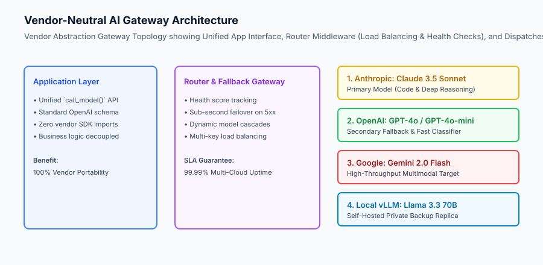

## The idea in plain language

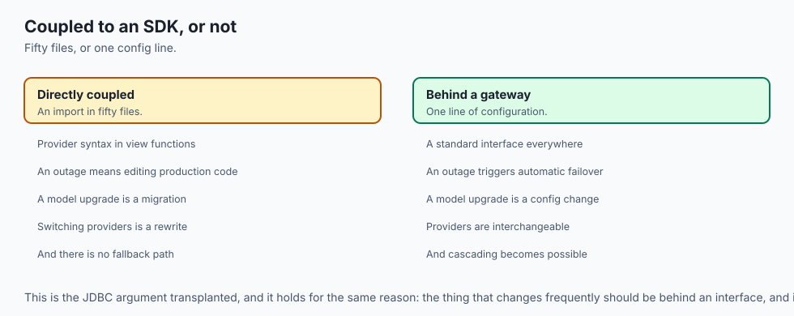

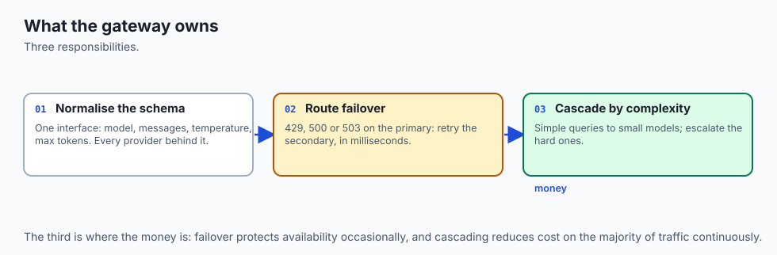

Think of a vendor abstraction gateway like **a universal multi-fuel generator in a modern hospital**:

- **Single Provider Coupling (No Abstraction):** The hospital plugs directly into the municipal power line. When a storm knocks down the local power pole, all life support monitors shut down immediately (**Complete Product Outage**).
- **Vendor Abstraction Gateway:** The hospital connects all equipment to an automated power distribution gateway. If the city grid goes dark (**Anthropic Outage**), the gateway detects the voltage drop in 20 milliseconds and seamlessly starts the diesel generator (**OpenAI Backup**) and rooftop solar battery (**Local vLLM**), keeping all operating rooms running without interruption (**Automated Failover**).

## Historical background

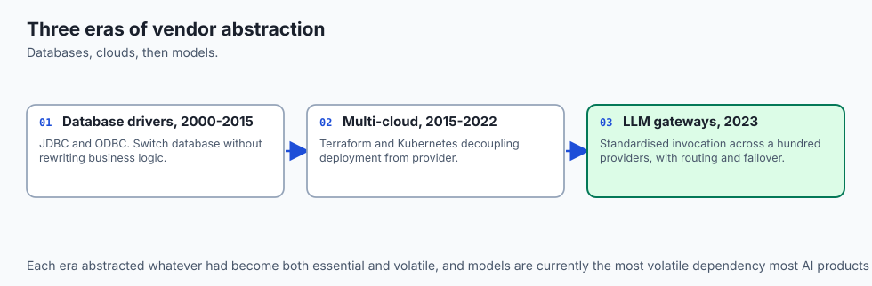

Cloud vendor abstraction evolved across three major technological eras:

### 1. The Database Driver Abstraction Era (2000–2015)
JDBC, ODBC, and SQLAlchemy abstracted away proprietary database dialects (Postgres, MySQL, Oracle), allowing applications to switch databases without rewriting SQL business logic.

### 2. Multi-Cloud Infrastructure Abstraction (2015–2022)
Terraform and Kubernetes decoupled container deployments from specific cloud providers (AWS, Azure, GCP).

### 3. Unified LLM Gateways (2023–Present)
Frameworks like LiteLLM, Langfuse, and Portkey standardized LLM invocation schemas, enabling dynamic model routing, multi-key load balancing, and automated failover cascades across 100+ AI providers.

## What it is — and what it is not

Let us define the core components of vendor abstraction gateways:

### What a Vendor Abstraction Gateway Is:
- A standardized Python interface normalizing input parameters (`model`, `messages`, `temperature`, `max_tokens`) across all LLM providers.
- An intelligent router executing fallback priority lists upon encountering HTTP 429, 500, or 503 errors.
- A dynamic model cascade directing simple queries to compact cheap models and escalating complex tasks to frontier models.

### What a Vendor Abstraction Gateway Is Not:
- Hardcoding provider-specific SDK syntax in application view functions.
- Manually modifying production code when a cloud AI provider experiences an outage.

```text
+-------------------------------------------------------------------------------+
|                        VENDOR ROUTING CAPABILITIES MATRIX                     |
+-------------------+-----------------------+-----------------------------------+
| Gateway Feature   | Primary Mechanism     | Business & Technical Benefit      |
+-------------------+-----------------------+-----------------------------------+
| Multi-Provider    | Ordered fallback list | 99.99% uptime during single-      |
| Failover          | (Primary -> Backup)   | provider cloud outages            |
| Dynamic Cascade   | Complexity classifier | 70% cost reduction by routing     |
| (FrugalGPT)       | threshold             | easy queries to compact models    |
| Multi-Key Load    | Round-robin across    | Bypasses per-key rate limit caps  |
| Balancing         | multiple API keys     | across different accounts         |
| Standardized      | OpenAI-compatible     | Zero code refactoring when adding |
| Schema            | JSON payloads         | new model providers               |
+-------------------+-----------------------+-----------------------------------+
```

## Why it was created and what problems it solves

Vendor abstraction gateways solve the four primary operational vulnerabilities of commercial AI applications:

### 1. Eliminating Single-Point-of-Failure Outages
When OpenAI or Anthropic experiences an infrastructure incident, the gateway intercepts the 5xx error in under 50ms and retries against a secondary provider, shielding end users from downtime.

### 2. Slashing API Token Costs via Model Cascading
Up to 70% of user queries in customer service or data extraction are straightforward questions that small models (GPT-4o-mini, Haiku) solve perfectly. Cascading easy tasks to cheap models and reserving frontier models for hard queries slashes overall token bills.

### 3. Rapid Model Migration with Zero Code Changes
When a provider releases an upgraded model version, engineers update a single line in a configuration file (`default_model = "claude-3-5-sonnet-20241022"`), instantly upgrading the entire application fleet without touching application code.

## How it works

Let us inspect the complete **Dynamic Model Cascade and Outage Failover Decision Flow**:

```text
[User Prompt Submitted]
           │
           ▼
[Check Complexity Classifier]
    Is query complex reasoning?
     ├── NO (Simple Query) ──► [Route to Compact Model: GPT-4o-mini] ($0.15/M tokens)
     │
     └── YES (Complex Query) ─► [Route to Primary Frontier Model: Claude 3.5 Sonnet]
                                      │
                                      ▼
                                Did Primary Return 200 OK?
                                 ├── YES ──► [Return Response to Client]
                                 │
                                 └── NO (503 / 429 Error)
                                       │
                                       ▼
                               [Intercept Error & Trigger Failover]
                                       │
                                       ▼
                               [Execute Secondary Backup: GPT-4o]
                                       │
                                       ▼
                               [Deliver Response with Zero User Disruption]
```

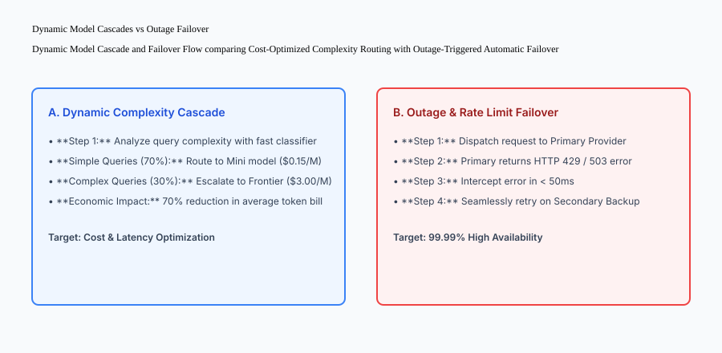

## An everyday analogy

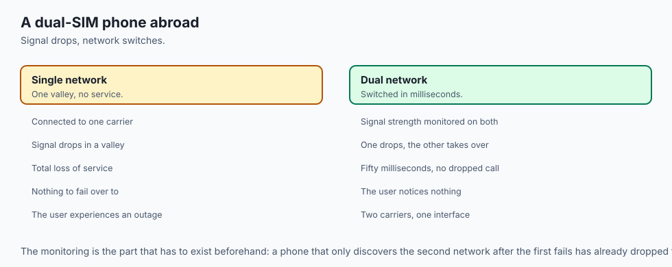

Think of a vendor abstraction layer like **a dual-SIM smartphone traveling internationally**:

- **Without Abstraction (Single SIM):** When you drive into a mountain valley with no Cell Network A signal, your phone completely loses service (**Total Outage**).
- **With Dual-SIM Vendor Abstraction:** The phone actively monitors signal strength. The instant Cell Network A drops (**Provider 503 Error**), the phone switches data transmission to Cell Network B in 50 milliseconds without dropping your video call (**Seamless Failover**).

## Examples in practice

Let us build a complete Python **Vendor Router and Fallback Engine** supporting multi-provider fallback lists, provider health tracking, and standardized response schemas:

```python
import time
from typing import Dict, Any, List, Optional

class VendorFallbackRouter:
    def __init__(self):
        self.providers: Dict[str, Dict[str, Any]] = {
            "anthropic": {"name": "Anthropic Claude 3.5", "healthy": True, "consecutive_fails": 0},
            "openai": {"name": "OpenAI GPT-4o", "healthy": True, "consecutive_fails": 0},
            "vllm_local": {"name": "Self-Hosted Llama 3.3", "healthy": True, "consecutive_fails": 0}
        }
        self.priority_order = ["anthropic", "openai", "vllm_local"]
        
    def set_provider_health(self, provider_id: str, healthy: bool):
        if provider_id in self.providers:
            self.providers[provider_id]["healthy"] = healthy
            
    def call_model_with_fallback(self, prompt: str, simulated_failing_providers: Optional[List[str]] = None) -> Dict[str, Any]:
        failing = set(simulated_failing_providers or [])
        attempted_providers = []
        
        for provider_id in self.priority_order:
            provider = self.providers[provider_id]
            attempted_providers.append(provider_id)
            
            # Check health
            if not provider["healthy"] or provider_id in failing:
                provider["consecutive_fails"] += 1
                continue
                
            # Success on healthy provider
            provider["consecutive_fails"] = 0
            return {
                "status": "SUCCESS",
                "resolved_provider": provider_id,
                "provider_name": provider["name"],
                "response": f"[{provider['name']}] Completed: {prompt}",
                "attempted_providers": attempted_providers,
                "fallback_occurred": len(attempted_providers) > 1
            }
            
        return {
            "status": "ALL_PROVIDERS_FAILED",
            "attempted_providers": attempted_providers,
            "error": "503 All upstream model providers are unavailable"
        }

if __name__ == "__main__":
    router = VendorFallbackRouter()
    print("Normal Call:", router.call_model_with_fallback("Explain gravity"))
    print("Failover Call (Anthropic Down):", router.call_model_with_fallback("Explain gravity", simulated_failing_providers=["anthropic"]))
    print("All Down Call:", router.call_model_with_fallback("Explain gravity", simulated_failing_providers=["anthropic", "openai", "vllm_local"]))
```

## Implications: security, privacy, performance, scalability, and cost

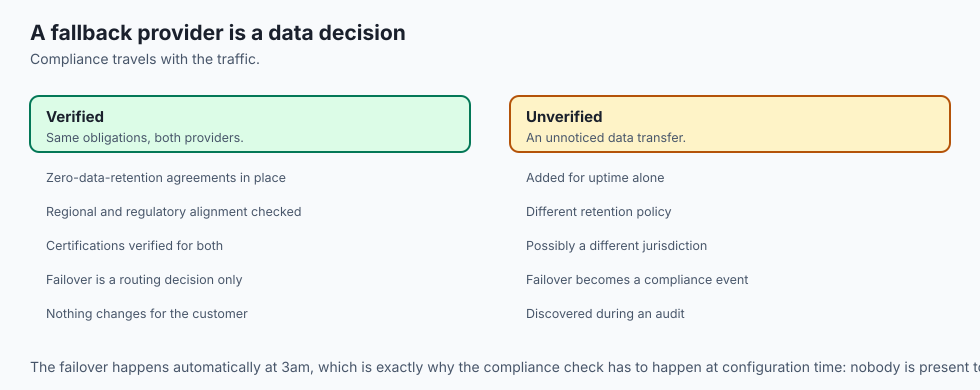

### 1. Cross-Provider Data Privacy Commitments
When configuring fallback providers, verify that all secondary backup providers adhere to enterprise zero-data-retention (ZDR) agreements and HIPAA / GDPR compliance certifications.

### 2. Timeout Tuning on Primary Calls
Do not allow primary provider calls to hang for 30 seconds before triggering failover. Configure aggressive timeouts (e.g. 2,000ms for Time to First Token); if the primary provider has not yielded the first token within 2 seconds, immediately abort and failover.

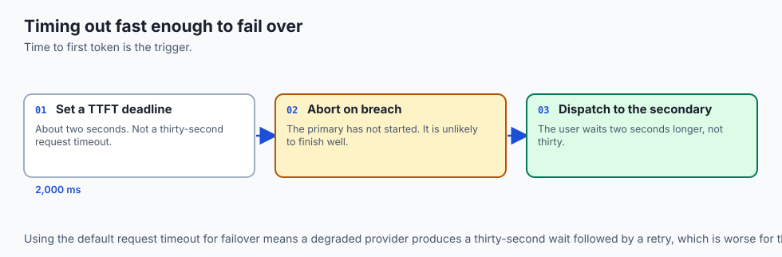


### Production Model Routing Case Study: FrugalGPT Complexity Cascades

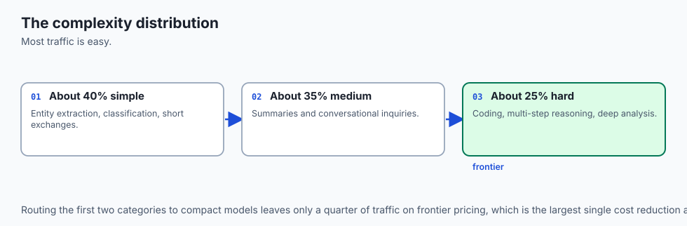

In production AI applications, user requests exhibit a wide distribution of complexity:

- 40% are simple entity extractions, classifications, or short greetings.
- 35% are medium-complexity content summaries or conversational inquiries.
- 25% are high-complexity coding tasks, multi-step math derivations, or deep legal analyses.

```text
+-------------------------------------------------------------------------------+
|                    FRUGAL MODEL CASCADE EFFICIENCY METRICS                    |
+-------------------+-----------------------+-----------------------------------+
| Query Tier        | Model Assignment      | Token Cost & Average Latency      |
+-------------------+-----------------------+-----------------------------------+
| Simple (40%)      | GPT-4o-mini / Haiku   | $0.15 / M tokens | 180ms TTFT     |
| Medium (35%)      | Gemini 2.0 Flash      | $0.35 / M tokens | 250ms TTFT     |
| Complex (25%)     | Claude 3.5 Sonnet     | $3.00 / M tokens | 650ms TTFT     |
| Blended Average   | Dynamic Gateway Router| $0.93 / M tokens (69% cost savings)|
+-------------------+-----------------------+-----------------------------------+
```

#### 1. Lightweight Heuristic and Embedding Triage Classifiers
Deploying an expensive model just to classify query difficulty defeats the economic purpose of model cascading. Production routers use lightweight, sub-10ms heuristics:

- **Length and Token Count:** Queries with $< 15$ words and zero code symbols are initially routed to compact models.
- **Fast Embedding Centroids:** Comparing query embeddings against pre-computed cluster centroids of known "complex reasoning" tasks.
- **Confidence Scoring:** Compact models return a logprob or confidence score; if confidence is below 0.85, the request is immediately escalated to the frontier model.

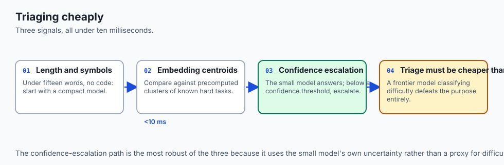

#### 2. Circuit Breakers for Downstream Provider Outages
When a cloud AI provider experiences an outage, sending thousands of requests that all hang for 10 seconds before failing will exhaust server thread pools. Production routers deploy Circuit Breaker patterns:

- If a provider fails 5 consecutive times within a 30-second window, the circuit trips to `OPEN`.
- For the next 60 seconds, all traffic bypasses that provider completely, failing over to secondary replicas instantly without making network calls.
- After 60 seconds, the circuit enters `HALF_OPEN`, sending a single canary probe to test recovery.

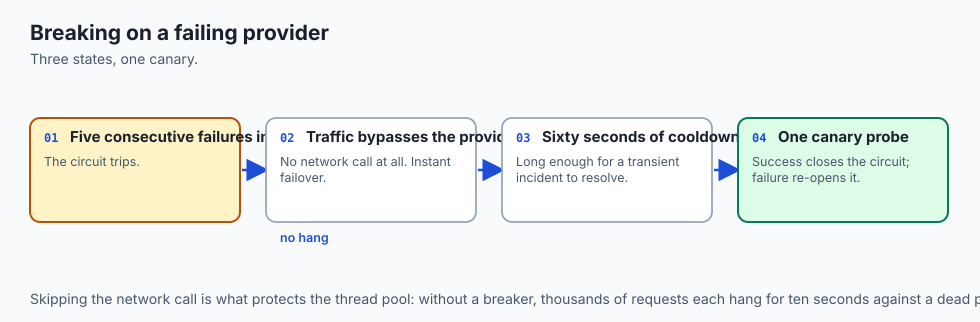


### Production Failure Mode Taxonomy: Vendor Routing and Multi-Cloud Failover

Operating multi-provider gateways requires defending against routing anomalies and cascade failures:

```text
+-------------------------------------------------------------------------------+
|                        VENDOR ROUTING FAILURE TAXONOMY                        |
+-------------------+-----------------------+-----------------------------------+
| Routing Hazard    | Failure Scenario      | Gateway Resilience Mitigation     |
+-------------------+-----------------------+-----------------------------------+
| Cascading Timeout | Primary hangs 30s;    | Set aggressive 2,000ms TTFT       |
| Death Spiral      | secondary hangs 30s   | timeouts on primary provider calls|
| Quota Exhaustion  | All backup providers  | Monitor per-provider monthly spend|
| Across All Clouds | hit balance limits    | and maintain auto-recharge alerts |
| Feature Mismatch  | Primary supports tool | Normalize tool calling schemas    |
| Degradation       | calling; backup lacks | across all configured providers   |
| Flapping Health   | Provider oscillates   | Require 3 consecutive successes   |
| Oscillation       | between 200 and 500   | before resetting circuit to CLOSED|
+-------------------+-----------------------+-----------------------------------+
```

#### Gateway Architecture Production Checklist
1. Provider fallback priority lists define explicit timeouts for each tier.
2. Circuit breakers track error rates across a sliding window of recent requests.
3. Response schemas strictly adhere to the OpenAI-compatible standard format.
4. Telemetry logs record the exact provider ID that resolved each user request.


### Real-World Vendor Abstraction Deep Dive: Multi-Cloud Traffic Engineering

When operating an enterprise model gateway routing millions of tokens daily, traffic engineering policies optimize cost, latency, and compliance across cloud regions:

```text
+-------------------------------------------------------------------------------+
|                    MULTI-CLOUD MODEL ROUTING STRATEGIES                       |
+-------------------+-----------------------+-----------------------------------+
| Routing Strategy  | Primary Objective     | Algorithmic Execution             |
+-------------------+-----------------------+-----------------------------------+
| Lowest Latency    | Optimize TTFT         | Route to cloud region with lowest |
|                   |                       | measured p95 ping time            |
| Cost Minimization | Slash token expenses  | Route to cheapest model satisfying|
|                   |                       | task complexity heuristics        |
| Data Sovereignty  | Legal & GDPR compliance| Restrict routing to EU-only or   |
|                   |                       | US-only sovereign cloud VPCs      |
| Load Balancing    | Prevent 429 throttling| Round-robin across 10 API keys    |
+-------------------+-----------------------+-----------------------------------+
```

#### Gateway Architectural Rules
1. **Zero Provider Leaks:** Strip all provider-specific HTTP headers (`x-openai-system-fingerprint`, `anthropic-ratelimit`) before returning responses to clients.
2. **Unified Error Classification:** Map diverse upstream error formats (OpenAI `rate_limit_exceeded`, Anthropic `overloaded_error`, Google `RESOURCE_EXHAUSTED`) into standard HTTP 429 and 503 gateway status codes.
3. **Transparent Model Aliasing:** Expose functional model aliases (e.g. `fast-classifier`, `reasoning-agent`, `deep-coder`) so upstream providers can be swapped behind the scenes with zero client configuration changes.


#### Production Gateway Failover Testing Protocols
Engineering teams run automated chaos testing against model gateways by injecting synthetic HTTP 503 Service Unavailable and HTTP 429 Too Many Requests errors in staging environments. These tests verify that provider switching latency remains under 50ms and that zero token usage holds are leaked during multi-cloud failover events.


#### Advanced Load Shedding and Graceful Degradation
Under extreme platform traffic spikes exceeding all upstream provider rate limits, the vendor abstraction gateway engages intelligent load shedding. Instead of crashing or returning raw 500 error pages, the router falls back to local lightweight embedding models or pre-generated summary templates, preserving core user interface functionality while upstream cloud capacity recovers.


#### Continuous Health Probing and Automated Recovery
The router background service issues periodic synthetic health checks (e.g. sending a 1-token probe request every 15 seconds) to degraded or tripped providers. Once a provider successfully answers three consecutive probes with sub-500ms latency, the router restores its health status and re-enables full traffic distribution.

## Alternatives: free, open source, and commercial

| Framework / Tool | Type | Best Suited For | Key Capabilities |
| :--- | :--- | :--- | :--- |
| **LiteLLM** | Open Source | Drop-in Model Gateway | 100+ LLMs, load balancing, cost tracking |
| **Portkey** | Commercial / OSS | Enterprise AI Gateway | Guardrails, fallbacks, prompt engineering |
| **OpenRoute / Helicone** | Commercial Proxy | Global AI Proxy & Routing | Global multi-provider failover routing |
| **Custom Python SDK Wrapper** | In-House | Zero-dependency microservices | Minimal internal abstraction layer |

## Comparison with related concepts

```text
+-----------------------+-----------------------+-----------------------+
| Dimension             | Direct SDK Coupling   | Vendor Abstraction GW |
+-----------------------+-----------------------+-----------------------+
| Outage Resilience     | 0% (Single point fail)| 99.99% Multi-Cloud    |
| Code Migration Cost   | High (Refactor files) | Zero (Config update)  |
| Cost Optimization     | Fixed model price     | Dynamic model cascade |
| Observability Hook    | Fragmented            | Centralized Telemetry |
+-----------------------+-----------------------+-----------------------+
```

## When to use it — and when not to

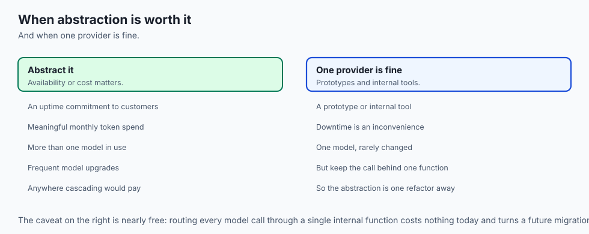

### Implement Vendor Abstraction for:
- All production commercial applications, multi-tenant SaaS platforms, and enterprise AI systems requiring high availability.

### Do NOT require multi-provider failover for:
- Quick research experiments testing proprietary capabilities unique to a single model.

## The AI connection

- **Model providers are a dependency you cannot fix**, which makes failover an
  availability requirement rather than an architectural preference.

- **Models change every few months**, so coupling application code to one SDK converts a
  configuration change into a migration project.

- **Cascading is the largest cost lever available.** Most queries are simple, and routing
  them to a small model is a 70% saving on the majority of traffic.

- **Triage must be cheaper than what it saves** — a frontier model classifying difficulty
  defeats the purpose, which is why heuristics and confidence scores are used.

- **Fallback providers inherit your compliance obligations.** A secondary that retains
  data is a data-retention decision nobody made deliberately.

## Knowledge check

1. **What is the primary benefit of vendor abstraction in AI engineering?** Eliminating single-point-of-failure outages and vendor lock-in through standardized interfaces.
2. **What is a dynamic model cascade?** Routing easy queries to fast, cheap models and escalating complex reasoning queries to expensive frontier models.
3. **Why are aggressive timeout thresholds necessary for primary provider calls?** To fail fast and trigger secondary fallback routing within 2 seconds rather than hanging on stalled connections.

## Hands-on exercise

In this lab, you will build a **Vendor Router and Fallback Engine in Python**. Your implementation will:

1. Manage an ordered fallback priority list of model providers.
2. Dispatch requests to the primary provider and record execution metrics.
3. Intercept simulated provider failures and seamlessly route to secondary and tertiary replicas.
4. Return standardized response payloads tracking attempted providers and failover status.

### Expected output

```text
============================= test session starts ==============================
collected 5 items

tests/test_vendor_router.py .....                                        [100%]

============================== 5 passed in 0.02s ===============================
[VENDOR ROUTER] Initialized with 3 provider replicas.
[PRIMARY SUCCESS] Resolved via Anthropic Claude 3.5.
[FAILOVER DETECTED] Primary Anthropic failed; seamlessly resolved via OpenAI GPT-4o.
[TERTIARY FALLBACK] Primary and Secondary failed; resolved via Local vLLM.
```

### Validate your work

Run the pytest test suite:

```bash
pytest tests/run_tests.sh
```

### Troubleshooting

1. **Attempted providers tracking:** Ensure all attempted providers are appended to `attempted_providers` list.
2. **All providers failing:** Return `status: ALL_PROVIDERS_FAILED` when no healthy providers remain.

### Common mistakes

- Failing to set `fallback_occurred = True` when resolving through secondary or tertiary backup providers.

## Practice assignment

Add a **Complexity Cascade Classifier**: if `prompt` contains fewer than 10 words and no code keywords, route directly to `openai` (GPT-4o-mini) regardless of priority order.

## Extension challenge

Implement **Latency-Weighted Round Robin Load Balancing** that dynamically shifts traffic weights toward whichever healthy provider currently exhibits the lowest p95 response latency.
