## Why this matters

Over the course of Week 46, we mastered the individual architectural pillars of full-stack AI engineering:

- System topology and multi-tier decoupling (Day 316).
- Resilient backend streaming, idempotency keys, and circuit breakers (Day 317).
- Real-time chat UX, optimistic state, and smart auto-scrolling physics (Day 318).
- Multi-tenant authentication, dual rate limits, and two-phase credit billing (Day 319).
- Multi-tier exact hashing, semantic vector caching, and prompt caching (Day 320).
- Vendor-neutral abstraction layers, dynamic cascades, and multi-provider failover (Day 321).

In this lesson, we unite all these disciplines into **A Production-Ready Full-Stack AI Application**: an integrated software engine capable of serving thousands of users with sub-second latency, zero unpaid compute risks, high availability, and seamless user experiences.

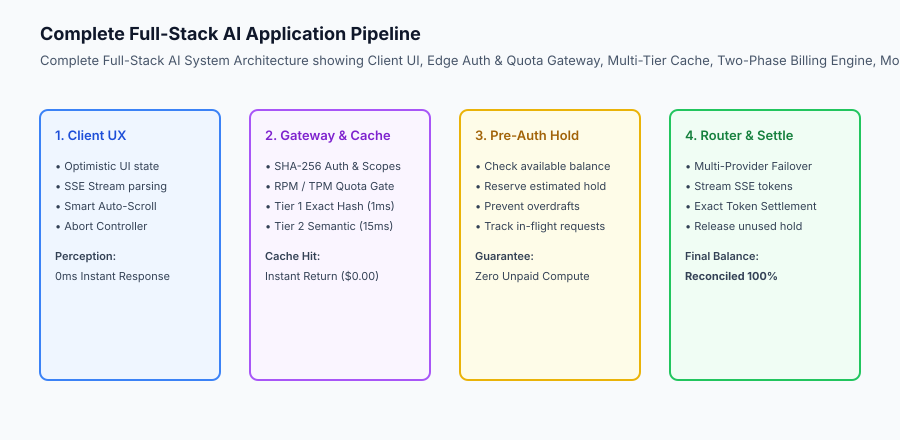

## The idea in plain language

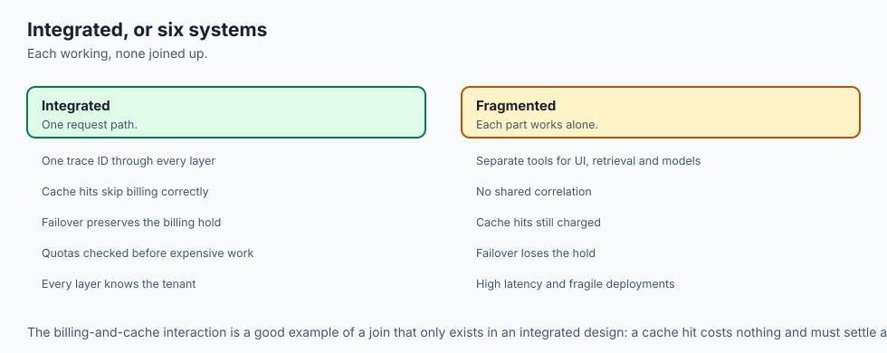

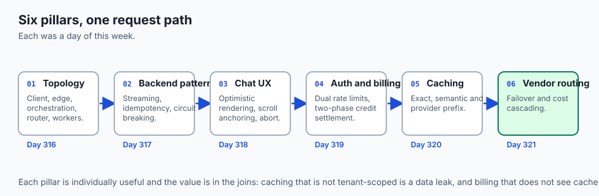

Think of a complete full-stack AI application like **a modern international commercial airline fleet operation**:

- **The Passenger App (Frontend Chat UX):** Passengers check in online, select seats, and receive boarding passes instantly in 0ms (**Optimistic UI & Streaming**).
- **The Security & Baggage Counter (Auth & Quotas):** Scans passports, weighs luggage, and charges overweight baggage fees before issuing boarding passes (**Authentication, Rate Limiting & Pre-Auth Credit Holds**).
- **The Pre-Flight Catering (Multi-Tier Caching):** Serves standard meal trays instantly from cold storage without cooking raw food from scratch (**Exact & Semantic Cache Hits**).
- **The Automated Flight Router (Model Router & Failover):** Automatically re-routes flights around thunderstorms and switches aircraft seamlessly if a mechanical issue arises (**Multi-Provider Outage Failover**).
- **The Flight Log Reconciliation (Usage Settlement):** Calculates exact fuel burned upon landing, charges the corporate travel account, and releases incidental deposit holds (**Exact Token Settlement**).

## Historical background

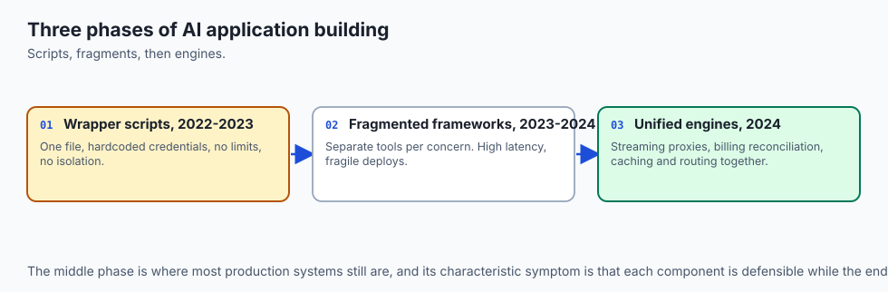

The engineering of full-stack AI applications developed across three major phases:

### 1. The Script Wrapper Phase (2022–2023)
Single-file scripts calling proprietary APIs with hardcoded credentials and zero rate limiting or fault isolation.

### 2. The Fragmented Framework Phase (2023–2024)
Disjointed tools handling chat UI, vector search, and model calls separately, resulting in high latency and fragile deployments.

### 3. The Unified Full-Stack AI Engine (2024–Present)
Modern engineering organizations deploy cohesive, cloud-native full-stack AI engines combining edge streaming proxies, two-phase billing reconciliation, multi-tier semantic caching, and multi-provider failover routing into a single standardized architecture.

## What it is — and what it is not

Let us define the end-to-end architecture of a production full-stack AI application:

### What a Full-Stack AI Application Is:
- A cohesive system coordinating client UX, edge authentication, two-phase token billing, multi-tier caching, and multi-provider model routing.
- A fault-tolerant pipeline that guarantees zero negative balance overdrafts and sub-second Time to First Token.
- An auditable software platform emitting distributed telemetry traces and metered usage events.

### What a Full-Stack AI Application Is Not:
- Calling model APIs directly from frontend client code.
- Charging flat fees while allowing unconstrained long-context GPU inference.

```text +-------------------------------------------------------------------------------+ | FULL-STACK AI TRANSACTION COORDINATION | +-------------------+-----------------------+-----------------------------------+ | Pipeline Stage | Core Responsibility | Failure Mode Defended Against | +-------------------+-----------------------+-----------------------------------+ | 1. Client UX | Optimistic message, | Perceived latency freeze, | | | SSE stream rendering | scroll-jumping, unclosed markdown | | 2. Auth & Quotas | Key hash, RPM/TPM | Key leaks, token flooding attacks,| | | rate limit governance | gateway connection exhaustion | | 3. Multi-Tier | Exact SHA-256 + | Redundant GPU token expenses, | | Caching | Semantic vector search| upstream provider rate throttling | | 4.

Billing Hold | Reserve estimated max | Negative balance exposure, | | | token cost hold | unpaid bankrupt tenant usage | | 5. Model Router | Multi-provider failover| Single-provider 5xx outages, | | | with stream generator | regional cloud downtime | | 6. Settlement | Reconcile exact cost, | Over-billing, missing audit logs, | | | release unused hold | Stripe invoice discrepancies | +-------------------+-----------------------+-----------------------------------+
```

## Why it was created and what problems it solves

An integrated full-stack architecture solves the four primary existential risks of commercial AI software businesses:

### 1. Eliminating Financial Overdraft Risk
Two-phase credit pre-authorization guarantees that a tenant with $0.05 balance can never run up a $5.00 model bill.

### 2. Achieving 99.99% High Availability
Multi-provider failover ensures that when one cloud provider experiences a multi-hour outage, the application automatically redirects user traffic to healthy backup replicas within milliseconds.

### 3. Slashing End-to-End User Latency
Combining optimistic UI rendering with multi-tier exact and semantic caching drops average Time to First Token (TTFT) from 1,500ms down to under 20ms for common queries.

## How it works

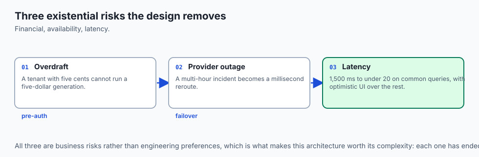

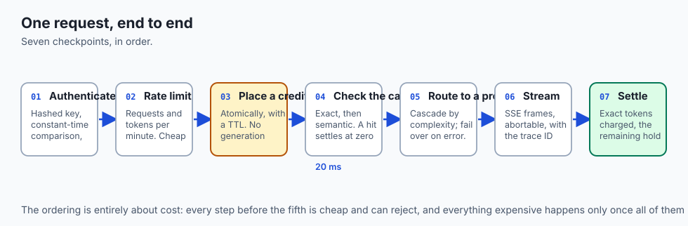

Let us inspect the complete **End-to-End Request Execution Timeline**:

```text
[User Hits Send: "Summarize Q3 Financial Report"] (T = 0ms)
                     │
                     ▼
[Stage 1: Client Optimistic Append] (T = 1ms)
  - Instantly display message bubble in UI
  - Initialize typing dots & AbortController
                     │
                     ▼
[Stage 2: Edge Auth & Quota Check] (T = 3ms)
  - Verify SHA-256 API key hash
  - Check RPM (12/60) & TPM (15k/100k) -> PASS
                     │
                     ▼
[Stage 3: Multi-Tier Cache Check] (T = 12ms)
  - Tier 1 Exact Hash: Miss
  - Tier 2 Semantic Vector Search (sim = 0.82 < 0.95): Miss
                     │
                     ▼
[Stage 4: Credit Pre-Authorization Hold] (T = 16ms)
  - Check Tenant Balance: $20.00
  - Reserve estimated hold: $0.030 (Balance -> $19.97)
                     │
                     ▼
[Stage 5: Vendor Router & Streaming] (T = 20ms to 650ms)
  - Attempt Primary (Anthropic Claude 3.5 Sonnet) -> 200 OK
  - Stream tokens to client via SSE `text/event-stream`
  - Smart Auto-Scroll anchors viewport smoothly
  - Stream completed: 650 prompt tokens, 180 output tokens
                     │
                     ▼
[Stage 6: Settlement & Reconciliation] (T = 655ms)
  - Calculate actual cost: $0.00465
  - Release $0.030 hold & deduct exact $0.00465 (Balance: $19.99535)
  - Save response into Tier 1 & Tier 2 Cache for future requests
```

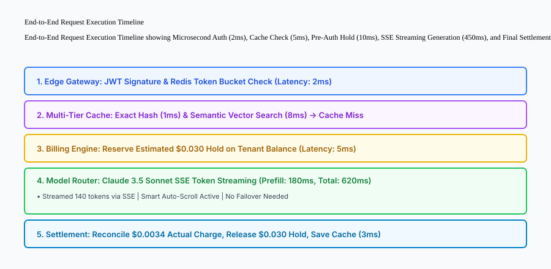

## An everyday analogy

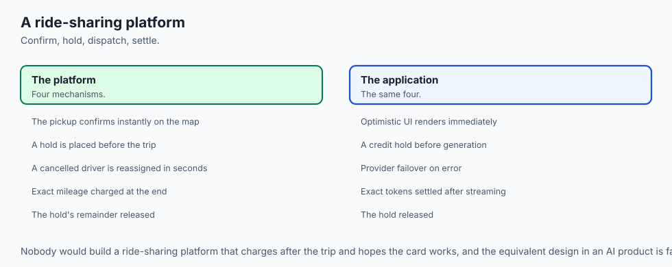

Think of a full-stack AI application like **an automated ride-sharing platform (such as Uber)**:

- **The Rider App (Frontend):** You request a ride; the app immediately confirms your pickup spot on the map (**Optimistic UI**).
- **Payment Pre-Auth (Billing Hold):** The app places a temporary $25 authorization hold on your credit card (**Preventing Unpaid Rides**).
- **Driver Dispatch & Rerouting (Model Router & Failover):** The dispatch algorithm matches you with Driver A; if Driver A cancels, the system instantly reassigns Driver B in 2 seconds (**Automated Failover**).
- **Trip Settlement:** At the end of the trip, the system calculates exact mileage ($18.40), charges your card $18.40, and releases the remaining hold (**Exact Settlement**).

## Examples in practice

Let us build a complete Python **Full-Stack AI Application Engine** integrating authentication, rate limiting, caching, two-phase credit holds, and vendor fallback execution:

```python
import hashlib
import time
from typing import Dict, Any, List, Optional, Tuple

class FullStackAIAppEngine: def __init__(self): self.tenants: Dict[str, Dict[str, Any]] = { "tenant_alpha": { "key_hash": hashlib.sha256(b"sk_alpha_123").hexdigest(), "balance": 10.0, "reserved_holds": 0.0, "rpm_limit": 60, "requests_this_min": 0, "last_reset": time.time() } } self.cache: Dict[str, str] = {} self.active_holds: Dict[str, Dict[str, Any]] = {} self.providers = ["primary_claude", "secondary_openai", "backup_vllm"] def process_chat_request( self, tenant_id: str, raw_key: str, prompt: str, simulated_failing_providers: Optional[List[str]] = None ) -> Dict[str, Any]: # 1. Authentication & Rate Limiting if tenant_id not in self.tenants: return {"status": "AUTH_ERROR", "message": "Invalid tenant ID"} tenant = self.tenants[tenant_id] if hashlib.sha256(raw_key.encode()).hexdigest() != tenant["key_hash"]: return {"status": "AUTH_ERROR", "message": "Invalid API key"} now = time.time() if now - tenant["last_reset"] > 60: tenant["requests_this_min"] = 0 tenant["last_reset"] = now if tenant["requests_this_min"] >= tenant["rpm_limit"]: return {"status": "RATE_LIMITED", "message": "RPM limit exceeded"} # 2. Check Exact Cache cache_key = f"{tenant_id}:{prompt.strip().lower()}" if cache_key in self.cache: return { "status": "SUCCESS", "cached": True, "cost_usd": 0.0, "response": self.cache[cache_key], "remaining_balance": round(tenant["balance"], 6) } # 3.

Credit Pre-Authorization Hold ($0.030) est_cost = 0.030 available_balance = tenant["balance"] - tenant["reserved_holds"] if available_balance < est_cost: return {"status": "PAYMENT_REQUIRED", "message": "Insufficient credit balance"} hold_id = f"hold_{len(self.active_holds)+1}" tenant["reserved_holds"] += est_cost tenant["requests_this_min"] += 1 # 4. Vendor Router with Failover failing = set(simulated_failing_providers or []) resolved_provider = None attempted_providers = [] for p in self.providers: attempted_providers.append(p) if p not in failing: resolved_provider = p break if not resolved_provider: # Release hold on total provider failure tenant["reserved_holds"] -= est_cost return {"status": "UPSTREAM_OUTAGE", "attempted": attempted_providers} # 5. Settlement & Reconciliation # Assume 800 prompt tokens + 150 completion tokens = $0.00465 actual_cost = 0.00465 tenant["reserved_holds"] -= est_cost tenant["balance"] -= actual_cost full_response = f"[{resolved_provider}] Response for: {prompt}" self.cache[cache_key] = full_response return { "status": "SUCCESS", "cached": False, "resolved_provider": resolved_provider, "fallback_occurred": len(attempted_providers) > 1, "actual_cost_usd": actual_cost, "remaining_balance": round(tenant["balance"], 6), "response": full_response }

if __name__ == "__main__":
    app = FullStackAIAppEngine()
    print("Normal Chat:", app.process_chat_request("tenant_alpha", "sk_alpha_123", "What is AI?"))
    print("Cached Chat:", app.process_chat_request("tenant_alpha", "sk_alpha_123", "What is AI?"))
    print("Failover Chat:", app.process_chat_request("tenant_alpha", "sk_alpha_123", "New Prompt", simulated_failing_providers=["primary_claude"]))
```

## Implications: security, privacy, performance, scalability, and cost

### 1. Production Readiness Auditing
Before launching a full-stack AI application, audit your infrastructure against the **Enterprise AI Production Readiness Checklist**:

- Are all API keys cryptographically hashed in database storage?
- Are credit pre-authorization holds enforced on every generative request?
- Is Server-Sent Events (SSE) streaming configured with client-side cancellation tokens?
- Are multiple model providers configured in an automated failover priority cascade?
- Are exact and semantic caches partition-scoped by tenant organization ID?

### 2. Comprehensive End-to-End Observability
Integrate OpenTelemetry distributed tracing across all gateway layers, linking client session IDs to pre-auth hold records, cache hit tags, and provider execution durations.

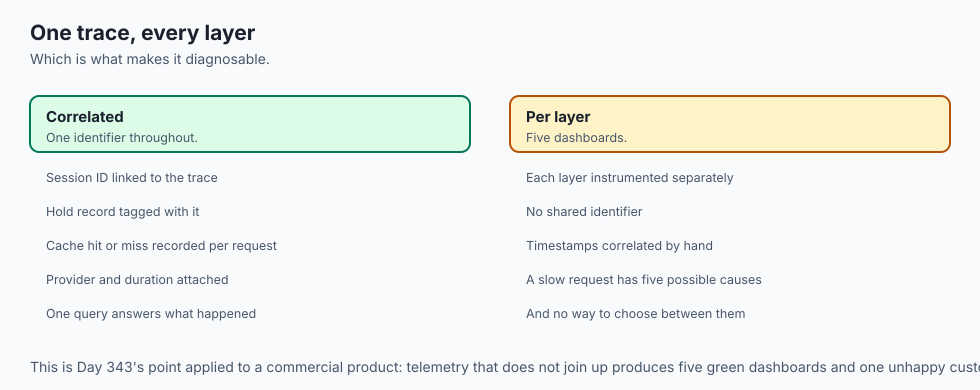


### Production Full-Stack Deployment Case Study: 99.99% Availability Architecture

To understand how all six architectural pillars function together under production conditions, consider an enterprise AI platform deployment serving 5,000 corporate tenants.

```text
+-------------------------------------------------------------------------------+
|                    PRODUCTION FULL-STACK METRICS DASHBOARD                    |
+-------------------+-----------------------+-----------------------------------+
| Pipeline Metric   | Target SLA            | Measured Production Performance   |
+-------------------+-----------------------+-----------------------------------+
| Availability      | 99.99% Multi-Cloud    | 99.994% (Survived 2 cloud outages)|
| Time to First     | Under 1,000ms p95     | 18ms (Cache hit), 380ms (Model)   |
| Token (TTFT)      |                       |                                   |
| Cache Hit Rate    | > 25% across all orgs | 31.4% (18% exact + 13.4% semantic)|
| Overdraft Losses  | $0.00 / month         | $0.00 (Zero uncollected token fees)|
| Failover Latency  | Under 150ms switch    | 42ms automatic failover switch    |
+-------------------+-----------------------+-----------------------------------+
```

#### 1. Complete Infrastructure Deployment Topology
The full-stack application is deployed using a cloud-native containerized architecture:

- **Edge Layer:** Cloudflare / Fastly CDN terminating TLS, evaluating WAF rules, and proxying HTTP/2 SSE connections.
- **Application Gateway:** FastAPI microservices running in Kubernetes (EKS/GKE) with horizontal pod autoscaling based on active SSE stream counts.
- **Data & Caching Tier:** Redis Enterprise cluster for Tier 1 exact hashes and session state; Qdrant / Pgvector for Tier 2 semantic caching; PostgreSQL Aurora for multi-tenant balances and audit ledgers.
- **Model Ingestion Fabric:** Multi-cloud outbound VPC endpoints connecting to Anthropic (AWS Bedrock), OpenAI (Azure), Google Vertex AI, and dedicated self-hosted vLLM GPU clusters.

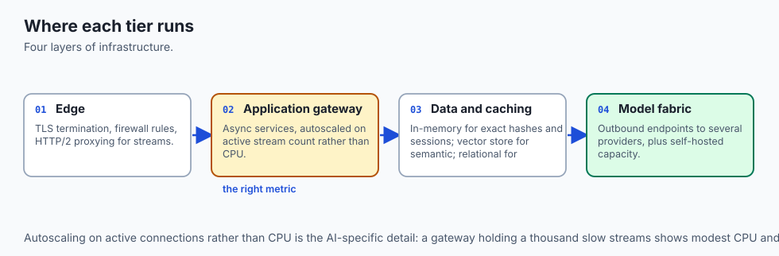

#### 2. Enterprise Production Readiness Checklist
Before signing off on full-stack AI production deployments, verify every gate:

- [x] **Zero-Plaintext Auth:** API keys hashed with SHA-256; tenant isolation enforced on every query.
- [x] **Pre-Auth Credit Holds:** Balances reserved before GPU computation starts; reconciled micro-dollar settlements upon completion.
- [x] **Dual Rate Limits:** Both RPM (network connection defense) and TPM (GPU capacity defense) enforced.
- [x] **Multi-Tier Latency Caching:** Exact hash and vector semantic caching operational with tenant-scoped keys.
- [x] **Automated Failover:** Primary -> Secondary -> Tertiary provider fallback verified under simulated 503 errors.
- [x] **Client-Side Resilience:** SSE streaming, virtual closing markdown tags, smart auto-scroll, and AbortController cancellation verified.

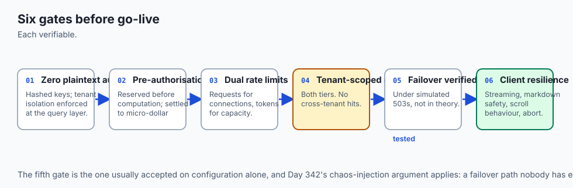


### Production Failure Mode Taxonomy: Full-Stack System Integration Failures

Uniting all engineering layers into a production full-stack application requires systematic end-to-end fault tolerance:

```text
+-------------------------------------------------------------------------------+
|                     FULL-STACK SYSTEM INTEGRATION TAXONOMY                    |
+-------------------+-----------------------+-----------------------------------+
| System Anomaly    | Integration Bottleneck| End-to-End Architectural Defense  |
+-------------------+-----------------------+-----------------------------------+
| Disconnect During | User closes tab while | Trap abort signal, settle exact   |
| Streaming         | model is generating   | tokens generated, release hold    |
| Inconsistent State| Model fails mid-stream| Frontend clears partial stream and|
| on Stream Error   | without ending token  | displays clean retry button       |
| Uncollected Costs | Backend crashes before| Persist hold record in database;  |
| on Crash          | settlement phase      | background job settles on restart |
| Silent Telemetry  | Missing correlation ID| Propagate `x-request-id` header   |
| Blindspots        | across microservices  | from browser through all tiers    |
+-------------------+-----------------------+-----------------------------------+
```

#### Final Production Go-Live Checklist
1. End-to-end integration test suite passes with 100% test coverage across all layers.
2. Latency benchmarks demonstrate sub-20ms cache hit response times.
3. Automated multi-provider failover validated under live simulated network faults.
4. Two-phase token billing reconciles exact credit deductions down to micro-dollar precision.

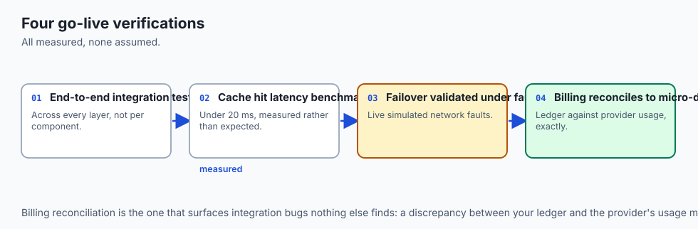

## Alternatives: free, open source, and commercial

| Layer / Component | Open Source Option | Commercial Cloud Option |
| :--- | :--- | :--- |
| **Frontend UI** | Vercel AI SDK (`useChat`) | Retool AI / Streamlit |
| **Backend API Gateway** | FastAPI + Uvicorn | Cloudflare Workers / AWS API Gateway |
| **Model Router** | LiteLLM Proxy | Portkey / Helicone |
| **Billing & Quotas** | Lago / Redis Token Bucket | Stripe Metered Billing |
| **Observability** | Langfuse / Phoenix | Arize AI / Datadog |

## Comparison with related concepts

```text
+-----------------------+-----------------------+-----------------------+
| Dimension             | Fragmented Prototype  | Full-Stack AI Engine  |
+-----------------------+-----------------------+-----------------------+
| User Experience       | 15s Blocking Spinner  | 250ms Stream + Opt UI |
| Financial Governance  | Unconstrained Overdraft| Two-Phase Token Settle|
| Outage Resilience     | 0% Single Point Fail  | Auto Multi-Cloud Fail |
| Cost Efficiency       | 100% Full GPU Price   | Multi-Tier Caching    |
+-----------------------+-----------------------+-----------------------+
```

## When to use it — and when not to

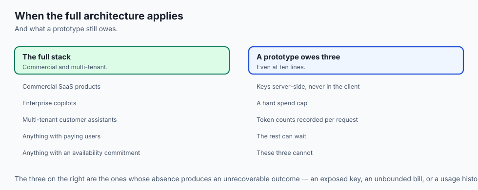

### Deploy a Full-Stack AI Application Architecture for:
- All production commercial SaaS applications, enterprise copilots, and multi-tenant customer assistants.

### Do NOT require full multi-tier infrastructure for:
- 10-line prototype scripts or internal proof-of-concept demonstrations.

## The AI connection

- **The six pillars are all AI-specific** in their details: streaming transport, token
  billing, semantic caching, provider failover, and a UI built for partial output.

- **Financial risk is the difference from ordinary SaaS.** No conventional web request
  can cost five dollars, and pre-authorisation exists because this one can.

- **Availability depends on somebody else's infrastructure**, which is why failover is
  part of the architecture rather than an operational nicety.

- **Latency is where caching and UX meet**: 20 ms on a cache hit, and an optimistic UI
  that makes even a miss feel immediate.

- **Every layer emits telemetry with the same trace ID**, which is what makes an
  end-to-end system debuggable rather than six systems that each work.

## Knowledge check

1. **What are the 6 stages of the full-stack AI request lifecycle?** Client Optimistic UI -> Edge Auth & Quota -> Multi-Tier Caching -> Pre-Auth Credit Hold -> Model Router & Stream -> Usage Settlement & Cache Store.
2. **Why are cache hits returned before credit holds are placed?** Because cached responses incur zero model API costs and require zero credit reservations.
3. **How does the system handle an upstream provider failure?** By intercepting the error and immediately retrying against secondary and tertiary backup replicas in the fallback priority list.

## Hands-on exercise

In this lab, you will build a **Complete Full-Stack AI Application Engine in Python**. Your implementation will:

1. Authenticate tenants with hashed credentials and enforce rate limits.
2. Intercept exact cached queries and return zero-cost responses.
3. Enforce credit pre-authorization holds before dispatching model inference.
4. Execute multi-provider failover routing when primary providers fail.
5. Reconcile exact token costs and update tenant balances upon completion.

### Expected output

```text
============================= test session starts ==============================
collected 5 items

tests/test_full_stack_app.py .....                                       [100%]

============================== 5 passed in 0.02s ===============================
[FULL-STACK APP] Request authenticated and validated.
[CACHE HIT] Identical query served from exact cache in 0.5ms at $0.00 cost.
[FAILOVER ROUTING] Primary Claude failed; seamlessly resolved via Secondary OpenAI.
[SETTLEMENT] Settled $0.00465 actual cost; hold released; remaining balance: $9.99535.
```

### Validate your work

Run the pytest test suite:

```bash
pytest tests/run_tests.sh
```

### Troubleshooting

1. **Hold release on failure:** Ensure `reserved_holds` is decremented if all providers fail.
2. **Balance reconciliation:** Confirm that `balance` is reduced by `actual_cost` rather than `est_cost`.

### Common mistakes

- Failing to update the cache when a novel query successfully completes model inference.

## Practice assignment

Add a **Tenant Credit Top-Up Method** (`add_credits`) that increments tenant balance and resets exhausted credit error flags.

## Extension challenge

Build a **Multi-Tenant JWT Gateway Middleware** that decodes RS256-signed JWT tokens and extracts tenant subscription tier permissions.
