## Why this matters

Every retrieval system you have built so far started with a convenient assumption: the documents were already there. You had a folder of PDFs, or a scraped corpus, or a tidy CSV, and the interesting work began at chunking. Production does not hand you that folder.

In production the corpus is a moving target. A support knowledge base gains forty articles a week and quietly edits two hundred more. A company wiki has pages deleted for legal reasons that must disappear from the index within the hour. A document store contains one file that crashes your PDF parser, and it sits in the middle of a batch of ten thousand.

The pipeline that carries data from those sources into your index is the least glamorous component in the system and the one most likely to wake you at three in the morning. When retrieval quality mysteriously drops, the cause is rarely the embedding model. It is far more often that the index is three weeks stale, or that a re-run duplicated every chunk, or that a single malformed record stopped a nightly job and nobody noticed for four days.

Today you build the machinery that makes ingestion boring: idempotent writes, resumable checkpoints, and isolated failures. Boring is the goal. An ingestion pipeline that never surprises you is worth more than a marginally better reranker.


## The idea in plain language

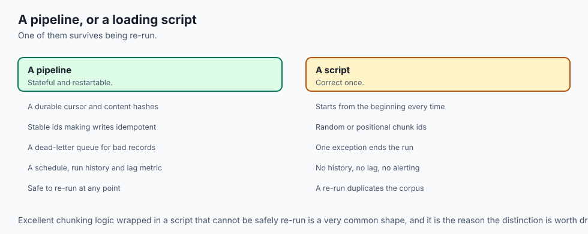

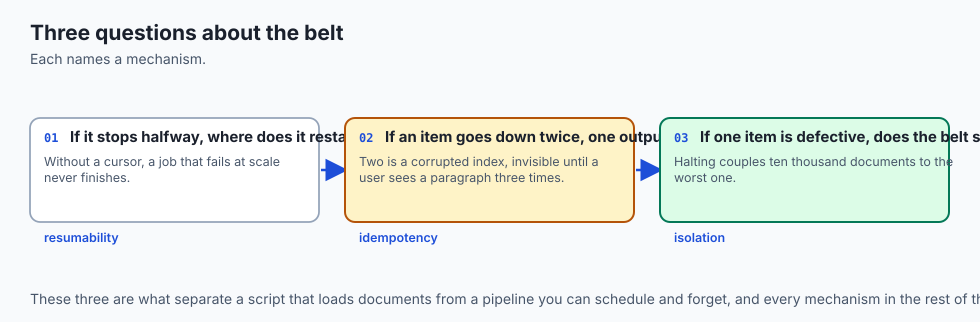

An ingestion pipeline is a conveyor belt with inspection stations. Raw material enters at one end, passes through stations that transform it, and finished goods come out the other end into your index.

Three questions decide whether the belt is production-grade:

If the belt stops halfway, where does it restart? A pipeline that must begin again from the first document every time it crashes will, at sufficient scale, never finish.

If the same item goes down the belt twice, do you get one finished good or two? A pipeline that produces two has corrupted your index, and the corruption is invisible until a user sees the same paragraph three times in one answer.

If one item is defective, does the belt stop? A pipeline that halts on the first unparseable file has coupled the fate of ten thousand documents to the worst one among them.

Those three properties — resumability, idempotency, and failure isolation — are what separates a script that loads documents from a pipeline you can schedule and forget.

## Historical background

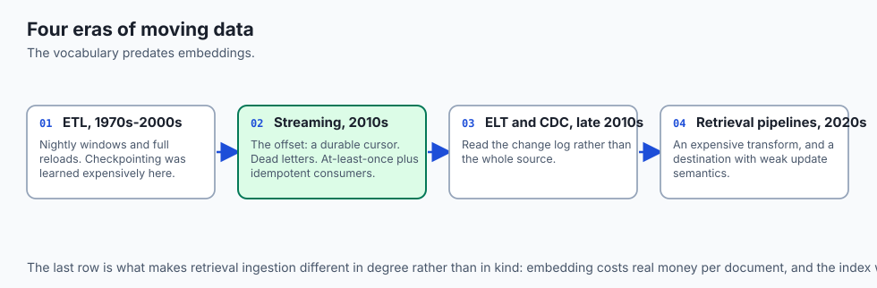

The problems here are not new, and the vocabulary was settled long before anyone embedded a document.

### The ETL era, 1970s to 2000s

Data warehousing established Extract, Transform, Load as the standard shape: pull from source systems, reshape into a common schema, write into a warehouse. Nightly batch windows, full reloads, and a great deal of operational pain around what to do when the window was missed. The lessons about checkpointing and restartability were learned expensively here.

### The streaming turn, 2010s

Apache Kafka and the log-oriented view reframed ingestion as a continuous flow rather than a nightly batch. The key contribution for our purposes was the **offset**: a durable cursor recording exactly how far a consumer has read. Kafka also popularised the dead-letter pattern for records that repeatedly fail processing, and made "at-least-once delivery plus idempotent consumers" the default reliability recipe.

### The ELT and CDC shift, late 2010s

Cheap warehouse compute inverted the order to Extract, Load, Transform, and change data capture matured: rather than re-reading a whole source, read its change log. Tools such as Debezium made incremental ingestion routine rather than bespoke.

### Retrieval pipelines, 2020s

RAG systems inherited all of it and added two wrinkles. Transformation now includes an expensive, non-deterministic-looking step — embedding — that costs real money per document. And the destination is a vector index whose update semantics are often weaker than a relational database's. Both push hard toward incremental, idempotent designs.

## What it is — and what it is not

An ingestion pipeline is the scheduled, restartable, observable process that moves source data into a retrieval index and keeps it correct as the sources change.

### What it is

It is a **stateful** process. The state is small — cursors and content hashes — but it is the thing that makes the pipeline resumable and incremental. Losing it means a full rebuild.

It is a **contract with the index**. The pipeline decides what a chunk id means, and the index depends on that meaning to distinguish an update from an insert.

It is an **operational surface**. It has a schedule, a run history, a lag metric, and an error budget, the same as any production service.

### What it is not

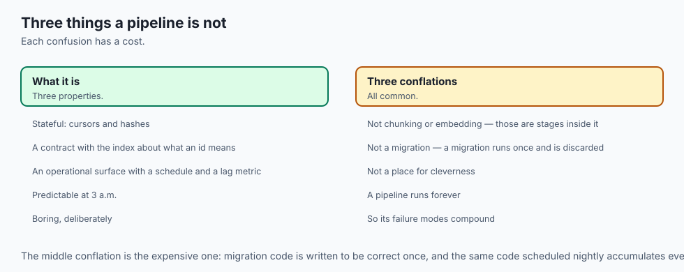

It is not the same thing as chunking or embedding. Those are stages *inside* it. Confusing the stage for the pipeline is why so many teams have excellent chunking logic wrapped in a script that cannot be safely re-run.

It is not a one-off migration. A migration runs once and is discarded. A pipeline runs forever, which is why its failure modes compound.

It is not a place for cleverness. The most valuable property is predictability. A pipeline that is easy to reason about at 3 a.m. beats one that is 20 percent faster.

## Why it was created and what problems it solves

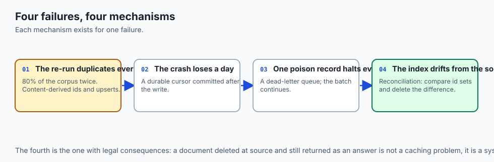

Four concrete failures drive the design, and each maps to a mechanism you will implement today.

**The re-run duplicates everything.** A job fails at 80 percent, someone re-runs it, and now 80 percent of the corpus exists twice in the index. Retrieval starts returning the same passage repeatedly, crowding out diversity. *Mechanism: content-derived chunk ids and upsert semantics.*

**The crash loses a day.** A four-hour job dies at hour three. Without a checkpoint, the only recovery is to start over, and if the failure is systematic the job can never complete. *Mechanism: a durable cursor committed only after a batch is safely written.*

**One poison record halts everything.** A single corrupt PDF raises an exception, the job exits, and 9,999 healthy documents never get indexed. *Mechanism: a dead-letter queue that captures the record and the error, and lets the batch continue.*

**The index drifts from the source.** Documents deleted at the source remain in the index and are returned as answers. This is a correctness and sometimes a legal problem. *Mechanism: reconciliation — comparing the set of source ids to the set of indexed ids and deleting the difference.*

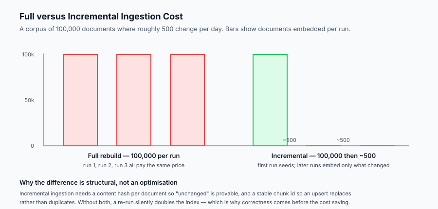

## How it works

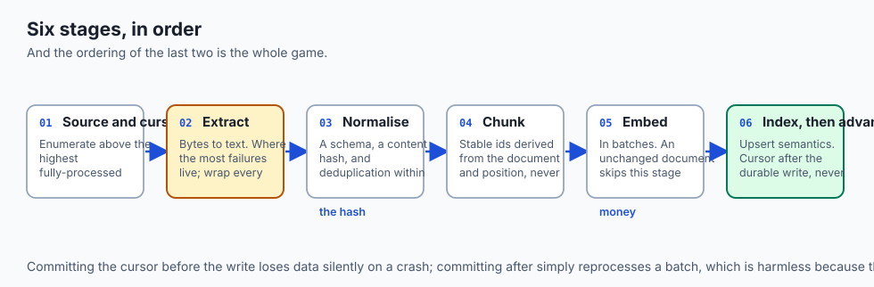

The pipeline is a sequence of stages with explicit boundaries between them. Work flows forward; failures flow sideways into the dead-letter queue; progress flows into the checkpoint store.

**Source and cursor.** A connector enumerates records from a source, ordered by something monotonic — a modification timestamp, a change-log sequence number, an autoincrement id. The cursor is the highest value fully processed. On the next run the connector asks only for records above it.

**Extract.** Bytes become text. This is where the largest variety of failures live, because it is where the pipeline meets the real world's file formats. Every extractor should be wrapped so a failure becomes a dead-letter entry rather than an exception that escapes.

**Normalize.** Text becomes a record with a known schema: an id, the body, and metadata such as source, title, and modification time. Two things happen here that matter enormously. The record gets a **content hash** — a digest of the normalised body — and it gets deduplicated against records already seen in this run.

**Chunk.** The body is split, and each chunk receives a **stable id**. This is the single most important design decision in the pipeline. The id must be derived from the document id and the chunk's position or content, never from a random value or a counter that depends on processing order. A stable id is what turns a second write into an update rather than a duplicate.

**Embed.** Chunks are embedded in batches. This stage costs money and time proportional to the number of chunks, which is precisely why the content hash matters: an unchanged document skips this stage entirely.

**Index.** Chunks are written with upsert semantics — insert if the id is new, replace if it exists. After the batch is durably written, and only then, the cursor advances.

The ordering of that last step is the whole game. Commit the cursor before the write and a crash between them loses data silently. Commit after, and a crash simply causes the batch to be reprocessed — which is harmless, because the writes are idempotent.

## An everyday analogy

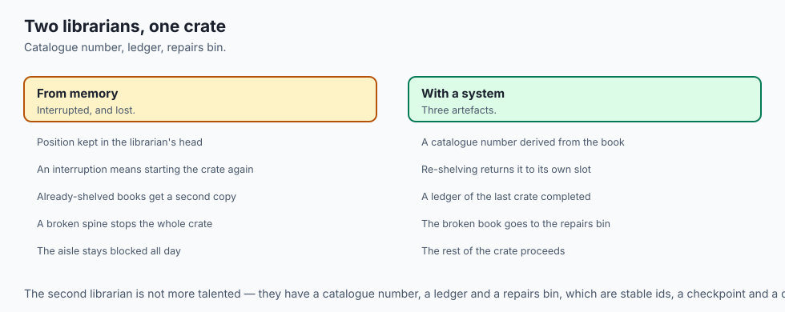

Think of a library that receives a crate of books each morning.

A naive librarian empties the crate onto a trolley, shelves books one at a time, and keeps the position in their head. If they are interrupted, they cannot remember where they stopped, so they start the crate again — and the library now holds two copies of everything they had already shelved. If one book has a broken spine and cannot be shelved, they stop and wait for a decision, and the rest of the crate sits in the aisle all day.

A professional librarian works differently. Each book has a catalogue number derived from the book itself, so re-shelving a book already on the shelf simply puts it back in its own slot rather than creating a second entry. A ledger records the last crate fully shelved, updated only once the crate is genuinely done. The broken-spine book goes into a clearly labelled repairs bin with a note explaining the problem, and the rest of the crate proceeds.

The second librarian is not more talented. They have a catalogue number, a ledger, and a repairs bin — stable ids, a checkpoint, and a dead-letter queue.

## Examples in practice

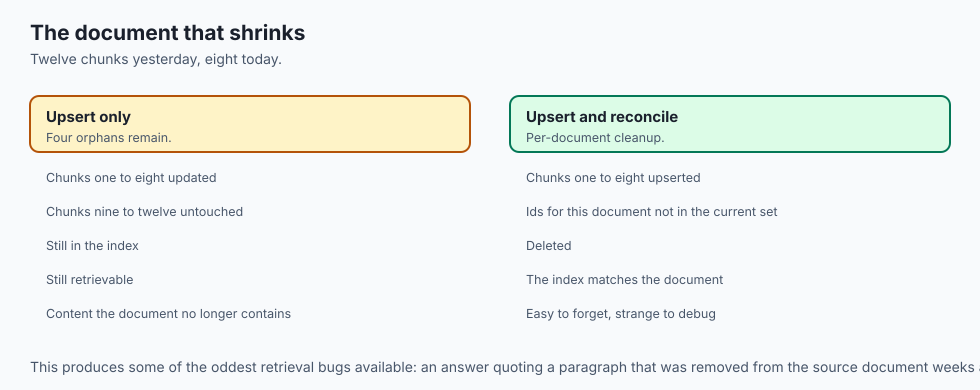

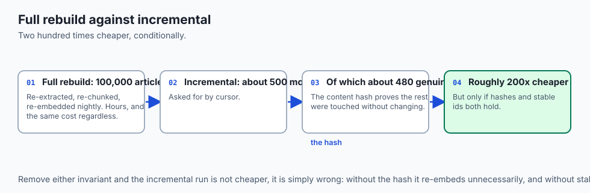

Consider a support knowledge base of 100,000 articles, of which roughly 500 change per day.

**A full rebuild** re-extracts, re-chunks and re-embeds all 100,000 articles every night. It is simple, and it is correct in the sense that the index always matches the source. It also costs the same every night regardless of how little changed, takes hours, and leaves a window during which the index is partially rebuilt.

**An incremental run** asks the source for articles modified since the last cursor, receives about 500, computes their content hashes, and finds that perhaps 480 genuinely changed — the rest were touched without their text changing. It embeds 480 chunk sets and upserts them. It takes minutes.

The incremental run is roughly two hundred times cheaper, but only because two invariants hold. The content hash makes "unchanged" provable rather than assumed. The stable chunk id makes the write an update rather than an insert. Remove either and the incremental pipeline is not cheaper, it is simply wrong — and the wrongness accumulates quietly.

A third case deserves attention: a document that shrinks. Yesterday it produced twelve chunks; today it produces eight. Upserting the eight leaves chunks nine through twelve in the index, orphaned and still retrievable. Correct handling deletes chunks for that document whose ids are not in the current set — a per-document reconciliation that is easy to forget and produces some of the strangest retrieval bugs you will ever chase.

## Implications: security, privacy, performance, scalability, and cost

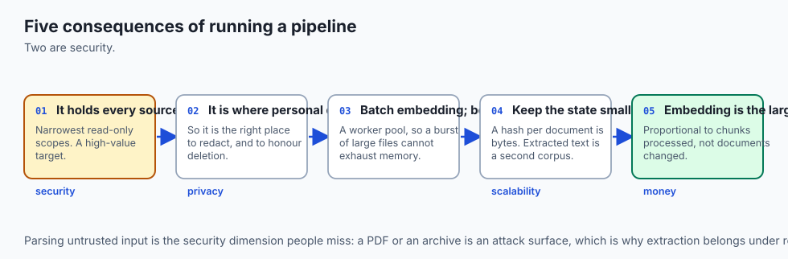

**Security.** The pipeline holds credentials for every source it reads. It is a high-value target and should hold the narrowest possible read-only scopes. Extraction parses untrusted input; a PDF or an archive is an attack surface, so parsers should run with resource limits and, ideally, in a sandbox.

**Privacy.** Ingestion is where personal data enters your system, and therefore the correct place to redact it. It is also where deletion must be honoured: if a source record is deleted, reconciliation must remove it from the index and from any cache. A deletion that is not propagated is a compliance failure, not a stale cache.

**Performance.** The dominant costs are extraction (CPU-bound and highly variable per format) and embedding (network- or GPU-bound). Batch the embedding calls; parallelise extraction with a bounded worker pool so a burst of large files cannot exhaust memory.

**Scalability.** The state must stay small. Storing one content hash per document is a few tens of bytes each; storing extracted text for every document is a second copy of the corpus. Keep the checkpoint store lean.

**Cost.** Embedding is usually the largest line item, and it is proportional to chunks processed, not documents changed. A pipeline that re-embeds unchanged documents because it lacks a content hash can cost an order of magnitude more than one that does not, for identical output.

## Alternatives: free, open source, and commercial

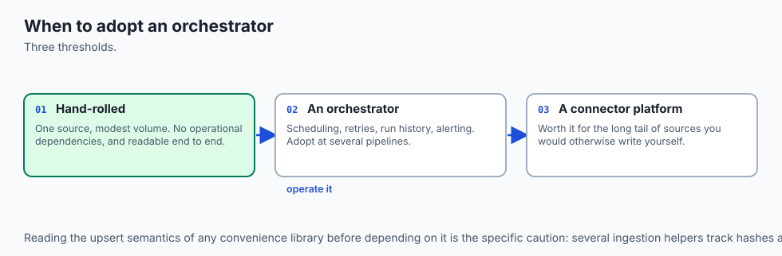

**Hand-rolled Python**, as you will write today, is the right choice for a single source and modest volume. It has no operational dependencies and you can read the whole thing.

**Apache Airflow** and **Dagster** are open-source orchestrators that supply scheduling, retries, run history and a UI. Dagster's asset-oriented model maps unusually well onto "this index partition is derived from these documents". The cost is an orchestrator to operate.

**Prefect** occupies similar ground with a lighter local story.

**Airbyte** and **Meltano** are open-source connector platforms; their value is the long tail of source connectors you would otherwise write yourself. They are strongest at extract-and-load and weaker at the embedding step, which you typically bolt on.

**LlamaIndex** and **LangChain** both ship ingestion helpers with document stores that track hashes. They are convenient for prototypes; read carefully what their upsert semantics actually guarantee before depending on them in production.

**Commercial managed pipelines** exist from most vector database vendors. They remove the operational burden and add a dependency on the vendor's view of your data.

The honest default: start hand-rolled, adopt an orchestrator when you have more than a handful of pipelines or need real scheduling and alerting.

## Comparison with related concepts

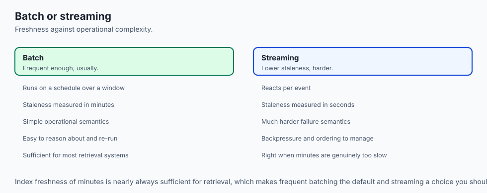

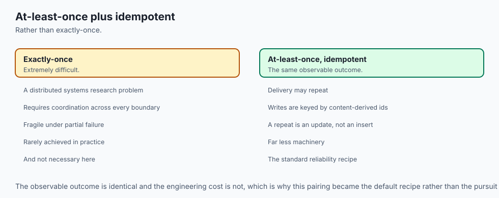

**Ingestion versus ETL.** Ingestion for retrieval is ETL with an expensive, semantically meaningful transform. The scheduling, checkpointing and reconciliation ideas transfer directly.

**Ingestion versus indexing.** Indexing is the final stage — the write into the store. Ingestion is everything required to get a correct, current set of records to that stage. Teams that conflate them tend to have excellent index configuration and no answer for "what happens if we re-run this".

**Batch versus streaming.** Batch runs on a schedule over a window; streaming reacts per event. Streaming gives lower staleness at the cost of much harder operational semantics. Most retrieval systems are well served by frequent batches, because index freshness of minutes is nearly always sufficient.

**Idempotency versus exactly-once.** Exactly-once delivery is extremely difficult in distributed systems. At-least-once delivery combined with idempotent writes achieves the same observable outcome with far less machinery, and it is the pattern used here.

## When to use it — and when not to

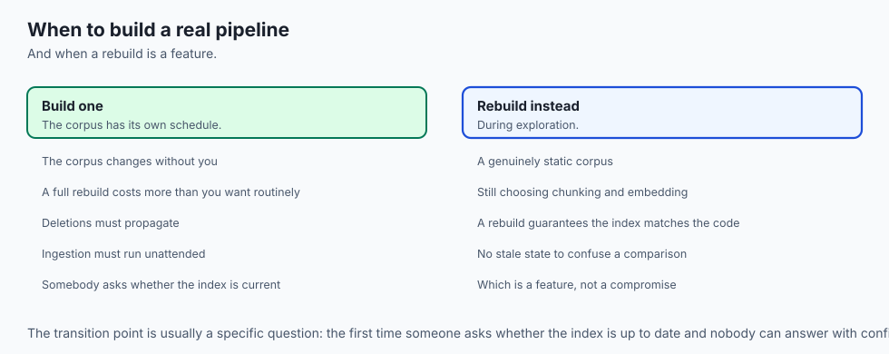

**Build a real pipeline when** the corpus changes on its own schedule, when a full rebuild costs more than you want to pay routinely, when deletions must propagate for legal or correctness reasons, or when ingestion must run unattended.

**Do not build one when** the corpus is genuinely static — a fixed set of manuals for a demo — or when you are still exploring chunking and embedding choices. During exploration a full rebuild is a feature: it guarantees the index matches the code you just changed, with no stale state to confuse a comparison.

The transition point is usually the first time someone asks "is the index up to date?" and nobody can answer with confidence.

## The AI connection

- **Embedding is an expensive transform**, which is what pushes retrieval pipelines
  toward incremental design far harder than a conventional warehouse load.

- **A content hash makes "unchanged" provable.** Without it an incremental run is not
  cheaper, it is wrong, and the wrongness accumulates quietly.

- **Vector index update semantics are weaker than a database's**, so idempotency has to
  come from stable ids you derive rather than from transactions you rely on.

- **Deletion is a correctness and sometimes legal requirement** — a document removed at
  source and still retrievable is a compliance failure, not a stale cache.

- **Retrieval quality problems are usually ingestion problems.** The index being three
  weeks stale looks exactly like an embedding model that got worse.

## Knowledge check

1. Why must the cursor be committed *after* the batch is durably written, rather than before?
2. What makes a chunk id "stable", and what breaks if it is not?
3. A document shrinks from twelve chunks to eight. What must the pipeline do beyond upserting the eight?
4. Why does a content hash reduce cost even when the source reports a document as modified?
5. What is the operational purpose of a dead-letter queue, as distinct from simply logging the error?

## Hands-on exercise

You will build an incremental ingestion pipeline in pure Python — no network, no API key, no external services. A fake source supplies documents; a fake index receives chunks. The mechanisms are real; only the endpoints are simulated, which is what makes the behaviour testable.

Work in the lab directory for this day. Open `starter/ingest.py` and implement the three stubbed functions — `content_hash`, `chunk_document` and `run_once` — then run the tests. Each stub's docstring states exactly which property it is responsible for.

The pipeline you are completing must satisfy four properties:

- **Idempotent** — running it twice over unchanged sources leaves the index identical to running it once.
- **Incremental** — a second run embeds only documents whose content hash changed.
- **Resumable** — a crash mid-run resumes from the last committed cursor, without reprocessing committed work and without skipping uncommitted work.
- **Isolated** — a record that fails extraction lands in the dead-letter queue with its error, and the run completes.

### Expected output

Running `python examples/ingest_demo.py` prints a summary of three consecutive runs over a source where one document changes between runs and one document is permanently malformed:

```text
run 1: scanned=5 changed=4 embedded=7 indexed=7 dead_lettered=1 cursor=5
run 2: scanned=0 changed=0 embedded=0 indexed=0 dead_lettered=0 cursor=5
run 3: scanned=1 changed=1 embedded=2 indexed=2 dead_lettered=0 cursor=6
index: 7 chunks across 4 documents
dead letters: 1 (doc-3: ExtractionError)
```

Read run 1 carefully: five records were scanned but only four *changed*, because `doc-3` failed extraction and was dead-lettered before it could be hashed. Four documents produced seven chunks between them.

Run 2 is the important line. It scans nothing and embeds nothing, because the cursor has not moved. Run 3 shows an edited document re-embedded and upserted — the index gains chunks for the new version of `doc-1` while the document count stays at four.

### Validate your work

Run the test suite with `bash tests/run_tests.sh`. All tests must pass. The suite checks each of the four properties independently, so a failure names the property you have not yet satisfied.

Then confirm by inspection: run `python examples/ingest_demo.py` twice in a row. The second invocation must report `indexed=0` on every run line except the first, and the final index size must be unchanged. If the index grows on the second invocation, your chunk ids are not stable.

### Troubleshooting

**The index doubles on the second run.** Your chunk id depends on something that varies between runs — a counter, a timestamp, or `id()`. Derive it from the document id plus the chunk index.

**Run 2 re-embeds everything.** You are comparing modification times rather than content hashes, or you are hashing the raw bytes including metadata that changes on every read. Hash the normalised body only.

**A crash loses records.** You are committing the cursor before writing the batch. Move the commit after the write.

**One bad document ends the run.** Your extraction call is not wrapped. Catch the exception, record it to the dead-letter queue with the document id and the error, and continue the loop.

### Common mistakes

Deriving the chunk id from enumeration order across the whole run, so adding a document at the start renumbers everything after it. The id must be scoped to its document.

Treating the dead-letter queue as a log. A log is for humans; a dead-letter queue is a work item that something must later drain, retry or explicitly abandon.

Forgetting orphaned chunks when a document shrinks. Upserting the new chunks is not sufficient.

Storing extracted text in the checkpoint store, which turns a small piece of state into a second copy of the corpus.

## Practice assignment

Extend the pipeline with **reconciliation for deletions**. Add a `deleted_ids` capability to the fake source, and make the pipeline remove those documents' chunks from the index. Then add a full-reconciliation mode that compares the complete set of source document ids against the set of document ids in the index and deletes any that no longer exist at the source.

Write a test that proves a document deleted at the source is no longer retrievable from the index after the next run, and a second test proving that reconciliation is itself idempotent.

## Extension challenge

Add **bounded concurrency** to the extraction stage using `concurrent.futures.ThreadPoolExecutor` with a fixed, small worker count, while preserving every property the tests check. Concurrency makes the ordering guarantees harder: the cursor may only advance past a record once that record and every record before it has been committed.

Then measure it honestly. Time the sequential and concurrent versions over a few hundred simulated documents and record both numbers. If concurrency does not measurably help on this workload, say so — an extension that adds complexity for no measured gain is a finding worth writing down, not a failure.
