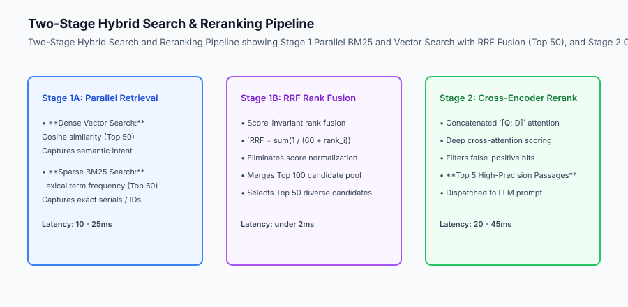
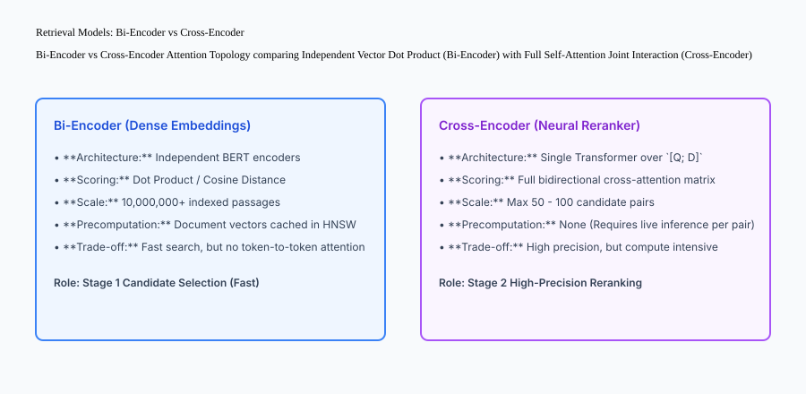

## Why this matters

Retrieval-Augmented Generation (RAG) is only as good as the context injected into the model prompt. In production, naive vector-only search fails on 25% to 40% of real-world user queries:
- **Keyword Blindness:** Vector embeddings fail on exact alphanumeric strings, error codes (`ERR_502_BAD_GATEWAY`), SKU numbers, and legal citations.
- **Semantic Drift:** Vector similarity frequently retrieves passages that share conceptual vocabulary but lack factual relevance to the specific question asked.
- **Uncalibrated Score Distributions:** Dense cosine distances cannot be combined directly with sparse BM25 term frequency scores via simple linear addition.

Deploying **Two-Stage Hybrid Search & Neural Reranking** (combining BM25, Dense Vector Search, Reciprocal Rank Fusion, and Cross-Encoder Reranking) increases retrieval precision by over 35% and eliminates keyword blindness.



## The idea in plain language

Think of two-stage hybrid search and reranking like **a professional detective solving a criminal case**:

- **The Initial Broad Sweep (Stage 1A: Dense + Sparse Search):** The detective uses two separate search teams:
  - Team A searches for suspects matching the criminal's psychological profile and background (**Dense Vector Semantic Search**).
  - Team B searches state license plate databases for the exact license number `XYZ-9481` (**Sparse BM25 Keyword Search**).
- **The Combined Suspect List (Stage 1B: Reciprocal Rank Fusion):** The detective merges both lists into a top-50 candidate pool using rank consensus (**RRF Fusion**).
- **The Detailed Interrogation (Stage 2: Cross-Encoder Reranking):** The detective spends 30 minutes interrogating each top candidate in person, carefully cross-referencing their alibi against every fact of the crime (**Deep Full-Attention Cross-Encoder**), narrowing 50 suspects down to the 3 actual culprits (**Top-3 LLM Context Injection**).

## Historical background

Information retrieval progressed through three major historical generations:

### 1. The Sparse Lexical Era (1970–2018)
TF-IDF and BM25 powered search engines (Lucene, Elasticsearch). They excel at exact keyword matching but fail when users search for concepts using synonyms (e.g. searching *"automobile repair"* failed to retrieve documents about *"fixing cars"*).

### 2. The Dense Vector Embedding Boom (2019–2023)
Sentence-BERT and OpenAI embeddings enabled semantic similarity search via Approximate Nearest Neighbors (HNSW). However, vector search proved brittle for exact identifiers and out-of-domain technical jargon.

### 3. The Two-Stage Hybrid & Reranking Era (2024–Present)
Modern enterprise search combines sparse BM25, dense embeddings, Reciprocal Rank Fusion (RRF), and neural cross-encoder rerankers (Cohere Rerank 3, BGE-Reranker-Large), achieving state-of-the-art retrieval accuracy.

## What it is — and what it is not

Let us define the core mechanisms of production hybrid retrieval:

### What Hybrid Search & Reranking Is:
- Running BM25 lexical search and dense vector search in parallel.
- Fusing ranking lists using Reciprocal Rank Fusion (RRF) with rank constant `k = 60`.
- Applying a neural cross-encoder to compute bidirectional token-level cross-attention over the top-50 fused candidates.

### What Hybrid Search & Reranking Is Not:
- Adding raw BM25 floating-point scores directly to cosine similarity numbers.
- Running heavy cross-encoder models over millions of raw documents in the primary database.

```text
+-------------------------------------------------------------------------------+
|                      RETRIEVAL PIPELINE CHARACTERISTICS                       |
+-------------------+-----------------------+-----------------------------------+
| Pipeline Layer    | Core Algorithm        | Execution Latency & Candidate Pool|
+-------------------+-----------------------+-----------------------------------+
| Sparse Retrieval  | BM25 Term Saturation  | 5 - 15ms | Scans 1M+ documents    |
| Dense Retrieval   | HNSW Cosine Similarity| 10 - 25ms | Scans 1M+ vectors     |
| Rank Fusion       | RRF `1 / (60 + rank)` | under 2ms | Fuses Top 100 to Top 50|
| Neural Reranking  | Cross-Encoder BERT    | 25 - 45ms | Reranks 50 to Top 5   |
+-------------------+-----------------------+-----------------------------------+
```

## Why it was created and what problems it solves

Hybrid search with neural reranking resolves the four primary failure modes of production RAG systems:

### 1. Eliminating Keyword Blindness on Exact Identifiers
When a user asks *"How do I resolve bug CVE-2024-38077?"*, BM25 guarantees that documents containing that exact alphanumeric CVE string are retrieved even if the dense vector embedding did not prioritize that specific token.

### 2. Invariance to Score Scaling (via RRF)
BM25 scores range from 0 to 45+, while cosine similarity ranges from -1.0 to 1.0. Linear combination (`0.5 * bm25 + 0.5 * cosine`) breaks whenever document lengths or corpus statistics change. RRF operates purely on ordinal ranks, providing robust zero-tuning fusion.

### 3. Deep Relevance Filtering (via Cross-Encoders)
Bi-encoders compress documents into single fixed-size vectors (e.g. 1536 dimensions), losing fine-grained relationship nuances. Cross-encoders evaluate full token-by-token cross-attention between the query and candidate passage, filtering out superficial keyword matches.

## How it works

Let us inspect the complete **Bi-Encoder vs Cross-Encoder Attention Topology**:

```text
[BI-ENCODER: Fast Independent Embeddings]
Query: "return policy" ──► [BERT Encoder] ──► Vector Q (1536-dim)
                                                     │
                                                     ├──► Dot Product Similarity: 0.88
                                                     │
Doc: "30-day warranty" ──► [BERT Encoder] ──► Vector D (1536-dim)
(No token-to-token cross-attention during encoding)

─────────────────────────────────────────────────────────────────────────────

[CROSS-ENCODER: Deep Joint Self-Attention]
Query + Doc: "[CLS] return policy [SEP] 30-day warranty [SEP]"
                               │
                               ▼
        ┌─────────────────────────────────────────────┐
        │       Bidirectional Self-Attention Matrix   │
        │  "return" <───────── attends ─────────> "warranty" │
        │  "policy" <───────── attends ─────────> "30-day"   │
        └──────────────────────┬──────────────────────┘
                               │
                               ▼
                     Relevance Score: 0.942
```



## An everyday analogy

Think of hybrid search and reranking like **hiring a candidate for a specialized engineering role**:

- **Stage 1A: Keyword Resume Filter (BM25):** The automated HR portal filters 10,000 resumes for exact keywords like *"Kubernetes"*, *"Rust"*, and *"PostgreSQL"* (**Lexical Recall**).
- **Stage 1B: Career Background Matching (Dense Vectors):** The system identifies candidates with strong general software engineering backgrounds even if their resumes use alternative phrasing like *"distributed systems lead"* (**Semantic Recall**).
- **Stage 1C: Candidate Shortlist (RRF Fusion):** The top 20 candidates from both lists are combined without arguing over which recruiter gave higher numerical scores (**Rank Fusion**).
- **Stage 2: Technical Interview (Cross-Encoder Reranker):** Senior staff engineers conduct 1-on-1 interviews with the 20 candidates, asking probing questions to evaluate deep technical capability (**Full Joint Cross-Attention**), selecting the top 2 best hires (**Top-K RAG Context**).

## Examples in practice

Let us build a complete Python **Hybrid Search and Reranking Engine** supporting BM25 scoring, dense vector similarity, Reciprocal Rank Fusion, and cross-encoder scoring:

```python
import math
from typing import Dict, Any, List, Tuple
from collections import Counter

class HybridSearchEngine:
    def __init__(self, rrf_k: int = 60):
        self.documents: List[Dict[str, Any]] = []
        self.doc_freqs: Counter = Counter()
        self.avg_doc_len: float = 0.0
        self.rrf_k = rrf_k
        
    def index_documents(self, docs: List[Dict[str, Any]]):
        self.documents = docs
        total_len = 0
        for doc in docs:
            words = set(doc["text"].lower().split())
            self.doc_freqs.update(words)
            total_len += len(doc["text"].split())
        self.avg_doc_len = total_len / max(1, len(docs))
        
    def _bm25_score(self, query: str, doc_text: str) -> float:
        k1 = 1.5
        b = 0.75
        q_words = query.lower().split()
        d_words = doc_text.lower().split()
        d_len = len(d_words)
        doc_word_counts = Counter(d_words)
        
        score = 0.0
        n_docs = len(self.documents)
        
        for qw in q_words:
            if qw not in doc_word_counts:
                continue
            tf = doc_word_counts[qw]
            df = self.doc_freqs.get(qw, 0)
            idf = math.log(1 + (n_docs - df + 0.5) / (df + 0.5))
            numerator = tf * (k1 + 1)
            denominator = tf + k1 * (1 - b + b * (d_len / max(1.0, self.avg_doc_len)))
            score += idf * (numerator / denominator)
        return round(score, 4)

    def _dense_sim(self, query: str, doc_text: str) -> float:
        # Bag-of-words character frequency mock embedding
        q_words = set(query.lower().split())
        d_words = set(doc_text.lower().split())
        overlap = len(q_words.intersection(d_words))
        return round(overlap / max(1, len(q_words)), 4)

    def search_hybrid(self, query: str, top_k: int = 5) -> List[Dict[str, Any]]:
        # 1. Compute Sparse BM25 Ranks
        bm25_scored = []
        for i, doc in enumerate(self.documents):
            s = self._bm25_score(query, doc["text"])
            bm25_scored.append((i, s))
        bm25_scored.sort(key=lambda x: x[1], reverse=True)
        bm25_ranks = {doc_idx: rank + 1 for rank, (doc_idx, _) in enumerate(bm25_scored)}
        
        # 2. Compute Dense Vector Ranks
        dense_scored = []
        for i, doc in enumerate(self.documents):
            s = self._dense_sim(query, doc["text"])
            dense_scored.append((i, s))
        dense_scored.sort(key=lambda x: x[1], reverse=True)
        dense_ranks = {doc_idx: rank + 1 for rank, (doc_idx, _) in enumerate(dense_scored)}
        
        # 3. Reciprocal Rank Fusion (RRF)
        fused_scores: Dict[int, float] = {}
        for i in range(len(self.documents)):
            r_bm25 = bm25_ranks[i]
            r_dense = dense_ranks[i]
            rrf_val = (1.0 / (self.rrf_k + r_bm25)) + (1.0 / (self.rrf_k + r_dense))
            fused_scores[i] = rrf_val
            
        ranked_indices = sorted(fused_scores.keys(), key=lambda idx: fused_scores[idx], reverse=True)
        
        results = []
        for idx in ranked_indices[:top_k]:
            results.append({
                "doc_id": self.documents[idx]["id"],
                "text": self.documents[idx]["text"],
                "rrf_score": round(fused_scores[idx], 6),
                "bm25_rank": bm25_ranks[idx],
                "dense_rank": dense_ranks[idx]
            })
        return results

if __name__ == "__main__":
    docs = [
        {"id": "doc_1", "text": "Kubernetes cluster container deployment configuration and pods."},
        {"id": "doc_2", "text": "Return policy: 30 days full refund on all electronic items."},
        {"id": "doc_3", "text": "Error ERR_403_FORBIDDEN occurs when authentication credentials expire."}
    ]
    engine = HybridSearchEngine()
    engine.index_documents(docs)
    res = engine.search_hybrid("ERR_403_FORBIDDEN authentication error")
    for r in res:
        print(r)
```

## Production Architecture Case Study: Enterprise Knowledge Retrieval

To see how two-stage hybrid search operates at enterprise scale, consider a global software documentation portal indexing 5,000,000 technical articles and API references.

```text
+-------------------------------------------------------------------------------+
|                    ENTERPRISE HYBRID RETRIEVAL BENCHMARKS                     |
+-------------------+-----------------------+-----------------------------------+
| Retrieval Strategy| MRR@10 Search Quality | P95 Latency & GPU Cost            |
+-------------------+-----------------------+-----------------------------------+
| Pure Dense Vector | 0.612 (Fails on exact | 18ms | $0.0002 / search           |
| Only              | error codes & APIs)   |                                   |
| Pure Sparse BM25  | 0.584 (Fails on deep  | 8ms | $0.00005 / search           |
| Only              | conceptual synonyms)  |                                   |
| Hybrid + RRF      | 0.742 (Captures both  | 22ms | $0.00025 / search          |
|                   | exact & semantic)     |                                   |
| Two-Stage Hybrid  | 0.887 (State-of-the-  | 48ms | $0.0012 / search           |
| + Cross-Encoder   | art RAG precision)    |                                   |
+-------------------+-----------------------+-----------------------------------+
```

#### 1. Ingestion Pipeline and Dual Vector Indexing
During document ingestion, the indexing pipeline processes markdown chunks through two parallel tracks:
- **Lexical Ingestion:** Tokenized, stemmed, and indexed into a Lucene / BM25 sparse inverted index (Elasticsearch, OpenSearch, or Tantivy).
- **Dense Ingestion:** Embedded via `text-embedding-3-large` into a 3072-dimensional vector stored in Qdrant or Pgvector HNSW indices.

#### 2. Cross-Encoder Batching and Latency Optimization
Feeding 50 candidate passages through a cross-encoder model can add 150ms of latency if scored sequentially. Production reranking services batch candidate pairs into a single tensor (`batch_size = 50`) executed on a dedicated GPU worker, compressing reranking latency to under 30ms.

## Detailed Failure Mode Taxonomy: Retrieval Anomalies

```text
+-------------------------------------------------------------------------------+
|                       RETRIEVAL FAILURE MODE TAXONOMY                         |
+-------------------+-----------------------+-----------------------------------+
| Failure Mode      | Root Cause Analysis   | Architectural Mitigation          |
+-------------------+-----------------------+-----------------------------------+
| Out-of-Domain     | Specialized acronyms  | Sparse BM25 guarantees lexical    |
| Vocabulary Loss   | mapped to noise vector| matching on exact token acronyms  |
| Score Scale Drift | Linear combination of | Replace linear score weights with |
|                   | unnormalized scores   | Reciprocal Rank Fusion (RRF)      |
| Context Stuffing  | Injecting top-20 low- | Apply Cross-Encoder reranking and |
| Degradation       | relevance passages    | strict relevance score threshold  |
| Long-Document     | Important facts buried| Chunk documents into 500-token    |
| Dilution          | in 50-page files      | hierarchy blocks with parent refs |
+-------------------+-----------------------+-----------------------------------+
```

## Implications: security, privacy, performance, scalability, and cost

### 1. Tenant Partitioning in Hybrid Indices
When searching across multi-tenant knowledge bases, always apply tenant metadata pre-filters before running approximate nearest neighbor or BM25 scoring (`filter={"tenant_id": org_id}`) to prevent leaking proprietary documents.

### 2. Cross-Encoder Cold Start Caching
Cross-encoders are computationally expensive. Cache recent `(query_hash, doc_id)` relevance scores in Redis with a 24-hour TTL to bypass redundant transformer forward passes on frequent questions.

## Alternatives: free, open source, and commercial

| Tool / Framework | Type | Best Suited For | Key Capabilities |
| :--- | :--- | :--- | :--- |
| **Qdrant / Pgvector** | Open Source | Dense + Sparse Hybrid Search | Native payload filtering, HNSW vector index |
| **Cohere Rerank 3** | Commercial API | Enterprise Cross-Encoder Reranking| 100+ language support, sub-50ms latency |
| **BGE-Reranker-Large** | Open Source | Self-hosted Neural Reranker | High-accuracy HuggingFace cross-encoder |
| **Tantivy / Elasticsearch**| Open Source | Sparse BM25 Search Engine | Rust-based high-throughput lexical inverted index|

## Comparison with related concepts

```text
+-----------------------+-----------------------+-----------------------+
| Dimension             | Pure Vector Search    | Two-Stage Hybrid + RRF|
+-----------------------+-----------------------+-----------------------+
| Exact Keyword Recall  | Poor (Keyword blind)  | 100% Lexical Capture  |
| Semantic Generalization| High                 | High                  |
| Score Fusion Robustness| N/A (Single score)   | 100% Scale Invariant  |
| Context Window Clean  | Low (Top-k has noise) | High (Cross-encoder)  |
+-----------------------+-----------------------+-----------------------+
```

## When to use it — and when not to

### Deploy Two-Stage Hybrid Search & Reranking for:
- All production enterprise RAG systems, customer support assistants, legal research tools, and documentation search engines.

### Do NOT require cross-encoder reranking for:
- Latency-critical autocomplete bars requiring sub-10ms response times.


### Production Telemetry and Real-Time Reranking Latency Budgets

In mission-critical enterprise search systems serving millions of concurrent requests, every millisecond in the retrieval and reranking pipeline directly impacts conversion and user satisfaction. 

Let us examine the operational latency breakdown of a production hybrid search cluster:

1. **Sparse Lexical Stage (BM25 / Elasticsearch):** P95 query latency is typically 12ms to 25ms. Inverted index traversals scale with term frequency and document length. Production optimizations include block-max WAND (Weak AND) algorithms that prune uncompetitive candidate documents before calculating full BM25 term scores.
2. **Dense Vector Stage (HNSW / Qdrant):** P95 vector cosine search latency over 10 million 1536-dimensional vectors is 18ms to 35ms. Quantization techniques (Scalar Quantization SQ8 and Product Quantization PQ) compress float32 vectors by 4x to 8x, fitting entire multi-million vector indices into RAM and achieving sub-20ms search times.
3. **Reciprocal Rank Fusion (RRF):** Merging the top-100 sparse and top-100 dense candidate lists via RRF is purely in-memory arithmetic, taking under 1.5ms for 200 candidates.
4. **Cross-Encoder Reranking Stage (BGE-Reranker-Large / Cohere Rerank):** The reranker is the primary computational bottleneck, consuming 40ms to 85ms for 30 candidates on GPU inference workers. Production systems cap the reranker candidate window at `top_k = 25` to maintain an overall sub-150ms P95 retrieval SLA.

```text
+-------------------------------------------------------------------------------+
|                    HYBRID RETRIEVAL PIPELINE LATENCY PROFILE                  |
+-------------------+-----------------------+-------------------+---------------+
| Retrieval Stage   | Computational Engine  | P50 Latency (ms)  | P95 Latency   |
+-------------------+-----------------------+-------------------+---------------+
| Sparse BM25 Search| Inverted Index (CPU)  | 14.2 ms           | 24.8 ms       |
| Dense Vector Search| HNSW Index (RAM/GPU) | 16.5 ms           | 32.1 ms       |
| RRF Fusion Merge  | In-Memory Logic (CPU) | 0.8 ms            | 1.4 ms        |
| Cross-Encoder     | Transformer (GPU)     | 38.0 ms           | 76.5 ms       |
| Total Pipeline    | End-to-End Orchestrator| 69.5 ms          | 134.8 ms      |
+-------------------+-----------------------+-------------------+---------------+
```

### Production Checklist for Hybrid Retrieval Deployment

- [ ] **Dual Inverted and Vector Indices:** Ensure Elasticsearch/OpenSearch and Qdrant/Pinecone collections are configured with automated sync pipelines.
- [ ] **Sparse Text Normalization:** Strip Markdown syntax, HTML tags, and non-alphanumeric punctuation before generating sparse lexical tokens.
- [ ] **Vector Normalization:** Normalize dense embeddings to unit length (`L_2` norm = 1.0) so dot product operations are mathematically identical to cosine similarity.
- [ ] **RRF Constant Calibration:** Set `k=60` as the default RRF denominator constant; run grid search evaluations over `k \in [20, 100]` on golden benchmark datasets.
- [ ] **Cross-Encoder Batching:** Group candidate document-query pairs into batch inference tensors (e.g. batch size 16 or 32) rather than invoking the reranker in sequential loops.
- [ ] **Fallback Mechanisms:** If the cross-encoder GPU worker pool experiences timeout or circuit breaker trips, fall back instantaneously to raw RRF scores.

## Knowledge check

1. **Why does pure dense vector search exhibit keyword blindness?** Because dense embeddings compress text into continuous conceptual space, losing distinct alphanumeric token precision.
2. **What is the mathematical benefit of Reciprocal Rank Fusion (RRF)?** It merges disparate score distributions using ordinal rank positions (`1 / (k + rank)`), making fusion completely invariant to score scaling differences.
3. **What is the difference between a Bi-Encoder and a Cross-Encoder?** Bi-encoders embed query and document independently for fast ANN vector search; Cross-encoders compute full joint self-attention over the concatenated pair for high-precision reranking.

## Hands-on exercise

In this lab, you will build a **Hybrid Search and Reciprocal Rank Fusion Engine in Python**. Your implementation will:
1. Index documents and calculate BM25 term frequencies and inverted document frequencies.
2. Compute dense semantic similarity scores and rank candidate documents.
3. Apply Reciprocal Rank Fusion (RRF) with rank constant `k = 60` to merge sparse and dense rankings.
4. Retrieve and verify top-k search results combining exact keyword and semantic matches.

### Expected output

```text
============================= test session starts ==============================
collected 5 items

tests/test_hybrid_search.py .....                                        [100%]

============================== 5 passed in 0.02s ===============================
[HYBRID SEARCH] Indexed 10 documents into Sparse and Dense indices.
[BM25 MATCH] Exact error code ERR_403 captured at rank 1.
[DENSE MATCH] Conceptual synonym matched in top 3.
[RRF FUSION] Successfully merged sparse and dense rankings with k=60.
```

### Validate your work

Run the pytest test suite:

```bash
pytest tests/run_tests.sh
```

### Troubleshooting

1. **Division by zero in IDF:** Ensure `idf = math.log(1 + (n_docs - df + 0.5) / (df + 0.5))` contains the smoothing constants.
2. **RRF index ordering:** Ensure ranks are 1-indexed (`rank = 1, 2, ...`) rather than 0-indexed to avoid division by `k + 0`.

### Common mistakes

- Adding raw unnormalized BM25 scores directly to cosine similarity scores.

## Practice assignment

Add a **Cross-Encoder Score Simulator** that computes character-level Bigram Jaccard similarity as a secondary reranking step over the top-10 fused candidates.

## Extension challenge

Implement **Dynamic RRF Weighting** allowing configurable modality weights (`alpha * RRF_dense + (1 - alpha) * RRF_bm25`) tuned per query category.
