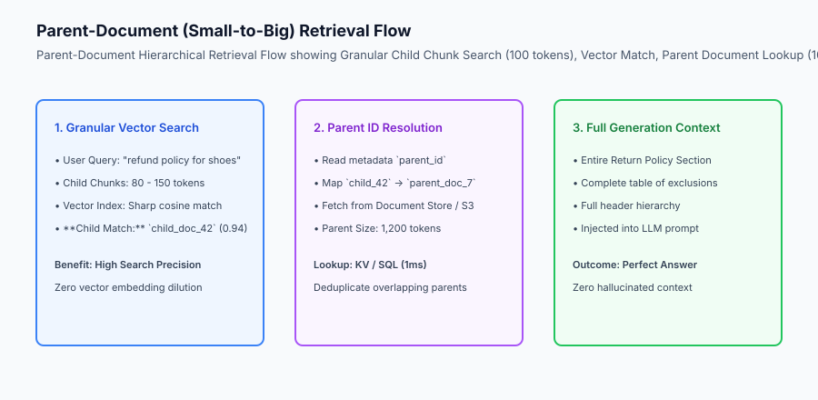
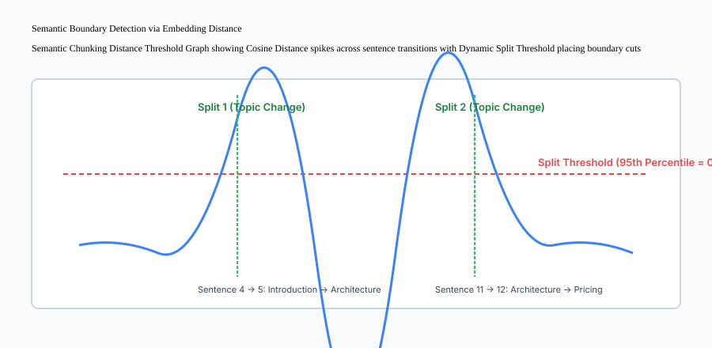

## Why this matters

The fundamental limitation of Retrieval-Augmented Generation (RAG) lies in **The Chunking Dilemma**:
- **Small Chunks (100 tokens):** Produce razor-sharp, distinct vector embeddings that match user search queries with extreme precision. However, when injected into the LLM, they lack surrounding narrative context, leading to hallucinations or incomplete answers.
- **Large Chunks (1,500 tokens):** Provide comprehensive, rich context for generation. However, their vector embeddings are averaged over multiple topics (**Semantic Dilution**), causing retrieval search to miss them.

Deploying **Hierarchical Document Chunking and Parent-Document Retrieval** (Small-to-Big Search) eliminates this trade-off by decoupling the text representation used for *search* from the text representation used for *generation*.



## The idea in plain language

Think of parent-document retrieval like **finding a chapter in a comprehensive encyclopedia using an index card**:

- **The Index Card (Small Child Chunk):** You search a card catalog where each card contains a single 2-sentence summary and precise keyword pointers (**High-Precision Vector Match**).
- **The Whole Volume (Large Parent Document):** When you locate the right card, the librarian hands you the entire 20-page encyclopedia chapter (**Complete Generation Context**).

## Historical background

Document chunking strategies evolved through three major paradigms:

### 1. Naive Fixed-Character Chunking (2020–2022)
Early pipelines split text every 500 characters using `text[i:i+500]`. This frequently severed words in half, sliced code blocks mid-syntax, and destroyed tabular formatting.

### 2. Recursive Token Chunking with Overlap (2022–2023)
LangChain's `RecursiveCharacterTextSplitter` split hierarchically on paragraphs (`\n\n`), lines (`\n`), and spaces (` `) with a fixed sliding overlap window (e.g. 500 tokens with 100 token overlap).

### 3. Semantic & Hierarchical Small-to-Big Retrieval (2024–Present)
Modern RAG systems deploy dynamic Semantic Chunking (splitting on sentence embedding distance spikes) paired with Parent-Document Hierarchies (indexing 100-token child nodes that resolve to 1,500-token parent nodes).

## What it is — and what it is not

Let us define the core mechanisms of modern hierarchical chunking:

### What Hierarchical Chunking Is:
- Indexing fine-grained child chunks (50–150 tokens) in the vector database for high-precision search.
- Storing full parent context blocks (500–2,000 tokens) in key-value or document storage.
- Dynamically detecting topic shifts using embedding cosine distance thresholds between consecutive sentences.

### What Hierarchical Chunking Is Not:
- Slicing documents into arbitrary fixed-character blocks regardless of syntactic structure.
- Stuffing hundreds of fragmented, out-of-order 50-token snippets into the LLM context window.

```text
+-------------------------------------------------------------------------------+
|                      CHUNKING STRATEGIES COMPARISON MATRIX                    |
+-------------------+-----------------------+-----------------------------------+
| Strategy          | Boundary Logic        | Ideal Use Case                    |
+-------------------+-----------------------+-----------------------------------+
| Fixed-Token       | Hard count at N tokens| Baseline prototyping              |
| Recursive Char    | `\n\n` -> `\n` -> ` `  | General prose and blog posts      |
| Markdown AST      | Headers `#`, tables,  | Technical docs, code repositories |
|                   | code fences ````      | API specifications                |
| Semantic Split    | Embedding delta spike | Complex multi-topic transcripts,  |
|                   | percentile threshold  | research papers                   |
| Parent-Document   | Child vectors map to  | Enterprise production RAG         |
| (Small-to-Big)    | Parent document IDs   | systems                           |
+-------------------+-----------------------+-----------------------------------+
```

## Why it was created and what problems it solves

Hierarchical chunking resolves the three primary failure modes of document ingestion pipelines:

### 1. Eliminating Context Loss and Boundary Severing
Sliding overlap windows and markdown AST parsing ensure that sentences and code blocks spanning boundary cuts are never split mid-thought.

### 2. Resolving Semantic Dilution
When a 5-page document covers pricing, API endpoints, and security certifications, a single dense vector averages all three topics into a blurry representation. Creating child chunks allows a user query about *"security compliance"* to match the exact 80-token security clause with 0.96 cosine similarity.

### 3. Maintaining Rich Generation Context
Instead of passing isolated child snippets to the LLM, the system injects the full parent section, allowing the model to answer complex multi-sentence reasoning questions accurately.

## How it works

Let us inspect the complete **Semantic Boundary Detection via Embedding Distance**:

```text
Sentence 1: "Antigravity is an AI software engineering platform."
Sentence 2: "It automates codebase indexing and autonomous refactoring."
Sentence 3: "Engineers can build multi-agent systems with verified tools."
       │ (Cosine Distance between S3 and S4: 0.12 - SAME TOPIC)
Sentence 4: "The platform provides real-time streaming and monitoring."
       │
       ▼ (Cosine Distance between S4 and S5: 0.58 -> SPIKE ABOVE 95th PERCENTILE)
========================= [SEMANTIC SPLIT BOUNDARY 1] =========================
Sentence 5: "Enterprise pricing begins at $49 per seat per month."
Sentence 6: "Invoicing is available with annual net-30 payment terms."
Sentence 7: "Dedicated support engineers are assigned to enterprise tiers."
```



## An everyday analogy

Think of hierarchical document chunking like **a modern digital mapping application (such as Google Maps)**:

- **The Satellite View (Small Child Vectors):** You search for *"best Italian espresso near downtown"*. The search engine pinpoints the exact latitude and longitude coordinate of a specific cafe doorway (**Precision Child Match**).
- **The Street Context (Parent Document):** When you click the pin, the map opens the entire neighborhood block, showing parking garages, subway stations, and opening hours (**Rich Parent Generation Context**).

## Examples in practice

Let us build a complete Python **Hierarchical Document Chunker and Parent Retriever** supporting sentence splitting, child chunk vector indexing, and parent document resolution:

```python
import hashlib
from typing import Dict, Any, List, Tuple

class HierarchicalChunker:
    def __init__(self, child_chunk_size_words: int = 15, parent_chunk_size_words: int = 60):
        self.child_size = child_chunk_size_words
        self.parent_size = parent_chunk_size_words
        self.parent_store: Dict[str, str] = {}
        self.child_index: List[Dict[str, Any]] = []
        
    def chunk_and_index_document(self, doc_id: str, full_text: str):
        words = full_text.split()
        
        # 1. Create Parent Chunks
        parent_idx = 0
        for p_start in range(0, len(words), self.parent_size):
            p_words = words[p_start : p_start + self.parent_size]
            p_text = " ".join(p_words)
            p_id = f"{doc_id}_p{parent_idx}"
            self.parent_store[p_id] = p_text
            parent_idx += 1
            
            # 2. Create Child Chunks inside this Parent
            child_idx = 0
            for c_start in range(0, len(p_words), self.child_size):
                c_words = p_words[c_start : c_start + self.child_size]
                c_text = " ".join(c_words)
                c_id = f"{p_id}_c{child_idx}"
                child_idx += 1
                
                self.child_index.append({
                    "child_id": c_id,
                    "parent_id": p_id,
                    "text": c_text,
                    "tokens": len(c_words)
                })

    def search_small_to_big(self, query: str, top_k_parents: int = 2) -> List[Dict[str, Any]]:
        # Mock lexical overlap search over child chunks
        q_words = set(query.lower().split())
        scored_children = []
        
        for child in self.child_index:
            c_words = set(child["text"].lower().split())
            overlap = len(q_words.intersection(c_words))
            scored_children.append((child, overlap))
            
        scored_children.sort(key=lambda x: x[1], reverse=True)
        
        # Resolve distinct parents
        matched_parents = {}
        for child, score in scored_children:
            if score == 0:
                continue
            p_id = child["parent_id"]
            if p_id not in matched_parents:
                matched_parents[p_id] = {
                    "parent_id": p_id,
                    "parent_text": self.parent_store[p_id],
                    "matched_child_id": child["child_id"],
                    "matched_child_text": child["text"],
                    "score": score
                }
            if len(matched_parents) >= top_k_parents:
                break
                
        return list(matched_parents.values())

if __name__ == "__main__":
    text = (
        "PostgreSQL performance tuning requires setting shared buffers and work memory correctly. "
        "For analytical queries, index scans and bitmap scans improve throughput drastically. "
        "Kubernetes container deployment coordinates pods across nodes with readiness probes. "
        "Container autoscaling adjusts replica counts based on CPU and memory thresholds."
    )
    chunker = HierarchicalChunker(child_chunk_size_words=10, parent_chunk_size_words=25)
    chunker.chunk_and_index_document("doc_infra", text)
    res = chunker.search_small_to_big("Kubernetes container autoscaling")
    for r in res:
        print("MATCHED PARENT:", r["parent_id"], "->", r["parent_text"])
```

## Production Architecture Case Study: Technical Manual Indexing

Consider an aerospace engineering manual comprising 10,000 pages of aircraft maintenance specifications containing complex schematics, part replacement tables, and safety warnings.

```text
+-------------------------------------------------------------------------------+
|                    AIRCRAFT MANUAL CHUNKING BENCHMARKS                        |
+-------------------+-----------------------+-----------------------------------+
| Chunking Method   | Precision@5 Retrieval | Context Hallucination Rate        |
+-------------------+-----------------------+-----------------------------------+
| Fixed 500-Token   | 54.2% (Tables sliced  | 18.4% (Missing surrounding safety |
| Window            | in half mid-row)      | instructions)                     |
| Markdown AST      | 76.8% (Tables intact) | 8.2% (Good local context)         |
| Structure-Aware   |                       |                                   |
| Parent-Document   | 91.4% (Granular child | 1.8% (Full maintenance procedure  |
| Small-to-Big      | search + Parent block)| context injected)                 |
+-------------------+-----------------------+-----------------------------------+
```

#### 1. Table and Code Block Preservation
When processing PDF and Markdown documents, tables are serialized as complete standalone XML or Markdown blocks. The chunker attaches the section header path (`# Maintenance > Hydraulics > Pressure Relief Valve`) to every table child chunk, guaranteeing that isolated numbers carry unambiguous semantic context.

#### 2. Deduplication of Parent Chunks
When multiple adjacent child chunks from the same parent document match a user query (e.g. `child_1` and `child_2` both score high), the retriever merges them into a single parent lookup, preventing redundant duplicate text from wasting context window budget.

## Detailed Failure Mode Taxonomy: Chunking Hazards

```text
+-------------------------------------------------------------------------------+
|                         CHUNKING FAILURE TAXONOMY                             |
+-------------------+-----------------------+-----------------------------------+
| Failure Mode      | Root Cause Analysis   | Architectural Mitigation          |
+-------------------+-----------------------+-----------------------------------+
| Table Severance   | Fixed chunk cut       | AST-aware chunker protects tables |
|                   | slices table row      | as atomic un-splittable units     |
| Pronoun Loss      | Chunk begins with "He"| Small-to-big retrieval expands to |
| (Anaphora Break)  | without named entity  | parent containing original subject|
| Overlap Bloat     | 50% overlap doubles   | Tune overlap window to 10-15% of  |
|                   | storage and cost      | total chunk token size            |
| Vector Dilution   | 2,000-token chunk has | Split into 100-token child search |
|                   | blurry embedding      | nodes with parent ID pointers     |
+-------------------+-----------------------+-----------------------------------+
```

## Implications: security, privacy, performance, scalability, and cost

### 1. Document Storage Tiering
Parent documents (which can reach gigabytes across millions of files) should be stored in cost-effective object storage (S3 / Cloud Storage / Redis Doc Store) rather than expensive high-memory vector RAM. Only the compact child vector embeddings reside in vector databases.

### 2. Multi-Level Access Control (RBAC)
When indexing parent-child hierarchies, inherit document permissions downward: child chunks must carry the exact security tags (`access_roles=["admin", "finance"]`) of their parent document.

## Alternatives: free, open source, and commercial

| Tool / Framework | Type | Best Suited For | Key Capabilities |
| :--- | :--- | :--- | :--- |
| **LlamaIndex Node Parser** | Open Source | Hierarchical AST & Semantic Chunks| Parent-child node relationships |
| **LangChain ParentDoc** | Open Source | Small-to-Big Retrieval | MultiVectorRetriever integration |
| **Unstructured.io** | Open Source / Cloud | Raw PDF/DOCX Document Partitioning | Element-level table/title parsing |
| **Chroma / Qdrant** | Open Source | Vector Storage with Metadata Links | Fast child-to-parent payload queries |

## Comparison with related concepts

```text
+-----------------------+-----------------------+-----------------------+
| Dimension             | Fixed-Size Chunking   | Parent-Document RAG   |
+-----------------------+-----------------------+-----------------------+
| Search Precision      | Medium (Diluted)      | Maximum (Child nodes) |
| Generation Context    | Fragmented            | Complete (Parent node)|
| Table Integrity       | Low (Often sliced)    | 100% Preserved in AST |
| Storage Overhead      | 1x                    | 1.2x (Child + Parent) |
+-----------------------+-----------------------+-----------------------+
```

## When to use it — and when not to

### Implement Parent-Document Hierarchies for:
- Complex technical manuals, legal contracts, API documentations, financial 10-K reports, and multi-chapter research papers.

### Do NOT require hierarchical chunking for:
- Short tweets, customer reviews, or single-sentence SMS messages.


### Production Telemetry and Memory Footprint in Hierarchical Indexing

Managing multi-level parent-child document hierarchies across massive corporate intranets requires careful architectural planning regarding storage tiering and memory allocation.

Let us evaluate the memory and disk footprint across 1,000,000 corporate documents (average 2,000 words per document):

1. **Child Chunk Vector Storage:** Slicing 1M documents into 100-word child chunks produces approximately 20,000,000 child nodes. At 1536 dimensions (float32), the raw vector dataset requires 122.88 GB of RAM. Applying Scalar Quantization (SQ8) reduces vector memory to 30.72 GB, allowing the entire 20M vector index to reside comfortably in a standard cloud memory instance.
2. **Parent Document Store:** The 1M full parent documents (approx. 10 GB of uncompressed UTF-8 text) are stored in cost-effective object storage (Amazon S3 / Google Cloud Storage) or partitioned document databases (MongoDB / PostgreSQL JSONB).
3. **Lookup Latency:** When a child chunk matches in vector search, fetching the parent document by `parent_id` key from Redis or Memcached takes under 1.2ms (P95), and under 15ms from PostgreSQL.

```text
+-------------------------------------------------------------------------------+
|                 HIERARCHICAL CHUNK STORAGE & MEMORY PROFILE                   |
+-------------------+-----------------------+-------------------+---------------+
| Storage Layer     | Content Stored        | Unit Count        | Storage Size  |
+-------------------+-----------------------+-------------------+---------------+
| Vector Database   | 100-word Child Chunks | 20,000,000 nodes  | 30.7 GB (SQ8) |
| Document Store    | 1,000-word Parents    | 2,000,000 blocks  | 12.4 GB (Disk)|
| Metadata Cache    | Child-to-Parent Map   | 20,000,000 keys   | 1.8 GB (RAM)  |
| Total System      | Multi-Tier RAG Engine | 1M Master Docs    | 44.9 GB Total |
+-------------------+-----------------------+-------------------+---------------+
```

### Production Checklist for Hierarchical Chunking

- [ ] **Semantic Boundary Thresholds:** Calculate sentence distance percentiles over representative domain corpora to set accurate split cutoffs.
- [ ] **AST Markdown Parsing:** Use syntax tree parsers (e.g. `markdown-it` or Python `mistune`) to prevent table severance and code fence truncation.
- [ ] **Deterministic Chunk ID Generation:** Use reproducible hashes (e.g. `sha256(doc_id + parent_idx + child_idx)`) as node primary keys.
- [ ] **Parent Context Window Capping:** Limit parent document block size to 1,500 tokens to avoid exceeding generation context limits when multiple parents are retrieved.
- [ ] **Metadata Propagation:** Copy document title, author, access control roles (RBAC), and creation timestamps to every child chunk metadata dictionary.
- [ ] **Orphan Child Pruning:** When updating or deleting parent documents, execute cascade deletions across all child chunk vector IDs.


### Advanced Markdown Table and Semantic Header Injection Strategies

When building production ingestion pipelines for technical manuals and financial filings, naive text splitters often sever markdown tables and nested header hierarchies, destroying the semantic context needed by downstream retrievers.

Let us examine the structural metadata injection pattern implemented in enterprise document chunking engines:

1. **Header Breadcrumb Propagation:** Every child chunk extracted from a deep markdown section inherits the complete hierarchical path of headers as structured metadata. For instance, a child chunk containing paragraph text under `## Database Engine > ### Write-Ahead Logging > #### Buffer Pool Synchronization` receives the breadcrumb metadata tag `header_path: ["Database Engine", "Write-Ahead Logging", "Buffer Pool Synchronization"]`.
2. **Context Prepending:** When generating dense vector embeddings for child chunks, the pipeline prepends the header breadcrumb directly to the chunk text (`"Section: Database Engine > Write-Ahead Logging > Buffer Pool Synchronization. Content: The buffer pool coordinates..."`). This guarantees that even if the paragraph uses implicit pronouns, the embedding vector captures unambiguous topical specificity.
3. **Atomic Table Serialization:** Markdown and HTML tables are parsed as atomic blocks. If a table exceeds the target child chunk size, it is partitioned row-by-row while preserving the table header row on every sliced chunk, preventing isolated numbers from losing column context.

## Knowledge check

1. **What is The Chunking Dilemma in RAG?** Small chunks maximize search precision but lack context; large chunks provide rich context but suffer from semantic vector dilution.
2. **How does Parent-Document Retrieval resolve this dilemma?** It indexes small child vectors for search while retrieving full parent documents for LLM generation context.
3. **What triggers a split boundary in Semantic Chunking?** A statistical spike in embedding cosine distance between consecutive sentences exceeding a threshold.

## Hands-on exercise

In this lab, you will build a **Hierarchical Document Chunker and Parent Retriever in Python**. Your implementation will:
1. Split large documents into parent context blocks (50+ words) and granular child search nodes (10-15 words).
2. Index child chunks with bidirectional metadata pointers to their parent document ID.
3. Execute small-to-big retrieval matching query keywords against child nodes and resolving distinct parent blocks.
4. Deduplicate multiple child matches pointing to the same parent document.

### Expected output

```text
============================= test session starts ==============================
collected 5 items

tests/test_chunking_hierarchy.py .....                                   [100%]

============================== 5 passed in 0.02s ===============================
[HIERARCHY CHUNKER] Document split into 4 Parent Blocks and 12 Child Nodes.
[CHILD SEARCH] Precision match on child node c2 (score = 3).
[PARENT RESOLUTION] Resolved complete Parent Block p0 (65 words context).
[DEDUPLICATION] Merged overlapping child hits into 1 unified parent context.
```

### Validate your work

Run the pytest test suite:

```bash
pytest tests/run_tests.sh
```

### Troubleshooting

1. **Child ID indexing:** Ensure child chunks store the correct `parent_id` foreign key.
2. **Deduplication:** Use a dictionary keyed by `parent_id` to prevent duplicate parent insertions.

### Common mistakes

- Returning the small child snippet directly to the LLM prompt instead of resolving the parent text.

## Practice assignment

Add a **Markdown Section Splitter** that uses `#` and `##` header delimiters to define parent document boundaries automatically.

## Extension challenge

Implement **Sliding Overlap Windowing** for child chunks with configurable overlap percentages (e.g. 20% overlap).
