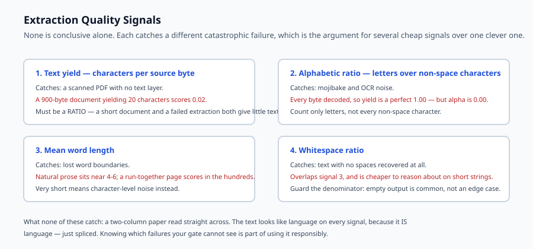

## Why this matters

Yesterday you built a pipeline that moves documents reliably. Today you confront what is actually inside them.

A corpus of a hundred thousand enterprise documents is not a hundred thousand copies of the same thing. It is PDFs exported from a word processor, PDFs that are photographs of paper, HTML with three layers of navigation wrapped around four paragraphs of content, spreadsheets where the meaning lives in the column headers, slide decks where a diagram carries the argument, and a long tail of formats someone chose in 2011 and nobody has revisited since.

The naive approach — call a text extractor, take whatever comes back — fails in a way that is uniquely frustrating: it fails *quietly*. The extractor returns a string. The string is not empty. It goes into the index. Nobody notices that the table has become a run-on sentence, that the two-column paper has been read straight across so every line splices two unrelated sentences together, or that the scanned contract produced four characters of noise.

Retrieval quality then collapses for reasons that look like an embedding problem and are not. You can swap models all week and it will not help, because the text was already wrong before it reached them.

Today is about making extraction quality visible and making the process survive the long tail.



## The idea in plain language

Document processing at scale rests on three ideas.

**Dispatch by what the file is, not what it claims to be.** The extension lies. A `.pdf` may be a scan, a `.txt` may be UTF-16, a `.html` may be a wrapper around a PDF. Detect the real format, then route to an extractor that understands it.

**Score the result, do not just accept it.** Every extraction should produce text *and* a judgement about that text. Is it plausibly language? Is it suspiciously short relative to the file size? Is the character distribution what prose looks like? A cheap heuristic catches most catastrophic failures, and catastrophic failures are the ones that matter.

**Budget every document.** At scale, the enemy is the pathological input: the 400-page PDF with an embedded font that takes ninety seconds to parse, the deeply nested archive, the file that makes a parser allocate until the machine swaps. Every document gets a time limit and a memory ceiling, and exceeding either is a normal outcome the pipeline handles rather than an exception that ends the run.

Get those three right and the long tail becomes boring. Get them wrong and a single document can hold up a nightly job indefinitely.

## Historical background

### Optical character recognition, 1970s onward

OCR is old. Commercial systems date to the 1970s; Tesseract began at HP in the 1980s and was open-sourced in 2005. Its arrival as a free, credible engine is why scanned documents became tractable for small teams. Accuracy on clean printed text is now high; accuracy on a photograph of a creased page taken at an angle is not, and that gap still defines what is worth attempting.

### The PDF problem, 1993 onward

PDF was designed for **fidelity of presentation**, not for structure. A PDF says "place this glyph at these coordinates". It does not, in general, say "this is a paragraph", "these cells form a table" or even "these characters form a word". Everything downstream — reading order, columns, tables — is reconstruction from geometry. This is the single largest source of silent extraction failure, and it is architectural rather than a defect in any particular library.

### Layout-aware models, 2020 onward

LayoutLM and its successors combined text with position, treating a page as a two-dimensional object rather than a stream. Table-structure models such as TableFormer followed. These substantially improve extraction from complex documents at meaningfully higher compute cost, which turns extraction into a cost-quality decision rather than a solved step.

### The document-intelligence era, 2020s

Cloud vendors packaged detection, OCR, layout analysis and table extraction into single APIs. Open-source pipelines such as Unstructured and Docling assembled comparable stacks locally. The practical consequence is that you now choose a point on a spectrum from "fast and lossy" to "slow and faithful", per document class rather than once for the whole corpus.

## What it is — and what it is not

Document processing is the stage that converts arbitrary source files into clean, ordered text with enough structure preserved that retrieval and generation can use it.

### What it is

It is a **dispatch problem**. Different formats need genuinely different handling, and the routing decision is part of the design.

It is a **quality-control problem**. Extraction can succeed technically and fail semantically, so the output needs scoring.

It is a **resource-management problem**. Adversarial and merely unusual inputs must not be able to exhaust the machine.

### What it is not

It is not chunking. Chunking decides how to split clean text; processing decides how to obtain clean text in the first place. Chunking excellent text badly is recoverable — you re-chunk. Chunking corrupted text is not: the damage is upstream and invisible downstream.

It is not a solved library call. `pdf_to_text(path)` is where the work starts.

It is not uniform across a corpus. The right treatment for a born-digital HTML page and a scanned fax differ by orders of magnitude in cost and approach.

## Why it was created and what problems it solves

**Reading order collapse.** A two-column academic paper extracted naively yields lines that splice the left column to the right, producing text that is locally grammatical and globally nonsense. Retrieval finds it; generation quotes it; the answer is confidently wrong. *Solution: column detection, or an extractor that reconstructs reading order from geometry.*

**Silent empty extraction.** A scanned PDF has no text layer. A naive extractor returns an empty string or a handful of stray characters. Without scoring, that document is now silently absent from your index while appearing to have been processed. *Solution: a quality score that flags implausibly low text yield relative to page count.*

**Table flattening.** A table's meaning is in its structure. Flattened to a single line, the association between a row label and its value is destroyed. *Solution: detect tables and serialise them in a form that preserves the association, such as Markdown or per-row sentences.*

**The pathological document.** One file consumes all available memory or never returns. *Solution: per-document time and memory budgets, enforced by the harness rather than trusted to the parser.*

**Encoding chaos.** A UTF-16 file read as UTF-8, or a Windows-1252 file assumed to be UTF-8, produces mojibake that embeds perfectly happily and matches nothing. *Solution: detect encoding, and score the result for character-distribution plausibility.*



## How it works

The pipeline is a dispatch table wrapped in a budget and followed by a gate.

**Detect.** Read the leading bytes and identify the format from its magic number, not its extension. A PDF begins `%PDF-`; a ZIP-based office document begins `PK`; a PNG has its own signature. Where the container is ambiguous, probe further — a PDF with no font resources and a single large image per page is a scan, and needs a different route than a born-digital PDF.

**Dispatch.** Route to an extractor registered for that format. The registry is the extension point: adding support for a new format is registering a handler, not editing a growing conditional.

**Budget.** Run the extractor under a time limit. In production this means a subprocess or a worker with a hard timeout, because a parser stuck in a tight loop cannot be interrupted cooperatively. A timeout is an ordinary outcome: record it, dead-letter the document, continue.

**Score.** Compute cheap signals over the result:

- *Text yield* — characters per page or per kilobyte of source. A 40-page PDF that yields 200 characters is almost certainly a scan.
- *Alphabetic ratio* — the proportion of characters that are letters. Mojibake and OCR noise score low.
- *Mean word length* — natural language sits around four to six characters. Extraction failures produce either very long "words" (whitespace lost) or very short ones (character noise).
- *Whitespace ratio* — text with no spaces at all usually means word boundaries were not recovered.

None of these is conclusive alone. Together they separate "fine" from "catastrophic" reliably, and catastrophic is what you must catch.

**Gate.** Three outcomes, not two. **Accepted** goes downstream. **Dead-lettered** failed outright — an exception, a timeout, an unknown format. **Flagged** extracted something that scored poorly: it is still indexed, because partial text usually beats none, but it is recorded for review and may be routed to a more expensive path such as OCR.

That third outcome is what makes the system honest. A binary accept/reject either discards recoverable documents or silently admits garbage.

## An everyday analogy

Think of a postal sorting office receiving an unlabelled mixed sack.

A poor office opens each item, tips out whatever falls, and sends it on. A birthday card, a legal contract and a water-damaged envelope all get the same handling. The contract's pages arrive out of order; the damaged envelope's contents arrive as fragments; nobody notices, because something arrived for each.

A competent office looks at each item first and sorts by what it actually is — letter, parcel, fragile, damaged. Each class gets appropriate handling. Damaged items go to a separate desk with a note, and the sorter checks that what came out is plausibly what should have come out: a business letter that yields three words is set aside rather than forwarded.

Everything that makes the second office work is here: identify before handling, route by class, budget the effort, and check the output is plausible before letting it go on.

## Examples in practice

**A born-digital PDF invoice.** Text layer present, single column. Direct extraction, high yield, high alphabetic ratio. Accepted in milliseconds. This is the easy majority and should stay cheap.

**A scanned contract.** Forty pages, no text layer. Direct extraction yields 180 characters of stray artefacts. Yield-per-page is far below threshold, so it is flagged rather than silently indexed. It is then routed to OCR, which is perhaps a hundred times more expensive per page — which is precisely why it must be a routed decision rather than the default path.

**A two-column research paper.** Naive extraction produces lines splicing both columns. Cheap scores do not catch this: the text *looks* like language. This is the honest limitation of heuristic scoring, and it is why column-aware extraction matters for document classes where it is common. Knowing which failures your gate cannot catch is part of using it responsibly.

**A 900 MB PDF with an embedded font bomb.** The parser allocates without bound. Without a budget the worker dies and, depending on your harness, may take the run with it. With a budget it times out at ten seconds, is dead-lettered, and the run continues.

**An HTML page.** Ninety percent navigation, cookie banner and footer. Raw extraction buries the four paragraphs that matter in boilerplate that will dominate the embedding. Extracting the main content region matters more here than any downstream tuning.

## Implications: security, privacy, performance, scalability, and cost

**Security.** Document parsers are a genuine attack surface — they are complex C libraries handling untrusted input, with a long history of memory-safety vulnerabilities. Decompression bombs and deeply nested structures are real. Extraction should run with resource limits and, in production, in an isolated process or sandbox. Never let a parser fetch remote resources referenced by the document.

**Privacy.** Extraction is where document contents become plain text — the point where personal data becomes greppable. It is therefore the right stage for redaction. It is also where third-party OCR or document-intelligence APIs would send content off your machine, which is a data-residency decision, not a technical one.

**Performance.** Costs vary by orders of magnitude across formats: plain text is microseconds, a born-digital PDF is milliseconds, OCR on a scanned page is seconds. A pipeline that treats them uniformly is optimising for the wrong case.

**Scalability.** The work is embarrassingly parallel per document, so a bounded worker pool scales well. Bounded matters: unbounded parallelism plus a few large documents exhausts memory quickly.

**Cost.** The decision that dominates is when to escalate to expensive extraction. Sending everything to OCR is enormously wasteful; sending nothing means scanned documents are silently missing. The quality gate is what makes that decision data-driven rather than a guess.

## Alternatives: free, open source, and commercial

**pypdf** — pure Python, permissive licence, fine for simple born-digital PDFs. No layout intelligence.

**pdfplumber** — built on pdfminer.six, exposes character positions and has genuine table extraction. The pragmatic default when structure matters.

**PyMuPDF** — very fast and high quality, but AGPL-licensed, which is a real constraint for commercial closed-source use. Check before adopting.

**Tesseract** — the open-source OCR baseline, Apache-2.0. Good on clean printed text, weaker on difficult scans.

**Unstructured** and **Docling** — open-source pipelines that bundle detection, extraction, layout and table handling. Docling in particular targets high-fidelity document conversion. Both save considerable work at the cost of a heavier dependency.

**Commercial document intelligence** — AWS Textract, Google Document AI, Azure Document Intelligence. Strong on tables and forms, priced per page, and they send your documents to a third party.

The honest default: `pdfplumber` plus a quality gate, escalating to Tesseract for flagged documents, and reach for a full pipeline when the corpus is genuinely heterogeneous.

## Comparison with related concepts

**Processing versus ingestion.** Ingestion (Day 323) is the machinery of movement — cursors, idempotency, dead letters. Processing is what happens to each document once it arrives. Yesterday's dead-letter queue is where today's timeouts and unknown formats land.

**Processing versus chunking.** Processing produces clean text; chunking divides it. A pipeline that chunks corrupted text produces well-formed chunks of nonsense.

**Heuristic scoring versus model-based quality.** Cheap statistics catch catastrophic failures at negligible cost. A model can judge subtler damage, such as broken reading order, at a cost comparable to extraction itself. Use heuristics as the gate; reserve models for document classes where subtle failure is common and expensive.

**Text extraction versus document understanding.** Extraction recovers characters. Understanding recovers meaning — which text is a heading, which cells form a table, what the reading order is. Retrieval systems increasingly need the second, which is why layout-aware tooling keeps gaining ground.

## When to use it — and when not to

**Invest in real processing when** the corpus is heterogeneous, when any material fraction is scanned, when tables carry meaning that answers depend on, or when documents arrive from outside your control and you cannot assume good behaviour.

**Keep it simple when** the corpus is uniform and born-digital — Markdown files from a docs repository, or plain-text exports from a single system. Adding format dispatch and OCR routing to a corpus of Markdown files is machinery earning nothing.

The signal to invest is usually a specific complaint: someone reports that a document they know exists never comes back in search. That is almost always an extraction failure that no quality gate was watching for.

## Knowledge check

1. Why is dispatching on file extension unreliable, and what should be used instead?
2. A 40-page PDF extracts to 180 characters. Which quality signal catches this, and what is the likely cause?
3. Why must a per-document time budget be enforced by the harness rather than by the parser?
4. What failure does the "flagged" outcome exist to prevent, that a binary accept/reject cannot?
5. Give a realistic extraction failure that the four cheap quality signals will *not* catch, and explain why.

## Hands-on exercise

You will build a document processing pipeline with format dispatch, per-document budgets and a quality gate. It runs offline against synthetic documents that reproduce the real failure modes — a scan with no text layer, a mojibake file, a pathological document that never returns, and an unknown format.

Open `starter/process.py` in the lab directory and implement the stubbed functions, then run the tests.

### Expected output

Running `python3 examples/process_demo.py` processes eight synthetic documents and prints one line each, then a summary:

```text
doc-01.txt      accepted   yield=1.00 alpha=0.98 words=4.8
doc-02.pdf      accepted   yield=0.98 alpha=0.98 words=4.8
doc-03.scan     flagged    yield=0.02 alpha=0.81 words=3.2   low text yield
doc-04.bin      flagged    yield=1.00 alpha=0.00 words=600.0   low alphabetic ratio
doc-05.html     accepted   yield=0.61 alpha=0.98 words=5.3
doc-06.slow     dead       timeout after 2.00s
doc-07.xyz      dead       no extractor for format 'unknown'
doc-08.pdf      accepted   yield=0.96 alpha=0.98 words=4.8
summary: accepted=4 flagged=2 dead=2
```

The two flagged documents are the interesting ones. Neither raised an exception — both produced text, and both would have entered the index silently without a quality gate.

Read their signals closely, because each is caught by a different one. `doc-03.scan` has a perfectly respectable alphabetic ratio of 0.81 — the handful of characters it recovered *are* letters. Only the yield of 0.02 reveals that a 900-byte document produced twenty characters. `doc-04.bin` is the mirror image: its yield is a perfect 1.00, because every byte decoded. Its alphabetic ratio of 0.00 and mean word length of 600 are what give it away — the entire document is one "word" of punctuation.

Neither document is caught by both signals. That is the argument for scoring on several cheap axes rather than one clever one.

### Validate your work

Run `bash tests/run_tests.sh`. All tests must pass. They are grouped by concern — detection, dispatch, budget, scoring and gating — so a failure names what is broken.

Then confirm two behaviours by inspection. Processing `doc-06.slow` must return within roughly the budget rather than hanging: time the demo and check it finishes in about a second, not a minute. And `doc-04.bin` must be flagged rather than accepted, even though extraction "succeeded" — that is the whole point of the gate.

### Troubleshooting

**Everything is accepted, including the scan.** Your yield signal is computed over the extracted text rather than as a ratio against the source size. A short document and a failed extraction both produce little text; only the ratio distinguishes them.

**The slow document hangs the run.** You are calling the extractor directly and hoping it returns. Enforce the budget in the harness with a deadline the extractor cannot ignore.

**The mojibake file is accepted.** Your alphabetic ratio counts every non-space character as alphabetic. Count only letters.

**Unknown formats raise rather than dead-letter.** Detection returning `unknown` is a normal outcome, not an error. Route it to the dead-letter path.

### Common mistakes

Trusting the extension. `doc-03.scan` and `doc-06.slow` are deliberately named to look like formats that do not exist — detection must read content.

Treating "extraction returned a string" as success. Both flagged documents return strings.

Making the quality gate binary. Rejecting everything that scores poorly discards recoverable documents; accepting it all defeats the gate.

Computing scores on an empty string and dividing by zero. Empty output is a common case, not an edge case.

## Practice assignment

Add a **fifth quality signal**: repetition ratio, the proportion of the text made up of its single most frequent line. Extraction failures on slide decks and forms often produce the same header repeated once per page, which scores well on every existing signal.

Add a synthetic document reproducing that failure, prove it passes the existing four signals, then prove your new signal flags it. Write both assertions as tests — the first is as important as the second, because it demonstrates the gap the new signal closes.

## Extension challenge

Implement **escalation**. Give the pipeline a second, more expensive extractor — simulated OCR that is deliberately slow but succeeds on documents the fast path cannot read. Route only flagged documents to it, and re-score the result.

Then measure the trade-off honestly across the corpus: how many documents were recovered, how much total time escalation added, and what the cost per recovered document was. Report the real numbers. If escalation recovers two documents and triples total runtime, that is a finding worth stating plainly rather than an outcome to hide.
