## Why this matters

You have a pipeline that moves documents reliably and a processing stage that turns them into clean text. Both run on a schedule. So the index is correct — right?

Ask a harder question: **how would you know if it were not?**

The uncomfortable answer for most systems is that you would find out from a user. Someone searches for a policy they wrote last week and gets the version from March. Someone asks about a product that was discontinued and receives a confident answer describing its pricing. Someone requests deletion of their data under a legal right, the record is removed from the source system, and your index keeps answering questions from it for another eleven months.

That last case is not a stale cache. It is a compliance failure, and it is the one nobody tests for, because it is invisible from the source side. If your reconciliation walks the list of documents the source currently has, it will never encounter the document the source no longer has. The bug is structural: you cannot find what you are not looking at.

Today is about measuring drift rather than assuming it away, and about the specific care that deletion requires.

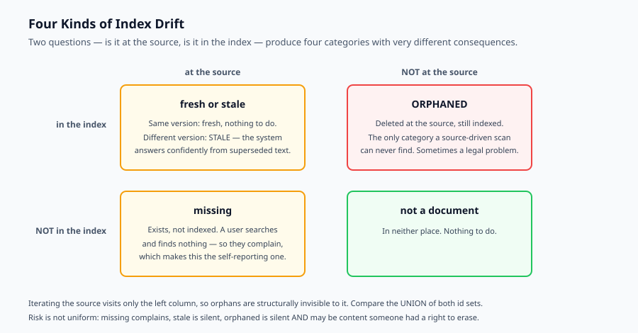

## The idea in plain language

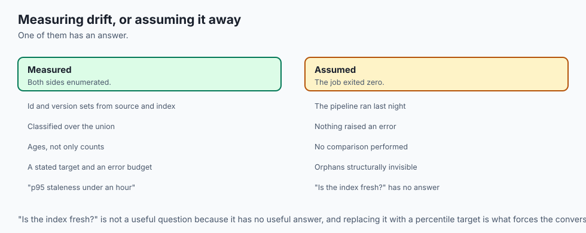

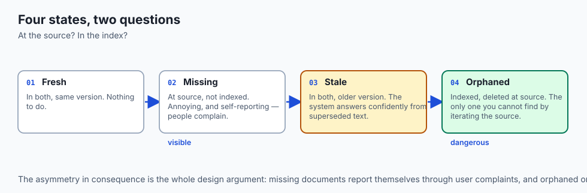

An index is a copy. Every copy drifts from its original, and drift comes in exactly four flavours, determined by two questions: is the document at the source, and is it in the index?

**Fresh** — in both, same version. Nothing to do.

**Missing** — at the source, not in the index. A user searches for something that exists and finds nothing. Annoying, and self-reporting: people complain.

**Stale** — in both, but the index holds an older version. The system answers, confidently, from text that has been superseded. Worse than missing, because nothing looks wrong.

**Orphaned** — in the index, deleted at the source. The system answers from content that no longer exists. This is the dangerous one, and the only one you cannot find by iterating the source.

Freshness work is: measure how much of each you have, decide what is acceptable, and reconcile. The measurement comes first. "The index is fresh" is not a claim you can defend; "p95 staleness is under twenty minutes and there are zero orphans" is.

## Historical background

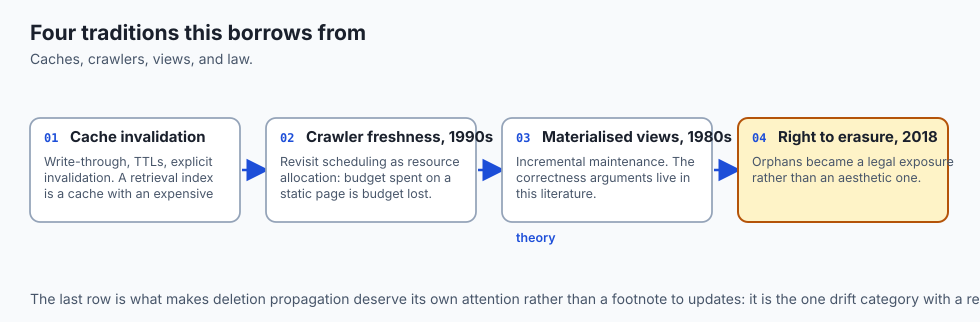

### Cache invalidation, 1970s onward

Phil Karlton's line about cache invalidation being one of the two hard problems in computer science is a joke that has aged into a job description. The literature that matters here — write-through versus write-behind, TTLs, explicit invalidation — was worked out for CPU and database caches decades ago, and a retrieval index is a cache with a very expensive fill cost.

### Search index freshness, 1990s onward

Web search made freshness a first-class product concern. Crawlers had to decide how often to revisit a page, which is a resource-allocation problem: crawl budget spent on a page that never changes is budget not spent on one that changes hourly. Adaptive recrawl scheduling — visit frequently-changing pages more often — comes from this era and applies directly to document corpora.

### Materialised views and incremental maintenance, 1980s onward

Database research on materialised views formalised exactly this problem: a derived dataset that must be kept consistent with its base tables. Incremental view maintenance — applying only the delta rather than recomputing — is the theory behind incremental ingestion, and its literature is where the correctness arguments live.

### Right to erasure, 2018 onward

The GDPR's Article 17 and comparable laws elsewhere turned orphaned records from an aesthetic problem into a legal one. A deletion request that propagates to the primary database but not to a derived index is a real exposure, and it is the reason deletion reconciliation deserves its own attention rather than being a footnote to updates.

## What it is — and what it is not

Index freshness is the practice of measuring and bounding the divergence between a source of truth and a derived index.

### What it is

It is a **measurement discipline** first. You cannot manage drift you do not measure, and the measurement is comparative: it requires reading both sides.

It is a **service-level concern**. Freshness has a target, a measurement and an error budget, exactly like latency or availability.

It is **asymmetric in risk**. The four drift categories differ enormously in consequence, and treating them uniformly means over-investing in the harmless ones.

### What it is not

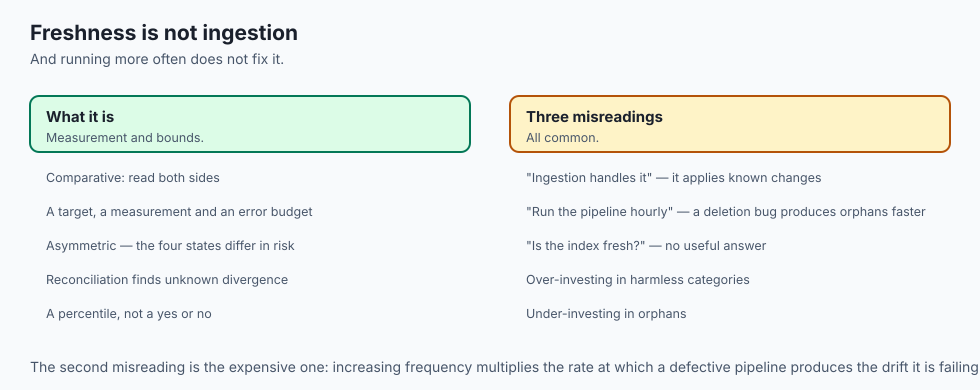

It is not the same as ingestion. Ingestion (Day 323) applies changes it is told about. Freshness asks whether the result is actually correct, including the changes nobody told you about.

It is not solved by running the pipeline more often. A pipeline with a deletion bug produces orphans at any frequency; running it hourly produces them faster.

It is not a binary. "Is the index fresh?" has no useful answer. "What is the p95 staleness, and how many orphans are there?" does.

## Why it was created and what problems it solves

**Deletions that do not propagate.** The source deletes; the index does not. Solved by comparing the *union* of both id sets rather than iterating the source.

**Silent staleness.** An update fails, is retried, fails again, and the failure is logged where nobody reads it. The document simply stops updating. Solved by measuring per-document staleness age, so a document stuck at an old version shows up as an outlier rather than blending in.

**No freshness objective.** Without a stated target, nobody can say whether the current state is a problem. Solved by choosing a percentile target — p95 staleness under some bound — which forces the conversation about what freshness is actually worth.

**Catastrophic reconciliation.** The most dangerous bug in this whole area: a reconciliation run where the source enumeration silently returns nothing. Every indexed document now looks orphaned, and a naive reconciler deletes the entire index. Solved by a guard that refuses to delete an implausible fraction in a single run.


## How it works

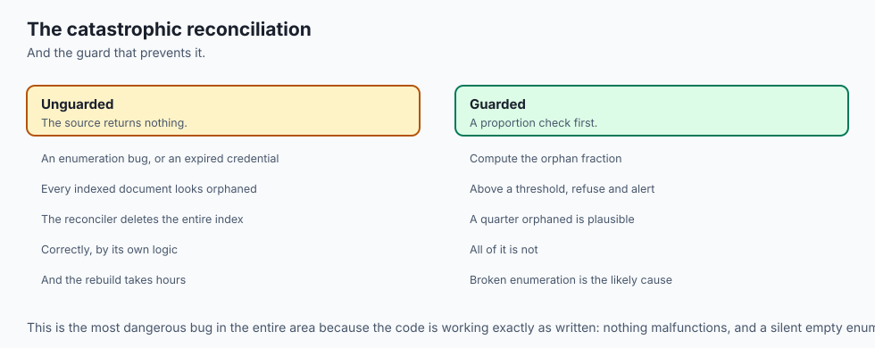

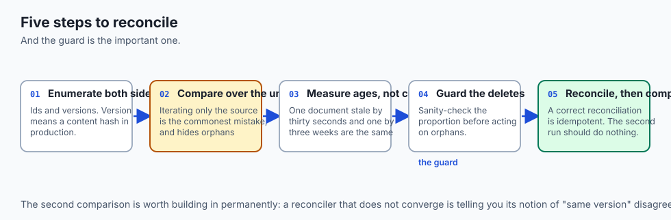

**Enumerate both sides.** Get the set of document ids and versions from the source, and the same from the index. Version means a content hash in production — the same hash Day 323 used for change detection.

**Compare over the union.** For every id in either set, classify it. Iterating only the source is the single most common mistake, and it makes orphans permanently invisible.

**Measure, do not just count.** Counts tell you how many documents are stale; ages tell you how bad it is. One document stale by thirty seconds and one stale by three weeks are the same count and completely different problems. Compute per-document staleness age and report a percentile.

**Guard the deletes.** Before acting on orphans, sanity-check the proportion. If a quarter of your index suddenly looks orphaned, the likely explanation is a broken source enumeration, not a quarter of your documents being deleted at once. Refuse and alert.

**Reconcile.** Index the missing, update the stale, delete the orphaned. Then compare again: a correct reconciliation is idempotent, so the second comparison should report everything fresh and the second reconcile should do nothing.

That final check is worth building in. A reconciler that does not converge is telling you something important — usually that its notion of "same version" disagrees with the writer's.

## An everyday analogy

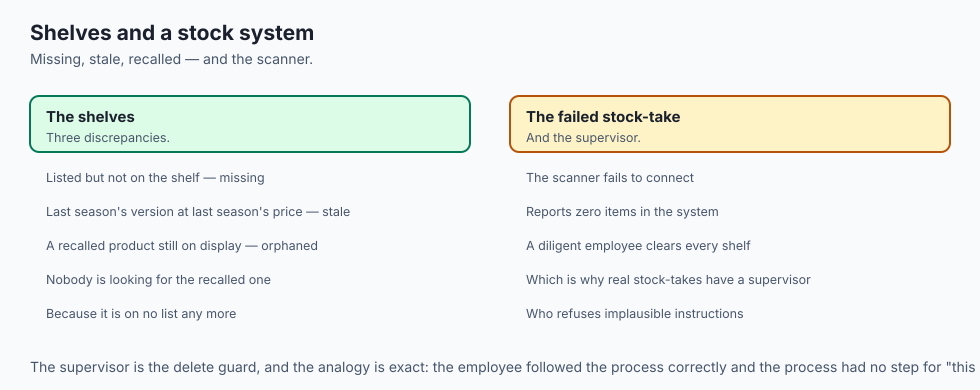

Think of a shop's shelves and its stock system.

Missing stock is when the system lists an item the shelf does not have. A customer asks, the shelf is empty, they complain. You hear about it.

Stale stock is when the shelf has last season's version at last season's price. The customer buys it. Nobody complains, because nothing looked wrong — and the price on the shelf was wrong all along.

Orphaned stock is the recalled product still sitting on the shelf after head office pulled it. Nobody in the shop is looking for it, because it is not on any list any more. It is found when a customer buys it, which is the worst possible time.

And the catastrophic reconciliation is the stock-take where the handheld scanner fails to connect, reports zero items in the system, and a diligent employee clears every shelf in the building. Which is why real stock-takes have a supervisor who refuses implausible instructions.

## Examples in practice

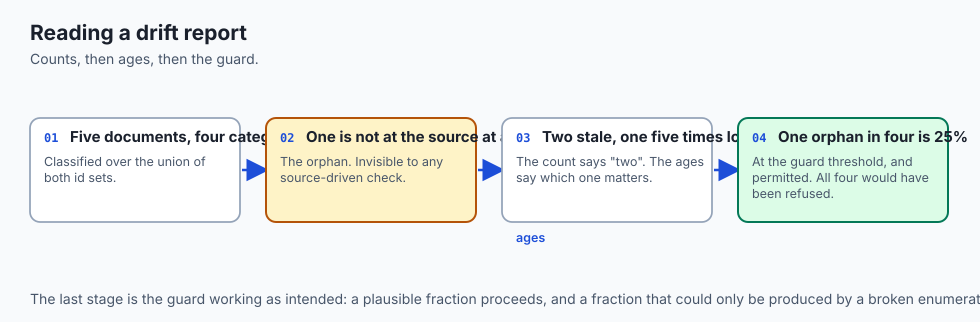

Take the demo state in today's lab: four documents at the source, four in the index, overlapping imperfectly.

```text
doc-1    stale     index at v1, source at v2
doc-2    fresh
doc-3    stale     index at v4, source at v5
doc-4    missing   at source, not indexed
doc-9    orphaned  deleted at source, still indexed
fresh=1 missing=1 stale=2 orphaned=1
```

Five documents, four categories, and `doc-9` is the one that matters. It is not at the source at all. Any process that starts from "for each document in the source" walks straight past it — which is why the comparison iterates the union of both id sets.

Now the ages:

```text
staleness ages: {'doc-1': 10, 'doc-3': 2}
p95 staleness: 10 ticks
```

Both documents are stale, but `doc-1` has been stale five times longer. The count says "two stale documents". The ages say "one has been wrong for a while, one just changed". Only the second is actionable.

And the guard:

```text
safe to delete: True
indexed=1 updated=2 deleted=1
after reconcile: fresh=4 missing=0 stale=0 orphaned=0
```

One orphan out of four indexed documents is 25 percent, which sits exactly at the default threshold and is permitted. Had the source enumeration returned nothing, all four would have looked orphaned, the fraction would have been 100 percent, and the guard would have refused.

## Implications: security, privacy, performance, scalability, and cost

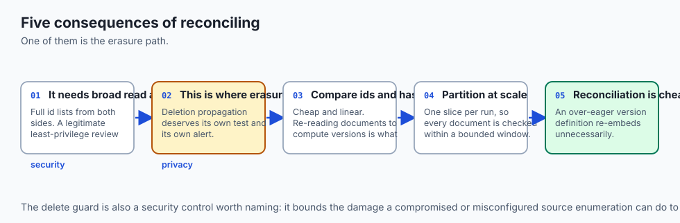

**Security.** A freshness check reads the full id list from both sides, so it needs broad read access — a legitimate target for least-privilege review. The delete guard is itself a security control: it limits the damage a compromised or malfunctioning source enumeration can do.

**Privacy.** This is where right-to-erasure is actually honoured. A deletion in the primary system that does not reach the index leaves personal data retrievable and quotable. Deletion propagation deserves its own test, its own alert, and a shorter tolerance than staleness.

**Performance.** A full comparison is O(n) in ids on both sides, which is cheap when you compare ids and hashes rather than content. It becomes expensive if you re-read documents to compute versions — which is the argument for storing the content hash at write time, as Day 323 does.

**Scalability.** At tens of millions of documents, a full comparison per run stops being free. The usual answer is partitioning: reconcile one slice per run, so every document is checked within a bounded window, and full comparisons become a weekly rather than hourly event.

**Cost.** Reconciliation itself is cheap; what it triggers is not. Re-embedding a stale document costs the same as embedding it the first time, so an over-eager version definition — one that treats a whitespace change as a new version — turns a freshness check into a large bill.

## Alternatives: free, open source, and commercial

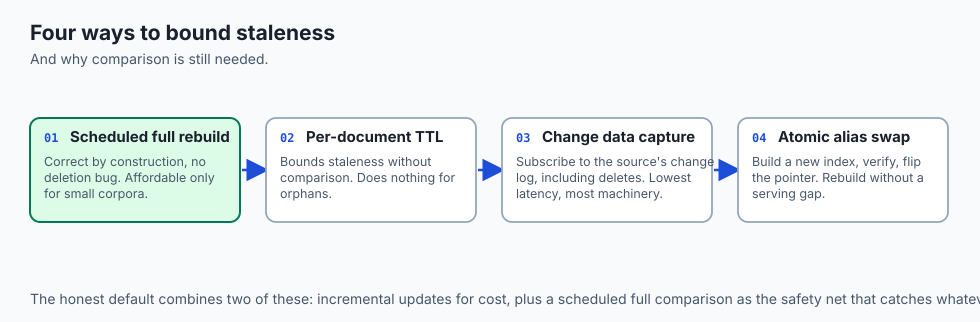

**Full rebuild on a schedule.** The simplest correct answer. Discard the index and rebuild from scratch. Correct by construction, has no deletion bug because there is nothing to delete, and is affordable only for small corpora.

**Time-to-live on documents.** Give each indexed document an expiry and re-fetch on expiry. Bounds staleness without a comparison step, but does nothing for orphans and re-fetches documents that never change.

**Change data capture.** Subscribe to the source's change log, including its deletes. The lowest-latency option and the most operationally involved. Debezium is the mature open-source route.

**Search-engine native features.** Elasticsearch and OpenSearch offer index aliasing, which makes atomic rebuild-and-swap straightforward — build a new index, verify it, flip the alias. Genuinely useful, Apache-2.0 licensed.

**Orchestrated reconciliation.** Dagster's asset model treats "this index partition is derived from these documents" as a first-class concept, with freshness policies built in.

The honest default: incremental updates from ingestion, plus a scheduled full comparison that catches whatever the incremental path missed. The comparison is the safety net, and every incremental system eventually needs one.

## Comparison with related concepts

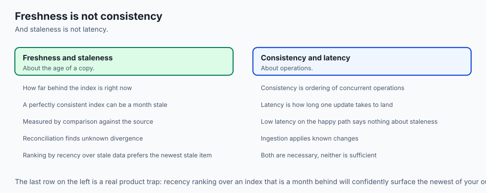

**Freshness versus consistency.** Distributed-systems consistency is about the ordering of concurrent operations. Freshness is about the age of a copy. A perfectly consistent index can be a month stale.

**Reconciliation versus ingestion.** Ingestion applies known changes. Reconciliation finds unknown divergence. You need both, because ingestion has bugs and sources have deletes nobody announced.

**Staleness versus latency.** Latency is how long one update takes to land. Staleness is how far behind the index is right now. Low latency on the happy path tells you nothing about staleness when the path fails.

**Freshness versus recency ranking.** Recency ranking prefers newer documents in results. Freshness is whether the index reflects reality at all. Ranking by recency over a stale index simply prefers the newest of your out-of-date copies.

## When to use it — and when not to

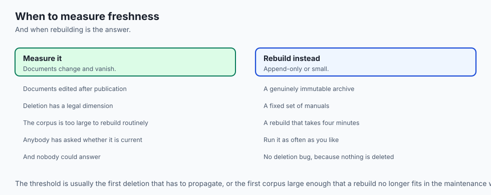

**Build real freshness measurement when** documents are deleted or edited after publication, when deletion has a legal dimension, when the corpus is too large for a routine full rebuild, or when anyone has ever asked "is this up to date?" and not had an answer.

**Skip it when** the corpus is genuinely append-only and immutable — an archive of published papers, a fixed set of manuals — or when a full rebuild is cheap enough to run as often as you need. If rebuilding takes four minutes, rebuild; the comparison machinery is not worth its own maintenance.

The threshold is usually the first deletion that has to propagate, or the first corpus large enough that a rebuild no longer fits in the maintenance window.

## The AI connection

- **A retrieval index is a cache with an expensive fill**, which changes the economics of
  every invalidation decision inherited from database caching.

- **Orphans are the AI-specific danger.** A deleted document still in the index is
  quoted as an answer, confidently, with a citation to something that no longer exists.

- **Erasure requests must reach derived indexes**, and a deletion that stops at the
  primary database is a real exposure rather than a stale cache.

- **Re-embedding is what makes over-eager version definitions expensive** — treating a
  whitespace change as a new version costs the same as indexing the document afresh.

- **Reconciliation is the safety net every incremental system needs**, because ingestion
  has bugs and sources have deletions nobody announced.

## Knowledge check

1. Why can a reconciliation that iterates the source's document list never find an orphaned document?
2. Two documents are stale. Why is the count less useful than the staleness ages?
3. What failure is the delete guard defending against, and why is refusing to act the right response?
4. Why should a correct reconciliation be idempotent, and what does it mean if it is not?
5. Why does an over-eager definition of "version" turn a cheap freshness check into an expensive one?

## Hands-on exercise

You will build a freshness checker that classifies drift, measures staleness, guards deletion and reconciles. It runs offline against in-memory state.

Open `starter/freshness.py` in the lab directory and implement the stubbed functions, then run the tests.

### Expected output

Running `python3 examples/freshness_demo.py` compares a source and index that disagree in every possible way, then reconciles:

```text
doc-1    stale     index at v1, source at v2
doc-2    fresh
doc-3    stale     index at v4, source at v5
doc-4    missing   at source, not indexed
doc-9    orphaned  deleted at source, still indexed
fresh=1 missing=1 stale=2 orphaned=1
staleness ages: {'doc-1': 10, 'doc-3': 2}
p95 staleness: 10 ticks
safe to delete: True
indexed=1 updated=2 deleted=1
after reconcile: fresh=4 missing=0 stale=0 orphaned=0
```

The last line is the proof. After reconciliation everything is fresh and no category has any members left — and running it again would report `indexed=0 updated=0 deleted=0`, because a correct reconciliation converges.

### Validate your work

Run `bash tests/run_tests.sh`. All tests must pass. They are grouped by concern — classification, staleness, reconciliation and the delete guard — so a failure names what is wrong.

Then confirm two things by inspection. Reconcile twice: the second run must do nothing. And construct a state where the source is empty but the index has twenty documents; `safe_to_delete` must return `False`, because that is the shape of a broken enumeration rather than a mass deletion.

### Troubleshooting

**No orphans are ever found.** You are iterating `source` rather than `set(source) | set(index)`. An orphan is by definition absent from the source, so a source-driven loop cannot see it.

**The p50 of `[1, 2, 3, 4, 100]` comes out as 2.** You used `round` for the nearest-rank calculation. Python rounds halves to even, so `round(2.5)` is 2. Nearest-rank uses `ceil`.

**Reconciliation is not idempotent.** You are mutating the index while iterating a report computed from the old state, or your version comparison is not symmetric. Recompute the report after reconciling and assert everything is fresh.

**The guard blocks a legitimate run.** The threshold is a fraction of the *indexed* total, not of the source total. An index with four documents and one orphan is at exactly 25 percent.

### Common mistakes

Treating stale and orphaned as the same problem. They need different urgency and, for orphans, different legal care.

Measuring only counts. Two stale documents tells you nothing about whether one has been broken for a month.

Deleting without a guard. This is the mistake that empties an index in production, and it happens when a source enumeration fails in a way that looks like success.

Dividing by zero on an empty index. An empty index is a normal state, especially on first run.

## Practice assignment

Add **per-partition reconciliation**. Give each document a partition key, and make the checker reconcile one partition per run while tracking when each partition was last checked.

Then add a test proving that every partition is checked within a bounded number of runs, and a second proving that the delete guard is applied per partition rather than globally — otherwise a partition that legitimately shrank to nothing would be blocked by a threshold computed over the whole index.

## Extension challenge

Implement a **freshness objective** and report against it. Choose a target such as "p95 staleness under ten ticks and zero orphans", compute whether the current state meets it, and produce an error-budget style report: how much of the period the objective was violated.

Then run it over a simulated week where updates fail intermittently, and report honestly whether the objective was met. An objective you always meet is set too loosely to be informative; if your simulation never violates it, say so and tighten it until it does.
