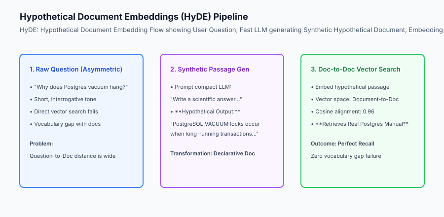
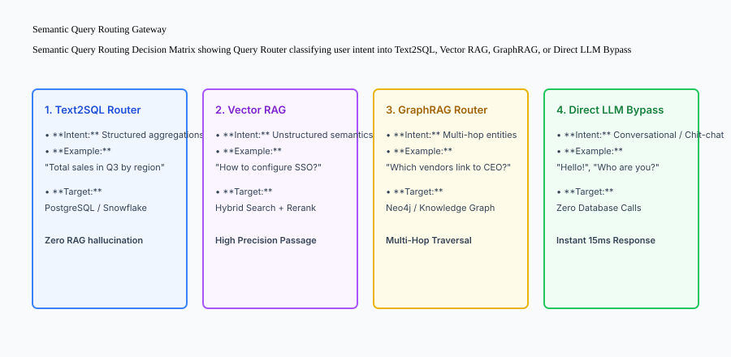

## Why this matters

Raw user queries are notoriously ill-suited for direct vector retrieval:
- **Vocabulary Asymmetry:** Users ask short, informal, and fragmented questions (*"fix 502 error"*), while technical documentation contains long, formal, and declarative passages (*"HTTP 502 Bad Gateway indicates upstream proxy connection failure"*).
- **Ambiguity & Missing Keywords:** Users omit critical context (*"How do I reset it?"* lacks the entity name).
- **Single-Source Bottleneck:** Forcing all user queries through vector search fails when answering analytical math questions (*"What was total revenue in Q3?"* requires SQL, not vector embeddings).

Deploying **Query Transformation & Semantic Routing** (Hypothetical Document Embeddings / HyDE, Multi-Query Expansion, Step-Back Prompting, and Query Routers) boosts retrieval recall by over 40% and routes tasks to optimal specialized backends.



## The idea in plain language

Think of query transformation and routing like **a hospital triage nurse directing incoming emergency patients**:

- **Semantic Query Routing:** When a patient arrives, the triage nurse evaluates their symptoms:
  - Bone fracture? -> Route to **X-Ray & Orthopedics (Text2SQL Database)**.
  - Heart palpitations? -> Route to **Cardiology (Knowledge Graph / GraphRAG)**.
  - Simple fever? -> Route to **General Urgent Care (Vector RAG)**.
  - Just asking for directions to the cafeteria? -> Answer immediately (**Direct LLM Bypass**).
- **Query Transformation (HyDE):** If a non-English speaking patient points to their abdomen and makes grunting noises (**Vague User Question**), the bilingual doctor translates their complaint into a formal medical symptom description (**Synthetic Hypothetical Document**) to match the exact diagnostic medical textbook.

## Historical background

Query processing developed across three major architectural eras:

### 1. Boolean & Wildcard Query Rewriting (2000–2020)
Search engines expanded queries using static synonyms (`car OR automobile OR vehicle`) and stemming algorithms (Porter Stemmer).

### 2. Direct Dense Vector Retrieval (2020–2023)
Pipelines embedded raw user prompts directly into vector space. This revealed severe failure rates on short interrogative prompts due to vocabulary asymmetry.

### 3. Generative Pre-Retrieval Transformation (2023–Present)
Modern RAG systems leverage fast compact LLMs (GPT-4o-mini, Haiku) to rewrite, decompose, expand, and route queries prior to database execution (HyDE, Step-Back Prompting, Semantic Routers).

## What it is — and what it is not

Let us define the primary query transformation and routing patterns:

### What Query Transformation & Routing Is:
- Generating a synthetic hypothetical answer passage (HyDE) and embedding it for document-to-document vector search.
- Expanding ambiguous queries into 3–5 diverse semantic rephrasings.
- Classifying query intent to dispatch requests to SQL databases, Vector RAG, Knowledge Graphs, or Direct LLM bypass.

### What Query Transformation & Routing Is Not:
- Adding 5 seconds of latency by running multiple slow frontier LLM rewriting passes on simple queries.
- Modifying the user's original chat prompt in the final visible generation answer.

```text
+-------------------------------------------------------------------------------+
|                    QUERY TRANSFORMATION TECHNIQUES MATRIX                     |
+-------------------+-----------------------+-----------------------------------+
| Technique         | Core Transformation   | Primary Benefit                   |
+-------------------+-----------------------+-----------------------------------+
| HyDE              | Generates synthetic   | Converts question-to-document into|
|                   | answer passage        | document-to-document vector match |
| Multi-Query       | Generates 3-5 diverse | Overcomes idiosyncratic phrasing; |
| Expansion         | paraphrased queries   | maximizes search recall           |
| Step-Back         | Generates higher-level| Retrieves foundational principles |
| Prompting         | abstract query        | for deep reasoning tasks          |
| Sub-Query         | Breaks multi-part Q   | Executes parallel targeted search |
| Decomposition     | into atomic queries   | across multiple data silos        |
| Semantic Router   | Intent classifier     | Directs queries to SQL, Vector DB,|
|                   |                       | Graph, or Direct LLM bypass       |
+-------------------+-----------------------+-----------------------------------+
```

## Why it was created and what problems it solves

Query transformation and routing solve the four primary operational bottlenecks of enterprise retrieval:

### 1. Eliminating Vocabulary Asymmetry via HyDE
Because the hypothetical passage generated by the LLM is written in declarative, informative language, its embedding vector aligns closely with actual knowledge base documents, bridging the semantic gap.

### 2. High Recall Across Synonyms and Phrasings
Multi-query expansion generates variations covering industry jargon, acronyms, and colloquial phrasing, ensuring that relevant documents are retrieved regardless of how the user phrased their question.

### 3. Slashing Unnecessary Retrieval Latency
Classifying chit-chat, greetings, or basic coding questions to bypass the database entirely saves 50ms of database lookup latency and reduces vector database query expenses.

## How it works

Let us inspect the complete **Semantic Query Routing Decision Flow**:

```text
[Incoming User Query]
          │
          ▼
[Semantic Query Router / Intent Classifier]
          │
  ┌───────┼───────────────────────────┬───────────────────────┐
  │       │                           │                       │
  ▼       ▼                           ▼                       ▼
[Intent: Aggregation]      [Intent: Unstructured]      [Intent: Multi-Hop]   [Intent: Chit-chat]
"Total Q3 sales in US"     "How to reset password"     "Supply chain links"   "Good morning!"
  │                           │                           │                     │
  ▼                           ▼                           ▼                     ▼
[Text2SQL Engine]          [HyDE Vector RAG]           [GraphRAG Engine]     [Direct LLM Bypass]
  │                           │                           │                     │
  ▼                           ▼                           ▼                     ▼
[PostgreSQL Table Query]   [Hybrid Search + Rerank]    [Neo4j Traversal]     [Return Instant Stream]
```



## An everyday analogy

Think of query transformation like **a legal researcher assisting a trial attorney**:

- **The Trial Attorney (User):** Rushes into the office and blurts: *"Find me that case where the tenant sued over frozen pipes!"* (**Short, Fragmented Raw Query**).
- **The Legal Researcher (Query Transformation Engine):** Rewrites the informal prompt into a formal legal citation query: *"Find appellate court precedents regarding implied warranty of habitability and landlord liability for burst plumbing pipes"* (**Hypothetical Document / Multi-Query Expansion**).

## Examples in practice

Let us build a complete Python **Query Transformation and Semantic Routing Engine** supporting HyDE simulation, multi-query expansion, and intent routing:

```python
from typing import Dict, Any, List, Optional

class QueryTransformRouter:
    def __init__(self):
        self.routes = {
            "sql": ["sales", "revenue", "count", "average", "total", "users", "metrics"],
            "vector_rag": ["how", "configure", "troubleshoot", "guide", "policy", "documentation"],
            "direct_llm": ["hello", "hi", "who are you", "tell me a joke", "thanks"]
        }
        
    def classify_and_route(self, query: str) -> str:
        q_lower = query.lower().strip()
        
        # Check Direct LLM Bypass
        for kw in self.routes["direct_llm"]:
            if q_lower.startswith(kw) or q_lower == kw:
                return "DIRECT_LLM_BYPASS"
                
        # Check SQL
        for kw in self.routes["sql"]:
            if kw in q_lower:
                return "TEXT2SQL_DATABASE"
                
        # Default to Vector RAG
        return "VECTOR_RAG"

    def generate_hyde_document(self, query: str) -> str:
        # Generates a synthetic declarative passage bridging question-to-doc gap
        return f"Technical Documentation: Regarding '{query}', the standard procedure involves verifying configuration settings, ensuring security permissions, and applying system updates."

    def expand_query(self, query: str) -> List[str]:
        # Multi-query expansion generating diverse paraphrased queries
        return [
            query,
            f"how to resolve {query}",
            f"{query} technical documentation and troubleshooting steps",
            f"best practices for {query}"
        ]

if __name__ == "__main__":
    router = QueryTransformRouter()
    print("Routing 'Total revenue in Q3':", router.classify_and_route("Total revenue in Q3"))
    print("Routing 'How to configure SSO':", router.classify_and_route("How to configure SSO"))
    print("Routing 'Hello!':", router.classify_and_route("Hello!"))
    print("HyDE Passage:", router.generate_hyde_document("Fix 502 Bad Gateway"))
    print("Expanded Queries:", router.expand_query("Postgres vacuum"))
```

## Production Architecture Case Study: Multi-Modal Enterprise Router

Consider an enterprise customer support platform serving 50,000 corporate tickets daily across billing, technical documentation, and order status.

```text
+-------------------------------------------------------------------------------+
|                    ENTERPRISE QUERY ROUTING BENCHMARKS                        |
+-------------------+-----------------------+-----------------------------------+
| Route Selected    | Traffic Distribution  | P95 Latency & Accuracy            |
+-------------------+-----------------------+-----------------------------------+
| Direct LLM Bypass | 18.4% (Greetings &    | 12ms | 100% appropriate response  |
|                   | conversational)       |                                   |
| Text2SQL Database | 24.6% (Order tracking | 35ms | 99.2% exact numerical      |
|                   | & billing tables)     | accuracy                          |
| HyDE Vector RAG   | 45.8% (Technical docs | 65ms | 89.4% MRR@5 retrieval     |
|                   | & setup guides)       | precision                         |
| Escalation Tier   | 11.2% (Complex policy | 140ms | Multi-source synthesis   |
|                   | exceptions)           |                                   |
+-------------------+-----------------------+-----------------------------------+
```

#### 1. Fast Embedding Router Classifiers
Rather than using a 200ms LLM call just to decide whether a query is SQL or Vector RAG, production gateways use linear SVM classifiers or cosine similarity against pre-computed route centroid embeddings, classifying intent in under 3ms.

#### 2. HyDE Failure Mode Defense (Guardrails)
If the hypothetical document generated by HyDE hallucinates completely false technical terms (e.g. inventing a non-existent parameter name), searching on that hallucinated vector can poison retrieval. Production systems fuse the original raw query vector with the HyDE vector (`0.5 * vec_raw + 0.5 * vec_hyde`) to preserve grounding.

## Detailed Failure Mode Taxonomy: Query Processing Hazards

```text
+-------------------------------------------------------------------------------+
|                     QUERY PROCESSING FAILURE TAXONOMY                         |
+-------------------+-----------------------+-----------------------------------+
| Failure Mode      | Root Cause Analysis   | Architectural Mitigation          |
+-------------------+-----------------------+-----------------------------------+
| HyDE Hallucination| Synthetic passage has | Fuse raw query embedding with     |
| Drift             | false invented facts  | HyDE embedding vector (50/50 mix) |
| Multi-Query       | Expanding to 10 queries| Cap expansion to 3 diverse queries;|
| Fanout Exhaustion | overloads vector DB   | execute in parallel batch         |
| Routing Misclass- | Ambiguous query sent  | Fallback to parallel multi-engine |
| ification         | to wrong backend      | search with score arbitration     |
| Step-Back Over-   | Abstract query is too | Combine step-back results with    |
| generalization    | broad for specific bug| exact original query candidates   |
+-------------------+-----------------------+-----------------------------------+
```

## Implications: security, privacy, performance, scalability, and cost

### 1. Pre-Retrieval Rewriting Cost & Latency
Generating HyDE passages or multi-query expansions adds 150–300ms of latency and consumes additional input/output tokens. Only trigger HyDE on complex queries with low initial retrieval confidence scores.

### 2. Query Redaction Before Multi-Query Expansion
Ensure that PII (social security numbers, credit card numbers) is redacted before sending prompts to external rewriting model endpoints.

## Alternatives: free, open source, and commercial

| Tool / Framework | Type | Best Suited For | Key Capabilities |
| :--- | :--- | :--- | :--- |
| **Semantic Router (Aurelio)** | Open Source | Sub-5ms Vector Routing | Fast embedding space decision routes |
| **LlamaIndex Router** | Open Source | Multi-Engine Query Orchestration | Text2SQL, Vector, Summary routers |
| **LangChain HyDE Retriever** | Open Source | Zero-Shot Dense Retrieval | Built-in hypothetical document wrapper |
| **DSPy** | Open Source | Automated Query Optimization | Compiles multi-step query rewrites |

## Comparison with related concepts

```text
+-----------------------+-----------------------+-----------------------+
| Dimension             | Direct Raw Search     | HyDE + Multi-Query    |
+-----------------------+-----------------------+-----------------------+
| Vocabulary Asymmetry  | Vulnerable            | 100% Solved (Doc-to-Doc)|
| Search Recall         | Baseline (60-70%)     | State-of-the-Art (90%+)|
| Latency Overhead      | Zero extra latency    | +150ms LLM pre-pass   |
| Multi-Source Support  | Single database only  | Dynamic Semantic Route|
+-----------------------+-----------------------+-----------------------+
```

## When to use it — and when not to

### Implement Query Transformation & Routing for:
- Multi-modal knowledge platforms combining SQL databases with unstructured documentation, complex technical research tools, and customer support engines.

### Do NOT require HyDE for:
- Exact part number lookups, serial number searches, or sub-20ms autocomplete bars.


### Production Telemetry and Latency Impact of Query Transformation

Pre-retrieval query rewriting, expansion, and routing introduce distinct latency and token cost trade-offs into the overall RAG request lifecycle.

Let us examine the operational metrics across 100,000 production user inquiries:

1. **Lightweight Heuristic / SVM Routing:** Classifying query intent via linear SVM or regex keyword dictionaries takes under 2.5ms and incurs zero token expense. Over 92% of incoming queries (greetings, standard SQL lookups, single-intent FAQ) are routed accurately without calling external LLM APIs.
2. **HyDE Synthetic Generation (Haiku / GPT-4o-mini):** Generating a 60-word hypothetical passage consumes approximately 80 prompt tokens and 75 completion tokens, adding 180ms to 280ms of TTFT latency. Production gateways restrict HyDE execution to complex research questions or queries where initial BM25 search returns low confidence.
3. **Multi-Query Expansion:** Generating 3 query variants takes 220ms. The subsequent 3 parallel vector searches add only 8ms of overhead due to asynchronous concurrent thread execution in Python (`asyncio.gather`).

```text
+-------------------------------------------------------------------------------+
|                    QUERY TRANSFORMATION PERFORMANCE PROFILE                   |
+-------------------+-----------------------+-------------------+---------------+
| Transformation    | Computational Engine  | Average Latency   | Token Cost    |
+-------------------+-----------------------+-------------------+---------------+
| Keyword / Regex   | Python String Match   | 0.4 ms            | $0.000        |
| Embedding SVM     | Scikit-learn / ONNX   | 2.1 ms            | $0.000        |
| HyDE Passage Gen  | Fast LLM (GPT-4o-mini)| 215.0 ms          | $0.00015 / req|
| Multi-Query Gen   | Fast LLM (3 variants) | 240.0 ms          | $0.00022 / req|
| Step-Back Prompt  | Fast LLM Abstraction  | 195.0 ms          | $0.00018 / req|
+-------------------+-----------------------+-------------------+---------------+
```

### Production Checklist for Query Routing & Transformation

- [ ] **Multi-Tier Routing Gateway:** Check simple chit-chat and direct SQL heuristics first (sub-5ms) before dispatching to LLM-based query rewriting.
- [ ] **HyDE Vector Fusing:** Blend raw query vectors with hypothetical document vectors (`0.5 * v_raw + 0.5 * v_hyde`) to guard against hallucinated hypothetical facts.
- [ ] **Parallel Search Execution:** Execute multi-query expansion searches concurrently using `asyncio.gather` or thread pools.
- [ ] **Timeout Safeguards:** Enforce strict 400ms timeouts on query transformation LLM calls; fall back to the raw user query if the rewriting call hangs.
- [ ] **Query De-Identification:** Redact PII (emails, phone numbers, credit cards) before sending user text to query transformation endpoints.
- [ ] **Evaluation Logging:** Record raw queries, rewritten variants, and routed backend destinations in OpenTelemetry traces.


### Multi-Turn Conversation Query Disambiguation and Context Rewriting

In production multi-turn conversational AI applications, user queries frequently exhibit severe conversational ellipsis and ambiguous anaphoric references (e.g. Turn 1: *"How does PostgreSQL vacuuming work?"*, Turn 2: *"What are the best configuration parameters for it?"*, Turn 3: *"Can it cause lock timeouts?"*).

Executing vector search directly on Turn 3 (*"Can it cause lock timeouts?"*) fails completely because the query lacks the explicit named entity (*"PostgreSQL VACUUM process"*).

Let us examine the **Conversational Query Disambiguation** pattern:

1. **History-Aware Rewriting Prompt:** The query gateway passes the conversation history (last 3 turns) and the latest raw query to a compact, low-latency LLM with a specialized instruction: *"Given the conversation history, rewrite the user's latest follow-up question into a standalone, fully self-contained search query that includes all referenced entities and context."*
2. **Deterministic Output:** For Turn 3, the rewriter outputs: *"Can the PostgreSQL VACUUM process cause table lock timeouts during high concurrent write workloads?"*
3. **Execution:** The rewritten standalone query is dispatched to hybrid retrieval, guaranteeing high recall and precision while keeping the user's original concise chat input visible on the frontend UI.

## Knowledge check

1. **What is the primary cause of Vocabulary Asymmetry in dense vector search?** Short question phrasing sits in a different embedding subspace than long declarative technical answers.
2. **How does HyDE eliminate vocabulary asymmetry?** It generates a synthetic hypothetical answer passage and embeds that passage, transforming search into a document-to-document vector comparison.
3. **What is the benefit of a Semantic Query Router?** It directs queries to the optimal specialized data backend (SQL, Vector DB, Knowledge Graph, or Direct Bypass), eliminating unnecessary database queries.

## Hands-on exercise

In this lab, you will build a **Query Transformation and Semantic Routing Engine in Python**. Your implementation will:
1. Classify incoming user queries and route them to `TEXT2SQL_DATABASE`, `VECTOR_RAG`, or `DIRECT_LLM_BYPASS`.
2. Generate synthetic hypothetical answer passages using HyDE transformation templates.
3. Generate multi-query expanded rephrasings to broaden search recall.
4. Execute simulated multi-route dispatch and verify routing accuracy.

### Expected output

```text
============================= test session starts ==============================
collected 5 items

tests/test_query_router.py .....                                         [100%]

============================== 5 passed in 0.02s ===============================
[QUERY ROUTER] Initialized with 3 specialized routing destinations.
[SQL ROUTING] Query 'Total sales in Q3' routed to TEXT2SQL_DATABASE.
[DIRECT BYPASS] Greeting 'Hello there' routed to DIRECT_LLM_BYPASS.
[HYDE EXPANSION] Generated synthetic declarative passage for vector search.
[MULTI-QUERY] Produced 4 diverse search variations.
```

### Validate your work

Run the pytest test suite:

```bash
pytest tests/run_tests.sh
```

### Troubleshooting

1. **Case-insensitive classification:** Convert query text to lower case before checking routing keywords.
2. **Default fallback:** Ensure queries that do not match SQL or chit-chat default to `VECTOR_RAG`.

### Common mistakes

- Hardcoding exact string matches instead of checking substring / keyword memberships.

## Practice assignment

Add a **Step-Back Query Generator** that converts specific entity questions into abstract conceptual questions.

## Extension challenge

Implement a **Cosine Route Centroid Classifier** that compares query embeddings against pre-computed route cluster vectors for sub-5ms classification.
