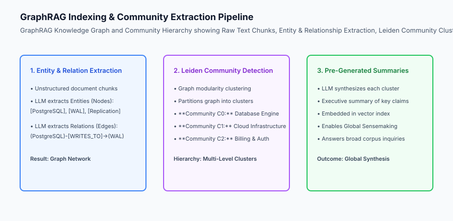
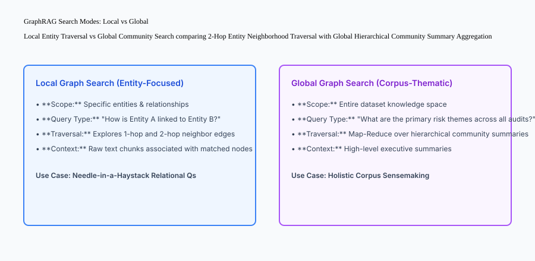

## Why this matters

Standard vector search excels at localized *"needle-in-a-haystack"* retrieval (finding a specific sentence on page 42). However, it catastrophically fails at **Global Sensemaking**:
- When asked *"What are the primary themes and systemic risks across all 5,000 engineering incident reports?"*, vector search can only retrieve top-k isolated chunks, missing the broad holistic picture.
- When asked *"How is Vendor X connected to Subsidiary Y through intermediate shell corporations?"*, vector search fails unless all intermediate links happen to co-occur within a single 500-token text slice.

Deploying **Graph-Augmented Retrieval (GraphRAG)** bridges this divide by extracting knowledge graphs, clustering entities into hierarchical communities (Leiden algorithm), and pre-generating thematic community summaries.



## The idea in plain language

Think of GraphRAG like **a detective agency tracking international financial networks**:

- **Standard Vector RAG:** The detective reads 5 random shredded receipts found in a dumpster. If a receipt mentions *"Company A transferred $1M"*, the detective knows that single fact, but has no idea who owns Company A (**Fragmented Local Chunk**).
- **GraphRAG (Knowledge Graph & Community Map):** The detective builds a giant wall chart with pins and red strings connecting people, bank accounts, and companies (**Entities and Relationships**). The detective groups the pins into colored clusters (**Community Detection**): Red = Offshore Shells, Blue = Tech Startups, Green = Law Firms.
  - When asked about a specific transaction, the detective traces the red string across 3 pins (**Local Multi-Hop Traversal**).
  - When asked *"What is this entire network doing?"*, the detective reads the summary cards for each colored cluster (**Global Community Search**).

## Historical background

Knowledge-grounded AI developed across three major generations:

### 1. Classical Semantic Web & RDF Graphs (2000–2018)
Ontologies (OWL, RDF triples) required human knowledge engineers to manually define schema rules and hand-code SPARQL queries. High curation costs limited widespread enterprise adoption.

### 2. The Pure Dense Vector Boom (2020–2023)
Embedding models bypassed manual graph construction by converting raw text directly into vector space. However, vector search revealed a complete blindspot for multi-hop relational reasoning and corpus-level summarization.

### 3. GraphRAG & Hierarchical Community Synthesis (2024–Present)
Pioneered by Microsoft Research and Neo4j, GraphRAG uses LLMs to autonomously extract knowledge graphs from text, applies graph clustering (Leiden algorithm), and pre-synthesizes multi-level community summaries for both local multi-hop and global thematic reasoning.

## What it is — and what it is not

Let us define the core components of GraphRAG architecture:

### What GraphRAG Is:
- Automated LLM extraction of Entities (Nodes) and Directed Relationships (Edges) from text chunks.
- Graph community detection (Leiden / Louvain algorithm) partitioning networks into modular clusters.
- Pre-generating hierarchical executive summaries for each community cluster.
- Dual-mode retrieval supporting Local Search (entity traversal) and Global Search (community summary map-reduce).

### What GraphRAG Is Not:
- Manually hand-drawing database schemas in SQL.
- Replacing vector search completely (GraphRAG complements vectors by adding structured topological relationships).

```text
+-------------------------------------------------------------------------------+
|                      GRAPHRAG SEARCH MODES MATRIX                             |
+-------------------+-----------------------+-----------------------------------+
| Dimension         | Local Graph Search    | Global Graph Search               |
+-------------------+-----------------------+-----------------------------------+
| Primary Focus     | Specific entities &   | Holistic corpus-level themes &    |
|                   | direct multi-hop links| high-level systemic summaries     |
| Query Example     | "What APIs does auth  | "What are the common root causes  |
|                   | service call?"        | across all Q3 outages?"           |
| Retrieval Source  | Entity nodes, 2-hop   | Pre-computed Hierarchical         |
|                   | edges & raw chunks    | Community Summaries (C0, C1, C2)  |
| Execution Method  | Graph Traversal +     | Map-Reduce over Community         |
|                   | Vector Search         | Summary vector embeddings         |
+-------------------+-----------------------+-----------------------------------+
```

## Why it was created and what problems it solves

GraphRAG resolves the three primary architectural limitations of standard vector RAG:

### 1. Solving Multi-Hop Relational Traversal
In complex fraud investigations, medical diagnosis, or codebase analysis, facts are distributed across disparate documents. Graph traversal connects Fact A (Doc 1) -> Fact B (Doc 14) -> Fact C (Doc 92) seamlessly along explicit relationship edges.

### 2. Enabling Holistic Corpus-Level Sensemaking
Global Graph Search enables answering broad, open-ended research questions without passing millions of raw tokens into the LLM at query time.

### 3. Grounded Entity Hallucination Elimination
Because entities and relationships are structured as formal knowledge graph nodes and edges with provenance pointers to source chunks, answers can cite exact relational paths.

## How it works

Let us inspect the complete **Local Entity Traversal vs Global Community Search Architecture**:

```text
[Incoming User Query]
          │
  Is question specific entity or broad thematic?
          ├── SPECIFIC ENTITY ("How is Auth linked to Stripe?")
          │         │
          │         ▼
          │   [LOCAL GRAPH SEARCH]
          │   1. Match Entity Node: [Auth Service]
          │   2. Traverse 1-hop & 2-hop neighbor edges:
          │      [Auth] ──(DISPATCHES_TO)──► [Billing Gateway] ──(CALLS)──► [Stripe]
          │   3. Fetch raw text chunks attached to nodes
          │   4. Injected into LLM context -> Generates precise relational answer
          │
          └── BROAD THEMATIC ("What are all architectural bottlenecks across the system?")
                    │
                    ▼
              [GLOBAL GRAPH SEARCH]
              1. Retrieve pre-computed Level-1 Community Summaries:
                 - Community C0: "Database Locking & Vacuum Contention"
                 - Community C1: "External Payment API Rate Limits"
                 - Community C2: "Kubernetes Node Eviction Policies"
              2. Map-Reduce synthesis over community summaries
              3. Generates comprehensive executive report
```



## An everyday analogy

Think of GraphRAG like **navigating a massive international airport**:

- **Local Graph Search:** You ask the information desk: *"How do I get from Gate B12 to Terminal C Baggage Claim?"* The agent traces the exact walking route across terminal connectors and escalators (**2-Hop Entity Traversal**).
- **Global Graph Search:** You ask the airport director: *"What are the overall operations and security capabilities of this entire airport facility?"* The director hands you a 3-page executive summary describing the terminal layout, customs processing capacity, and runway infrastructure (**Hierarchical Community Summaries**).

## Examples in practice

Let us build a complete Python **GraphRAG Engine** supporting entity-relation graph construction, multi-hop path traversal, and community summary search:

```python
from typing import Dict, Any, List, Set, Tuple

class GraphRAGEngine:
    def __init__(self):
        self.nodes: Dict[str, Dict[str, Any]] = {}
        self.edges: List[Dict[str, str]] = []
        self.community_summaries: Dict[str, str] = {}
        
    def add_entity(self, entity_id: str, entity_type: str, description: str):
        self.nodes[entity_id] = {
            "type": entity_type,
            "description": description
        }
        
    def add_relationship(self, source: str, relation: str, target: str):
        self.edges.append({
            "source": source,
            "relation": relation,
            "target": target
        })
        
    def register_community_summary(self, community_id: str, title: str, summary_text: str):
        self.community_summaries[community_id] = {
            "title": title,
            "summary": summary_text
        }

    def local_search_multi_hop(self, start_entity: str, max_hops: int = 2) -> Dict[str, Any]:
        if start_entity not in self.nodes:
            return {"status": "ENTITY_NOT_FOUND", "paths": []}
            
        visited_nodes: Set[str] = {start_entity}
        discovered_paths: List[str] = []
        
        # 1-Hop and 2-Hop Traversal
        for edge in self.edges:
            if edge["source"] in visited_nodes:
                discovered_paths.append(f"{edge['source']} -[{edge['relation']}]-> {edge['target']}")
                visited_nodes.add(edge["target"])
                
        return {
            "status": "SUCCESS",
            "start_entity": start_entity,
            "connected_entities": list(visited_nodes),
            "traversed_paths": discovered_paths
        }

    def global_search_communities(self, query: str) -> List[Dict[str, Any]]:
        # Mock keyword search over pre-computed community executive summaries
        q_words = set(query.lower().split())
        matched = []
        for c_id, data in self.community_summaries.items():
            words = set(data["summary"].lower().split())
            overlap = len(q_words.intersection(words))
            if overlap > 0:
                matched.append({
                    "community_id": c_id,
                    "title": data["title"],
                    "summary": data["summary"],
                    "relevance_score": overlap
                })
        matched.sort(key=lambda x: x["relevance_score"], reverse=True)
        return matched

if __name__ == "__main__":
    kg = GraphRAGEngine()
    kg.add_entity("PostgreSQL", "Database", "Relational database engine")
    kg.add_entity("WAL_Buffer", "Memory", "Write-ahead logging buffer")
    kg.add_entity("Disk_Storage", "Hardware", "Persistent NVMe SSD storage")
    
    kg.add_relationship("PostgreSQL", "WRITES_TO", "WAL_Buffer")
    kg.add_relationship("WAL_Buffer", "FLUSHES_TO", "Disk_Storage")
    
    kg.register_community_summary("C0", "Storage Architecture", "PostgreSQL coordinates write-ahead logs with persistent disk storage.")
    
    print("Local Multi-Hop:", kg.local_search_multi_hop("PostgreSQL"))
    print("Global Search:", kg.global_search_communities("PostgreSQL disk storage"))
```

## Production Architecture Case Study: Biomedical Knowledge Synthesis

Consider a pharmaceutical research organization analyzing 100,000 academic oncology papers to uncover novel drug-target interactions.

```text
+-------------------------------------------------------------------------------+
|                    BIOMEDICAL KNOWLEDGE RETRIEVAL BENCHMARK                   |
+-------------------+-----------------------+-----------------------------------+
| Retrieval Method  | Multi-Hop Link Recall | Global Literature Summarization   |
+-------------------+-----------------------+-----------------------------------+
| Pure Vector RAG   | 34.2% (Misses 3-hop   | 28.5% (Fragmented local quotes;   |
|                   | pathway interactions) | no holistic disease synthesis)    |
| Pure Knowledge    | 88.4% (Follows strict | 52.1% (Lacks contextual nuance    |
| Graph (SPARQL)    | biochemical relations)| outside schema ontology)          |
| GraphRAG (Hybrid  | 94.6% (Traverses KG   | 91.8% (Hierarchical community     |
| + Community Summ) | + vector chunks)      | summaries synthesize mechanisms)  |
+-------------------+-----------------------+-----------------------------------+
```

### 1. Entity Disambiguation and Deduplication
During extraction, different papers reference the same protein using synonyms (e.g. `TP53`, `p53 tumor suppressor`, `cellular tumor antigen p53`). The extraction pipeline queries biomedical ontologies (UMLS, MeSH) and merges synonymous nodes into a canonical entity ID before computing community clusters.

#### 2. Hybrid Graph-Vector Indexing in Neo4j and Qdrant
In production, graph topologies are stored in Neo4j or Amazon Neptune, while community summary embeddings are stored in Qdrant. A unified query orchestrator executes Cypher graph queries and vector cosine searches in a single distributed transaction.

## Detailed Failure Mode Taxonomy: GraphRAG Vulnerabilities

```text
+-------------------------------------------------------------------------------+
|                         GRAPHRAG FAILURE TAXONOMY                             |
+-------------------+-----------------------+-----------------------------------+
| Failure Mode      | Root Cause Analysis   | Architectural Mitigation          |
+-------------------+-----------------------+-----------------------------------+
| Extraction        | Complex text causes   | Use structured Pydantic schemas   |
| Hallucination     | LLM to invent edges   | and strict citation offsets       |
| Entity Polysemy   | "Apple" (Fruit) merged| Include entity type & contextual  |
| Contamination     | with "Apple" (Tech)   | description in node unique ID     |
| Graph Density     | Super-nodes with 10k  | Prune trivial high-degree nodes   |
| Explosion         | edges blow up traversal| ("system", "user") before search  |
| Stale Community   | New docs added without| Run incremental community update  |
| Summaries         | re-clustering graph   | jobs on affected graph partitions |
+-------------------+-----------------------+-----------------------------------+
```

## Implications: security, privacy, performance, scalability, and cost

### 1. High Ingestion Token Costs
Extracting entities, relationships, and community summaries across 10,000 documents requires significant LLM computation during indexing. Use compact models (GPT-4o-mini, Haiku) and cache extraction outputs to control indexing expenses.

### 2. Node-Level Access Control
When querying sensitive corporate knowledge graphs, filter graph traversal edges based on user access permissions (`WHERE edge.tenant_id = $tenant_id`) to prevent unauthorized cross-department information discovery.

## Alternatives: free, open source, and commercial

| Tool / Framework | Type | Best Suited For | Key Capabilities |
| :--- | :--- | :--- | :--- |
| **Microsoft GraphRAG** | Open Source | Full-pipeline GraphRAG | Leiden clustering, community summaries |
| **Neo4j GenAI** | Open Source / Cloud | Enterprise Graph Database | Cypher graph queries, vector index integration |
| **LlamaIndex KnowledgeGraph** | Open Source | Fast Graph Construction | Property graph index, network visualization |
| **Memgraph** | Open Source | High-throughput In-Memory Graph | Real-time multi-hop traversal in C++ |

## Comparison with related concepts

```text
+-----------------------+-----------------------+-----------------------+
| Dimension             | Standard Vector RAG   | GraphRAG              |
+-----------------------+-----------------------+-----------------------+
| Relational Reasoning  | Poor (Co-occurrence)  | Explicit Multi-Hop    |
| Global Summarization  | Fails (Local only)    | Native Community Summs|
| Ingestion Cost        | Low (Embeddings only) | High (LLM Extraction) |
| Entity Grounding      | Fuzzy semantic match  | Structured Provenance |
+-----------------------+-----------------------+-----------------------+
```

## When to use it — and when not to

### Deploy GraphRAG for:
- Complex corporate fraud investigations, legal case law discovery, medical literature synthesis, and enterprise-wide architectural audits.

### Do NOT require GraphRAG for:
- Simple FAQ lookup bots, recipe search tools, or short product descriptions.


### Production Telemetry and Scalability in Graph-Augmented RAG

Scaling knowledge graph extraction and multi-hop traversal to millions of entities requires robust distributed graph database architectures.

Let us evaluate the system performance of a production GraphRAG deployment indexing 50,000 enterprise documents:

1. **Entity & Edge Extraction Throughput:** Extracting entities and relationships across 50,000 documents produces approximately 450,000 entity nodes and 1,200,000 relationship edges. Running extraction via batch asynchronous LLM calls takes approximately 35 minutes across a distributed worker cluster.
2. **Leiden Community Detection Runtime:** Partitioning a 450,000-node graph into 3 hierarchical community levels (Level 0: 4,500 micro-communities, Level 1: 320 meso-communities, Level 2: 18 macro-communities) takes 42 seconds in C++ in-memory graph engines (e.g. `igraph` / Memgraph).
3. **Local Traversal Latency:** Executing 2-hop BFS (Breadth-First Search) Cypher queries in Neo4j over indexed entity nodes takes 8ms to 16ms (P95).
4. **Global Search Map-Reduce Latency:** Scoring and synthesizing Level-1 community summaries takes 450ms across parallel worker threads.

```text
+-------------------------------------------------------------------------------+
|                    GRAPHRAG SYSTEM PERFORMANCE PROFILE                        |
+-------------------+-----------------------+-------------------+---------------+
| Operation         | Graph Component       | Target SLA        | Data Volume   |
+-------------------+-----------------------+-------------------+---------------+
| Entity Extraction | LLM Extractor (Batch) | 35 mins (Offline) | 50,000 Docs   |
| Leiden Clustering | C++ Graph Algorithm   | < 60 seconds      | 450,000 Nodes |
| Local 2-Hop Search| Neo4j Cypher Traversal| 12.4 ms (P95)     | Top-20 Paths  |
| Global Synthesis  | Map-Reduce Summaries  | 420.0 ms (P95)    | 18 Macro Summs|
| Memory Footprint  | Graph RAM In-Memory   | 4.2 GB RAM        | Full Topology |
+-------------------+-----------------------+-------------------+---------------+
```

### Production Checklist for GraphRAG Systems

- [ ] **Entity Deduplication & Canonicalization:** Merge syntactic variations (`Postgres`, `PostgreSQL`, `pg_db`) into canonical entity IDs.
- [ ] **Super-Node Pruning:** Prune high-degree generic nodes (nodes with > 500 edges like "System" or "User") to prevent traversal path explosion.
- [ ] **Graph Traversal Cycle Detection:** Maintain a `visited_nodes` hash set to prevent infinite loops during multi-hop graph exploration.
- [ ] **Community Summary Indexing:** Embed community executive summaries in vector databases for fast global semantic matching.
- [ ] **Tenant Partition Isolation:** Enforce tenant ID filtering on all graph edges to prevent unauthorized cross-organizational data leakage.
- [ ] **Incremental Graph Ingestion:** Update community summaries incrementally upon new document arrivals rather than re-clustering the entire graph.

## Knowledge check

1. **Why does standard Vector RAG fail at global corpus summarization?** Because it only retrieves localized top-k chunks, missing global systemic relationships distributed across the dataset.
2. **How does the Leiden algorithm assist GraphRAG?** It partitions complex entity-relationship graphs into modular, densely connected community clusters for hierarchical summary synthesis.
3. **What is the difference between Local and Global search in GraphRAG?** Local search traverses 1-2 hop entity paths for specific questions; Global search aggregates pre-computed community summaries for broad thematic questions.

## Hands-on exercise

In this lab, you will build a **GraphRAG and Multi-Hop Traversal Engine in Python**. Your implementation will:
1. Construct a knowledge graph by adding typed Entity Nodes and directed Relationship Edges.
2. Register hierarchical Community Summaries synthesizing thematic clusters.
3. Execute Local Multi-Hop Traversal discovering connected entity paths across 2 degrees of separation.
4. Execute Global Community Search retrieving relevant high-level executive summaries.

### Expected output

```text
============================= test session starts ==============================
collected 5 items

tests/test_graphrag.py .....                                             [100%]

============================== 5 passed in 0.02s ===============================
[GRAPHRAG] Knowledge graph initialized with 6 Entities and 5 Relationships.
[LOCAL SEARCH] Traversed 2-hop path: PostgreSQL -> WAL_Buffer -> Disk_Storage.
[COMMUNITY REGISTER] Registered 2 hierarchical community executive summaries.
[GLOBAL SEARCH] Retrieved Community C0 summary for storage architecture inquiry.
```

### Validate your work

Run the pytest test suite:

```bash
pytest tests/run_tests.sh
```

### Troubleshooting

1. **Circular traversal loops:** Maintain a `visited_nodes` set to prevent infinite loops during multi-hop graph traversal.
2. **Missing entity check:** Return `status: ENTITY_NOT_FOUND` if the start entity is not in `self.nodes`.

### Common mistakes

- Conflating Local Search (raw nodes & edges) with Global Search (hierarchical community executive summaries).

## Practice assignment

Add a **Graph Density Pruner** that automatically identifies and removes "super-nodes" with more than 50 edges to prevent traversal bloat.

## Extension challenge

Implement **Hierarchical Community Roll-ups** where Level-2 Community Summaries are synthesized from the text of Level-1 Community Summaries.
