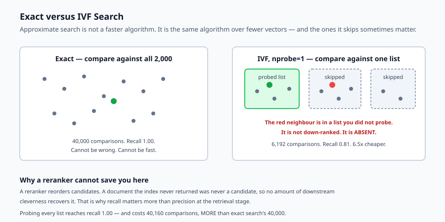
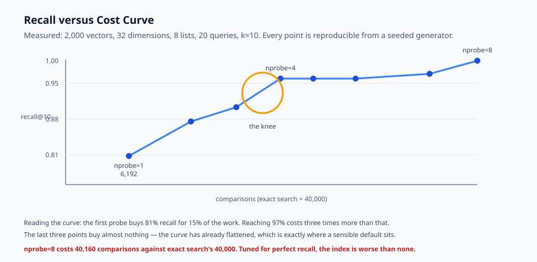

## Why this matters

Exact search is simple, correct, and linear. For a thousand documents that is fine — comparing a query against every vector takes microseconds and nobody notices. For ten million it is a different program.

The reflex is to reach for a vector database and enable an approximate index, on the understanding that it is "faster". That framing hides the actual decision. An approximate index is not faster in the way a better algorithm is faster. It is faster because **it does not look at everything**, and the documents it does not look at sometimes contain the answer.

So the real question is never "how do I make retrieval fast". It is: *how much recall am I willing to lose, and what does that buy me?* That is a product decision wearing an infrastructure costume, and it is routinely made by accident — by accepting a library's defaults and never measuring what they cost.

Today you measure it yourself. You will build exact search, build an approximate index, sweep its tuning parameter, and produce the recall-versus-cost curve for your own data. Once you have seen that curve, the defaults stop being mysterious.



## The idea in plain language

Exact nearest-neighbour search compares the query to every vector. It cannot be wrong and it cannot be fast.

Approximate nearest-neighbour search compares the query to *some* of the vectors, chosen so they are probably the relevant ones. It is fast because the set is small, and it is approximate because "probably" is doing real work in that sentence.

Every ANN method is a different answer to the same question: which vectors can I skip without skipping the answer?

- **Partition** the space into lists and search the nearest few. That is IVF, and it is what you will build.
- **Build a graph** of neighbours and walk it greedily toward the query. That is HNSW, and it dominates in practice.
- **Compress the vectors** so more of them fit in cache and each comparison is cheaper. That is quantisation, and it composes with the other two.

They share a tuning knob: search more, get better recall, pay more. The knob has different names — `nprobe`, `efSearch`, `ef` — and the same meaning. **There is no setting that is fast and exact**, and a great deal of confusion comes from hoping otherwise.

## Historical background

### k-d trees and the curse of dimensionality, 1970s

Early spatial indexes worked beautifully in two or three dimensions and degraded to worse-than-linear beyond roughly twenty. In high dimensions almost every point is roughly equidistant from every other, so pruning stops pruning. Embeddings live at 384 to 4096 dimensions, which is why classical spatial indexes play no part in this story.

### Locality-sensitive hashing, 1998

Indyk and Motwani gave the first practical high-dimensional approach with provable guarantees: hash so that nearby points collide. LSH proved approximation was the way forward, and was eventually overtaken on practical benchmarks by graph methods.

### Inverted files and product quantisation, 2010-2011

Jégou and colleagues at INRIA combined an inverted-file partition with product quantisation, making billion-scale search feasible on modest hardware. This lineage became FAISS, which Meta released in 2017 and which still underpins a large share of production systems.

### HNSW, 2016

Malkov and Yashunin's hierarchical navigable small-world graphs gave better recall-latency trade-offs than anything before, and became the default in most vector databases. Its cost is memory: the graph itself is substantial.

### The vector database era, 2019 onward

Pinecone, Weaviate, Qdrant, Milvus and pgvector packaged these algorithms behind APIs. The packaging is genuinely valuable and has one side effect worth naming: the recall trade-off became a configuration default rather than a deliberate choice, and defaults are rarely tuned for anyone in particular.

## What it is — and what it is not

Scaling retrieval is making search stay fast and affordable as the corpus grows, by deliberately trading exactness for work avoided.

### What it is

It is a **measured trade-off**. The only way to know what an index setting costs you is to compare it against exact search on your own data.

It is **workload-specific**. The right setting depends on the shape of your embeddings, your k, and how much a miss costs. Someone else's benchmark is a hint, not an answer.

It is a **cost decision**. Below a few hundred thousand vectors, exact search on modern hardware is often perfectly adequate, and much simpler to operate.

### What it is not

It is not free. Every ANN index loses recall relative to exact search. An index tuned to lose none is doing all the work exact search does, plus overhead — as today's lab demonstrates numerically.

It is not the same as making retrieval *good*. An approximate index returns a subset of what exact search would return. If exact search returns the wrong documents, ANN returns fewer wrong documents faster.

It is not only about latency. Memory is frequently the binding constraint: HNSW's graph can exceed the vectors it indexes.

## Why it was created and what problems it solves

**Linear scan stops fitting the latency budget.** At ten million vectors of 768 dimensions, one exact query is roughly 7.7 billion multiply-adds. Optimised libraries make that survivable; it does not fit in a 50 ms budget alongside everything else a request must do. *Solution: skip most of the corpus.*

**Memory becomes the wall before compute does.** Ten million 768-dimensional float32 vectors are about 30 GB. *Solution: quantisation — 8-bit scalar quantisation cuts that fourfold, product quantisation far more, each with its own recall cost.*

**Tail latency, not mean latency, is what users feel.** A p50 of 20 ms with a p99 of 900 ms is a system people describe as slow. Graph methods have more variable traversal than partition methods. *Solution: measure percentiles, and be aware that the fastest mean is not always the best experience.*

**Nobody knows what recall they actually have.** The most common failure in this area is not a slow system; it is a system whose recall nobody has ever measured. *Solution: keep an exact-search baseline on a sample, and measure recall against it continuously.*



## How it works

An IVF index has two phases.

**Build.** Cluster the vectors into `nlist` groups, typically with k-means, and record a centroid per group. Every vector belongs to exactly one list. This is why the index must be rebuilt or incrementally maintained as the corpus changes — a point that connects directly to Day 325.

**Search.** Compare the query against every *centroid* — cheap, because there are `nlist` of them, not `n`. Take the `nprobe` closest lists, and compare the query against only the vectors inside them.

The recall loss has one specific cause, and it is worth stating precisely: **a true nearest neighbour sitting in a list you did not probe is invisible.** Not down-ranked — absent. It cannot be recovered by a reranker, because it was never a candidate.

The cost has two parts: `nlist` centroid comparisons, always paid, plus however many vectors live in the probed lists. At `nprobe = nlist` you pay both in full, which is why full-probe search costs *more* than exact search rather than the same. The lab measures this.

HNSW differs in mechanism — a greedy walk over a neighbour graph, with `efSearch` controlling how many candidates stay in play — but the shape of the trade-off is identical.

## An everyday analogy

Think of finding a book in a large library.

Exact search is reading every spine in the building. You will certainly find the book. You will not do it before closing time.

IVF is the subject sections. Each section has a sign — the centroid — and you walk to the sign that best matches what you want, then scan only that section. Fast, and it works because libraries are organised by topic, exactly as embeddings cluster by meaning.

The failure mode is precise and familiar: a book shelved under Sociology when you searched History is not merely harder to find. You will not find it, because you never entered that section. Checking three sections instead of one improves your odds and takes three times as long.

And checking every section is strictly worse than reading every spine — you did all the same reading, plus the walking.

## Examples in practice

Here is the actual measured output from today's lab: 2,000 vectors of 32 dimensions in 8 clusters, 20 queries, `k=10`.

```text
exact search cost: 40000 comparisons
nprobe=1  recall@10=0.81 comparisons=6192   speedup=6.5x
nprobe=2  recall@10=0.88 comparisons=12051  speedup=3.3x
nprobe=3  recall@10=0.90 comparisons=16325  speedup=2.5x
nprobe=4  recall@10=0.97 comparisons=20474  speedup=2.0x
nprobe=8  recall@10=1.00 comparisons=40160  speedup=1.0x
```

Several things in that table are worth dwelling on.

**The first probe is enormously cheap and already quite good.** 81 percent recall for 15 percent of the work. For many applications — a retrieval stage feeding a reranker that will see fifty candidates anyway — that is a perfectly reasonable trade.

**The curve is not linear.** Going from `nprobe=1` to `nprobe=4` costs three times more work and buys 16 points of recall. Going from 4 to 8 doubles the work again for the final 3 points. The knee is around `nprobe=3` or `4`, and knees are where sensible defaults live.

**Full probe costs more than exact search.** 40,160 comparisons against 40,000. Those extra 160 are the centroid comparisons — 8 per query across 20 queries. This is the honest ceiling of the whole technique: *an ANN index configured for perfect recall is strictly worse than not having one.* If you find yourself raising `nprobe` until recall hits 1.0, you have discovered that your corpus does not need an ANN index.

**Recall is averaged, and averages hide things.** 0.90 mean recall might be every query returning nine of ten, or it might be eighteen queries returning ten and two returning zero. Those are very different products, and only the distribution tells them apart.

## Implications: security, privacy, performance, scalability, and cost

**Security.** Approximate indexes are shared structures. In a multi-tenant system, one tenant's vectors sitting in a probed list can leak through timing or through result contamination if filtering is applied after retrieval rather than before. Partition by tenant, or filter during traversal — not afterwards.

**Privacy.** Deleting a vector from a graph index is harder than deleting a row. Many implementations tombstone rather than remove, and the vector remains in the structure until a compaction. For a right-to-erasure request that is not sufficient, and it needs checking rather than assuming.

**Performance.** Recall, latency and memory form a triangle in which you choose two. Quantisation trades recall for memory; higher `efSearch` trades latency for recall. Measure the percentiles, not the mean.

**Scalability.** Beyond one machine, sharding means every query fans out to every shard and results merge. This raises tail latency — a query is as slow as its slowest shard — and interacts badly with recall, since each shard returns its own approximate top-k.

**Cost.** The dominant costs are memory and rebuild. Below roughly a million vectors, exact search with a numeric library is often cheaper end-to-end than operating an ANN index, once the rebuild pipeline and its failure modes are counted. That threshold is worth measuring before assuming.

## Alternatives: free, open source, and commercial

**Exact search with NumPy.** A matrix multiply against the corpus. Trivially correct, no index, no rebuild. Viable to a few hundred thousand vectors, and it is the baseline every recall measurement needs.

**FAISS** — MIT-licensed, from Meta. The reference implementation of IVF, PQ and their combinations. Powerful, and a library rather than a service: you own persistence and updates.

**hnswlib** — Apache-2.0, small and fast, HNSW only. An excellent choice when you want the algorithm without a database.

**pgvector** — PostgreSQL extension, PostgreSQL-licensed, with IVFFlat and HNSW. The strongest default when your data is already in Postgres, because it removes an entire system from the architecture.

**Qdrant, Weaviate, Milvus** — open-source vector databases (Apache-2.0), with filtering, persistence and clustering. Choose them when you need those features, not for the ANN algorithm itself, which is broadly the same everywhere.

**Pinecone and other managed services** — remove the operational burden, add a per-vector cost and a dependency.

The honest default: start with exact search, measure when it stops fitting the budget, then adopt pgvector or hnswlib and *measure the recall you gave up*.

## Comparison with related concepts

**IVF versus HNSW.** IVF partitions and is cheap to build with modest memory; HNSW builds a graph, generally gives better recall-latency trade-offs, and costs substantially more memory. HNSW is the usual default; IVF remains attractive at very large scale where memory dominates.

**Approximate search versus reranking.** Retrieval decides the candidate set; reranking reorders it. A reranker cannot rescue a document the index never returned — which is why recall at the retrieval stage matters more than precision there.

**Quantisation versus dimensionality reduction.** Quantisation keeps the dimensions and stores each less precisely. Reduction keeps precision and discards dimensions. Both lose information; quantisation usually loses less for the same saving.

**Recall versus precision.** In this stage recall dominates. A missed document is unrecoverable; an extra irrelevant candidate is merely work for the next stage.

## When to use it — and when not to

**Use an approximate index when** exact search no longer fits the latency budget, when memory forces compression, or when the corpus is large enough that linear scan cost is a meaningful part of your bill.

**Stay exact when** the corpus is under a few hundred thousand vectors, when recall must be provably complete — some compliance searches genuinely require this — or when you are still changing the embedding model. Every change to embeddings invalidates the index, and rebuilding one repeatedly while iterating is a poor use of time.

**Always keep an exact baseline on a sample**, whichever you choose. It is the only way to answer "what is our recall?", and that question always eventually gets asked.

## Knowledge check

1. Why can a reranker not recover a document that an approximate index failed to return?
2. Full-probe IVF search cost 40,160 comparisons against exact search's 40,000. Where do the extra 160 come from, and what does that imply?
3. Why would uniformly random vectors make an IVF index look far worse than it is on real embeddings?
4. A sweep reports 0.90 mean recall at some setting. What might that hide?
5. Why does the lab count vector comparisons rather than measuring elapsed time?

## Hands-on exercise

You will implement exact search, an IVF index, and the recall measurement that compares them — then sweep the tuning parameter and read your own curve.

Open `starter/retrieval.py` in the lab directory and implement the stubbed functions, then run the tests.

### Expected output

Running `python3 examples/retrieval_demo.py` produces:

```text
corpus=2000 dim=32 queries=20 k=10 nlist=8
exact search cost: 40000 comparisons
nprobe=1  recall@10=0.81 comparisons=6192   speedup=6.5x
nprobe=2  recall@10=0.88 comparisons=12051  speedup=3.3x
nprobe=3  recall@10=0.90 comparisons=16325  speedup=2.5x
nprobe=4  recall@10=0.97 comparisons=20474  speedup=2.0x
nprobe=5  recall@10=0.97 comparisons=23575  speedup=1.7x
nprobe=6  recall@10=0.97 comparisons=27527  speedup=1.5x
nprobe=7  recall@10=0.98 comparisons=34559  speedup=1.2x
nprobe=8  recall@10=1.00 comparisons=40160  speedup=1.0x
recall>=0.90: nprobe=3 (2.5x cheaper than exact)
recall>=0.95: nprobe=4 (2.0x cheaper than exact)
recall>=0.99: nprobe=8 (1.0x cheaper than exact)
```

The last line is the one to sit with. Reaching 99 percent recall required probing every list, which cost *more* than exact search. On this corpus, at that recall target, the index is not worth having.

Every number above is deterministic — the vectors come from a seeded generator — so your run should match exactly. If it does not, your clustering or your comparison counting differs from the reference.

### Validate your work

Run `bash tests/run_tests.sh`. All seventeen tests must pass. They are grouped by claim, so a failure names the property that broke.

Then check two things by inspection. Confirm recall never falls as `nprobe` rises — a non-monotonic curve means your candidate collection is wrong. And confirm that `nprobe=nlist` gives exactly recall 1.0; anything less means your partitioning is losing vectors entirely.

### Troubleshooting

**Recall at full probe is below 1.0.** Your build is not assigning every vector to a list, or search is deduplicating candidates incorrectly. `test_ivf_assigns_every_vector_to_exactly_one_list` isolates this.

**Recall goes down as `nprobe` goes up.** You are taking the *furthest* centroids rather than the nearest. Check the sort direction.

**Full probe costs the same as exact rather than more.** You are not counting the centroid comparisons. They are real work and must be counted, because they are exactly what makes full-probe worse than brute force.

**Every recall is 1.0 at every setting.** Your corpus is too small or too tightly clustered for any list to be missed. Increase the corpus or the number of lists.

### Common mistakes

Measuring wall-clock time instead of comparisons and getting noisy, unreproducible numbers on a laptop.

Testing on uniformly random vectors, where partitioning cannot help and IVF looks far worse than it is on real embeddings.

Reporting mean recall only. Two queries returning nothing hide comfortably inside a healthy-looking average.

Forgetting that the index must be rebuilt as the corpus changes — an index is a derived structure with exactly the freshness problems Day 325 described.

## Practice assignment

Add **per-query recall reporting** to the sweep: not just the mean, but the minimum and the count of queries scoring below 0.5.

Then find a setting where the mean recall looks acceptable but at least one query scores zero, and write a test asserting that this situation is detected. The point is that a mean is a summary, and summaries are where bad tail behaviour goes to hide.

## Extension challenge

Implement **scalar quantisation**: store each vector component as an 8-bit integer scaled to the component's observed range, and search on the quantised vectors.

Measure three things honestly — the memory saved, the recall lost relative to unquantised IVF at the same `nprobe`, and whether the two compose the way you expected. Then answer a specific question with your data: at what corpus size does quantised IVF beat exact search on both memory and comparisons?

If the answer on this corpus is "never, it is too small", that is a legitimate and useful finding. Report it rather than tuning the fixture until the technique looks good.
