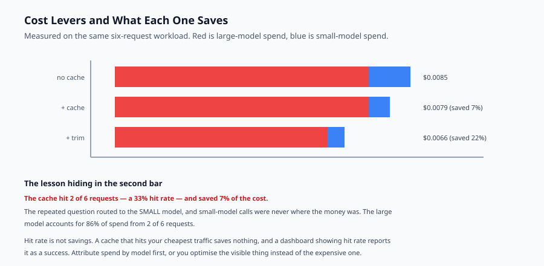

## Why this matters

A traditional web request costs so little that nobody accounts for it individually. You size servers, watch a bill, and move on. An AI request is different: it has a *per-unit* cost you can compute before you make it, and that cost varies by more than an order of magnitude depending on choices you control.

This changes the engineering. Cost stops being an infrastructure concern discovered monthly and becomes a design parameter you reason about per request — closer to bandwidth in an embedded system than to CPU in a web application.

The failure it produces is distinctive. A feature works beautifully in development, where you make forty requests. It goes to a thousand users making twenty requests each, and the monthly bill arrives with a number nobody predicted, because nobody had computed the per-request cost and multiplied.

Worse is the unbounded case. A retry loop against a paid API has no natural stopping point. A prompt-injection attack that makes your agent call itself recursively is a denial-of-*wallet* attack, and it is available to anyone who can reach your endpoint.

Today you build the accounting that makes cost visible, the levers that reduce it, and the cap that bounds the worst case.



## The idea in plain language

Cost engineering for AI systems rests on one equation and four levers.

The equation: **cost per request × expected volume = your bill**. Both halves need measuring. A total tells you nothing on its own; a per-request figure multiplied by realistic volume tells you whether a feature is viable.

The four levers, roughly in the order they pay off:

**Cache.** An exact repeat costs nothing. Cheapest possible win, and often a large share of real traffic.

**Tier.** Route easy work to a cheaper model. Most requests do not need the expensive one, and sending everything there is the most common source of avoidable spend.

**Trim.** Send less context. Input tokens are cheaper than output tokens, but you send far more of them, so context size usually dominates the input side.

**Cap.** Refuse or degrade rather than overspend. This is the lever teams skip, and the only one that bounds the worst case.

## Historical background

### Metered computing, 2006 onward

Cloud computing made infrastructure a per-unit cost and created FinOps as a discipline: tagging, attribution, showback, budgets and alerts. Every concept in this lesson has a direct ancestor there. What changed is granularity — a single API call now has a price you can compute in advance.

### The token-pricing model, 2020 onward

The GPT-3 API established per-token pricing with input and output charged at different rates. That asymmetry is not an accident: generation is sequential and cannot be batched the way prefill can, so output costs several times more per token. It has shaped every optimisation since.

### Prompt caching, 2023-2024

Providers began offering discounts on repeated prefixes, since a cached prefix skips recomputation of the attention keys and values. This made *prompt structure* an economic decision: stable content first, variable content last, so the cache prefix is as long as possible.

### Small models get good, 2023 onward

Distillation and better training made small models genuinely capable on routine tasks. Tiering stopped being a compromise and became the default architecture: a cheap model handles most traffic, an expensive one handles what it cannot.

## What it is — and what it is not

Cost engineering is designing an AI system so its unit economics are known, controlled and bounded.

### What it is

It is **measurement first**. You cannot optimise what you have not attributed, and the attribution must be per model and per stage, not a single total.

It is a **design-time activity**. The largest cost decisions — how much context to retrieve, which model, whether to cache — are architectural, and expensive to revisit later.

It is a **safety concern**. An unbounded spend path is an availability risk and an abuse vector, not merely a budgeting inconvenience.

### What it is not

It is not micro-optimisation. Shaving ten tokens off a system prompt while routing every request to the largest model is optimising the wrong end by three orders of magnitude.

It is not the same as latency optimisation, though they often align. Caching helps both; batching helps cost and *hurts* latency.

It is not a one-off exercise. Prices change, models change, and your traffic mix changes. The measurement has to be continuous.

## Why it was created and what problems it solves

**Nobody knows the per-request cost.** Solved by a ledger that records every call with its model, tokens and cost, so spend can be attributed rather than merely observed.

**Everything goes to the largest model.** Solved by routing: classify the request and send it to the cheapest model that can do the job.

**Context grows without bound.** Retrieval returns twenty chunks, all are sent, and input cost scales with them. Solved by a token budget for context, with chunks kept in priority order.

**Spend is unbounded in the worst case.** A retry loop, a recursive agent, or a hostile user can spend arbitrarily. Solved by a hard cap checked *before* the call, with degradation before refusal.

**Cost is discovered monthly.** Solved by projecting: cost per request multiplied by expected volume, computed at design time and put in the document where the decision is made.



## How it works

**Account.** Every model call records model, input tokens, output tokens and cost into a ledger. Cache hits are recorded too, as zero-cost calls — recording them as *absences* hides the hit rate exactly when you want it.

**Estimate before you spend.** Count tokens from the text before calling. The estimate is approximate — real tokenisers are model-specific — so cap on the estimate and reconcile afterwards against the provider's reported usage. Checking cost after the call is an audit, not a control.

**Route.** Classify the request. A short factual question goes to the small model; anything requiring reasoning or exceeding a length threshold goes to the large one. Even a crude heuristic captures most of the benefit, because the traffic mix is usually lopsided.

**Trim.** Give context a token budget and fill it in priority order, stopping at the first chunk that does not fit rather than skipping ahead to a smaller one. Contiguity in relevance matters more than packing the budget full.

**Cap, and degrade before refusing.** Below a threshold, behave normally. Past it, downgrade large-model requests to the small model — a cheaper answer beats no answer. At the cap, refuse. All three states should be observable.

**Project.** Divide total by requests, multiply by expected volume. That number belongs in the design document, not in a retrospective.

## An everyday analogy

Think of a taxi with a visible meter, rather than a monthly transport budget.

Before the meter, you knew transport cost *something* and found out how much at the end of the month. With a meter you can see the cost of *this* journey accumulating, which changes decisions in flight: you notice the scenic route costs three times the direct one.

Caching is realising you already made this exact journey today and have the destination written down.

Tiering is taking the bus for a short predictable trip and the taxi only when you genuinely need one. Most trips are bus trips; the mistake is taking taxis everywhere because one journey needed it.

Trimming is not asking the driver to circle the block while you finish a phone call.

And the cap is the passenger who says "stop at forty pounds". Without it, an unfamiliar city and a driver on a meter is unbounded spend — which is exactly what a retry loop against a paid API is.

## Examples in practice

Here is the measured output from today's lab. Six requests, three of them the same question, run four ways:

```text
no cache, full ctx     calls=6 cached=0 total=$0.0085  per_request=$0.00141
                       by model: large=$0.0073, small=$0.0012
cache, full ctx        calls=6 cached=2 total=$0.0079  per_request=$0.00131
                       by model: cache=$0.0000, large=$0.0073, small=$0.0006
cache, trimmed ctx     calls=6 cached=2 total=$0.0066  per_request=$0.00109
                       by model: cache=$0.0000, large=$0.0061, small=$0.0005
tight budget           STOPPED: request would cost $0.0036, only $0.0009 left
```

The most instructive line is the second, and it is instructive because it is *disappointing*.

**The cache hit two of six requests — a 33 percent hit rate — and saved 7 percent of the cost.** That looks like a broken cache. It is not. The repeated question was "What is the refund window?", which routes to the small model. Caching it saved three small-model calls, and small-model calls were never where the money was. The large model accounts for $0.0073 of $0.0085 — 86 percent of spend from two of six requests.

This is the single most useful lesson in the topic: **hit rate is not savings.** A cache that hits your cheapest traffic is a cache that saves nothing, and a dashboard reporting hit rate will show it as a success. Attribute spend by model before optimising, or you will optimise the visible thing rather than the expensive one.

Trimming context helped more than caching here — $0.0079 to $0.0066 — because it reduced input tokens on the *large*-model calls, which is where the cost lived.

And the projection:

```text
projection at 1M requests: $1,092 (from $0.00109 per request)
```

That number is the point of the exercise. It belongs in a design document before the feature ships, where it can inform a decision, rather than in a retrospective after the invoice.

## Implications: security, privacy, performance, scalability, and cost

**Security.** Unbounded spend is an attack surface. A prompt injection that induces recursive tool calls, or a scripted client hammering an expensive endpoint, is a denial-of-wallet attack. Per-user rate limits and per-request caps are security controls, not just budgeting.

**Privacy.** Caching stores prompts and responses, which are user content. A shared cache keyed only on prompt text can leak one user's data to another when prompts collide. Key on tenant as well as content, and apply the same retention rules you apply to any user data.

**Performance.** Caching improves cost and latency together. Batching improves cost and *worsens* latency, because requests wait to be grouped. Smaller models improve both. Know which trade-off each lever is making.

**Scalability.** Per-request cost is fixed; the bill scales linearly with traffic. This is unlike servers, where load can be amortised. There is no economy of scale in tokens, which is why per-request cost matters so much more here.

**Cost.** Output tokens dominate per token, but you usually send far more input than you receive output, so context size typically dominates the total. Measure rather than assume — the balance depends entirely on your workload.

## Alternatives: free, open source, and commercial

**Provider dashboards** — every API vendor offers spend reporting. Useful for the bill, useless for attribution: they cannot tell you which feature or which tenant spent it.

**LiteLLM** — open source, MIT-licensed. A proxy across providers with per-key budgets, logging and rate limits. The pragmatic answer when you want caps without building them.

**Langfuse** and **Helicone** — open-source observability with cost tracking per trace, so spend can be attributed to a feature or a user.

**Self-hosted open models** — Ollama or vLLM converts a per-token cost into a fixed hardware cost. Below some volume that is worse; above it, dramatically better. The crossover deserves an actual calculation.

**Semantic caching** — cache on embedding similarity rather than exact match, so near-duplicate questions hit. Much higher hit rates and a real correctness risk: two questions that embed similarly may need different answers.

The honest default: build the ledger yourself so you own the attribution, and adopt a proxy such as LiteLLM when you need caps across multiple services.

## Comparison with related concepts

**Cost engineering versus FinOps.** FinOps is organisational — attribution, budgets, accountability. Cost engineering is what an engineer does inside the request path. You need both, and this lesson is the second.

**Caching versus prompt caching.** Application caching stores whole responses. Provider prompt caching discounts repeated *prefixes* within a call. They compose, and prompt caching rewards putting stable content first.

**Tiering versus fine-tuning.** Tiering routes to a cheaper existing model. Fine-tuning makes a small model better at your specific task, so more traffic can be routed down. Fine-tuning has an upfront cost that a volume calculation must justify.

**Cost per request versus cost per user.** A user makes many requests, and heavy users are not average. Per-request cost sizes the system; per-user cost prices the product, and the distribution matters more than the mean.

## When to use it — and when not to

**Invest in cost engineering when** the feature will see real volume, when spend is externally triggered — anything a user can cause is something an attacker can cause — when you are choosing between models or between hosted and self-hosted, or when anyone has asked "what will this cost at scale?".

**Keep it light when** you are prototyping with a handful of requests, or when the workload is genuinely low-volume and internal. A ledger is still worth having — it is a dozen lines — but routing, tiering and semantic caching are machinery you do not yet need.

**Always add the cap**, even in a prototype. It is the cheapest lever to build and the only one that bounds the worst case, and prototypes have a way of becoming accessible to the internet.

## Knowledge check

1. A cache achieves a 33 percent hit rate and saves 7 percent of spend. Explain how both figures can be correct, and what it tells you.
2. Why must a budget check happen before the call rather than after?
3. Output tokens cost more per token than input tokens. Why might input still dominate your bill?
4. What is a denial-of-wallet attack, and which lever bounds it?
5. Why does a cache keyed only on prompt text create a privacy problem in a multi-tenant system?

## Hands-on exercise

You will build the ledger, the router, the context trimmer and the budget cap, then measure what each lever saves on the same workload.

Open `starter/costs.py` in the lab directory and implement the stubbed functions, then run the tests.

### Expected output

Running `python3 examples/costs_demo.py` runs six requests four ways:

```text
workload: 6 requests, 3 of them the same question
no cache, full ctx     calls=6 cached=0 total=$0.0085  per_request=$0.00141
                       by model: large=$0.0073, small=$0.0012
cache, full ctx        calls=6 cached=2 total=$0.0079  per_request=$0.00131
                       by model: cache=$0.0000, large=$0.0073, small=$0.0006
cache, trimmed ctx     calls=6 cached=2 total=$0.0066  per_request=$0.00109
                       by model: cache=$0.0000, large=$0.0061, small=$0.0005
tight budget           STOPPED: request would cost $0.0036, only $0.0009 left
tight budget           calls=2 cached=0 total=$0.0006  per_request=$0.00030
                       by model: small=$0.0006
projection at 1M requests: $1,092 (from $0.00109 per request)
```

Compare the second row against the first. Two cache hits out of six requests bought a 7 percent saving, because the repeated question was the cheap one. Then compare the third: trimming context saved more, because it acted on the large-model calls where 86 percent of the spend lived.

### Validate your work

Run `bash tests/run_tests.sh`. All twenty tests must pass, grouped by lever so a failure names the broken control.

Then confirm two behaviours by inspection. Set a budget so small that the first large-model request cannot fit: spend must stop at or below the cap, never exceed it. And check the `by model` line — if a cache hit is missing from the ledger entirely rather than appearing at zero cost, your hit rate is invisible.

### Troubleshooting

**Spend exceeds the budget.** You are checking the cap after adding the call to the ledger. Check `spent() + cost > budget` before recording anything.

**The cache never hits.** Your key does not include the trimmed context, or includes something that varies between calls. Two identical prompts with identical context must produce the same key.

**Everything routes to the large model.** Your heuristic matches too eagerly — check that the reasoning words are matched as substrings of a lowered prompt, not as an exact equality.

**`unit_economics` divides by zero.** Zero requests is a normal state on a fresh ledger. Return zeros.

### Common mistakes

Reporting a total without attribution. A total tells you the bill; only per-model attribution tells you where to act.

Treating a cache hit as an absence rather than a zero-cost call, which makes the hit rate invisible in the ledger.

Pricing an unknown model at zero instead of raising. That is how a new model silently escapes accounting.

Optimising the cheap path because it is the visible one. Attribute first.

## Practice assignment

Add **per-tenant budgets**. Give each request a tenant id, track spend per tenant, and enforce a per-tenant cap alongside the global one.

Then write two tests: one proving that a tenant exhausting their budget cannot affect another tenant's ability to make requests, and one proving that the global cap still binds even when no individual tenant has exhausted theirs. The first is isolation; the second is that per-tenant limits do not sum to a safe global limit.

## Extension challenge

Implement **semantic caching**: cache on embedding similarity rather than exact match, using a simple hand-written similarity over bag-of-words vectors, with a tunable threshold.

Then measure the trade-off honestly across a workload containing near-duplicate questions that need the *same* answer and near-duplicate questions that need *different* answers. Report the hit rate, the cost saved, and — crucially — the number of wrong answers served at each threshold.

There will be a threshold where savings look excellent and the wrong-answer count is unacceptable. Find it and report it. A caching strategy that is cheap and wrong is worse than no cache, and the only way to know is to measure the errors alongside the savings.
