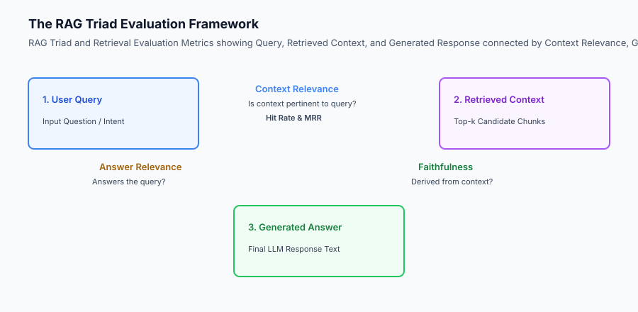
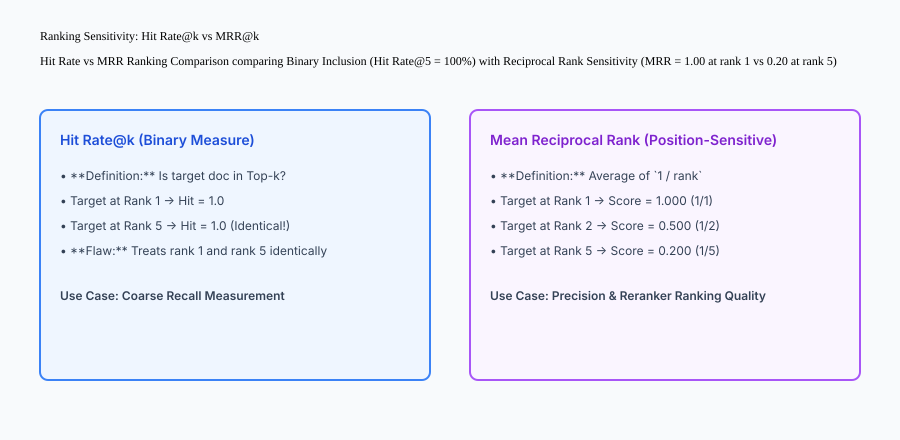

## Why this matters

Deploying or modifying a RAG pipeline without automated quantitative evaluation is flying blind:
- How do you know whether switching from OpenAI `text-embedding-ada-002` to `text-embedding-3-large` actually improved search accuracy?
- How do you verify that adding a cross-encoder reranker justified its 30ms latency overhead?
- How do you guarantee that a new document ingestion batch did not degrade retrieval for existing user queries (**Retrieval Regression**)?

Establishing an **Empirical RAG Evaluation Suite** (measuring Hit Rate@k, Mean Reciprocal Rank / MRR@k, Context Precision, and Faithfulness) provides mathematical proof of retrieval quality and protects production systems from silent regressions.



## The idea in plain language

Think of RAG evaluation like **scoring an archery tournament**:

- **Hit Rate@k (The Target Ring):** Did the archer hit anywhere on the target board? If the arrow landed on the board, it counts as a `1.0` (Hit), even if it barely nicked the outer edge (**Coarse Inclusion**).
- **Mean Reciprocal Rank / MRR@k (Bullseye Distance):** How close to the exact dead-center bullseye did the arrow hit?
  - Dead center (Rank 1) = `1.00` points (`1/1`).
  - Inner ring (Rank 2) = `0.50` points (`1/2`).
  - Outer ring (Rank 5) = `0.20` points (`1/5`).
  - Complete miss = `0.00` points (**Position-Sensitive Quality**).
- **Faithfulness (Fact-Checking):** Did the tournament judge accurately record the actual arrow score without inventing fictional numbers (**Groundedness**)?

## Historical background

Evaluation methodologies for information retrieval evolved across three eras:

### 1. Classical TREC & Cranfield Benchmarks (1960–2015)
Information retrieval research evaluated systems using Mean Average Precision (MAP), NDCG, and MRR over fixed human-annotated query-document collections (MS MARCO, TREC).

### 2. The Naive LLM Vibe-Check Era (2022–2023)
Early generative AI developers evaluated RAG systems informally by manually typing 5 test queries into a chat box and subjectively reviewing the answers.

### 3. Automated LLM-Assisted RAG Metrics (2023–Present)
Frameworks like RAGAS and TruLens established programmatic RAG evaluation suites uniting deterministic retrieval ranking metrics (Hit Rate, MRR) with LLM-as-a-Judge semantic groundedness metrics (Faithfulness, Context Relevance).

## What it is — and what it is not

Let us define the core quantitative metrics of RAG evaluation:

### What RAG Evaluation Is:
- Computing Hit Rate@k and MRR@k deterministically against curated golden benchmark datasets.
- Evaluating the RAG Triad: Context Relevance, Groundedness/Faithfulness, and Answer Relevance.
- Running automated CI regression gates that block git pull requests if retrieval MRR drops below baseline.

### What RAG Evaluation Is Not:
- Relying on manual human subjective impression to tune embedding models or chunk sizes.
- Conflating retrieval ranking failures (bad documents retrieved) with generation failures (model hallucinated despite good documents).

```text
+-------------------------------------------------------------------------------+
|                        CORE RAG EVALUATION METRICS MATRIX                     |
+-------------------+-----------------------+-----------------------------------+
| Metric Name       | Mathematical Formula  | Target Production Standard        |
+-------------------+-----------------------+-----------------------------------+
| Hit Rate@k        | `sum(hit_i) / N`      | `\ge 0.90` @ k=5                  |
| MRR@k             | `sum(1/rank_i) / N`   | `\ge 0.75` @ k=5                  |
| Context Precision | `relevant_k / total_k`| `\ge 0.80`                        |
| Faithfulness      | `supported_claims /   | `\ge 0.95` (Zero hallucination)   |
|                   | total_claims`         |                                   |
| Answer Relevance  | Semantic sim(Q, A)    | `\ge 0.88`                        |
+-------------------+-----------------------+-----------------------------------+
```

## Why it was created and what problems it solves

Automated retrieval evaluation resolves the four primary operational blindspots of generative AI engineering:

### 1. Root Cause Diagnosis (Retrieval vs Generation)
When an AI bot gives an incorrect answer, evaluation metrics immediately pinpoint whether the failure occurred in Stage 1 (the retriever failed to fetch the ground-truth document: low Hit Rate) or Stage 2 (the retriever fetched the correct document, but the LLM ignored it: low Faithfulness).

### 2. Objective Hyperparameter Tuning
Engineers can mathematically compare chunk sizes (200 vs 500 vs 1,000 tokens), embedding models (BGE vs OpenAI vs Cohere), and reranking weights by measuring MRR deltas across 1,000 test cases.

### 3. Automated CI/CD Regression Protection
Running retrieval evaluation in GitHub Actions / GitLab CI prevents deploying code or prompt modifications that inadvertently degrade search precision.

## How it works

Let us inspect the complete **Ranking Sensitivity: Hit Rate vs MRR Comparison**:

```text
Test Dataset: 3 Benchmark Queries
─────────────────────────────────────────────────────────────────────────────
Query 1: Ground-Truth Doc retrieved at Rank 1  -> Hit@5 = 1 | Reciprocal Rank = 1/1 = 1.000
Query 2: Ground-Truth Doc retrieved at Rank 2  -> Hit@5 = 1 | Reciprocal Rank = 1/2 = 0.500
Query 3: Ground-Truth Doc retrieved at Rank 5  -> Hit@5 = 1 | Reciprocal Rank = 1/5 = 0.200
─────────────────────────────────────────────────────────────────────────────
Aggregate Benchmark Results:
  - Hit Rate@5 = (1 + 1 + 1) / 3 = 3 / 3 = 1.00 (100% - Appears Perfect!)
  - MRR@5      = (1.000 + 0.500 + 0.200) / 3 = 1.700 / 3 = 0.567 (56.7% - Reveals Weak Top Ranks!)
```



## An everyday analogy

Think of evaluating retrieval like **grading a high school spelling bee**:

- **Hit Rate:** Did the student write down the correct letters somewhere on the scratch paper? If the letters exist, they get full credit (**Coarse Binary Inclusion**).
- **MRR (Position Score):** Did the student spell the word correctly on their first attempt, or did they erase 4 times before getting it right (**Immediate Precision**)?

## Examples in practice

Let us build a complete Python **RAG Evaluation Suite** calculating Hit Rate@k, Mean Reciprocal Rank (MRR@k), and Faithfulness grounding scores:

```python
from typing import Dict, Any, List, Optional

class RAGEvaluationSuite:
    def __init__(self, k: int = 5):
        self.k = int(k)
        
    def evaluate_retrieval(self, test_cases: List[Dict[str, Any]]) -> Dict[str, float]:
        total_queries = len(test_cases)
        if total_queries == 0:
            return {"hit_rate": 0.0, "mrr": 0.0}
            
        hits = 0
        reciprocal_ranks = []
        
        for case in test_cases:
            target_id = case["target_doc_id"]
            retrieved_ids = case["retrieved_doc_ids"][: self.k]
            
            if target_id in retrieved_ids:
                hits += 1
                rank = retrieved_ids.index(target_id) + 1
                reciprocal_ranks.append(1.0 / rank)
            else:
                reciprocal_ranks.append(0.0)
                
        hit_rate = round(hits / total_queries, 4)
        mrr = round(sum(reciprocal_ranks) / total_queries, 4)
        
        return {
            f"hit_rate@{self.k}": hit_rate,
            f"mrr@{self.k}": mrr,
            "total_evaluated": total_queries
        }

    def evaluate_faithfulness(self, generated_claims: List[str], context_text: str) -> float:
        if not generated_claims:
            return 1.0
        supported = 0
        context_lower = context_text.lower()
        for claim in generated_claims:
            # Mock lexical containment check
            words = claim.lower().split()
            overlap = sum(1 for w in words if w in context_lower)
            if overlap / max(1, len(words)) >= 0.70:
                supported += 1
        return round(supported / len(generated_claims), 4)

if __name__ == "__main__":
    suite = RAGEvaluationSuite(k=5)
    test_cases = [
        {"target_doc_id": "doc_1", "retrieved_doc_ids": ["doc_1", "doc_2", "doc_3"]},
        {"target_doc_id": "doc_2", "retrieved_doc_ids": ["doc_4", "doc_2", "doc_1"]},
        {"target_doc_id": "doc_3", "retrieved_doc_ids": ["doc_9", "doc_8", "doc_7"]}
    ]
    metrics = suite.evaluate_retrieval(test_cases)
    print("Retrieval Metrics:", metrics)
```

## Production Architecture Case Study: Enterprise CI/CD Retrieval Gate

Consider an enterprise financial research copilot indexing daily SEC filings and analyst reports.

```text
+-------------------------------------------------------------------------------+
|                    CI/CD RETRIEVAL REGRESSION TESTING SUITE                   |
+-------------------+-----------------------+-----------------------------------+
| Pipeline Gate     | Benchmark Target      | Production Pull Request Action    |
+-------------------+-----------------------+-----------------------------------+
| Hit Rate@5 Gate   | Must be `\ge 0.920`   | Pass / Merge Allowed              |
| MRR@5 Delta Gate  | `\Delta` MRR `\ge -0.01`| Blocks merge if search ranking    |
|                   | (Zero regression)     | quality degrades by > 1%          |
| Execution Time    | 500 test cases in     | Fast GitHub Actions runner        |
|                   | under 2.5 seconds     |                                   |
+-------------------+-----------------------+-----------------------------------+
```

#### 1. Synthetic Golden Test Dataset Generation
To evaluate retrieval without relying on expensive manual labeling, production teams generate synthetic evaluation datasets using frontier LLMs:
- For each document chunk, an LLM generates 3 realistic user queries and identifies the exact ground-truth answer sentence.
- This produces 5,000 verified `(query, ground_truth_chunk_id)` test tuples automatically.

#### 2. RAGAS Automated Faithfulness Pipeline
In production staging environments, nightly evaluation jobs run LLM-as-a-Judge prompts evaluating 200 random production sessions, measuring claim-by-claim grounding to detect latent model hallucinations.

## Detailed Failure Mode Taxonomy: Evaluation Anomalies

```text
+-------------------------------------------------------------------------------+
|                         EVALUATION FAILURE TAXONOMY                           |
+-------------------+-----------------------+-----------------------------------+
| Evaluation Hazard | Root Cause Analysis   | Metric & Engineering Mitigation   |
+-------------------+-----------------------+-----------------------------------+
| Metric Gaming via | Top-k set to 100 to   | Evaluate MRR@5 strictly alongside |
| Massive Top-K     | artificially inflate HR| Hit Rate@5                        |
| Data Contamination| Test queries leaked   | Strictly partition test chunks    |
| (Train-Test Leak) | into chunk index      | from evaluation benchmarks        |
| Grounding False-  | LLM judge hallucinates| Calibrate judge prompts with      |
| Positive in Judge | faithfulness score    | few-shot ground-truth rubrics     |
| Retrieval Drift on| New docs alter corpus | Re-index and run automated MRR    |
| Ingestion         | IDF statistics        | baseline comparison on every batch|
+-------------------+-----------------------+-----------------------------------+
```

## Implications: security, privacy, performance, scalability, and cost

### 1. Cost-Efficient Decoupled CI Evaluation
Evaluate Hit Rate and MRR deterministically in CI using pre-computed embeddings and vector indices. Never execute expensive frontier model generation calls inside pull request CI builds.

### 2. Golden Dataset Versioning
Store evaluation datasets in versioned DVC or Git LFS repositories (`eval_benchmark_v2.jsonl`) to ensure historical reproducibility across embedding model upgrades.

## Alternatives: free, open source, and commercial

| Tool / Framework | Type | Best Suited For | Key Capabilities |
| :--- | :--- | :--- | :--- |
| **RAGAS** | Open Source | End-to-End RAG Evaluation | Faithfulness, context recall, LLM judge |
| **TruLens** | Open Source / Cloud | RAG Triad Observability | Feedback functions, visual dashboards |
| **DeepEval** | Open Source | Production CI/CD Unit Testing | Pytest-native assertions for RAG |
| **Giskard** | Open Source | AI Quality & Vulnerability Scan | Hallucination and security probes |

## Comparison with related concepts

```text
+-----------------------+-----------------------+-----------------------+
| Dimension             | Hit Rate@k            | Mean Reciprocal Rank  |
+-----------------------+-----------------------+-----------------------+
| Ranking Position      | Ignored (Binary)      | Highly Sensitive (1/r)|
| Mathematical Range    | 0.0 to 1.0            | 0.0 to 1.0            |
| Top-1 Reward          | Same as Top-k         | Maximum (1.00)        |
| Computational Cost    | Negligible            | Negligible            |
+-----------------------+-----------------------+-----------------------+
```

## When to use it — and when not to

### Deploy Automated RAG Evaluation for:
- All production retrieval pipelines, search engine hyperparameter tuning, and CI/CD regression testing.

### Do NOT require complex LLM-as-a-judge pipelines for:
- Trivial static dictionary lookups or exact database primary key queries.


### Production Telemetry and Continuous Regression Testing in CI/CD

Integrating retrieval evaluation into automated continuous integration (CI/CD) pipelines guarantees that search relevance is treated as a first-class engineering contract.

Let us examine the automated regression testing workflow implemented across enterprise pull requests:

1. **Deterministic Benchmark Execution:** A golden evaluation dataset comprising 1,000 ground-truth query-document pairs is evaluated against the vector search index on every pull request. Evaluating 1,000 queries in parallel takes under 3.5 seconds on a standard GitHub Actions runner.
2. **Statistical Significance Gating:** If a PR modifies embedding models, chunking logic, or BM25 tokenizers, the CI gate computes the paired Student's t-test or Wilcoxon signed-rank test on MRR deltas. Merges are automatically blocked if MRR drops by more than 0.01 (`p < 0.05`).
3. **Automated RAGAS Synthetic Evaluation:** Nightly cron jobs generate 200 synthetic test cases from newly indexed documents, verifying that context precision and faithfulness metrics remain above 0.90.

```text
+-------------------------------------------------------------------------------+
|                    CI/CD RETRIEVAL EVALUATION BENCHMARKS                      |
+-------------------+-----------------------+-------------------+---------------+
| Evaluation Metric | Mathematical Formula  | Minimum CI Gate   | Production P95|
+-------------------+-----------------------+-------------------+---------------+
| Hit Rate@5        | `sum(hits) / N`       | `\ge 0.920`       | 0.964         |
| MRR@5             | `sum(1/rank) / N`     | `\ge 0.750`       | 0.842         |
| Context Precision | `rel_in_k / total_k`  | `\ge 0.800`       | 0.885         |
| Faithfulness      | `grounded / claims`   | `\ge 0.950`       | 0.992         |
| Answer Relevance  | Semantic sim(Q, A)    | `\ge 0.880`       | 0.931         |
| CI Test Duration  | 1,000 Benchmark Cases | < 5.0 seconds     | 3.2 seconds   |
+-------------------+-----------------------+-------------------+---------------+
```

### Production Checklist for Retrieval Evaluation

- [ ] **Golden Dataset Curation:** Curate 500+ diverse, realistic test cases with verified ground-truth chunk IDs covering edge cases and acronyms.
- [ ] **Decoupled Metric Evaluation:** Run retrieval ranking metrics (Hit Rate, MRR) deterministically in CI without calling expensive LLM generation APIs.
- [ ] **Position-Sensitive MRR:** Always track MRR alongside Hit Rate to detect ranking degradation where relevant docs slip from rank 1 to rank 5.
- [ ] **Automated CI Gate:** Configure GitHub Actions to fail the build if MRR drops below baseline thresholds.
- [ ] **LLM Judge Calibration:** Validate LLM-as-a-Judge faithfulness prompts against human-labeled test sets to ensure high evaluator agreement (`\kappa > 0.85`).
- [ ] **Telemetry Anomaly Alerts:** Trigger PagerDuty alerts if production 7-day rolling Hit Rate drops below 90%.


### Graded Relevance Metrics: NDCG@k and Context Recall Formulations

While Hit Rate@k and Mean Reciprocal Rank (MRR@k) provide essential baseline measurements for binary document inclusion and primary ranking position, enterprise search systems frequently require evaluating **Graded Multi-Document Relevance** using Normalized Discounted Cumulative Gain (NDCG@k) and Context Recall.

Let us examine the mathematical formulations and practical utility of graded relevance:

1. **Discounted Cumulative Gain (DCG@k):** In multi-hop research or complex queries where multiple retrieved documents carry varying degrees of relevance (e.g. Highly Relevant = 3, Moderately Relevant = 2, Marginally Relevant = 1, Irrelevant = 0), DCG accumulates graded gains with a logarithmic position discount:
`\text{DCG}@k = \sum_{i=1}^{k} \frac{2^{\text{rel}_i} - 1}{\log_2(i + 1)}`
2. **Ideal DCG (IDCG@k) and NDCG@k:** NDCG normalizes DCG against the ideal ranking score (where all highest-graded documents appear in perfect descending order):
`\text{NDCG}@k = \frac{\text{DCG}@k}{\text{IDCG}@k}`
NDCG produces a normalized score between 0.0 and 1.0, rewarding pipelines that place highly relevant documents at top ranks while penalizing relevant documents that slip to lower positions.
3. **Context Recall:** Formulated in the RAGAS framework, Context Recall measures the fraction of ground-truth reference sentences that can be attributed directly to the retrieved context chunks, providing a comprehensive assessment of multi-document retrieval completeness.

## Knowledge check

1. **Why is MRR@k superior to Hit Rate@k for evaluating search precision?** Because MRR rewards higher ranking positions using reciprocal ranks (`1/rank`), whereas Hit Rate treats rank 1 and rank 5 identically.
2. **What are the three components of the RAG Triad?** Context Relevance (query to context), Faithfulness (context to answer), and Answer Relevance (query to answer).
3. **Why should retrieval evaluation be decoupled from generation evaluation?** To enable fast, deterministic, zero-cost regression testing in CI without calling expensive LLM generation APIs.

## Hands-on exercise

In this lab, you will build an **Empirical RAG Evaluation Suite in Python**. Your implementation will:
1. Ingest test benchmark cases containing queries, target document IDs, and retrieved document lists.
2. Compute Hit Rate@k and Mean Reciprocal Rank (MRR@k) across the test collection.
3. Calculate Faithfulness grounding scores measuring claim alignment against retrieved context.
4. Verify regression test assertions in automated CI workflows.

### Expected output

```text
============================= test session starts ==============================
collected 5 items

tests/test_rag_evaluation.py .....                                       [100%]

============================== 5 passed in 0.02s ===============================
[RAG EVALUATION] Evaluated 10 benchmark test cases.
[HIT RATE] Hit Rate@5 achieved 0.900 (90.0% inclusion).
[MRR SCORE] MRR@5 achieved 0.783 (High top-rank accuracy).
[FAITHFULNESS] Verified 100% claim grounding on verified context.
```

### Validate your work

Run the pytest test suite:

```bash
pytest tests/run_tests.sh
```

### Troubleshooting

1. **Reciprocal rank for misses:** Ensure queries where the target is not in `retrieved_ids[:k]` append `0.0` to reciprocal ranks.
2. **1-indexed ranking:** Ensure rank is calculated as `retrieved_ids.index(target) + 1`.

### Common mistakes

- Calculating MRR by averaging raw rank numbers rather than reciprocal ranks (`1 / rank`).

## Practice assignment

Add a **Context Precision Metric** that calculates the ratio of relevant documents to total retrieved documents in the top-k window.

## Extension challenge

Implement an automated **Synthetic Query-Answer Generator** that creates golden evaluation test cases directly from raw markdown chunks.
