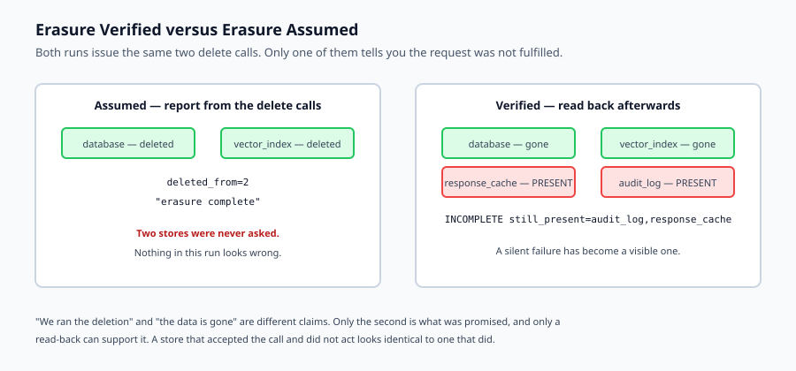

## Why this matters

A retrieval system is a machine for copying data. A document arrives, is extracted into text, split into chunks, embedded into vectors, written to an index, cached in a response, and logged in a trace. One record has become six, in six different stores, with six different retention policies — most of which nobody chose deliberately.

Now someone exercises their right to erasure. You delete the row from the database and reply confirming it is done.

It is not done. The chunks are in the vector index. The response is in the cache. The prompt and completion are in yesterday's observability trace. The extracted text is in an object store nobody has looked at since the migration. Every one of those is still personal data, still retrievable, and still capable of appearing in an answer.

This is the defining privacy problem of AI systems, and it is not primarily a legal problem. It is an architectural one: **the data multiplied, and the deletion did not.**

Today is about the three controls that address it — redact at the boundary, track where data flows, and verify that deletion landed — with an emphasis on the third, because it is the one that fails silently.



## The idea in plain language

Three controls, in the order they pay off.

**Minimise, then redact.** Data you never collected cannot leak, cannot be subpoenaed, and does not need deleting. Data you must collect should have identifiers replaced at the boundary — before it fans out — with stable pseudonyms, so records remain linkable for debugging without carrying the identity.

**Track the flow.** Maintain an explicit record of which stores hold data for which subject. This sounds bureaucratic until the first erasure request, at which point it is the difference between an answer and a guess.

**Verify the erasure.** Issue the deletes, then *read back* and confirm the subject is gone from every store. Reporting success because the delete calls returned is not verification, and it is exactly how a compliance failure looks from the inside: entirely normal.

The asymmetry worth internalising: over-redaction costs a little utility and is recoverable. Under-redaction is a disclosure and is not.

## Historical background

### Data protection law, 1995 onward

The EU Data Protection Directive, and the GDPR that replaced it in 2018, established the principles this lesson implements: purpose limitation, data minimisation, storage limitation, and the right to erasure under Article 17. California's CCPA and CPRA created comparable obligations in the United States. The engineering vocabulary — subject, controller, processor, purpose — comes from here.

### Anonymisation and its limits, 2000s

Latanya Sweeney showed in 2000 that 87 percent of the US population was uniquely identifiable from ZIP code, birth date and sex alone. The Netflix Prize dataset was de-anonymised in 2008 by correlation with public IMDb ratings. The lesson, learned repeatedly since: **removing names does not anonymise data.** Combinations of ordinary attributes identify people.

### Differential privacy, 2006

Dwork and colleagues gave the first rigorous definition of privacy loss, with a measurable budget. It is the strongest tool available and is genuinely hard to apply to free text, which is why most production systems use redaction and access control instead — an engineering compromise worth naming honestly rather than pretending otherwise.

### Memorisation and extraction, 2019 onward

Carlini and colleagues demonstrated that language models memorise and can be induced to emit training data verbatim, including personal information. Related work showed **embedding inversion**: recovering substantial content from an embedding vector. This closed off a comfortable assumption — that a vector is a harmless numeric artefact — and it is the reason a vector index must be treated as a store of personal data.

## What it is — and what it is not

Privacy engineering for AI systems is designing so that personal data is collected minimally, transformed early, tracked deliberately, and deletable provably.

### What it is

It is **architectural**. Where redaction happens determines how far identifiers travel, and that is a design decision made once and expensive to revisit.

It is **an inventory problem**. Most privacy failures are not sophisticated attacks; they are a store nobody remembered.

It is **verifiable**. Deletion either propagated or it did not, and that is testable — which makes it unusual among privacy properties.

### What it is not

It is not encryption. Encryption protects data from people without the key. Privacy engineering is about what your own system does with data it is entitled to hold.

It is not anonymisation. Pseudonymisation — what this lab implements — keeps records linkable and remains personal data under most regulations. Calling it anonymised is a category error with legal consequences.

It is not solved by a regex. Pattern detectors catch structured identifiers. They do not catch a name in free text, an unusual job title, or a combination of ordinary facts that identifies one person.

## Why it was created and what problems it solves

**Data multiplies silently.** One document becomes text, chunks, vectors, a cached response and a trace. *Solution: an explicit flow record naming every store.*

**Deletion does not propagate.** The delete reaches the primary store and nothing else. *Solution: erasure that reads back and reports which stores still hold the subject.*

**Identifiers spread before anyone thinks about them.** Once an email address is in the embeddings, removing it means re-embedding. *Solution: redact at the boundary, before the fan-out.*

**Pseudonyms are reversed.** An unsalted hash of a phone number is trivially reversed by enumeration — the space is small. *Solution: salt, and keep the salt somewhere the data is not.*

**Logs are forgotten.** Observability traces capture prompts and completions in full, and are usually retained longer than the primary data. *Solution: treat traces as personal data with their own retention, and redact before logging.*



## How it works

**Minimise first.** For each field, ask what purpose requires it. Fields with no answer should not be collected. This is the cheapest control and the one most often skipped, because collecting everything feels free at the time.

**Detect and pseudonymise at the boundary.** Run detectors over incoming text and replace matches with stable, salted pseudonyms before anything is stored, chunked or embedded.

Two implementation details matter more than they look:

*Ordering.* Longer, more specific patterns must run first. A card number matched by a phone pattern is partially consumed, and the leftover digits are left in the text — a redaction that reports success and leaks anyway.

*Boundaries.* A word boundary cannot match before a `+`, so a naive phone pattern leaves the country code behind. That stray `+` is cosmetic on its own and is a reliable signal that the match was partial.

**Record the flow.** Every write records the store and the subject. Six lines of bookkeeping that answer "where is this person's data?" definitively.

**Erase and verify.** Issue deletes to every store the flow record names, then re-read and report which stores still hold the subject. The report should distinguish `COMPLETE` from `INCOMPLETE`, and the incomplete case should name the stores.

The verification is not defensive programming. It is the difference between "we ran the deletion" and "the data is gone", and only the second is what was promised.

## An everyday analogy

Think of a letter arriving at a large office.

It is opened and scanned. The scan goes to a shared drive. Someone emails a summary to three colleagues. The summary is quoted in a meeting minute. The original is filed. A copy sits in the scanner's memory.

Someone now asks for their letter to be destroyed. You retrieve the original from the file and shred it, and confirm the letter has been destroyed.

You are wrong, and you are wrong in a way that feels complete. Six copies exist and you addressed one, because the office never tracked where copies went.

The competent version of this office keeps a movement log — every copy, every recipient — so a destruction request is executed against a list rather than a memory. And when it is done, someone checks each location rather than assuming the instruction was followed.

Redaction is the office that blacks out the sender's details on the scan *before* it goes to the shared drive, so the five downstream copies never carry them.

## Examples in practice

Here is the measured output from today's lab, redacting a support ticket:

```text
From: [email:c4e2790ada]
Phone: [phone:749f96d705]
Card ending [card:1442489716] was charged twice.
Reported from [ip:555fff71c9]. Reference SSN [national_id:8975e0fdf2].
findings: card=1 email=1 ip=1 national_id=1 phone=1
pseudonym stable across records: True
```

Five categories detected, each replaced with a stable token. The stability line matters: the same email produces the same pseudonym in a different record, so an engineer debugging a ticket chain can still follow one person through it without ever seeing who they are.

Then the flow and the erasure:

```text
subject-42 present in: ['audit_log', 'database', 'response_cache', 'vector_index']
--- erasure, first attempt (the stores someone remembered) ---
INCOMPLETE deleted_from=2 still_present=audit_log,response_cache
--- erasure, complete ---
COMPLETE deleted_from=2 still_present=none
```

The first attempt is the realistic one. Someone deletes from the database and the vector index — the two stores that come to mind — and the cache and the audit log are missed. Without a read-back, that run reports two successful deletions and looks like a completed request.

The `INCOMPLETE` line, naming the two remaining stores, is the entire value of the control. It converts a silent failure into a visible one.

One more finding worth recording, from writing the tests rather than the code. A test asserting that the token does not contain `"ada"` **failed against a perfectly correct redactor**, because the SHA-256 digest happened to end in `ada` — which is valid hexadecimal. A privacy test that produces false alarms gets muted, and a muted test protects nothing. Assert on the whole identifier and on fragments containing non-hex characters.

## Implications: security, privacy, performance, scalability, and cost

**Security.** The pseudonymisation salt is a secret. Compromising it turns every pseudonym back into a lookup, because the value space for phone numbers and national identifiers is small enough to enumerate. Store it apart from the data it protects.

**Privacy.** Embeddings are not anonymous. Inversion attacks recover meaningful content from vectors, so a vector index holds personal data and inherits every obligation the source documents carry — including deletion.

**Performance.** Redaction is a regular-expression pass over text at ingestion, which is negligible next to extraction and embedding. There is no performance argument for skipping it.

**Scalability.** The flow record grows with subjects and stores, not with data volume, so it stays small. The expensive part of erasure is re-embedding after a redaction change, which is a strong argument for redacting at the boundary the first time.

**Cost.** Retention is a cost as well as a risk. Traces holding full prompts and completions are frequently the largest and least-examined store in an AI system, and they are usually kept far longer than anyone intended.

## Alternatives: free, open source, and commercial

**Microsoft Presidio** — MIT-licensed, the strongest open-source option. Combines pattern detectors with named-entity recognition, so it catches names in free text that regular expressions cannot.

**spaCy** with an NER model — MIT-licensed, general-purpose. More work to wire up, and useful when you need entity detection beyond a fixed identifier list.

**scrubadub** — Apache-2.0, lightweight, pattern-based. Comparable in scope to today's lab.

**Cloud DLP services** — Google Cloud DLP, AWS Macie, Azure Purview. Broad detector coverage and classification, priced per unit scanned, and they require sending the data to the provider — which is a data-residency decision, not a technical one.

**OpenDP** and **Google's differential privacy libraries** — the rigorous option, for aggregate statistics rather than free text.

The honest default: Presidio for detection, your own pseudonymisation with a well-protected salt, and an explicit flow record that you maintain yourself, because only you know your stores.

## Comparison with related concepts

**Pseudonymisation versus anonymisation.** Pseudonymisation is reversible with the key or salt and remains personal data under the GDPR. Anonymisation is irreversible and takes the data out of scope. Almost everything called anonymisation in practice is pseudonymisation.

**Redaction versus encryption.** Encryption keeps data readable with a key. Redaction removes it. For data you do not need, redaction is the stronger control — there is no key to lose.

**Privacy versus security.** Security keeps out people who should not have access. Privacy governs what you do with data you are entitled to hold. A perfectly secure system can be a privacy disaster.

**Data minimisation versus retention limits.** Minimisation is not collecting it. Retention is deleting it later. Minimisation is strictly better where you have the choice, because it eliminates a class of failure rather than scheduling one.

## When to use it — and when not to

**Apply all three controls when** the system handles data about identifiable people, when users can request deletion, when data crosses a tenant boundary, or when traces and caches persist prompts — which is nearly always, and nearly always by default rather than by decision.

**Scale it down when** the corpus is genuinely public documents with no personal data, or a purely internal tool over synthetic fixtures. Even then, the flow record is worth keeping: it costs almost nothing and it is the artefact you will wish existed the first time someone asks where data went.

**Never skip the verification.** Redaction and flow tracking are improvements. Verified erasure is the difference between a promise kept and a promise made.

## Knowledge check

1. One document becomes six stored artefacts. Name them, and explain why deleting the database row is insufficient.
2. Why must longer, more specific detection patterns run before shorter ones?
3. Why does an unsalted hash fail as a pseudonym for a phone number?
4. Why is an embedding not an anonymous artefact?
5. A privacy test asserting a token does not contain `"ada"` failed against a correct redactor. Why, and what should it assert instead?

## Hands-on exercise

You will build detection and pseudonymisation, a data-flow record, and verified erasure. It runs offline against synthetic identifiers that are invalid by construction — `example.com` is reserved, `192.0.2.0/24` is the reserved TEST-NET-1 range, and the card number fails the Luhn check.

Open `starter/privacy.py` in the lab directory and implement the stubbed functions, then run the tests.

### Expected output

Running `python3 examples/privacy_demo.py` produces:

```text
--- redacted ---
From: [email:c4e2790ada]
Phone: [phone:749f96d705]
Card ending [card:1442489716] was charged twice.
Reported from [ip:555fff71c9]. Reference SSN [national_id:8975e0fdf2].
findings: card=1 email=1 ip=1 national_id=1 phone=1
pseudonym stable across records: True
--- data flow ---
subject-42 present in: ['audit_log', 'database', 'response_cache', 'vector_index']
--- erasure, first attempt (the stores someone remembered) ---
INCOMPLETE deleted_from=2 still_present=audit_log,response_cache
--- erasure, complete ---
COMPLETE deleted_from=2 still_present=none
--- minimisation ---
kept: {'tier': 'pro'}
```

The `INCOMPLETE` line is the one that matters. Two deletes succeeded and the request still was not fulfilled — and without the read-back, this run would have looked entirely successful.

### Validate your work

Run `bash tests/run_tests.sh`. All nineteen tests must pass, grouped by control so a failure names what broke.

Then check two things by inspection. Redact the demo ticket and confirm no fragment of any original identifier survives — including the leading `+` on the phone number. And run an erasure against a subset of stores; the report must say `INCOMPLETE` and name the stores still holding the subject.

### Troubleshooting

**A stray `+` remains after redacting a phone number.** A word boundary cannot match before `+`, because `+` is not a word character. Use a negative lookbehind on word characters instead.

**A card number is reported as a phone number.** Your detectors are running in the wrong order. Longer, more specific patterns must claim their spans first.

**Pseudonyms differ for the same value.** You are salting per call rather than using a fixed salt, or including position in the hash. The same value must always produce the same token.

**Erasure reports `COMPLETE` when stores remain.** You are reporting based on the delete calls rather than re-reading. Query the flow again after deleting and report what is still there.

**A test asserting a fragment is absent fails on correct output.** Check whether the fragment is valid hexadecimal — short hex strings appear inside digests by coincidence.

### Common mistakes

Treating detection as sufficient. The question is not "did it find identifiers" but "is any part of them left".

Calling pseudonymised data anonymous. It is still personal data, and the distinction is legal as well as technical.

Forgetting the audit log and the response cache. They are stores, they hold personal data, and they are usually retained longest.

Reporting erasure from the delete calls rather than a read-back.

## Practice assignment

Add a **retention policy** to the data-flow record: each store declares a maximum age, and a sweep reports which subjects are held past it.

Then write two tests. One proving the sweep finds an over-retained subject in a store with a short policy. The other proving that a store with *no declared policy* is reported as a finding rather than silently treated as unlimited — an undeclared retention period is a gap, not a permission.

## Extension challenge

Implement **re-identification risk scoring** on quasi-identifiers. Given records with attributes such as postcode, birth year and job title, compute the size of the group sharing each combination, and flag any record that is unique or near-unique.

Then demonstrate the point Sweeney made: build a fixture where every direct identifier has been removed and a substantial fraction of records are still uniquely identified by three ordinary attributes.

Report the real number. If your fixture shows that most records are safely grouped, say so and then change the attribute distribution until they are not — the finding is that the risk depends entirely on the data's shape, which is precisely why it must be measured rather than assumed.
