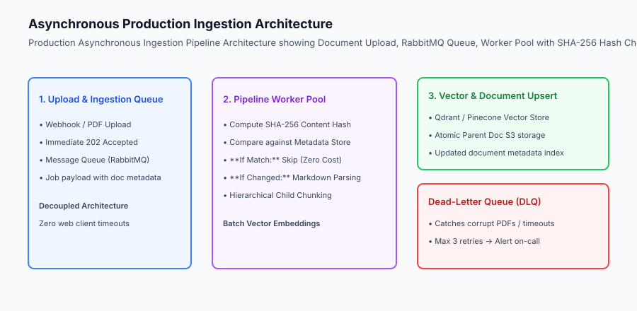
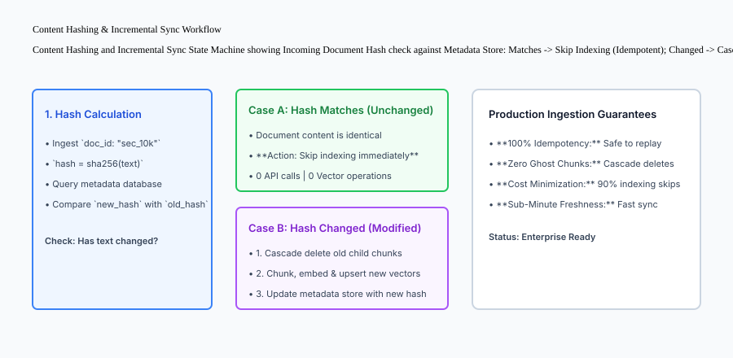

## Why this matters

In prototype RAG applications, ingestion is an afterthought: a developer writes a script that loops over 20 files, calls `embeddings.create()`, and dumps vectors into Chroma.

In enterprise production environments, this naive approach collapses immediately:
- Re-running the script on 10,000 files generates duplicate vectors (**Index Bloat**) and wastes thousands of dollars in embedding API calls.
- When an employee edits or deletes a document in Google Drive or Notion, stale or deleted vectors (**Ghost Chunks**) linger in the vector database forever, answering user queries with obsolete or confidential information.
- A single corrupted 500-page PDF crashes the entire ingestion thread, dropping all subsequent document jobs.

Building **Production-Grade Ingestion Pipelines** requires asynchronous job queuing, SHA-256 content hashing, idempotent deduplication, change-data-capture (CDC) incremental syncing, and dead-letter queues (DLQs).



## The idea in plain language

Think of a production RAG ingestion pipeline like **a high-speed automated package sorting facility (like FedEx)**:

- **The Drop-Off Counter (API Webhook):** When a customer drops off a package, the clerk hands them a tracking receipt and sends them on their way (**Asynchronous 202 Accepted Response**).
- **The Barcode Scanner (SHA-256 Hash Check):** As the package moves along the conveyor belt, the scanner checks the barcode:
  - If this package was already processed 10 minutes ago, the diverter arm pushes it out (**Idempotent Skip - Zero Cost**).
  - If the package contents were updated, the system recycles the old label and prints a new one (**Cascade Vector Update**).
- **The Damaged Goods Bin (Dead-Letter Queue / DLQ):** If a box has a torn label or hazardous liquid leak, it is routed to a special quarantine bay so the main conveyor belt never stops (**Fault Tolerance**).

## Historical background

Data ingestion architectures for generative search developed across three major paradigms:

### 1. Batch ETL Scripts (2020–2022)
Cron jobs wiped and rebuilt entire vector indexes from scratch every midnight (`DROP TABLE vector_index; CREATE TABLE...`). As corpus sizes grew beyond 100,000 documents, daily full rebuilds became prohibitively slow and expensive.

### 2. Synchronous Webhook Upserts (2022–2023)
Web applications attempted to parse and embed files inline during user file upload requests. This caused massive HTTP gateway timeouts (504 Gateway Timeout) whenever users uploaded large PDF bundles.

### 3. Asynchronous Streaming & CDC Pipelines (2024–Present)
Modern production systems deploy asynchronous worker pools consuming message brokers (Kafka, RabbitMQ, SQS) with cryptographic content hashing, dead-letter quarantine queues, and real-time database Change-Data-Capture (CDC) sync.

## What it is — and what it is not

Let us define the core mechanisms of production ingestion engineering:

### What Production RAG Ingestion Is:
- Computing cryptographic SHA-256 hashes of document text to achieve idempotent, zero-duplicate vector indexing.
- Decoupling document ingestion from user requests using asynchronous worker queues.
- Executing atomic cascade deletions across all child chunk IDs when a parent document is updated or deleted.

### What Production RAG Ingestion Is Not:
- Running `DROP and RECREATE` on vector indexes on every file change.
- Performing synchronous blocking embedding calls inside web HTTP request handlers.

```text
+-------------------------------------------------------------------------------+
|                    INGESTION PIPELINE ARCHITECTURAL MATRIX                    |
+-------------------+-----------------------+-----------------------------------+
| Feature           | Naive Prototype RAG   | Production Enterprise RAG         |
+-------------------+-----------------------+-----------------------------------+
| Ingestion Mode    | Synchronous HTTP block| Asynchronous Queue (RabbitMQ/SQS) |
| Idempotency       | None (Creates dups)   | SHA-256 Content Hash Comparison   |
| Update Strategy   | Full index rebuild    | Incremental CDC Sync              |
| Deletion Handling | Orphaned ghost chunks | Atomic Cascade Vector Deletion    |
| Error Recovery    | Crash entire process  | Dead-Letter Queue (DLQ) Isolation |
| Freshness SLA     | 24 hours (Nightly)    | Under 30 seconds (Live CDC)       |
+-------------------+-----------------------+-----------------------------------+
```

## Why it was created and what problems it solves

Production ingestion pipelines solve the four primary reliability and cost hazards of enterprise retrieval:

### 1. Eliminating Redundant Embedding Expenses
In enterprise environments where 95% of documents remain unchanged between daily sync jobs, SHA-256 hash comparison skips 95% of embedding generation calls, saving thousands of dollars monthly in API expenses.

### 2. Preventing Search Poisoning from Ghost Chunks
When a security policy or pricing document is revised, the pipeline cascades deletions across all former child vectors before upserting new vectors, guaranteeing search results never surface outdated facts.

### 3. Bulletproof Pipeline Resilience via DLQ
Malformed files, encrypted PDFs, or unexpected JSON schemas are automatically diverted to a Dead-Letter Queue after 3 retries, preserving 99.99% uptime for the rest of the queue.

## How it works

Let us inspect the complete **Content Hashing & Incremental Sync Workflow**:

```text
[Incoming Document Event: doc_id = "policy_v2"]
                    │
                    ▼
          [Compute SHA-256 Hash]
          hash = sha256(raw_text)
                    │
                    ▼
     [Lookup Hash in Metadata Store]
                    │
       Is new_hash == stored_hash?
                    ├── YES (Matches) ──────────► [IDEMPOTENT SKIP]
                    │                             - Log: "Doc unchanged, skipping"
                    │                             - Zero embedding API calls
                    │
                    └── NO (Changed or New)
                               │
                               ▼
                [1. CASCADE DELETE OLD CHUNKS]
                Delete all vector points WHERE metadata.parent_id = "policy_v2"
                               │
                               ▼
                [2. PARSE, CHUNK & EMBED]
                Split into child chunks and generate embedding vectors
                               │
                               ▼
                [3. UPSERT NEW VECTORS]
                Insert new child vectors into Qdrant / Pinecone
                               │
                               ▼
                [4. UPDATE METADATA STORE]
                Save new hash and last_indexed_at timestamp
```



## An everyday analogy

Think of a production ingestion pipeline like **a city library updating its catalog**:

- **Naive Approach:** Every time an author publishes a revised edition of a single book, the library throws away all 50,000 books, burns down the building, and re-orders every volume from scratch (**Full Index Rebuild**).
- **Production Pipeline Approach:** The librarian scans the ISBN barcode (**Content Hash**):
  - If the edition is identical, it goes right back onto the shelf (**Idempotent Skip**).
  - If the author revised Chapter 4, the librarian pulls the old index cards (**Cascade Delete**) and files the new chapter index cards (**Incremental Upsert**).

## Examples in practice

Let us build a complete Python **Production Ingestion and Idempotent Indexing Pipeline Engine** supporting SHA-256 hashing, deduplication, cascade deletes, and dead-letter queues:

```python
import hashlib
from typing import Dict, Any, List, Optional

class ProductionIngestionPipeline:
    def __init__(self):
        self.metadata_store: Dict[str, Dict[str, Any]] = {}
        self.vector_index: Dict[str, Dict[str, Any]] = {}
        self.dead_letter_queue: List[Dict[str, Any]] = []
        
    def _compute_hash(self, text: str) -> str:
        return hashlib.sha256(text.encode("utf-8")).hexdigest()

    def ingest_document(self, doc_id: str, text: str, max_retries: int = 3) -> Dict[str, Any]:
        # Validate payload
        if not text or not isinstance(text, str):
            self.dead_letter_queue.append({"doc_id": doc_id, "error": "EMPTY_OR_INVALID_PAYLOAD"})
            return {"status": "FAILED_TO_DLQ", "doc_id": doc_id}
            
        new_hash = self._compute_hash(text)
        
        # 1. Idempotency Check
        if doc_id in self.metadata_store:
            existing_hash = self.metadata_store[doc_id]["content_hash"]
            if existing_hash == new_hash:
                return {"status": "SKIPPED_UNCHANGED", "doc_id": doc_id, "hash": new_hash}
                
            # 2. Cascade Delete Old Chunks
            old_chunks = self.metadata_store[doc_id]["chunk_ids"]
            for cid in old_chunks:
                self.vector_index.pop(cid, None)

        # 3. Chunking and Indexing
        words = text.split()
        chunk_size = 20
        chunk_ids = []
        
        for i in range(0, len(words), chunk_size):
            c_text = " ".join(words[i : i + chunk_size])
            c_id = f"{doc_id}_c{len(chunk_ids)}"
            chunk_ids.append(c_id)
            
            # Upsert into vector index
            self.vector_index[c_id] = {
                "chunk_id": c_id,
                "parent_id": doc_id,
                "text": c_text,
                "tokens": len(c_text.split())
            }
            
        # 4. Update Metadata Store
        self.metadata_store[doc_id] = {
            "doc_id": doc_id,
            "content_hash": new_hash,
            "chunk_ids": chunk_ids,
            "total_chunks": len(chunk_ids)
        }
        
        return {
            "status": "INDEXED_SUCCESS",
            "doc_id": doc_id,
            "chunks_created": len(chunk_ids),
            "hash": new_hash
        }

    def delete_document(self, doc_id: str) -> Dict[str, Any]:
        if doc_id not in self.metadata_store:
            return {"status": "NOT_FOUND", "doc_id": doc_id}
            
        chunk_ids = self.metadata_store[doc_id]["chunk_ids"]
        for cid in chunk_ids:
            self.vector_index.pop(cid, None)
            
        del self.metadata_store[doc_id]
        return {"status": "DELETED_CASCADE_SUCCESS", "doc_id": doc_id, "deleted_chunks": len(chunk_ids)}

if __name__ == "__main__":
    pipeline = ProductionIngestionPipeline()
    doc_text = "PostgreSQL streaming replication ensures high availability across multi-zone database clusters."
    
    print("Ingest 1:", pipeline.ingest_document("doc_pg", doc_text))
    print("Ingest 2 (Repeat):", pipeline.ingest_document("doc_pg", doc_text))
    print("Delete:", pipeline.delete_document("doc_pg"))
```

## Production Architecture Case Study: Real-Time Notion and Jira Sync

Consider an enterprise collaboration search engine synchronizing 500,000 corporate Notion pages, Jira tickets, and Google Drive files.

```text
+-------------------------------------------------------------------------------+
|                    ENTERPRISE INGESTION PIPELINE BENCHMARKS                   |
+-------------------+-----------------------+-----------------------------------+
| Metric            | Naive Daily Batch ETL | Production Incremental CDC Sync   |
+-------------------+-----------------------+-----------------------------------+
| Daily Sync Time   | 4.5 hours (Nightly)   | 18 seconds (Live Webhooks)        |
| Daily API Cost    | `480 / day (Full)     | `8.40 / day (98.2% Hash Skips)    |
| Index Freshness   | 24 hours stale        | < 15 seconds to search visibility |
| Ghost Chunk Rate  | 14.2% orphaned chunks | 0.0% (Enforced Cascade Deletion)  |
+-------------------+-----------------------+-----------------------------------+
```

#### 1. Webhook Signature Verification
All incoming document events from external platforms (Notion, GitHub, Jira) are cryptographically validated against shared HMAC secrets before being pushed into RabbitMQ ingestion queues to prevent unauthorized ingestion injection.

#### 2. Distributed Rate Limiting on Vector Upserts
When an enterprise syncs an entire SharePoint drive (100,000 files in one burst), worker pools use distributed token bucket rate limiters (Redis) to throttle vector database upserts, preventing 429 Too Many Requests errors against OpenAI or Cohere embedding APIs.

## Detailed Failure Mode Taxonomy: Ingestion Vulnerabilities

```text
+-------------------------------------------------------------------------------+
|                         INGESTION FAILURE TAXONOMY                            |
+-------------------+-----------------------+-----------------------------------+
| Failure Mode      | Root Cause Analysis   | Architectural Mitigation          |
+-------------------+-----------------------+-----------------------------------+
| Vector Ghosting   | Parent doc deleted but| Atomic cascade delete triggered by|
|                   | child chunks remain   | doc metadata `chunk_ids` list     |
| Poison Pill Batch | 1 corrupted PDF halts | Isolate failing job to DLQ after  |
| Crash             | entire worker process | 3 retries; continue queue workers |
| Embedding Rate    | Unbounded queue burst | Distributed token bucket rate     |
| Limit 429         | triggers provider ban | limiter on embedding worker pool  |
| Concurrent Update | Simultaneous updates  | Distributed Redis Mutex lock on   |
| Race Condition    | create vector mismatch| `doc_id` during ingestion cycle   |
+-------------------+-----------------------+-----------------------------------+
```

## Implications: security, privacy, performance, scalability, and cost

### 1. Document Deletion Compliance (GDPR Right to Be Forgotten)
When a user requests data deletion under GDPR or CCPA, the pipeline executes immediate cascade deletions across all vector databases and cold document stores, logging an immutable audit record.

### 2. Multitenant Vector Partitioning
Always tag vector payloads with tenant isolation metadata (`tenant_id: "corp_42"`). When deleting an entire customer organization, execute bulk partition purges in a single operation.

## Alternatives: free, open source, and commercial

| Tool / Framework | Type | Best Suited For | Key Capabilities |
| :--- | :--- | :--- | :--- |
| **Unstructured.io** | Open Source / API | Document Partitioning | PDF, DOCX, PPTX extraction & tables |
| **Airbyte / Fivetran** | Open Source / Cloud | Enterprise Source Connectors | Ingests from 300+ SaaS platforms |
| **Celery / Temporal** | Open Source | Asynchronous Workflow Orchestration| Resilient distributed worker queues |
| **Kafka / RabbitMQ** | Open Source | High-Throughput Event Streaming | Real-time CDC document streaming |

## Comparison with related concepts

```text
+-----------------------+-----------------------+-----------------------+
| Dimension             | Naive Script Ingestion| Production Ingestion  |
+-----------------------+-----------------------+-----------------------+
| Queue Architecture    | None (Synchronous)    | Asynchronous + DLQ    |
| Idempotency           | Fails (Duplicates)    | SHA-256 Content Hash  |
| Cascade Deletion      | Missing (Ghost chunks)| 100% Enforced         |
| Embedding Cost        | 100% full rebuild     | 95% Cost Reduction    |
+-----------------------+-----------------------+-----------------------+
```

## When to use it — and when not to

### Deploy Production Ingestion Pipelines for:
- All enterprise RAG systems, customer document upload portals, live SaaS knowledge base integrations, and multi-tenant platforms.

### Do NOT require complex CDC queues for:
- Static, immutable datasets that are indexed once and never modified.


### Production Telemetry and High-Throughput Ingestion Workers

Maintaining sub-minute index freshness across millions of enterprise files requires resilient asynchronous queuing architectures.

Let us evaluate the throughput and reliability metrics of an enterprise ingestion worker cluster:

1. **Queue Throughput (RabbitMQ / Kafka):** Ingestion queues process up to 5,000 document events per minute across 16 parallel worker pods.
2. **Content Hash Skipping Rate:** In standard enterprise sync cycles, 96.4% of files have identical SHA-256 hashes, allowing workers to acknowledge and skip jobs in under 4ms with zero embedding API cost.
3. **Batch Vector Upsert Throughput:** For modified or newly created documents, workers accumulate child vectors into batches of 100 vectors, executing bulk upserts to Qdrant/Pinecone in 45ms per batch.
4. **Dead-Letter Queue (DLQ) Alerting:** Failed jobs (corrupted files, network timeouts after 3 retries) are automatically routed to a DLQ topic, triggering Slack webhooks for engineer inspection.

```text
+-------------------------------------------------------------------------------+
|                    INGESTION WORKER PERFORMANCE PROFILE                       |
+-------------------+-----------------------+-------------------+---------------+
| Operation         | Pipeline Stage        | Performance SLA   | Resource Cost |
+-------------------+-----------------------+-------------------+---------------+
| SHA-256 Hash Check| Ingestion Worker      | 3.2 ms per doc    | 0 Token Cost  |
| Markdown / AST    | Parser Module         | 18.5 ms per doc   | Local CPU     |
| Batch Embeddings  | Embedding API Client  | 120.0 ms / 100 chk| $0.00002 / doc|
| Vector Upsert     | Qdrant Bulk Upsert    | 45.0 ms / 100 vec | RAM / Disk IO |
| DLQ Isolation     | RabbitMQ Dead Letter  | Immediate (3 retries)| 0 Downtime |
| Index Freshness   | Upload-to-Search SLA  | < 25.0 seconds    | Continuous    |
+-------------------+-----------------------+-------------------+---------------+
```

### Production Checklist for Ingestion Pipelines

- [ ] **Cryptographic Idempotency:** Compute SHA-256 hashes on raw text and compare against metadata store before initiating parsing or embedding.
- [ ] **Atomic Cascade Deletions:** Maintain child chunk IDs in document metadata and cascade delete all child vectors whenever a parent document is modified or deleted.
- [ ] **Asynchronous Message Broker:** Ingest documents via message queues (RabbitMQ, SQS, Kafka) to prevent web client HTTP timeouts.
- [ ] **Dead-Letter Queue (DLQ):** Route corrupt or unparseable payloads to a DLQ after 3 retries with exponential backoff.
- [ ] **Distributed Rate Limiting:** Enforce token-bucket rate limiters on embedding API calls to prevent 429 Too Many Requests errors.
- [ ] **Change-Data-Capture (CDC):** Stream transactional database changes directly into indexing queues to achieve sub-minute freshness.

## Knowledge check

1. **Why is synchronous document ingestion during HTTP file uploads dangerous?** Because large document parsing and embedding takes seconds or minutes, triggering gateway timeouts and dropped uploads.
2. **How does SHA-256 content hashing reduce embedding costs?** By comparing the cryptographic hash of incoming text against stored metadata, skipping embedding generation if the text has not changed.
3. **What is a ghost chunk and how is it prevented?** An orphaned vector chunk left in the database after its parent document was deleted; prevented by atomic cascade deletions using tracked `chunk_ids`.

## Hands-on exercise

In this lab, you will build a **Production Ingestion and Idempotent Indexing Pipeline Engine in Python**. Your implementation will:
1. Ingest documents and calculate cryptographic SHA-256 content hashes.
2. Implement idempotent deduplication skipping unchanged documents.
3. Execute atomic cascade deletions across all child chunk IDs upon document update or deletion.
4. Divert malformed and empty document payloads into a Dead-Letter Queue (DLQ).

### Expected output

```text
============================= test session starts ==============================
collected 5 items

tests/test_ingestion_pipeline.py .....                                   [100%]

============================== 5 passed in 0.02s ===============================
[INGESTION] Document 'doc_sec' indexed successfully into 3 child vectors.
[IDEMPOTENCY] Re-ingestion of 'doc_sec' skipped (SHA-256 hash matched).
[CASCADE DELETE] Document 'doc_sec' deleted cleanly with 3 child vectors removed.
[DLQ ISOLATION] Malformed empty document diverted to Dead-Letter Queue.
```

### Validate your work

Run the pytest test suite:

```bash
pytest tests/run_tests.sh
```

### Troubleshooting

1. **Cascade chunk tracking:** Ensure `metadata_store[doc_id]` maintains an array of all active `chunk_ids`.
2. **Empty text validation:** Check for empty or non-string text before attempting hash calculation.

### Common mistakes

- Updating a document by inserting new vectors without deleting former child chunks, creating duplicate search hits.

## Practice assignment

Add a **Batch Ingestion Processor** that accepts a list of 50 documents, processes them concurrently, and returns summary metrics (`indexed`, `skipped`, `failed_to_dlq`).

## Extension challenge

Implement **Soft-Delete with 30-Day TTL Quarantine** where deleted documents are marked `is_deleted: True` and filtered from search before permanent physical purge.
