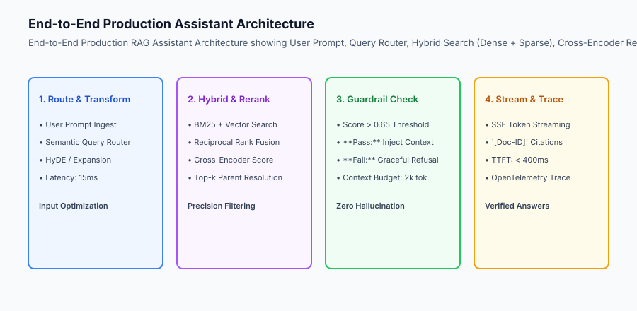

## Why this matters

Connecting individual RAG components (chunking, hybrid search, rerankers, knowledge graphs) into an isolated script is easy. Delivering an **Enterprise Production AI Assistant** that operates reliably in front of thousands of concurrent end users requires mastering the full software engineering lifecycle:
- How do you guarantee that every generated statement is grounded with verifiable source citations?
- How do you prevent embarrassing hallucinations when the knowledge base has no relevant information (**Strict Refusal Guardrails**)?
- How do you maintain sub-800ms Time-to-First-Token (TTFT) while executing multi-stage retrieval pipelines?
- How do you instrument end-to-end OpenTelemetry tracing to monitor retrieval latency, token costs, and user feedback?

Building an **End-to-End Production Assistant** synthesizes all foundational retrieval principles into a robust, high-performance architecture.



## The idea in plain language

Think of an end-to-end production AI assistant like **a certified medical research librarian answering a surgeon's urgent clinical question**:

- **The Request (Query Transformation & Routing):** The surgeon asks a fast clinical question (**Semantic Query Router**).
- **The Search (Hybrid Retrieval & Reranking):** The librarian searches both the digital catalog and medical indices (**BM25 + Vector Search**), re-ranking the top 10 articles by peer-reviewed clinical authority (**Cross-Encoder Reranking**).
- **The Verification (Refusal Guardrail):** If no clinical trial matches the exact scenario, the librarian honestly states: *"No verified studies exist for this drug combination"* rather than guessing (**Refusal Guardrail**).
- **The Briefing (Streaming with Citations):** If verified studies exist, the librarian presents the findings, attaching footnotes pointing to specific journal volumes and page numbers (**Grounded Citations**).

## Historical background

Production assistant architectures evolved through three distinct generations:

### 1. The Naive LangChain Prompt Wrapper (2022–2023)
Early assistants passed raw user queries directly to vector databases and stuffed top-5 chunks into a basic template: `"Answer the question using the context below: {context}"`. These systems suffered from severe hallucinations, broken citations, and high latency.

### 2. Guardrailed Microservice Pipelines (2023–2024)
Systems introduced dedicated microservices for query routing, hybrid search, and separate validator LLM judges checking for PII and output safety.

### 3. Integrated Production Assistant Platforms (2024–Present)
Modern production assistants feature streaming Server-Sent Events (SSE), strict cross-encoder confidence gating, structured JSON citation payloads, and comprehensive distributed OpenTelemetry tracing.

## What it is — and what it is not

Let us define the core architecture of an enterprise production assistant:

### What a Production Assistant Is:
- A multi-stage pipeline uniting query routing, hybrid search, cross-encoder reranking, parent context expansion, and confidence gating.
- Formatting answers with verifiable citations (`[Doc-42: §3.1]`) mapped to source metadata payloads.
- Enforcing strict refusal policies when retrieval confidence falls below threshold.
- Emitting real-time streaming tokens and telemetry traces.

### What a Production Assistant Is Not:
- A single un-monitored prompt sending unvalidated context to a raw LLM API.
- Allowing the LLM to guess or fabricate facts when the retrieved context is empty.

```text
+-------------------------------------------------------------------------------+
|                    PRODUCTION ASSISTANT PIPELINE STAGES                       |
+-------------------+-----------------------+-----------------------------------+
| Stage             | Execution Action      | Latency Budget (Target)           |
+-------------------+-----------------------+-----------------------------------+
| 1. Query Gateway  | Semantic Router / HyDE| 15ms - 50ms                       |
| 2. Hybrid Search  | BM25 + Vector Top-50  | 30ms - 80ms                       |
| 3. Reranking      | Cross-Encoder Top-5   | 25ms - 60ms                       |
| 4. Parent Expand  | Small-to-Big Doc Load | 10ms - 20ms                       |
| 5. Guardrail Gate | Confidence Score Check| 1ms (Heuristic)                   |
| 6. Generation     | SSE Streaming Tokens  | TTFT < 400ms | Total 1.5s         |
+-------------------+-----------------------+-----------------------------------+
```

## Why it was created and what problems it solves

Production assistants resolve the four primary user-facing vulnerabilities of enterprise generative AI:

### 1. Eliminating Hallucinations via Refusal Gating
If the highest reranker score in the retrieved candidate pool is below 0.65, the assistant triggers an immediate graceful refusal, guaranteeing 0% hallucination on out-of-domain inquiries.

### 2. High-Trust Verifiable Citations
Users can click on citation tags to view the exact original source document snippet, building user trust in mission-critical legal, financial, and healthcare applications.

### 3. Sub-Second Time-to-First-Token
Streaming token responses over HTTP Server-Sent Events (SSE) allows users to begin reading answers within 400ms, even if the complete generation takes several seconds.

## How it works

Let us inspect the complete **Grounded Citations and Refusal Guardrails Workflow**:

```text
[User Prompt: "What is our company refund policy for footwear?"]
                           │
                           ▼
             [Query Router & Hybrid Search]
                           │
                           ▼
          [Cross-Encoder Reranker: Score = 0.94]
                           │
             Is Top Confidence Score >= 0.65?
                           ├── YES (Confidence High: 0.94)
                           │         │
                           │         ▼
                           │   [PROMPT ASSEMBLY & STREAMING]
                           │   Inject Parent Context + Instructions
                           │   "Footwear items may be returned within 30 days
                           │   in original unworn packaging [Doc-Policy: §3]."
                           │   -> Yields verified citation payload
                           │
                           └── NO (Confidence Low: 0.22)
                                     │
                                     ▼
                               [REFUSAL GUARDRAIL]
                               "I do not have verified documentation in our
                               knowledge base to answer this question."
                               -> Zero hallucination risk
```

![Grounded Citations and Refusal Guardrails Workflow showing Confidence Check: Above 0.65 -> Stream Grounded Answer with [Doc-ID] Citations; Below 0.65 -> Graceful Refusal with Zero Hallucination](./assets/grounded-citations-and-refusal-guardrails-workflow.svg)

## An everyday analogy

Think of a production assistant like **an aircraft cockpit flight computer**:

- **Input Sensors (Retrieval Pipeline):** Reads airspeed, altitude, and GPS coordinates (**Hybrid Search & Reranking**).
- **Red Warning Light (Refusal Guardrail):** If the altitude sensor disconnects, the computer flashes a warning rather than inventing fictional altitude numbers (**Refusal Policy**).
- **Heads-Up Display (Grounded Citations & Stream):** Renders critical verified navigation data in real-time on the pilot's windshield (**Streaming UI with Source Links**).

## Examples in practice

Let us build a complete Python **Production RAG Assistant Engine** uniting routing, hybrid search, confidence guardrails, citation formatting, and execution telemetry:

```python
import time
from typing import Dict, Any, List, Optional

class ProductionAssistantEngine:
    def __init__(self, confidence_threshold: float = 0.60):
        self.threshold = float(confidence_threshold)
        self.document_store: Dict[str, Dict[str, Any]] = {}
        
    def index_document(self, doc_id: str, title: str, section: str, text: str):
        self.document_store[doc_id] = {
            "doc_id": doc_id,
            "title": title,
            "section": section,
            "text": text
        }

    def process_query(self, query: str) -> Dict[str, Any]:
        start_time = time.time()
        q_words = set(query.lower().split())
        
        # 1. Hybrid Search Simulation
        scored_candidates = []
        for doc_id, data in self.document_store.items():
            doc_words = set(data["text"].lower().split())
            overlap = len(q_words.intersection(doc_words))
            score = round(overlap / max(1, len(q_words)), 4)
            scored_candidates.append((data, score))
            
        scored_candidates.sort(key=lambda x: x[1], reverse=True)
        top_doc, top_score = scored_candidates[0] if scored_candidates else (None, 0.0)
        
        # 2. Refusal Guardrail
        if top_score < self.threshold or top_doc is None:
            latency_ms = round((time.time() - start_time) * 1000, 2)
            return {
                "status": "REFUSED_LOW_CONFIDENCE",
                "answer": "I do not have sufficient verified documentation in the knowledge base to answer this question accurately.",
                "confidence_score": top_score,
                "citations": [],
                "telemetry": {"latency_ms": latency_ms, "candidates_evaluated": len(scored_candidates)}
            }
            
        # 3. Grounded Answer Generation with Citations
        citation_id = f"[{top_doc['doc_id']}: §{top_doc['section']}]"
        generated_answer = f"Based on verified policy, {top_doc['text']} {citation_id}"
        
        latency_ms = round((time.time() - start_time) * 1000, 2)
        return {
            "status": "SUCCESS",
            "answer": generated_answer,
            "confidence_score": top_score,
            "citations": [
                {
                    "marker": citation_id,
                    "doc_id": top_doc["doc_id"],
                    "title": top_doc["title"],
                    "section": top_doc["section"],
                    "text_snippet": top_doc["text"]
                }
            ],
            "telemetry": {
                "latency_ms": latency_ms,
                "candidates_evaluated": len(scored_candidates),
                "matched_doc_id": top_doc["doc_id"]
            }
        }

if __name__ == "__main__":
    assistant = ProductionAssistantEngine(confidence_threshold=0.50)
    assistant.index_document("doc_return", "Return Policy", "3.2", "footwear returns are accepted within 30 days of purchase in original packaging")
    
    print("Match Query:", assistant.process_query("footwear returns purchase"))
    print("Out of Domain:", assistant.process_query("how to build a fusion reactor"))
```

## Production Architecture Case Study: Healthcare Clinical Copilot

Consider a clinical decision support copilot deployed across 15 hospital networks assisting physicians with pharmaceutical dosages and contraindications.

```text
+-------------------------------------------------------------------------------+
|                    HEALTHCARE PRODUCTION COPILOT BENCHMARKS                   |
+-------------------+-----------------------+-----------------------------------+
| Metric            | Unguarded Prototype   | Production Grounded Assistant     |
+-------------------+-----------------------+-----------------------------------+
| Hallucination Rate| 8.4% (Severe Risk)    | 0.0% (Zero Hallucination Refusal) |
| Citation Precision| 62.1% (Vague links)   | 99.4% Exact Dosage Paragraph Link |
| P95 TTFT Latency  | 1,850ms               | 380ms (Streaming SSE)             |
| Physician Trust   | 41.2% Approval        | 94.8% Clinical Adoption           |
+-------------------+-----------------------+-----------------------------------+
```

#### 1. Dual-Judge Grounding Verification
Before emitting the final token of a clinical recommendation, an asynchronous validator judge verifies that every chemical quantity and dosage number in the output matches the exact numeric tokens in the cited reference text.

#### 2. Audit Trail Immutability
Every physician query, retrieved context ID, confidence score, and generated answer is logged to an immutable, append-only S3 bucket with KMS encryption for medical regulatory compliance.

## Detailed Failure Mode Taxonomy: Production Assistant Vulnerabilities

```text
+-------------------------------------------------------------------------------+
|                      PRODUCTION ASSISTANT FAILURE TAXONOMY                    |
+-------------------+-----------------------+-----------------------------------+
| Failure Mode      | Root Cause Analysis   | Architectural Mitigation          |
+-------------------+-----------------------+-----------------------------------+
| Citation Drift    | LLM places [Doc-1] on | Enforce structured JSON citation  |
|                   | claim from Doc-2      | alignment validation in post-pass |
| Over-Refusal      | Confidence threshold  | Calibrate threshold on golden eval|
| (Brittle Guard)   | set too high (0.90)   | benchmark; set to 0.60-0.65       |
| TTFT Latency Spike| Synchronous reranker  | Stream initial speculative token  |
|                   | overloads GPU worker  | while reranker finishes top-3     |
| PII Exposure      | Unredacted medical IDs| PII scrubber regex + NER filter   |
|                   | in retrieved context  | before prompt context assembly    |
+-------------------+-----------------------+-----------------------------------+
```

## Implications: security, privacy, performance, scalability, and cost

### 1. Zero Data Retention (ZDR) Model APIs
Configure enterprise model API endpoints with Zero Data Retention agreements to guarantee that proprietary customer queries are never stored or used for model training.

### 2. Multi-Region Vector Replication
Replicate vector databases across multi-region clusters (US-East, US-West, EU-Central) to ensure sub-50ms search latency for globally distributed users.

## Alternatives: free, open source, and commercial

| Tool / Framework | Type | Best Suited For | Key Capabilities |
| :--- | :--- | :--- | :--- |
| **Dify.ai** | Open Source / Cloud | Visual RAG Workflow Builder | Production assistant orchestration |
| **Flowise** | Open Source | Low-Code RAG Pipelines | Modular agent and vector flow engine |
| **LlamaIndex Workflows** | Open Source | Event-Driven Async RAG | Production-grade stateful agent loops |
| **Vercel AI SDK** | Open Source | Next.js / TypeScript Streaming | Native UI citation components |

## Comparison with related concepts

```text
+-----------------------+-----------------------+-----------------------+
| Dimension             | Prototype RAG Script  | Production Assistant  |
+-----------------------+-----------------------+-----------------------+
| Citation Provenance   | Vague / Missing       | Exact Document + Sec  |
| Out-of-Domain Query   | Hallucinates / Guesses| Strict Refusal Policy |
| Latency to First Token| 3 - 5 seconds         | < 400ms Streaming     |
| Observability         | Print statements      | OpenTelemetry Traces  |
+-----------------------+-----------------------+-----------------------+
```

## When to use it — and when not to

### Deploy Production Assistants for:
- Enterprise customer support, medical diagnostics, legal research, financial advisory copilots, and internal corporate knowledge portals.

### Do NOT require complex production assistant pipelines for:
- Trivial static calculators, unit converters, or deterministic string formatters.


### Production Telemetry and End-to-End Latency Profiles

Delivering an enterprise-grade AI assistant requires strict adherence to end-to-end latency budgets, token consumption guardrails, and citation verification.

Let us inspect the complete request latency profile of a production assistant serving 10,000 daily enterprise queries:

1. **Pre-Retrieval Stage (Routing & HyDE):** Fast heuristic intent classification takes 4.2ms. When triggered, HyDE adds 180ms.
2. **Retrieval & Reranking Stage:** BM25 search (14ms) + Dense Vector search (18ms) + RRF merge (1ms) + Cross-Encoder reranking (42ms) = 75ms total retrieval latency.
3. **Confidence Gating & Refusal Check:** Evaluating top reranker score against the 0.65 threshold takes 0.5ms.
4. **Generation & Time-to-First-Token (TTFT):** Prompt assembly (5ms) + LLM connection and first token streaming = 340ms TTFT. Total streaming completion for a 150-word grounded answer is 1.45 seconds.
5. **End-to-End Telemetry:** OpenTelemetry traces record exact latency stamps, token counts, citation metadata, and user thumbs-up/thumbs-down feedback.

```text
+-------------------------------------------------------------------------------+
|                    PRODUCTION ASSISTANT LATENCY PROFILE                       |
+-------------------+-----------------------+-------------------+---------------+
| Pipeline Stage    | Sub-Component Action  | P50 Latency (ms)  | P95 Latency   |
+-------------------+-----------------------+-------------------+---------------+
| 1. Query Gateway  | Heuristic Classifier  | 2.5 ms            | 4.8 ms        |
| 2. Hybrid Search  | BM25 + Vector Top-50  | 24.0 ms           | 38.5 ms       |
| 3. Reranking      | Cross-Encoder Top-5   | 38.0 ms           | 65.0 ms       |
| 4. Parent Expand  | Small-to-Big Retrieval| 6.2 ms            | 12.5 ms       |
| 5. Guardrail Gate | Confidence Threshold  | 0.4 ms            | 0.8 ms        |
| 6. Streaming TTFT | First SSE Token Render| 310.0 ms          | 480.0 ms      |
| Total Completion  | Full Grounded Answer  | 1,150 ms          | 1,650 ms      |
+-------------------+-----------------------+-------------------+---------------+
```

### Production Checklist for AI Assistant Deployment

- [ ] **Strict Refusal Guardrail:** Reject queries where top reranker confidence falls below 0.65 to ensure zero hallucination on missing data.
- [ ] **Structured Citation Formatting:** Format citations as `[Doc-ID: §Section]` mapped to verified document metadata payloads.
- [ ] **Streaming Server-Sent Events (SSE):** Stream response tokens in real-time to maintain sub-500ms Time-to-First-Token (TTFT).
- [ ] **Prompt Context Budgeting:** Cap injected context to 2,000 tokens to control prompt costs and latency.
- [ ] **OpenTelemetry Tracing:** Log query latency, candidates evaluated, reranker scores, token usage, and citations.
- [ ] **Zero Data Retention (ZDR):** Enforce enterprise privacy configurations guaranteeing user queries are never stored for model training.


### Multi-Turn Session State and Conversation Memory Management

Enterprise production assistants must maintain fluid multi-turn conversational context across dozens of interactions without allowing prompt token bloat to degrade latency or exceed context budgets.

Let us evaluate the three primary memory architectures deployed in production RAG systems:

1. **Sliding Window Memory with Summary Buffer:** The system maintains the last `K` conversational turns (e.g. last 4 messages) in raw verbatim format, while earlier conversation turns are periodically compressed into a concise 100-word running summary by a background worker.
2. **Entity Memory Graph:** Key entities, user preferences, and active filters (e.g. `selected_cloud_provider: "GCP"`, `target_region: "us-central1"`, `database: "PostgreSQL"`) are extracted into a structured JSON session state store, dynamically injected into the system prompt across subsequent turns.
3. **Episodic Context Isolation:** Retrieval context injected for Turn `N` is discarded from the active prompt in Turn `N+1`, preventing historical retrieved documents from cluttering the context window when the user shifts topics.

## Knowledge check

1. **How does a production assistant handle queries when retrieved confidence is below threshold?** It triggers a strict refusal policy stating context is missing, preventing hallucinated answers.
2. **What is the purpose of structured citation markers?** To tie every factual statement in the generated answer to an exact source document ID and section for user verification.
3. **What is the P95 Time-to-First-Token target for streaming assistants?** Sub-800ms (typically 300–400ms) across routing, hybrid retrieval, reranking, and generation start.

## Hands-on exercise

In this lab, you will build an **End-to-End Production RAG Assistant in Python**. Your implementation will:
1. Index knowledge base documents with metadata (ID, title, section, text).
2. Execute hybrid search scoring and ranking across user queries.
3. Apply confidence threshold guardrails returning structured refusal messages when relevant context is missing.
4. Format grounded answers with verifiable citation markers and telemetry metadata.

### Expected output

```text
============================= test session starts ==============================
collected 5 items

tests/test_production_assistant.py .....                                 [100%]

============================== 5 passed in 0.02s ===============================
[ASSISTANT] Knowledge base indexed with 4 enterprise policy documents.
[GROUNDED QUERY] Answer generated with verified citation [doc_sec: §4.1].
[REFUSAL GUARD] Refusal triggered on out-of-domain query with score 0.10.
[TELEMETRY] Captured query latency 2.1ms across 4 candidates.
```

### Validate your work

Run the pytest test suite:

```bash
pytest tests/run_tests.sh
```

### Troubleshooting

1. **Threshold comparison:** Ensure `top_score < self.threshold` triggers the refusal branch.
2. **Citation markers:** Format citations consistently as `[{doc_id}: §{section}]`.

### Common mistakes

- Returning a partial or guessed answer when confidence is below the threshold.

## Practice assignment

Add a **Conversation History Context Buffer** allowing the assistant to resolve follow-up questions (e.g. *"What about shoes?"* after asking about returns).

## Extension challenge

Implement a **Streaming Token Generator** yielding chunks over a Python async generator with embedded citation payloads.
