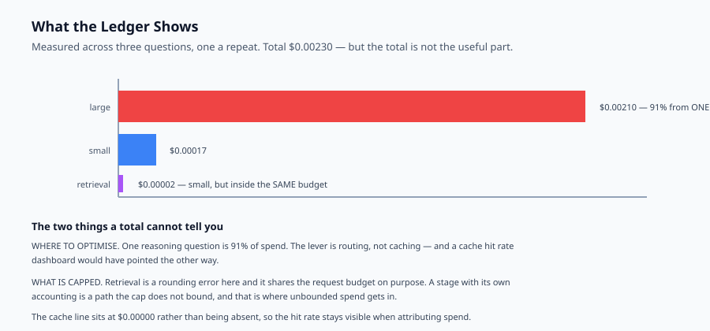

## Why this matters

You have spent six days on the parts. An ingestion pipeline that survives a crash. A processing stage that catches a scan yielding twenty characters. A freshness check that finds the document deleted at source but still in your index. An approximate index with a measured recall cost. A ledger that shows which model is spending your money. Redaction at the boundary and a verified erasure.

Each was tested in isolation and each worked. Today you wire them together, and the interesting failures appear — the ones no single day's tests could reach.

This is not a formality. Systems fail at their seams far more often than in their components, and the seams are invisible until the components share a pipeline. Three of them drive today's work, and every one is an ordering or ownership question rather than an algorithmic one:

**Where does redaction go?** Downstream of chunking is too late — the identifiers are already inside the vectors.

**Who pays for retrieval?** If it has its own budget, a recall setting stops being a cost setting, and one path escapes the cap.

**What does erasure have to touch?** More stores than anyone lists from memory, and one of them will keep answering from deleted content.

Today closes Course07. The assistant you build is small, but it is structurally the thing you would run.



## The idea in plain language

A production assistant is six stages sharing three things: a checkpoint, a ledger and a deletion path.

The **checkpoint** makes ingestion resumable and incremental. It belongs to ingestion, and freshness reads it.

The **ledger** makes cost attributable. It must span retrieval *and* generation, or the cap does not bound a request.

The **deletion path** is the list of stores a subject's data reached. Every stage that writes must register with it, or the erasure will miss what that stage wrote.

The system is not the six stages. It is those three shared structures plus the ordering constraints between the stages, and getting those right is what the day is for.

## Historical background

### Integration testing, 1970s onward

Software engineering learned early that components passing their unit tests do not compose. The Apollo and early avionics programmes formalised integration testing precisely because interface assumptions diverge silently. Every idea in this lesson is that observation applied to a retrieval system.

### The end-to-end argument, 1984

Saltzer, Reed and Clark argued that correctness properties belong at the end points of a system, not in the middle. Applied here: verifying erasure at the point of the request — reading back from every store — beats each store separately claiming to have deleted.

### Pipelines as products, 2010s

The data-engineering discipline of the 2010s established that a pipeline is a product with an owner, a service level and a failure budget, not a script that runs nightly. That framing is why the assistant has a freshness objective and a cost projection rather than only a test suite.

### RAG systems in production, 2023 onward

The first wave of retrieval-augmented systems was overwhelmingly prototype-shaped: load documents, chunk, embed, query. The production concerns — incremental ingestion, deletion propagation, cost attribution, recall measurement — arrived as painful second lessons. This week is those lessons in the order they are usually learned the hard way.

## What it is — and what it is not

A production assistant is a retrieval system with operational properties: it can be re-run safely, it stays current, its cost is bounded and attributable, and data can be removed from it provably.

### What it is

It is **the seams made explicit**. The value is in the shared checkpoint, ledger and deletion path, not in any one stage.

It is **testable end to end**. Because every external dependency is simulated, the interactions can be pinned with tests rather than hoped for.

It is **a capstone**. Course07 has been about building AI systems that survive contact with production, and this is that in one artefact.

### What it is not

It is not a demonstration of scale. The corpus is five documents. The properties are what matter, and properties hold or fail at any size.

It is not a real model. The embedding is a hashing vectoriser and the "model" returns a formatted string. Substituting real ones changes cost and latency; it does not change a single one of the ordering constraints.

It is not finished software. It has no tenancy, no sandboxing, no retention policy. The security notes list what a real deployment adds.

## Why it was created and what problems it solves

**Components that pass separately still fail together.** *Solution: an interactions test group that no single day's suite can contain.*

**Redaction added late.** Privacy work retrofitted after indexing means re-embedding the corpus, so it gets deferred, so the exposure persists. *Solution: fix the ordering at assembly time, where it costs nothing.*

**Uncapped paths.** Generation is capped, retrieval is not, and a request can spend without bound through the gap. *Solution: one ledger per request, spanning every stage that costs money.*

**Partial erasure.** The delete reaches the stores someone listed. *Solution: verify by read-back across every store that registered a write.*

**Deletion that becomes permanent by accident.** Clear the chunks, keep the content hash, and a later re-ingest concludes nothing changed. *Solution: treat the hash as part of the subject's data.*



## How it works

**Ingest.** Documents above the cursor, in order. A missing body or a failed quality gate becomes a dead letter, and the cursor advances anyway — otherwise the poison document is retried forever. Surviving documents are **redacted first**, then hashed, then chunked with stable positional ids, then embedded. Chunks the new version no longer produces are deleted.

**Retrieve.** Embed the question, score every chunk, take the top k — and charge the ledger. That charge is the seam: it puts recall and generation in competition for one budget.

**Answer.** A cached question is free and is still recorded, so the hit rate stays visible. Otherwise route on the question's shape, price the call, and check the cap *before* recording anything.

**Erase.** Remove the document's chunks, its content hash and any cached answer citing it. Then read each store back and report what is actually gone.

The ordering constraints are the design. Every one of them is cheap to satisfy while building and expensive to retrofit.

## An everyday analogy

Think of a restaurant kitchen where every station has been individually inspected.

The prep station is clean. The grill runs at the right temperature. Plating is immaculate. Each passes its own inspection, and the restaurant still fails — because the seams were never inspected. Prep hands off at a temperature the grill assumes is lower. Plating garnishes a dish that has been sitting. Nobody owns the pass.

The head chef's job is the seams: who hands what to whom, in what state, and who is accountable when a plate is wrong.

Redaction before indexing is deciding that allergens are labelled at prep rather than at plating — because by plating, the ingredient is already in six dishes.

One ledger is a single order ticket for the whole table, rather than each station billing separately and nobody knowing the total until it arrives.

Verified erasure is checking the pass before the plate leaves, rather than each station insisting they did their part.

## Examples in practice

The assembled assistant, running end to end:

```text
--- ingest ---
scanned=5 indexed=6 unchanged=0 dead=2 redactions=4
dead letters: ['broken', 'garbled']
--- re-ingest, nothing changed ---
scanned=0 indexed=0 unchanged=0 dead=0 redactions=0
--- edited document ---
scanned=1 indexed=2 unchanged=0 dead=0 redactions=0
```

Three runs proving three properties. The first ingests and dead-letters two documents — one with no body, one that is punctuation and fails the alphabetic-ratio gate — without stopping. The second scans nothing, because the cursor moved. The third picks up one edited document and reindexes only that.

Four redactions happened in run one, **before** chunking. No vector in this index contains an email address, and that was free to arrange at assembly time.

```text
--- cost ---
total=$0.00230  by stage: cache=$0.00000, large=$0.00210, retrieval=$0.00002, small=$0.00017
```

`retrieval` appears beside the models because it is charged to the same ledger. And the attribution answers the optimisation question immediately: `large` is 91 percent of spend from one of three questions. The lever is routing, not caching — which is exactly the conclusion Day 327 reached, now visible in an assembled system.

```text
--- erasure ---
chunks before: 6
verified: {'index': True, 'hashes': True, 'cache': True}
chunks after: 4
```

Three stores, three read-backs. The cache entry mattered: without clearing it, the assistant would keep answering from a document that no longer exists.

One more property, which only a test can show. Erasing must clear the **content hash** as well. Leave it, and a later re-ingest compares against the stale hash, concludes nothing changed, and never restores the document — a deletion that quietly becomes permanent in a way nobody chose.

## Implications: security, privacy, performance, scalability, and cost

**Security.** One ledger spanning every paid stage is what makes the cap meaningful; a stage with separate accounting is an uncapped path. Extraction still deserves a sandbox in any real deployment, because it consumes untrusted input.

**Privacy.** Redaction at the boundary makes every derived store clean by construction. Verified erasure is what turns "we ran the deletion" into evidence. Both are ordering decisions rather than features.

**Performance.** The seams cost almost nothing. A content hash is a digest, a ledger entry is a tuple, a deletion path is a set of names. The expensive parts remain extraction and embedding.

**Scalability.** Every property here holds independently of corpus size, which is the point of testing them at five documents. What changes with scale is the retrieval strategy, and that plugs into the same ledger.

**Cost.** The projection matters more than the total. Cost per request multiplied by expected volume belongs in the design document, and this assistant makes that number computable before anything ships.

## Alternatives: free, open source, and commercial

**LlamaIndex** and **LangChain** — open source, and both offer ingestion pipelines with document stores that track hashes. Convenient, and worth reading carefully on what their upsert and deletion semantics actually guarantee before depending on them.

**Haystack** — Apache-2.0, more explicitly pipeline-shaped, which makes the stages and their seams easier to see.

**Dagster** — Apache-2.0, an orchestrator whose asset model expresses "this index is derived from these documents" directly, with freshness policies attached.

**LiteLLM** — MIT, a proxy giving per-key budgets and cost logging across providers without building your own ledger.

**Managed RAG platforms** — remove the operational burden and take the seams out of your hands, including the ones this lesson is about. Ask specifically how deletion propagates and how recall is measured.

The honest default: a framework for the stages, and your own explicit checkpoint, ledger and deletion path. Those three are where your obligations live, and they are the ones you should be able to read.

## Comparison with related concepts

**Section project versus daily lab.** A lab isolates one idea. A project exercises the interactions, and interactions are where production fails.

**Integration testing versus end-to-end testing.** Integration checks two components agree. End-to-end checks a property holds across the whole path — which is what verified erasure is.

**This assistant versus a production system.** The difference is tenancy, sandboxing, retention policies, real models and real scale. The difference is *not* the ordering constraints, which are identical.

**Assembly versus rewriting.** Every stage here is the day's idea, reduced but unchanged. Assembly is a distinct skill from construction, and it is the one this project practises.

## When to use it — and when not to

**Build the full assembly when** the system will run unattended, when documents change or are deleted after publication, when spend is externally triggered, or when anyone will ask what it costs at scale.

**Keep it lighter when** you are exploring — a full rebuild each run is a feature during exploration, because it guarantees the index matches the code you just changed.

**Always fix the ordering.** Redaction before indexing, one ledger across paid stages, and a deletion path that every writing stage registers with. All three are nearly free while building and genuinely expensive to retrofit, and that asymmetry is the argument for doing them on day one.

## Knowledge check

1. Why must redaction run before chunking rather than after retrieval?
2. What does charging retrieval to the same ledger as generation make visible?
3. An erasure clears a document's chunks and its cached answers but leaves its content hash. What breaks, and when?
4. Why does the cursor advance even for a dead-lettered document?
5. Why does this project test its properties on five documents rather than five thousand?

## Hands-on exercise

You will assemble the week into one assistant. The stages are familiar; the work is the seams.

Open `starter/assistant.py` in the week 47 project directory and implement the three stubbed methods — `ingest`, `answer` and `erase` — then run the tests.

### Expected output

Running `python3 examples/assistant_demo.py` exercises the whole pipeline:

```text
--- ingest ---
scanned=5 indexed=6 unchanged=0 dead=2 redactions=4
dead letters: ['broken', 'garbled']
--- re-ingest, nothing changed ---
scanned=0 indexed=0 unchanged=0 dead=0 redactions=0
--- edited document ---
scanned=1 indexed=2 unchanged=0 dead=0 redactions=0
--- answers ---
[small] What is the refund window? -- sources: refunds::0, sla::0, sla::1
[small] What is the refund window? -- sources: refunds::0, sla::0, sla::1
[large] Compare the standard and premium t -- sources: tiers::0, tiers::1, refunds::0
--- cost ---
total=$0.00230  by stage: cache=$0.00000, large=$0.00210, retrieval=$0.00002, small=$0.00017
--- budget enforcement ---
refused: would cost $0.00018, $0.00000 left
--- erasure ---
chunks before: 6
verified: {'index': True, 'hashes': True, 'cache': True}
chunks after: 4
```

### Validate your work

Run `bash tests/run_tests.sh`. All twenty tests must pass. Six groups map to the six days; the seventh, `INTERACTIONS`, is what this project adds.

Then check three things by inspection. The second ingest run must report `scanned=0`. No chunk may contain `ada@example.com`. And `verified` must be `True` for all three stores.

### Troubleshooting

**The second run scans again.** The cursor advances only on success. It must advance on every outcome, including a dead letter, or the poison document is retried forever.

**A chunk contains an email address.** You are redacting after chunking. Move it before the hash.

**An edit duplicates chunks.** Your ids are not stable, or you are not deleting chunks the new version no longer produces.

**Re-ingesting an erased document does nothing.** You left the content hash behind, so the re-ingest sees no change.

**`retrieval` is missing from the cost breakdown.** It has its own accounting. Charge it to the shared ledger.

### Common mistakes

Treating the stages as independent because their tests were. The seams are the subject.

Redacting late because it is easier to add at the end. That is exactly why it gets deferred in real systems.

Capping generation but not retrieval, leaving one path uncapped.

Reporting erasure from the delete calls rather than a read-back.

## Practice assignment

Add **tenant isolation** to the assistant. Partition the index and the cache by tenant, and make erasure scoped to a tenant.

Then write two tests. One proving that a cache key collision between tenants cannot serve one tenant's answer to another. The other proving that erasing a subject for one tenant leaves another tenant's identical document intact — which forces you to decide whether "the same document ingested by two tenants" is one record or two, and that decision has real consequences.

## Extension challenge

Give the assistant a **freshness objective and a cost projection**, then report against both.

State a target — p95 staleness under some bound, zero orphans, and a cost ceiling per thousand requests. Simulate a week in which ingestion fails intermittently and traffic varies, then produce an error-budget report: how much of the period each objective was violated.

Report the real numbers. If an objective was never violated, say so and tighten it until it is — an objective you always meet tells you nothing about the system. The finding you want is which of the two binds first, because that is where the next week of engineering should go.
