## Why this matters

Over the past 50 weeks (Days 1 to 350), you have mastered the complete spectrum of modern AI engineering:

1. **Programming Fundamentals & Python Architecture (Weeks 1–14)**
2. **Data Engineering, SQL, Vector Mathematics & Embeddings (Weeks 15–28)**
3. **Core Machine Learning & Deep Learning Foundations (Weeks 29–38)**
4. **Large Language Models, Prompting & Transformers (Weeks 39–43)**
5. **Advanced RAG, Knowledge Graphs & Vector Search (Weeks 44–46)**
6. **Agentic Workflows, Tool Use & Multi-Agent Teams (Week 47)**
7. **Containers, Cloud Deployments, MLOps & Production AI (Weeks 48–49)**
8. **Securing AI Systems, PII Vaults & Red Teaming (Week 50)**

The **Capstone Project (Weeks 51 & 52)** is not a toy tutorial or an abstract research exercise. It is your opportunity to build, evaluate, deploy, secure, and showcase a **fully realized, production-grade Artificial Intelligence product** that proves your end-to-end engineering excellence to employers, clients, and technical peers.

Choosing and scoping your project correctly on Day 351 is the single most critical predictor of success.

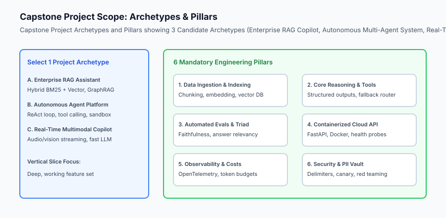

## The idea in plain language

Think of scoping your Capstone like **commissioning an architectural skyscraper**:

- **The Amateur Mistake:** An amateur promises to build an entire city with airports, bridges, and subways, but ends up with half-drawn blueprints and a foundation that collapses under stress (**Unbounded Scope Creep**).
- **The Senior Architect Approach:** A senior engineer chooses a single iconic 40-story building, engineers bedrock foundations, verifies fire safety codes, installs high-speed elevators, connects water and electricity, and delivers a completed, habitable masterpiece (**The Focused Vertical Slice**).

Your Capstone must be a complete, defensible vertical slice: from raw data ingestion to hardened cloud serving, automated evaluation, and live interactive UI.

## Historical background

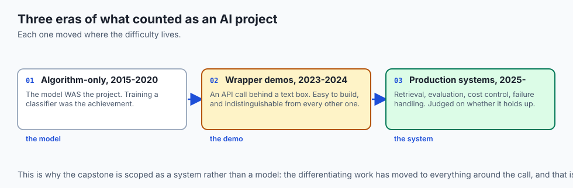

Over the last decade of software and AI engineering education, project failure modes have evolved:

### 1. The Algorithm-Only Era (2015–2020)
Students trained PyTorch models in Jupyter notebooks, measuring test accuracy on clean Kaggle datasets. These projects lacked APIs, frontends, error handling, or deployment infrastructure.

### 2. The Wrapper Demo Era (2023–2024)
With the rise of commercial LLMs, developers built superficial single-file Streamlit wrappers making raw OpenAI API calls. These lacked custom data layers, evaluations, security firewalls, or cost controls.

### 3. The Modern Production AI Era (2025–Present)
Modern engineering teams expect full-lifecycle AI systems: hybrid vector retrieval, deterministic agentic tool execution, CI/CD automated evals, containerized serving, OpenTelemetry observability, and proactive security guardrails.

## What it is — and what it is not

Let us establish clear boundaries for the Capstone:

### What the Capstone Is:
- A production-grade AI system solving a real-world problem in a specific domain.
- Built across all 6 mandatory engineering pillars: Data Ingestion, Core Reasoning, Automated Evals, Cloud Deployment, Observability, and Security.
- Accompanied by a formal Project Charter, Architecture Spec, test suite, and live demonstration.
- Built incrementally: a working **Walking Skeleton** on Milestone 1 (Week 51), followed by production hardening in Milestone 2 (Week 52).

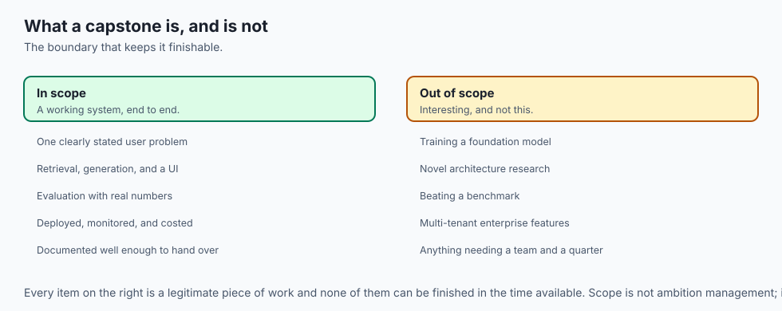

### What the Capstone Is Not:
- A superficial prompt wrapper with no local data, custom retrieval, or evals.
- An unfinished collection of disconnected scripts with no automated test runner.
- A purely theoretical design document with zero working code.

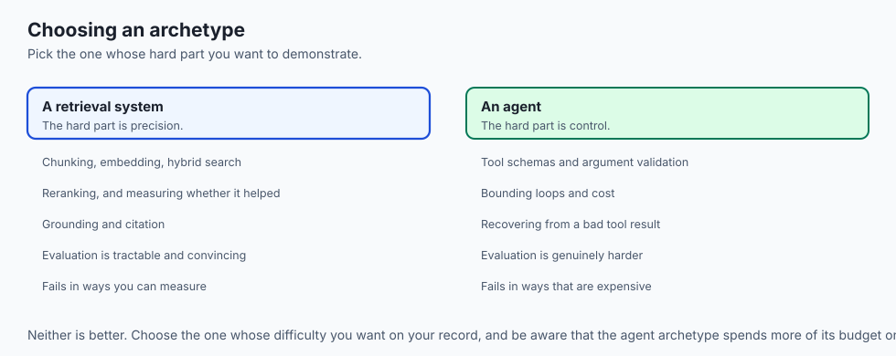

```text
+-------------------------------------------------------------------------------+
|                    CAPSTONE PROJECT ARCHETYPE COMPARISON                      |
+-------------------+-----------------------+-----------------------------------+
| Archetype         | Core AI Complexity    | Real-World Production Focus       |
+-------------------+-----------------------+-----------------------------------+
| 1. Enterprise RAG | Hybrid BM25 + Vector, | High retrieval accuracy, grounded |
|    Copilot        | Cross-Encoder Rerank  | citations, low hallucination rate |
| 2. Autonomous     | ReAct loop, tool      | Deterministic execution, state    |
|    Agent Platform | calling, memory store | recovery, sandbox tool safety     |
| 3. Real-Time      | Fast streaming LLM,   | Sub-second latency budget,        |
|    Assistant      | multimodal input      | token streaming, multi-turn state |
+-------------------+-----------------------+-----------------------------------+
```

## Why it was created and what problems it solves

The structured scoping process on Day 351 prevents three catastrophic project pitfalls:

### 1. Eliminating Scope Creep via SMART Boundaries
By establishing quantitative SLAs upfront (e.g. `p95 TTFT <= 400ms`, `Faithfulness >= 0.90`, `Monthly Token Cost <= $25`), you prevent uncontrolled feature bloat.

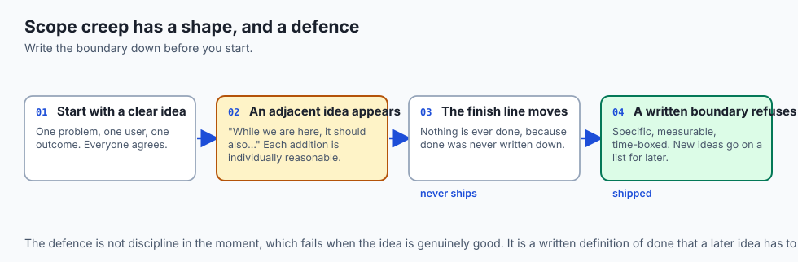

### 2. De-risking Integration Bottlenecks Early
Building an end-to-end walking skeleton on Day 351 ensures that frontend, backend, vector database, and LLM APIs communicate before investing in complex business logic.

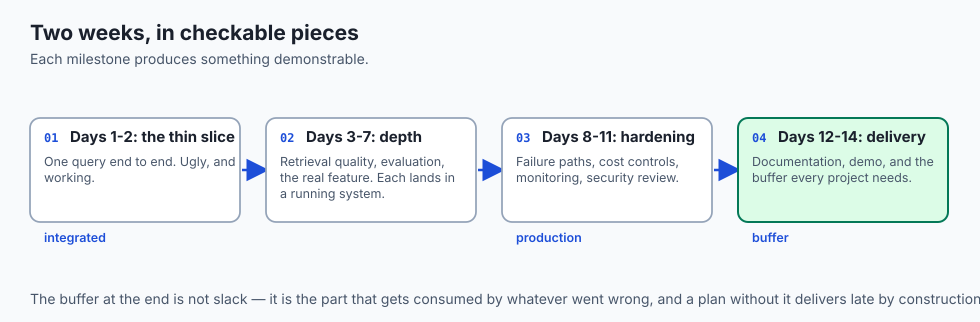

### 3. Establishing Portfolio-Ready Engineering Evidence
A structured project with automated evaluation benchmarks, Dockerized deployment, and security manifests provides undeniable technical proof of seniority.

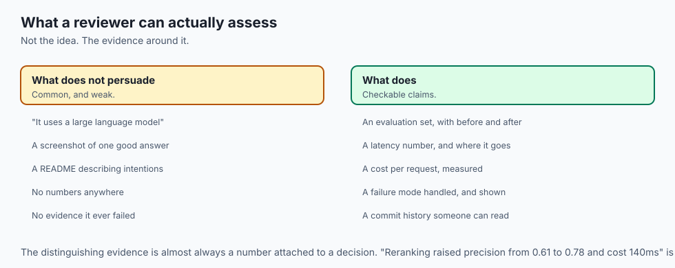

## How it works

Let us inspect the complete **Two-Week Capstone Execution Roadmap**:

```text
[WEEK 51: FOUNDATION & WORKING VERTICAL SLICE]
  ├── Day 351: Scope Definition, SMART Constraints, & Feasibility Scoring
  ├── Day 352: Architecture Specification & System Design Document
  ├── Day 353: Data Ingestion, Chunking Pipeline, & Vector Storage
  ├── Day 354: Core AI Reasoning, Structured Outputs, & Fast Router
  ├── Day 355: Agent Tool Calling, Sandbox Integration, & State Management
  ├── Day 356: Automated Evaluation Suite (RAG Triad, LLM-as-a-Judge)
  └── Day 357: Milestone 1 Review & Course Correction
           │
           ▼ (Working End-to-End Vertical Slice)
[WEEK 52: HARDENING, DEPLOYMENT, OBSERVABILITY & DELIVERY]
  ├── Day 358: Responsive UI, Streaming Chat, & Error Feedback
  ├── Day 359: Docker Containerization, Health Probes, & Cloud Deployment
  ├── Day 360: OpenTelemetry Observability & Multi-Tenant Cost Attribution
  ├── Day 361: Security Hardening, PII Vault, & Red Team Fuzzing
  ├── Day 362: Technical Documentation, API Reference, & Video Demo
  └── Days 363-365: Portfolio Showcase, Retrospective, & Graduation
```

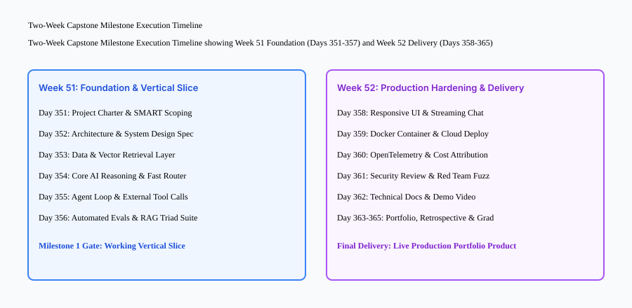

## An everyday analogy

Think of scoping your Capstone like **planning an expedition across a mountain range**:

- **The Ill-Prepared Hiker:** Packs 15 heavy books, a solar generator, and gourmet cookware, only to collapse from exhaustion 2 miles into the trail (**Overloaded Scope**).
- **The Master Mountaineer:** Checks the topographic map, measures distance and elevation gain, packs essential survival gear, lightweight energy food, and communication beacons, and reaches the summit on schedule (**SMART Scoping & Feasibility Analysis**).

## Examples in practice

Let us build an automated **Capstone Project Scoping & Feasibility Scorer in Python** that evaluates project charters against the 6 mandatory engineering pillars and calculates feasibility metrics:

```python
import json
from typing import Dict, Any, List, Tuple

class CapstoneScopingValidator:
    def __init__(self, project_charter: Dict[str, Any]):
        self.charter = project_charter
        self.pillars = [
            "data_ingestion",
            "core_ai_reasoning",
            "automated_evals",
            "cloud_deployment",
            "observability",
            "security_hardening"
        ]

    def validate_pillars(self) -> Tuple[bool, List[str]]:
        missing = []
        for p in self.pillars:
            if p not in self.charter.get("engineering_pillars", {}):
                missing.append(f"Missing mandatory pillar: {p}")
            elif not self.charter["engineering_pillars"][p].get("enabled", False):
                missing.append(f"Pillar disabled: {p}")
        return len(missing) == 0, missing

    def evaluate_feasibility(self) -> Dict[str, Any]:
        score = 100.0
        warnings = []

        # Check SLAs
        slas = self.charter.get("slas", {})
        if "p95_latency_ms" not in slas or slas["p95_latency_ms"] > 1000:
            score -= 15.0
            warnings.append("p95 latency SLA missing or exceeding 1000ms threshold")

        if "min_eval_accuracy" not in slas or slas["min_eval_accuracy"] < 0.80:
            score -= 15.0
            warnings.append("Evaluation accuracy target missing or below 80%")

        # Check pillar coverage
        valid_pillars, missing_pillars = self.validate_pillars()
        if not valid_pillars:
            score -= 10.0 * len(missing_pillars)
            warnings.extend(missing_pillars)

        # Determine Feasibility Grade
        grade = "EXCELLENT" if score >= 85 else ("VIABLE" if score >= 70 else "AT_RISK")

        return {
            "project_name": self.charter.get("title", "Untitled Capstone"),
            "feasibility_score": max(0.0, score),
            "feasibility_grade": grade,
            "warnings": warnings,
            "is_approved_for_build": score >= 70.0
        }

if __name__ == "__main__":
    charter = {
        "title": "Enterprise Financial Analyst Assistant",
        "archetype": "enterprise_rag",
        "slas": {"p95_latency_ms": 450, "min_eval_accuracy": 0.88, "monthly_budget_usd": 30},
        "engineering_pillars": {
            "data_ingestion": {"enabled": True, "method": "hybrid_vector_bm25"},
            "core_ai_reasoning": {"enabled": True, "method": "fastapi_structured_llm"},
            "automated_evals": {"enabled": True, "method": "ragas_triad_suite"},
            "cloud_deployment": {"enabled": True, "method": "docker_compose_k8s"},
            "observability": {"enabled": True, "method": "opentelemetry_prometheus"},
            "security_hardening": {"enabled": True, "method": "pii_vault_prompt_waf"}
        }
    }
    validator = CapstoneScopingValidator(charter)
    print(json.dumps(validator.evaluate_feasibility(), indent=2))
```

## Production Architecture Case Study: Capstone Project Charter Template

```json
{
  "project_id": "CAPSTONE-2026-001",
  "title": "LexiGuard: Legal Contract Intelligence Copilot",
  "problem_statement": "Legal counsel spending 12+ hours manually reviewing 80-page commercial vendor agreements for liability indemnity clauses and regulatory compliance breaches.",
  "target_persona": "In-house Corporate Legal Counsel & Procurement Officers",
  "archetype": "enterprise_rag_with_agents",
  "architecture_summary": "FastAPI async backend with LangChain/LlamaIndex, Qdrant vector database, BGE-M3 hybrid embeddings, Mistral/GPT-4o inference, and Next.js responsive streaming UI.",
  "quantitative_slas": {
    "p95_first_token_latency_ms": 380,
    "min_rag_faithfulness_score": 0.92,
    "min_context_recall_score": 0.88,
    "max_cost_per_contract_review_usd": 0.15
  },
  "risk_mitigations": {
    "hallucination_risk": "Strict citation grounding with bounding box coordinate highlights",
    "data_privacy_risk": "Zero-knowledge PII token vault scrubbing party names and bank accounts before LLM ingress"
  }
}
```


### Production Postmortem: The Enterprise Multi-Agent Scope Catastrophe

In Q3 2025, a global logistics enterprise embarked on an ambitious AI transformation project: an autonomous, multi-agent fleet optimization and supply chain copilot. The initial project proposal encompassed 14 interconnected capabilities:

1. Natural language SQL querying across legacy ERP systems.
2. Real-time GPS telematics streaming ingestion and spatial indexing.
3. Multi-agent negotiation between automated carrier dispatchers and supplier bidding systems.
4. Autonomous financial invoice generation and settlement via smart contracts.
5. Voice-activated conversational interfaces for warehouse operators across 8 languages.

#### The Failure Cascade
Because the team did not enforce the **Three Core User Workflows Rule**, the architecture required 8 distinct external integrations before a single end-to-end user query could be completed. When integration testing commenced:

- The multi-agent negotiation loop suffered non-terminating circular bargaining cycles, burning $18,000 in API tokens over a single weekend.
- The telematics spatial vector index encountered lock contention during batch updates, causing API latency to spike to 45 seconds per query.
- The voice speech-to-text pipeline degraded under ambient warehouse noise, yielding an accuracy rate below 40%.

After 6 months of development and $1.2M in engineering overhead, the project was cancelled without a single production deployment.

#### The Capstone Remedy
The initiative was subsequently restructured as a focused, high-precision vertical slice: **The Carrier Invoice Dispute Copilot**. The engineering team scoped the system strictly around two deterministic capabilities:

- Ingesting PDF carrier freight bills and matching line items against historical contract rate tables using hybrid dense + sparse retrieval.
- Generating auditable dispute summaries with exact contract citation markers and confidence scores.

By constraining the scope to a single high-value workflow, the team delivered a production-ready application in 3 weeks that resolved 85% of freight invoice discrepancies autonomously, saving $340,000 monthly.

```text
+-------------------------------------------------------------------------------+
|                    CAPSTONE SCOPE TRIAGE & TRADE-OFF MATRIX                   |
+-------------------+-----------------------+-----------------------------------+
| Feature Dimension | High-Risk Scope Creep | Hardened Capstone Minimum Slice   |
+-------------------+-----------------------+-----------------------------------+
| Architecture      | 10 Multi-Agent Swarms | Single Orchestrator + 3 Sandboxed |
|                   | with autonomous loops | Deterministic Tool Functions      |
| Data Retrieval    | Real-time multi-modal | Curated Hybrid Dense + BM25       |
|                   | streaming database    | Vector Store with Reciprocal Rank |
| Authentication    | Multi-tenant OAuth2 + | Secure Bearer API Token +         |
|                   | biometric passkeys    | Role-Based Read-Only Permissions  |
| Deployment        | Multi-region active-  | Containerized Docker Pod with     |
|                   | active Kubernetes     | Automated Health Probes on PaaS   |
+-------------------+-----------------------+-----------------------------------+
```

## Detailed Failure Mode Taxonomy: Capstone Scoping Hazards

```text
+-------------------------------------------------------------------------------+
|                    CAPSTONE SCOPING FAILURE TAXONOMY                          |
+-------------------+-----------------------+-----------------------------------+
| Failure Mode      | Root Cause Analysis   | Architectural Mitigation          |
+-------------------+-----------------------+-----------------------------------+
| Unbounded Scope   | Attempting to build   | Restrict scope to single high-    |
| (Feature Creep)   | 5 disparate domains   | impact vertical user workflow     |
| Missing Baseline  | Postponing evaluation | Author evaluation test harness on |
| Evals             | until Week 52         | Day 356 before adding UI polish   |
| Hardcoded Mock    | Relying on hardcoded  | Deploy live vector DB & live LLM  |
| Pipelines         | JSON fixtures only    | inference in Walking Skeleton     |
| Ignoring Security | Skipping PII handling | Enforce prompt firewall and PII   |
| & Guardrails      | until post-launch     | token vault on Day 354            |
+-------------------+-----------------------+-----------------------------------+
```

## Deep Architectural Breakdown: The 6 Mandatory Engineering Pillars

Every senior AI project must demonstrate complete competence across the 6 core pillars:

```text
+-----------------------+-------------------------------------------------------+
| Engineering Pillar    | Concrete Implementation Artifact                      |
+-----------------------+-------------------------------------------------------+
| 1. Data Ingestion     | Automated document parser, semantic chunker, vector DB|
| 2. Core Reasoning     | Structured JSON schema output, fallback model router  |
| 3. Automated Evals    | RAG Triad test suite (Faithfulness, Recall, Relevancy)|
| 4. Cloud Deployment   | Multi-stage Dockerfile, health probes, cloud endpoint |
| 5. Observability      | Structured JSON logs, latency percentiles, token costs|
| 6. Security Hardening | Ingress prompt firewall, PII vault, canary exfil scan |
+-----------------------+-------------------------------------------------------+
```

## Implications: security, privacy, performance, scalability, and cost

### 1. Cost Budgeting
Budget for cloud LLM API calls during development: keeping evals under 100 benchmark queries per run ensures total milestone testing costs remain under $10 for the entire build.

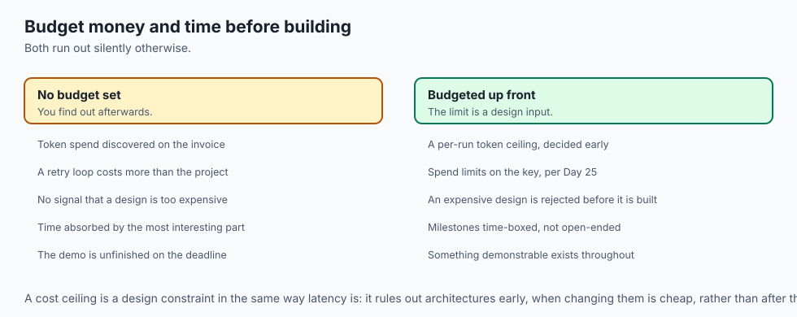

### 2. Time-Boxed Milestones
Adhering strictly to the daily milestone schedule prevents late-stage deployment scrambles and guarantees a polished, stress-tested system on Graduation Day (Day 365).

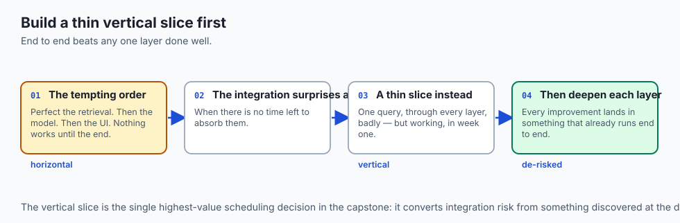

## Alternatives: free, open source, and commercial

| Tool / Framework | Type | Best Suited For | Key Capabilities |
| :--- | :--- | :--- | :--- |
| **Python Standard Library** | Built-in | Scoping & Validation | Zero-dependency charter validation |
| **Pydantic** | Open Source | Schema Specification | Type-safe project metadata models |
| **Notion / Jira** | Commercial SaaS | Project Tracking | Kanban milestone management |
| **Mermaid.js** | Open Source | Architecture Diagrams | Text-to-diagram specification |

## Comparison with related concepts

```text
+-----------------------+-----------------------+-----------------------+
| Dimension             | Toy Tutorial Demo     | Production Capstone   |
+-----------------------+-----------------------+-----------------------+
| End-to-End Breadth    | 1 Script              | Complete 6-Pillar App |
| Evaluation Rigor      | Subjective Vibes      | Automated RAG Triad   |
| Deployment Readiness  | Localhost only        | Dockerized Cloud API  |
| Security Hardening    | None (Plaintext PII)  | PII Vault & Red Team  |
+-----------------------+-----------------------+-----------------------+
```

## When to use it — and when not to

### Enforce Full Scoping Rigor For:
- Production Capstone applications, startup MVP launches, and enterprise proof-of-concepts.

### Lightweight Scoping Applies To:
- Single-evening hackathon explorations.

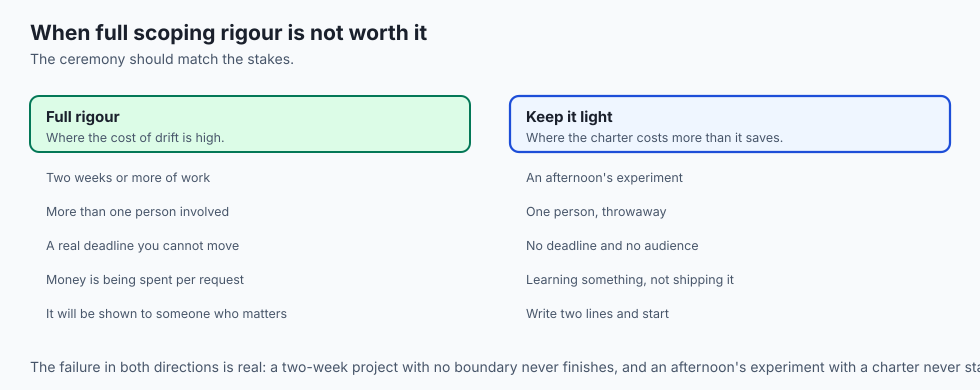

### Production Checklist: Capstone Scoping & Charter Sign-Off
- [ ] Project title, problem statement, and persona documented.
- [ ] 1 of 3 core archetypes selected.
- [ ] All 6 engineering pillars declared and enabled.
- [ ] Quantitative SLAs defined (p95 latency, minimum evaluation accuracy, cost budget).
- [ ] Scoping & Feasibility Scorer executed with score >= 80.0.
- [ ] Walking skeleton architecture approved for Day 352.

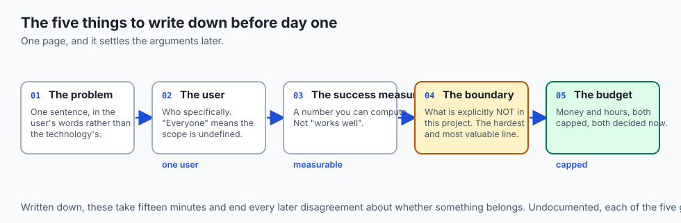

## The AI connection

- **The capstone is the whole stack at once**: a process, an environment, a
  network call, an API, a store, a log, and a repository.

- **Scope is the AI-specific risk here.** Model work expands to fill any time
  allowed, because there is always another experiment.

- **A vertical slice de-risks the integration**, which in an AI system is where
  the surprises live — token limits, latency, cost, and output shape.

- **The cost ceiling is a design input**, not a report. It rules out architectures
  before they are built.

- **What a reviewer assesses is the system, not the model.** Retrieval,
  evaluation and failure handling are the differentiating work.

## Knowledge check

1. **Why is a focused vertical slice superior to a broad, shallow prototype?** A focused vertical slice proves end-to-end engineering excellence across the complete stack (data, reasoning, evals, deployment, security) rather than delivering superficial, unverified features.
2. **What are the 6 mandatory engineering pillars of the AI Capstone?** Data Ingestion, Core Reasoning, Automated Evals, Cloud Deployment, Observability, and Security Hardening.
3. **How does quantitative feasibility scoring protect project timelines?** It catches missing SLAs, excessive compute requirements, or disabled architectural pillars before code is written.

## Hands-on exercise

In this lab, you will build and execute the **Capstone Project Scoping & Feasibility Scorer in Python**. Your implementation will:

1. Define a structured Capstone Project Charter schema using Pydantic/Python dictionaries.
2. Validate the presence and configuration of all 6 mandatory engineering pillars.
3. Evaluate quantitative SLA feasibility (latency, accuracy, budget).
4. Generate a comprehensive Project Scoping & Feasibility Audit Report.

### Expected output

```text
============================= test session starts ==============================
collected 5 items

tests/test_scoping.py .....                                              [100%]

============================== 5 passed in 0.02s ===============================
[SCOPING AUDIT] Validating Capstone Project Charter: "Enterprise RAG Assistant"
[PILLAR VERIFICATION] All 6 mandatory engineering pillars present and enabled.
[SLA AUDIT] p95 latency = 420ms (Target `<= 1000ms`) -> PASS
[SLA AUDIT] Min Eval Accuracy = 90.0% (Target >= 80.0%) -> PASS
[FEASIBILITY SCORE] Composite Score = 100.0 / 100.0 (Grade: EXCELLENT)
[APPROVAL] Project charter officially approved for Milestone 1 build.
```

### Validate your work

Run the pytest test suite:

```bash
pytest tests/run_tests.sh
```

### Troubleshooting

1. **Missing pillars:** Ensure all 6 pillar keys (`data_ingestion`, `core_ai_reasoning`, `automated_evals`, `cloud_deployment`, `observability`, `security_hardening`) are present.
2. **SLA formatting:** Verify that latency SLAs are numeric milliseconds and evaluation accuracy is a float between 0.0 and 1.0.

### Common mistakes

- Disabling automated evals or security hardening in early scoping, causing architectural rework later.

## Practice assignment

Add a **Compute Resource Estimator** calculating required GPU VRAM and monthly API costs based on expected queries per day.

## Extension challenge

Implement an **Automated Markdown Project Charter Exporter** that formats the validated JSON charter into a GitHub-ready `PROJECT_CHARTER.md` document.
