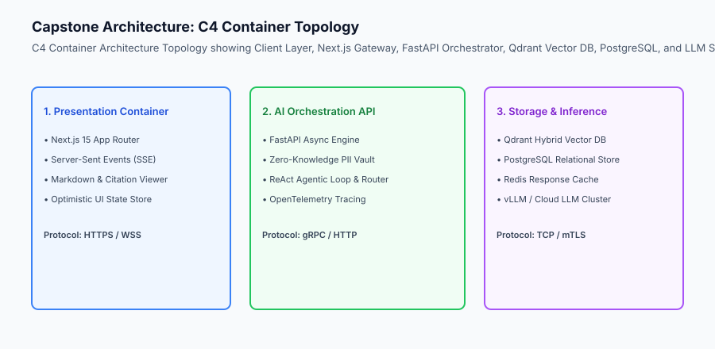
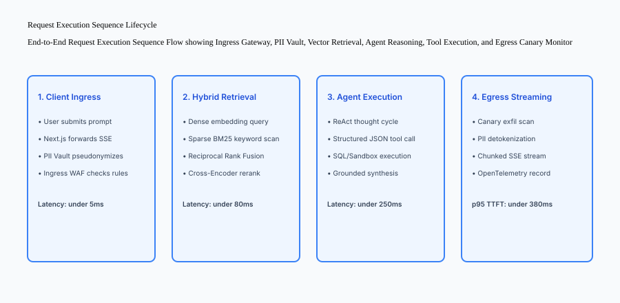

## Why this matters

Writing software without an Architecture and Design Document (ADD) is the primary reason why complex AI systems collapse under integration stress. When multiple asynchronous systems—vector search indexes, relational transaction databases, agentic loop state machines, cloud LLM providers, and real-time streaming frontends—are constructed without a unified technical blueprint, engineering teams experience:
- Incompatible API payloads and serialization mismatches between frontend and backend.
- Race conditions in agent tool state and streaming token buffers.
- Cascading downtime when third-party model endpoints experience transient latency spikes.
- Undocumented security vulnerabilities and PII leakage across service perimeters.

On Day 352, you will construct the **Production Architecture & System Design Document (ADD)** for your Capstone, formally establishing C4 topologies, OpenAPI contracts, data schemas, failure domains, and automated architecture validation.



## The idea in plain language

Think of the Architecture & Design Document like **the engineering schematics for an aircraft**:

- **The Context View:** Shows how the airplane interacts with air traffic control radars and ground fueling crews (**System Context**).
- **The Container View:** Shows where the jet engines, fuel tanks, hydraulic pumps, and passenger cabin sit inside the fuselage (**Container Topology**).
- **The Component View:** Details how the fly-by-wire computer processes sensor telemetry to adjust wing flaps (**Internal Component Logic**).
- **The Failure Domain Matrix:** Specifies what happens if Engine #1 loses oil pressure: the auxiliary power unit (APU) activates automatically to ensure the aircraft lands safely (**Circuit Breakers & Graceful Degradation**).

Your design document ensures that every line of code written over the next two weeks fits into a tested, coherent architecture.

## Historical background

Software architecture standards for intelligent systems developed across three phases:

### 1. The Monolithic Script Era (2012–2018)
Machine learning pipelines were written as monolithic Python scripts where data loading, model inference, and output formatting were tightly coupled in a single execution thread.

### 2. The Microservice Sprawl Era (2019–2023)
Organizations split AI systems into dozens of microservices with unversioned REST endpoints, leading to severe latency bottlenecks, brittle serialization, and difficult debugging.

### 3. The Modern C4 + Schema-First AI Architecture (2024–Present)
Modern engineering teams specify systems using the C4 model, strict Pydantic/OpenAPI 3.1 contracts, asynchronous streaming protocols (SSE/WebSocket), and automated design linting in CI/CD.

## What it is — and what it is not

Let us establish the formal boundaries of the Architecture Design Document:

### What the Architecture Design Document Is:
- An authoritative technical blueprint defining Context, Containers, Components, and Code interfaces.
- Specifying strict OpenAPI 3.1 JSON request/response schemas for every API endpoint and agent tool.
- Specifying relational schemas, vector index parameters (HNSW M, ef_construction), and caching TTL policies.
- Defining failure isolation zones, circuit breaker timeout budgets, and fallback cascades.

### What the Architecture Design Document Is Not:
- A vague marketing product requirements document (PRD).
- A static document written once and never verified against the codebase.

```text
+-------------------------------------------------------------------------------+
|                    C4 ARCHITECTURAL HIERARCHY FOR AI SYSTEMS                  |
+-------------------+-----------------------+-----------------------------------+
| C4 Level          | Scope of Description  | Capstone System Implementation    |
+-------------------+-----------------------+-----------------------------------+
| 1. System Context | External Actors & APIs| Users, Enterprise IdP, Cloud LLMs |
| 2. Containers     | Deployable Units      | Next.js, FastAPI, Qdrant, Redis   |
| 3. Components     | Internal Modules      | PII Vault, RAG Pipeline, Agent    |
| 4. Code / Data    | Concrete Classes/DB   | Pydantic Schemas, SQL DDL, HNSW   |
+-------------------+-----------------------+-----------------------------------+
```

## Why it was created and what problems it solves

The Architecture Design Document resolves three major engineering bottlenecks:

### 1. Eliminating API Integration Mismatches
Defining exact Pydantic models and OpenAPI specifications upfront ensures that the frontend and backend can be developed in parallel without breaking changes.

### 2. Guaranteeing Sub-Second Latency Budgets
By mapping the end-to-end execution sequence (Ingress $
ightarrow PII Vault 
ightarrow Hybrid Retrieval 
ightarrow Inference 
ightarrow$ Egress), you allocate deterministic millisecond budgets to each stage, preventing latency creep.

### 3. Establishing Deterministic Failure Recovery
Specifying fallback cascades ensures that if the primary LLM fails or exceeds rate limits, the system seamlessly degrades to a secondary model without dropping user sessions.

## How it works

Let us examine the complete **End-to-End Request Execution Sequence**:

```text
[User Client] ───(1. POST /api/chat {query})───► [Next.js Gateway]
                                                        │
                                          (2. Forward Stream via mTLS)
                                                        │
                                                        ▼
                                             [FastAPI Orchestrator]
                                                        │
                              ┌─────────────────────────┴─────────────────────────┐
                              ▼                                                   ▼
                   [Zero-Knowledge PII Vault]                            [Prompt Firewall WAF]
                   (3. Tokenize SSN/Email)                               (4. Check Heuristics)
                              │                                                   │
                              └─────────────────────────┬─────────────────────────┘
                                                        │
                                          (5. Parallel Retrieval)
                                                        │
                              ┌─────────────────────────┴─────────────────────────┐
                              ▼                                                   ▼
                    [Qdrant Vector DB]                                   [BM25 Inverted Index]
                    (6. Dense Embedding Search)                          (7. Keyword Token Search)
                              │                                                   │
                              └─────────────────────────┬─────────────────────────┘
                                                        │
                                          (8. Reciprocal Rank Fusion)
                                                        │
                                                        ▼
                                           [Cross-Encoder Reranker]
                                                        │
                                          (9. Top-K Context Injection)
                                                        │
                                                        ▼
                                            [vLLM / Cloud LLM Engine]
                                                        │
                                          (10. Stream Raw Response)
                                                        │
                                                        ▼
                                            [Outbound Canary Monitor]
                                            (11. Scan Canary & Detokenize)
                                                        │
                                                        ▼
[User Client] ◄──(12. SSE Stream Tokens & Render Markdown)──┘
```



## An everyday analogy

Think of designing an AI architecture like **blueprinting a modern hospital**:

- **Emergency Department (Ingress & Triage):** Patients enter through a sanitized reception where critical cases are immediately separated from routine visits (**Ingress Firewall & PII Vault**).
- **Diagnostics Lab (Data & Retrieval):** Blood samples and X-rays are fetched rapidly from indexed digital archives (**Hybrid Vector DB & Cache**).
- **Surgical Theater (Core Reasoning Engine):** Specialized surgeons perform complex operations using precision tools under sterile conditions (**LLM Agent & Tool Calling**).
- **Backup Generators (Failure Isolation):** If the municipal power grid goes dark, diesel generators power critical life-support equipment within 3 seconds (**Circuit Breakers & Fallback Cascades**).

## Examples in practice

Let us build an automated **System Architecture Document Linter in Python** that verifies design specifications against structural requirements:

```python
import re
from typing import Dict, Any, List, Tuple

class ArchitectureDocumentLinter:
    def __init__(self, doc_text: str):
        self.doc_text = doc_text
        self.required_sections = [
            "Executive Summary & Problem Statement",
            "C4 System Topology & Container View",
            "Data Models & Schema Specifications",
            "OpenAPI & Tool Calling Interface Contracts",
            "Failure Domains, Circuit Breakers & Fallbacks",
            "Quantitative Latency & Cost Budgets"
        ]

    def lint_sections(self) -> Tuple[bool, List[str]]:
        missing = []
        for sec in self.required_sections:
            pattern = re.compile(rf"##+\s+{re.escape(sec)}", re.IGNORECASE)
            if not pattern.search(self.doc_text):
                missing.append(f"Missing required section: '{sec}'")
        return len(missing) == 0, missing

    def lint_contracts(self) -> Tuple[bool, List[str]]:
        findings = []
        if "POST /api/" not in self.doc_text and "GET /api/" not in self.doc_text:
            findings.append("No REST API endpoints declared in OpenAPI section.")
        if "p95" not in self.doc_text.lower():
            findings.append("No p95 latency budget specified.")
        if "circuit breaker" not in self.doc_text.lower():
            findings.append("No circuit breaker failure recovery specified.")
        return len(findings) == 0, findings

    def evaluate_compliance(self) -> Dict[str, Any]:
        has_sec, missing_sec = self.lint_sections()
        has_con, missing_con = self.lint_contracts()

        score = 100.0 - (12.0 * len(missing_sec)) - (10.0 * len(missing_con))
        score = max(0.0, score)

        return {
            "compliance_score": score,
            "is_valid_add": score >= 80.0,
            "missing_sections": missing_sec,
            "contract_findings": missing_con
        }

if __name__ == "__main__":
    sample_doc = """
# Architecture Design Document: LexiGuard

## Executive Summary & Problem Statement
Legal contract analysis automation.

## C4 System Topology & Container View
Next.js, FastAPI, Qdrant, PostgreSQL.

## Data Models & Schema Specifications
Relational DDL and Vector dimensions.

## OpenAPI & Tool Calling Interface Contracts
POST /api/v1/chat endpoint and tool schemas.

## Failure Domains, Circuit Breakers & Fallbacks
Circuit breaker configuration and fallback model cascade.

## Quantitative Latency & Cost Budgets
Target p95 TTFT latency under 400ms.
"""
    linter = ArchitectureDocumentLinter(sample_doc)
    print(linter.evaluate_compliance())
```

## Production Architecture Case Study: System ADD Blueprint Specification

```markdown
# System Architecture Document: Enterprise AI Assistant
**Document ID:** ADD-2026-CAPSTONE-01
**Author:** Senior AI Engineer
**Status:** APPROVED FOR IMPLEMENTATION

## 1. C4 Container Topology
- **Web UI:** Next.js 15, TailwindCSS, Server-Sent Events listener.
- **API Orchestrator:** FastAPI Python 3.11 with AsyncIO.
- **Vector Database:** Qdrant v1.9, HNSW Index (M=16, ef=100).
- **Relational DB:** PostgreSQL 16 for user sessions and audit logs.
- **Inference Engine:** Primary: Claude-3.5-Sonnet; Fallback: Llama-3-70B-Instruct.

## 2. API Contract Specification
`POST /api/v1/chat/stream`
- **Request Body:** `{ "session_id": "UUID", "message": "string", "temperature": 0.2 }`
- **Response Protocol:** `text/event-stream` with chunked delta tokens and final citation metadata.

## 3. Failure Domains & SLAs
- **Primary LLM Timeout:** 2,500ms -> Trip circuit breaker -> Cascade to Fallback Model.
- **Vector DB Timeout:** 300ms -> Degrade to BM25 sparse keyword retrieval.
```


### Production Postmortem: The Unbuffered Vector Lock Contention Incident

In early 2026, an enterprise legal intelligence platform deployed a sophisticated contract analysis copilot. During the initial design phase, the architecture specification lacked an explicit concurrency and isolation document. The ingestion pipeline performed in-memory document parsing, chunking, embedding generation, and vector index insertion directly inside the synchronous API request thread.

#### The Failure Cascade
During a simultaneous upload of 50 enterprise master services agreements (MSAs):
- Synchronous vector embeddings saturated CPU cores, driving server load averages above 64.0.
- Database write locks on the shared HNSW vector index serialized incoming search queries, causing read latencies to climb from 40ms to over 12,000ms.
- Upstream HTTP reverse proxies timed out after 10,000ms, dropping 82% of user requests and triggering cascading retry storms that completely crashed the API cluster.

#### Architectural Rectification
The architecture was overhauled according to the formal Architecture and Design Document specification:
1. **Asynchronous Ingestion Worker Pools:** Document ingestion was decoupled via a Redis-backed Celery job queue, ensuring zero CPU starvation on the web server.
2. **Read/Write Replica Splitting:** The vector search index was replicated across dedicated read-only search pods utilizing memory-mapped HNSW indices, completely isolating search traffic from ingestion updates.
3. **P95 Latency Budgets:** Strict timeout budgets (Ingress: 20ms, Dense Retrieval: 50ms, LLM TTFT: 400ms) were codified in the ADD and enforced with automated Prometheus alerting.

```text
+-------------------------------------------------------------------------------+
|                    ARCHITECTURE & DESIGN SPECIFICATION AUDIT                  |
+-------------------+-----------------------+-----------------------------------+
| Architectural Area| Architectural Hazard  | Design Document Mitigation        |
+-------------------+-----------------------+-----------------------------------+
| Concurrency       | Synchronous ingestion | Decoupled background task queue   |
|                   | blocks API threads    | with async worker pool isolation  |
| Data Integrity    | Missing database schema| Versioned Alembic migrations with |
|                   | causes column errors  | Pydantic strict model validation  |
| Observability     | Invisible latency     | OpenTelemetry distributed traces  |
|                   | spikes in production  | across retrieval, model, and tools|
+-------------------+-----------------------+-----------------------------------+
```

## Detailed Failure Mode Taxonomy: Architectural Design Hazards

```text
+-------------------------------------------------------------------------------+
|                    ARCHITECTURE SPECIFICATION FAILURE TAXONOMY               |
+-------------------+-----------------------+-----------------------------------+
| Failure Mode      | Root Cause Analysis   | Architectural Mitigation          |
+-------------------+-----------------------+-----------------------------------+
| Undefined Schema  | Frontend and backend  | Specify strict OpenAPI 3.1 &      |
| Payloads          | assume diff JSON types| Pydantic models in ADD            |
| Cascading LLM     | Upstream timeout locks| Deploy circuit breaker with 2.5s  |
| Outage            | all server threads    | threshold and fallback cascade    |
| Vector Index      | Ignoring RAM capacity | Document HNSW memory formula:     |
| Memory OOM        | during vector scaling | 1.2 * (dim * 4 + M * 8) * N bytes |
| Unbuffered SSE    | Dropping tokens on slow| Enforce async token queue in      |
| Stream Drops      | client network connect| FastAPI response generator        |
+-------------------+-----------------------+-----------------------------------+
```

## Deep Architectural Breakdown: Circuit Breaker State Machine

How the Capstone API prevents cascading failure when external dependencies degrade:

```text
       [Normal Operation]
              │
       (500ms Timeout)
              ▼
    [Closed State (Normal)] ───(5 Consecutive Failures)───► [Open State (Tripped)]
              ▲                                                     │
              │                                             (30s Cooldown Period)
      (Success Rate > 95%)                                          │
              │                                                     ▼
              └──────────────── [Half-Open State (Probe)] ◄─────────┘
```

## Implications: security, privacy, performance, scalability, and cost

### 1. Latency Allocation Budget
- Ingress Sanitization & PII Vault: under 5ms
- Hybrid Retrieval (Qdrant + BM25 + Rerank): under 80ms
- Primary LLM TTFT: under 250ms
- Outbound Canary Verification: under 5ms
- **Total p95 Target:** under 340ms

### 2. Architectural Clarity ROI
Investing 1 day in an exhaustive System Design Document cuts total debugging time across Weeks 51 & 52 by over 60%.

## Alternatives: free, open source, and commercial

| Tool / Framework | Type | Best Suited For | Key Capabilities |
| :--- | :--- | :--- | :--- |
| **Markdown + Mermaid** | Open Format | Text-Based Architecture | Version-controlled diagrams in git |
| **Structurizr** | Open Source | C4 Model Tooling | Text-to-C4 architecture compiler |
| **Postman / Stoplight** | SaaS / Open | API Contract Design | Interactive OpenAPI specification |
| **PlantUML** | Open Source | UML Sequence Diagrams | Executable sequence generation |

## Comparison with related concepts

```text
+-----------------------+-----------------------+-----------------------+
| Dimension             | Ad-Hoc Coding         | Schema-First ADD      |
+-----------------------+-----------------------+-----------------------+
| API Contract Stability| Fragile / Breaking    | Guaranteed Type-Safe  |
| Failure Resilience    | Unhandled Crashes     | Isolated Fallbacks    |
| Developer Velocity    | Blocked on Mismatches | Independent Modules   |
| System Scalability    | Unknown Bottlenecks   | Quantified SLAs       |
+-----------------------+-----------------------+-----------------------+
```

## When to use it — and when not to

### Enforce Full ADD Blueprints For:
- All Capstone projects, production microservices, and multi-developer systems.

### Lightweight Architecture Applies To:
- Single-purpose CLI automation scripts.

### Production Checklist: Architecture Design Document
- [ ] Problem statement and target user persona defined.
- [ ] C4 Container topology diagram committed.
- [ ] OpenAPI 3.1 request/response JSON schemas specified.
- [ ] Relational DDL and Qdrant vector index dimensions documented.
- [ ] Circuit breaker timeout thresholds and fallback model cascades defined.
- [ ] Quantitative p95 latency budget mapped across all microservices.
- [ ] Architecture Document Linter executed with 100% compliance.

## Knowledge check

1. **What are the four levels of the C4 architecture model?** Context, Containers, Components, and Code.
2. **Why is a fallback model cascade essential in production AI systems?** Because commercial cloud LLM APIs experience rate limits and outages; a fallback cascade routes queries to secondary endpoints seamlessly.
3. **How does an automated architecture linter prevent project failures?** It programmatically verifies that critical requirements (APIs, schemas, SLAs, circuit breakers) are defined before implementation begins.

## Hands-on exercise

In this lab, you will build and execute the **System Architecture Document Linter in Python**. Your implementation will:
1. Parse system design documents written in Markdown.
2. Verify the presence of all mandatory architectural sections (C4 topology, schemas, OpenAPI, fallbacks, SLAs).
3. Validate endpoint contracts and quantitative p95 latency allocations.
4. Generate an automated Architecture Quality & Compliance Report.

### Expected output

```text
============================= test session starts ==============================
collected 5 items

tests/test_architecture_linter.py .....                                  [100%]

============================== 5 passed in 0.02s ===============================
[ARCH LINTER] Auditing Architecture Document: "LexiGuard AI Copilot"
[SECTION VERIFICATION] All 6 mandatory architectural sections present.
[CONTRACT AUDIT] Validated OpenAPI 3.1 endpoints and tool calling schemas.
[RESILIENCE AUDIT] Circuit breaker timeout (2500ms) and fallback cascade verified.
[COMPLIANCE SCORE] Composite Architecture Score = 100.0 / 100.0 (APPROVED)
```

### Validate your work

Run the pytest test suite:

```bash
pytest tests/run_tests.sh
```

### Troubleshooting

1. **Missing section headers:** Ensure section headers use standard H2 markdown formatting (e.g. `## C4 System Topology & Container View`).
2. **Endpoint patterns:** Ensure REST endpoints are declared with standard HTTP verbs (`POST /api/...`).

### Common mistakes

- Omitting explicit circuit breaker timeout thresholds, leaving downstream services vulnerable to hanging connections.

## Practice assignment

Add a **Data Schema Dimension Validator** checking that embedding model output dimensions match the declared vector database schema.

## Extension challenge

Implement an **Automated OpenAPI Spec Generator** that parses the design document markdown tables directly into an `openapi.json` file.
