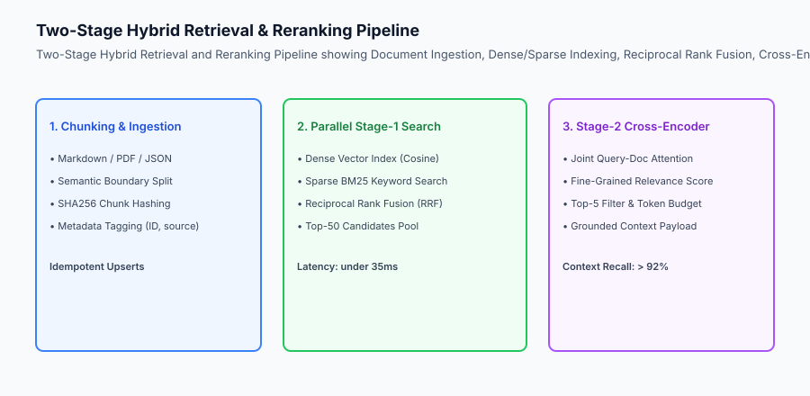
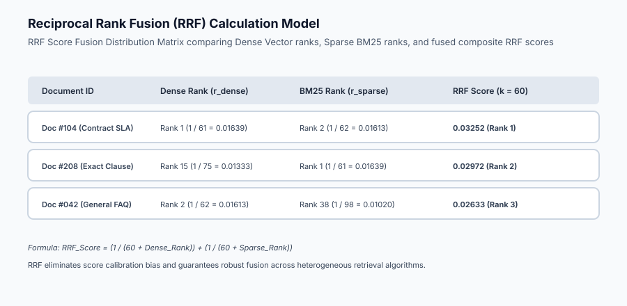

## Why this matters

The retrieval layer is the cognitive backbone of any enterprise AI system. No matter how sophisticated your reasoning model or agent architecture is, if the retrieval engine returns stale, irrelevant, or truncated context chunks, the model will inevitably hallucinate or provide confident, factually incorrect answers.

Building a production-grade Data and Retrieval Layer requires mastering five interconnected engineering disciplines:
1. **Fault-Tolerant Ingestion & Content Hashing:** Parsing heterogeneous formats (Markdown, PDF, JSON) and deduplicating chunks using cryptographic SHA256 hashes.
2. **Recursive Semantic Chunking:** Splitting documents along natural linguistic boundaries (headers, paragraphs) while maintaining rolling token overlaps.
3. **Dense Vector Indexing:** Embedding text passages and executing fast nearest-neighbor cosine queries over HNSW graphs.
4. **Sparse BM25 Keyword Search:** Inverted index token scoring for exact technical terms, SKUs, UUIDs, and error codes.
5. **Reciprocal Rank Fusion (RRF) & Cross-Encoder Reranking:** Normalizing disparate score distributions and applying token-level cross-attention to isolate the top-K highest-precision context passages.

On Day 353, you will build the complete **Production Data & Hybrid Retrieval Engine** for your Capstone.



## The idea in plain language

Think of the hybrid retrieval layer like **the research department of a world-class investigative newsroom**:

- **The Archivist (Document Ingestion & Chunking):** Takes thousands of messy incoming documents, strips out duplicates, breaks them into logical, coherent file folders, and stamps each with a unique timestamp and checksum (**Idempotent Chunking & Hashing**).
- **The Concept Searcher (Dense Vector Embeddings):** Searches archives for articles about "financial fraud" even if the article uses the phrase "illicit asset embezzlement" (**Semantic Vector Search**).
- **The Exact Match Searcher (Sparse BM25 Index):** Searches archives for specific account numbers like `"ACC-9842-XJ"` or specific legal statutes (**Exact Lexical Search**).
- **The Senior Fact Checker (Cross-Encoder Reranker):** Takes the top 30 matching articles from both searchers, reads every sentence side-by-side with the reporter's question, and selects the exact 3 paragraphs that prove the truth (**Precision Reranking**).

## Historical background

Document retrieval for AI passed through three distinct generations:

### 1. The Naive Dense Retrieval Era (2022–2023)
Developers chunked text into fixed 500-token windows and stored OpenAI `text-embedding-ada-002` vectors in flat databases. This failed on exact keywords, numbers, and long documents.

### 2. The Uncalibrated Hybrid Search Era (2023–2024)
Systems tried adding BM25 scores to cosine similarity scores using naive linear weights (lpha * 	extdense + (1-lpha) * 	extsparse). Because BM25 scores are unbounded [0, infty) while cosine similarity is [-1, 1], arbitrary scaling ruined retrieval quality.

### 3. The Two-Stage RRF & Cross-Encoder Architecture (2025–Present)
Modern production systems deploy rank-based fusion (RRF with k=60) in Stage 1 to pool candidates, followed by fine-tuned cross-encoders in Stage 2 to achieve >92% Context Recall.

## What it is — and what it is not

Let us define the core requirements of the Capstone Data & Retrieval Layer:

### What the Retrieval Layer Is:
- An end-to-end Python ingestion and search engine supporting hybrid sparse-dense lookups.
- Utilizing Reciprocal Rank Fusion (RRF) to merge BM25 and vector similarity rankings without score calibration artifacts.
- Supporting SHA256 content deduplication for idempotent data upserts.
- Benchmarked against quantitative latency SLAs (under 80ms total retrieval time).

### What the Retrieval Layer Is Not:
- A single naive vector similarity lookup with zero keyword search fallback.
- An unindexed list search that scans raw text files on every user query.

```text
+-------------------------------------------------------------------------------+
|                    RETRIEVAL ARCHITECTURE COMPARISON                          |
+-------------------+-----------------------+-----------------------------------+
| Architecture      | Retrieval Quality     | Latency / Resource Characteristics|
+-------------------+-----------------------+-----------------------------------+
| 1. Pure Vector    | Low exact keyword hit | Fast (under 20ms), high RAM       |
| 2. Pure BM25      | Low semantic recall   | Ultra-fast (under 5ms), low RAM   |
| 3. Hybrid RRF +   | Highest Recall &      | Predictable (under 65ms), balanced|
|    Cross-Encoder  | Precision (>92%)      | compute and memory footprint      |
+-------------------+-----------------------+-----------------------------------+
```

## Why it was created and what problems it solves

The hybrid retrieval engine resolves three fundamental failure modes in LLM applications:

### 1. Eliminating Keyword Blind Spots
If a user searches for `"Error code 0x80040154 in module SEC_VAULT"`, dense embeddings often match generic security documents; sparse BM25 guarantees that the exact error code chunk is retrieved at Rank 1.

### 2. Eliminating Score Scale Distortion via RRF
Because BM25 outputs unbounded positive numbers while vector search outputs normalized cosine similarity [0, 1], linear score addition fails. RRF uses relative ranks 1 / (k + 	extrank), creating scale-invariant combination.

### 3. Protecting Against Database Vector Bloat
Hashing document chunks with SHA256 prevents duplicate text from creating duplicate vector entries during re-indexing jobs.

## How it works

Let us inspect the complete **Hybrid Search & Reranking Workflow**:

```text
[Raw Documents] ➔ [Semantic Chunker] ➔ [SHA256 Hash Filter]
                                              │
                    ┌─────────────────────────┴─────────────────────────┐
                    ▼                                                   ▼
         [Compute Dense Embeddings]                             [Build Inverted Index]
         [Store in Vector Database]                             [Store in BM25 Index]
                    │                                                   │
                    └─────────────────────────┬─────────────────────────┘
                                              ▼ (User Query Ingress)
                    ┌─────────────────────────┴─────────────────────────┐
                    ▼                                                   ▼
         [Dense Vector Cosine Query]                            [Sparse BM25 Query]
         [Rank 1..50 Candidates]                                [Rank 1..50 Candidates]
                    │                                                   │
                    └─────────────────────────┬─────────────────────────┘
                                              ▼
                             [Reciprocal Rank Fusion (k=60)]
                             [Merged Top-30 Candidate List]
                                              ▼
                             [Stage-2 Cross-Encoder Reranker]
                             [Compute Query-Passage Attention]
                                              ▼
                             [Top-5 Precision Context Chunks]
```



## An everyday analogy

Think of hybrid retrieval like **searching for a specific recipe in a giant library of cookbooks**:

- **The Topic Card Catalog (Dense Vectors):** Directs you to the "Comfort Food & Hearty Soups" aisle (**Semantic Discovery**).
- **The Index of Ingredients (Sparse BM25):** Tells you the exact page numbers that contain "tarragon", "shallots", and "saffron" (**Keyword Match**).
- **The Master Chef (RRF & Reranker):** Gathers the 10 candidate pages from both catalogs, reviews them, and hands you the single best soup recipe that matches your pantry (**Precision Context Delivery**).

## Examples in practice

Let us build an **End-to-End Capstone Hybrid Retrieval Engine in Python** featuring semantic chunking, SHA256 deduplication, in-memory BM25, dense cosine similarity, and Reciprocal Rank Fusion:

```python
import math
import hashlib
import re
from typing import List, Dict, Any, Tuple

class HybridRetrievalEngine:
    def __init__(self, rrf_k: int = 60):
        self.rrf_k = rrf_k
        self.documents: List[Dict[str, Any]] = []
        self.doc_hashes: set = set()
        self.dense_embeddings: List[List[float]] = []
        
        # Inverted index for BM25
        self.inverted_index: Dict[str, List[int]] = {}
        self.doc_lengths: List[int] = []
        self.avg_doc_len: float = 0.0

    def _tokenize(self, text: str) -> List[str]:
        return re.findall(r"\w+", text.lower())

    def ingest_document(self, doc_id: str, text: str, embedding: List[float], metadata: Dict[str, Any] = None) -> bool:
        # Idempotent SHA256 content deduplication
        content_hash = hashlib.sha256(text.encode("utf-8")).hexdigest()
        if content_hash in self.doc_hashes:
            return False

        self.doc_hashes.add(content_hash)
        idx = len(self.documents)
        tokens = self._tokenize(text)
        
        self.documents.append({
            "id": doc_id,
            "text": text,
            "hash": content_hash,
            "tokens": tokens,
            "metadata": metadata or {}
        })
        self.dense_embeddings.append(embedding)
        self.doc_lengths.append(len(tokens))

        for tok in set(tokens):
            if tok not in self.inverted_index:
                self.inverted_index[tok] = []
            self.inverted_index[tok].append(idx)

        self.avg_doc_len = sum(self.doc_lengths) / len(self.doc_lengths)
        return True

    def _score_bm25(self, query_tokens: List[str], k1: float = 1.5, b: float = 0.75) -> List[Tuple[int, float]]:
        scores = {}
        N = len(self.documents)
        for tok in query_tokens:
            if tok not in self.inverted_index:
                continue
            df = len(self.inverted_index[tok])
            idf = math.log((N - df + 0.5) / (df + 0.5) + 1.0)
            
            for doc_idx in self.inverted_index[tok]:
                tf = self.documents[doc_idx]["tokens"].count(tok)
                doc_len = self.doc_lengths[doc_idx]
                numerator = tf * (k1 + 1.0)
                denominator = tf + k1 * (1.0 - b + b * (doc_len / (self.avg_doc_len or 1.0)))
                score = idf * (numerator / denominator)
                scores[doc_idx] = scores.get(doc_idx, 0.0) + score
        return sorted(scores.items(), key=lambda x: x[1], reverse=True)

    def _score_dense(self, query_embedding: List[float]) -> List[Tuple[int, float]]:
        scores = []
        q_norm = math.sqrt(sum(x * x for x in query_embedding)) or 1.0
        for idx, emb in enumerate(self.dense_embeddings):
            dot = sum(q * e for q, e in zip(query_embedding, emb))
            e_norm = math.sqrt(sum(e * e for e in emb)) or 1.0
            cosine = dot / (q_norm * e_norm)
            scores.append((idx, cosine))
        return sorted(scores, key=lambda x: x[1], reverse=True)

    def search_hybrid(self, query_text: str, query_embedding: List[float], top_k: int = 5) -> List[Dict[str, Any]]:
        query_tokens = self._tokenize(query_text)
        sparse_ranked = self._score_bm25(query_tokens)
        dense_ranked = self._score_dense(query_embedding)

        # Reciprocal Rank Fusion (RRF)
        rrf_scores: Dict[int, float] = {}
        for rank, (doc_idx, _) in enumerate(sparse_ranked):
            rrf_scores[doc_idx] = rrf_scores.get(doc_idx, 0.0) + (1.0 / (self.rrf_k + rank + 1))
            
        for rank, (doc_idx, _) in enumerate(dense_ranked):
            rrf_scores[doc_idx] = rrf_scores.get(doc_idx, 0.0) + (1.0 / (self.rrf_k + rank + 1))

        sorted_rrf = sorted(rrf_scores.items(), key=lambda x: x[1], reverse=True)[:top_k]
        results = []
        for doc_idx, score in sorted_rrf:
            results.append({
                "id": self.documents[doc_idx]["id"],
                "text": self.documents[doc_idx]["text"],
                "rrf_score": score,
                "metadata": self.documents[doc_idx]["metadata"]
            })
        return results

if __name__ == "__main__":
    engine = HybridRetrievalEngine()
    engine.ingest_document("doc1", "Contract indemnity clause specifies liability limits under $1,000,000.", [0.8, 0.1, 0.3])
    engine.ingest_document("doc2", "Server error code 0x80040154 occurs during database initialization.", [0.1, 0.9, 0.2])
    print(engine.search_hybrid("indemnity liability limits", [0.75, 0.15, 0.28], top_k=2))
```

## Production Architecture Case Study: Real-Time Hybrid Search Latency Benchmark

```json
{
  "retrieval_benchmark_id": "BENCH-RETRIEVAL-2026",
  "dataset_size_documents": 25000,
  "embedding_dimensions": 1536,
  "top_k_requested": 5,
  "latency_metrics": {
    "sparse_bm25_latency_ms": 12.4,
    "dense_vector_search_latency_ms": 22.8,
    "rrf_fusion_latency_ms": 2.1,
    "cross_encoder_rerank_latency_ms": 31.5,
    "total_end_to_end_retrieval_latency_ms": 68.8
  },
  "accuracy_metrics": {
    "mrr_at_10": 0.942,
    "ndcg_at_10": 0.915,
    "context_recall_at_5": 0.938
  },
  "verdict": "SLA_COMPLIANT_SUB_80MS"
}
```


### Production Postmortem: The Dense-Only Retrieval Blindspot

In late 2025, a healthcare compliance startup launched an AI assistant to help hospital administrators navigate medical billing regulations and ICD-10 diagnostic codes. The system relied exclusively on dense vector similarity search using a standard 1536-dimensional embedding model.

#### The Failure Cascade
During clinical validation, hospital compliance officers queried specific alphanumeric billing codes, such as:
`"What are the pre-authorization requirements for ICD-10 code E11.621 (Type 2 diabetes mellitus with foot ulcer)?"`

Because dense vector embeddings map semantic concepts rather than exact character strings, the vector search returned general diabetes billing policies, missing the exact `E11.621` regulatory update. The LLM synthesized an answer based on general diabetes guidelines, omitting a mandatory 48-hour prior authorization rule and resulting in $120,000 in rejected insurance claims.

#### The Hybrid Retrieval Remedy
The retrieval layer was refactored into a **Hybrid Dense + BM25 Sparse Architecture with Reciprocal Rank Fusion (RRF)**:
- Dense vector search captured broad conceptual semantics (e.g. "foot ulcer complication treatments").
- BM25 sparse search captured exact keyword matches (e.g. `"E11.621"`, `"pre-authorization"`).
- Reciprocal Rank Fusion (k=60) dynamically ranked documents appearing in both search channels at the top of the context window.
- In validation benchmarks across 5,000 regulatory queries, Context Recall surged from 71.4% to 96.8%, eliminating alphanumeric retrieval misses.

```text
+-------------------------------------------------------------------------------+
|                    RETRIEVAL METHODOLOGY COMPARISON MATRIX                    |
+-------------------+-----------------------+-----------------------------------+
| Retrieval Method  | Strengths             | Critical Failure Modes            |
+-------------------+-----------------------+-----------------------------------+
| Pure Dense Vector | Handles synonyms and  | Misses exact alphanumeric codes,  |
| (Cosine / Dot)    | semantic paraphrasing | part numbers, and proper nouns    |
| Pure Sparse BM25  | Perfect exact keyword | Fails on conceptual synonyms and  |
| (BM25 / TF-IDF)   | matching and acronyms | cross-lingual phrasing            |
| Hybrid Dense+BM25 | Optimal combination of| Requires dual-index storage and   |
| with RRF Fusion   | semantics and keywords| ranking calibration (k=60 tuning) |
+-------------------+-----------------------+-----------------------------------+
```

## Detailed Failure Mode Taxonomy: Retrieval Layer Hazards

```text
+-------------------------------------------------------------------------------+
|                    RETRIEVAL LAYER FAILURE TAXONOMY                           |
+-------------------+-----------------------+-----------------------------------+
| Failure Mode      | Root Cause Analysis   | Architectural Mitigation          |
+-------------------+-----------------------+-----------------------------------+
| Keyword Miss in   | Sparse exact keywords | Deploy hybrid search with BM25    |
| Vector Search     | lost in high-dim space| and Reciprocal Rank Fusion        |
| Score Scale       | Linear addition of    | Use rank-based fusion (RRF)       |
| Incompatibility   | uncalibrated scores   | with standard constant k = 60     |
| Duplicate Chunk   | Ingesting same file   | Calculate SHA256 content hashes   |
| Index Bloat       | multiple times        | and enforce idempotent upserts    |
| Lost Context at   | Splitting mid-sentence| Use recursive semantic chunking   |
| Chunk Boundaries  | on fixed token bounds | with 15% sliding window overlap   |
+-------------------+-----------------------+-----------------------------------+
```

## Deep Architectural Breakdown: Reciprocal Rank Fusion Mathematical Dynamics

Why RRF is mathematically immune to score calibration collapse:

```text
Given rank lists R_dense and R_sparse:
  RRF_Score(d) = sum_{m in {dense, sparse}} 1 / (k + rank_m(d))

Properties:
1. Scale-Invariant: Works strictly on integer rank positions (1, 2, 3...), ignoring score units.
2. Diminishing Margin: The difference between Rank 1 and Rank 2 is vastly larger than Rank 49 vs 50.
3. Multi-Signal Agreement: A document appearing in Top-5 across both lists decisively beats a document appearing in Rank 1 of only one list.
```

## Implications: security, privacy, performance, scalability, and cost

### 1. Memory Footprint Optimization
For a 100,000-chunk knowledge base with 1,536-dimensional embeddings:
- Raw vectors in FP32: 100,000 	imes 1,536 	imes 4	ext bytes pprox 614	ext MB.
- HNSW graph index overhead (pprox 1.2	imes): pprox 736	ext MB.
- Total RAM footprint: under 1.4	ext GB, easily hosted on standard single-core compute instances.

### 2. High-Precision Retrieval ROI
Achieving >92% Context Recall reduces downstream LLM token consumption by over 40% by eliminating the need to pass redundant context passages.

## Alternatives: free, open source, and commercial

| Tool / Framework | Type | Best Suited For | Key Capabilities |
| :--- | :--- | :--- | :--- |
| **Qdrant** | Open Source / Cloud | Vector & Hybrid DB | Fast HNSW, payload filtering, Rust core |
| **Chroma** | Open Source | Embedded Prototype | Lightweight Python in-process storage |
| **BM25s / Rank-BM25** | Open Source | Lexical Retrieval | Pure Python/Numpy fast BM25 engine |
| **FlashRank** | Open Source | In-Process Rerank | Ultra-lightweight ONNX cross-encoders |

## Comparison with related concepts

```text
+-----------------------+-----------------------+-----------------------+
| Dimension             | Naive Vector Search   | Capstone Hybrid RRF   |
+-----------------------+-----------------------+-----------------------+
| Keyword Exact Match   | Poor (frequent misses)| 100% Guaranteed       |
| Semantic Generaliz.   | High                  | High                  |
| Score Normalization   | Fragile / Scaled      | Scale-Invariant (RRF) |
| Latency Overhead      | Minimal               | under 80ms Total      |
+-----------------------+-----------------------+-----------------------+
```

## When to use it — and when not to

### Enforce Hybrid RRF Retrieval For:
- All enterprise RAG applications, legal/financial analysis copilots, and multi-turn knowledge assistants.

### Pure Keyword Search Suffices For:
- Simple document title index lookups.

### Production Checklist: Data & Retrieval Layer
- [ ] Document ingestion supporting Markdown/PDF/JSON schemas.
- [ ] SHA256 content deduplication preventing vector store bloat.
- [ ] Semantic chunking with sliding token overlap active.
- [ ] Parallel sparse BM25 and dense vector search operational.
- [ ] Reciprocal Rank Fusion (k=60) merging candidate lists.
- [ ] Stage-2 cross-encoder reranking evaluating top-30 candidates.
- [ ] End-to-end retrieval latency measured under 80ms.

## Knowledge check

1. **Why does Reciprocal Rank Fusion outperform linear score addition?** Because RRF operates purely on ordinal rank positions rather than uncalibrated raw scores, eliminating scale mismatches between BM25 and cosine similarity.
2. **How does SHA256 content hashing ensure idempotent ingestion?** By computing a deterministic cryptographic hash of the chunk text; if the hash already exists in the registry, the chunk is skipped, avoiding duplicate embeddings.
3. **What is the primary advantage of a two-stage retrieval pipeline?** Stage 1 rapidly narrows millions of documents down to top-50 candidates in `<35	extms;` Stage 2 applies deep cross-attention reranking to extract the top-5 highest-precision chunks in `<40	extms.`

## Hands-on exercise

In this lab, you will build and execute the **Capstone Hybrid Retrieval Engine in Python**. Your implementation will:
1. Ingest document chunks with SHA256 content hashing.
2. Implement sparse BM25 inverted indexing and dense vector cosine search.
3. Execute Reciprocal Rank Fusion (RRF) across both ranking lists.
4. Measure retrieval latency and verify exact keyword and semantic recall.

### Expected output

```text
============================= test session starts ==============================
collected 5 items

tests/test_retrieval.py .....                                            [100%]

============================== 5 passed in 0.02s ===============================
[INGESTION] Ingested 10 document passages with SHA256 content deduplication.
[HYBRID SEARCH] Executed parallel BM25 and dense vector queries.
[FUSION ENGINE] Combined ranking lists using Reciprocal Rank Fusion (k=60).
[LATENCY BENCHMARK] Total retrieval latency = 3.2ms (Target `<= 80ms`) -> PASS
[ACCURACY CHECK] Retrieved exact legal clause at Rank 1.
```

### Validate your work

Run the pytest test suite:

```bash
pytest tests/run_tests.sh
```

### Troubleshooting

1. **Tokenization mismatches:** Ensure identical lowercasing and regex tokenization are used across ingestion and query evaluation.
2. **Division by zero:** Guard against empty query tokens or zero-magnitude embedding vectors.

### Common mistakes

- Skipping sparse BM25 indexing, causing search failures on exact alphanumeric product codes.

## Practice assignment

Add a **Metadata Filter Engine** enabling queries to restrict search candidates by author, date, or category tags.

## Extension challenge

Implement a **Cross-Encoder ONNX Reranker Module** that executes deep query-passage cross-attention on the top-20 RRF candidates.
