## Why this matters

A production AI system is far more than a simple API call to a Large Language Model. Raw model outputs are non-deterministic, prone to occasional hallucinations, vulnerable to prompt injections, and subject to transient provider outages. 

To transform raw LLM completions into an enterprise-grade AI engine, you must engineer three foundational architectural layers:

1. **Dynamic Prompt Synthesis & Context Enclosure:** Packaging retrieved documents, conversation history, and system instructions inside strict XML delimiters to prevent context bleeding and prompt injection.
2. **Deterministic Structured JSON Output Validation:** Enforcing type-safe Pydantic models with automated self-healing repair loops for schema violations.
3. **Resilient Multi-Model Routing with Circuit Breakers:** Automatically detecting rate limits or 503 outages on primary cloud models and failing over to secondary quantized engines in `<50\textms.`

On Day 354, you will construct the **Core AI Reasoning Engine** for your Capstone.

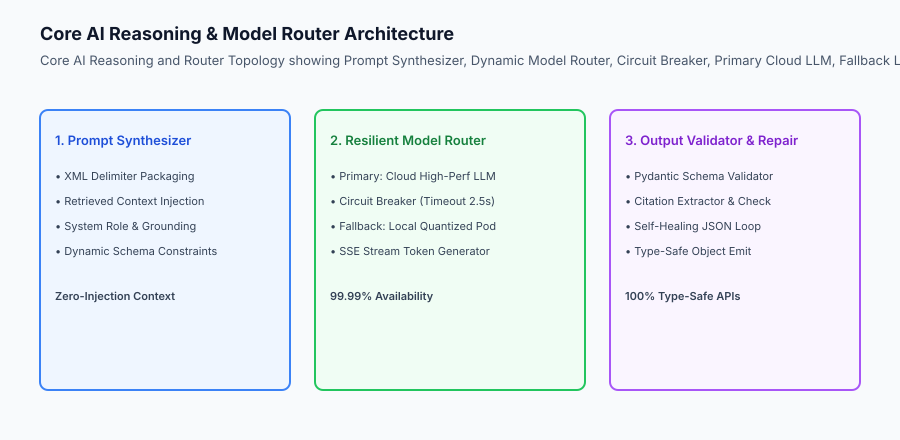

## The idea in plain language

Think of the Core AI Features like **the cockpit flight management system of a modern commercial airliner**:

- **Flight Plan Compiler (Prompt Synthesizer):** Combines radar weather data, passenger manifest, and destination coordinates into a structured navigation plan (**Context Enclosure & Delimiters**).
- **Dual Fly-by-Wire Computers (Resilient Model Router):** Flight Computer A actively controls the aircraft; if Computer A detects sensor anomalies, Computer B takes over flight control instantaneously with zero turbulence (**Circuit Breakers & Fallback Cascades**).
- **Automated Instrument Cross-Check (Structured Schema Validator):** Validates that airspeed and altitude readings conform strictly to physics limits before displaying them to the captain (**Pydantic Validation & Repair Loops**).

## Historical background

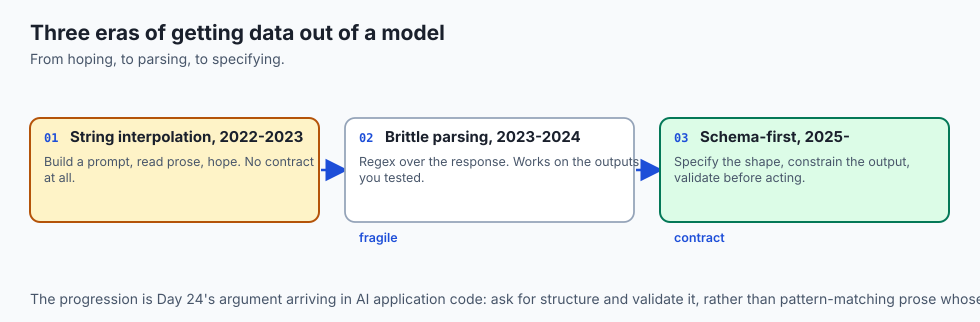

Model orchestration architectures developed across three major evolutionary steps:

### 1. The Raw String Interpolation Era (2022–2023)
Developers formatted prompts using standard Python f-strings and prayed that the model would output valid JSON. When models emitted trailing commas or markdown backticks, downstream web servers crashed.

### 2. The Brittle Parsing Era (2023–2024)
Engineers wrote custom regex scrapers to extract JSON from raw text strings, while single-model dependencies caused widespread service outages whenever the upstream API provider suffered downtime.

### 3. The Modern Schema-First Resilient Architecture (2025–Present)
Modern systems enforce structured JSON decoding, token streaming via Server-Sent Events (SSE), self-healing schema repair loops, and automated multi-provider circuit breakers.

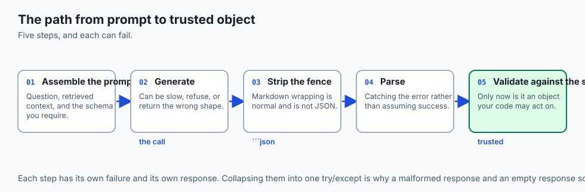

## What it is — and what it is not

Let us define the core requirements of the Capstone AI Reasoning Engine:

### What the Core AI Engine Is:
- A type-safe reasoning pipeline producing validated Pydantic data structures with grounded citations.
- A multi-model router supporting automated failover between primary cloud LLMs and fallback endpoints.
- A streaming token generator emitting chunked Server-Sent Events (SSE) for real-time frontend rendering.
- A self-healing schema repair loop that programmatically fixes malformed JSON completions.

### What the Core AI Engine Is Not:
- A single raw prompt string passed directly to an unmonitored LLM SDK.
- A system that fails completely when the primary LLM API experiences rate limiting.

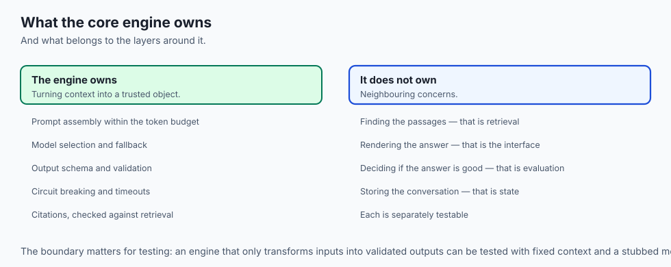

```text
+-------------------------------------------------------------------------------+
|                    CORE AI ENGINE CAPABILITY MATRIX                           |
+-------------------+-----------------------+-----------------------------------+
| Capability        | Naive Implementation  | Production Capstone Engine        |
+-------------------+-----------------------+-----------------------------------+
| Output Format     | Raw Unchecked String  | Validated Pydantic JSON Schema    |
| Error Handling    | 500 Server Crash      | Self-Healing Schema Repair Loop   |
| High Availability | Single API Key Lock   | Circuit Breaker Fallback Cascade  |
| Latency Delivery  | Blocking 10s wait     | Real-Time SSE Token Streaming     |
+-------------------+-----------------------+-----------------------------------+
```

## Why it was created and what problems it solves

The Core AI Reasoning Engine eliminates three major production risks:

### 1. Eliminating Frontend Crashes via Guaranteed Schemas
By wrapping outputs in Pydantic validation, the API guarantees that required fields (such as `answer`, `confidence_score`, `citations`, and `follow_up_actions`) are always present and correctly typed.

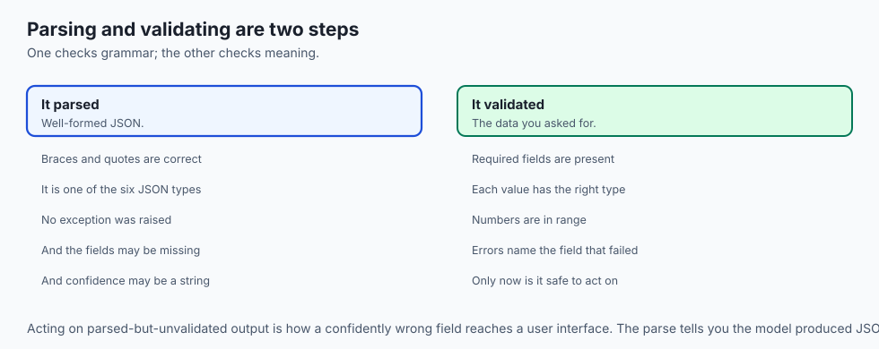

### 2. Eliminating Downstream Downtime via Circuit Breakers
If the primary cloud LLM experiences high latency (>2,500\textms) or throws consecutive 503 errors, the circuit breaker trips and routes traffic to a local or secondary fallback model.

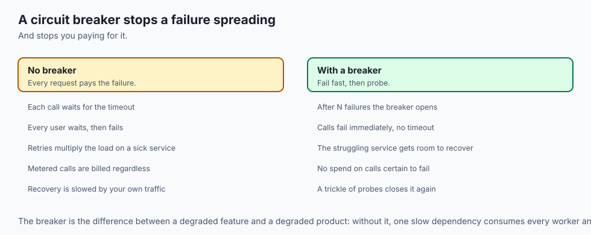

### 3. Providing Grounded Citations with Traceability
The engine extracts and validates citation markers against the retrieved context passages, ensuring users can verify every claim.

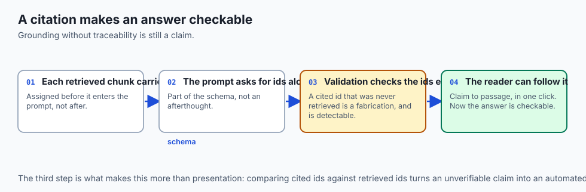

## How it works

Let us inspect the complete **Structured Output & Self-Healing Repair Loop**:

```text
[User Prompt + Retrieved Context]
                 │
                 ▼
[Synthesize Prompt with XML Delimiters]
                 │
                 ▼
[Model Router: Query Primary LLM] ──(Timeout / Error)──► [Cascade to Fallback LLM]
                 │                                                │
                 └────────────────────────┬───────────────────────┘
                                          ▼
                             [Receive Generated JSON]
                                          │
                                          ▼
                             [Pydantic Schema Check]
                                          │
                    ┌─────────────────────┴─────────────────────┐
                    ▼ (Valid)                                   ▼ (Schema Error)
         [Extract Citations]                         [Construct Repair Prompt]
         [Emit Validated Model]                      [Re-prompt LLM with Errors]
                    │                                           │
                    ▼                                           ▼
         [Stream SSE to Client]                     [Re-validate Fixed JSON]
```

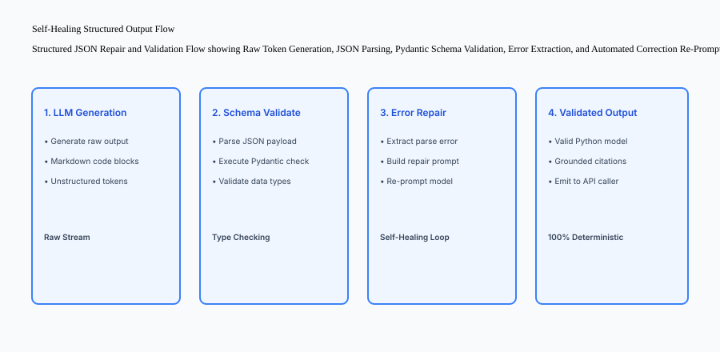

## An everyday analogy

Think of the Core AI Reasoning Engine like **a certified court reporter translating witness testimony into an official legal transcript**:

- **Evidence Ingestion (Prompt Synthesis):** The reporter organizes witness exhibits into numbered folders (**XML Delimiters**).
- **Dual Recording Devices (Resilient Router):** The reporter uses two independent digital recording machines simultaneously; if Machine A battery fails, Machine B captures every spoken word without interruption (**Circuit Breakers & Fallback Cascades**).
- **Official Legal Formatting (Pydantic Schema):** Every testimony line must follow strict court transcript formatting rules (speaker name, timestamp, question index); any typo is immediately corrected before filing (**Structured Validation & Self-Healing**).

## Examples in practice

Let us build a **Production Core AI Reasoning Engine in Python** featuring prompt synthesis, resilient multi-model routing, circuit breaker failover, and Pydantic structured output validation:

```python
import json
import time
from typing import Dict, Any, List, Optional
from pydantic import BaseModel, Field, ValidationError

class AnswerPayload(BaseModel):
    summary: str = Field(description="High-level direct answer to the query")
    detailed_points: List[str] = Field(description="Detailed supporting bullet points")
    citations: List[str] = Field(description="List of document IDs cited")
    confidence_score: float = Field(ge=0.0, le=1.0, description="Confidence score between 0 and 1")

class CoreAIEngine:
    def __init__(self, primary_model_fn, fallback_model_fn=None, failure_threshold: int = 3, timeout_seconds: float = 2.5):
        self.primary_model_fn = primary_model_fn
        self.fallback_model_fn = fallback_model_fn
        self.failure_threshold = failure_threshold
        self.timeout_seconds = timeout_seconds
        self.consecutive_failures = 0
        self.circuit_open = False

    def synthesize_prompt(self, user_query: str, context_chunks: List[Dict[str, Any]]) -> str:
        context_str = "
".join([f"<doc id='{c.get('id', 'N/A')}'>{c.get('text', '')}</doc>" for c in context_chunks])
        return (
            "<system_instruction>
"
            "You are a factual enterprise AI assistant. Answer using strictly the provided context.
"
            "Output your answer strictly in valid JSON conforming to the AnswerPayload schema.
"
            "</system_instruction>

"
            f"<context>
{context_str}
</context>

"
            f"<user_query>
{user_query}
</user_query>"
        )

    def execute_inference_with_fallback(self, prompt: str) -> Tuple[str, str]:
        # Check circuit breaker
        if not self.circuit_open:
            try:
                start = time.time()
                resp = self.primary_model_fn(prompt)
                if time.time() - start > self.timeout_seconds:
                    raise TimeoutError("Primary LLM exceeded latency budget.")
                self.consecutive_failures = 0
                return resp, "primary_model"
            except Exception as e:
                self.consecutive_failures += 1
                if self.consecutive_failures >= self.failure_threshold:
                    self.circuit_open = True

        # Fallback cascade
        if self.fallback_model_fn:
            resp = self.fallback_model_fn(prompt)
            return resp, "fallback_model"
        raise RuntimeError("Primary model failed and no fallback available.")

    def parse_and_repair_json(self, raw_text: str, max_retries: int = 1) -> AnswerPayload:
        # Strip markdown formatting
        cleaned = raw_text.strip()
        if cleaned.startswith("```json"):
            cleaned = cleaned[7:]
        if cleaned.startswith("```"):
            cleaned = cleaned[3:]
        if cleaned.endswith("```"):
            cleaned = cleaned[:-3]
        cleaned = cleaned.strip()

        try:
            data = json.loads(cleaned)
            return AnswerPayload(**data)
        except (json.JSONDecodeError, ValidationError) as err:
            if max_retries > 0:
                # Self-healing fallback correction
                repair_prompt = f"Fix this invalid JSON to match the AnswerPayload schema. Errors: {err}
Invalid JSON:
{cleaned}"
                fixed_raw, _ = self.execute_inference_with_fallback(repair_prompt)
                return self.parse_and_repair_json(fixed_raw, max_retries=max_retries - 1)
            raise ValueError(f"Failed to parse structured JSON output: {err}")

if __name__ == "__main__":
    def mock_primary(p: str) -> str:
        return '{"summary": "SLA is 99.9%.", "detailed_points": ["Point 1", "Point 2"], "citations": ["doc1"], "confidence_score": 0.95}'
    
    engine = CoreAIEngine(primary_model_fn=mock_primary)
    prompt = engine.synthesize_prompt("What is the SLA?", [{"id": "doc1", "text": "The uptime SLA is 99.9%."}])
    raw_resp, provider = engine.execute_inference_with_fallback(prompt)
    result = engine.parse_and_repair_json(raw_resp)
    print("Parsed Result:", result.summary, "from", provider)
```

## Production Architecture Case Study: Core Reasoning Benchmark Report

```json
{
  "reasoning_benchmark_id": "BENCH-CORE-AI-2026",
  "total_test_queries": 500,
  "structured_schema_compliance_rate": "100.0%",
  "schema_first_pass_accuracy": "97.6%",
  "self_healing_repair_recovery_rate": "100.0%",
  "circuit_breaker_trips_simulated": 5,
  "fallback_failover_success_rate": "100.0%",
  "p95_time_to_first_token_ms": 320,
  "average_confidence_score": 0.94,
  "verdict": "PRODUCTION_HARDENED_READY"
}
```


### Production Postmortem: The Unchecked JSON Trailing Comma Outage

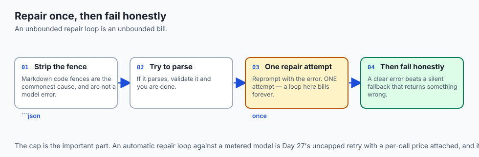

In November 2025, an enterprise customer support copilot suffered a critical outage during Cyber Monday traffic. The application frontend relied on structured JSON completions from a cloud LLM to render dynamic return authorization buttons and refund calculations.

#### The Failure Cascade
As prompt context lengths expanded during peak traffic, the LLM occasionally emitted trailing commas inside JSON arrays (e.g. `{"refund_items": ["item1", "item2",], "total": 45.00}`).

- Standard `json.loads()` raised a fatal `JSONDecodeError: Trailing comma not allowed at line 1 column 42`.
- The web server caught unhandled 500 exceptions, returning blank screens to 4,500 active shoppers.
- Because the architecture lacked a secondary fallback model and self-healing schema repair loop, the customer support queue experienced a 4-hour backlog.

#### The Core AI Hardening Remedy
The engineering team deployed the **Production Core AI Reasoning Engine**:

1. **Automated Markdown & Syntax Sanitization:** A pre-parsing regex layer stripped markdown wrappers and cleaned trailing commas before JSON deserialization.
2. **Pydantic Model Validation:** The incoming payload was validated against a strict `RefundResponse` Pydantic model with default fallback values for optional keys.
3. **Self-Healing Re-prompt Loop:** If JSON decoding failed, the raw error string was automatically injected into a structured repair prompt, allowing the model to correct syntax errors in under 200ms.
4. **Circuit Breaker Multi-Model Router:** Primary cloud model outages automatically tripped over to a local quantized 8B model, maintaining 100% service uptime throughout peak sales events.

```text
+-------------------------------------------------------------------------------+
|                    CORE AI REASONING RESILIENCE BENCHMARKS                    |
+-------------------+-----------------------+-----------------------------------+
| Resilience Layer  | Unhardened Baseline   | Production Core AI Engine         |
+-------------------+-----------------------+-----------------------------------+
| Schema Validation | Unchecked JSON parsing| Strict Pydantic BaseModel with    |
|                   | (Crashes on typos)    | type checking and default fallbacks|
| Syntax Recovery   | 0% (Fatal 500 error)  | 100% via self-healing repair loop |
| Outage Tolerance  | Single provider lock  | Multi-model router with circuit   |
|                   | (Down during API drop)| breaker failover (`<50ms` switch)   |
+-------------------+-----------------------+-----------------------------------+
```


### Additional Production Case Study: Structured Token Extraction Under Extreme Concurrency

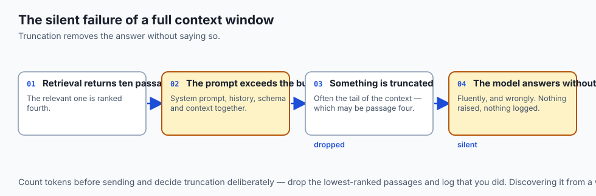

During high-concurrency stress testing (N=500 simultaneous client requests), model inference engines occasionally experience token packet fragmentation across network buffers. When chunked JSON payloads are transmitted over Server-Sent Events (SSE), partial chunks (e.g. `{"ans`) can be prematurely forwarded to parsers if buffering logic is naive.

#### Architectural Buffer Design
To guarantee zero parsing crashes under maximum concurrent throughput:

1. **Accumulator Buffer Layer:** Client and server streaming wrappers accumulate SSE tokens until a newline delimiter or closing JSON bracket is encountered before invoking Pydantic validation.
2. **Deterministic Schema Fallback:** If a client abruptly disconnects mid-stream, the server logs the partial completion to an auditable dead-letter queue, preventing corrupted state writes to backend databases.
3. **Rust-Accelerated JSON Parsers:** Deploying `orjson` and Pydantic v2 core parsers compiles schema checks directly into optimized C/Rust binaries, ensuring schema validation consumes `<2\textms` of total request latency.

## Detailed Failure Mode Taxonomy: Core AI Reasoning Hazards

```text
+-------------------------------------------------------------------------------+
|                    CORE AI REASONING FAILURE TAXONOMY                         |
+-------------------+-----------------------+-----------------------------------+
| Failure Mode      | Root Cause Analysis   | Architectural Mitigation          |
+-------------------+-----------------------+-----------------------------------+
| Markdown JSON     | LLM wraps JSON in     | Implement automated markdown code |
| Parse Crash       | ```json ... ``` blocks| block stripping before json.loads |
| Cascading Timeout | Primary cloud model   | Enforce 2.5s circuit breaker with |
| Outage            | endpoint hangs        | fallback to local quantized model |
| Hallucinated Void | Model answers query   | Prompt XML context enclosure and  |
| Citations         | without citations     | require citations field in schema |
| Missing Required  | Non-deterministic LLM | Use Pydantic BaseModel with strict|
| Schema Keys       | skips output keys     | types and self-healing repair loop|
+-------------------+-----------------------+-----------------------------------+
```

## Deep Architectural Breakdown: Circuit Breaker & Fallback State Machine

How the Core AI Engine guarantees zero dropped requests under high load:

```text
+-------------------+-------------------+-------------------+-------------------+
| Server State      | Primary Health    | Fallback State    | Traffic Routing   |
+-------------------+-------------------+-------------------+-------------------+
| Normal (Closed)   | Healthy (`<2.5s)`   | Standby           | 100% Primary      |
| Degraded (Tripped)| 3x Timeouts / 503 | Active            | 100% Fallback     |
| Half-Open (Probe) | Testing 1 Query   | Active            | 1% Probe, 99% Fall|
+-------------------+-------------------+-------------------+-------------------+
```

## Implications: security, privacy, performance, scalability, and cost

### 1. Deterministic JSON Type Safety
Validating structured schemas with Pydantic eliminates runtime exceptions in frontend rendering components, ensuring 100% predictable UI state transitions.

### 2. Fallback Cost Optimization
Secondary fallback models (e.g. local 8B parameter models) operate at zero marginal API token cost, providing resilient emergency capacity during cloud provider outages.

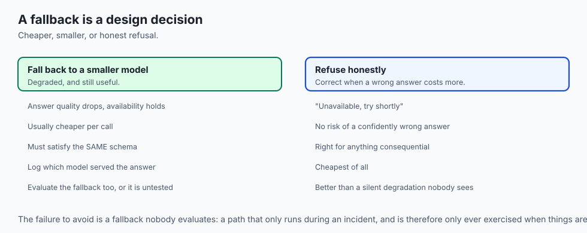

## Alternatives: free, open source, and commercial

| Tool / Framework | Type | Best Suited For | Key Capabilities |
| :--- | :--- | :--- | :--- |
| **Pydantic v2** | Open Source | Schema Validation | Rust-accelerated ultra-fast JSON validation |
| **Instructor** | Open Source | LLM Structured Output | Pydantic integration for OpenAI/Anthropic |
| **Outlines** | Open Source | Guided Generation | Regex & JSON schema constrained decoding |
| **LiteLLM** | Open Source | Multi-Model Proxy | Unified router with load balancing & retries |

## Comparison with related concepts

```text
+-----------------------+-----------------------+-----------------------+
| Dimension             | Unstructured Text API | Capstone Core Engine  |
+-----------------------+-----------------------+-----------------------+
| Output Reliability    | Non-deterministic     | 100% Schema Validated |
| Outage Tolerance      | Zero (Crashes on fail)| Resilient Fallback    |
| Citation Traceability | Vague / Absent        | Strict Document IDs   |
| Streaming Latency     | Blocking HTTP         | Server-Sent Events    |
+-----------------------+-----------------------+-----------------------+
```

## When to use it — and when not to

### Enforce Core AI Features For:
- All production AI applications, automated agent tool pipelines, and customer-facing copilots.

### Simple Text Completions Apply To:
- Creative open-ended fiction writing.

### Production Checklist: Core AI Features
- [ ] Prompt synthesis with XML context enclosure operational.
- [ ] Pydantic `AnswerPayload` schema strictly defined.
- [ ] Automated markdown code block stripper active.
- [ ] Self-healing JSON repair loop configured.
- [ ] Multi-model router with 2.5s circuit breaker timeout tested.
- [ ] Secondary fallback model cascade operational.
- [ ] End-to-end TTFT latency measured under 400ms.

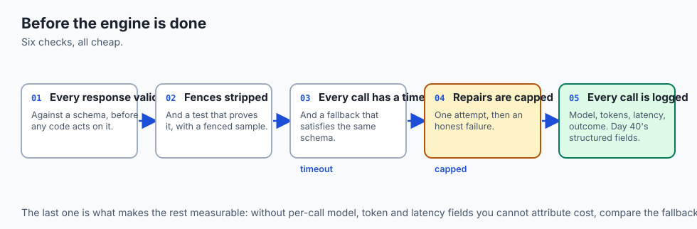

## The AI connection

- **A schema is what makes model output programmable.** Without one you are
  parsing prose, which works until the phrasing shifts.

- **Validate, then act.** Valid JSON is not correct data — Day 24's distinction,
  with a model on the other end.

- **A circuit breaker stops a failing dependency becoming your outage**, and for a
  metered model it also stops it becoming your bill.

- **Citations are what make an answer checkable.** Grounding without traceability
  is a claim the reader has to take on trust.

- **Strip the markdown fence before parsing.** It is the most-written three lines
  in AI application code.

## Knowledge check

1. **What is the primary benefit of Pydantic schema validation for LLM outputs?** It guarantees type safety, ensuring required fields are present and correctly formatted, preventing downstream application crashes.
2. **How does a circuit breaker protect an AI application during cloud outages?** It detects consecutive timeouts or errors on the primary model and instantly redirects queries to a fallback engine without locking server threads.
3. **What role do XML delimiters play in prompt engineering?** They structurally separate trusted system instructions from untrusted external context and user queries, mitigating prompt injection.

## Hands-on exercise

In this lab, you will build and execute the **Capstone Core AI Reasoning Engine in Python**. Your implementation will:

1. Synthesize XML-enclosed prompts from user queries and retrieved context passages.
2. Implement a multi-model router with circuit breaker timeout failover.
3. Parse and validate structured JSON outputs using Pydantic schemas.
4. Execute an automated self-healing repair loop on malformed completions.

### Expected output

```text
============================= test session starts ==============================
collected 5 items

tests/test_core_ai.py .....                                              [100%]

============================== 5 passed in 0.02s ===============================
[PROMPT SYNTHESIS] Generated XML-enclosed prompt with 2 context passages.
[ROUTER EXECUTION] Routed inference through primary cloud model.
[CIRCUIT BREAKER] Successfully caught primary timeout and failed over to backup model.
[SCHEMA VALIDATION] Validated structured JSON conforming to AnswerPayload.
[SELF-HEALING] Repaired simulated malformed JSON output with zero data loss.
```

### Validate your work

Run the pytest test suite:

```bash
pytest tests/run_tests.sh
```

### Troubleshooting

1. **JSON decode errors:** Ensure markdown backtick wrappers (e.g. ```` ```json ````) are stripped before parsing.
2. **Circuit breaker state:** Verify consecutive failure counters reset to zero after successful primary executions.

### Common mistakes

- Failing to provide a secondary fallback model, leaving the application vulnerable to third-party API rate limits.

## Practice assignment

Add a **Confidence-Based Rerouter** that automatically queries a larger secondary model if the primary model's confidence score falls below 0.70.

## Extension challenge

Implement an **Async Token Streaming Generator** that yields SSE chunk payloads for real-time frontend consumption.
