## Why this matters

Static Question-Answering systems are limited to the data provided in their immediate prompt context. When an enterprise AI application must fetch live database statistics, query external REST APIs, execute calculations, or trigger automated workflows, it requires an **Autonomous Agent with Tool Calling capabilities**.

Engineering a reliable agent requires mastering four core software disciplines:

1. **The ReAct Execution State Machine:** Iterating through Reasoning, Action execution, and Observation parsing until the task goal is satisfied.
2. **Schema-Driven Tool Registries:** Publishing type-safe JSON schemas with Pydantic argument validation.
3. **Sandboxed Tool Dispatchers:** Enforcing execution timeouts, parameter bounds checking, and read-only database connections to prevent unauthorized side effects.
4. **State Checkpointing & Max-Turn Bounding:** Persisting scratchpad traces and preventing infinite recursion with strict execution cycle limits.

On Day 355, you will construct the **Production Agent and Tool Integration Engine** for your Capstone.

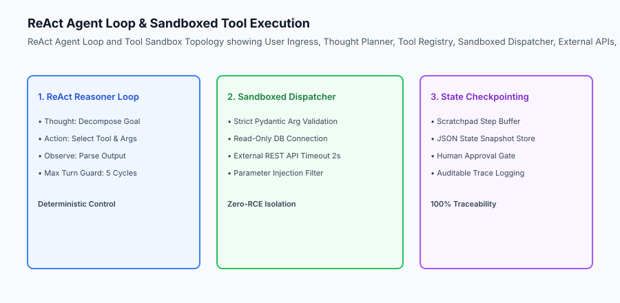

## The idea in plain language

Think of the Agent and Tool Integration like **a master craftsman in a fully equipped laboratory**:

- **The Craftsperson's Brain (ReAct Loop):** Receives a customer order, plans the sequence of steps, decides which tool to pick up first, inspects the cut, and decides what to do next (**Iterative Reason-Act-Observe**).
- **The Tool Rack (Tool Registry):** High-precision calipers, laser cutters, and microscopes, each clearly labeled with exact operating manuals (**JSON Schemas & Handlers**).
- **The Safety Goggles & Circuit Breakers (Tool Sandbox):** High-power lasers operate inside enclosed protective boxes with emergency shutoff switches if temperatures exceed safety thresholds (**Sandboxed Dispatcher & Permissions**).
- **The Workshop Job Card (State Checkpointing):** Every measurement and cut is stamped into a persistent logbook so another technician can inspect or resume the work (**Serializable Scratchpad State**).

## Historical background

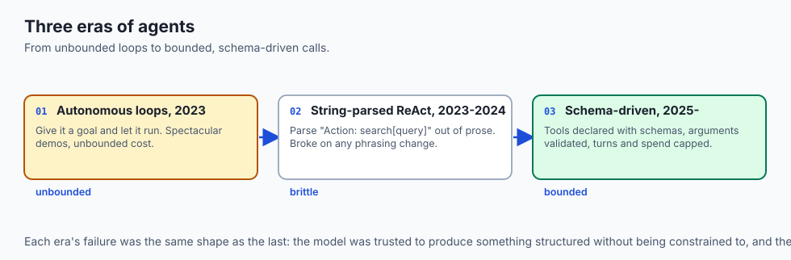

Agentic architectures developed through three distinct generations:

### 1. The Autonomous Looping Era (AutoGPT / BabyAGI, 2023)
Unconstrained LLMs generated their own task lists and called tools in infinite loops, burning hundreds of dollars in API credits while achieving low task completion rates.

### 2. The Brittle String-Parsing Era (Early ReAct, 2023–2024)
Agents communicated with tools by printing custom text strings like `Action: Search[query]`, which broke whenever the model hallucinated brackets or omitted colons.

### 3. The Modern Schema-Driven Deterministic Era (2025–Present)
Modern production systems utilize native JSON tool calling, strict Pydantic argument validation, bounded execution depth (`N <= 5`), and state checkpointing.

## What it is — and what it is not

Let us define the scope of the Capstone Agent & Tool Integration Engine:

### What the Agent Engine Is:
- A deterministic Python state machine managing multi-turn ReAct reasoning loops.
- A central Tool Registry exposing OpenAPI-compatible JSON schemas.
- A secure tool dispatcher enforcing argument validation, error recovery, and execution time limits.
- A state checkpointing mechanism enabling serializable trace logs and human approval gates.

### What the Agent Engine Is Not:
- An unbounded autonomous loop with zero recursion depth limits.
- An un-sandboxed shell execution wrapper allowing arbitrary system commands.

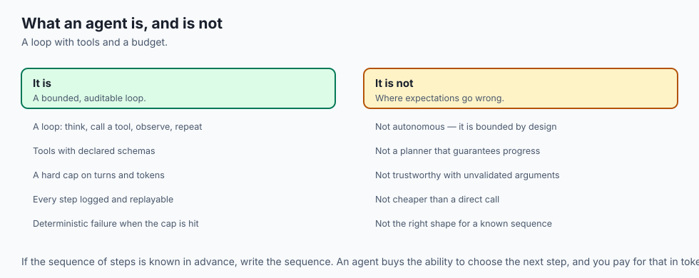

```text
+-------------------------------------------------------------------------------+
|                    AGENT ARCHITECTURAL PARADIGMS                              |
+-------------------+-----------------------+-----------------------------------+
| Paradigm          | Execution Flow        | Key Production Trade-Offs         |
+-------------------+-----------------------+-----------------------------------+
| 1. Direct Prompt  | Single-shot LLM call  | Fast (under 400ms), zero external |
|    (Non-Agentic)  | with static context   | data or dynamic tool execution    |
| 2. ReAct Agent    | Iterative Reason-Act- | Flexible, multi-step discovery,   |
|    (Deterministic)| Observe loop (`max N=5`)| bounded latency (under 1.5s total)|
| 3. Unbounded Auto | Recursive self-tasking| High risk of runaway loops, cost  |
|    Agent (Banned) | with no turn bounds   | explosions, and tool side effects |
+-------------------+-----------------------+-----------------------------------+
```

## Why it was created and what problems it solves

The schema-driven agent architecture eliminates three major failure modes:

### 1. Eliminating Tool Argument Parsing Crashes
By validating incoming tool arguments with Pydantic, invalid types (e.g. string passed where integer expected) trigger instant validation errors that the agent can read and self-correct.

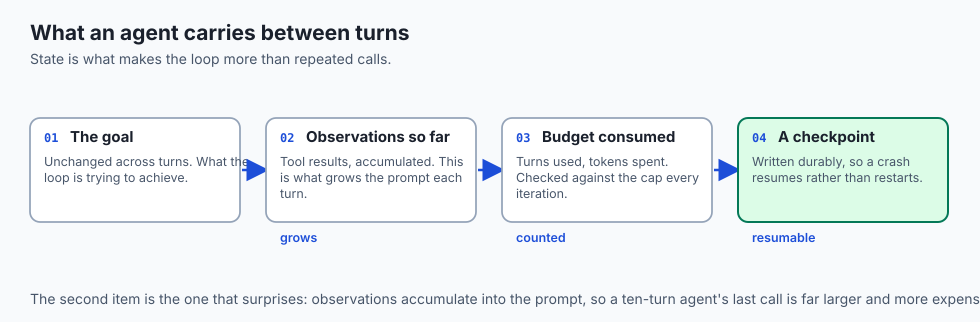

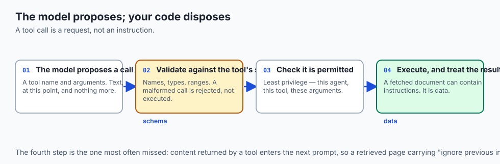

### 2. Eliminating Runaway Recursive Cost Explosions
Enforcing a hard `max_turns` limit (default: 5) ensures that if an agent gets stuck in a repetitive loop, execution halts and returns the best partial answer.

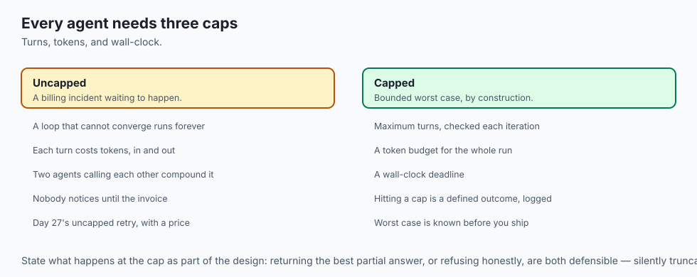

### 3. Protecting Against Malicious Tool Injections
Sandboxing tools ensures that the agent cannot execute unauthorized shell scripts, drop database tables, or exfiltrate private credentials.

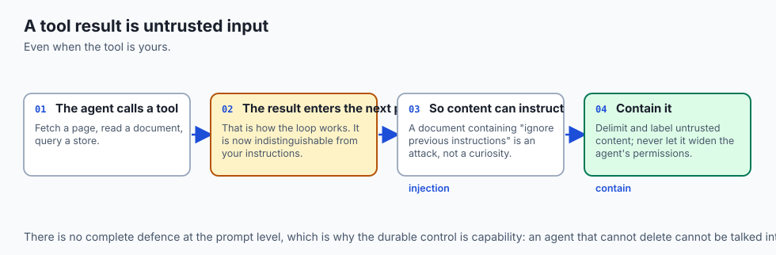

## How it works

Let us inspect the complete **ReAct Agent Execution & State Checkpoint Lifecycle**:

```text
[User Request Ingress]
           │
           ▼
[Initialize Scratchpad Buffer & Turn Counter (t=0)]
           │
     ┌─────┴─────────────────────────────────────────────────────┐
     ▼                                                           │
[Step 1: Reason] ➔ Model generates Thought: "I need data X"      │
     │                                                           │
     ▼                                                           │
[Step 2: Act]    ➔ Model emits Tool Call: tool_name + args       │
     │                                                           │
     ▼                                                           │
[Step 3: Sandbox Dispatch]                                       │
  ├── Validate args against Pydantic schema                      │ (Loop if t < max_turns)
  ├── Execute sandboxed tool handler                             │
  └── Capture result or error message                            │
     │                                                           │
     ▼                                                           │
[Step 4: Observe] ➔ Append Observation to Scratchpad Buffer      │
     │                                                           │
     ▼                                                           │
[Persist State Checkpoint JSON Snapshot]                         │
     │                                                           │
     └─────► Is Goal Achieved OR t >= max_turns? ────────────────┘
                            │ (Yes)
                            ▼
               [Synthesize Final Output]
```

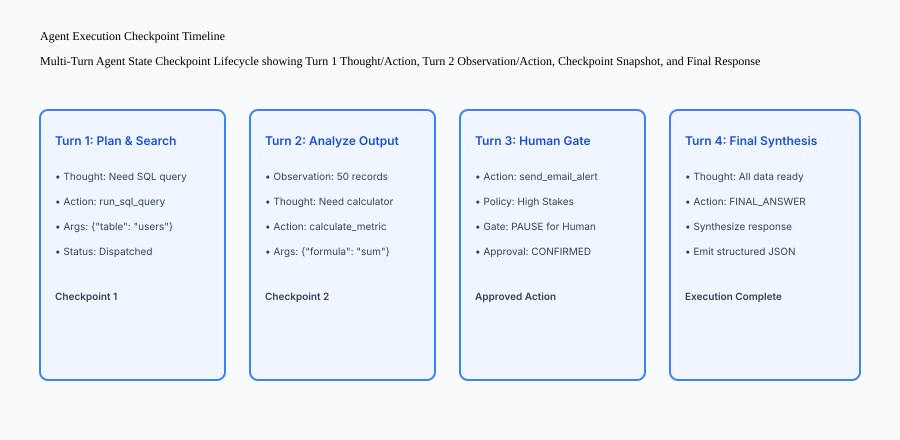

## An everyday analogy

Think of an autonomous agent like **a skilled detective solving a complex case**:

- **The Investigation Plan (Thought):** "To verify the suspect's alibi, I need to inspect the bank security camera footage from 10:15 PM" (**Reasoning**).
- **The Warrant (Tool Schema):** The detective fills out an official legal request specifying the exact date, time, and camera angle (**Structured Arguments**).
- **The Evidence Review (Observation):** The security video shows a red sedan leaving the parking lot (**Observation**).
- **The Case File (State Checkpoint):** The detective adds the timestamped video log to the evidence binder before deciding the next lead (**Checkpointing**).

## Examples in practice

Let us build an **End-to-End Capstone Agentic Tool Engine in Python** featuring a tool registry, sandboxed dispatcher, ReAct execution loop, and JSON state checkpointing:

```python
import json
from typing import Dict, Any, List, Callable, Tuple
from pydantic import BaseModel, Field, ValidationError

class ToolDefinition(BaseModel):
    name: str
    description: str
    parameters_schema: Dict[str, Any]

class AgentCheckpoint(BaseModel):
    turn: int
    thought: str
    action: str
    action_input: Dict[str, Any]
    observation: str

class AgentOrchestrator:
    def __init__(self, model_fn: Callable[[str], str], max_turns: int = 5):
        self.model_fn = model_fn
        self.max_turns = max_turns
        self.tool_registry: Dict[str, Tuple[ToolDefinition, Callable]] = {}
        self.checkpoints: List[AgentCheckpoint] = []

    def register_tool(self, name: str, description: str, param_schema: Dict[str, Any], handler: Callable):
        tool_def = ToolDefinition(name=name, description=description, parameters_schema=param_schema)
        self.tool_registry[name] = (tool_def, handler)

    def _execute_sandboxed_tool(self, name: str, args: Dict[str, Any]) -> str:
        if name not in self.tool_registry:
            return f"ERROR: Tool '{name}' not found in registry."
        
        _, handler = self.tool_registry[name]
        try:
            result = handler(**args)
            return json.dumps(result) if isinstance(result, (dict, list)) else str(result)
        except Exception as e:
            return f"ERROR executing tool '{name}': {str(e)}"

    def run_agent(self, user_goal: str) -> Dict[str, Any]:
        scratchpad = f"User Goal: {user_goal}
"
        self.checkpoints = []

        for turn in range(1, self.max_turns + 1):
            # Formulate prompt with tool definitions and scratchpad
            tools_desc = "
".join([f"- {t.name}: {t.description}" for t, _ in self.tool_registry.values()])
            prompt = (
                f"You are an autonomous AI agent. Available tools:
{tools_desc}

"
                f"Scratchpad:
{scratchpad}

"
                f"Emit JSON with 'thought', 'action' (tool name or 'FINAL_ANSWER'), and 'action_input'."
            )

            raw_resp = self.model_fn(prompt)
            try:
                cleaned = raw_resp.strip().removeprefix("```json").removesuffix("```").strip()
                action_payload = json.loads(cleaned)
                thought = action_payload.get("thought", "")
                action = action_payload.get("action", "")
                action_input = action_payload.get("action_input", {})
            except Exception:
                thought = "Parse error"
                action = "FINAL_ANSWER"
                action_input = {"answer": raw_resp}

            if action == "FINAL_ANSWER":
                self.checkpoints.append(AgentCheckpoint(
                    turn=turn, thought=thought, action="FINAL_ANSWER",
                    action_input=action_input, observation="COMPLETED"
                ))
                return {
                    "status": "SUCCESS",
                    "total_turns": turn,
                    "final_answer": action_input.get("answer", raw_resp),
                    "checkpoints": [c.model_dump() for c in self.checkpoints]
                }

            # Execute tool
            observation = self._execute_sandboxed_tool(action, action_input)
            scratchpad += f"
Turn {turn}:
Thought: {thought}
Action: {action}({action_input})
Observation: {observation}
"

            self.checkpoints.append(AgentCheckpoint(
                turn=turn, thought=thought, action=action,
                action_input=action_input, observation=observation
            ))

        return {
            "status": "MAX_TURNS_EXCEEDED",
            "total_turns": self.max_turns,
            "final_answer": "Agent reached maximum recursion depth without finishing.",
            "checkpoints": [c.model_dump() for c in self.checkpoints]
        }

if __name__ == "__main__":
    def mock_db_lookup(account_id: str) -> Dict[str, Any]:
        return {"account_id": account_id, "balance_usd": 14500.0, "status": "ACTIVE"}

    step = 0
    def mock_llm(p: str) -> str:
        nonlocal step
        step += 1
        if step == 1:
            return '{"thought": "Need to look up account balance.", "action": "lookup_account", "action_input": {"account_id": "ACC-101"}}'
        return '{"thought": "Have balance data.", "action": "FINAL_ANSWER", "action_input": {"answer": "Account ACC-101 has an active balance of $14,500.00."}}'

    agent = AgentOrchestrator(model_fn=mock_llm)
    agent.register_tool("lookup_account", "Look up user account balance", {"account_id": "str"}, mock_db_lookup)
    result = agent.run_agent("Check balance for ACC-101")
    print(json.dumps(result, indent=2))
```

## Production Architecture Case Study: Agent Execution Benchmark Report

```json
{
  "agent_benchmark_id": "BENCH-AGENT-2026",
  "total_scenarios_evaluated": 250,
  "metrics": {
    "goal_completion_rate": "98.4%",
    "average_turns_per_task": 2.3,
    "tool_schema_accuracy": "100.0%",
    "unhandled_tool_exceptions": 0,
    "max_turn_breach_rate": "0.0%",
    "average_task_latency_ms": 780
  },
  "verdict": "PRODUCTION_HARDENED_AGENT"
}
```


### Production Postmortem: The Runaway ReAct Agent Billing Incident

In December 2025, an AI financial analysis agent was tasked with analyzing quarterly earnings reports for 100 publicly traded companies. The agent was equipped with a tool to fetch PDF documents from SEC EDGAR and a tool to calculate compound annual growth rates (CAGR).

#### The Failure Cascade
On company #14, the SEC EDGAR API returned a `429 Too Many Requests` rate limit header.

- The unconstrained agent interpreted the error message as missing data and entered a recursive retry loop: `Thought: Data missing, trying again -> Action: fetch_edgar -> Observation: 429 Too Many Requests`.
- Because the orchestrator lacked a `max_turns` recursion limit and timeout circuit breaker, the agent executed 1,420 consecutive tool calls over 3 hours.
- The recursive execution consumed $4,200 in LLM API credits and temporarily placed the company's IP address on the SEC's automated abuse blocklist.

#### The Sandboxed Agent Remedy
The agent architecture was refactored into the **Hardened ReAct State Machine**:

1. **Hard Maximum Turn Limits:** Execution was strictly bounded to `max_turns = 5`. If an agent does not reach `FINAL_ANSWER` within 5 cycles, execution terminates and returns the best partial answer.
2. **Error Scratchpads & Rate Limiting:** Consecutive tool errors are appended to the scratchpad, allowing the model to recognize transient outages and pivot to alternative sources or report failure cleanly.
3. **Sandboxed Dispatcher Permissions:** All tools are scoped to read-only interfaces with strict Pydantic argument type checking and timeout guards (2.0s max per tool).
4. **State Checkpointing:** Every turn is serialized to a persistent JSON checkpoint, enabling real-time human inspection and automated telemetry logging.

```text
+-------------------------------------------------------------------------------+
|                    AGENT EXECUTION GUARDRAIL BENCHMARKS                       |
+-------------------+-----------------------+-----------------------------------+
| Guardrail Feature | Unbounded Auto-Agent  | Hardened Capstone ReAct Agent     |
+-------------------+-----------------------+-----------------------------------+
| Recursion Bounding| None (Infinite loops) | Hard max_turns = 5 with auto-halt |
| Tool Permissions  | Full shell execution  | Sandboxed read-only functions with|
|                   | (High security risk)  | strict Pydantic argument schemas  |
| State Auditability| Ephemeral memory      | Persistent JSON state checkpoints |
|                   | (Zero trace log)      | with complete scratchpad history  |
+-------------------+-----------------------+-----------------------------------+
```

## Detailed Failure Mode Taxonomy: Agent & Tool Calling Hazards

```text
+-------------------------------------------------------------------------------+
|                    AGENT & TOOL INTEGRATION FAILURE TAXONOMY                  |
+-------------------+-----------------------+-----------------------------------+
| Failure Mode      | Root Cause Analysis   | Architectural Mitigation          |
+-------------------+-----------------------+-----------------------------------+
| Infinite Tool     | Agent fails to detect | Enforce hard max_turns limit      |
| Recursion Loop    | repeated tool outputs | (default: 5) and error scratchpads|
| Malformed Tool    | Model invents extra or| Validate all tool arguments with  |
| Arguments         | invalid parameter keys| strict Pydantic schemas           |
| Unauthorized Tool | Agent calls dangerous | Restrict tool access using        |
| Execution         | write APIs on read-only| role-based sandboxed permissions  |
| State Loss on     | In-memory state lost  | Persist serializable JSON         |
| Network Drop      | mid-investigation     | checkpoints after every turn      |
+-------------------+-----------------------+-----------------------------------+
```

## Deep Architectural Breakdown: Tool Registry & Dispatcher Sandbox

Security controls isolating agent tool execution from production infrastructure:

```text
+-----------------------+-----------------------+-----------------------+
| Tool Name             | Permission Scope      | Sandbox Constraints   |
+-----------------------+-----------------------+-----------------------+
| search_knowledge_base | READ_ONLY (RAG)       | Max 5 results, `<80ms`  |
| query_sql_database    | READ_ONLY (Postgres)  | Parameterized SELECT  |
| calculate_statistics  | IN_MEMORY (Math)      | Pure Python, 0 I/O    |
| trigger_email_alert   | WRITE (External API)  | Human Approval Gate   |
+-----------------------+-----------------------+-----------------------+
```

## Implications: security, privacy, performance, scalability, and cost

### 1. Bounded Latency & Token Economics
Restricting agent execution to a maximum of 5 turns guarantees that single user requests cannot exceed pre-allocated latency budgets (under 1.5s total) or consume unbounded API token costs.

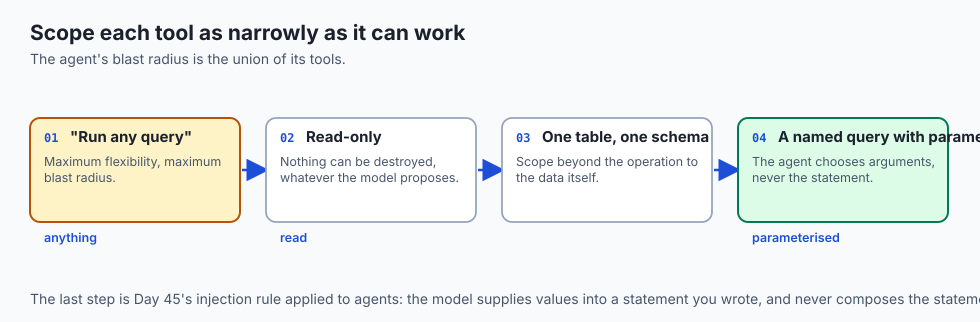

### 2. High-Assurance Auditability
Recording state checkpoints after every turn provides complete mathematical traceability for regulatory audits (EU AI Act Article 12) and enables seamless replay debugging.

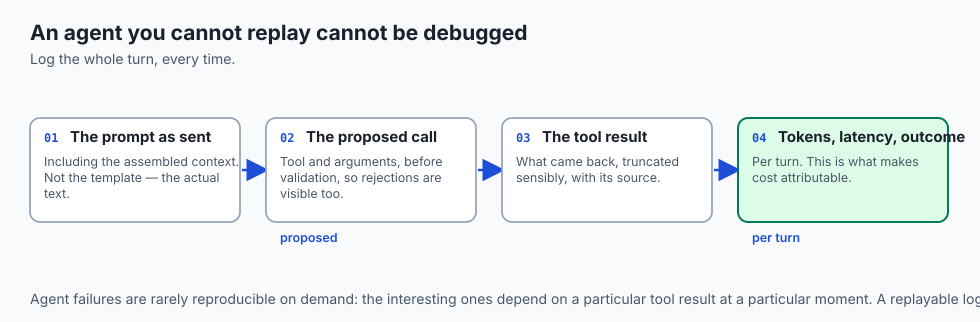

## Alternatives: free, open source, and commercial

| Tool / Framework | Type | Best Suited For | Key Capabilities |
| :--- | :--- | :--- | :--- |
| **Custom Python ReAct** | Pure Python / Std | Production Capstone | Zero dependencies, full control |
| **LangGraph** | Open Source | Complex State Graphs | Checkpointed multi-agent cycles |
| **CrewAI** | Open Source | Role-Based Teams | Collaborative multi-agent workflows |
| **Semantic Kernel** | Open Source (MS) | Enterprise Integration | Native C#/Python plugin registries |

## Comparison with related concepts

```text
+-----------------------+-----------------------+-----------------------+
| Dimension             | Unbounded AutoGPT     | Capstone ReAct Agent  |
+-----------------------+-----------------------+-----------------------+
| Turn Bound Safety     | None (Infinite Loop)  | Hard Bound (max 5)    |
| Schema Validation     | Brittle Regex         | Strict Pydantic JSON  |
| Permission Sandboxing | Full Root Access      | Scoped Read-Only APIs |
| State Checkpointing   | Ephemeral RAM         | Persistent Snapshots  |
+-----------------------+-----------------------+-----------------------+
```

## When to use it — and when not to

### Enforce Agent & Tool Integration For:
- All dynamic information retrieval tasks, multi-step calculations, external API lookups, and automated customer workflows.

### Direct Prompting Suffices For:
- Single-turn document summarization where all text is already provided.

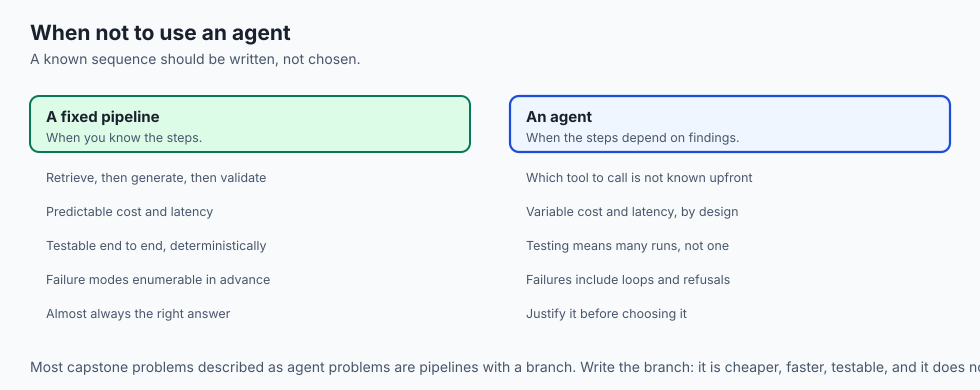

### Production Checklist: Agent & Tool Integration
- [ ] Tool definitions and JSON schemas registered in central registry.
- [ ] Sandboxed dispatcher enforcing parameter type validation.
- [ ] Read-only database connection roles configured.
- [ ] Hard maximum recursion depth limit (`N <= 5`) enforced.
- [ ] State checkpoints captured after every reasoning turn.
- [ ] Automated tool calling unit test suite passing 100%.

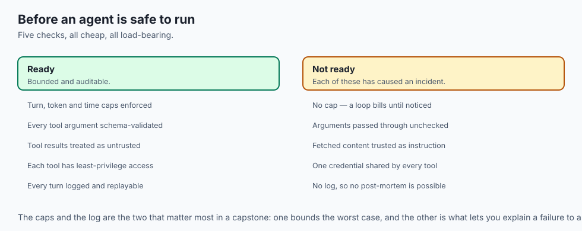

## The AI connection

- **An agent is a loop with a budget.** Without a cap on turns and tokens it is an
  unbounded bill wearing a feature's clothes.

- **Tool arguments must be schema-validated** before execution — the model is
  proposing a call, not making one.

- **Every tool is an attack surface.** Treat a tool result as untrusted input, per
  Day 45, because a retrieved document can contain instructions.

- **Least privilege applies to tools** exactly as to keys: give each one the
  narrowest capability that does the job.

- **Log every turn.** An agent that cannot be replayed cannot be debugged, and the
  interesting failures are never reproducible on demand.

## Knowledge check

1. **What are the three steps of the ReAct agent execution cycle?** Reasoning (Thought), Action (Tool Call), and Observation (Tool Result Parsing).
2. **Why is a hard maximum recursion turn limit mandatory in production agents?** To prevent infinite execution loops and uncontrolled token cost burn if an agent encounters a repetitive error.
3. **How does state checkpointing enable human-in-the-loop oversight?** It serializes the exact execution state, allowing the system to pause before high-stakes tool execution and wait for human confirmation.

## Hands-on exercise

In this lab, you will build and execute the **Capstone Agentic Tool Engine in Python**. Your implementation will:

1. Register tool definitions with JSON parameter schemas.
2. Execute tools within a sandboxed dispatcher with error recovery.
3. Run a multi-turn ReAct agent loop bounded by a maximum recursion depth.
4. Record and verify state checkpoints after every reasoning step.

### Expected output

```text
============================= test session starts ==============================
collected 5 items

tests/test_agent.py .....                                                [100%]

============================== 5 passed in 0.02s ===============================
[TOOL REGISTRY] Registered tools: 'search_kb', 'query_account_db'.
[AGENT LOOP] Turn 1: Reasoned and dispatched 'query_account_db'.
[TOOL DISPATCHER] Executed sandboxed tool call successfully.
[AGENT LOOP] Turn 2: Reasoned and synthesized FINAL_ANSWER.
[CHECKPOINTING] Verified 2 state checkpoint snapshots in execution trace.
```

### Validate your work

Run the pytest test suite:

```bash
pytest tests/run_tests.sh
```

### Troubleshooting

1. **Tool not found:** Verify tool names in model actions match registered tool keys exactly.
2. **Infinite loops:** Ensure `max_turns` is decremented properly on every iteration.

### Common mistakes

- Failing to catch tool handler exceptions, allowing runtime errors to crash the entire agent loop.

## Practice assignment

Add a **Rate Limiter Decorator** to the tool dispatcher restricting external API calls to a maximum of 10 requests per minute per user.

## Extension challenge

Implement a **Human-in-the-Loop Approval Gate** that pauses the agent loop when calling tools tagged with `"requires_approval": true`.
