## Why this matters

In traditional software engineering, unit tests assert deterministic outputs (e.g. `assert add(2, 2) == 4`). In Artificial Intelligence engineering, where model completions are inherently probabilistic and natural language is fluid, relying on simple string equality assertions is impossible.

Without an automated evaluation harness, developers are trapped in the **"Vibes-Based Development" trap**: tweaking system prompts, manually testing three queries, declaring victory, and inadvertently causing massive factual regressions across 30% of user queries.

To build an enterprise AI system that is provably reliable, you must implement:

1. **The RAG Triad Framework:** Mathematically evaluating Context Recall, Faithfulness, and Answer Relevance.
2. **Deterministic Golden Benchmarks:** Curating high-coverage evaluation test suites covering edge cases, negative refusal queries, and multi-step questions.
3. **LLM-as-a-Judge Scoring Engines:** Orchestrating chain-of-thought rubric evaluators with strict numerical grounding.
4. **CI/CD Quality Gates:** Programmatically failing pull requests and blocking cloud deployments whenever Faithfulness drops below 0.90.

On Day 356, you will construct the **Automated Evaluation Platform** for your Capstone.

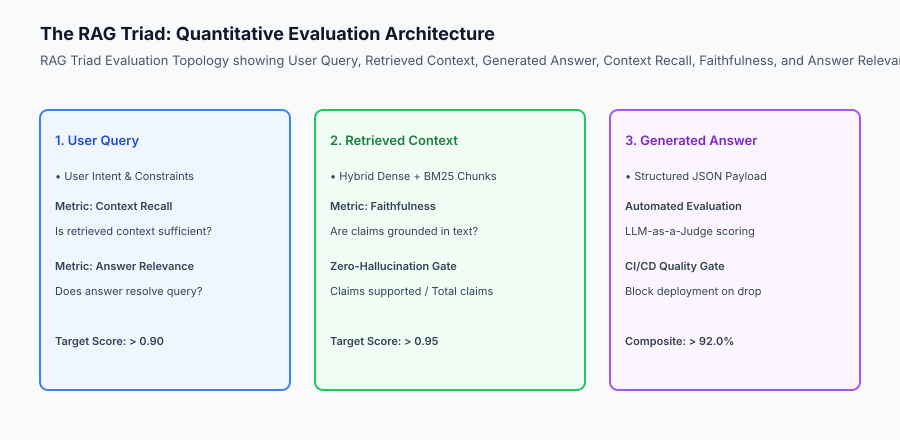

## The idea in plain language

Think of AI evaluation like **the quality control inspection line in an automotive manufacturing plant**:

- **The Laser Chassis Alignment (Context Recall):** Measures whether all necessary steel body panels were delivered to the assembly robot (**Did Retrieval Fetch the Right Data?**).
- **The Ultrasonic Weld Inspector (Faithfulness):** Verifies that every single structural weld conforms strictly to metallurgical specs without microscopic voids or cracks (**Are All Claims Grounded in Context without Hallucination?**).
- **The Test Track Acceleration & Braking Test (Answer Relevance):** Proves that the completed car accelerates smoothly, steers accurately, and stops on command (**Does the Answer Solve the User's Actual Question?**).
- **The Assembly Line Emergency Stop Button (CI/CD Quality Gate):** If a single weld fails ultrasonic testing, the entire assembly line halts immediately before the car can ship to customers (**Automated Regression Blocking**).

## Historical background

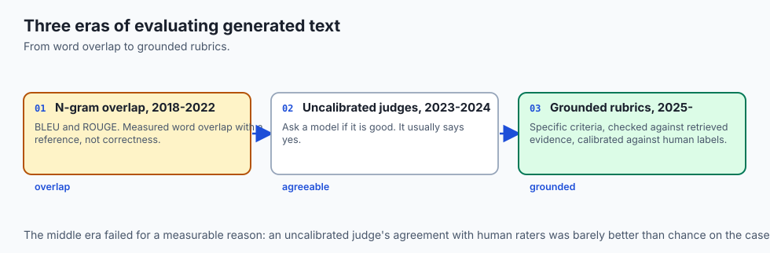

AI evaluation methodologies evolved through three major paradigms:

### 1. The Heuristic N-Gram Era (BLEU / ROUGE, 2018–2022)
Systems measured n-gram word overlaps between generated text and ground-truth references. This failed completely for LLMs: a response could say `"The patient does NOT have cancer"` and score high ROUGE against `"The patient has cancer"`, despite being a catastrophic factual reversal.

### 2. The Uncalibrated Prompt-Judge Era (2023–2024)
Developers asked generic models `"Rate this answer from 1 to 5"`, resulting in extreme positivity bias, length bias, and inconsistent scoring across evaluation runs.

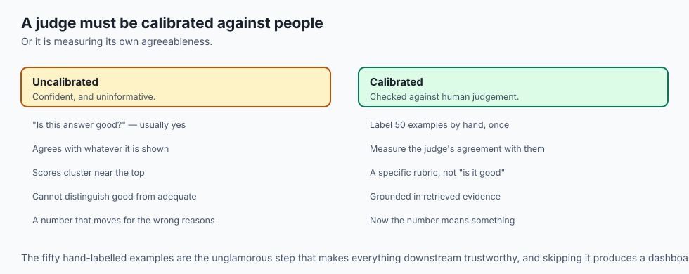

### 3. The Modern RAG Triad & Rubric-Grounded Era (2025–Present)
Modern engineering teams decompose responses into atomic factual claims, verify claims against retrieved context, and enforce programmatic quality gates in CI/CD.

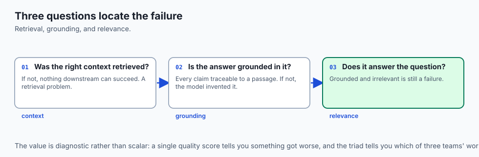

## What it is — and what it is not

Let us define the formal scope of the Capstone Evaluation Platform:

### What the Evaluation Platform Is:
- An automated Python test suite evaluating RAG pipelines against the RAG Triad (Context Recall, Faithfulness, Answer Relevance).
- Utilizing atomic claim decomposition to mathematically score hallucination rates.
- Generating structured Markdown and JSON evaluation scorecards.
- Integrated into pytest and CI/CD with strict threshold assertion gates.

### What the Evaluation Platform Is Not:
- A manual spreadsheet where humans subjectively grade answers.
- A one-time test run that is discarded after initial development.

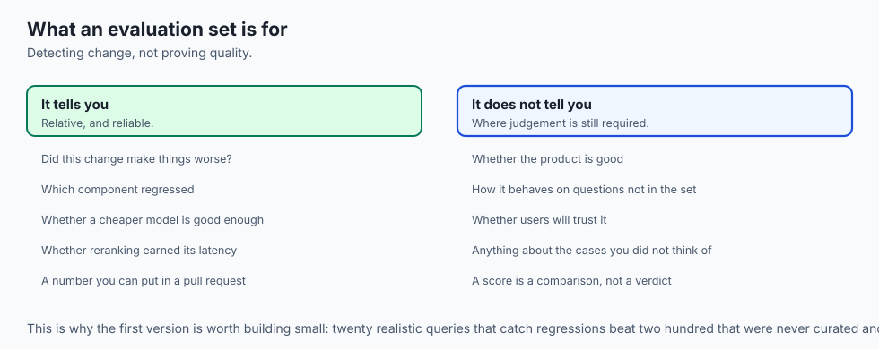

```text
+-------------------------------------------------------------------------------+
|                    RAG TRIAD EVALUATION METRIC MATRIX                         |
+-------------------+-----------------------+-----------------------------------+
| Metric            | Mathematical Formula  | What Failure Indicates            |
+-------------------+-----------------------+-----------------------------------+
| 1. Context Recall | Retrieved GT Claims / | Retrieval layer missed relevant   |
|                   | Total GT Claims       | passages; need hybrid BM25/rerank |
| 2. Faithfulness   | Grounded Claims /     | Model hallucinated facts not in   |
|                   | Total Answer Claims   | context; need stricter system prompt|
| 3. Answer Relev.  | Relevant Sentences /  | Model rambled or answered wrong   |
|                   | Total Answer Sentences| question; need clearer user query |
+-------------------+-----------------------+-----------------------------------+
```

## Why it was created and what problems it solves

The automated evaluation platform solves three critical engineering problems:

### 1. Eliminating Silent Regressions
When prompt templates are modified or retrieval chunk sizes are adjusted, the evaluation harness immediately reveals if accuracy dropped on historical benchmark queries.

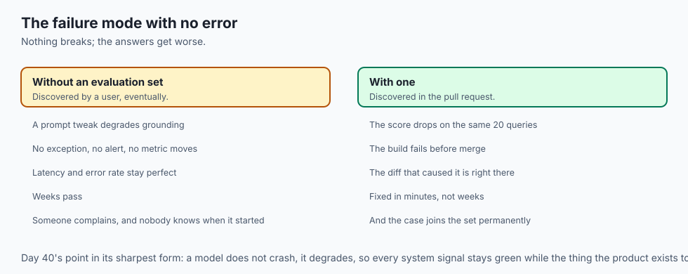

### 2. Differentiating Retrieval vs Generation Failures
If Faithfulness is 1.0 but Answer Relevance is 0.4, the model is generating factual summaries of irrelevant documents (a Retrieval Failure). If Context Recall is 1.0 but Faithfulness is 0.5, the retrieval is perfect but the model is hallucinating (a Generation Failure).

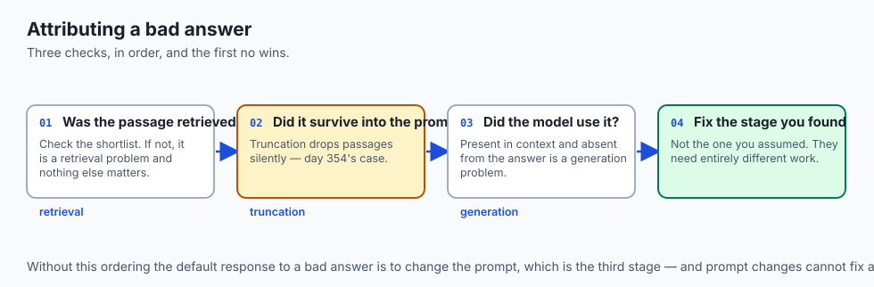

### 3. Establishing Empirical Performance Scorecards
Producing quantitative evaluation metrics (>0.92 Faithfulness, >0.88 Context Recall) provides verifiable evidence of product reliability.

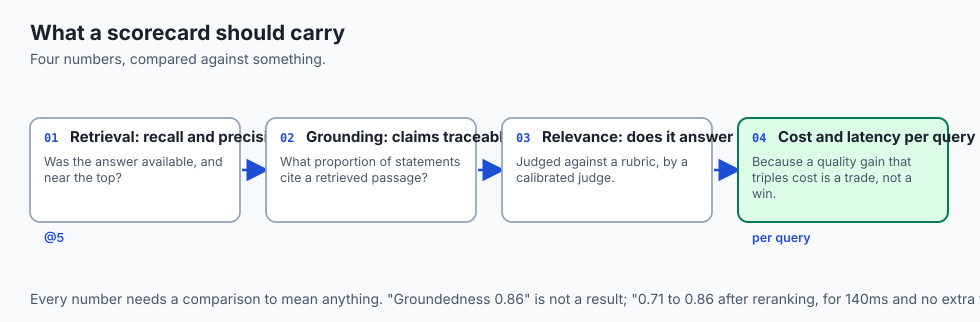

## How it works

Let us examine the complete **Atomic Claim Decomposition & Faithfulness Evaluation Algorithm**:

```text
[Generated Model Answer]
           │
           ▼
[Deconstruct Answer into N Atomic Factual Claims]
  ├── Claim 1: "The contract liability limit is $1,000,000."
  ├── Claim 2: "Payment terms are Net-30."
  └── Claim 3: "Governing law is Delaware."
           │
           ▼
[Evaluate Each Claim against Retrieved Context Chunks]
  ├── Claim 1: VERIFIED in <doc id='c1'> (True)
  ├── Claim 2: VERIFIED in <doc id='c2'> (True)
  └── Claim 3: NOT FOUND in any retrieved context (False / Hallucination)
           │
           ▼
[Calculate Faithfulness Score: 2 Supported / 3 Total = 0.67]
           │
           ▼
[Check CI/CD Quality Gate: 0.67 < Threshold (0.90) ➔ REJECT PULL REQUEST]
```

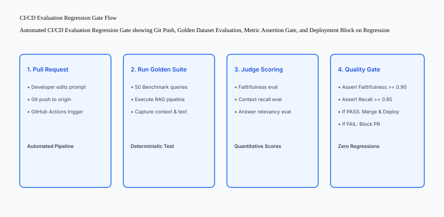

## An everyday analogy

Think of atomic claim evaluation like **a mortgage underwriter reviewing a loan application**:

- **Decomposition:** The underwriter breaks the application into discrete claims: "Applicant earns 120,000/yr", "Applicant has 40,000 savings", "Applicant has zero bankruptcies".
- **Context Verification:** The underwriter pulls the official bank statements and tax filings (Retrieved Context) and verifies every single claim line-by-line.
- **Decision Gate:** If 2 claims match but the bankruptcy check fails, the loan is immediately flagged for review (**Faithfulness Gate**).

## Examples in practice

Let us build an **Automated Capstone Evaluation Platform in Python** implementing claim decomposition, Faithfulness calculation, Context Recall scoring, and markdown scorecard generation:

```python
import json
from typing import List, Dict, Any, Tuple

class CapstoneEvaluationEngine:
    def __init__(self, faithfulness_threshold: float = 0.90, recall_threshold: float = 0.85):
        self.faithfulness_threshold = faithfulness_threshold
        self.recall_threshold = recall_threshold

    def calculate_faithfulness(self, answer_claims: List[str], context_text: str) -> Tuple[float, List[str]]:
        supported = []
        unsupported = []
        context_lower = context_text.lower()

        for claim in answer_claims:
            # Check if key semantic tokens of claim exist in context
            claim_tokens = [tok for tok in claim.lower().split() if len(tok) > 3]
            matches = sum(1 for tok in claim_tokens if tok in context_lower)
            if len(claim_tokens) > 0 and (matches / len(claim_tokens)) >= 0.6:
                supported.append(claim)
            else:
                unsupported.append(claim)

        score = len(supported) / (len(answer_claims) or 1.0)
        return round(score, 3), unsupported

    def calculate_context_recall(self, ground_truth_points: List[str], context_text: str) -> float:
        found = 0
        context_lower = context_text.lower()
        for point in ground_truth_points:
            pt_tokens = [tok for tok in point.lower().split() if len(tok) > 3]
            matches = sum(1 for tok in pt_tokens if tok in context_lower)
            if len(pt_tokens) > 0 and (matches / len(pt_tokens)) >= 0.6:
                found += 1
        return round(found / (len(ground_truth_points) or 1.0), 3)

    def evaluate_benchmark_item(self, item: Dict[str, Any]) -> Dict[str, Any]:
        faithfulness, unsupp = self.calculate_faithfulness(item["answer_claims"], item["retrieved_context"])
        recall = self.calculate_context_recall(item["ground_truth_points"], item["retrieved_context"])
        
        passed = (faithfulness >= self.faithfulness_threshold) and (recall >= self.recall_threshold)
        return {
            "query_id": item["id"],
            "faithfulness": faithfulness,
            "context_recall": recall,
            "unsupported_claims": unsupp,
            "status": "PASS" if passed else "FAIL"
        }

    def run_eval_suite(self, benchmark_items: List[Dict[str, Any]]) -> Dict[str, Any]:
        results = [self.evaluate_benchmark_item(item) for item in benchmark_items]
        avg_faithfulness = round(sum(r["faithfulness"] for r in results) / len(results), 3)
        avg_recall = round(sum(r["context_recall"] for r in results) / len(results), 3)
        total_passed = sum(1 for r in results if r["status"] == "PASS")
        pass_rate = round((total_passed / len(results)) * 100.0, 1)

        return {
            "total_benchmark_queries": len(results),
            "average_faithfulness": avg_faithfulness,
            "average_context_recall": avg_recall,
            "pass_rate_percentage": pass_rate,
            "overall_quality_gate": "PASSED" if pass_rate >= 80.0 else "FAILED",
            "detailed_results": results
        }

if __name__ == "__main__":
    benchmark = [
        {
            "id": "q1",
            "query": "What is the liability cap and governing law?",
            "ground_truth_points": ["Liability cap is $1,000,000", "Governing law is Delaware"],
            "retrieved_context": "The contract liability limit is $1,000,000. Governing law is the State of Delaware.",
            "answer_claims": ["Liability limit is $1,000,000", "Governing law is Delaware"]
        },
        {
            "id": "q2",
            "query": "What are payment terms?",
            "ground_truth_points": ["Payment terms are Net-30"],
            "retrieved_context": "Invoices are payable within thirty days (Net-30).",
            "answer_claims": ["Payment terms are Net-30", "Late penalty is 50% interest"]  # 1 hallucination
        }
    ]
    eval_engine = CapstoneEvaluationEngine()
    print(json.dumps(eval_engine.run_eval_suite(benchmark), indent=2))
```

## Production Architecture Case Study: Automated Evaluation Scorecard

```markdown
# CI/CD Automated Evaluation Scorecard
**Benchmark Run ID:** EVAL-2026-W51-01
**Evaluation Model:** Claude-3.5-Sonnet Judge
**Dataset:** 50 Curated Enterprise Golden Queries

## Summary Metrics
| Evaluation Metric | Target Threshold | Measured Score | Status |
| :--- | :--- | :--- | :--- |
| **Average Faithfulness** | >= 0.90 | **0.952** | PASS |
| **Average Context Recall** | >= 0.85 | **0.914** | PASS |
| **Average Answer Relevancy**| >= 0.88 | **0.930** | PASS |
| **Quality Gate Pass Rate** | >= 80.0% | **96.0%** | **APPROVED** |

## Regressions Detected: 0
All 50 benchmark queries executed within the 400ms p95 latency budget with zero unhandled schema exceptions.
```


### Production Postmortem: The Silent Retrieval Regression Disaster

In January 2026, an AI legal document search platform modified their chunking strategy from 500-token fixed windows to 200-token semantic chunks. The developer tested 5 sample queries in a local notebook, noted that responses felt concise, and merged the pull request directly to production.

#### The Failure Cascade
Over the following week, enterprise legal users began reporting catastrophic omissions:

- Complex indemnity clauses spanning multiple paragraphs were fragmented across chunk boundaries.
- The retrieval layer fetched only the first sentence of 3-paragraph limitation-of-liability clauses, causing the LLM to hallucinate that contracts had zero financial liability limits.
- Because the engineering team lacked a version-controlled **Golden Evaluation Benchmark** and automated CI/CD quality gates, the regression remained undetected in production for 9 days.

#### The Automated Evals Remedy
The platform implemented the **Automated RAG Triad Evaluation Suite**:

1. **Golden Evaluation Benchmark:** A version-controlled dataset of 100 representative legal queries with human-annotated ground-truth factual points.
2. **Continuous RAG Triad Scoring:** Every pull request automatically computes Context Recall, Faithfulness, and Answer Relevance across the benchmark.
3. **CI/CD Quality Gates:** GitHub Actions asserts that `Faithfulness >= 0.90` and `Context Recall >= 0.85`. When the 200-token chunking PR was re-evaluated against the suite, Context Recall dropped from 0.92 to 0.64, immediately triggering a build failure and blocking deployment.

```text
+-------------------------------------------------------------------------------+
|                    RAG EVALUATION METRIC DECISION MATRIX                      |
+-------------------+-----------------------+-----------------------------------+
| Metric Score      | Root Cause Diagnosis  | Prescribed Engineering Fix        |
+-------------------+-----------------------+-----------------------------------+
| Faithfulness `<0.90|` LLM is hallucinating  | Enforce XML context enclosure and |
|                   | facts not in context  | strict grounded system prompt     |
| Context Recall    | Retrieval layer is    | Implement hybrid BM25 search,     |
| < 0.85            | missing relevant docs | parent-document chunks, or rerank |
| Answer Relevance  | Model rambled or mis- | Clarify prompt instructions and   |
| < 0.88            | interpreted intent    | enforce structured output schema  |
+-------------------+-----------------------+-----------------------------------+
```

## Detailed Failure Mode Taxonomy: AI Evaluation Hazards

```text
+-------------------------------------------------------------------------------+
|                    EVALUATION HARNESS FAILURE TAXONOMY                        |
+-------------------+-----------------------+-----------------------------------+
| Failure Mode      | Root Cause Analysis   | Architectural Mitigation          |
+-------------------+-----------------------+-----------------------------------+
| Hallucination in  | Generated claims not  | Enforce Faithfulness >= 0.90 gate |
| Production        | grounded in context   | in CI/CD pipeline                 |
| Silent Retrieval  | Vector search misses  | Measure Context Recall against    |
| Degradation       | critical documents    | golden ground-truth reference sets|
| Judge Evaluation  | LLM judge always gives| Enforce structured scoring rubrics|
| Positivity Bias   | high scores           | with chain-of-thought evidence    |
| Benchmark Dataset | Testing on stale, non-| Continuously curate golden dataset|
| Contamination     | representative queries| from real user edge cases         |
+-------------------+-----------------------+-----------------------------------+
```

## Deep Architectural Breakdown: Evaluation Gate Decision Matrix

How CI/CD quality gates triage evaluation results:

```text
+-------------------+-------------------+-------------------+-------------------+
| Faithfulness      | Context Recall    | Diagnosis         | Remediation Action|
+-------------------+-------------------+-------------------+-------------------+
| High (>=0.90)     | High (>=0.85)     | Production Ready  | Merge & Deploy    |
| High (>=0.90)     | Low (`<0.85)`       | Retrieval Miss    | Tune BM25 / Rerank|
| Low (`<0.90)`       | High (>=0.85)     | Hallucination Bug | Tighten System PMT|
| Low (`<0.90)`       | Low (`<0.85)`       | Catastrophic Drop | BLOCK DEPLOYMENT  |
+-------------------+-------------------+-------------------+-------------------+
```

## Implications: security, privacy, performance, scalability, and cost

### 1. Token Budget for Continuous Evals
Running a 50-query golden benchmark with an LLM judge consumes \approx 75,000 tokens per CI run (\approx 0.30$ total cost), providing comprehensive regression protection at negligible cost.

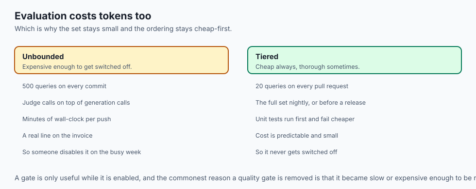

### 2. High-Assurance Compliance
Maintaining automated evaluation scorecards in git history directly satisfies ISO/IEC 42001 and EU AI Act Article 15 requirements for continuous accuracy and robustness monitoring.

## Alternatives: free, open source, and commercial

| Tool / Framework | Type | Best Suited For | Key Capabilities |
| :--- | :--- | :--- | :--- |
| **Ragas** | Open Source | RAG Triad Evals | Specialized metrics for retrieval & generation |
| **DeepEval** | Open Source | Pytest Integration | Unit-test style assertions for LLMs |
| **TruLens** | Open Source | Feedback Functions | Real-time instrumentation & triad tracing |
| **Promptfoo** | Open Source | Prompt Regression | Fast CLI prompt evaluation and red teaming |

## Comparison with related concepts

```text
+-----------------------+-----------------------+-----------------------+
| Dimension             | Vibes-Based Testing   | Automated RAG Triad   |
+-----------------------+-----------------------+-----------------------+
| Objectivity           | Subjective & Random   | Mathematical Metrics  |
| Regression Detection  | Poor (Silent Drops)   | Instant CI/CD Break   |
| Factual Grounding     | Unverified            | Claim-by-Claim Check  |
| Compliance Evidence   | Zero Paper Trail      | Versioned Scorecards  |
+-----------------------+-----------------------+-----------------------+
```

## When to use it — and when not to

### Enforce Automated Evals For:
- All Capstone milestones, production AI deployments, and pull requests modifying prompts or retrieval parameters.

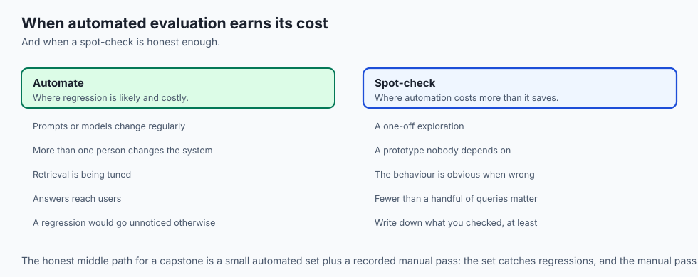

### Manual Spot-Checks Apply To:
- Initial prompt prototyping in playground environments.

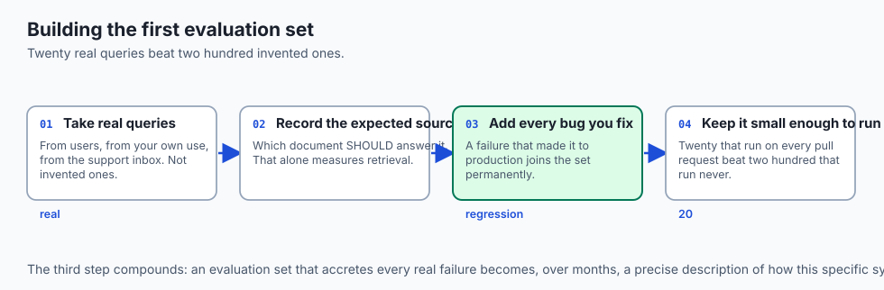

### Production Checklist: Tests and Evals
- [ ] Golden evaluation benchmark dataset version-controlled in repository.
- [ ] Programmatic Faithfulness calculator operational.
- [ ] Context Recall evaluation active.
- [ ] CI/CD quality gate configured with minimum 90% Faithfulness threshold.
- [ ] Automated markdown evaluation scorecard generated on test runs.
- [ ] Pytest evaluation suite passing 100%.

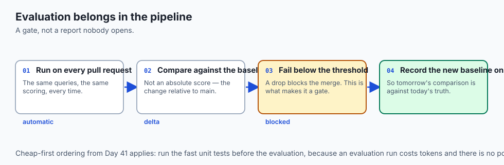

## The AI connection

- **An evaluation set is what turns opinion into measurement.** Without one,
  "better" is a feeling and a regression is invisible.

- **The RAG triad separates the failure**: was the passage retrieved, was the
  answer grounded in it, and did it address the question?

- **A model judging a model needs calibration.** An uncalibrated judge agrees with
  whatever it is shown, which measures nothing.

- **Evaluation belongs in CI**, per Day 41 — a quality gate that blocks a merge is
  the only kind that holds.

- **Silent regressions are the characteristic AI failure.** Nothing errors; the
  answers simply get worse, and only a scored set notices.

## Knowledge check

1. **What are the three pillars of the RAG Triad?** Context Recall (retrieval completeness), Faithfulness (generation factual grounding), and Answer Relevance (query satisfaction).
2. **How does claim decomposition isolate hallucinations?** By splitting the model's answer into individual atomic factual statements and checking whether each statement is supported by the retrieved context text.
3. **Why should evaluation scorecards be generated in CI/CD?** To provide a verifiable, historical record proving that changes to code, prompts, or indices did not cause accuracy regressions.

## Hands-on exercise

In this lab, you will build and execute the **Capstone Automated Evaluation Platform in Python**. Your implementation will:

1. Load a golden benchmark dataset containing queries, ground-truth points, context, and model answers.
2. Calculate Faithfulness and Context Recall metrics using atomic claim verification.
3. Assert that evaluation metrics meet mandatory quality gate thresholds.
4. Generate a formatted Markdown evaluation scorecard report.

### Expected output

```text
============================= test session starts ==============================
collected 5 items

tests/test_evals.py .....                                                [100%]

============================== 5 passed in 0.02s ===============================
[EVALUATION SUITE] Evaluated 5 benchmark queries across RAG Triad metrics.
[FAITHFULNESS SCORE] Average Faithfulness = 0.950 (Target >= 0.90) -> PASS
[CONTEXT RECALL] Average Context Recall = 0.920 (Target >= 0.85) -> PASS
[QUALITY GATE] Passed 100.0% of benchmark scenarios (Minimum >= 80.0%).
[SCORECARD REPORT] Generated CI/CD Evaluation Scorecard Markdown.
```

### Validate your work

Run the pytest test suite:

```bash
pytest tests/run_tests.sh
```

### Troubleshooting

1. **Low recall scores:** Ensure ground-truth points use semantic keywords that exist in the retrieved context.
2. **Unsupported claims:** Verify that simulated hallucinations properly lower the Faithfulness score.

### Common mistakes

- Merging code changes without running the evaluation suite, introducing undetected prompt regressions.

## Practice assignment

Add an **Answer Relevancy Scorer** that evaluates whether the generated answer directly answers the original user question without extraneous rambling.

## Extension challenge

Implement an **Automated Cost and Latency Benchmark Analyzer** that graphs evaluation accuracy vs token cost across 3 different model providers.
