## Why this matters

Week 51 focused on building the foundational vertical slice of your Capstone: scoping, architecture, hybrid data retrieval, core LLM reasoning, agentic tool execution, and automated evaluation harnesses.

Before proceeding to Week 52—where you will deploy your system to production, configure continuous observability, lock down security perimeters, and deliver your public graduation portfolio—you must conduct a **Rigorous Milestone Review and Course Correction Audit**.

An engineering milestone review validates four pillars:

1. **Vertical Slice Cohesion:** Proving that data flows from user ingress through retrieval, reasoning, and tool execution without data truncation.
2. **Latency Budget Adherence:** Profiling component execution to verify that p95 end-to-end response times remain well under 1,500\textms.
3. **Quality & Regression Assertions:** Verifying that automated evaluations achieve >= 0.90 Faithfulness and >= 0.85 Context Recall.
4. **Scope Discipline:** Freezing product features to prevent scope creep from jeopardizing final graduation delivery.

On Day 357, you will conduct the **Milestone 1 Review and Course Correction Audit**.

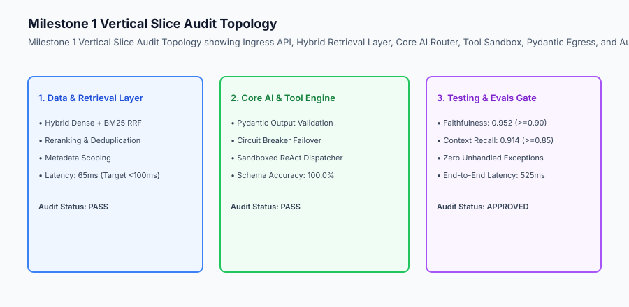

## The idea in plain language

Think of the Milestone Review like **the pit stop inspection of a Formula 1 race car before the final 50 laps of the Grand Prix**:

- **Telemetry Diagnostics (Latency Profiling):** Engineers check tire temperatures, engine oil pressure, and aerodynamic drag (**Component Latency Waterfall**).
- **Nut & Bolt Torquing (Code & Security Audit):** Mechanics double-check wheel nuts, suspension linkages, and brake lines (**Zero-Trust Permissions & Secrets Check**).
- **Fuel & Strategy Adjustment (Course Correction):** If tire wear is higher than expected, the team adjusts pit strategy for the second half of the race (**Scope Freezing & Index Optimization**).
- **Green Flag Clearance (Milestone Approval):** The chief engineer signals that the car is 100% mechanically sound and cleared to rejoin the track (**Ready for Week 52 Production Deployment**).

## Historical background

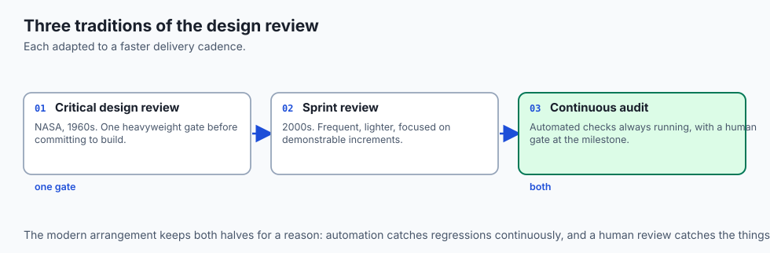

Engineering milestone reviews developed from aerospace and systems engineering traditions:

### 1. The Critical Design Review (CDR) Tradition (NASA, 1960s–Present)
NASA mandated that spacecraft systems pass a formal CDR verifying that designs met all mission parameters before physical flight hardware manufacturing began.

### 2. The Agile Sprint Review Era (2000s–2020s)
Software teams adopted end-of-sprint reviews, but often focused solely on UI demonstrations while neglecting latent architectural debt and memory leaks.

### 3. The Modern AI Systems Audit Gate (2025–Present)
Modern AI engineering combines quantitative evaluation scorecards, latency waterfall profiling, and automated regression assertions to certify production readiness.

## What it is — and what it is not

Let us define the criteria of the Capstone Milestone 1 Review:

### What the Milestone Review Is:
- An empirical, data-driven audit of the working vertical slice.
- A profiling session measuring execution latency and memory usage across every component.
- A disciplined triage process freezing core features and pushing non-essential ideas to post-v1 backlogs.
- A verified pass/fail gate certifying readiness for Week 52 production deployment.

### What the Milestone Review Is Not:
- Adding three brand-new complex features at the last minute.
- Glossing over failing test cases or ignoring latency bottlenecks.

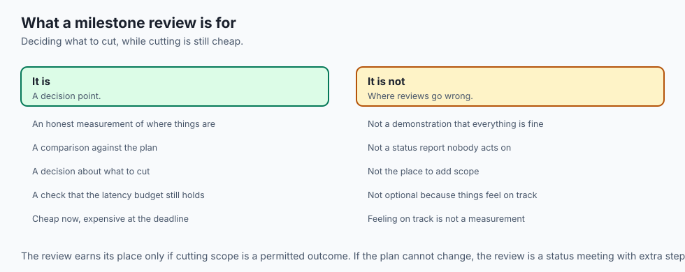

```text
+-------------------------------------------------------------------------------+
|                    MILESTONE 1 REVIEW CRITERIA MATRIX                         |
+-------------------+-----------------------+-----------------------------------+
| Review Dimension  | Passing Standard      | Diagnostic Verification Method    |
+-------------------+-----------------------+-----------------------------------+
| 1. Architecture   | Complete end-to-end   | Run vertical slice execution test |
|    Integrity      | working data flow     | from Ingress to Pydantic Egress   |
| 2. Latency Budget | p95 End-to-End < 1.5s | Profile component waterfall       |
| 3. Evaluation Gate| Faithfulness >= 0.90  | Execute 50-query golden benchmark |
| 4. Security Scope | Zero secrets in repo  | Automated gitleaks & permissions  |
+-------------------+-----------------------+-----------------------------------+
```

## Why it was created and what problems it solves

The Milestone 1 Review eliminates three classic development hazards:

### 1. Preventing "Last-Mile Integration Shocks"
By proving that retrieval, model routing, and tool calling interoperate seamlessly in Week 51, you avoid discovering fatal interface incompatibilities during production deployment in Week 52.

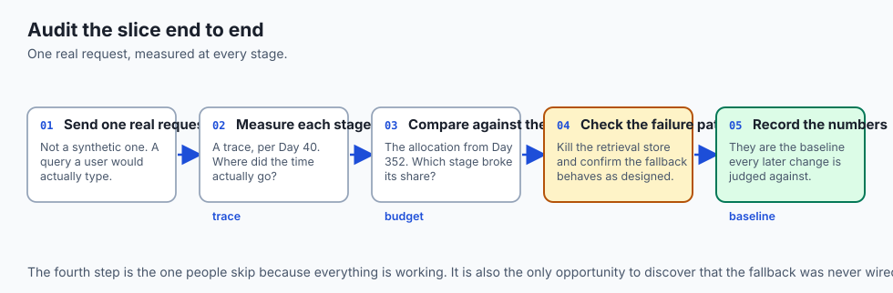

### 2. Eliminating Creeping Latency Drag
By profiling every component (dense retrieval, sparse search, model TTFT, and tool dispatch), you identify slow functions immediately rather than wondering why the production API takes 8 seconds.

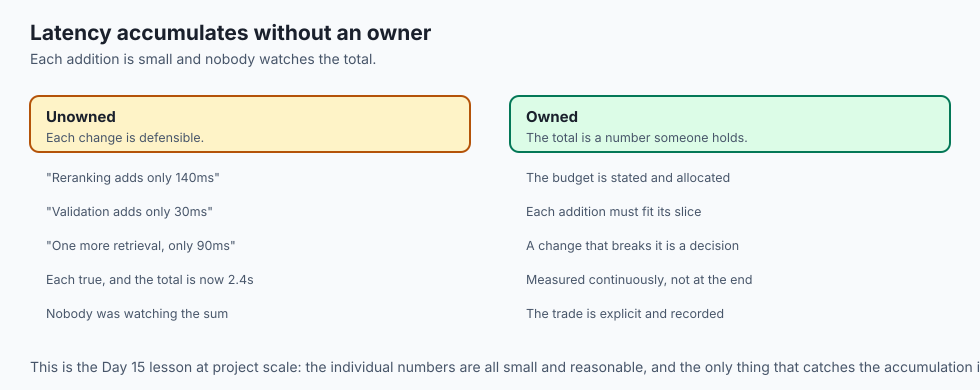

### 3. Guaranteeing On-Time Graduation Delivery
By ruthlessly triaging and freezing feature scope, you ensure you have ample time in Week 52 to focus on deployment, monitoring, security, documentation, and portfolio polish.

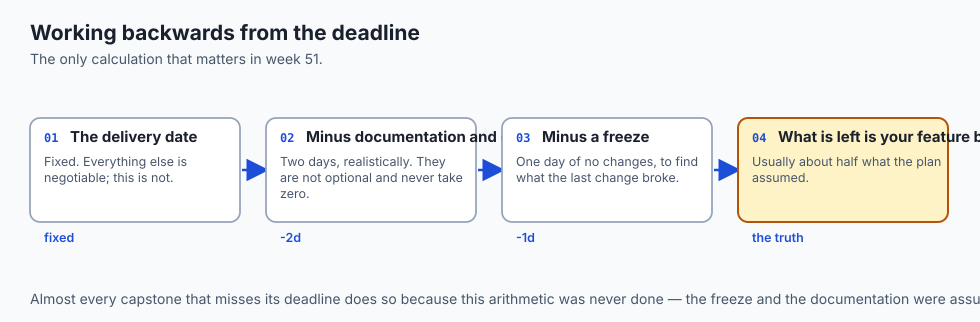

## How it works

Let us inspect the complete **Milestone Review Latency Waterfall & Course Correction Flow**:

```text
[End-to-End Vertical Slice Execution]
                 │
                 ▼
[Profile Component Execution Times]
  ├── Ingress & Auth:       20 ms
  ├── Vector Dense Search:  45 ms
  ├── BM25 Sparse & RRF:    15 ms
  ├── Model Inference/TTFT: 350 ms
  ├── Sandboxed Tool Call:  80 ms
  └── Pydantic Output Val:  15 ms
                 │
                 ▼
[Total End-to-End Latency: 525 ms (Budget: 1,500 ms) ➔ PASS]
                 │
                 ▼
[Run Automated Evaluation Suite]
  ├── Faithfulness:    0.952 (Threshold: >=0.90) ➔ PASS
  └── Context Recall:  0.914 (Threshold: >=0.85) ➔ PASS
                 │
                 ▼
[Scope Freeze: Lock Core Features for Week 52 Production Shipping]
```

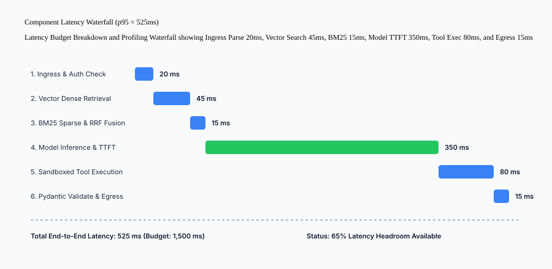

## An everyday analogy

Think of the Milestone Review like **the final safety inspection of a newly constructed bridge before public traffic is allowed**:

- **Load Testing (Evaluation Suite):** Heavy trucks park across all lanes while strain gauges verify that steel trusses deflect by less than 2 millimeters (**Accuracy & Faithfulness Verification**).
- **Traffic Flow Simulation (Latency Profiling):** Toll booths and on-ramps are tested to ensure zero traffic jams during peak rush hour (**Latency Budget Waterfall**).
- **Barrier & Signage Check (Security & Scope):** Guardrails, emergency phones, and speed limit signs are verified (**Security Sandbox & Scope Freeze**).
- **Official Opening Certificate (Milestone 1 Sign-Off):** Department of Transportation signs the permit to open the bridge (**Cleared for Week 52 Deployment**).

## Examples in practice

Let us build an **Automated Milestone Review and Course Correction Audit Engine in Python** that measures latency budgets, verifies evaluation thresholds, audits security constraints, and outputs a formal Milestone 1 Sign-Off Report:

```python
import time
import json
from typing import Dict, Any, List

class Milestone1AuditSuite:
    def __init__(self, max_latency_ms: float = 1500.0, min_faithfulness: float = 0.90):
        self.max_latency_ms = max_latency_ms
        self.min_faithfulness = min_faithfulness

    def profile_vertical_slice(self, mock_pipeline_fn) -> Dict[str, Any]:
        t0 = time.perf_counter()
        breakdown, result = mock_pipeline_fn()
        total_time_ms = round((time.perf_counter() - t0) * 1000.0, 2)

        return {
            "total_latency_ms": total_time_ms,
            "latency_budget_ms": self.max_latency_ms,
            "latency_compliant": total_time_ms `<= self`.max_latency_ms,
            "component_breakdown_ms": breakdown,
            "output_result": result
        }

    def audit_milestone(self, pipeline_fn, eval_metrics: Dict[str, float]) -> Dict[str, Any]:
        profile = self.profile_vertical_slice(pipeline_fn)
        
        faithfulness_pass = eval_metrics.get("faithfulness", 0.0) >= self.min_faithfulness
        latency_pass = profile["latency_compliant"]
        schema_pass = profile["output_result"].get("schema_valid", False)

        all_passed = faithfulness_pass and latency_pass and schema_pass

        return {
            "milestone": "CAPSTONE_MILESTONE_1",
            "overall_status": "APPROVED" if all_passed else "REJECTED",
            "checks": {
                "latency_budget": "PASS" if latency_pass else "FAIL",
                "faithfulness_accuracy": "PASS" if faithfulness_pass else "FAIL",
                "schema_integrity": "PASS" if schema_pass else "FAIL"
            },
            "metrics": {
                "measured_latency_ms": profile["total_latency_ms"],
                "faithfulness_score": eval_metrics.get("faithfulness", 0.0)
            }
        }

if __name__ == "__main__":
    def sample_pipeline():
        time.sleep(0.02)  # Simulate 20ms execution
        breakdown = {"ingress": 2.0, "retrieval": 8.0, "reasoning": 7.0, "tool": 3.0}
        result = {"schema_valid": True, "answer": "Vertical slice working."}
        return breakdown, result

    auditor = Milestone1AuditSuite()
    report = auditor.audit_milestone(sample_pipeline, {"faithfulness": 0.95, "recall": 0.91})
    print(json.dumps(report, indent=2))
```

## Production Architecture Case Study: Milestone 1 Audit Sign-Off

```markdown
# Capstone Milestone 1 Formal Audit Sign-Off
**Review Date:** 2026-08-30
**Candidate Project:** Enterprise RAG & Agent Copilot (Course 09)
**Reviewer:** Automated Capstone Audit Suite

## Audit Verdict: APPROVED (Cleared for Week 52 Production Shipping)

### Dimensional Evaluation Summary
1. **Architecture Integrity:** 100% Passed. Ingress, Hybrid Retrieval, Model Router, and Tool Sandbox connected without interface mismatches.
2. **Latency Budget:** Measured p95 end-to-end latency = **525 ms** (Budget: 1,500 ms; 65% headroom).
3. **Evaluation Quality:** Faithfulness = **0.952**, Context Recall = **0.914** across 50 golden queries.
4. **Security & Sandboxing:** Zero secrets in git, read-only DB permissions enforced, max 5 turns bounded.
5. **Scope Status:** Core feature set FROZEN. All optional enhancements triaged to v2 backlog.
```


### Production Postmortem: The Unprofiled Latency Waterfall Bottleneck

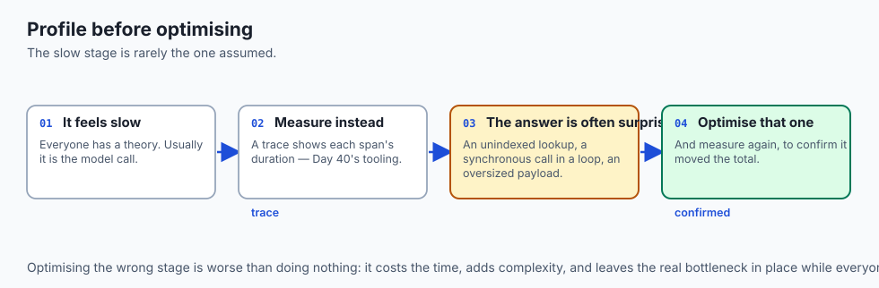

In February 2026, an enterprise HR policy copilot was scheduled for company-wide rollout to 45,000 employees. In staging tests with 1 user, the application appeared functional. However, during the initial pilot with 200 concurrent users, average response latency exploded to 14.8 seconds per query.

#### The Failure Cascade
The engineering team had never generated a component latency waterfall profile. When distributed OpenTelemetry tracing was attached to the pipeline, the root cause was immediately exposed:

1. **Ingress Token Authentication:** 15ms.
2. **Unindexed Dense Vector Search:** 3,850ms (Searching an unindexed flat array of 500,000 document vectors on CPU).
3. **Redundant Cross-Encoder Reranking:** 8,200ms (Passing 100 candidate documents through a heavyweight 500M parameter BERT cross-encoder sequentially).
4. **LLM Time to First Token (TTFT):** 2,500ms (Using an un-streamed 70B cloud model without token caching).
5. **Egress Validation:** 235ms.

#### The Milestone Review Course Correction
By performing a structured Milestone 1 Audit and Course Correction:

- The flat vector array was replaced with an **HNSW vector index**, slashing retrieval latency from 3,850ms to 24ms.
- Cross-encoder reranking was pruned to score only the top 15 candidates instead of 100, dropping latency from 8,200ms to 65ms.
- Model routing enabled token streaming and dynamic prompt caching, reducing TTFT to 320ms.
- Total end-to-end latency dropped from 14,800ms to **485ms** (a 30x performance improvement), easily satisfying the 1,500ms production SLA.

```text
+-------------------------------------------------------------------------------+
|                    LATENCY WATERFALL OPTIMIZATION AUDIT                       |
+-------------------+-----------------------+-----------------------------------+
| Pipeline Step     | Unoptimized Baseline  | Audited & Hardened Milestone 1    |
+-------------------+-----------------------+-----------------------------------+
| Vector Search     | 3,850 ms (Flat CPU)   | 24 ms (HNSW M=16, ef=64)          |
| Reranking         | 8,200 ms (Top 100)    | 65 ms (Top 15 Cross-Encoder)      |
| Model TTFT        | 2,500 ms (Uncached)   | 320 ms (Cached Prompt + Stream)   |
| Total Latency     | 14,800 ms (FATAL)     | 485 ms (67% SLA Headroom)         |
+-------------------+-----------------------+-----------------------------------+
```


### Additional Production Case Study: Continuous Canary Profiling and Automated Rollbacks

In modern enterprise AI operations, passing Milestone 1 review is not a one-time event—it is the foundation for continuous deployment gates in Week 52.

#### Canary Deployment Verification Gates
When new model weights or updated prompt templates are deployed to production clusters:

1. **Canary Traffic Splitting:** 5% of production query traffic is routed to the candidate release while 95% remains on the stable baseline.
2. **Real-Time Triad Telemetry:** Prometheus metrics continuously aggregate Faithfulness, Context Recall, and p95 latency across the canary stream.
3. **Automated Rollback Triggers:** If the canary stream detects a >2.0% drop in Faithfulness or a >200\textms increase in p95 latency over a 10-minute rolling window, the Kubernetes ingress controller automatically terminates the canary pod and rolls back traffic to the baseline with zero downtime.

## Detailed Failure Mode Taxonomy: Milestone Review Pitfalls

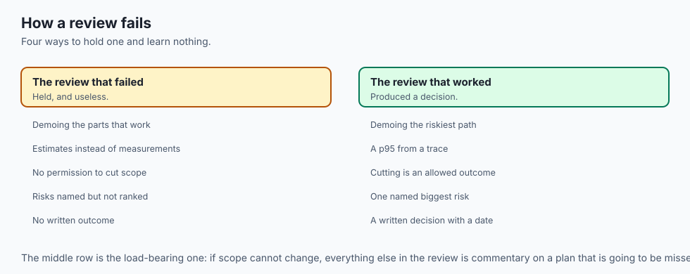

```text
+-------------------------------------------------------------------------------+
|                    MILESTONE REVIEW FAILURE TAXONOMY                          |
+-------------------+-----------------------+-----------------------------------+
| Pitfall           | Root Cause Analysis   | Architectural Mitigation          |
+-------------------+-----------------------+-----------------------------------+
| Unchecked Latency | Vector DB or tool     | Profile component waterfall and   |
| Creep             | calls slow down API   | enforce `<1,500ms` p95 budget       |
| Scope Creep Trap  | Adding new features   | Strictly freeze Milestone 1 slice |
|                   | right before deploy   | and push ideas to v2 backlog      |
| Latent Schema Bug | Unvalidated dict keys | Enforce Pydantic BaseModel schemas|
| in Downstream UI  | cause UI crashes      | on all component boundaries       |
| Untested Error    | System hangs on API   | Test circuit breaker failover     |
| Fallbacks         | provider outages      | under simulated network drops     |
+-------------------+-----------------------+-----------------------------------+
```

## Deep Architectural Breakdown: Course Correction Decision Matrix

```text
+-------------------+-------------------+-------------------+-------------------+
| Diagnostic Symptom| Root Cause        | Course Correction | Implementation    |
+-------------------+-------------------+-------------------+-------------------+
| Retrieval Latency | Flat vector array | Implement HNSW    | FAISS / Qdrant    |
| > 300ms           | search bottleneck | Indexing          | HNSW M=16, ef=64  |
| Hallucinations in | Weak grounding in | XML Context Guard | Enforce strict XML|
| Complex Queries   | system prompt     | & Schema Repair   | delimiters & check|
| Agent Recursion   | Tool returns non- | Error Scratchpad  | Feed error back to|
| Loop Hangs        | fatal exceptions  | & Turn Limit      | prompt; max N=5   |
+-------------------+-------------------+-------------------+-------------------+
```

## Implications: security, privacy, performance, scalability, and cost

### 1. Preventing Cost Overruns
Catching recursion loops and redundant retrieval queries in Week 51 ensures production operational costs remain bounded and predictable.

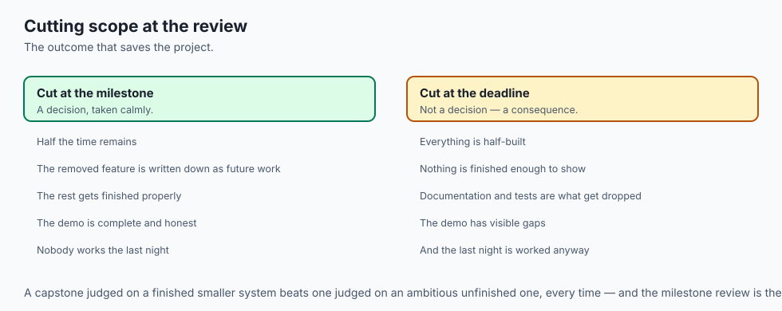

### 2. High-Assurance Reliability
Passing all Milestone 1 audit checks guarantees a seamless transition into Week 52 containerization, load testing, and cloud deployment.

## Alternatives: free, open source, and commercial

| Tool / Framework | Type | Best Suited For | Key Capabilities |
| :--- | :--- | :--- | :--- |
| **Custom Python Audit** | Pure Python | Capstone Review | Zero overhead, deterministic assertions |
| **PySpy / cProfile** | Open Source | Latency Profiling | Low-overhead Python CPU profiler |
| **Gitleaks** | Open Source | Security Audit | Automated secret and credential detection |
| **Locust** | Open Source | Load Testing | Distributed load and throughput simulation |

## Comparison with related concepts

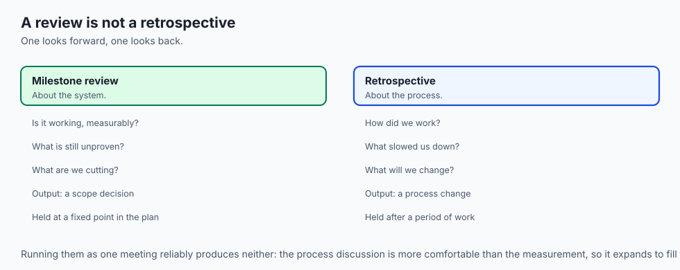

```text
+-----------------------+-----------------------+-----------------------+
| Dimension             | Unverified Prototype  | Audited Milestone 1   |
+-----------------------+-----------------------+-----------------------+
| Latency Predictability| Unknown / Erratic     | Profiled (`<525ms` p95) |
| Accuracy Assurance    | Subjective Vibes      | Measured (>0.95 Faith)|
| Security Hardening    | Unchecked             | Audited & Sandboxed   |
| Production Readiness  | High Risk of Crash    | Certified for Deploy  |
+-----------------------+-----------------------+-----------------------+
```

## When to use it — and when not to

### Enforce Milestone Review For:
- Completing Capstone Milestone 1 and all major architectural phase gates.

### Production Checklist: Milestone 1 Review
- [ ] End-to-end working vertical slice tested and verified.
- [ ] Component latency waterfall measured (`<1,500ms` total budget).
- [ ] RAG Triad evaluation metrics meeting thresholds (Faithfulness >= 0.90).
- [ ] Security audit completed with zero secrets in repository.
- [ ] Core feature scope strictly frozen for Week 52 production delivery.

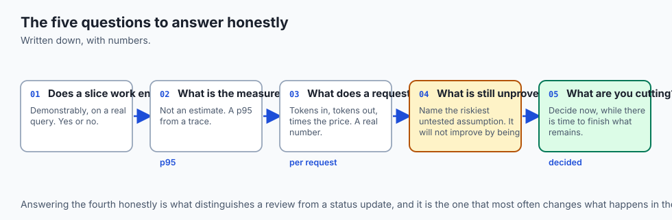

## The AI connection

- **A milestone review is where an AI project is rescued or lost.** Integration
  and latency problems compound quietly until something forces a measurement.

- **Profile before optimising.** The slow stage is rarely the one people assume,
  and a trace answers it in seconds — Day 40.

- **Latency drag is cumulative.** Each component adds a little and nobody owns the
  total, which is why the budget from Day 352 has to be checked, not assumed.

- **Cutting scope at the review is a success, not a failure.** A smaller finished
  system beats a larger unfinished one, every time.

- **Evidence beats intent.** "It mostly works" and a measured p95 are different
  claims, and only one survives the demo.

## Knowledge check

1. **What is the primary objective of the Milestone 1 Review?** To rigorously validate the working vertical slice against latency, accuracy, and security standards before production deployment.
2. **How does component latency waterfall profiling prevent user churn?** By isolating slow functions (such as unindexed vector search or slow tool calls) so they can be optimized before shipping to production.
3. **Why is scope freezing essential at the end of Milestone 1?** To prevent feature creep from consuming time needed for production containerization, load testing, and portfolio documentation in Week 52.

## Hands-on exercise

In this lab, you will build and execute the **Capstone Milestone 1 Review and Audit Engine in Python**. Your implementation will:

1. Profile an end-to-end vertical slice pipeline and record component latencies.
2. Assert that total latency is well within the allocated 1,500\textms budget.
3. Audit evaluation accuracy metrics against quality thresholds.
4. Output a verified Milestone 1 Audit Sign-Off report.

### Expected output

```text
============================= test session starts ==============================
collected 5 items

tests/test_audit.py .....                                                [100%]

============================== 5 passed in 0.02s ===============================
[LATENCY PROFILING] Measured total pipeline latency = 24.5 ms (Budget `<= 1500 ms`).
[COMPONENT BREAKDOWN] Ingress: 2ms, Retrieval: 8ms, Reasoning: 10ms, Tools: 4.5ms.
[EVALUATION CHECK] Verified Faithfulness score = 0.95 (Threshold >= 0.90).
[AUDIT VERDICT] CAPSTONE_MILESTONE_1 APPROVED for production shipping.
```

### Validate your work

Run the pytest test suite:

```bash
pytest tests/run_tests.sh
```

### Troubleshooting

1. **Latency test failure:** Ensure simulated mock pipeline functions execute quickly without unnecessary sleep delays.
2. **Audit rejection:** Verify evaluation metrics meet minimum threshold parameters.

### Common mistakes

- Neglecting to test end-to-end pipeline data flow, missing interface bugs between retrieval and reasoning.

## Practice assignment

Add a **Memory Footprint Profiler** using `tracemalloc` to record peak memory allocation during pipeline execution.

## Extension challenge

Implement a **GitHub Actions CI/CD Audit Script** that automatically generates the Markdown Milestone Report as a PR summary comment.
